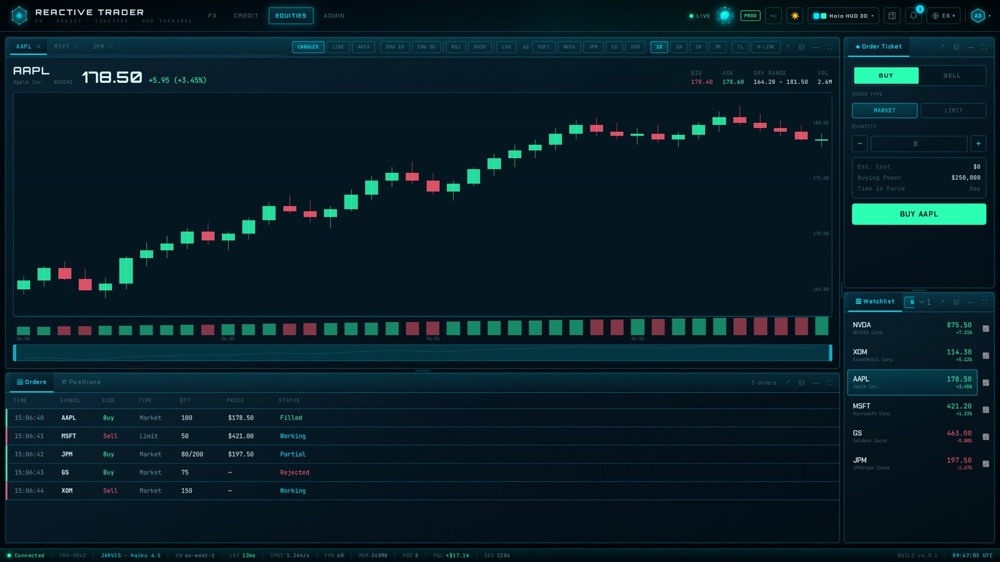
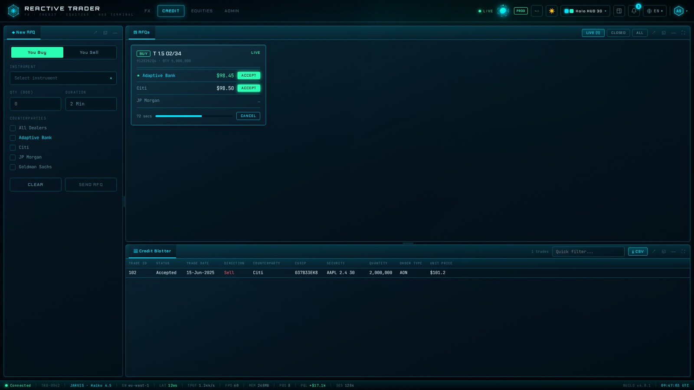
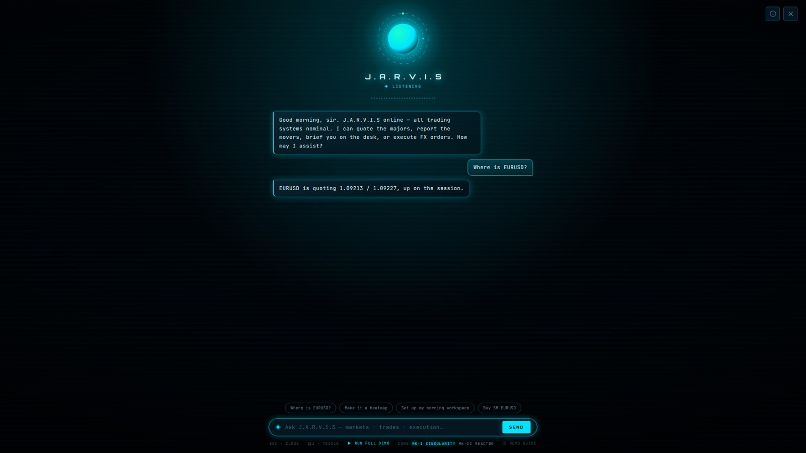
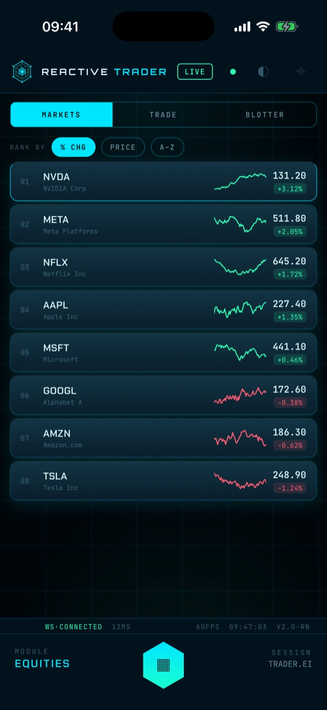
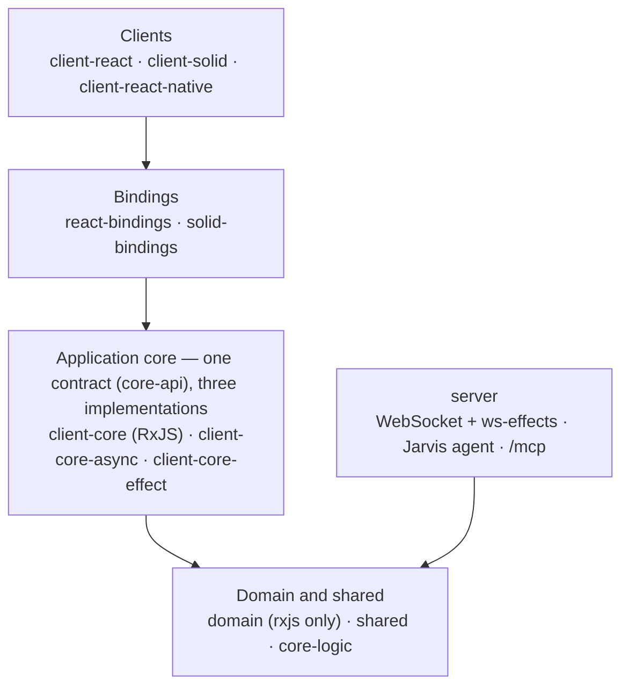

# Reactive Trader — Clone

**A real-time, multi-asset trading desk — FX, credit RFQs and equities — rebuilt
from scratch as a showcase of clean architecture, spec-driven development and
AI-assisted engineering.**

One framework-free application core drives **three clients** — React, SolidJS
and React Native — and that core itself comes in **three interchangeable
implementations** (RxJS, async/await, Effect-TS), all held to the same
behavioural contract. Inspired by
[Adaptive's ReactiveTraderCloud](https://github.com/AdaptiveConsulting/ReactiveTraderCloud).


## Live demo

| Client | URL | Stack |
|---|---|---|
| **Web — React** | **<https://rtc-clone-react.vercel.app>** | React 19 + Vite |
| **Web — SolidJS** | **<https://rtc-clone-solid.vercel.app>** | SolidJS + Vite — same UI, same pixel goldens |
| Backend | `wss://rtc-clone-server.fly.dev` ([health](https://rtc-clone-server.fly.dev/health)) | Node WebSocket server on Fly.io (London) |

Open the React and Solid builds side by side: they are the **same product**,
sharing one application core and one test contract, and asserted against the
**same pixel goldens** — the only difference is the UI framework underneath.
Both stream live from the same server.

> The deployed demo is behind a per-user login (there is no public password).
> To try it with zero setup, run it locally in simulator mode — see
> [Quick start](#quick-start) — and sign in with the committed demo accounts.
> Deploys are on demand, so the live sites can trail `main` slightly.

## Screenshots

### Web

| | |
|---|---|
|  |  |
| **Equities** — candles with indicators, order ticket, watchlist, orders blotter | **Credit** — multi-dealer RFQs with live quotes, countdown and accept |
|  |  |
| **J.A.R.V.I.S.** — an AI assistant that quotes, briefs and trades on the desk | **Skins** — five skins (Classic, Terminal, Holo HUD, and two 3D variants), each light or dark |

### Mobile (iOS, React Native / Expo)

| Rates | Equities | Credit | Analytics |
|:---:|:---:|:---:|:---:|
|  |  |  |  |

Every screenshot above is a committed **visual-regression golden** from the test
suite, not a hand-staged marketing shot — the web ones from
`packages/ui-contract/goldens/`, the mobile ones from
`packages/client-react-native/tests/visual/`.

## What's inside

**The product**

- **FX** — streaming price tiles and a watchlist, one-click execution, a live
  blotter, P&L and position analytics.
- **Credit** — request-for-quote workflow: build an RFQ, collect competing
  dealer quotes against a countdown, accept the best; plus a sell-side view.
- **Equities** — interactive candlestick charts (indicators, comparisons,
  drawing tools), order ticket, watchlist, depth, orders and positions.
- **Admin** — an observability console: throughput, latency, service topology,
  sessions, live events, and incident injection to watch the system degrade.
- **J.A.R.V.I.S.** — an AI assistant backed by Claude (or a deterministic
  scripted brain offline) that can quote, brief, lay out your workspace and
  execute confirm-gated trades through a typed tool registry — also exposed to
  external agents over an **MCP** endpoint.
- **Dockable workspace** — drag, tab, float, maximize and collapse panels;
  save layout presets.
- **A HUD you can tune** — five skins × light/dark, animated 3D boot scenes, and
  a power-saver mode down to a fully motion-free *freeze*.
- **Custom DevTools** — a Redux-DevTools-style inspector for the non-Redux state
  layer (presenters, state machines, wire traffic), in-app at `/devtools/` or as
  a Chrome extension that attaches to any running build, including production.

**The engineering**

> This is a concept project, not a product. Its purpose is to demonstrate — end
> to end, on a non-trivial domain — how four practices reinforce each other:
>
> - **Clean architecture** — strict dependency inversion, ports & adapters, a
>   pure domain core that depends on nothing but RxJS.
> - **Spec-driven development** — behaviour is captured as executable
>   specifications first; the implementation is built to satisfy them.
> - **Redundant verification** — the same behaviour is checked by independent
>   test runners, a shared UI contract, pixel goldens and 40+ architectural
>   gates, so the test suite itself becomes an artifact you can trust.
> - **AI-assisted development** — the codebase was built in close collaboration
>   with an AI coding agent, and the structure above is exactly what makes that
>   safe: tight contracts, fast feedback, and verification that doesn't depend
>   on a human reading every line.

What that buys, concretely:

- **Swap the UI framework** — `@rtc/client-solid` is a full port of the React
  client that passes the *same* behavioural specs, e2e suites and pixel goldens.
- **Swap the application core** — the RxJS core, an async/await +
  AsyncIterable core and an Effect-TS core implement one types-only contract
  (`@rtc/core-api`) and pass one contract suite; pick one with `VITE_CORE_IMPL`
  ([ADR-006](docs/adr/ADR-006-pluggable-application-core.md)).
- **Swap the data source** — every client runs against an in-process simulator,
  a local server or the deployed one, chosen at composition time.
- **Enforce the architecture, don't just describe it** — dependency-cruiser
  rules, pnpm strict mode and grep gates fail CI on any layering violation.

## Architecture at a glance

A [pnpm](https://pnpm.io/) + [Turborepo](https://turbo.build/) monorepo of 25
packages. Dependencies flow **inward only**:



The clients and the server never import each other; the domain's only runtime
dependency is RxJS; the alternative cores never depend on the RxJS core at
runtime. Any framework (React, RxJS, Vite, Vitest…) is meant to be replaceable
by changing only its own package.

<details>
<summary>All 25 packages</summary>

```
packages/
  # Inner layers — framework-free
  domain/              @rtc/domain              Entities, use cases, port interfaces, simulators. Only runtime dep: rxjs.
  shared/              @rtc/shared              DTOs, wire protocol, the scripted Jarvis brain. Depends on domain.
  ws-effects/          @rtc/ws-effects          Small declarative RxJS effects framework. rxjs only.
  motion-core/         @rtc/motion-core         View-layer motion math (FLIP, easing). No dependencies at all.
  agent-tools/         @rtc/agent-tools         The Jarvis desk-tool registry (JSON Schema + handlers). Depends on domain.

  # Application core — pluggable, three implementations of one contract
  core-api/            @rtc/core-api            Types-only contract every core implements.
  core-logic/          @rtc/core-logic          Rules the three cores share that need no stream library.
  client-core/         @rtc/client-core         The RxJS core (the default): presenters, state machines, adapters.
  client-core-async/   @rtc/client-core-async   Alternative core on async/await + AsyncIterable.
  client-core-effect/  @rtc/client-core-effect  Alternative core on Effect-TS.
  core-contract/       @rtc/core-contract       Dev-only behavioural suites all three cores must pass.

  # Clients and their bindings
  react-bindings/      @rtc/react-bindings      React <-> RxJS bridge (createViewModel, useMachine).
  solid-bindings/      @rtc/solid-bindings      Solid <-> RxJS bridge.
  client-react/        @rtc/client-react        Web client: React 19 + Vite.
  client-solid/        @rtc/client-solid        Web client: SolidJS port at full parity.
  client-react-native/ @rtc/client-react-native Mobile client: Expo / React Native.
  client-prototype/    @rtc/client-prototype    Readable React port of the v2 design prototype. Isolated.
  boot-splash/         @rtc/boot-splash         Canvas boot/splash engine shared by both web clients.
  layout-dockview/     @rtc/layout-dockview     Dockview wrapper behind the layout-engine preference.
  ui-contract/         @rtc/ui-contract         Framework-neutral UI test contract + visual goldens.

  # Server and tooling
  server/              @rtc/server              Native WebSocket + ws-effects backend, plus the /mcp endpoint.
  devtools-core/       @rtc/devtools-core       Devtools event protocol + hub. rxjs only.
  devtools-app/        @rtc/devtools-app        Inspector SPA, served at /devtools/.
  devtools-extension/  @rtc/devtools-extension  MV3 Chrome DevTools extension around the inspector.
  devtools-relay/      @rtc/devtools-relay      Dev-machine WebSocket relay for the React Native inspector.
```

[`CLAUDE.md`](CLAUDE.md) has the full per-package description and dependency rules.

</details>

## Quick start

Requires **Node.js 26** and **pnpm 12** (pinned via `packageManager`; see the
[development guide](docs/development.md#prerequisites) for Corepack setup).

```bash
git clone https://github.com/bettersoftware-io/ReactiveTraderCloudClone.git
cd ReactiveTraderCloudClone
pnpm install
pnpm build
pnpm dev            # React web client, simulator mode → http://localhost:5173
```

Sign in as `astark`, `nromanoff`, `tchalla` or `demo` — password `mcdc2026`
(committed demo-only accounts, see [`docs/authentication.md`](docs/authentication.md)).
No backend needed: with no server URL set, the client runs against in-process
domain simulators.

More ways to run it:

```bash
pnpm dev:solid          # the SolidJS client instead          → http://localhost:5473
pnpm dev:react:fs       # full stack: WebSocket server + React client
pnpm dev:react:effect   # React client on the Effect-TS core (also :async, and dev:solid:*)
pnpm dev:ios            # React Native client on the iOS simulator
pnpm dev:devtools       # the state inspector
```

Every client has the same four data-source modes — `:sim`, `:ws:local`,
`:ws:remote`, `:fs`. The [development guide](docs/development.md) covers them
all, plus choosing an application core, the test stack and deploying.

## Tests & verification

```bash
pnpm typecheck       # tsc across every package
pnpm test            # unit + contract tests (Vitest) across every package
pnpm test:e2e        # architectural gates, then every e2e suite in parallel
pnpm test:ui:visual  # pixel-golden visual regression
```

The same user-facing behaviour is exercised by browser runners against **both**
web clients, a pure-Node presenter runner, full-stack smokes against the real
server, a framework-neutral UI contract, pixel goldens shared by React and
Solid, a behavioural contract every application core must pass, and 40+
architectural gates. See the [development guide](docs/development.md#checks--tests)
and [§9 Test strategy](docs/architecture/09-test-strategy.md).

## Documentation

- [`docs/README.md`](docs/README.md) — **documentation map**: every doc grouped by purpose. Start here.
- [`docs/development.md`](docs/development.md) — running, testing and deploying, in full.
- [`docs/architecture.md`](docs/architecture.md) — layers, ports, data flow, sequence diagrams.
- [`docs/adr/`](docs/adr/) — architecture decision records.
- [`docs/STATUS.md`](docs/STATUS.md) — the pending-work backlog; [`docs/IDEAS.md`](docs/IDEAS.md) is the icebox upstream of it.
- [`docs/DEPLOY.md`](docs/DEPLOY.md) — how the Vercel + Fly.io demo is deployed.
- [Project site](https://bettersoftware-io.github.io/ReactiveTraderCloudClone/) — presentations and the coverage report.
