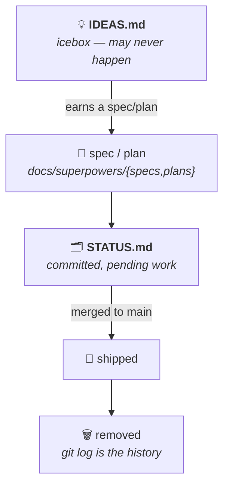

# Ideas — Icebox

> Speculative ideas and wishlist items — things worth writing down before they're
> forgotten, but **not yet committed to**. No spec, no plan, may never happen.
>
> This is the *upstream* of [`STATUS.md`](STATUS.md). When an idea earns a spec
> or plan, **move** it out of here into `STATUS.md` (with a link to its plan) —
> don't leave it in both places. This file only ever holds things that have *not*
> graduated. For the full document map, see [`README.md`](README.md).

An idea's lifecycle:

---

## Tooling & workflow

### Adopt a GitHub merge queue

Replace the manual "assess catch-up risk" triage in the
[`shipping-repo-changes`](../.claude/skills/shipping-repo-changes/SKILL.md) skill
(Rule 3) with GitHub's **merge queue** — the equivalent of GitLab's merge trains.

**Why:** concurrent Claude sessions + auto-pushing `main` mean a branch that's
green can go stale before it merges. Today we handle that by hand (triage the
incoming diff; catch up only on overlap). A merge queue does it structurally:
when you'd merge, GitHub instead builds a temporary branch of `main` + everything
ahead of you in the queue + your PR, runs the required checks against *that*
combined state, and merges in order only if green. The cat-and-mouse loop
disappears — it's pipelined, not retried.

**What it would take / caveats for this repo:**
- Requires **branch protection with required status checks** on `main`. That's a
  policy shift: today there's no review gate and merges go through the API
  immediately (Rule 4), and local `main` *auto-pushes to origin* — direct pushes
  bypass a queue entirely, so we'd have to commit to "all changes to `main` go
  through a PR + queue."
- The repo's fine-grained PAT **403s on `gh pr checks` / `statusCheckRollup`**
  (see Rule 2); merge queue leans on those same check-rollup APIs, so expect
  tooling friction to resurface.
- Merge queue is available for public repos and Team/Enterprise orgs.

**Next step if we pursue it:** a proper brainstorm — this is a workflow policy
change, not a quick config toggle.
