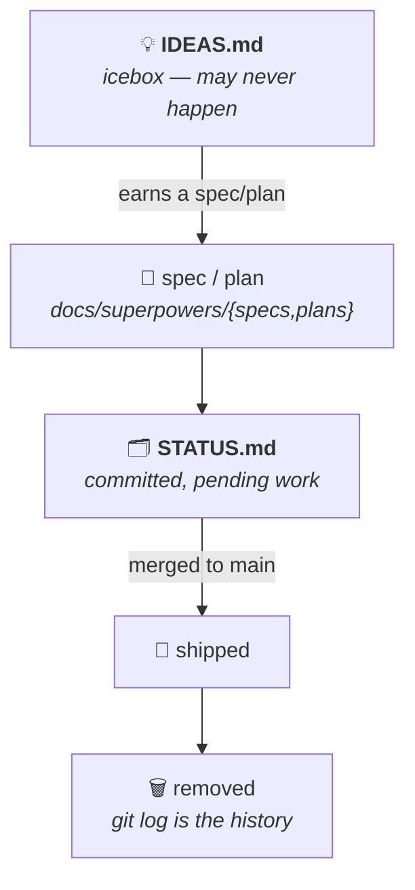

# Ideas — Icebox

> Speculative ideas and wishlist items — things worth writing down before they're
> forgotten, but **not yet committed to**. No spec, no plan, may never happen.
>
> This is the *upstream* of [`STATUS.md`](STATUS.md). When an idea earns a spec
> or plan, **move** it out of here into `STATUS.md` (with a link to its plan) —
> don't leave it in both places. This file only ever holds things that have *not*
> graduated. For the full document map, see [`README.md`](README.md).

An idea's lifecycle:

```mermaid
flowchart TD
    I["💡 <b>IDEAS.md</b><br/><i>icebox — may never happen</i>"]
    S["📝 spec / plan<br/><i>docs/superpowers/{specs,plans}</i>"]
    T["🗂️ <b>STATUS.md</b><br/><i>committed, pending work</i>"]
    D["🚀 shipped"]
    G["🗑️ removed<br/><i>git log is the history</i>"]

    I -->|earns a spec/plan| S
    S --> T
    T -->|merged to main| D
    D --> G
```

---

## Tooling & workflow

### Adopt a GitHub merge queue

Replace the manual "assess catch-up risk" triage in the
[`shipping-repo-changes`](../.claude/skills/shipping-repo-changes/SKILL.md) skill
(Rule 3) with GitHub's **merge queue** — the equivalent of GitLab's merge trains.

**Why:** concurrent Claude sessions merging into `main` mean a branch that's
green can go stale before it merges. Today we handle that by hand (triage the
incoming diff; catch up only on overlap). A merge queue does it structurally:
when you'd merge, GitHub instead builds a temporary branch of `main` + everything
ahead of you in the queue + your PR, runs the required checks against *that*
combined state, and merges in order only if green. The cat-and-mouse loop
disappears — it's pipelined, not retried.

> **RESOLVED 2026-07-26 — not available to this repo. Do not re-plan this
> without first transferring the repo to an organization.** GitHub merge queue
> requires an **org-owned** repository. This repo is owned by a *user* account
> (`owner.type: "User"`, verified via the API); public visibility is not
> sufficient. GitHub's GA changelog: *"Merge queue is available on private and
> public repos on the GitHub Enterprise Cloud plan and all public repos owned by
> **organizations**."* A GitHub staff reply in
> [community #51483](https://github.com/orgs/community/discussions/51483) says
> the same, and that thread runs to June 2026 with the personal-account question
> still unanswered — no quiet expansion. The measurement below still stands, but
> it is no longer the deciding factor: **repo ownership is.**
>
> *Evidence limit, stated honestly:* the decisive probe — `POST /rulesets` with a
> `merge_queue` rule — was not run (it writes repo settings). This rests on
> ownership type plus GitHub's own documentation, not on an API rejection.

**Status (2026-07-26): brainstormed, deferred on cost — then found unavailable.** See the
[design spec](superpowers/specs/2026-07-26-catchup-triage-and-merge-queue-design.md).
Measuring first inverted the case, and two caveats previously recorded here were
found to be **stale**:

- ~~"Requires branch protection with required status checks; today there's no
  review gate"~~ — **already in place.** An active ruleset on `main` (no bypass
  actors) requires a PR, restricts merges to `allowed_merge_methods: ["merge"]`,
  and requires both CI jobs. `required_approving_review_count` is `0`, which
  keeps Rule 4's no-human-gate policy working.
- ~~"local `main` auto-pushes to origin, so direct pushes bypass a queue"~~ —
  **not true in this checkout.** `.git/hooks` holds only Git LFS hooks; that
  behaviour is specific to the sandbox environment. Direct pushes to `main` are
  already impossible.

**What actually deferred it:** a queue charges a CI run on *every* merge, where
**71% of merges pay nothing today** (green branch, disjoint diff, merge as-is).
The tax it would replace measured at only ~2.9 min/PR (17 of 59 merges needed a
catch-up, median CI 10.1 min) — and **53% of that came from one file**,
`docs/STATUS.md`, fixed for free by sharpening Rule 3 instead.

**Both open questions are now answered (2026-07-26)** — and neither survived as
a reason to revisit:

- ~~"whether merge queue is available on a **user-owned** public repo"~~ —
  **answered: it is not.** Org ownership is required; see the RESOLVED box
  above. This is the blocker.
- ~~"this repo's fine-grained PAT `403`s on `gh pr checks` / `statusCheckRollup`,
  which merge queue leans on"~~ — **not a repo or API limitation at all.** It was
  a property of *which token was loaded*. On the host OAuth token (`gho_`, `repo`
  scope) `gh pr checks` exits 0 and `statusCheckRollup` returns `SUCCESS`. The
  403 came from the under-scoped fine-grained PAT the sandbox injects from
  `.github/.token`. Even had a queue been available, this would not have
  obstructed it.

**Revisit only if** the repo moves to an organization. The catch-up rate is no
longer a trigger — it cannot unblock an unavailable feature. If ownership does
change, the measurement in the spec is the right next step, not this note.
