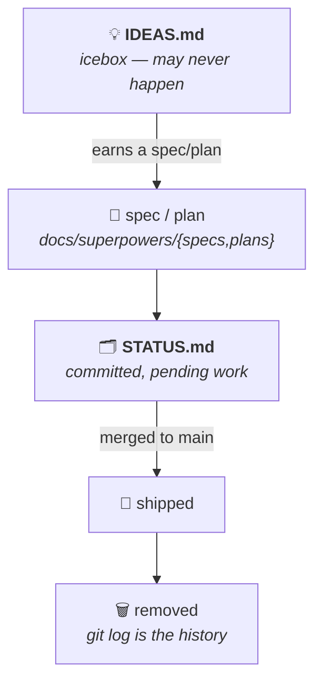

# Ideas — Icebox

> Speculative ideas and wishlist items — things worth writing down before they're
> forgotten, but **not yet committed to**. No spec, no plan, may never happen.
>
> This is the *upstream* of [`STATUS.md`](STATUS.md). When an idea earns a spec
> or plan, **move** it out of here into `STATUS.md` (with a link to its plan) —
> don't leave it in both places. This file only ever holds things that have *not*
> graduated. For the full document map, see [`README.md`](README.md).

An idea's lifecycle:

```mermaid
flowchart TD
    I["💡 <b>IDEAS.md</b><br/><i>icebox — may never happen</i>"]
    S["📝 spec / plan<br/><i>docs/superpowers/{specs,plans}</i>"]
    T["🗂️ <b>STATUS.md</b><br/><i>committed, pending work</i>"]
    D["🚀 shipped"]
    G["🗑️ removed<br/><i>git log is the history</i>"]

    I -->|earns a spec/plan| S
    S --> T
    T -->|merged to main| D
    D --> G
```

---

## Jarvis

### Generative-UI compositions (post-L1/L2 riffs)

Compositions of shipped systems with the panel surface, noted 2026-08-09 while
surveying what generative UI could become — each rides the roadmap
([architecture §19](architecture/19-ai-capability-roadmap.md)) rather than
adding to it: **narrator × panels** (an anomaly narration *offers* a chart
panel — the offers-never-executes persona clause already anticipates the
handshake); **sentinels × panels** (a standing watcher renders its own live
panel showing trigger proximity); **drive × panels × narrator** (a "morning
briefing" turn that rearranges the workspace, spawns overnight-movers panels
and narrates them — three shipped systems in one choreographed turn); and
**renderer-vocabulary growth** (depth ladder, correlation matrix, PnL
waterfall — each closed-vocab `PanelSpec` kind multiplies what every future
feature can express without ever granting the model arbitrary UI power).

### Generative-UI standards adapter (A2UI / MCP Apps)

Expose the Jarvis panel surface to external hosts through an emerging
agent-UI standard — a server-side `PanelSpec` ↔ standard-messages adapter, the
same boundary move as the `/mcp` endpoint. Assessed 2026-09-10 and deliberately
**not** adopted as the internal contract (pre-GA specs, unsettled standards
race, our domain vocabulary is stronger than the generic catalogs); evaluate
MCP Apps before A2UI if an interop round ever happens. Full comparison:
[research/2026-09-10-a2ui-genui-standards-landscape.md](research/2026-09-10-a2ui-genui-standards-landscape.md).

## Tooling & workflow

### Adopt a GitHub merge queue

**Decided 2026-07-26: not available to this repo** — GitHub merge queue needs an
organization-owned repository and this one is user-owned. Rule 3's manual
catch-up triage in the [`shipping-repo-changes`](../.claude/skills/shipping-repo-changes/SKILL.md)
skill is the permanent mechanism. Revisit only if the repo moves to an
organization; measurements and the full amendment live in the
[design spec](superpowers/specs/2026-07-26-catchup-triage-and-merge-queue-design.md).

### RN sibling `X.styles.ts` split

Move each component's `StyleSheet.create` block to a sibling `X.styles.ts`,
mirroring the web clients' `.module.css` co-location. Cosmetic symmetry; 69
files. Deliberately deferred 2026-09-01 (chose lint-gaps-only) — see
[`rn-styling.md`](rn-styling.md).

### RN styling library evaluation

Only worth revisiting if a real limitation of `StyleSheet.create` +
`useThemedStyles` appears (e.g. web+native single-source styling) — then
consider react-native-unistyles / react-strict-dom. Deferred 2026-09-01 — see
[`rn-styling.md`](rn-styling.md).

### Devtools `bind()` layer

A thin reactive-bindings layer over `InspectorStore` (the devtools analogue of
`react-bindings`), replacing the `useSyncExternalStore` seam and folding
`useTimeline`/`useNavigation` `useState` view state into store-backed selectors.
Considered 2026-09-01, deferred: real work for an 11-component UI already holding
≥95% coverage. Revisit if the inspector grows enough view state to make
prop-drilling or render-scope bugs recur.

