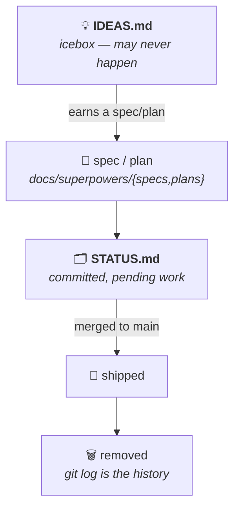

# Documentation Map

Everything under `docs/` (plus a few root-level companions), grouped by purpose.
Start here when you're not sure where something lives.

## Planning & tracking — how work moves

Ideas flow through a small pipeline; each document owns one stage:

- [`IDEAS.md`](IDEAS.md) — **icebox.** Speculative ideas and wishlist items with
  no plan yet. May never happen. Upstream of `STATUS.md`.
- [`STATUS.md`](STATUS.md) — **cross-workstream backlog.** What's committed but
  *not done yet*, tiered by readiness. Entries are removed as they ship;
  maintained via the `tracking-workstream-status` skill.
- [`superpowers/STATUS.md`](superpowers/STATUS.md) — the clean-architecture
  **phase log** (the multi-phase build's authoritative status + test topology).
- [`superpowers/specs/`](superpowers/specs/) and
  [`superpowers/plans/`](superpowers/plans/) — per-workstream **specs and plans**
  (spec-driven development). An idea earns a home here on its way from the icebox
  to the backlog. [`superpowers/sdd/`](superpowers/sdd/) holds SDD task reports.
- [`implementation-plan.md`](implementation-plan.md) — the original phased plan
  the build followed.

## Architecture & design decisions

- [`architecture.md`](architecture.md) — the authoritative architecture reference
  (layers, ports, data flow, sequence diagrams).
- [`architecture/`](architecture/) — the same reference split into 20 numbered
  chapters (overview, C4, UML, sequences, package deps, replaceability matrix,
  test strategy, devtools, …).
- [`adr/`](adr/) — Architecture Decision Records (e.g.
  [ADR-005 UI-logic placement](adr/ADR-005-ui-logic-placement.md)).
- [`performance.md`](performance.md) — **read before any CSS animation/transition
  work.** The compositor-perf traps, fix patterns, and pre-merge checklist.
- [`boot-splash-animations.md`](boot-splash-animations.md) — the boot-splash
  3D scenes, documented with diagrams.

## Product & design artifacts

- [`design/`](design/) — the standalone design prototypes (`web/v1..v5`, `mobile/v1`);
  self-contained HTML/media, not app code. v5 is current.
- [`presentations/`](presentations/) — slide decks (e.g. the Clean Architecture
  case-study deck).
- [`research/`](research/) — dated research write-ups feeding design decisions
  (layout landscape, SDD fidelity, feature-flag tooling).
- [`pages/`](pages/) — the GitHub Pages landing assets.

## Operations & tooling

- [`DEPLOY.md`](DEPLOY.md) — deployment topology and one-time setup (accounts,
  secrets, the on-demand deploy workflows).
- [`authentication.md`](authentication.md) — genuine per-user server-side
  login: the end-to-end flow, the four-user roster, and per-platform
  credential configuration (Fly, Vercel, RN, local dev).
- [`env-files.md`](env-files.md) — environment-variable / `.env` conventions.
- [`claude-sandbox.md`](claude-sandbox.md) — running the repo from macOS WebStorm
  and the Linux claude-sandbox container simultaneously.
- [`dependency-cruiser.md`](dependency-cruiser.md) — the dependency-graph
  enforcement setup.
- [`tooling-roadmap.md`](tooling-roadmap.md) — planned/adopted dev-tooling.

## Process & contributor rules

- [`../CLAUDE.md`](../CLAUDE.md) — repo-wide guidance (package structure,
  dependency rules, the doctrines that gate changes).
- [`../.claude/skills/shipping-repo-changes/SKILL.md`](../.claude/skills/shipping-repo-changes/SKILL.md)
  — the mandatory worktree → PR → CI → merge → cleanup workflow for *any* change
  to this repo, including the Rule 3 catch-up-risk triage.
