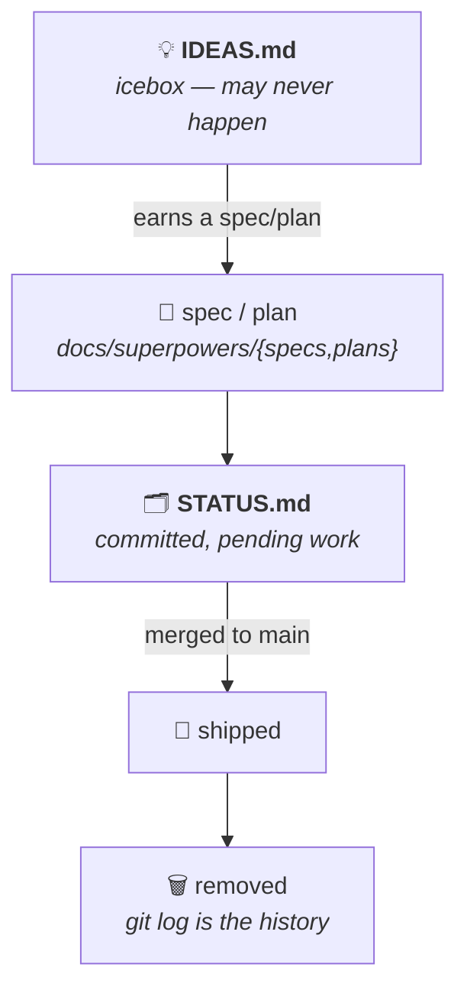

# Documentation Map

Everything under `docs/` (plus a few root-level companions), grouped by purpose.
Start here when you're not sure where something lives.

New to the repo? The [root README](../README.md) is the overview (live demos,
screenshots, quick start); [`development.md`](development.md) is the hands-on
guide to running, testing and deploying every client.

## Planning & tracking — how work moves

Ideas flow through a small pipeline; each document owns one stage:

```mermaid
flowchart TD
    I["💡 <b>IDEAS.md</b><br/><i>icebox — may never happen</i>"]
    S["📝 spec / plan<br/><i>docs/superpowers/{specs,plans}</i>"]
    T["🗂️ <b>STATUS.md</b><br/><i>committed, pending work</i>"]
    D["🚀 shipped"]
    G["🗑️ removed<br/><i>git log is the history</i>"]

    I -->|earns a spec/plan| S
    S --> T
    T -->|merged to main| D
    D --> G
```

- [`IDEAS.md`](IDEAS.md) — **icebox.** Speculative ideas and wishlist items with
  no plan yet. May never happen. Upstream of `STATUS.md`.
- [`STATUS.md`](STATUS.md) — **cross-workstream backlog.** What's committed but
  *not done yet*, tiered by readiness. Entries are removed as they ship;
  maintained via the `tracking-workstream-status` skill.
- [`superpowers/STATUS.md`](superpowers/STATUS.md) — the clean-architecture
  **phase log** (the multi-phase build's authoritative status + test topology).
- [`superpowers/specs/`](superpowers/specs/) and
  [`superpowers/plans/`](superpowers/plans/) — per-workstream **specs and plans**
  (spec-driven development). An idea earns a home here on its way from the icebox
  to the backlog. [`superpowers/sdd/`](superpowers/sdd/) holds SDD task reports.
- [`implementation-plan.md`](implementation-plan.md) — the original phased plan
  the build followed.

## Architecture & design decisions

- [`architecture.md`](architecture.md) — the authoritative architecture reference
  (layers, ports, data flow, sequence diagrams).
- [`architecture/`](architecture/) — the same reference split into 23 numbered
  chapters (overview, C4, UML, sequences, package deps, replaceability matrix,
  test strategy, devtools, Jarvis, the pluggable application core, …).
- [`adr/`](adr/) — Architecture Decision Records (e.g.
  [ADR-005 UI-logic placement](adr/ADR-005-ui-logic-placement.md),
  [ADR-007 CI security tooling](adr/ADR-007-ci-security-tooling.md) — what
  runs, and why Snyk / SonarCloud were declined).
- [`security-scorecard.md`](security-scorecard.md) — reading the OpenSSF
  Scorecard: what each open check measures, why `Code-Review` /
  `Branch-Protection` are capped for a single maintainer, the property-based
  (`fast-check`) tests behind `Fuzzing`, and the Best Practices badge walkthrough.
- [`performance.md`](performance.md) — **read before any CSS animation/transition
  work.** The compositor-perf traps, fix patterns, and pre-merge checklist.
- [`handler-naming.md`](handler-naming.md) — **read before naming a function or a
  prop callback.** A name states its effect, never its trigger; slots stay `onX`.
- [`power-saver-mode.md`](power-saver-mode.md) — the Calm / Freeze power-saver
  levels and the motion audit behind them.
- [`react-vs-solid-performance.md`](react-vs-solid-performance.md) — measured
  runtime cost of the React and Solid clients (verdict: parity).
- [`lint-warnings.md`](lint-warnings.md) — the generated lint-warnings ledger
  (do not edit by hand; `pnpm sync:lint-warnings`). Dormant since 2026-10-06:
  a lint warning now fails the build, so it reads zero.
- [`rn-styling.md`](rn-styling.md) — the native equivalent of the web clients'
  CSS-Modules styling rule.
- [`rn-open-items.md`](rn-open-items.md) — every known gap and follow-up in the
  React Native workstream, behind the STATUS.md backlog.
- [`react-native-inspectors.md`](react-native-inspectors.md) — debugging and
  inspection tools available for the RN client.
- [`boot-splash-animations.md`](boot-splash-animations.md) — the boot-splash
  3D scenes, documented with diagrams.
- [`rn-running-on-a-real-iphone.md`](rn-running-on-a-real-iphone.md) — installing
  the RN app on your own iPhone with a **free** Apple ID (no paid program, no
  EAS). Do this whenever you touch motion, Skia or worklets: the simulator has
  no gyroscope and draws Skia on the Mac's GPU, so it cannot show you a whole
  class of behaviour. Includes every failure hit walking it end-to-end.
- [`rn-motion-architecture.md`](rn-motion-architecture.md) — **read before
  writing anything that moves in React Native.** Which of Skia / Reanimated owns
  what and why, the New-Architecture baseline, and the frozen-boot case study —
  a hook-identity trap that React Compiler cannot solve and that all three test
  tiers reported as passing.

## Product & design artifacts

- [`design/`](design/) — the standalone design prototypes (`web/v1..v5`, `mobile/v1`);
  self-contained HTML/media, not app code. v5 is current.
- [`presentations/`](presentations/) — slide decks (e.g. the Clean Architecture
  case-study deck).
- [`research/`](research/) — dated research write-ups feeding design decisions
  (layout landscape, SDD fidelity, feature-flag tooling, RN boot scenes blank on
  device, A2UI / GenUI standards).
- [`showcase/`](showcase/) — self-contained HTML artifacts generated during working
  sessions, kept as examples.
- [`pages/`](pages/) — the GitHub Pages landing assets.

## Operations & tooling

- [`DEPLOY.md`](DEPLOY.md) — deployment topology and one-time setup (accounts,
  secrets, the on-demand deploy workflows).
- [`authentication.md`](authentication.md) — genuine per-user server-side
  login: the end-to-end flow, the four-user roster, and per-platform
  credential configuration (Fly, Vercel, RN, local dev).
- [`env-files.md`](env-files.md) — environment-variable / `.env` conventions.
- [`running-real-jarvis.md`](running-real-jarvis.md) — runbook for putting a real
  `ANTHROPIC_API_KEY` behind Jarvis locally and on the deployed server, with the
  bill-safety knobs.
- [`test-bakeoff-outcome.md`](test-bakeoff-outcome.md) — the concluded test-tool
  bake-off: what was evaluated and which tool won each category.
- [`../tests/GHERKIN.md`](../tests/GHERKIN.md) and
  [`../tests/STRATEGY.md`](../tests/STRATEGY.md) — the Gherkin e2e suites and the
  test strategy behind them.
- [`claude-sandbox.md`](claude-sandbox.md) — running the repo from macOS WebStorm
  and the Linux claude-sandbox container simultaneously.
- [`dependency-cruiser.md`](dependency-cruiser.md) — the dependency-graph
  enforcement setup.
- [`tooling-roadmap.md`](tooling-roadmap.md) — planned/adopted dev-tooling.
- [`typescript-7.md`](typescript-7.md) — why `tsc` is TypeScript **7** while the
  `typescript` package name resolves to the **6.x** API (the dual install), the
  measurements behind it, the three gates that block a plain bump, and the exit plan.
- [`vitest-5.md`](vitest-5.md) — the vitest 4 → 5 upgrade (landed 2026-10-04 on 5.0.3): what v5
  brings, the three silent v5 traps and their fixes, the concurrent-re-import mock regression
  with its minimal reproduction and workaround, and what is left to do.
- [`vitest-5-upstream-bug-report.md`](vitest-5-upstream-bug-report.md) — how to report that
  mock regression to the vitest maintainers: why a person must file it, the reproduction
  script, the issue text to paste, and what to do once it is fixed.
- [`mobile-ci-testing-options.md`](mobile-ci-testing-options.md) — decision
  support for running iOS/Android tests in CI: why iOS needs a Mac, every option
  with dated costs, what teams actually gate on, and a staged recommendation.

## Process & contributor rules

- [`../CLAUDE.md`](../CLAUDE.md) — repo-wide guidance (package structure,
  dependency rules, the doctrines that gate changes).
- [`../.claude/skills/shipping-repo-changes/SKILL.md`](../.claude/skills/shipping-repo-changes/SKILL.md)
  — the mandatory worktree → PR → CI → merge → cleanup workflow for *any* change
  to this repo, including the Rule 3 catch-up-risk triage.
