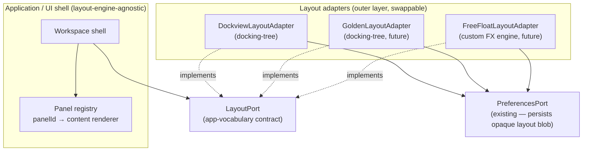

# ADR-002: Layout / panel / window management as a swappable port

**Status:** Proposed (exploratory — records the intended direction and the
research behind it; no adapter is implemented yet).

> Sibling decision record. ADR-001 lives co-located with its concern at
> `packages/client-react/tests/ui/visual/ADR-001-visual-diff-tooling.md`. This
> ADR is cross-cutting (it constrains the UI shell *and* a future custom
> rendering engine), so it lives under `docs/adr/`.

## Context

The reference ReactiveTraderCloud uses **Golden Layout** to manage its
workspace: draggable, dockable, resizable panels with pop-out-to-OS-window
support. Our clone currently renders a fixed tab/grid shell
(`packages/client-react/src/ui/shell/layout/Workspace.tsx`). We want to replace
that with a real layout/panel/window-management system **and** to keep that
system fully decoupled from the application — a swappable "plugin", in the same
spirit as every other outer-layer technology here (see
[architecture.md §8 Replaceability Matrix](../architecture/08-replaceability-matrix.md#8-replaceability-matrix)).

Two goals, explicitly:

1. **Swap the layout library wholesale** without touching application code —
   pick Dockview today, swap to Golden Layout / FlexLayout / something else
   later, by changing only one adapter.
2. **Eventually implement a fully custom free-floating layout** (absolute-
   positioned panels, magnetic auto-docking, an eye-catching masonry/isotope
   reflow animation — a deliberate conceptual experiment) that satisfies the
   *same* contract the off-the-shelf adapter does.

This is the layout analogue of the React→SolidJS goal: the value is in the
**cost-of-change being bounded**, guaranteed by a contract and tests rather than
by discipline alone.

## Decision

Treat layout/panel/window management as a **Frameworks & Drivers (outer-layer)
concern behind a port**, exactly like the WebSocket transport. The UI shell
depends on a `LayoutPort` (a thin, app-vocabulary contract); concrete layout
engines are **adapters** selected at the Composition Root.



**Current pick:** **Dockview** as the first adapter — best-maintained,
multi-framework (vanilla core + React/Vue/Angular), and it already supports
floating groups and pop-out windows. It is a *choice*, not a *commitment*.

### The honest tension — this is harder than a transport port

The repo's **"Don't Over-Abstract"** principle
([architecture.md §1.2](../architecture/01-overview.md#12-architectural-principles)) applies
with force here. A WebSocket is trivial to wrap; a layout engine is not, because
a layout engine is a **rendering concern tightly coupled to the view framework**
— it owns *where and how* panels mount, not just data that flows through. Wrapping
it behind a fat, feature-complete port would produce a leaky facade that fights
each engine's grain.

So the contract is deliberately **thin and expressed in application vocabulary**
(panels, visibility, focus, persistence), never in any engine's vocabulary
(no docking trees, no split nodes, no group ids). Where an engine has bespoke
capabilities the app doesn't need to orchestrate, we let the adapter own them
rather than hoisting them into the port.

### Core design: separate *panel content* from *panel placement*

The single most important decoupling — and the thing that makes both the
library-swap and the custom-engine goals achievable:

- **The app owns panel *content*.** A **panel registry** maps a stable
  `panelId` (e.g. `"fx-blotter"`, `"credit-rfq"`) to a framework-native content
  renderer. This mirrors the existing visual-test `registry.tsx` /
  `scenarios.ts` pattern — dumb content, addressed by id.
- **The adapter owns panel *placement and chrome*.** Geometry, tabs, splits,
  drag, float, animation — all internal to the adapter. The app never sees them.

The app says "panel `fx-blotter` should be open and focused"; the adapter decides
*where* that is. The app references panels only by id, never by any engine type.

### Sketch of the `LayoutPort` contract (illustrative, not final)

```ts
// App vocabulary only. No Dockview/Golden/Solid/React types cross this line.
interface LayoutPort {
  // content is supplied out-of-band via the panel registry (panelId → renderer)
  openPanel(panelId: string, opts?: { focus?: boolean }): void
  closePanel(panelId: string): void
  focusPanel(panelId: string): void
  isOpen(panelId: string): boolean

  // persistence: the engine's layout is OPAQUE to the app — a blob it round-trips
  serialize(): string
  restore(blob: string): void

  // events the shell may react to (kept minimal)
  changes(): Observable<LayoutSnapshot>   // RxJS, consistent with the rest of the app
}
```

- **Persistence is opaque.** Each adapter serializes *its own* layout to a
  string the app treats as a blob and stores through the **existing
  `PreferencesPort`** (`LocalStoragePreferencesAdapter` +
  `preferences.contract.test.ts`). The app never parses it; swapping engines just
  means old blobs are ignored/migrated by the new adapter.
- **`changes()` returns an `Observable`** to stay consistent with the repo's
  single boundary stream type — but note the UI-layer rule still holds: the shell
  consumes it through a hook bridge, never importing `rxjs` directly
  ([architecture.md §1.3](../architecture/01-overview.md#13-layered-architecture--terminology)).

### The portability trap to avoid

> **Do not model the port after Dockview's docking tree.** If the contract leaks
> a tree-of-splits mental model, the future free-floating adapter (which has no
> tree — it has free coordinates and magnetic snap zones) cannot satisfy it.

The contract above is expressed as *panel lifecycle + opaque persistence*
precisely so that a docking-tree engine **and** a free-float engine can both
honour it. That constraint is the whole reason this is an ADR and not just
"add Dockview."

## Solution landscape (shortlist)

The full survey — seven categories, ~25 libraries, framework + licence per row,
the custom free-float build blocks, and the Flex `DefaultTileListEffect`
prior-art — lives in
[research/2026-06-22-layout-management-landscape.md](../research/2026-06-22-layout-management-landscape.md).
The decision-relevant summary:

The space splits into **three paradigms**, and the `LayoutPort` is designed so an
adapter from any of them can satisfy it:

- **Docking-tree** (Dockview, Golden Layout, FlexLayout, rc-dock, react-mosaic,
  Lumino) — the trading-workspace default; **the chosen first adapter (Dockview)
  is here.**
- **Grid / free-float + animation** (react-grid-layout, Gridstack, Muuri; the
  Isotope/Packery/Masonry reflow family; WinBox / react-rnd float windows) — home
  of the "isotope" reflow and the CMC-era free-float UX; the basis for the future
  custom adapter.
- **Desktop multi-window interop** (OpenFin, interop.io, FDC3, Electron/Tauri) —
  real OS windows across apps; real RTC ships an OpenFin variant. Likely a
  separate `WorkspacePort`, **outside** `LayoutPort`'s scope (see research note).

**Decision-shaping takeaways:**

- **Prefer a vanilla core.** The React→Solid goal makes vanilla-core engines
  (Dockview `dockview-core`, Golden Layout v2, Lumino, Gridstack, Muuri, WinBox,
  interact.js) swap-safe; `*-react` libraries are a hard React dependency. Wrap
  the vanilla core; render panel *content* with the host framework.
- **Watch the licences.** Most candidates are MIT/Apache/BSD, but **Isotope and
  Packery are GPL-or-commercial** — which is exactly why the custom free-float
  adapter should get the reflow from **Motion** `layout` / **GSAP Flip**
  (license-clean FLIP), not from Isotope.

## The custom free-floating engine (future adapter)

The prior-art UX (free-floating panels, magnetic auto-docking like
Photoshop/Flash palettes, an isotope/masonry reflow animation — the
Macromedia/Adobe Flex `DefaultTileListEffect` lineage) is the grid/free-float
paradigm; no docking-tree library does it. The faithful version is a custom
`FreeFloatLayoutAdapter` on primitives, behind the **same** `LayoutPort`:
**interact.js/dnd-kit** for drag + snap-zone hit-testing, **Motion `layout`** (or
GSAP Flip) for the reflow, and a **bespoke** magnetic-dock/packing algorithm (the
only genuinely custom piece — Muuri's source is a useful reference). Full
build-block table and the Flex prior-art sidebar are in the
[research note](../research/2026-06-22-layout-management-landscape.md#the-custom-free-floating-engine--build-blocks).

## Replaceability matrix row (to fold into architecture.md §8 when adopted)

| Component | Currently | Cost to replace | Contract that must hold | Tests that verify |
|---|---|---|---|---|
| **Layout / panel manager** | (none yet → Dockview) | ~1 dev-week per adapter | `LayoutPort` (panel lifecycle + opaque persistence); panel content addressed by stable id | `LayoutPort` contract tests (parameterised over adapters) + visual goldens for panel *content* |

## Test strategy

- **`LayoutPort` contract tests**, parameterised over every adapter (Dockview,
  future Golden/free-float) — the same mechanism as the transport
  [port contract tests](../architecture/09-test-strategy.md#94-port-contract-tests). This is what
  makes "swap the layout engine" low-cost: the contract is encoded and all
  adapters must pass it.
- **Visual goldens** ([ADR-001](../../packages/client-react/tests/ui/visual/ADR-001-visual-diff-tooling.md))
  screenshot panel *content*, which is engine-agnostic by design — but note an
  engine swap changes panel *geometry/chrome*, so full-workspace shots are
  expected to diff across adapters; scope golden coverage to panel content, not
  the surrounding layout chrome.
- **Behavioural specs** address panels by role/testid, so they should survive a
  layout-engine swap unchanged (same guarantee as the UI-framework swap).

## Open questions (to resolve before building an adapter)

1. **Does the shell need a tree/group concept at all**, or is "set of open
   panels + focus + opaque blob" sufficient? (Leaning: keep the port that thin;
   let adapters own structure.)
2. **Pop-out OS windows** (Golden Layout / Dockview feature, and a real RTC
   capability): does the port expose `popout(panelId)`, or is it adapter-internal
   chrome the app never commands? Affects how thin the port can stay.
3. **Layout-state migration** across engine swaps: ignore old blobs, or define a
   neutral interchange format? (Leaning: ignore + re-seed defaults; a neutral
   format would re-introduce the docking-tree leak we are avoiding.)
4. **Where the registry lives** relative to the existing visual `registry.tsx` —
   reuse/extend it or keep separate.

## Alternatives considered

- **Bake Dockview directly into `Workspace.tsx`.** Rejected — exactly the
  third-party lock-in the architecture exists to prevent, and it would block the
  custom free-float experiment.
- **Use a docking library's own persistence as application state.** Rejected —
  leaks the engine's tree model into the app and breaks the swap guarantee;
  persistence stays an opaque blob behind `PreferencesPort`.
- **A fat, feature-complete `LayoutPort`** mirroring Dockview's API. Rejected —
  violates "Don't Over-Abstract" and makes the free-float adapter impossible to
  fit. The port stays thin and app-shaped.

## References

- **Full solution catalogue (all libraries + licences + external links):**
  [research/2026-06-22-layout-management-landscape.md](../research/2026-06-22-layout-management-landscape.md)
- Repo cross-refs:
  [architecture.md §1.2 principles](../architecture/01-overview.md#12-architectural-principles),
  [§8 Replaceability Matrix](../architecture/08-replaceability-matrix.md#8-replaceability-matrix),
  [ADR-001 visual-diff tooling](../../packages/client-react/tests/ui/visual/ADR-001-visual-diff-tooling.md)
