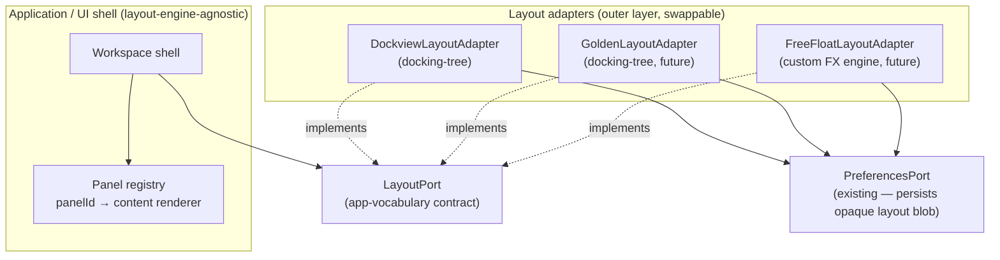

# ADR-002: Layout / panel / window management as a swappable port

**Status:** Superseded in part (2026-08-11). This ADR's two goals split: the
**decoupling** goal shipped, but on a different shape than the one designed
here — an **in-house split-tree engine** (`LayoutMachine` +
`InhouseLayoutEngine`), not a `LayoutPort` in front of a third-party library.
See [What actually shipped](#what-actually-shipped) below for the honest
account, and [Superseded / still-true index](#superseded--still-true-index)
for exactly which parts of the original text below still hold.

> Sibling decision record. ADR-001 lives co-located with its concern at
> `packages/client-react/tests/ui/visual/ADR-001-visual-diff-tooling.md`. This
> ADR is cross-cutting (it constrains the UI shell *and* a future custom
> rendering engine), so it lives under `docs/adr/`.

## Superseded / still-true index

| Original section | Status |
|---|---|
| Context (Golden Layout / Dockview framing, `Workspace.tsx`) | **Superseded** — `Workspace.tsx` was deleted; see [What actually shipped](#what-actually-shipped) |
| Decision (`LayoutPort` behind app vocabulary) | **Superseded** — no such port exists; the real seam is the machine + engine-view pair, see below |
| "The honest tension" / "Don't Over-Abstract" reasoning | **Still true**, and is exactly why no port got built — see below |
| Sketch of the `LayoutPort` contract | **Never built** — kept verbatim for the historical record |
| "The portability trap to avoid" | **Still true advice**, now scoped to a *hypothetical future* port rather than the shipped code |
| Solution landscape / research note | **Still true** — the survey is reference material for any future engine swap, in-house or not |
| The custom free-floating engine (future adapter) | **Still future**, unchanged — now targets the machine seam instead of `LayoutPort` |
| Replaceability matrix row | **Rewritten** — see below |
| Test strategy | **Rewritten** — describes what actually verifies the shipped engine |
| Open questions | **Resolved** — see below |
| Alternatives considered | **Extended** — one new alternative (2026-08-11) |

## What actually shipped

The in-house engine **is** the layout system today, not a placeholder waiting
on a `LayoutPort` adapter. `packages/client-react/src/ui/shell/layout/Workspace.tsx`
— the "fixed tab/grid shell" this ADR originally set out to replace — no
longer exists (removed rendering `InhouseLayoutEngine` from `App.tsx`
instead). What's there now, per
[architecture.md §17.2](../architecture/17-web-client-up-close.md#172-the-layout-system)
and [§10.11](../architecture/10-key-design-decisions.md#1011-continuous-ui-without-fighting-the-framework):

- **The data** — `LayoutState`/`LayoutNode` (`packages/client-core/src/layout/layoutPort.ts`):
  a tree of splits and panel-id leaves, app-vocabulary only (no engine types).
- **The machine** — `createLayoutMachine`
  (`packages/client-core/src/presenters/LayoutMachine.ts`), one framework-free
  instance per workspace tab, folding five intents (`maximize`/`restore`/
  `collapse`/`expand`/`resize`, plus this round's `dockPanel`/`undockPanel`/
  `reset`) through an RxJS `scan` reducer into a `state$` stream.
- **The registries** — `panelRegistry.ts` / `appPanelRegistry.tsx` /
  `appHeadRegistry.tsx` (per client, React and Solid), mapping a stable
  `panelId` to a content renderer — precisely the "panel registry" concept
  this ADR called for, just not gated behind a port interface.
- **The engine-view** — `InhouseLayoutEngine.tsx` (+ its Solid twin), the
  *one* framework-coupled component in each client shell: it renders
  `LayoutState` + the registries into DOM (splits, drag handles, maximize/
  collapse chrome, docked columns). Its own doc comment names itself "the
  ONE framework-coupled spot in the app."
- **Persistence** — an opaque `workspaceLayoutV1` string preference (see
  [Persistence: the ADR's goal, a different mechanism](#persistence-the-adrs-goal-a-different-mechanism)).

This is not a port-and-adapters seam over a pluggable engine — it is the
engine, with exactly one file per client that a framework swap has to
re-implement (proven twice already: React→RN reused `client-core` verbatim,
and the SolidJS port re-implemented only `InhouseLayoutEngine.tsx` + its
CSS-module twin, byte-identical, to reach full visual parity).

## Context

The reference ReactiveTraderCloud uses **Golden Layout** to manage its
workspace: draggable, dockable, resizable panels with pop-out-to-OS-window
support. When this ADR was written, our clone rendered a fixed tab/grid shell
(`packages/client-react/src/ui/shell/layout/Workspace.tsx`, since deleted —
see [What actually shipped](#what-actually-shipped)). The stated goal was to
replace that shell with a real layout/panel/window-management system **and**
to keep that system fully decoupled from the application — a swappable
"plugin", in the same spirit as every other outer-layer technology here (see
[architecture.md §8 Replaceability Matrix](../architecture/08-replaceability-matrix.md#8-replaceability-matrix)).
The decoupling goal held; the mechanism below is not the one that shipped.

Two goals, explicitly:

1. **Swap the layout library wholesale** without touching application code —
   pick Dockview today, swap to Golden Layout / FlexLayout / something else
   later, by changing only one adapter.
2. **Eventually implement a fully custom free-floating layout** (absolute-
   positioned panels, magnetic auto-docking, an eye-catching masonry/isotope
   reflow animation — a deliberate conceptual experiment) that satisfies the
   *same* contract the off-the-shelf adapter does.

This is the layout analogue of the React→SolidJS goal: the value is in the
**cost-of-change being bounded**, guaranteed by a contract and tests rather than
by discipline alone.

## Decision (as originally proposed — not what shipped)

This section is preserved verbatim as the historical proposal. It was never
built; [What actually shipped](#what-actually-shipped) above and
[The real swap seam](#the-real-swap-seam-what-shipped-instead) below describe
what did.

Treat layout/panel/window management as a **Frameworks & Drivers (outer-layer)
concern behind a port**, exactly like the WebSocket transport. The UI shell
depends on a `LayoutPort` (a thin, app-vocabulary contract); concrete layout
engines are **adapters** selected at the Composition Root.


```mermaid
graph TB
    subgraph App["Application / UI shell (layout-engine-agnostic)"]
        Shell["Workspace shell"]
        Registry["Panel registry<br/>panelId → content renderer"]
    end
    Port["LayoutPort<br/>(app-vocabulary contract)"]
    subgraph Adapters["Layout adapters (outer layer, swappable)"]
        Dockview["DockviewLayoutAdapter<br/>(docking-tree)"]
        Golden["GoldenLayoutAdapter<br/>(docking-tree, future)"]
        Float["FreeFloatLayoutAdapter<br/>(custom FX engine, future)"]
    end
    Prefs["PreferencesPort<br/>(existing — persists opaque layout blob)"]

    Shell --> Port
    Shell --> Registry
    Dockview -.implements.-> Port
    Golden -.implements.-> Port
    Float -.implements.-> Port
    Dockview --> Prefs
    Golden --> Prefs
    Float --> Prefs
```

**Current pick:** **Dockview** as the first adapter — best-maintained,
multi-framework (vanilla core + React/Vue/Angular), and it already supports
floating groups and pop-out windows. It is a *choice*, not a *commitment*.

### The honest tension — this is harder than a transport port

The repo's **"Don't Over-Abstract"** principle
([architecture.md §1.2](../architecture/01-overview.md#12-architectural-principles)) applies
with force here. A WebSocket is trivial to wrap; a layout engine is not, because
a layout engine is a **rendering concern tightly coupled to the view framework**
— it owns *where and how* panels mount, not just data that flows through. Wrapping
it behind a fat, feature-complete port would produce a leaky facade that fights
each engine's grain.

So the contract is deliberately **thin and expressed in application vocabulary**
(panels, visibility, focus, persistence), never in any engine's vocabulary
(no docking trees, no split nodes, no group ids). Where an engine has bespoke
capabilities the app doesn't need to orchestrate, we let the adapter own them
rather than hoisting them into the port.

### Core design: separate *panel content* from *panel placement*

The single most important decoupling — and the thing that makes both the
library-swap and the custom-engine goals achievable:

- **The app owns panel *content*.** A **panel registry** maps a stable
  `panelId` (e.g. `"fx-blotter"`, `"credit-rfq"`) to a framework-native content
  renderer. This mirrors the existing visual-test `registry.tsx` /
  `scenarios.ts` pattern — dumb content, addressed by id.
- **The adapter owns panel *placement and chrome*.** Geometry, tabs, splits,
  drag, float, animation — all internal to the adapter. The app never sees them.

The app says "panel `fx-blotter` should be open and focused"; the adapter decides
*where* that is. The app references panels only by id, never by any engine type.

### Sketch of the `LayoutPort` contract (illustrative, not final)

```ts
// App vocabulary only. No Dockview/Golden/Solid/React types cross this line.
interface LayoutPort {
  // content is supplied out-of-band via the panel registry (panelId → renderer)
  openPanel(panelId: string, opts?: { focus?: boolean }): void
  closePanel(panelId: string): void
  focusPanel(panelId: string): void
  isOpen(panelId: string): boolean

  // persistence: the engine's layout is OPAQUE to the app — a blob it round-trips
  serialize(): string
  restore(blob: string): void

  // events the shell may react to (kept minimal)
  changes(): Observable<LayoutSnapshot>   // RxJS, consistent with the rest of the app
}
```

- **Persistence is opaque.** Each adapter serializes *its own* layout to a
  string the app treats as a blob and stores through the **existing
  `PreferencesPort`** (`LocalStoragePreferencesAdapter` +
  `preferences.contract.test.ts`). The app never parses it; swapping engines just
  means old blobs are ignored/migrated by the new adapter.
- **`changes()` returns an `Observable`** to stay consistent with the repo's
  single boundary stream type — but note the UI-layer rule still holds: the shell
  consumes it through a hook bridge, never importing `rxjs` directly
  ([architecture.md §1.3](../architecture/01-overview.md#13-layered-architecture--terminology)).

### The portability trap to avoid

> **Do not model the port after Dockview's docking tree.** If the contract leaks
> a tree-of-splits mental model, the future free-floating adapter (which has no
> tree — it has free coordinates and magnetic snap zones) cannot satisfy it.

This warning is still live, just rescoped: the shipped `LayoutState` **is** a
tree-of-splits (there was never a port to leak it through — the tree IS the
app-level type). The warning now applies only if a future `LayoutPort` gets
built to make the tree swappable for something tree-shaped (Dockview) *and*
something non-tree-shaped (free-float) at once — see
[The custom free-floating engine](#the-custom-free-floating-engine-future-adapter)
below, which still targets that same non-tree case. The original contract
above was expressed as *panel lifecycle + opaque persistence* precisely so
that a docking-tree engine **and** a free-float engine could both honour it —
that constraint is the whole reason this was an ADR and not just "add
Dockview," and it is the same reasoning behind rejecting a premature
`LayoutPort` today (see [Alternatives considered](#alternatives-considered)).

## The real swap seam (what shipped instead)

No `LayoutPort` interface exists, and none is planned unless a second engine
actually gets built (see [Dockview: re-costed as an alternative
engine](#dockview-re-costed-as-an-alternative-engine-2026-08-11) below). The
seam that makes a swap tractable today is smaller and more concrete than the
port sketched above:

- **The machine is engine-agnostic already.** `LayoutMachine.ts` and
  `JarvisPanelsMachine.ts` (`packages/client-core`) know nothing about DOM,
  React, or Solid — the same property the original `LayoutPort` design was
  chasing, just achieved by keeping the state/reducer framework-free rather
  than by wrapping a third-party engine.
- **The engine-view is the one file a swap touches.** `InhouseLayoutEngine.tsx`
  (+ CSS module) per client is where a genuinely different engine — Dockview,
  Golden Layout, or the custom free-float experiment — would plug in, reading
  the same `LayoutState`/registries the current renderer does. This is a
  *smaller* footprint than the original port design (one file vs. an adapter
  package per engine), because there is no port interface to also satisfy.
- **The cost of an actual engine swap is therefore the honest cost of
  rewriting that one file per client** to a different rendering strategy,
  not "implement `LayoutPort`" — which is exactly why the
  [Dockview re-costing](#dockview-re-costed-as-an-alternative-engine-2026-08-11)
  below counts capability parity, not adapter LOC.

## Persistence: the ADR's goal, a different mechanism

The original design's persistence goal — "the engine's layout is OPAQUE to
the app, a blob it round-trips through the existing `PreferencesPort`" — is
exactly what shipped in the 2026-08-11 GenUI L3 round, without a `LayoutPort`:

- `PreferencesPort` gained one new opaque string member,
  `workspaceLayout$(): Observable<string | null>` /
  `setWorkspaceLayout(value: string | null): void`
  (`packages/domain/src/ports/preferencesPort.ts`) — the repo's first
  optional-string preference, storage-guarded to `typeof value === "string"`,
  with real validation left to the client-core parser rather than the
  storage adapter.
- The app never inspects the string's shape at the UI layer: it is written by
  a lazy debounced writer (`packages/client-core/src/layout/
  workspacePersistenceWriter.ts`, registering each tab's `LayoutMachine`
  `state$` as it is created, so a never-opened tab never forces eager
  creation) and read back by a parser
  (`packages/client-core/src/layout/workspaceLayoutPersistence.ts`) that
  reconciles the tree against the docked-panel list, enforces
  `MAX_DOCKED_PANELS` (4, global) and a depth bound, and falls back to
  defaults on anything corrupt, truncated, or version-mismatched.
- So the ADR's persistence *goal* — opaque, engine-agnostic, routed through
  `PreferencesPort` — held exactly as designed. What it turned out not to
  need was a `LayoutPort` in front of it: the "engine" whose layout gets
  serialized is the one and only in-house engine, so there is no adapter
  boundary for the blob to be opaque *across*, only a version boundary
  (`workspaceLayoutV1`) to be opaque *through*.

## Dockview: re-costed as an alternative engine (2026-08-11)

This ADR originally named Dockview "the chosen first adapter." A 2026-08-11
exploration (recorded in
[the GenUI L3 spec's opening](../superpowers/specs/2026-08-11-genui-l3-pinned-panels-design.md#2-decisions-settled-during-brainstorm-2026-08-11))
found that framing stale: it predates the in-house engine described above,
which by 2026-08-11 had grown ~2.9k lines across both clients plus ~1k in
`client-core`. Migrating to Dockview via a thin port would not be "add a
missing feature" — it would mean **losing** six capabilities the in-house
engine has grown that a generic docking library either doesn't offer or
would need bespoke work to replicate, while the round on the table (L3:
docking + full workspace persistence) needed **none** of Dockview's actual
differentiators (user drag-rearrange, tabs, pop-out OS windows):

1. **Nearest-column maximize scoping** — `maximizeScope: "nearest-column"`,
   four rail panels maximizing within their own column rather than the whole
   dock.
2. **Collapse-to-strip** — panels collapse to a strip rather than close when
   a sibling maximizes.
3. **Px-rail sizing overrides** — `initialPx`/`fixedPx` per-child literal-px
   panel widths layered on top of fractional `sizes`.
4. **The drive-command surface** — Jarvis's `dockPanel`/`undockPanel`/
   maximize/collapse vocabulary, wired straight into `LayoutIntents`.
5. **The static-panel-id roster gate** — the persona's tool descriptions and
   `MATRIX_EXCLUDE` gates key off the closed, hand-built `PANEL_SPECS` id set.
6. **Full per-tab layout + docked-panel persistence** — the
   `workspaceLayoutV1` opaque preference this round added (see
   [Persistence](#persistence-the-adrs-goal-a-different-mechanism) above).

On top of the capability loss, a Dockview migration would fork the entire
`app/*` visual golden family (panel geometry/chrome is engine-owned, so every
workspace screenshot changes shape) — real cost, not free re-plumbing.
**Dockview therefore stays a recorded *alternative engine*, not a
prerequisite**: it remains the right first pick if a future round needs
Dockview's actual differentiators (drag-rearrange, tabs, pop-out), at which
point the honest cost is "reimplement these six capabilities on top of
Dockview + regenerate `app/*` goldens" — not "add an adapter." The custom
free-float engine below is unaffected by this finding; it was always
scoped as a from-scratch build, not a Dockview alternative.

## Solution landscape (shortlist)

The full survey — seven categories, ~25 libraries, framework + licence per row,
the custom free-float build blocks, and the Flex `DefaultTileListEffect`
prior-art — lives in
[research/2026-06-22-layout-management-landscape.md](../research/2026-06-22-layout-management-landscape.md).
The decision-relevant summary (still useful reference material for a future
engine swap, whether or not it is ever built behind a formal `LayoutPort`):

The space splits into **three paradigms** — the original design reasoned
about them via a `LayoutPort` that was never built, but the paradigm split
itself is unaffected:

- **Docking-tree** (Dockview, Golden Layout, FlexLayout, rc-dock, react-mosaic,
  Lumino) — the trading-workspace default; **the chosen first adapter (Dockview)
  is here.**
- **Grid / free-float + animation** (react-grid-layout, Gridstack, Muuri; the
  Isotope/Packery/Masonry reflow family; WinBox / react-rnd float windows) — home
  of the "isotope" reflow and the CMC-era free-float UX; the basis for the future
  custom adapter.
- **Desktop multi-window interop** (OpenFin, interop.io, FDC3, Electron/Tauri) —
  real OS windows across apps; real RTC ships an OpenFin variant. Likely a
  separate `WorkspacePort`, **outside** `LayoutPort`'s scope (see research note).

**Decision-shaping takeaways:**

- **Prefer a vanilla core.** The React→Solid goal makes vanilla-core engines
  (Dockview `dockview-core`, Golden Layout v2, Lumino, Gridstack, Muuri, WinBox,
  interact.js) swap-safe; `*-react` libraries are a hard React dependency. Wrap
  the vanilla core; render panel *content* with the host framework.
- **Watch the licences.** Most candidates are MIT/Apache/BSD, but **Isotope and
  Packery are GPL-or-commercial** — which is exactly why the custom free-float
  adapter should get the reflow from **Motion** `layout` / **GSAP Flip**
  (license-clean FLIP), not from Isotope.

## The custom free-floating engine (future adapter)

The prior-art UX (free-floating panels, magnetic auto-docking like
Photoshop/Flash palettes, an isotope/masonry reflow animation — the
Macromedia/Adobe Flex `DefaultTileListEffect` lineage) is the grid/free-float
paradigm; no docking-tree library does it — this is still a genuinely future,
from-scratch experiment, unaffected by the Dockview re-costing above. The
faithful version is a custom engine on primitives, targeting the same seam
`InhouseLayoutEngine.tsx` occupies today (not a `LayoutPort`, since none
exists — see [The real swap seam](#the-real-swap-seam-what-shipped-instead)):
**interact.js/dnd-kit** for drag + snap-zone hit-testing, **Motion `layout`** (or
GSAP Flip) for the reflow, and a **bespoke** magnetic-dock/packing algorithm (the
only genuinely custom piece — Muuri's source is a useful reference). Full
build-block table and the Flex prior-art sidebar are in the
[research note](../research/2026-06-22-layout-management-landscape.md#the-custom-free-floating-engine--build-blocks).

## Replaceability matrix row

Supersedes the original row (which described a `LayoutPort` that was never
built); the shape below matches the actual shipped seam and is not yet
folded into [architecture.md §8](../architecture/08-replaceability-matrix.md#8-replaceability-matrix).

| Component | Currently | Cost to replace | Contract that must hold | Tests that verify |
|---|---|---|---|---|
| **Layout / panel manager** | In-house split-tree engine (`LayoutMachine` + `InhouseLayoutEngine`); Dockview and a custom free-float engine remain recorded alternatives, not built | ~1 dev-week per client to replace `InhouseLayoutEngine.tsx` with a different renderer over the same `LayoutState`/registries (no adapter package — one file per client); Dockview specifically also costs reimplementing the six capabilities in [Dockview: re-costed](#dockview-re-costed-as-an-alternative-engine-2026-08-11) + a full `app/*` golden regen | `LayoutState`/`LayoutIntents` (machine surface, `client-core`) + `panelId → renderer` registries; panel content addressed by stable id, same as originally designed | `LayoutMachine`/`JarvisPanelsMachine` unit tests (`TestScheduler`) + `@rtc/ui-contract` behavioural specs (swap-trio, both clients) + visual goldens for panel content and the new `layout/fx-docked-panel` scenario |

## Test strategy

What actually verifies the shipped engine (supersedes the port-contract-test
plan below, which assumed adapters that were never built):

- **`client-core` unit tests** (`TestScheduler`) pin `LayoutMachine`'s five
  original intents plus this round's `dockPanel`/`undockPanel`/`reset`
  reducer behaviour, and the `workspaceLayoutPersistence` parser's
  round-trip + corrupt/truncated/version-mismatch fallback — this is the
  closest analogue to the originally-planned `LayoutPort` contract tests,
  just against the one real machine instead of a parameterised adapter set.
- **`@rtc/ui-contract` behavioural specs** (the swap-trio, shared verbatim by
  both clients) address panels by role/testid, so they already demonstrate
  the same swap-survival guarantee a `LayoutPort` contract test would have —
  proven directly by the SolidJS port, which passes every layout-touching
  spec unchanged.
- **Visual goldens** ([ADR-001](../../packages/client-react/tests/ui/visual/ADR-001-visual-diff-tooling.md))
  cover panel content *and* the engine's own chrome (splits, docked column,
  maximize/collapse), since there is currently only one engine to shoot —
  the original plan's engine-agnostic scoping becomes relevant again only if
  a second engine actually ships.
- **E2e** (`tests/`, Gherkin, both clients) drives dock → reload → rehydrate
  as the strongest persistence witness, the same guarantee the original
  design assigned to behavioural specs generally.

## Open questions — resolved

The original four questions assumed a `LayoutPort` would get built; since it
didn't, they resolve by not-applying rather than by a design choice:

1. ~~Does the shell need a tree/group concept at all?~~ **Moot** — the
   shipped `LayoutState` *is* a tree; there is no port to keep thin.
2. ~~Pop-out OS windows: port-exposed or adapter-internal?~~ **Deferred** —
   out of scope for the in-house engine (recorded in the L3 spec's
   out-of-scope list); revisit only if/when a Dockview or free-float engine
   actually ships.
3. ~~Layout-state migration across engine swaps?~~ **Answered, differently
   than expected**: there is no engine-swap migration story today because
   there is one engine — but `workspaceLayoutV1` establishes the intended
   pattern (a versioned opaque string, parsed defensively, falling back to
   defaults on any mismatch) for whenever a second engine or a breaking
   schema change needs one.
4. ~~Where does the registry live?~~ **Resolved** — `panelRegistry.ts` /
   `appPanelRegistry.tsx` / `appHeadRegistry.tsx` per client, extended (not
   replaced) this round to accept dynamic Jarvis-authored entries alongside
   the static roster, threaded as props rather than a module default.

## Alternatives considered

- **Bake Dockview directly into `Workspace.tsx`.** Rejected — exactly the
  third-party lock-in the architecture exists to prevent, and it would block the
  custom free-float experiment. (`Workspace.tsx` itself is gone now, replaced
  by `InhouseLayoutEngine`, so this alternative is doubly moot.)
- **Use a docking library's own persistence as application state.** Rejected —
  leaks the engine's tree model into the app and breaks the swap guarantee;
  persistence stays an opaque blob behind `PreferencesPort` — this held, and
  is exactly what `workspaceLayoutV1` does.
- **A fat, feature-complete `LayoutPort`** mirroring Dockview's API. Rejected —
  violates "Don't Over-Abstract" and makes the free-float adapter impossible to
  fit.
- **(2026-08-11) Build a thin `LayoutPort` in front of the shipped in-house
  engine, purely for future-proofing.** Rejected — there is nothing to be
  polymorphic *over* with a single engine; a port with one implementation is
  exactly the "wrapping a WebSocket that will never be swapped" anti-pattern
  the "Don't Over-Abstract" principle warns against. Build the port when (and
  only when) a second engine is actually being built.

## References

- **GenUI L3 spec (2026-08-11)** — the round that triggered this rewrite and
  the Dockview re-costing:
  [superpowers/specs/2026-08-11-genui-l3-pinned-panels-design.md](../superpowers/specs/2026-08-11-genui-l3-pinned-panels-design.md)
- **The shipped engine, mechanism-level:**
  [architecture.md §17.2 The Layout System](../architecture/17-web-client-up-close.md#172-the-layout-system),
  [§10.11 Continuous UI without fighting the framework](../architecture/10-key-design-decisions.md#1011-continuous-ui-without-fighting-the-framework)
- **Full solution catalogue (all libraries + licences + external links):**
  [research/2026-06-22-layout-management-landscape.md](../research/2026-06-22-layout-management-landscape.md)
- Repo cross-refs:
  [architecture.md §1.2 principles](../architecture/01-overview.md#12-architectural-principles),
  [§8 Replaceability Matrix](../architecture/08-replaceability-matrix.md#8-replaceability-matrix),
  [ADR-001 visual-diff tooling](../../packages/client-react/tests/ui/visual/ADR-001-visual-diff-tooling.md)
