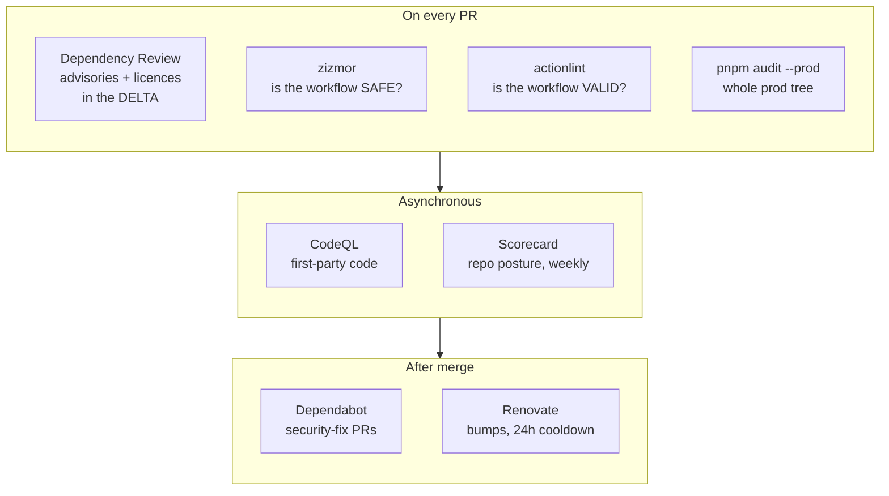

# ADR-007: CI security tooling — what we run, what we declined, and why

**Status:** Accepted (implemented 2026-09-19). Adds three tools — **Dependency
Review**, **zizmor**, **OpenSSF Scorecard** — on top of the existing CodeQL /
Dependabot / Renovate / `pnpm audit` / actionlint layers, and records the
candidates that were considered and declined (Snyk, SonarCloud, the rest of
GitHub's starter-workflow catalogue). Revised the same day: every zizmor ignore
was subsequently removed (see
[Revision](#revision-2026-09-19-all-17-ignores-removed--and-what-the-lockfile-exposed))
— which surfaced 30 advisories in the Vercel CLI's tree. What remains open is in
[Open items](#open-items).

> Sibling decision records live alongside this one in `docs/adr/`. This ADR is
> about the **pipeline**, not the product: nothing here touches `packages/`.

## Context

The trigger was a survey of GitHub's *Actions → New workflow* catalogue
(`/actions/new`): which of those starter workflows are worth having here? The
honest answer needed an inventory first, because the catalogue is written for a
fresh repository and this one is not.

**What was already in place** (measured 2026-09-19, not assumed):

| Layer | What it covers | Where |
|---|---|---|
| CodeQL default setup | Static analysis of first-party code — `javascript-typescript` **and** `actions` | repo setting (`code-scanning/default-setup` → `configured`) |
| Dependabot **security** updates | Opens a fix PR once an advisory hits a dependency already on `main` | `.github/dependabot.yml` (version updates deliberately off, limit 0) |
| Renovate | Routine bumps + action-digest pinning, behind a **24h release cooldown** | `.github/renovate.json5` |
| `pnpm audit --prod` | Known advisories in the **production** tree, every CI run | `ci.yml` → grep-gates step |
| actionlint | Workflow **validity** (syntax, expressions, runner labels) | `pnpm lint:actions` |
| SHA-pinned actions, top-level `permissions:`, `main` ruleset | Workflow hygiene | every workflow |

Laying those side by side exposed three gaps — each one a *window in time or
scope* that no existing layer watches:

1. **Nothing looks at a PR's dependency delta.** The cooldown vets *freshness*,
   not advisories. `pnpm audit --prod` is prod-only, so a vulnerable
   **devDependency** — build tooling and test runners, i.e. the code that
   executes with CI secrets within reach — passes it. Dependabot acts only
   *after* the vulnerable version is on `main`. And **nothing checks licences**.
2. **Nothing asks whether a workflow is *safe*.** actionlint proves a workflow is
   well-formed; it has no opinion on template injection, persisted credentials,
   or an action ref that does not belong to the repo it names. CodeQL's `actions`
   pack overlaps here but runs asynchronously, *after* the CI rollup — it has
   been missed at merge time more than once.
3. **Nothing watches the repo's own posture for drift.** The hygiene above is
   convention, upheld by whoever writes the next workflow. No tool notices the
   day one ships without it, or a ruleset is loosened in Settings.

## Decision

Add one tool per gap, each placed where its signal is actionable:

| Tool | Gap | Runs | Gates? |
|---|---|---|---|
| **Dependency Review** (`actions/dependency-review-action`) | 1 | every PR, own workflow, ~20s | **yes** — fails the PR |
| **zizmor** | 2 | every CI run, a `checks`-job step + the local gauntlet | **yes** — zero findings |
| **OpenSSF Scorecard** (`ossf/scorecard-action`) | 3 | weekly + on workflow/ruleset change | **no** — report-only |

### Dependency Review — a gate, on both scopes, with a licence *deny* list

- **`fail-on-severity: low`.** The repo's standing policy is zero findings, not
  a severity budget.
- **`fail-on-scopes: runtime, development`.** The action's default is `runtime`
  only — which would have reproduced exactly the blind spot it was added to
  close.
- **`deny-licenses` (AGPL / GPL / SSPL), not `allow-licenses`.** Decided from a
  measurement, not a preference: all ~1,200 packages in the tree are permissive
  (1,045 MIT, then ISC / Apache-2.0 / BSD / …) and the repo is MIT, so strong
  copyleft is the only class that would change what this repo may do. An allow
  list would instead fail a PR on every novel-but-harmless SPDX id — and
  `BlueOak-1.0.0`, `MIT-0` and `0BSD` are all *already* in the tree.
- **No checkout, no PR comment.** It reads the dependency graph over the API, so
  the job holds a read-only token and posts its verdict to the job summary.

Known soft spot: `node-forge` is dual-licensed `(BSD-3-Clause OR GPL-2.0)`. If a
future bump of it trips the deny list, the fix is
`allow-dependencies-licenses: pkg:npm/node-forge` (the `OR` means BSD applies) —
not loosening the list.

### zizmor — a hard gate, fixed to zero rather than baselined

Wired as `pnpm lint:actions:security`, next to actionlint, via a pinned binary
(`scripts/install-zizmor.sh`) that **verifies a sha256 per platform** — a
security gate that pipes an unverified download into CI would be its own
finding. (actionlint's installer did exactly that until Scorecard flagged it;
it now has the same verified shape — see
[First Scorecard run](#first-scorecard-run-2026-09-19).)

The first run over the ten existing workflows reported **35 findings under three
rules**. They were resolved as *classes*, not baselined:

| Rule | Hits | Resolution |
|---|---|---|
| `artipacked` | 17 | **Fixed.** Every `actions/checkout` now states `persist-credentials` explicitly: `false` on the 13 jobs that never push, `true` — with a comment saying why — on the 4 that do (gh-pages publishing ×3, the golden-regeneration commit). Verified first that no non-pushing job makes a later git network call. |
| `dependabot-cooldown` | 1 | **Fixed.** `cooldown: default-days: 7` added. Inert today (version updates are off) but it means re-enabling them can never bypass the cooldown by accident. Cooldown does not apply to security updates. |
| `adhoc-packages` | 17 | First **ignored inline, with reasons** (13 "permanently", 4 temporarily) — then **all 17 fixed and every ignore deleted** later the same day. The "permanent" reasoning below was wrong; it is kept, with its correction directly after it. |

**The `adhoc-packages` call.** The rule flags `npm install -g <pkg>` because
such installs sit outside any lockfile. It fired on two different things, and
they were *measured* rather than argued about:

- **`corepack@0.35.0` ×13 — a true false positive; ignore is permanent.** The
  rule names two risks: an unpinned version, and unpinned sub-dependencies.
  This is an exact pin, and `npm view corepack@0.35.0 dependencies` returns
  **nothing** — there is no sub-tree to float. It also *cannot* move under the
  lockfile: it provisions the package manager that reads the lockfile.
  Swapping to `pnpm/action-setup` would satisfy the linter only by moving an
  equivalent ad-hoc install inside a third-party action, where the linter
  cannot see it — relocating the finding, not resolving it.
- **`vercel@57` ×4 — a real, mild finding; ignore is temporary.** `57` resolves
  to exactly `57.0.0` today and 34 of its 35 direct deps are exact pins, but the
  transitive tree still re-resolves on every deploy, outside the lockfile and
  the 24h cooldown, in a job holding `VERCEL_TOKEN`. The proper fix (the CLI
  under a lockfile) changes the three deploy workflows, which are
  dispatch-only — it can only be verified by a real deploy, so it is its own PR.

Each ignore is an inline `# zizmor: ignore[adhoc-packages]` with its reason on
the lines above it — deliberately **not** a line-numbered `zizmor.yml` list
(which rots on every edit) and **not** a repo-wide `disable` (which would blind
the gate to the *next* ad-hoc install, including an unpinned one — the case the
rule is actually good at).

One prediction was **wrong** and is recorded as such: the `workflow_dispatch`
inputs (`scenario_pattern` and friends) were expected to be template-injection
risks. zizmor found **none** — they were already routed through `env:`.

**Online vs offline.** With `GH_TOKEN` set zizmor also runs its online audits
(`known-vulnerable-actions`, `impostor-commit`, `ref-confusion`). CI sets it; a
local gauntlet run without a token degrades to the offline set. **CI is the
authoritative run.**

#### Revision (2026-09-19): all 17 ignores removed — and what the lockfile exposed

Asked directly *"are these not fixable?"*, the honest answer turned out to be
**yes, all of them** — and the claim above that Corepack "*cannot* move under
the lockfile" was **wrong**. It cannot use *pnpm's* lockfile (it is what
provisions pnpm), but **npm ships with Node**, so an *npm* lockfile works
perfectly well. The "permanent false positive" was a fixable finding that had
been reasoned about instead of tested.

What replaced the 17 lines:

| Was | Now |
|---|---|
| `npm install -g corepack@0.35.0 && corepack enable` ×13 workflows + the server `Dockerfile` | `scripts/enable-corepack.sh` → `npm ci` from `scripts/ci-tooling/corepack/package-lock.json` (sha512 integrity), installed **outside** the checkout. One manifest Renovate can bump, instead of 14 hand-edited version strings |
| `npm install -g vercel@57` ×4 | `scripts/install-vercel.sh` → `npm ci` from `scripts/ci-tooling/vercel/package-lock.json`, lifecycle scripts off |

The manifests live under `scripts/`, not `.github/`, because `.dockerignore`
excludes `.github` and the server image needs the Corepack one. Both lockfiles
were generated with `npm install --package-lock-only --before=<24h ago>` — npm
has no `minimumReleaseAge`, and `--before` is how a hand-made lockfile honours
the same cooldown.

**What the lockfile exposed.** `npm install -g vercel@57` had been invisible to
every scanner. Under a lockfile, `npm audit` immediately reported **30 known
advisories in the CLI's tree — 1 critical (`tar`), 18 high** — all traceable to
8 root packages that `vercel@57.0.0` exact-pins. Every deploy had been
installing them. Measured, not assumed:

| CLI version | Packages | Advisories |
|---|---|---|
| 57.0.0 (pinned) | 353 | 30 (1 critical, 18 high) |
| 58.0.0 | 353 | 30 — identical |
| 59.23.1 (newest outside the cooldown) | 390 | 29 — same 8 roots |

So **upgrading the CLI does not help**; upstream has not fixed them. The fix is
npm `overrides` in the tooling manifest, each lifting exactly one vulnerable
package onto its patched line (`tar`, `undici`, `js-yaml`, `minimatch`,
`path-to-regexp` ×2, `smol-toml`, `ajv`, `@tootallnate/once`) → **`npm audit`:
0**. Seven are same-major bumps; `undici` 5.x → 6.x is the one major jump (the
5.x line has no patched release).

Verification, and its limit: an **A/B smoke test** ran a real `vercel build` on
a small static project with the stock tree and with the overridden tree — both
exit 0 with identical `.vercel/output`. That exercises the build path. It does
**not** exercise `vercel pull` / `vercel deploy`, which talk to the network
through `undici` — only a real Deploy dispatch proves those (Open items). If it
fails, it fails loudly at deploy time and the revert is one file.

This is the first real catch by the **Dependency Review** gate's logic, too:
with fail-on-severity `low` on both scopes, a lockfile carrying those 30
advisories could not have merged. The gate forced the question.

The server image was verified for real, not by reading the Dockerfile: a local
`docker build` of `packages/server/Dockerfile` succeeds, `pnpm --version` inside
it reports the pinned 12.4.1 resolved from `/opt/corepack/bin` (there is no
global Corepack in the image any more), `pnpm install --frozen-lockfile` and the
server build pass, and the container boots and serves `/health`. That was also
the first real build against the digest pin from the Scorecard follow-up.

The `curl … | sh` installers went the same way — see
[First Scorecard run](#first-scorecard-run-2026-09-19).

### Scorecard — report-only, results kept in-repo

- **Report-only by design.** Several checks cannot score well here for reasons
  that are decisions, not defects: a single maintainer (`Code-Review`), no
  published releases (`Signed-Releases`, `Packaging`), no fuzzing. A gate on the
  aggregate would be a gate on those. **Read the per-check findings, not the
  number.**
- **`publish_results: false`.** Findings go to this repo's code-scanning tab
  only. Publishing to the public scorecard.dev API (what a README badge reads)
  is an outward-facing choice, left open — see below.

### First Scorecard run (2026-09-19)

The first run on `main` raised **32 alerts**, every one pre-dating the PR that
added it — nothing had ever scored the repo. Triage, by class:

| Alerts | Verdict | Action |
|---|---|---|
| `PinnedDependencies` — `packages/server/Dockerfile` `FROM node:26-slim` | **real** — a tag is mutable | **Fixed**: pinned by multi-arch index digest; Renovate's docker manager keeps it current behind the cooldown |
| `PinnedDependencies` — `scripts/install-actionlint.sh` (`curl … \| bash`) | **real** — unverified download | **Fixed**: direct tarball + per-platform sha256, same shape as `install-zizmor.sh`. Bumped 1.7.7 → 1.7.12 in passing, which knows `macos-26` natively — so `.github/actionlint.yaml`, a suppression whose own comment asked to be deleted on the next bump, is gone |
| `PinnedDependencies` — `deploy.yml` flyctl (`curl … \| sh`) | **real** | First deferred, then **fixed**: `scripts/install-flyctl.sh`, pinned release + per-platform sha256, verified locally end to end. Its header states the trade-off — a pinned CLI can rot when Fly retires old versions; that failure is loud and the fix is one file |
| `PinnedDependencies` — `ios-visual-spike.yml` Maestro (`curl … \| bash`, ×2) | **real** | First deferred, then **fixed**: `scripts/install-maestro.sh`, pinned `maestro.zip` + sha256, same `~/.maestro` end state as upstream's installer. Pinning also makes the spike's measurements comparable run to run. Side effect: the `probe` job's checkout moved ahead of the installers (they are in-repo scripts now) |
| `PinnedDependencies` — 18× `npmCommand`: the 13 + 4 workflow `npm install -g corepack` / `vercel` lines, plus the Dockerfile's corepack line | same lines zizmor's `adhoc-packages` flagged | First "no change — already decided", then **fixed**: all 18 replaced by lockfile-based `npm ci` (see the Revision above) |
| `TokenPermissions` ×4 (high) — the four publishing jobs | **half real**: two of the four (`publish-site.yml`, `update-visual-goldens.yml`) granted `contents: write` at the *workflow* level, not on the job that pushes | **Fixed — and all four closed**, which was **not** what this ADR first predicted. The original text here read "tightened, not cleared: Scorecard still warns on job-level write". The re-score after the fix closed all four, *including the two job-level alerts on `visual.yml` and `coverage-report.yml`, which were never edited*. Likely mechanism (inferred from the outcome, not read from Scorecard's source): alerts are emitted per **check**, only workflow-level write deducts from the Token-Permissions score, and once the check reaches full marks every alert under it closes. Practical rule: grant write on the job, never the workflow |
| `SecurityPolicy` | **real**, cheap | **Fixed**: root `SECURITY.md` (private vulnerability reporting was already enabled) |
| `CodeReview`, `Fuzzing`, `CIIBestPractices` | structural — single maintainer, a demo, no fuzz targets | **No change**, as predicted above |
| `BranchProtection` (high) | **unverified** — Scorecard's default token often cannot read rulesets, so this may be a false reading rather than a gap | **Open** — see Open items |

**Outcome, measured on the re-score of `main` after the fixes landed (#777):
32 → 25 open, 7 closed** — the Dockerfile pin, the actionlint installer,
`SecurityPolicy`, and all four `TokenPermissions`.

This is the argument for *report-only* in concrete form: the 25 that remain are
the 18 `npmCommand` lines this ADR already ruled on, the 3 deferred installers,
and 4 repo-level checks (`CodeReview`, `Fuzzing`, `CIIBestPractices`,
`BranchProtection`). As a gate, Scorecard would have demanded the first group be
"fixed".

## Considered and declined

### Snyk — declined (for now): duplicates four layers, adds an account and a token

Snyk's two relevant products map onto things already running:

| Snyk product | Already covered by |
|---|---|
| Snyk Open Source (dependency CVEs + fix PRs) | Dependabot security updates · `pnpm audit --prod` · Dependency Review · Renovate |
| Snyk Code (SAST) | CodeQL |
| Snyk licence compliance | Dependency Review `deny-licenses` |

Its genuine edges — a proprietary advisory DB that sometimes leads GHSA, and
reachability analysis — are real but marginal for a public demo with no
customer data, and cost a third-party account, a `SNYK_TOKEN` secret in CI, and
a second stream of fix PRs to de-duplicate against Dependabot's (the exact
two-bots problem `dependabot.yml` already documents avoiding with Renovate).

**Revisit if:** the repo goes private (the GitHub-native layers stop being
free), or reachability analysis becomes worth paying for.

### SonarCloud — declined (for now): its unique value is already enforced harder, in-tree

SonarCloud's security rules overlap CodeQL. What it uniquely offers is
*maintainability* — code smells, duplication, complexity, a coverage gate. Here
those are already enforced, and enforced as **hard gates rather than a
dashboard**: Biome at zero findings with a no-disables policy, two ESLint
configs plus the repo's own custom rules, stylelint, knip (dead code),
dependency-cruiser (layering), the grep gates, and four ≥95% coverage gates.
Sonar would add a second opinion the repo's conventions would routinely
contradict, plus an external quality gate to keep in sync with them.

**Revisit if:** duplication detection specifically becomes wanted — it is the
one Sonar capability with no in-tree counterpart (`jscpd` would be the
lighter-weight first try).

### The rest of the starter catalogue

| Template(s) | Verdict | Why |
|---|---|---|
| Node.js CI, Webpack, Gulp, Deno | declined | `ci.yml` is a strict superset |
| Stale, Greetings, Labeler | declined | high-traffic-OSS tools; single maintainer, no issue backlog — they would only generate noise |
| AWS / Azure / GCP / Terraform deploys | declined | wrong targets (Vercel + Fly) |
| Pages templates (Jekyll, Astro, static) | declined | `publish-site.yml` already does this |
| SLSA provenance, attestations, SBOM | declined | meaningful for *published* artifacts; this repo publishes none, so nobody would verify them |
| Other vendor scanners (Trivy, Semgrep, Checkmarx, …) | declined | same overlap argument as Snyk; each wants an account and a token |
| **CodeQL** | already on | default setup |

## Consequences

- **Two new PR checks.** `dependency review` is its own workflow; zizmor is one
  more step in `checks`. Neither is in the `main` ruleset's *required* contexts
  yet — see Open items.
- **Every new `actions/checkout` must state `persist-credentials`**, and every
  new global install must justify itself. That is the gate working as intended.
- **The local gauntlet grew to 20 fast gates** (`CLAUDE.md` and
  `.claude/commands/rtc/gauntlet.md` updated together).
- **Four pins Renovate does not manage** — zizmor, actionlint, flyctl, Maestro:
  each is a `VERSION` plus sha256 digest(s) in its `scripts/install-*.sh`. Bump
  version and digests together, from the `gh api` command in that script's
  header. All four share one download-verify-then-run helper
  (`scripts/lib/fetch-verified.sh`). Corepack and the Vercel CLI, by contrast,
  **are** Renovate-managed now (ordinary npm manifests + lockfiles).
- **The `overrides` in `scripts/ci-tooling/vercel/package.json` are debt with an
  exit**: delete each one when the Vercel CLI ships the patched dependency
  itself, and re-run `npm audit --package-lock-only` there after any bump.

## Open items

Tracked in [`docs/STATUS.md`](../STATUS.md):

1. **Prove the new deploy path with one real Deploy dispatch.** The lockfile
   Vercel CLI (with its `undici` 5 → 6 override) and the pinned flyctl are
   verified as far as a machine without deploy credentials can take them:
   install, `--version`, and an A/B `vercel build`. `vercel pull` / `deploy` and
   `flyctl deploy` are only exercised by `deploy.yml`.
2. **Decide whether `dependency review` becomes a required check** on the `main`
   ruleset. It is a repo-settings change, so it was deliberately not made by the
   PR that introduced the workflow.
3. **`BranchProtection` — resolved as a *genuine* reading, leaving a policy
   choice.** The guess recorded earlier (that Scorecard's token could not see
   the ruleset) was **wrong**: it read `main`'s ruleset correctly. All five
   warnings describe deliberate settings — four are review requirements
   (approvers, stale-review dismissal, CODEOWNERS, last-push approval) that a
   single-maintainer repo cannot satisfy without locking itself out, and the
   fifth, "up-to-date branches", is `strict_required_status_checks_policy:
   false`, chosen on purpose to avoid the catch-up treadmill (see the
   `shipping-repo-changes` skill, Rule 3). Nothing to fix unless that policy
   changes.
4. **Decide `publish_results`** — flip to `true` (plus `id-token: write`) only if
   a public Scorecard badge is wanted.
