# Reactive Trader Cloud -- Architecture Document

## Table of Contents

1. [Overview](#1-overview)
2. [C4 Model](#2-c4-model)
   - [System Context](#21-system-context-diagram)
   - [Container Diagram](#22-container-diagram)
   - [Component Diagram -- Client](#23-component-diagram--web-client)
   - [Component Diagram -- Server](#24-component-diagram--websocket-server)
3. [UML Class Diagrams](#3-uml-class-diagrams)
   - [FX Domain Entities](#31-fx-domain-entities)
   - [Credit Domain Entities](#32-credit-domain-entities)
   - [Ports & Adapters](#33-ports--adapters-hexagonal-architecture)
4. [Sequence Diagrams](#4-sequence-diagrams)
   - [FX Price Streaming](#41-fx-price-streaming)
   - [FX Trade Execution](#42-fx-trade-execution-rpc)
   - [Credit RFQ Workflow](#43-credit-rfq-workflow)
5. [State Diagrams](#5-state-diagrams)
   - [Connection Status](#51-connection-status)
   - [Quote State Machine](#52-quote-state-machine-credit-rfq)
   - [RFQ Lifecycle](#53-rfq-lifecycle)
   - [FX Trade Execution Flow](#54-fx-trade-execution-flow)
6. [Package Dependencies](#6-package-dependencies)
7. [Communication Patterns](#7-communication-patterns)
8. [Key Design Decisions](#8-key-design-decisions)

---

## 1. Overview

**Reactive Trader Cloud Clone** is a real-time FX trading and Credit RFQ (Request for Quote) platform built as a monorepo with pnpm workspaces and Turborepo. It demonstrates reactive streaming, domain-driven design, and hexagonal architecture (ports & adapters).

**Key characteristics:**
- **Streaming-first**: All data flows as `AsyncIterable<T>` -- the universal abstraction from domain through server to client
- **Hexagonal architecture**: Pure domain logic with zero dependencies; adapters plug in at boundaries
- **WebSocket protocol**: Subscriptions for streaming data, RPC with correlation IDs for commands
- **State-of-the-World (SoW)**: Ensures consistent client state after (re)connection

**Technology stack:**

| Layer | Technology |
|-------|-----------|
| Domain | Pure TypeScript, zero runtime dependencies |
| Shared | TypeScript DTOs and wire-format contracts |
| Client | React 19, Vite, custom async-iterator hooks |
| Server | Node.js, native WebSocket, TypeScript |
| Build | pnpm workspaces, Turborepo |
| Test | Vitest (unit), Playwright (e2e) |

---

## 2. C4 Model

### 2.1 System Context Diagram

Shows the system boundary and external actors interacting with Reactive Trader Cloud.

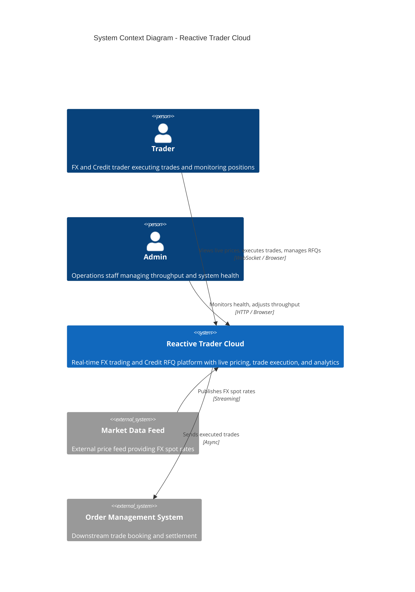

### 2.2 Container Diagram

Shows the four packages inside the system boundary and their relationships.

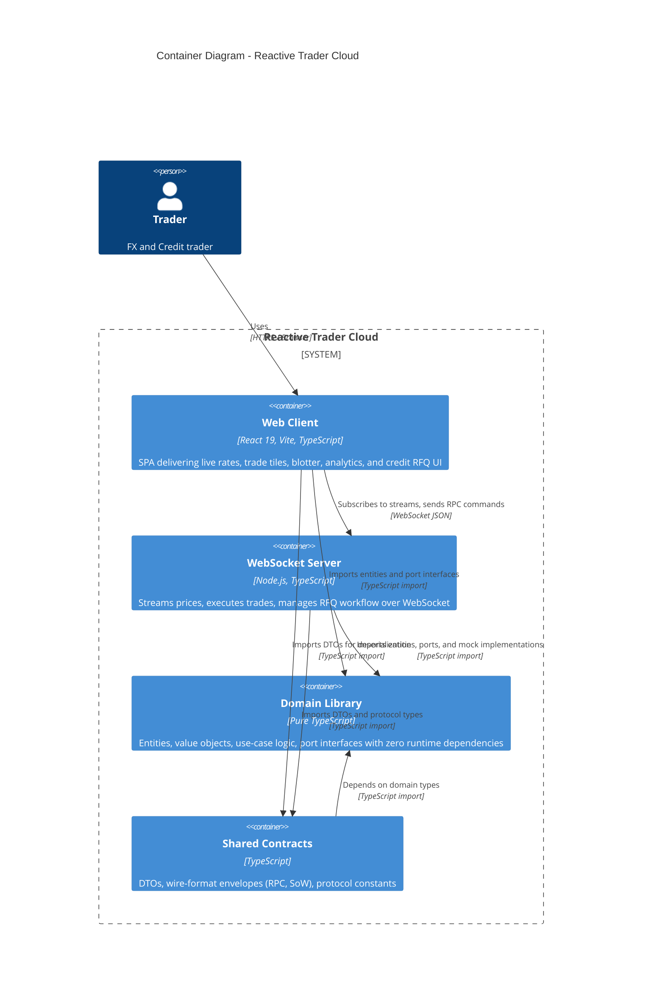

### 2.3 Component Diagram -- Web Client

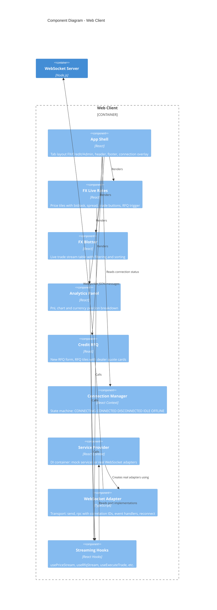

### 2.4 Component Diagram -- WebSocket Server

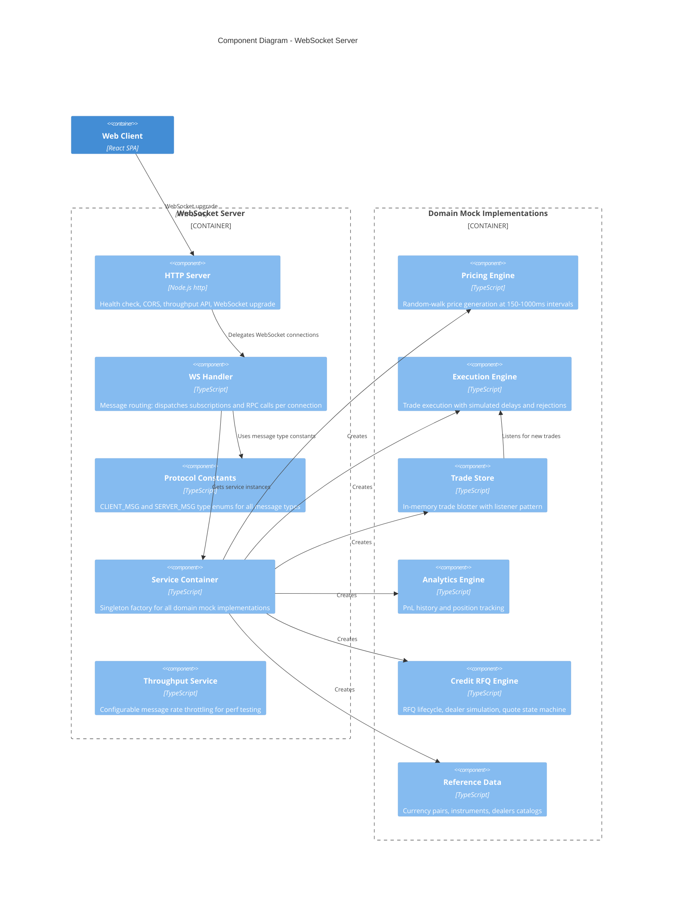

---

## 3. UML Class Diagrams

### 3.1 FX Domain Entities

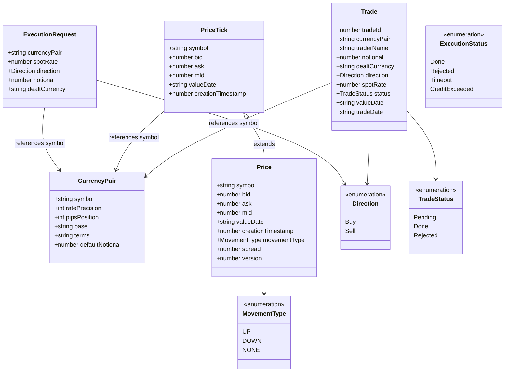

**Key functions:**
- `calculateSpread(bid, ask, pipsPosition)` -- converts bid-ask difference to pips
- `detectMovement(current, previous)` -- compares mid prices to determine UP/DOWN/NONE
- `parseNotional(input)` -- supports k/m suffixes ("1.5m" = 1,500,000)
- `isRfqRequired(notional)` -- true when notional >= 10M (triggers RFQ instead of direct execution)
- `deriveDealtCurrency(direction, pair)` -- Buy = base currency; Sell = terms currency

**Constants:** `DEFAULT_NOTIONAL = 1M`, `RFQ_THRESHOLD = 10M`, `MAX_NOTIONAL = 1B`, `PRICE_HISTORY_SIZE = 50`

### 3.2 Credit Domain Entities

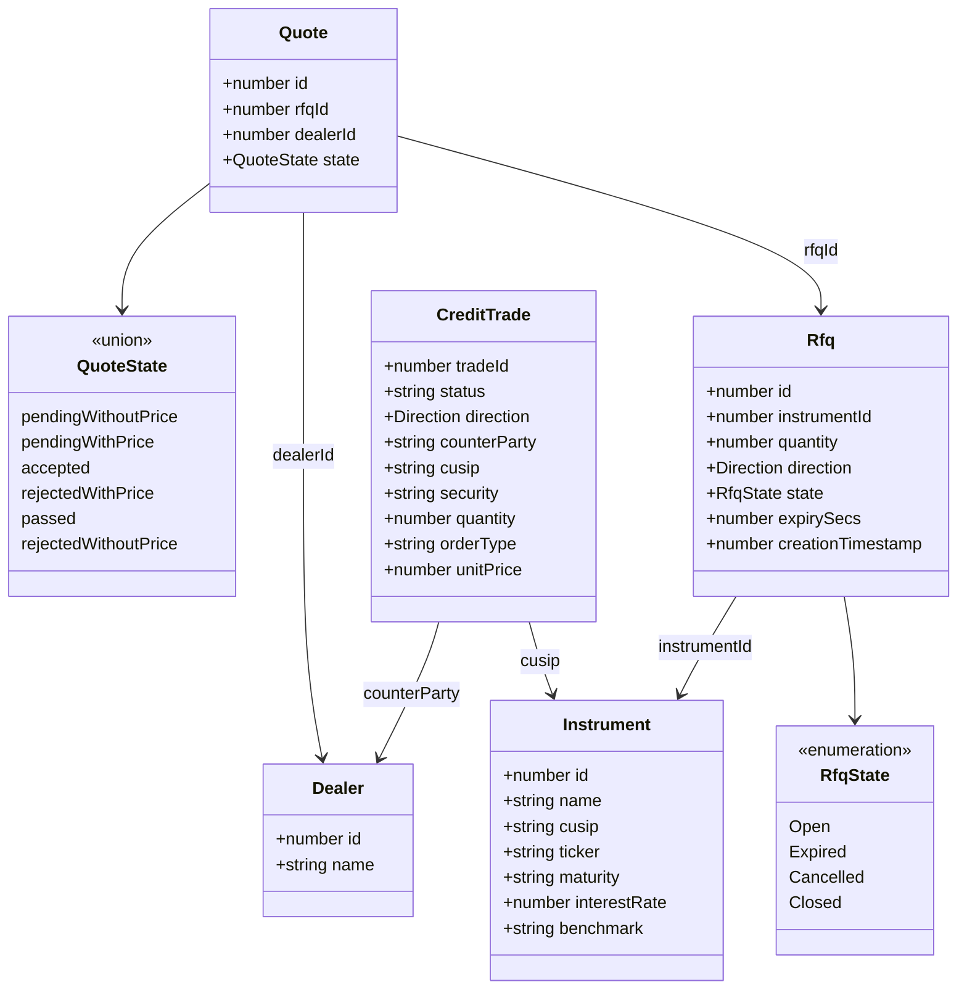

**Key functions:**
- `validQuoteTransitions(currentState)` -- returns allowed next states per current state
- **Constants:** `CREDIT_QUANTITY_MULTIPLIER = 1000`, `CREDIT_MAX_QUANTITY_INPUT = 100M`

### 3.3 Ports & Adapters (Hexagonal Architecture)

All ports use `AsyncIterable<T>` for streaming and `Promise<T>` for RPC -- no framework types leak into the domain.

```mermaid
classDiagram
    direction TB

    class PricingPort {
        <<interface>>
        +getPriceUpdates(symbol) AsyncIterable~PriceTick~
        +getPriceHistory(symbol) Promise~PriceTick[]~
    }

    class ReferenceDataPort {
        <<interface>>
        +getCurrencyPairs() AsyncIterable~CurrencyPair[]~
    }

    class ExecutionPort {
        <<interface>>
        +executeTrade(request) Promise~Trade~
    }

    class BlotterPort {
        <<interface>>
        +getTradeStream() AsyncIterable~Trade[]~
    }

    class AnalyticsPort {
        <<interface>>
        +getAnalytics(currency) AsyncIterable~PositionUpdates~
    }

    class InstrumentPort {
        <<interface>>
        +subscribe() AsyncIterable~Instrument[]~
    }

    class DealerPort {
        <<interface>>
        +subscribe() AsyncIterable~Dealer[]~
    }

    class WorkflowPort {
        <<interface>>
        +subscribe() AsyncIterable~RfqEvent~
        +createRfq(request) Promise~number~
        +cancelRfq(rfqId) Promise~void~
        +quote(request) Promise~void~
        +pass(quoteId) Promise~void~
        +accept(quoteId) Promise~void~
    }

    class MockPricingEngine {
        +getPriceUpdates(symbol) AsyncIterable~PriceTick~
        +getPriceHistory(symbol) Promise~PriceTick[]~
        +getRfqQuote(symbol) PriceTick
    }

    class MockExecutionEngine {
        +executeTrade(request) Promise~Trade~
        +onTrade(listener) void
    }

    class MockTradeStore {
        +getTradeStream() AsyncIterable~Trade[]~
    }

    class MockCreditRfqEngine {
        +subscribe() AsyncIterable~RfqEvent~
        +createRfq(request) Promise~number~
        +cancelRfq(rfqId) Promise~void~
        +quote(request) Promise~void~
        +pass(quoteId) Promise~void~
        +accept(quoteId) Promise~void~
    }

    class WsRealPricingAdapter {
        -WsAdapter ws
        +getPriceUpdates(symbol) AsyncIterable~PriceTick~
        +getPriceHistory(symbol) Promise~PriceTick[]~
    }

    class WsRealExecutionAdapter {
        -WsAdapter ws
        +executeTrade(request) Promise~Trade~
    }

    PricingPort <|.. MockPricingEngine : implements
    PricingPort <|.. WsRealPricingAdapter : implements
    ExecutionPort <|.. MockExecutionEngine : implements
    ExecutionPort <|.. WsRealExecutionAdapter : implements
    BlotterPort <|.. MockTradeStore : implements
    WorkflowPort <|.. MockCreditRfqEngine : implements
```

**Adapter selection** is controlled by `VITE_SERVER_URL`:
- **Unset** (mock mode): `createMockServices()` instantiates domain mocks directly
- **Set** (real mode): `createRealServices()` creates WebSocket-backed adapters via `WsAdapter`

---

## 4. Sequence Diagrams

### 4.1 FX Price Streaming

```mermaid
sequenceDiagram
    participant Trader
    participant Tile as FX Tile Component
    participant Hook as usePriceStream Hook
    participant SvcCtx as Service Provider
    participant WsAdapter as WebSocket Adapter
    participant Server as WS Handler
    participant Engine as MockPricingEngine

    Trader->>Tile: Opens FX workspace
    Tile->>Hook: Mount with CurrencyPair
    Hook->>SvcCtx: Get PricingPort
    SvcCtx-->>Hook: pricing adapter

    alt Mock Mode
        Hook->>Engine: getPriceUpdates(EURUSD)
        loop Every 150-1000ms
            Engine-->>Hook: PriceTick via async iterable yield
            Hook->>Hook: detectMovement + calculateSpread
            Hook->>Tile: setState(Price)
            Tile->>Trader: Render bid/ask/spread/movement
        end
    else Real Mode via WebSocket
        Hook->>WsAdapter: getPriceUpdates(EURUSD)
        WsAdapter->>Server: subscribe.pricing with symbol EURUSD
        Server->>Engine: getPriceUpdates(EURUSD)
        loop Continuous streaming
            Engine-->>Server: PriceTick via async iterable yield
            Server-->>WsAdapter: stream.priceTick with PriceTickDto
            WsAdapter-->>Hook: asyncQueue yields PriceTick
            Hook->>Hook: detectMovement + calculateSpread
            Hook->>Tile: setState(Price)
            Tile->>Trader: Render bid/ask/spread/movement
        end
    end
```

### 4.2 FX Trade Execution (RPC)

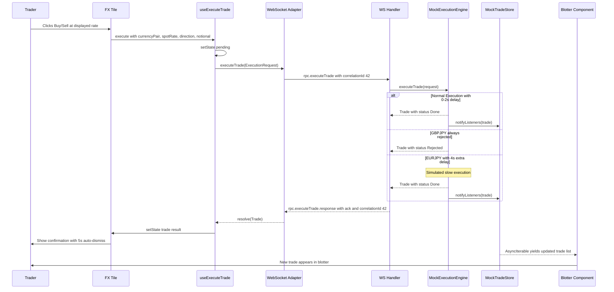

### 4.3 Credit RFQ Workflow

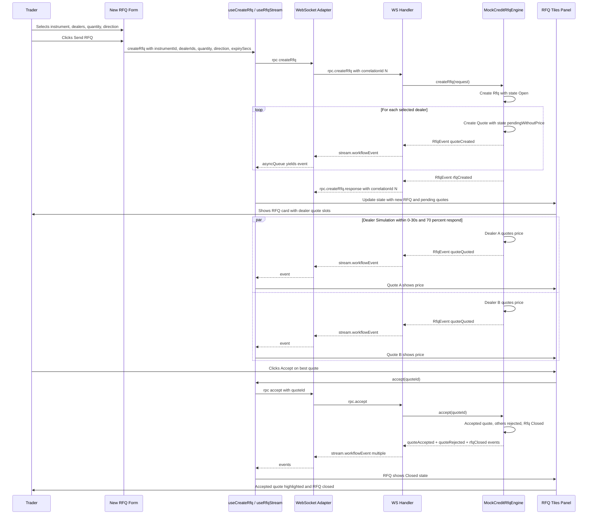

---

## 5. State Diagrams

### 5.1 Connection Status

Pure function `nextConnectionStatus(current, event)` drives all transitions.

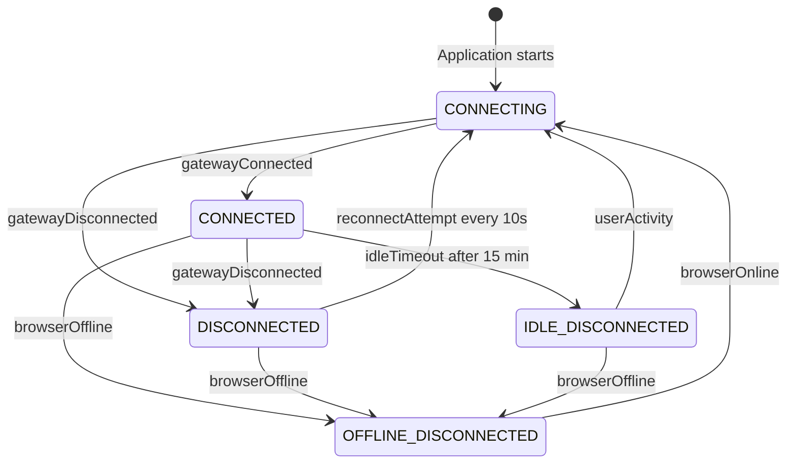

**Constants:** `IDLE_TIMEOUT_MS = 15 min`, `RECONNECT_INTERVAL_MS = 10s`

### 5.2 Quote State Machine (Credit RFQ)

Each dealer quote follows this state machine. Transitions are validated by `validQuoteTransitions()`.

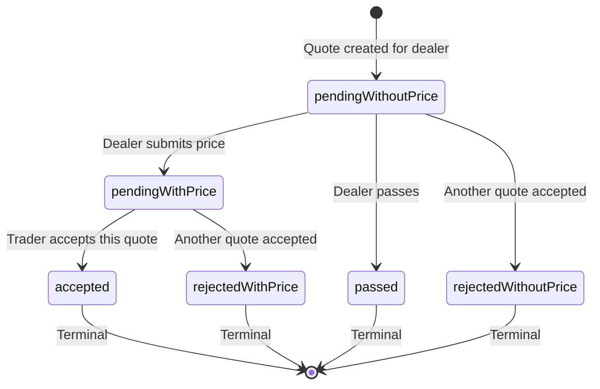

### 5.3 RFQ Lifecycle

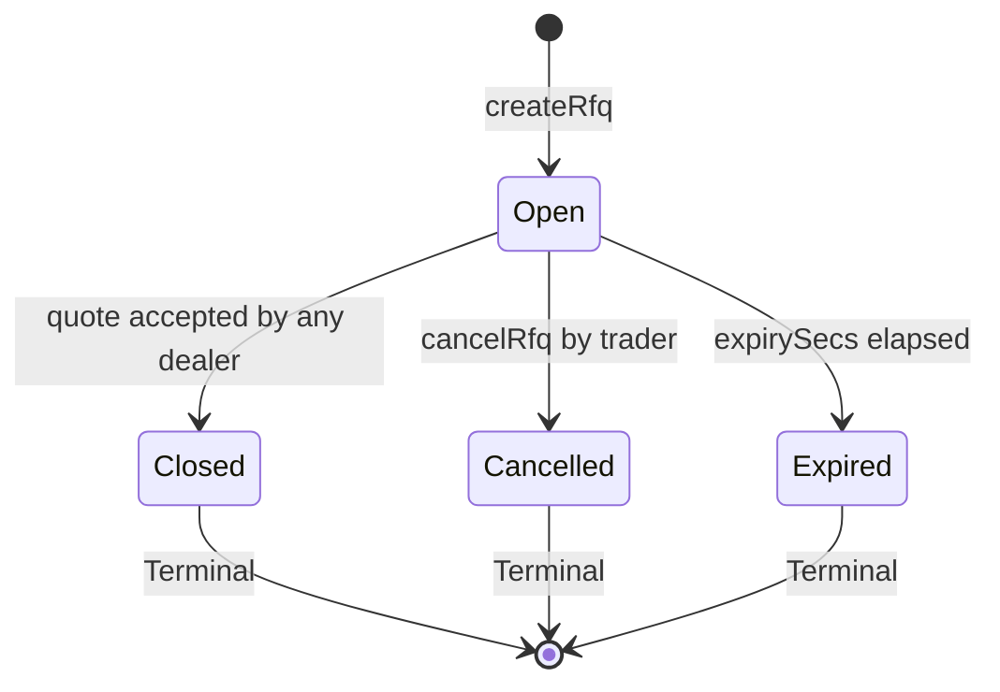

### 5.4 FX Trade Execution Flow

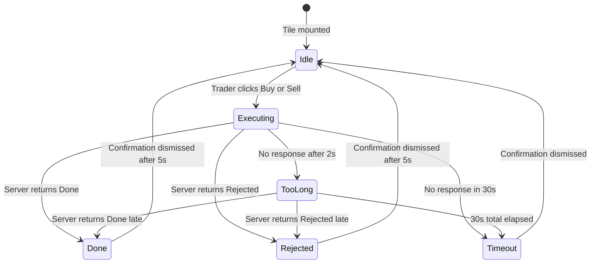

**Constants:** `EXECUTION_TIMEOUT_MS = 30s`, `TOO_LONG_THRESHOLD_MS = 2s`, `CONFIRMATION_DISMISS_MS = 5s`

---

## 6. Package Dependencies

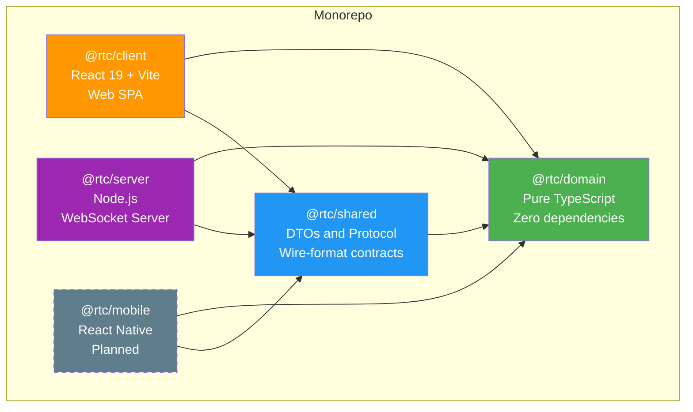

**Dependency rule:** Dependencies flow inward only.
- `domain` has **zero** runtime dependencies (enforced by pnpm strict mode)
- `shared` depends only on `domain`
- `client`, `mobile`, and `server` depend on `domain` + `shared` but never on each other

**Build order** (Turborepo topological): `domain` -> `shared` -> `client` | `server`

---

## 7. Communication Patterns

### WebSocket Message Format

```typescript
interface WsMessage {
  type: string;            // Message type identifier
  payload?: unknown;       // Data payload
  correlationId?: string;  // For RPC request-response matching
}
```

### Three Communication Styles

#### 1. Subscriptions (Fire & Forget)

Client subscribes; server streams continuously until connection closes.

```
Client -> Server:  { type: "subscribe.pricing", payload: { symbol: "EURUSD" } }
Server -> Client:  { type: "stream.priceTick", payload: PriceTickDto }  (repeated)
```

#### 2. RPC (Request-Response with Correlation ID)

```
Client -> Server:  { type: "rpc.executeTrade", payload: dto, correlationId: "42" }
Server -> Client:  { type: "rpc.executeTrade.response", payload: { type: "ack", payload: TradeDto }, correlationId: "42" }
```

#### 3. State-of-the-World (SoW)

Ensures clients have a consistent view after (re)connection.

**Bulk SoW** (blotter, reference data, analytics):
```typescript
{ updates: [...], isStateOfTheWorld: true, isStale: false }   // initial snapshot
{ updates: [...newItems], isStateOfTheWorld: false, isStale: false }  // subsequent deltas
```

**Marker-based SoW** (instruments, dealers, workflow):
```typescript
{ type: "startOfStateOfTheWorld" }
{ type: "added", payload: InstrumentDto }   // repeated per item
{ type: "endOfStateOfTheWorld" }
{ type: "added", payload: NewInstrumentDto }  // live updates after marker
```

### Async Iteration Pattern

Both client and server use `AsyncIterable<T>` as the universal streaming abstraction:

```
Domain Port (interface)     ->  AsyncIterable<PriceTick>
  |
Mock Implementation         ->  async generator yielding ticks
  |
Server WS Handler           ->  for await (tick of port) { ws.send(toDto(tick)) }
  |
Client WS Adapter           ->  createAsyncQueue<T>() bridges ws.onmessage -> AsyncIterable
  |
React Hook                  ->  for await (tick of port) { setState(enrich(tick)) }
```

---

## 8. Key Design Decisions

| Decision | Rationale |
|----------|-----------|
| **AsyncIterable everywhere (no RxJS on client)** | Simpler than Observables for fire-and-forget streams; same abstraction domain-to-UI |
| **Streaming-first data model** | Real-time financial data naturally flows as streams, not snapshots + polling |
| **Mock implementations in domain** | Tests run without network; prod uses same port interfaces with different adapters |
| **WebSocket + RPC pattern** | Subscriptions for data, RPC for commands -- clean separation of concerns |
| **SoW markers** | Ensures consistent state after reconnect without full re-fetch |
| **Pure domain with zero deps** | Fully testable, portable; any framework is replaceable by changing only its package |
| **Correlation IDs for RPC** | Multiplexes many concurrent RPC calls over a single WebSocket connection |
| **React Context for DI** | `ServiceProvider` swaps mock/real adapters; no prop drilling |
| **AbortController per subscription** | Graceful cleanup when WebSocket closes -- all active streams are cancelled |

---

## Key Files Reference

| Area | Path | Description |
|------|------|-------------|
| **Domain Ports** | `packages/domain/src/ports/*.ts` | 8 port interfaces |
| **FX Entities** | `packages/domain/src/fx/*.ts` | CurrencyPair, Price, Trade, Notional |
| **Credit Entities** | `packages/domain/src/credit/*.ts` | Instrument, Dealer, Rfq, Quote |
| **Connection** | `packages/domain/src/connection/*.ts` | ConnectionStatus state machine |
| **Domain Mocks** | `packages/domain/src/mock/*.ts` | 8 mock implementations |
| **Shared DTOs** | `packages/shared/src/fx/*.ts`, `credit/*.ts` | Wire-format contracts |
| **Protocol** | `packages/shared/src/protocol/*.ts` | RPC and SoW envelopes |
| **Client Services** | `packages/client/src/services/*.ts` | WsAdapter, mock/real factories |
| **Client FX Hooks** | `packages/client/src/fx/hooks/*.ts` | usePriceStream, useExecuteTrade |
| **Client Credit Hooks** | `packages/client/src/credit/hooks/*.ts` | useRfqStream, useCreateRfq |
| **Server Entry** | `packages/server/src/index.ts` | HTTP + WebSocket setup |
| **Server WS Handler** | `packages/server/src/ws/ws-handler.ts` | Subscription & RPC routing |
| **Server Protocol** | `packages/server/src/ws/protocol.ts` | Message type constants |
