# Reactive Trader Cloud -- Architecture Document

## Table of Contents

1. [Overview](#1-overview)
   - [Purpose](#11-purpose)
   - [Architectural Principles](#12-architectural-principles)
   - [Layered Architecture & Terminology](#13-layered-architecture--terminology)
   - [Technology Choices](#14-technology-choices)
2. [C4 Model](#2-c4-model)
   - [System Context](#21-system-context-diagram)
   - [Container Diagram](#22-container-diagram)
   - [Component Diagram -- Client App](#23-component-diagram--client-app)
   - [Component Diagram -- WebSocket Server](#24-component-diagram--websocket-server)
3. [UML Class Diagrams](#3-uml-class-diagrams)
   - [FX Domain Entities](#31-fx-domain-entities)
   - [Credit Domain Entities](#32-credit-domain-entities)
   - [Ports & Adapters](#33-ports--adapters-hexagonal-architecture)
   - [Use Cases](#34-use-cases)
   - [Presenters & State Streams](#35-presenters--state-streams)
   - [No DI in the UI](#36-no-di-in-the-ui)
4. [Sequence Diagrams](#4-sequence-diagrams)
   - [FX Price Streaming](#41-fx-price-streaming)
   - [FX Trade Execution](#42-fx-trade-execution-rpc)
   - [Credit RFQ Workflow](#43-credit-rfq-workflow)
5. [State Diagrams](#5-state-diagrams)
   - [Connection Status](#51-connection-status)
   - [Quote State Machine](#52-quote-state-machine-credit-rfq)
   - [RFQ Lifecycle](#53-rfq-lifecycle)
   - [FX Trade Execution Flow](#54-fx-trade-execution-flow)
6. [Package Dependencies](#6-package-dependencies)
7. [Communication Patterns](#7-communication-patterns)
8. [Replaceability Matrix](#8-replaceability-matrix)
9. [Test Strategy](#9-test-strategy)
10. [Key Design Decisions](#10-key-design-decisions)
11. [Key Files Reference](#11-key-files-reference)

---

## 1. Overview

### 1.1 Purpose

**Reactive Trader Cloud Clone** is a real-time FX trading and Credit RFQ (Request for Quote) platform. It serves equally as a working trading app and as a reference for clean, framework-agnostic architecture.

The codebase is organised so that any single technology -- React, RxJS, react-rxjs, Vite, the WebSocket transport, Vitest, Playwright -- can be replaced with another by changing only its layer. The rest of the system, and the behavioural test suite, continue to work unchanged.

### 1.2 Architectural Principles

These rules override individual technology choices.

**1. Make Choices, Defer Commitment.** Picking a technology is fine; binding the rest of the codebase to it is not. Framework types never cross inward boundaries. Choices are made at the edges and bound at a single Composition Root.

**2. The Dependency Rule** ([Uncle Bob, Clean Architecture](https://blog.cleancoder.com/uncle-bob/2012/08/13/the-clean-architecture.html)). Source-code dependencies point only inward. Inner circles know nothing about outer circles. Entities know nothing about use cases; use cases know nothing about presenters; presenters know nothing about UI frameworks.

**3. Dumb UI.** The UI layer renders state and emits intents. It contains no business logic, no transport awareness, and no orchestration. A complete UI rewrite from React to SolidJS (or anything else) should be tractable, given a hook-shaped contract and a behavioural test suite.

**4. Behavioural Tests as Insurance.** Tests describe *what* the system does, not *how*. They do not import React, RxJS, or Playwright internals; framework-specific glue lives in step definitions and page objects. Behavioural specs survive technology swaps and are the contract that makes a swap safe.

**5. Don't Over-Abstract.** Some technologies (a WebSocket transport, an HTTP client) are easy to wrap behind a port. Others (React, RxJS) are not -- abstracting them produces awkward, leaky facades that fight the framework's grain. Where wrapping is hard, keep the layer that uses the framework deliberately thin, so a behavioural-test-backed regeneration is cheap.

### 1.3 Layered Architecture & Terminology

Two terms commonly conflated -- "client" and "UI" -- mean different things here.

| Term | Meaning |
|---|---|
| **Domain** | Pure-TypeScript entities, value objects, ports, and use cases. Lives in `@rtc/domain`. RxJS is the single permitted runtime dependency (used as the boundary stream type). Knows nothing about UI or transport. |
| **Server** | Process that hosts adapters around domain ports and serves data to clients over WebSocket. |
| **Client** | Everything that runs in the browser -- the entire JavaScript bundle. **Includes** use cases, presenters, *and* the UI layer. |
| **Application Layer (client)** | Use cases (vanilla TS + RxJS, shared with domain) + Presenters (RxJS streams). Lives inside `@rtc/client` but contains zero React. Could be promoted to `@rtc/client-app` later if useful. |
| **UI Layer (client)** | React components + react-rxjs-bound hooks. Consumes the Application Layer through hook contracts only. Never imports `rxjs`. |

Note: **"no RxJS on the UI side" is not the same as "no RxJS on the client side"**. RxJS is the boundary stream type for ports and use cases (in `@rtc/domain`) and is also the implementation language of the client's presenter layer. It is forbidden in the UI Layer.

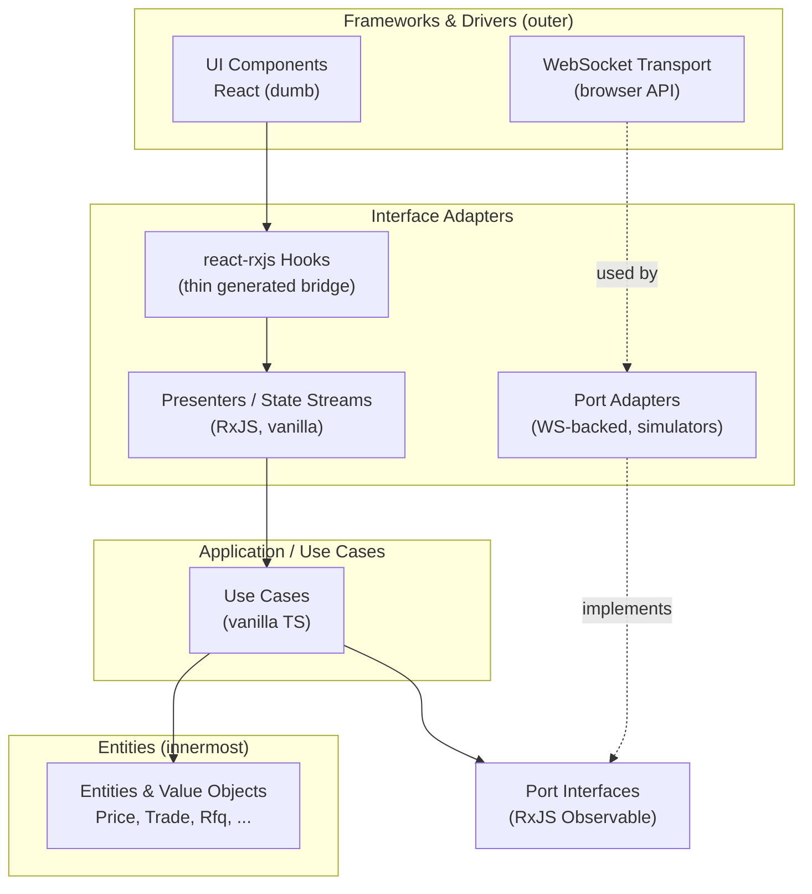
```mermaid
graph TB
    subgraph FrameworksDrivers["Frameworks & Drivers (outer)"]
        UI["UI Components<br/>React (dumb)"]
        WS["WebSocket Transport<br/>(browser API)"]
    end
    subgraph InterfaceAdapters["Interface Adapters"]
        Hooks["react-rxjs Hooks<br/>(thin generated bridge)"]
        Presenters["Presenters / State Streams<br/>(RxJS, vanilla)"]
        Adapters["Port Adapters<br/>(WS-backed, simulators)"]
    end
    subgraph ApplicationCircle["Application / Use Cases"]
        UseCases["Use Cases<br/>(vanilla TS)"]
    end
    subgraph EntitiesCircle["Entities (innermost)"]
        Entities["Entities & Value Objects<br/>Price, Trade, Rfq, ..."]
    end
    Ports["Port Interfaces<br/>(RxJS Observable)"]

    UI --> Hooks
    Hooks --> Presenters
    Presenters --> UseCases
    UseCases --> Ports
    UseCases --> Entities
    Adapters -.implements.-> Ports
    WS -.used by.-> Adapters
```

The arrows are source-code dependencies. The UI imports hooks but has no path to ports, adapters, or use cases. Ports are dependency-inverted -- adapters point at port interfaces, never the reverse.

### 1.4 Technology Choices

The current stack is a snapshot, not a commitment. Each row says what role is being played and what's playing it today. Cost-of-replacement is detailed in [§8 Replaceability Matrix](#8-replaceability-matrix).

| Role | Currently | Allowed inside the layer? |
|---|---|---|
| Entities & use cases | Pure TypeScript + RxJS | RxJS only (the explicit architectural exception in `@rtc/domain`) |
| Boundary stream type | RxJS `Observable<T>` | RxJS, the single explicit dependency exception in `@rtc/domain` |
| Client state streams | RxJS (planned) | RxJS, vanilla TS |
| UI ↔ stream bridge | react-rxjs (planned) | The bridge library only |
| UI rendering | React 19 | React; **no `rxjs` import** |
| Build tooling | Vite | -- |
| Server framework | Node.js + native WebSocket | -- |
| Wire format | JSON over WebSocket | DTOs in `@rtc/shared` |
| Unit test runner | Vitest | -- |
| E2E driver | Playwright + Cypress | -- |
| Behavioural specs | Gherkin | -- |
| Build orchestration | pnpm workspaces + Turborepo | -- |

---

## 2. C4 Model

### 2.1 System Context Diagram

Shows the system boundary and external actors interacting with Reactive Trader Cloud.

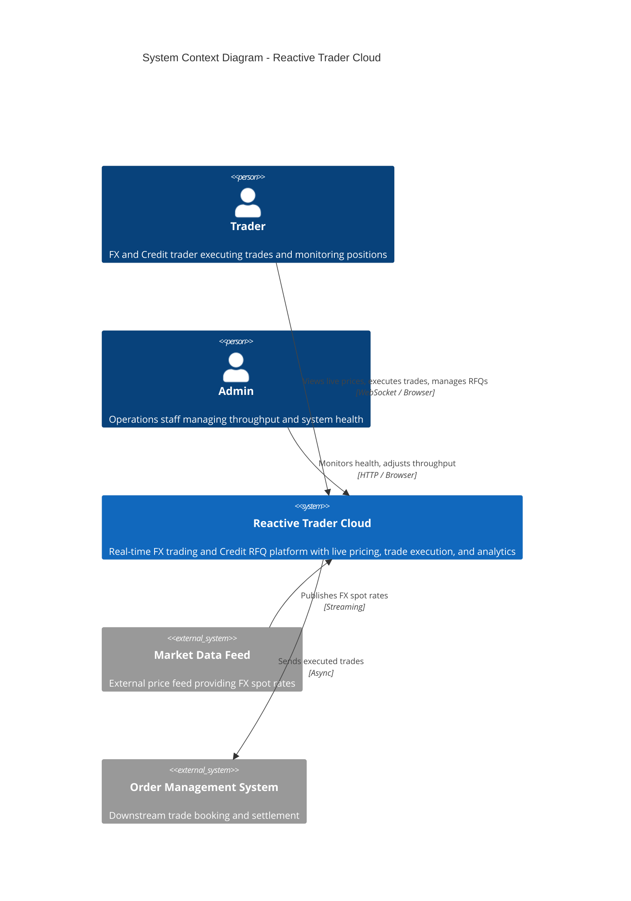
```mermaid
C4Context
    title System Context Diagram - Reactive Trader Cloud

    Person(trader, "Trader", "FX and Credit trader executing trades and monitoring positions")
    Person(admin, "Admin", "Operations staff managing throughput and system health")

    System(rtc, "Reactive Trader Cloud", "Real-time FX trading and Credit RFQ platform with live pricing, trade execution, and analytics")

    System_Ext(market, "Market Data Feed", "External price feed providing FX spot rates")
    System_Ext(oms, "Order Management System", "Downstream trade booking and settlement")

    Rel(trader, rtc, "Views live prices, executes trades, manages RFQs", "WebSocket / Browser")
    Rel(admin, rtc, "Monitors health, adjusts throughput", "HTTP / Browser")
    Rel(market, rtc, "Publishes FX spot rates", "Streaming")
    Rel(rtc, oms, "Sends executed trades", "Async")
```

### 2.2 Container Diagram

Containers are described by **role first, current technology second**. The roles are the contract; the technology is replaceable.

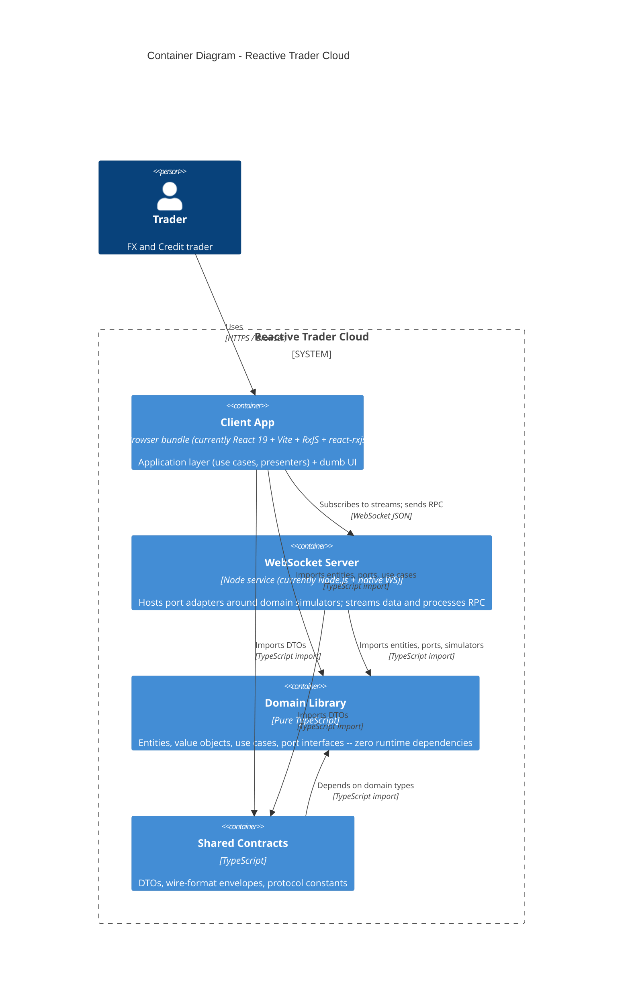
```mermaid
C4Container
    title Container Diagram - Reactive Trader Cloud

    Person(trader, "Trader", "FX and Credit trader")

    System_Boundary(rtc, "Reactive Trader Cloud") {
        Container(client, "Client App", "Browser bundle (currently React 19 + Vite + RxJS + react-rxjs)", "Application layer (use cases, presenters) + dumb UI")
        Container(server, "WebSocket Server", "Node service (currently Node.js + native WS)", "Hosts port adapters around domain simulators; streams data and processes RPC")
        Container(domain, "Domain Library", "Pure TypeScript", "Entities, value objects, use cases, port interfaces -- zero runtime dependencies")
        Container(shared, "Shared Contracts", "TypeScript", "DTOs, wire-format envelopes, protocol constants")
    }

    Rel(trader, client, "Uses", "HTTPS / Browser")
    Rel(client, server, "Subscribes to streams; sends RPC", "WebSocket JSON")
    Rel(client, domain, "Imports entities, ports, use cases", "TypeScript import")
    Rel(client, shared, "Imports DTOs", "TypeScript import")
    Rel(server, domain, "Imports entities, ports, simulators", "TypeScript import")
    Rel(server, shared, "Imports DTOs", "TypeScript import")
    Rel(shared, domain, "Depends on domain types", "TypeScript import")
```

### 2.3 Component Diagram -- Client App

The client splits into two layers. The **Application Layer** is plain TypeScript + RxJS -- no React imports anywhere. The **UI Layer** is React components plus a tiny generated hook bridge (`react-rxjs`). Replacing React means rewriting only the UI Layer; the Application Layer is untouched.

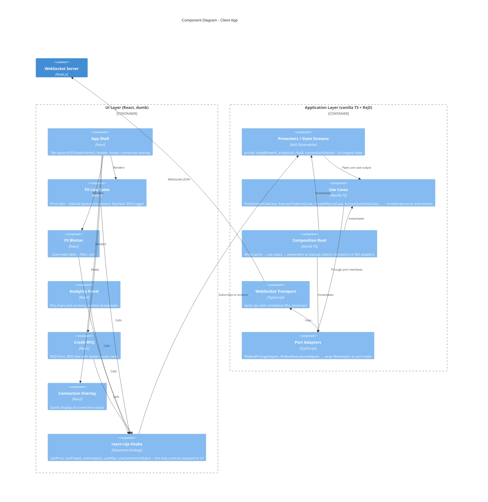
```mermaid
C4Component
    title Component Diagram - Client App

    Container_Boundary(uiLayer, "UI Layer (React, dumb)") {
        Component(app, "App Shell", "React", "Tab layout (FX/Credit/Admin), header, footer, connection overlay")
        Component(fxTiles, "FX Live Rates", "React", "Price tiles -- bid/ask/spread/movement, Buy/Sell, RFQ trigger")
        Component(blotter, "FX Blotter", "React", "Live trade table -- filter, sort")
        Component(analytics, "Analytics Panel", "React", "PnL chart and currency position breakdown")
        Component(creditRfq, "Credit RFQ", "React", "RFQ form, RFQ tiles with dealer quote cards")
        Component(connOverlay, "Connection Overlay", "React", "Dumb display of connection status")
        Component(rxHooks, "react-rxjs Hooks", "Generated bindings", "usePrice, useTrades, useAnalytics, useRfqs, useConnectionStatus -- the only contract exposed to UI")
    }

    Container_Boundary(appLayer, "Application Layer (vanilla TS + RxJS)") {
        Component(presenters, "Presenters / State Streams", "RxJS Observables", "price$, tradeBlotter$, analytics$, rfqs$, connectionStatus$ -- UI-shaped state")
        Component(useCases, "Use Cases", "Vanilla TS", "PriceStreamUseCase, ExecuteTradeUseCase, CreateRfqUseCase, AcceptQuoteUseCase, ... -- orchestrate ports and entities")
        Component(composition, "Composition Root", "Vanilla TS", "Wires ports → use cases → presenters at startup; selects simulators or WS adapters")
        Component(wsAdapter, "WebSocket Transport", "TypeScript", "send, rpc with correlation IDs, reconnect")
        Component(portAdapters, "Port Adapters", "TypeScript", "WsRealPricingAdapter, WsRealExecutionAdapter, ... wrap WsAdapter as port impls")
    }

    Container(server, "WebSocket Server", "Node.js")

    Rel(app, fxTiles, "Renders")
    Rel(app, blotter, "Renders")
    Rel(app, creditRfq, "Renders")
    Rel(app, connOverlay, "Reads")
    Rel(fxTiles, rxHooks, "Calls")
    Rel(blotter, rxHooks, "Calls")
    Rel(analytics, rxHooks, "Calls")
    Rel(creditRfq, rxHooks, "Calls")
    Rel(rxHooks, presenters, "Subscribes to streams")
    Rel(presenters, useCases, "Pipes use case output")
    Rel(useCases, portAdapters, "Through port interfaces")
    Rel(composition, portAdapters, "Instantiates")
    Rel(composition, useCases, "Instantiates")
    Rel(composition, presenters, "Instantiates")
    Rel(portAdapters, wsAdapter, "Uses")
    Rel(wsAdapter, server, "WebSocket JSON")
```

**Key boundary**: anything below the `react-rxjs Hooks` component may use RxJS freely. Anything above must not import `rxjs` and must not see `Observable<T>`. The hooks layer is the only place that bridges the two worlds, and it is small enough (see [re-rxjs/react-rxjs](https://github.com/re-rxjs/react-rxjs)) to be regenerated for SolidJS (a hypothetical `solid-rxjs`) without touching the Application Layer.

### 2.4 Component Diagram -- WebSocket Server

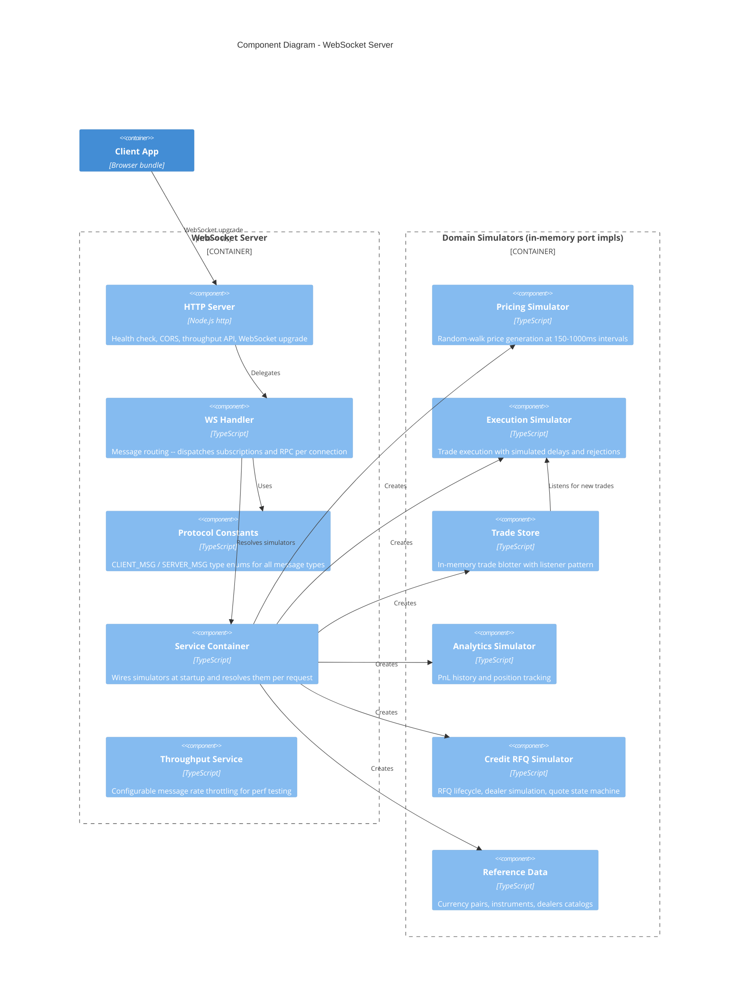
```mermaid
C4Component
    title Component Diagram - WebSocket Server

    Container_Boundary(server, "WebSocket Server") {
        Component(http, "HTTP Server", "Node.js http", "Health check, CORS, throughput API, WebSocket upgrade")
        Component(wsHandler, "WS Handler", "TypeScript", "Message routing -- dispatches subscriptions and RPC per connection")
        Component(protocol, "Protocol Constants", "TypeScript", "CLIENT_MSG / SERVER_MSG type enums for all message types")
        Component(svcContainer, "Service Container", "TypeScript", "Wires simulators at startup and resolves them per request")
        Component(throughput, "Throughput Service", "TypeScript", "Configurable message rate throttling for perf testing")
    }

    Container_Boundary(simulators, "Domain Simulators (in-memory port impls)") {
        Component(pricingSim, "Pricing Simulator", "TypeScript", "Random-walk price generation at 150-1000ms intervals")
        Component(execSim, "Execution Simulator", "TypeScript", "Trade execution with simulated delays and rejections")
        Component(tradeStore, "Trade Store", "TypeScript", "In-memory trade blotter with listener pattern")
        Component(analyticsSim, "Analytics Simulator", "TypeScript", "PnL history and position tracking")
        Component(rfqSim, "Credit RFQ Simulator", "TypeScript", "RFQ lifecycle, dealer simulation, quote state machine")
        Component(refData, "Reference Data", "TypeScript", "Currency pairs, instruments, dealers catalogs")
    }

    Container(client, "Client App", "Browser bundle")

    Rel(client, http, "WebSocket upgrade", "HTTP -> WS")
    Rel(http, wsHandler, "Delegates")
    Rel(wsHandler, protocol, "Uses")
    Rel(wsHandler, svcContainer, "Resolves simulators")
    Rel(svcContainer, pricingSim, "Creates")
    Rel(svcContainer, execSim, "Creates")
    Rel(svcContainer, tradeStore, "Creates")
    Rel(svcContainer, analyticsSim, "Creates")
    Rel(svcContainer, rfqSim, "Creates")
    Rel(svcContainer, refData, "Creates")
    Rel(tradeStore, execSim, "Listens for new trades")
```

> **Naming**: these are **simulators**, not "mocks". They are production code that stands in for an external pricing or execution venue. *Test* mocks are a separate concept and live alongside tests.

---

## 3. UML Class Diagrams

### 3.1 FX Domain Entities

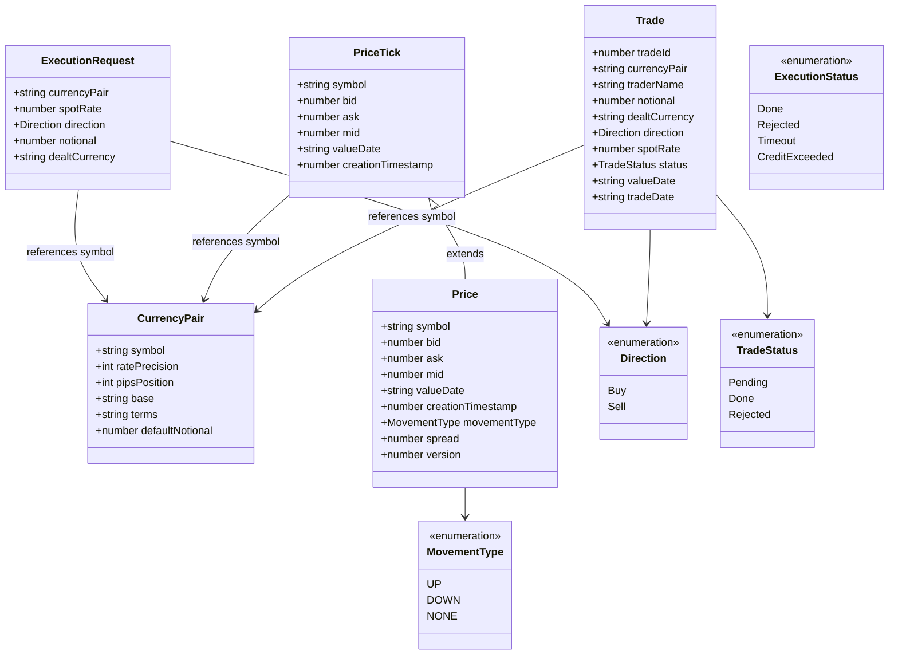
```mermaid
classDiagram
    direction TB

    class CurrencyPair {
        +string symbol
        +int ratePrecision
        +int pipsPosition
        +string base
        +string terms
        +number defaultNotional
    }

    class PriceTick {
        +string symbol
        +number bid
        +number ask
        +number mid
        +string valueDate
        +number creationTimestamp
    }

    class Price {
        +string symbol
        +number bid
        +number ask
        +number mid
        +string valueDate
        +number creationTimestamp
        +MovementType movementType
        +number spread
        +number version
    }

    class Trade {
        +number tradeId
        +string currencyPair
        +string traderName
        +number notional
        +string dealtCurrency
        +Direction direction
        +number spotRate
        +TradeStatus status
        +string valueDate
        +string tradeDate
    }

    class ExecutionRequest {
        +string currencyPair
        +number spotRate
        +Direction direction
        +number notional
        +string dealtCurrency
    }

    class MovementType {
        <<enumeration>>
        UP
        DOWN
        NONE
    }

    class Direction {
        <<enumeration>>
        Buy
        Sell
    }

    class TradeStatus {
        <<enumeration>>
        Pending
        Done
        Rejected
    }

    class ExecutionStatus {
        <<enumeration>>
        Done
        Rejected
        Timeout
        CreditExceeded
    }

    PriceTick <|-- Price : extends
    Price --> MovementType
    Trade --> Direction
    Trade --> TradeStatus
    ExecutionRequest --> Direction
    Trade --> CurrencyPair : references symbol
    PriceTick --> CurrencyPair : references symbol
    ExecutionRequest --> CurrencyPair : references symbol
```

**Key functions:**
- `calculateSpread(bid, ask, pipsPosition)` -- converts bid-ask difference to pips
- `detectMovement(current, previous)` -- compares mid prices to determine UP/DOWN/NONE
- `parseNotional(input)` -- supports k/m suffixes ("1.5m" = 1,500,000)
- `isRfqRequired(notional)` -- true when notional >= 10M (triggers RFQ instead of direct execution)
- `deriveDealtCurrency(direction, pair)` -- Buy = base currency; Sell = terms currency

**Constants:** `DEFAULT_NOTIONAL = 1M`, `RFQ_THRESHOLD = 10M`, `MAX_NOTIONAL = 1B`, `PRICE_HISTORY_SIZE = 50`

> These functions are pure, vendor-neutral, and are consumed by use cases (not by hooks). The current code in client hooks that calls `detectMovement + calculateSpread` directly is a target for relocation into `PriceStreamUseCase`.

### 3.2 Credit Domain Entities

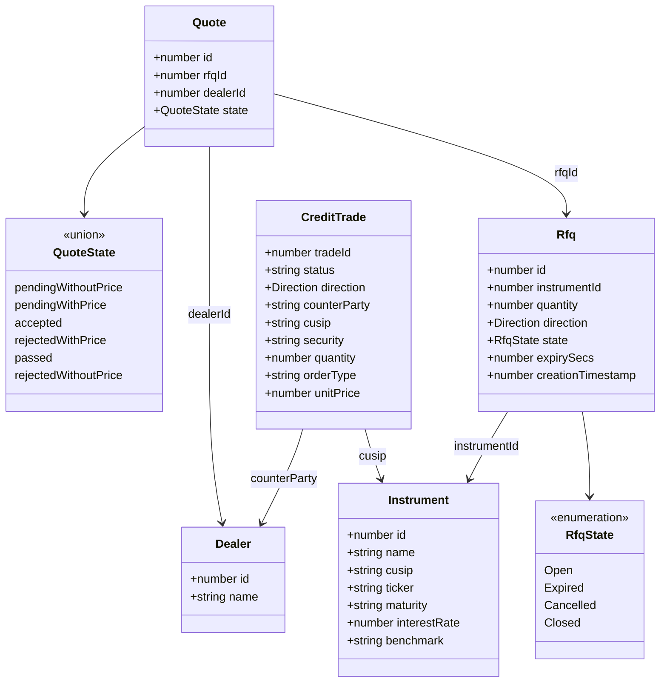
```mermaid
classDiagram
    direction TB

    class Instrument {
        +number id
        +string name
        +string cusip
        +string ticker
        +string maturity
        +number interestRate
        +string benchmark
    }

    class Dealer {
        +number id
        +string name
    }

    class Rfq {
        +number id
        +number instrumentId
        +number quantity
        +Direction direction
        +RfqState state
        +number expirySecs
        +number creationTimestamp
    }

    class QuoteState {
        <<union>>
        pendingWithoutPrice
        pendingWithPrice
        accepted
        rejectedWithPrice
        passed
        rejectedWithoutPrice
    }

    class Quote {
        +number id
        +number rfqId
        +number dealerId
        +QuoteState state
    }

    class CreditTrade {
        +number tradeId
        +string status
        +Direction direction
        +string counterParty
        +string cusip
        +string security
        +number quantity
        +string orderType
        +number unitPrice
    }

    class RfqState {
        <<enumeration>>
        Open
        Expired
        Cancelled
        Closed
    }

    Rfq --> RfqState
    Rfq --> Instrument : instrumentId
    Quote --> Rfq : rfqId
    Quote --> Dealer : dealerId
    Quote --> QuoteState
    CreditTrade --> Instrument : cusip
    CreditTrade --> Dealer : counterParty
```

**Key functions:**
- `validQuoteTransitions(currentState)` -- returns allowed next states per current state
- **Constants:** `CREDIT_QUANTITY_MULTIPLIER = 1000`, `CREDIT_MAX_QUANTITY_INPUT = 100M`

### 3.3 Ports & Adapters (Hexagonal Architecture)

All ports use RxJS `Observable<T>` -- streaming feeds and one-shot ops alike. RxJS is the single explicit dependency exception in `@rtc/domain` (see [§1.3](#13-layered-architecture--terminology)). No other framework types leak into the domain.


```mermaid
classDiagram
    direction TB

    class PricingPort {
        <<interface>>
        +getPriceUpdates(symbol) Observable~PriceTick~
        +getPriceHistory(symbol) Observable~PriceTick[]~
        +getRfqQuote(symbol, pipsPosition) Observable~RfqQuoteResult~
    }

    class ReferenceDataPort {
        <<interface>>
        +getCurrencyPairs() Observable~CurrencyPair[]~
    }

    class ExecutionPort {
        <<interface>>
        +executeTrade(request) Observable~Trade~
    }

    class BlotterPort {
        <<interface>>
        +getTradeStream() Observable~Trade[]~
    }

    class AnalyticsPort {
        <<interface>>
        +getAnalytics(currency) Observable~PositionUpdates~
    }

    class InstrumentPort {
        <<interface>>
        +getInstruments() Observable~Instrument[]~
    }

    class DealerPort {
        <<interface>>
        +getDealers() Observable~Dealer[]~
    }

    class WorkflowPort {
        <<interface>>
        +events() Observable~RfqEvent~
        +createRfq(request) Observable~number~
        +cancelRfq(rfqId) Observable~void~
        +quote(request) Observable~void~
        +pass(quoteId) Observable~void~
        +accept(quoteId) Observable~void~
    }

    class PricingSimulator {
        +getPriceUpdates(symbol) Observable~PriceTick~
        +getPriceHistory(symbol) Observable~PriceTick[]~
        +getRfqQuote(symbol, pipsPosition) Observable~RfqQuoteResult~
    }

    class ExecutionSimulator {
        +executeTrade(request) Observable~Trade~
        +onTrade(listener) void
    }

    class TradeStoreSimulator {
        +getTradeStream() Observable~Trade[]~
    }

    class CreditRfqSimulator {
        +events() Observable~RfqEvent~
        +createRfq(request) Observable~number~
        +cancelRfq(rfqId) Observable~void~
        +quote(request) Observable~void~
        +pass(quoteId) Observable~void~
        +accept(quoteId) Observable~void~
    }

    class WsRealPricingAdapter {
        -WsAdapter ws
        +getPriceUpdates(symbol) Observable~PriceTick~
        +getPriceHistory(symbol) Observable~PriceTick[]~
    }

    class WsRealExecutionAdapter {
        -WsAdapter ws
        +executeTrade(request) Observable~Trade~
    }

    PricingPort <|.. PricingSimulator : implements
    PricingPort <|.. WsRealPricingAdapter : implements
    ExecutionPort <|.. ExecutionSimulator : implements
    ExecutionPort <|.. WsRealExecutionAdapter : implements
    BlotterPort <|.. TradeStoreSimulator : implements
    WorkflowPort <|.. CreditRfqSimulator : implements
```

**Adapter selection** is performed at the **Composition Root** (single startup point), not at render time. `VITE_SERVER_URL` controls the choice:
- **Unset** -- Composition Root constructs simulators directly (in-process, no transport).
- **Set** -- Composition Root constructs `WsAdapter` and the `WsReal*Adapter` family.

### 3.4 Use Cases

Use cases sit between ports and presenters. They take ports in their constructor (or factory), accept inputs, and return `Observable<T>` -- streams *and* one-shot ops alike. They are the home for application-specific orchestration and enrichment that today leaks into client hooks (e.g. `detectMovement + calculateSpread` for FX prices). Use cases may use RxJS operators (`map`, `scan`, `defer`, ...) but no React, no DOM.


```mermaid
classDiagram
    direction TB

    class PriceStreamUseCase {
        -PricingPort pricing
        +execute(pair) Observable~Price~
    }

    class ExecuteTradeUseCase {
        -ExecutionPort execution
        +execute(request) Observable~Trade~
    }

    class TradeBlotterUseCase {
        -BlotterPort blotter
        +execute() Observable~Trade[]~
    }

    class AnalyticsUseCase {
        -AnalyticsPort analytics
        +execute(currency) Observable~PositionUpdates~
    }

    class CreateRfqUseCase {
        -WorkflowPort workflow
        +execute(request) Observable~number~
    }

    class AcceptQuoteUseCase {
        -WorkflowPort workflow
        +execute(quoteId) Observable~void~
    }

    class WorkflowEventStreamUseCase {
        -WorkflowPort workflow
        +execute() Observable~RfqEvent~
    }

    class ConnectionStatusUseCase {
        -ConnectionEventsPort events
        +execute() Observable~ConnectionStatus~
    }

    PriceStreamUseCase --> PricingPort
    ExecuteTradeUseCase --> ExecutionPort
    TradeBlotterUseCase --> BlotterPort
    AnalyticsUseCase --> AnalyticsPort
    CreateRfqUseCase --> WorkflowPort
    AcceptQuoteUseCase --> WorkflowPort
    WorkflowEventStreamUseCase --> WorkflowPort
    ConnectionStatusUseCase --> ConnectionEventsPort
```

**Boundary type**: `Observable<T>` everywhere. No React types, no DOM types. Commands (`executeTrade`, `createRfq`, `accept`, ...) emit once and complete; callers `firstValueFrom(...)` to await imperatively when needed.

**Closure-in-`defer` pattern for stateful pipes.** Use cases that need per-subscription state (e.g. `PriceStreamUseCase` keeps `previousMid` to compute movement; `PriceHistoryUseCase` keeps a rolling buffer) wrap the pipeline in `defer(() => { ... })`. `defer` runs the factory on every `subscribe`, so each subscriber gets a fresh closure -- the same isolation the previous `AsyncIterable` version got from a function-scoped `let`:

```typescript
execute(pair: CurrencyPair): Observable<Price> {
  return defer(() => {
    let previousMid: number | undefined;
    return this.pricing.getPriceUpdates(pair.symbol).pipe(
      map((tick) => {
        const movement = detectMovement(tick.mid, previousMid);
        previousMid = tick.mid;
        return enrich(tick, movement);
      }),
    );
  });
}
```

**Why this layer exists**: it isolates application logic from both ports below (transport-agnostic) and presenters above (UI-framework-agnostic). Use cases are exhaustively tested via behavioural specs that swap port implementations between simulator and contract-test fixtures. RxJS in this layer is the explicit architectural exception; replacing React leaves use cases entirely untouched.

### 3.5 Presenters & State Streams

Presenters are the client-side glue between use cases (which already emit `Observable<T>`) and the UI (which consumes hooks). The presenter layer is where multicasting and UI-shaping happen -- `share`/`shareReplay` so the underlying port subscription is started once per symbol, `combineLatest` to fan in derived state, `scan` for accumulators that the UI snapshots.

RxJS appears in three layers: **port signatures** (`@rtc/domain` ports), **use cases** (`@rtc/domain` use cases), and **presenters** (`@rtc/client`). It does **not** appear in:
- React components or hook call sites (use react-rxjs hooks; never import `rxjs`)

Because use cases already return `Observable<T>`, presenters are usually a thin `pipe(...)` over a use-case output rather than an `AsyncIterable -> Observable` conversion. Presenters expose the resulting stream to react-rxjs which auto-generates a hook.

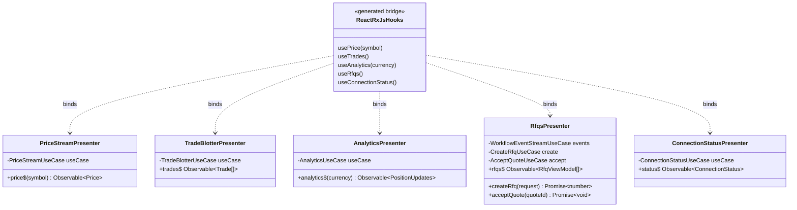
```mermaid
classDiagram
    direction TB

    class PriceStreamPresenter {
        -PriceStreamUseCase useCase
        +price$(symbol) Observable~Price~
    }

    class TradeBlotterPresenter {
        -TradeBlotterUseCase useCase
        +trades$ Observable~Trade[]~
    }

    class AnalyticsPresenter {
        -AnalyticsUseCase useCase
        +analytics$(currency) Observable~PositionUpdates~
    }

    class RfqsPresenter {
        -WorkflowEventStreamUseCase events
        -CreateRfqUseCase create
        -AcceptQuoteUseCase accept
        +rfqs$ Observable~RfqViewModel[]~
        +createRfq(request) Promise~number~
        +acceptQuote(quoteId) Promise~void~
    }

    class ConnectionStatusPresenter {
        -ConnectionStatusUseCase useCase
        +status$ Observable~ConnectionStatus~
    }

    class ReactRxJsHooks {
        <<generated bridge>>
        usePrice(symbol)
        useTrades()
        useAnalytics(currency)
        useRfqs()
        useConnectionStatus()
    }

    ReactRxJsHooks ..> PriceStreamPresenter : binds
    ReactRxJsHooks ..> TradeBlotterPresenter : binds
    ReactRxJsHooks ..> AnalyticsPresenter : binds
    ReactRxJsHooks ..> RfqsPresenter : binds
    ReactRxJsHooks ..> ConnectionStatusPresenter : binds
```

**Replacing react-rxjs (or React itself)**: react-rxjs is a small library (a few hundred lines, see [re-rxjs/react-rxjs](https://github.com/re-rxjs/react-rxjs)) that maps an `Observable<T>` to a React hook with Suspense semantics. To swap React -> SolidJS, write a tiny `solid-rxjs` analogue that maps an `Observable<T>` to a Solid signal. Presenters and below are unchanged. UI components are rewritten -- but their contracts (the hook signatures) are mirrored 1:1, and the behavioural spec suite verifies the rewrite.

**Replacing RxJS itself** (for example with effect-ts): high-cost. RxJS is the boundary stream type, so swapping it touches every port, every simulator, every use case, and every presenter. The change is mechanical -- mostly `Observable<T>` → `Stream<T>` and operator-name remapping -- and behavioural tests at the UI level don't change, but it is no longer a single-layer rewrite. This is the cost paid in exchange for the simplicity of a single boundary stream type ([§8 Replaceability Matrix](#8-replaceability-matrix) tracks the trade-off).

### 3.6 No DI in the UI

A consequence of the layering above: **the UI has no need for a DI container**. The Composition Root constructs port adapters → use cases → presenters once at startup. react-rxjs binds presenters to hooks at module load. A React component imports a hook; the hook is already wired to a pre-instantiated presenter. There is no per-render injection and no Context-based service locator inside the UI tree.

The earlier `ServiceProvider` React Context is therefore retired. Its only remaining responsibility -- selecting simulator vs. real adapters at startup -- moves to the Composition Root, which runs **before** React renders.

---

## 4. Sequence Diagrams

### 4.1 FX Price Streaming

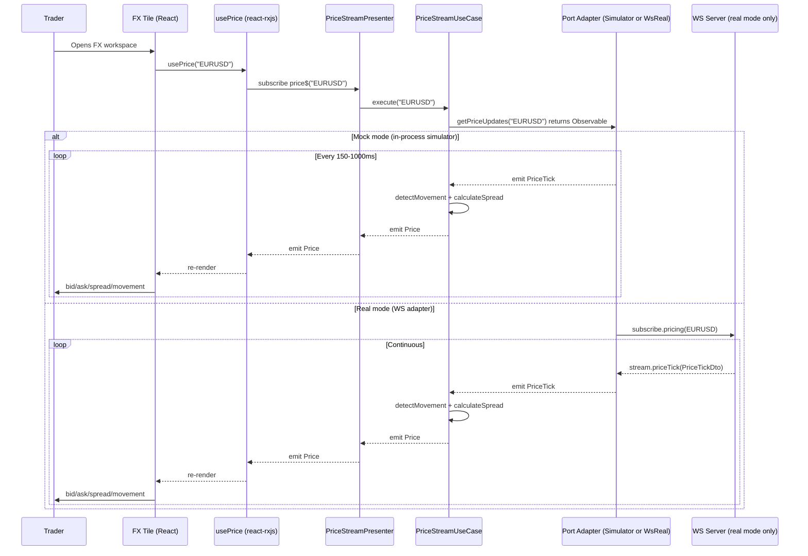
```mermaid
sequenceDiagram
    participant Trader
    participant Tile as FX Tile (React)
    participant Hook as usePrice (react-rxjs)
    participant Presenter as PriceStreamPresenter
    participant UC as PriceStreamUseCase
    participant Adapter as Port Adapter (Simulator or WsReal)
    participant Server as WS Server (real mode only)

    Trader->>Tile: Opens FX workspace
    Tile->>Hook: usePrice("EURUSD")
    Hook->>Presenter: subscribe price$("EURUSD")
    Presenter->>UC: execute("EURUSD")
    UC->>Adapter: getPriceUpdates("EURUSD") returns Observable

    alt Mock mode (in-process simulator)
        loop Every 150-1000ms
            Adapter-->>UC: emit PriceTick
            UC->>UC: detectMovement + calculateSpread
            UC-->>Presenter: emit Price
            Presenter-->>Hook: emit Price
            Hook-->>Tile: re-render
            Tile->>Trader: bid/ask/spread/movement
        end
    else Real mode (WS adapter)
        Adapter->>Server: subscribe.pricing(EURUSD)
        loop Continuous
            Server-->>Adapter: stream.priceTick(PriceTickDto)
            Adapter-->>UC: emit PriceTick
            UC->>UC: detectMovement + calculateSpread
            UC-->>Presenter: emit Price
            Presenter-->>Hook: emit Price
            Hook-->>Tile: re-render
            Tile->>Trader: bid/ask/spread/movement
        end
    end
```

The React tile knows nothing about subscriptions, transports, or enrichment. It calls `usePrice(symbol)` and renders. Enrichment (`detectMovement + calculateSpread`) lives in the use case, not the hook.

### 4.2 FX Trade Execution (RPC)

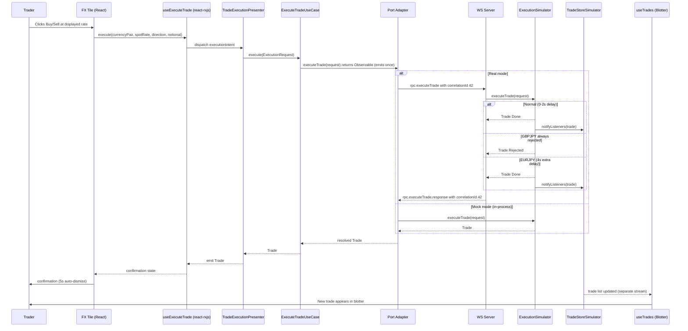
```mermaid
sequenceDiagram
    participant Trader
    participant Tile as FX Tile (React)
    participant Hook as useExecuteTrade (react-rxjs)
    participant Presenter as TradeExecutionPresenter
    participant UC as ExecuteTradeUseCase
    participant Adapter as Port Adapter
    participant Server as WS Server
    participant ExecSim as ExecutionSimulator
    participant Store as TradeStoreSimulator
    participant BlotterHook as useTrades (Blotter)

    Trader->>Tile: Clicks Buy/Sell at displayed rate
    Tile->>Hook: execute(currencyPair, spotRate, direction, notional)
    Hook->>Presenter: dispatch executionIntent
    Presenter->>UC: execute(ExecutionRequest)
    UC->>Adapter: executeTrade(request) returns Observable (emits once)

    alt Real mode
        Adapter->>Server: rpc.executeTrade with correlationId 42
        Server->>ExecSim: executeTrade(request)
        alt Normal (0-2s delay)
            ExecSim-->>Server: Trade Done
            ExecSim->>Store: notifyListeners(trade)
        else GBPJPY always rejected
            ExecSim-->>Server: Trade Rejected
        else EURJPY (4s extra delay)
            ExecSim-->>Server: Trade Done
            ExecSim->>Store: notifyListeners(trade)
        end
        Server-->>Adapter: rpc.executeTrade.response with correlationId 42
    else Mock mode (in-process)
        Adapter->>ExecSim: executeTrade(request)
        ExecSim-->>Adapter: Trade
    end

    Adapter-->>UC: resolved Trade
    UC-->>Presenter: Trade
    Presenter-->>Hook: emit Trade
    Hook-->>Tile: confirmation state
    Tile->>Trader: confirmation (5s auto-dismiss)

    Store-->>BlotterHook: trade list updated (separate stream)
    BlotterHook->>Trader: New trade appears in blotter
```

### 4.3 Credit RFQ Workflow

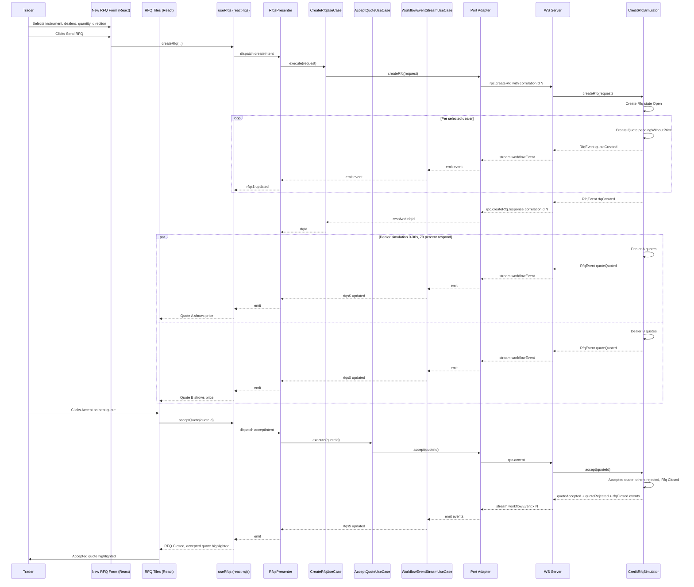
```mermaid
sequenceDiagram
    participant Trader
    participant Form as New RFQ Form (React)
    participant Tiles as RFQ Tiles (React)
    participant Hook as useRfqs (react-rxjs)
    participant Presenter as RfqsPresenter
    participant CreateUC as CreateRfqUseCase
    participant AcceptUC as AcceptQuoteUseCase
    participant EventsUC as WorkflowEventStreamUseCase
    participant Adapter as Port Adapter
    participant Server as WS Server
    participant Sim as CreditRfqSimulator

    Trader->>Form: Selects instrument, dealers, quantity, direction
    Trader->>Form: Clicks Send RFQ
    Form->>Hook: createRfq(...)
    Hook->>Presenter: dispatch createIntent
    Presenter->>CreateUC: execute(request)
    CreateUC->>Adapter: createRfq(request)
    Adapter->>Server: rpc.createRfq with correlationId N
    Server->>Sim: createRfq(request)
    Sim->>Sim: Create Rfq state Open

    loop Per selected dealer
        Sim->>Sim: Create Quote pendingWithoutPrice
        Sim-->>Server: RfqEvent quoteCreated
        Server-->>Adapter: stream.workflowEvent
        Adapter-->>EventsUC: emit event
        EventsUC-->>Presenter: emit event
        Presenter-->>Hook: rfqs$ updated
    end

    Sim-->>Server: RfqEvent rfqCreated
    Server-->>Adapter: rpc.createRfq.response correlationId N
    Adapter-->>CreateUC: resolved rfqId
    CreateUC-->>Presenter: rfqId

    par Dealer simulation 0-30s, 70 percent respond
        Sim->>Sim: Dealer A quotes
        Sim-->>Server: RfqEvent quoteQuoted
        Server-->>Adapter: stream.workflowEvent
        Adapter-->>EventsUC: emit
        EventsUC-->>Presenter: rfqs$ updated
        Presenter-->>Hook: emit
        Hook-->>Tiles: Quote A shows price
    and
        Sim->>Sim: Dealer B quotes
        Sim-->>Server: RfqEvent quoteQuoted
        Server-->>Adapter: stream.workflowEvent
        Adapter-->>EventsUC: emit
        EventsUC-->>Presenter: rfqs$ updated
        Presenter-->>Hook: emit
        Hook-->>Tiles: Quote B shows price
    end

    Trader->>Tiles: Clicks Accept on best quote
    Tiles->>Hook: acceptQuote(quoteId)
    Hook->>Presenter: dispatch acceptIntent
    Presenter->>AcceptUC: execute(quoteId)
    AcceptUC->>Adapter: accept(quoteId)
    Adapter->>Server: rpc.accept
    Server->>Sim: accept(quoteId)
    Sim->>Sim: Accepted quote, others rejected, Rfq Closed
    Sim-->>Server: quoteAccepted + quoteRejected + rfqClosed events
    Server-->>Adapter: stream.workflowEvent x N
    Adapter-->>EventsUC: emit events
    EventsUC-->>Presenter: rfqs$ updated
    Presenter-->>Hook: emit
    Hook-->>Tiles: RFQ Closed, accepted quote highlighted
    Tiles->>Trader: Accepted quote highlighted
```

---

## 5. State Diagrams

### 5.1 Connection Status

Pure function `nextConnectionStatus(current, event)` drives all transitions.

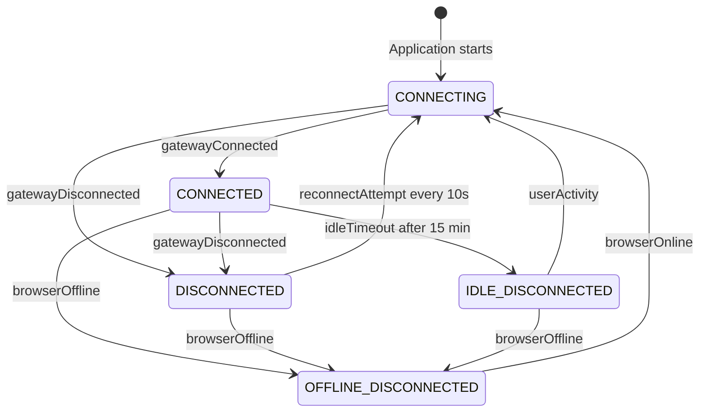
```mermaid
stateDiagram-v2
    [*] --> CONNECTING : Application starts

    CONNECTING --> CONNECTED : gatewayConnected
    CONNECTING --> DISCONNECTED : gatewayDisconnected

    CONNECTED --> IDLE_DISCONNECTED : idleTimeout after 15 min
    CONNECTED --> DISCONNECTED : gatewayDisconnected
    CONNECTED --> OFFLINE_DISCONNECTED : browserOffline

    DISCONNECTED --> CONNECTING : reconnectAttempt every 10s
    DISCONNECTED --> OFFLINE_DISCONNECTED : browserOffline

    IDLE_DISCONNECTED --> CONNECTING : userActivity
    IDLE_DISCONNECTED --> OFFLINE_DISCONNECTED : browserOffline

    OFFLINE_DISCONNECTED --> CONNECTING : browserOnline
```

**Constants:** `IDLE_TIMEOUT_MS = 15 min`, `RECONNECT_INTERVAL_MS = 10s`

### 5.2 Quote State Machine (Credit RFQ)

Each dealer quote follows this state machine. Transitions are validated by `validQuoteTransitions()`.

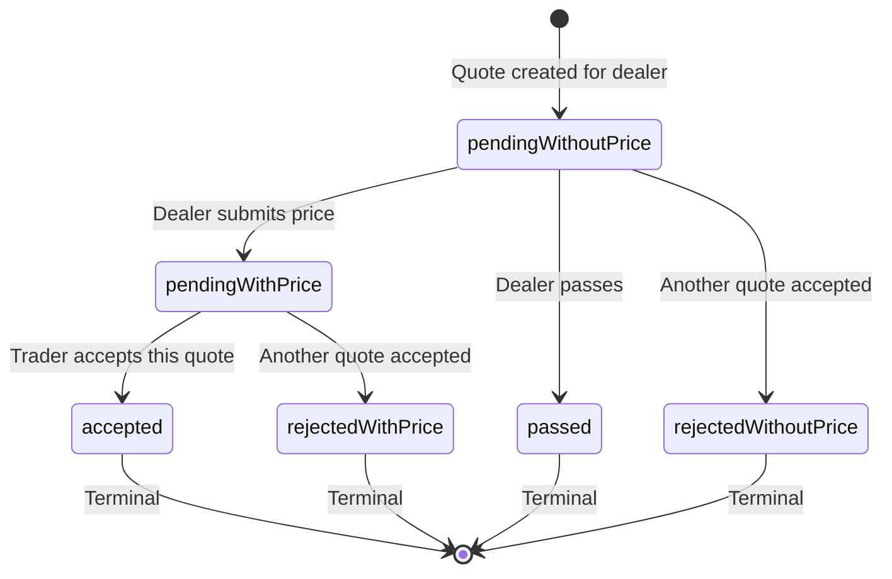
```mermaid
stateDiagram-v2
    [*] --> pendingWithoutPrice : Quote created for dealer

    pendingWithoutPrice --> pendingWithPrice : Dealer submits price
    pendingWithoutPrice --> passed : Dealer passes
    pendingWithoutPrice --> rejectedWithoutPrice : Another quote accepted

    pendingWithPrice --> accepted : Trader accepts this quote
    pendingWithPrice --> rejectedWithPrice : Another quote accepted

    accepted --> [*] : Terminal
    rejectedWithPrice --> [*] : Terminal
    passed --> [*] : Terminal
    rejectedWithoutPrice --> [*] : Terminal
```

### 5.3 RFQ Lifecycle

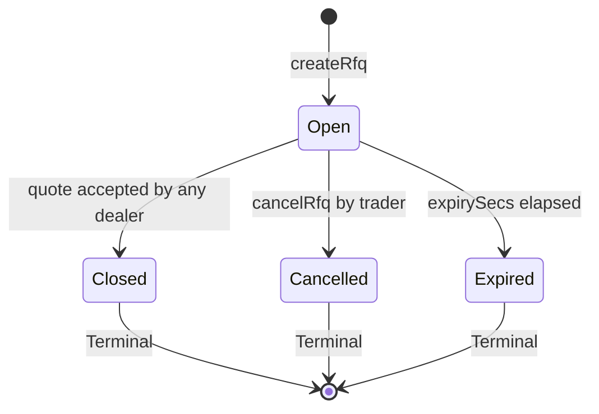
```mermaid
stateDiagram-v2
    [*] --> Open : createRfq

    Open --> Closed : quote accepted by any dealer
    Open --> Cancelled : cancelRfq by trader
    Open --> Expired : expirySecs elapsed

    Closed --> [*] : Terminal
    Cancelled --> [*] : Terminal
    Expired --> [*] : Terminal
```

### 5.4 FX Trade Execution Flow

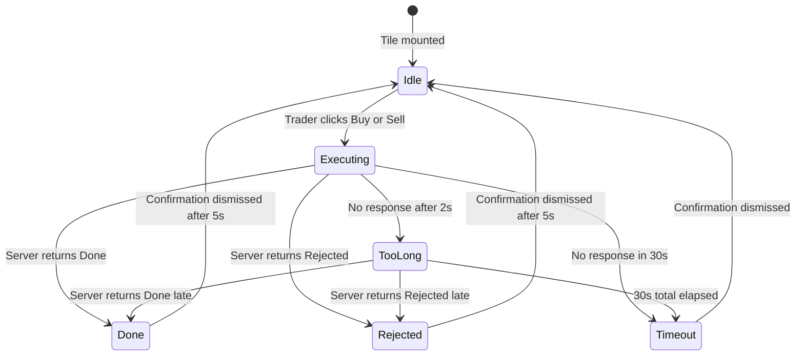
```mermaid
stateDiagram-v2
    [*] --> Idle : Tile mounted

    Idle --> Executing : Trader clicks Buy or Sell

    Executing --> Done : Server returns Done
    Executing --> Rejected : Server returns Rejected
    Executing --> Timeout : No response in 30s
    Executing --> TooLong : No response after 2s

    TooLong --> Done : Server returns Done late
    TooLong --> Rejected : Server returns Rejected late
    TooLong --> Timeout : 30s total elapsed

    Done --> Idle : Confirmation dismissed after 5s
    Rejected --> Idle : Confirmation dismissed after 5s
    Timeout --> Idle : Confirmation dismissed
```

**Constants:** `EXECUTION_TIMEOUT_MS = 30s`, `TOO_LONG_THRESHOLD_MS = 2s`, `CONFIRMATION_DISMISS_MS = 5s`

---

## 6. Package Dependencies

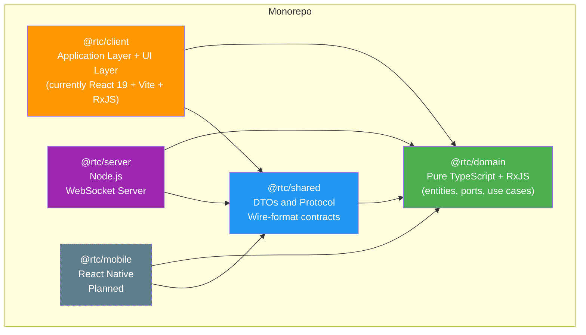
```mermaid
graph TB
    subgraph Monorepo
        domain["@rtc/domain\nPure TypeScript + RxJS\n(entities, ports, use cases)"]
        shared["@rtc/shared\nDTOs and Protocol\nWire-format contracts"]
        client["@rtc/client\nApplication Layer + UI Layer\n(currently React 19 + Vite + RxJS)"]
        server["@rtc/server\nNode.js\nWebSocket Server"]
        mobile["@rtc/mobile\nReact Native\nPlanned"]
    end

    shared --> domain
    client --> domain
    client --> shared
    server --> domain
    server --> shared
    mobile --> domain
    mobile --> shared

    style domain fill:#4CAF50,color:#fff
    style shared fill:#2196F3,color:#fff
    style client fill:#FF9800,color:#fff
    style server fill:#9C27B0,color:#fff
    style mobile fill:#607D8B,color:#fff,stroke-dasharray: 5 5
```

**Dependency rule:** Dependencies flow inward only.
- `domain` has **`rxjs` as its single runtime dependency** -- the explicit architectural exception, used as the boundary stream type. No other runtime deps are permitted (enforced by pnpm strict mode).
- `shared` depends only on `domain`.
- `client`, `mobile`, and `server` depend on `domain` + `shared` but never on each other.

**Build order** (Turborepo topological): `domain` -> `shared` -> `client` | `server` | `mobile`.

> The Application Layer and UI Layer currently coexist inside `@rtc/client`. If the size or rate of change justifies it later, the Application Layer can be promoted to its own package (`@rtc/client-app`) without breaking any consumer, because UI components only ever import the hook bridge -- not RxJS or use cases.

---

## 7. Communication Patterns

### WebSocket Message Format

```typescript
interface WsMessage {
  type: string;            // Message type identifier
  payload?: unknown;       // Data payload
  correlationId?: string;  // For RPC request-response matching
}
```

### Three Communication Styles

#### 1. Subscriptions (Fire & Forget)

Client subscribes; server streams continuously until connection closes.

```
Client -> Server:  { type: "subscribe.pricing", payload: { symbol: "EURUSD" } }
Server -> Client:  { type: "stream.priceTick", payload: PriceTickDto }  (repeated)
```

#### 2. RPC (Request-Response with Correlation ID)

```
Client -> Server:  { type: "rpc.executeTrade", payload: dto, correlationId: "42" }
Server -> Client:  { type: "rpc.executeTrade.response", payload: { type: "ack", payload: TradeDto }, correlationId: "42" }
```

#### 3. State-of-the-World (SoW)

Ensures clients have a consistent view after (re)connection.

**Bulk SoW** (blotter, reference data, analytics):
```typescript
{ updates: [...], isStateOfTheWorld: true, isStale: false }   // initial snapshot
{ updates: [...newItems], isStateOfTheWorld: false, isStale: false }  // subsequent deltas
```

**Marker-based SoW** (instruments, dealers, workflow):
```typescript
{ type: "startOfStateOfTheWorld" }
{ type: "added", payload: InstrumentDto }   // repeated per item
{ type: "endOfStateOfTheWorld" }
{ type: "added", payload: NewInstrumentDto }  // live updates after marker
```

### Observable Pipeline

RxJS `Observable<T>` is the universal streaming abstraction across the boundary -- streams *and* one-shot ops. Simulators on the server emit Observables directly; client WS adapters wrap incoming WS messages as Observables. The presenter layer applies UI-shaping operators; react-rxjs binds the resulting stream to a React hook.

```
Domain Port (interface)     ->  Observable<PriceTick>
  |
Simulator (server)          ->  defer(...) + new Observable / interval / Subject
  |
Server WS Handler           ->  port.subscribe({ next: tick => ws.send(toDto(tick)) })
  |
Client WS Adapter           ->  new Observable<T>(sub => ws.onmessage handler)
  |
Use Case                    ->  enriches Observable<PriceTick> -> Observable<Price>
                                 (defer + closure for per-subscription state)
  |
Presenter                   ->  pipe(share/shareReplay/combineLatest) -> price$
  |
react-rxjs hook             ->  bind(price$) -> usePrice(symbol)
  |
React component             ->  const price = usePrice(symbol); render
```

---

## 8. Replaceability Matrix

This is the load-bearing section: the architecture's value comes from the cost-of-change for each technology being bounded and well-understood.

| Component | Currently | Cost to replace | Contract that must hold | Tests that verify |
|---|---|---|---|---|
| **UI framework** | React 19 | ~1 dev-week (rewrite components) | Hook signatures (`usePrice`, `useTrades`, ...) and intent callbacks. No business logic in components. | Behavioural specs (Gherkin), unchanged |
| **State streams ↔ UI bridge** | react-rxjs | ~1 dev-day (write `solid-rxjs` etc.) | `Observable<T>` -> framework-native reactive primitive | Hook contract tests, unchanged |
| **State streams** | RxJS | High -- swap touches ports, simulators, use cases, presenters together | Boundary stream type matches across all four layers | Use-case tests + port contract tests + presenter contract tests |
| **Use cases** | Vanilla TS + RxJS | N/A (this is the domain) | -- | Unit tests over use cases with simulator ports |
| **Boundary stream type** | RxJS `Observable<T>` | Very high (this is the spine) | -- | -- |
| **Port adapters (transport)** | WebSocket-backed | ~1 dev-week per adapter family | Implements port interface | Contract tests parameterised over adapter |
| **Server framework** | Node.js + native WS | ~1 dev-week | Adapter-side: implements port. Wire format: DTOs in `@rtc/shared`. | Server integration tests against DTOs |
| **Wire format** | JSON over WS | High (both ends change together) | DTOs in `@rtc/shared` + protocol type enums | DTO round-trip tests + e2e |
| **Build tooling** | Vite | ~1 dev-day | Bundles `@rtc/client`, serves dev | -- |
| **Unit test runner** | Vitest | ~1 dev-day | Same test files runnable | The tests themselves |
| **E2E driver** | Playwright + Cypress | ~3 dev-days per new driver | Page Object interfaces unchanged; only implementations are added | Behavioural specs (Gherkin) drive all drivers via one shared step tree |
| **Behavioural spec language** | Gherkin | High (rewrite specs) | -- | -- |
| **Build orchestration** | pnpm + Turborepo | ~1 dev-day | Build graph: domain -> shared -> client/server | -- |

**How this is achieved**: every "Cost" above assumes the rest of the system stays put. That is only true because (a) inner layers never import outer-layer types, (b) ports are dependency-inverted, and (c) behavioural tests are written against behaviour, not implementation.

---

## 9. Test Strategy

Tests are layered the same way the system is. Each layer has its own kind of test, and **no test is allowed to import a tool from a layer it isn't testing**.

```
Behavioural Specs (Gherkin)             - WHAT the system does
  |
Step Definitions / Page Objects         - HOW to drive the system today
  |  (Cucumber-JS + Cypress; one tree)
  |
Test Runner / Driver                    - Vitest, Playwright, Cypress, ...
```

### 9.1 Layers

| Test layer | Tests | Tooling-coupled? | Survives technology swap? |
|---|---|---|---|
| **Behavioural specs** (Gherkin `.feature` files) | End-user behaviour, scenario style | No -- pure spec | Yes |
| **Step definitions** | Map Gherkin steps to actions | Yes -- import the driver | Rewritten when driver changes |
| **Page Objects** | Encapsulate selectors, waits, intent emission | Yes -- import the driver | Rewritten when UI framework or driver changes |
| **Use-case tests** | Use case behaviour with stubbed ports | Test framework only | Yes (tests import vanilla TS) |
| **Port contract tests** | Same suite run against simulator and WsReal adapters | Test framework only | Yes |
| **Domain entity tests** | Pure functions over entities | Test framework only | Yes |
| **Component tests** (optional) | Render component, assert hook contract is honoured | UI framework + test framework | Rewritten when UI framework changes |

### 9.2 Gherkin example

```gherkin
Feature: FX price streaming
  As a trader
  I want to see live bid/ask prices
  So that I can decide when to trade

  Scenario: a price tile shows the latest mid price
    Given the trader has the FX workspace open
    When the pricing service emits a tick for "EURUSD" with bid 1.1000 and ask 1.1002
    Then the EURUSD tile shows bid "1.1000" and ask "1.1002"
    And the spread is rendered as "2.0" pips
```

The same `.feature` file is consumed by:
- **client-side e2e step defs** (Playwright + Cypress — both share one step tree) -- drives a real browser, asserts DOM.
- **application-layer step defs** -- drives presenters directly, asserts hook output, no browser. Fast.

If a browser driver is replaced, only the page-object implementations for that driver change. Replacing React with SolidJS rewrites the page objects but not the specs.

### 9.3 Linking specs to existing project specs

The codebase already contains specs (separate from tests) that describe expected behaviour. The intent is to **converge** on Gherkin: existing specs become the seed for `.feature` files, and the `.feature` files become the single source of truth that all test layers reference. Where today's specs are prose, they will be incrementally rewritten in Given/When/Then form.

### 9.4 Port contract tests

A single test suite is parameterised over **all** adapters that implement a port. The same scenarios run against:
- the in-process simulator,
- the WsReal adapter (against a stub WebSocket server),
- any future adapter (e.g. a different transport).

This is what makes "swap an adapter" a low-cost operation: the contract is encoded in tests and they all must pass.

### 9.5 Six-runner stack (Cucumber-JS + Cypress + raw @playwright/test + raw Cypress + presenter-direct × 2)

Six runners exercise the same behavioural surface via four binding styles. Cucumber-JS (with Playwright) and Cypress (via cypress-cucumber-preprocessor) bind Gherkin scenarios in `tests/specs/**/*.feature` to a shared step-definition tree. Raw `@playwright/test` and raw Cypress bind scenarios programmatically through their own step trees. Two presenter-direct peers — **cucumber-presenter-real** and **cucumber-presenter-fake** — bind a subset of the same scenarios (tagged `@presenter`) to the RxJS presenter layer in pure Node with no browser; the real-time peer uses wall-clock waits while the fake-time peer wraps the same scenario bodies in `@sinonjs/fake-timers` virtual time. See Phase 5B.1 and Phase 5B.2 specs for details.

| Layer | Stack |
|---|---|
| Behaviour specs (`.feature`) | Gherkin · Cucumber-JS 11 (Playwright) + cypress-cucumber-preprocessor 22 (Cypress) |
| Step definitions | One shared tree — bundler alias maps `@cucumber/cucumber` → preprocessor for Cypress |
| Raw Playwright specs (`.spec.ts`) | `tests/raw/playwright/*.spec.ts` — bind scenarios via `@playwright/test` `test()` bodies; no Gherkin |
| Raw Cypress specs (`.spec.ts`) | `tests/raw/cypress/*.spec.ts` — bind cypress-forked scenarios via Mocha `it()` bodies; no Gherkin |
| Scenarios layer (shared) | `tests/scenarios/*.ts` — async fns taking `(ctx: TestContext, args)`; driver-free; used by Cucumber+Playwright, Cucumber+Cypress, raw Playwright |
| Scenarios layer (Cypress fork) | `tests/scenarios/cypress/*.ts` — sync fns mirroring shared names 1:1; queue-aware; used by raw Cypress only |
| Page-object contracts | TypeScript interfaces; `TESTIDS` and `STRINGS` SOTs |
| Page-object impls (drivers) | `tests/page-objects/playwright/` (Playwright) + `tests/page-objects/cypress/` (Cypress) |
| Per-runner support | `tests/support/playwright/{world,hooks}.ts` (Cucumber+Playwright) · `tests/support/cypress/{world,e2e}.ts` (Cucumber+Cypress) · `tests/raw/playwright/{_context,_openWorkspace}.ts` (raw Playwright fixture) · `tests/raw/cypress/{_context,_openWorkspace}.ts` (raw Cypress getCtx accessor) |
| Orchestration | `tests/scripts/run-all.ts` — six peers, one shared dev server, OR-ed exit codes |
| Presenter-direct specs | Same `tests/specs/**/*.feature` files, scenarios tagged `@presenter` |
| Presenter-direct step defs | `tests/steps/presenter/cucumber-real/*.steps.ts` — bind to presenter streams; no driver imports |
| Presenter-direct scenarios | `tests/scenarios/presenter/cucumber-real/*.ts` — subscribe to RxJS streams with `firstValueFrom + timeout` |
| Presenter-direct harness | `tests/scenarios/presenter/_buildApp.ts` (App + simulator + test ConnectionEventsPort) · `tests/support/presenter/cucumber-real/{world,hooks}.ts` |
| Presenter-fake runner | `tests/cucumber-presenter-fake.js` · `@cucumber/cucumber` + `@sinonjs/fake-timers` — same 19 `@presenter` scenarios under virtual time |
| Presenter-fake harness | `tests/support/presenter/cucumber-fake/{world,hooks}.ts` (FakePresenterWorld installs/uninstalls `clock` per scenario; `_await.ts` shared `AwaitHelpers` interface) |

**Bundler-alias seam (Cucumber+Cypress).** `tests/steps/*.steps.ts` files unconditionally `import { Given, When, Then } from "@cucumber/cucumber"`. Cucumber-JS resolves this natively in Node. Cypress's esbuild bundler (configured in `tests/cypress.config.ts`) installs a 5-line plugin that intercepts the specifier and remaps it to `@badeball/cypress-cucumber-preprocessor`. Both packages expose API-compatible `Given/When/Then/And/But/defineParameterType` decorators, so the same call sites compile cleanly under either resolution. The trick is invisible at the step-file level. Hooks and `World/setWorldConstructor` are NOT shared — they live in the per-runner `tests/support/{playwright,cypress}/` directories.

**Raw Playwright binding.** `tests/raw/playwright/*.spec.ts` files import a `test` symbol from `./_context.ts`, a Playwright fixture extension that exposes `{ ctx: TestContext }` built from `buildPlaywrightPageObjects(page) + new Scratchpad()`. Each `.feature` file has a sibling `.spec.ts` whose `test.describe` title, `test()` titles, and step ordering mirror the Gherkin 1:1. Three named helpers in `_openWorkspace.ts` (`withWorkspaceOpen` / `withFxWorkspaceOpen` / `withCreditWorkspaceOpen`) map 1:1 to the three Background phrasings, replacing Cucumber's implicit Background mechanism. Test bodies contain only `await scenarios.fn(ctx, ...)` calls — no direct `page.*`, `expect`, or `ctx.po.*` — enforced by grep gates 9–11 in `tests/scripts/grep-gates.ts`.

**Raw Cypress binding (Phase 5A.4 §3.3).** `tests/raw/cypress/*.spec.ts` files are pure Mocha `describe`/`it` blocks. Each `it()` body opens with `const ctx = getCtx()` (from `_context.ts`'s module-scoped beforeEach builder) and then calls **synchronous** scenario fns from `tests/scenarios/cypress/*.ts`. No `async`, no `await`, no `cy.*`, no `ctx.po.*`, no driver imports — enforced by grep gates 12–14. The forked `tests/scenarios/cypress/` layer mirrors `tests/scenarios/*.ts` fn-for-fn but uses cy queue idioms: a `chainable<T>` cast helper (in `_chainable.ts`) exposes Cypress's Chainable runtime under the shared layer's `Promise<T>` PO contract; reads call `.then(cb)` on chainables (queue-aware, propagates the subject); cross-call scratchpad reads sit inside `cy.then(() => ...)` to ensure ordering. **The fork was necessary, not desired:** Cypress's command-queue model and Promise-vs-Chainable thenable semantics make the shared async scenarios unusable in raw `it()` bodies; four prior combinations were attempted and documented in spec §3.1, §3.2, §3.3 before this design landed. This is the architectural cost that proves the Cucumber-mediated stacks share strictly more (features + step defs + scenarios + Background mechanism) than the raw stacks do (only PO contracts + features).

**Presenter-direct binding (Phase 5B.1).** `tests/steps/presenter/cucumber-real/*.steps.ts` files use Cucumber-JS but in pure Node — no browser, no DOM, no React. Step bodies delegate to scenarios fns at `tests/scenarios/presenter/cucumber-real/*.ts`, which subscribe to presenter streams (`priceStream.price$`, `connection.status$`, `blotter.trades$`, etc.) via `firstValueFrom + timeout` and assert on emitted values. Background steps are no-ops (workspaces are a UI concern). The `@presenter` tag in `.feature` files selects 19 scenarios that map cleanly to the application layer; UI-only scenarios (theme, hover, CSS, tabs) remain browser-only. `tests/scenarios/presenter/_buildApp.ts` is the sole seam to `createApp(simulatorPorts)`; grep gate 17 enforces it. Demonstrates that the same behavioural specs validate the application layer with no UI framework — closing the loop on `architecture.md §1.1` rule #4 ("Behavioural Tests as Insurance"). First sub-phase of Phase 5B; sub-phases 5B.2-5B.4 add variants (fake timers; Vitest+Gherkin; Vitest+plain-TS) as a comparison artifact.

**Virtual-time binding (Phase 5B.2):** the cucumber-presenter-fake runner reuses the same 19 `@presenter` scenarios as cucumber-presenter-real but runs each under `@sinonjs/fake-timers`. The `FakePresenterWorld` implements the same `AwaitHelpers` interface as the real-time `PresenterWorld`, advancing virtual time inside `awaitFirstWithin` via `clock.tickAsync`. Scenario bodies are shared verbatim. Runtime: ~1s vs ~18.6s for the real-time peer (≈19× speedup).

---

## 10. Key Design Decisions

| Decision | Rationale |
|----------|-----------|
| **RxJS `Observable<T>` at every boundary** | RxJS is the explicit dependency exception in `@rtc/domain`, chosen because (a) the team already uses RxJS in the client and server, (b) `defer` + operators give per-subscription state and UI-shaping cheaply, and (c) one stream type across ports / use cases / presenters removes the `AsyncIterable -> Observable` interop seam. The cost is binding the spine to RxJS; behavioural tests still validate behaviour after a hypothetical swap. |
| **Closure-in-`defer` for stateful pipes** | Use cases that need per-subscription state (`previousMid`, rolling buffer, ...) wrap the pipeline in `defer(() => { let state; return source$.pipe(...); })`. Each subscriber gets a fresh closure -- same isolation a function-scoped `let` gave the earlier `AsyncIterable` version. |
| **react-rxjs as the UI bridge** | Tiny library, easy to replicate for SolidJS/Svelte/etc. UI sees only hook contracts, never `Observable<T>`. |
| **No DI in the UI tree** | Composition Root constructs the graph at startup. UI imports already-bound hooks. No `ServiceProvider` Context. |
| **Use cases own enrichment, not hooks** | `detectMovement + calculateSpread` and similar live in `PriceStreamUseCase`, so a UI rewrite cannot lose them. |
| **Streaming-first data model** | Real-time financial data naturally flows as streams, not snapshots + polling. |
| **Simulators in the domain (not "mocks")** | Production code that stands in for an external venue. Same port interfaces; adapters are swapped at the Composition Root. |
| **WebSocket + RPC pattern** | Subscriptions for data, RPC with correlation IDs for commands -- clean separation, multiplexed over one connection. |
| **SoW markers** | Ensures consistent state after reconnect without full re-fetch. |
| **Pure domain with one dep (rxjs)** | Fully testable, portable; pnpm strict mode enforces that the only `dependencies` entry in `@rtc/domain/package.json` is `rxjs`. |
| **AbortController per subscription** | Graceful cleanup when WebSocket closes -- all active streams are cancelled. |
| **Behavioural specs in Gherkin** | One source of truth for expected behaviour, runnable from multiple test drivers. Survives driver and framework swaps. |
| **Don't abstract React or RxJS behind portability shims** | Wrapping them produces leaky facades; instead keep their layers thin and rely on behavioural tests to make regeneration cheap. |

---

## 11. Key Files Reference

| Area | Path | Description |
|------|------|-------------|
| **Domain Ports** | `packages/domain/src/ports/*.ts` | 8 port interfaces |
| **FX Entities** | `packages/domain/src/fx/*.ts` | CurrencyPair, Price, Trade, Notional |
| **Credit Entities** | `packages/domain/src/credit/*.ts` | Instrument, Dealer, Rfq, Quote |
| **Connection** | `packages/domain/src/connection/*.ts` | ConnectionStatus state machine |
| **Use Cases** | `packages/domain/src/usecases/*.ts` | Application logic; 6 use cases extracted in Phase 2 |
| **Simulators** | `packages/domain/src/simulators/*.ts` | In-memory port impls |
| **Shared DTOs** | `packages/shared/src/fx/*.ts`, `credit/*.ts` | Wire-format contracts |
| **Protocol** | `packages/shared/src/protocol/*.ts` | RPC and SoW envelopes |
| **Composition Root** | `packages/client/src/app/composition.ts` | React-free factory; returns `{ presenters, ports }` from wired-up adapters |
| **Presenters** | `packages/client/src/app/presenters/*.ts` | RxJS streams, one file per area |
| **Port Adapters** | `packages/client/src/app/adapters/*.ts` | WsAdapter, BrowserConnectionEventsAdapter, simulator/real port factory |
| **react-rxjs Hooks Bridge** | `packages/client/src/ui/hooks/createAppHooks.ts` | `bind()` calls + `AppHooks` type; only file importing `@react-rxjs/core` |
| **Hooks Provider** | `packages/client/src/ui/hooks/HooksProvider.tsx` | React Context distributing `AppHooks` |
| **Client UI Components** | `packages/client/src/ui/{fx,credit,shell,admin}/**/*.tsx` | React components grouped by trading domain |
| **Server Entry** | `packages/server/src/index.ts` | HTTP + WebSocket setup |
| **Server WS Handler** | `packages/server/src/ws/ws-handler.ts` | Subscription & RPC routing |
| **Server Protocol** | `packages/server/src/ws/protocol.ts` | Message type constants |
| **Behavioural Specs** | `tests/specs/**/*.feature` | Gherkin scenarios, framework-free; SOT for behaviour |
| **Page Object Contracts** | `tests/page-objects/contracts/**/*.ts` | Driver-free TS interfaces + `data-testid` constants; SOT for the UI surface |
| **Page Objects (Playwright)** | `tests/page-objects/playwright/**/*.ts` | Playwright implementations of the contracts |
| **Page Objects (Cypress)** | `tests/page-objects/cypress/**/*.ts` | Cypress implementations of the contracts |
| **Step Definitions** | `tests/steps/**/*.ts` | Cucumber-JS step defs (shared tree for Cucumber+Playwright + Cucumber+Cypress); import only contracts |
| **Raw Playwright Specs** | `tests/raw/playwright/*.spec.ts` | `@playwright/test` bodies binding scenarios directly; no Gherkin |
| **Raw Playwright Harness** | `tests/raw/playwright/{playwright.config,_context,_openWorkspace}.ts` | `@playwright/test` config (Chromium, serial); fixture exposing `{ ctx }`; named Background helpers |
| **Raw Cypress Specs** | `tests/raw/cypress/*.spec.ts` | Sync Mocha `it()` bodies binding cypress-forked scenarios; no Gherkin; no `async`/`await`/`cy.*`/`ctx.po.*` |
| **Raw Cypress Harness** | `tests/raw/cypress/{cypress.config,_context,_openWorkspace}.ts` | Cypress config (no preprocessor); `getCtx()` accessor with module-scoped beforeEach builder; named Background helpers |
| **Cypress-forked Scenarios** | `tests/scenarios/cypress/*.ts` (+ `_chainable.ts`) | Sync scenario fns mirroring shared `scenarios/*.ts` 1:1 by name; queue-aware (use `chainable<T>` cast helper to expose Cypress Chainable under the shared `Promise<T>` PO contract); used by raw Cypress only |
| **Test World + Hooks (Cucumber)** | `tests/support/playwright/{world,hooks}.ts` and `tests/support/cypress/{world,e2e}.ts` | Per-runner World, dev-server lifecycle, hooks |
| **Architectural Gates** | `tests/scripts/grep-gates.ts` | CI import-boundary enforcement (grep-based; 14 gates) |
| **Umbrella Scripts** | `tests/scripts/{with-server,run-all}.ts` | Dev-server lifecycle wrapper and four-peer orchestration |
