# Reactive Trader Cloud -- Architecture Document

## Table of Contents

1. [Overview](#1-overview)
   - [Purpose](#11-purpose)
   - [Architectural Principles](#12-architectural-principles)
   - [Layered Architecture & Terminology](#13-layered-architecture--terminology)
   - [Technology Choices](#14-technology-choices)
2. [C4 Model](#2-c4-model)
   - [System Context](#21-system-context-diagram)
   - [Container Diagram](#22-container-diagram)
   - [Component Diagram -- Web Client](#23-component-diagram----web-client)
   - [Component Diagram -- React Native Client](#24-component-diagram----react-native-client)
   - [Component Diagram -- WebSocket Server](#25-component-diagram----websocket-server)
3. [UML Class Diagrams](#3-uml-class-diagrams)
   - [FX Domain Entities](#31-fx-domain-entities)
   - [Credit Domain Entities](#32-credit-domain-entities)
   - [Ports & Adapters](#33-ports--adapters-hexagonal-architecture)
   - [Use Cases](#34-use-cases)
   - [Presenters, Machines & State Streams](#35-presenters-machines--state-streams)
   - [The ViewModel Seam](#36-the-viewmodel-seam)
4. [Sequence Diagrams](#4-sequence-diagrams)
   - [FX Price Streaming](#41-fx-price-streaming)
   - [FX Trade Execution](#42-fx-trade-execution-rpc)
   - [Credit RFQ Workflow](#43-credit-rfq-workflow)
   - [Equities Order Lifecycle](#44-equities-order-lifecycle)
5. [State Diagrams](#5-state-diagrams)
   - [Connection Status](#51-connection-status)
   - [Quote State Machine](#52-quote-state-machine-credit-rfq)
   - [RFQ Lifecycle](#53-rfq-lifecycle)
   - [FX Trade Execution Flow](#54-fx-trade-execution-flow)
6. [Package Dependencies](#6-package-dependencies)
7. [Communication Patterns](#7-communication-patterns)
   - [WebSocket Message Format](#websocket-message-format)
   - [Three Communication Styles](#three-communication-styles)
   - [Observable Pipeline](#observable-pipeline)
   - [Runtime Topology: What Runs When](#runtime-topology-what-runs-when)
   - [Animated: The Life of a Price Tick](#animated-the-life-of-a-price-tick)
   - [The Declarative Effects Server (`@rtc/ws-effects`)](#the-declarative-effects-server-rtcws-effects)
   - [Equities Over the Wire](#equities-over-the-wire-gap-closed)
   - [Deployment Topology](#deployment-topology)
8. [Replaceability Matrix](#8-replaceability-matrix)
   - [The Multi-Client Proof & the SolidJS Plan](#81-the-multi-client-proof--the-solidjs-plan)
9. [Test Strategy](#9-test-strategy)
10. [Key Design Decisions](#10-key-design-decisions)
11. [Key Files Reference](#11-key-files-reference)
12. [Architectural Gates](#12-architectural-gates)

---

## 1. Overview

### 1.1 Purpose

**Reactive Trader Cloud Clone** is a real-time FX trading, Credit RFQ (Request for Quote), Equities, and Admin-telemetry platform. It serves equally as a working trading app and as a reference for clean, framework-agnostic architecture.

The codebase is organised so that any single technology -- React, RxJS, react-rxjs, Vite, the WebSocket transport, Vitest, Playwright -- can be replaced with another by changing only its layer. The rest of the system, and the behavioural test suite, continue to work unchanged.

That claim is no longer hypothetical. The same application core (`@rtc/client-core`) today drives **two shipping UIs** -- a React 19 web client and an Expo/React Native mobile client -- and is designed to drive a third (SolidJS, planned) by adding one bindings package and one UI package. See [§8.1](#81-the-multi-client-proof--the-solidjs-plan).


*Animated overview (renders live on GitHub): the two runtime modes feed the same `PricingPort`; everything from the port to the pixel is shared. Details in [§7 Runtime Topology](#runtime-topology-what-runs-when).*

### 1.2 Architectural Principles

These rules override individual technology choices.

**1. Make Choices, Defer Commitment.** Picking a technology is fine; binding the rest of the codebase to it is not. Framework types never cross inward boundaries. Choices are made at the edges and bound at a single Composition Root.

**2. The Dependency Rule** ([Uncle Bob, Clean Architecture](https://blog.cleancoder.com/uncle-bob/2012/08/13/the-clean-architecture.html)). Source-code dependencies point only inward. Inner circles know nothing about outer circles. Entities know nothing about use cases; use cases know nothing about presenters; presenters know nothing about UI frameworks.

**3. Dumb UI.** The UI layer renders state and emits intents. It contains no business logic, no transport awareness, and no orchestration. A complete UI rewrite from React to SolidJS (or anything else) should be tractable, given the ViewModel contract and a behavioural test suite. (The React Native client is the existence proof: same core, new leaves — [§8.1](#81-the-multi-client-proof--the-solidjs-plan).)

**4. Behavioural Tests as Insurance.** Tests describe *what* the system does, not *how*. They do not import React, RxJS, or Playwright internals; framework-specific glue lives in step definitions and page objects. Behavioural specs survive technology swaps and are the contract that makes a swap safe.

**5. Don't Over-Abstract.** Some technologies (a WebSocket transport, an HTTP client) are easy to wrap behind a port. Others (React, RxJS) are not -- abstracting them produces awkward, leaky facades that fight the framework's grain. Where wrapping is hard, keep the layer that uses the framework deliberately thin, so a behavioural-test-backed regeneration is cheap.

### 1.3 Layered Architecture & Terminology

Two terms commonly conflated -- "client" and "UI" -- mean different things here.

| Term | Meaning |
|---|---|
| **Domain** | Pure-TypeScript entities, value objects, ports, use cases, and simulators. Lives in `@rtc/domain`. RxJS is the single permitted runtime dependency (used as the boundary stream type). Knows nothing about UI or transport. |
| **Server** | Process that hosts the domain simulators behind declarative WebSocket effects (`@rtc/ws-effects`) and serves data to clients. |
| **Client** | Everything that runs on the user's device -- the whole bundle/app. **Includes** the application core, the bindings bridge, *and* the UI layer. There are two shipping clients (web React, mobile React Native) plus a planned SolidJS one. |
| **Application Core** | `@rtc/client-core` -- composition root, presenters, state machines, and port adapters (WS transport + simulator assembly). Vanilla TS + RxJS + `@rx-state/core`. **Zero framework imports** -- no React, no DOM, no React Native. Shared verbatim by every client. |
| **Bindings** | `@rtc/react-bindings` -- the one package that knows both worlds. Maps `Observable<T>` state to framework-native reactivity: `createViewModel` (react-rxjs `bind()` for shared streams, `useMachine` for per-mount machines, `firstValueFrom` for one-shot commands). A future SolidJS client gets a sibling `@rtc/solid-bindings`. |
| **UI Layer** | Dumb components only. Web: React 19 + CSS Modules in `@rtc/client-react/src/ui`. Mobile: React Native + `react-native-svg` in `@rtc/client-react-native/src/ui`. Consumes the core exclusively through the [ViewModel seam](#36-the-viewmodel-seam) (`useViewModel()`); **never imports `rxjs`** (machine-enforced, gate 26). |
| **Platform Adapters** | The thin per-client leaves: web has `LocalStoragePreferencesAdapter` / `MediaQueryColorSchemeAdapter` / `buildBrowserPorts`; mobile has `AsyncStoragePreferencesAdapter` / `AppearanceColorSchemeAdapter` / `buildNativePorts`. Everything else is shared. |

Note: **"no RxJS on the UI side" is not the same as "no RxJS on the client side"**. RxJS is the boundary stream type for ports and use cases (in `@rtc/domain`) and is the implementation language of `@rtc/client-core`. It is forbidden in the UI layer of both clients.

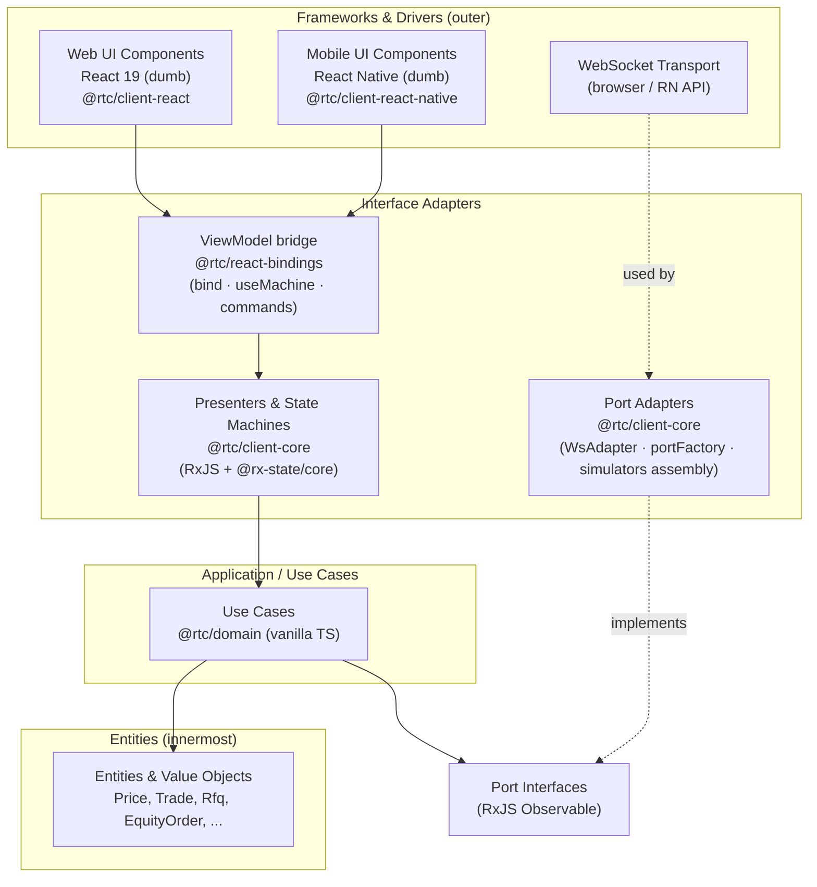

The arrows are source-code dependencies. The UI imports `useViewModel` but has no path to ports, adapters, use cases, or raw Observables. Ports are dependency-inverted -- adapters point at port interfaces, never the reverse. Each circle is now literally a package boundary, which is what makes the dependency rule machine-enforceable (dependency-cruiser + pnpm strict mode + grep gates).

### 1.4 Technology Choices

The current stack is a snapshot, not a commitment. Each row says what role is being played and what's playing it today. Cost-of-replacement is detailed in [§8 Replaceability Matrix](#8-replaceability-matrix).

| Role | Currently | Allowed inside the layer? |
|---|---|---|
| Entities & use cases | Pure TypeScript + RxJS | RxJS only (the explicit architectural exception in `@rtc/domain`) |
| Boundary stream type | RxJS `Observable<T>` | RxJS, the single explicit dependency exception in `@rtc/domain` |
| Client state streams & machines | RxJS + `@rx-state/core` in `@rtc/client-core` | RxJS, `@rx-state/core`, vanilla TS -- **no framework imports** |
| UI ↔ stream bridge | `@rtc/react-bindings` (react-rxjs `bind` + hand-written `useMachine`) | The bridge package only; the sole place React and RxJS meet |
| Web UI rendering | React 19 + CSS Modules | React; **no `rxjs` import** (gate 26) |
| Mobile UI rendering | React Native 0.86 / Expo SDK 57 + `react-native-svg` | React Native; same no-`rxjs` rule |
| UI memoization (web) | React Compiler (build-time) | No manual `useMemo`/`useCallback`; see [ADR-003](adr/ADR-003-react-compiler-and-manual-memoization.md) |
| Build tooling | Vite (web) · Metro/Expo (mobile) | -- |
| Server dispatch framework | `@rtc/ws-effects` (declarative RxJS effects) | rxjs only; zero domain knowledge |
| Server host | Node.js + `ws` + native `http` | -- |
| Wire format | JSON over WebSocket | DTOs + `CLIENT_MSG`/`SERVER_MSG` in `@rtc/shared` |
| Unit test runner | Vitest (all packages) + jest-expo (RN components) | -- |
| E2E driver | Playwright (CI gate) + Cypress (local, de-gated) | -- |
| Behavioural specs | Gherkin | -- |
| Build orchestration | pnpm workspaces + Turborepo | -- |

---

## 2. C4 Model

### 2.1 System Context Diagram

Shows the system boundary and external actors interacting with Reactive Trader Cloud.

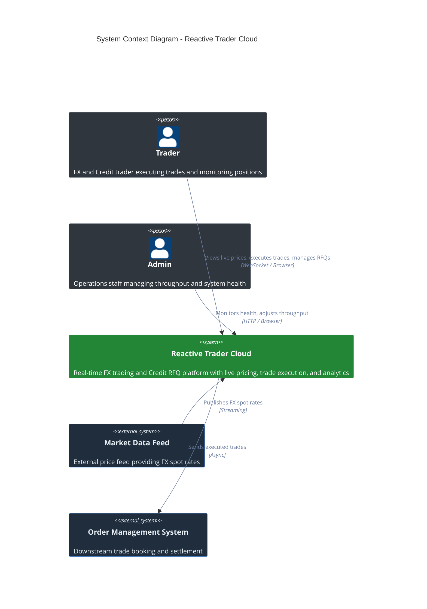

> **Diagram theming note.** GitHub serves one SVG to readers on both light and dark themes, and Mermaid's default C4 palette (pale fills, faint gray arrows) is nearly invisible on the dark one. All §2 diagrams therefore use self-contained colors that contrast on both backgrounds, with one consistent scheme: **blue = UI**, **purple = bindings bridge**, **green = application core / the system**, **amber = server & effects framework**, **slate = domain & shared contracts**, **gray = actors/external**.

### 2.2 Container Diagram

Containers are described by **role first, current technology second**. The roles are the contract; the technology is replaceable.

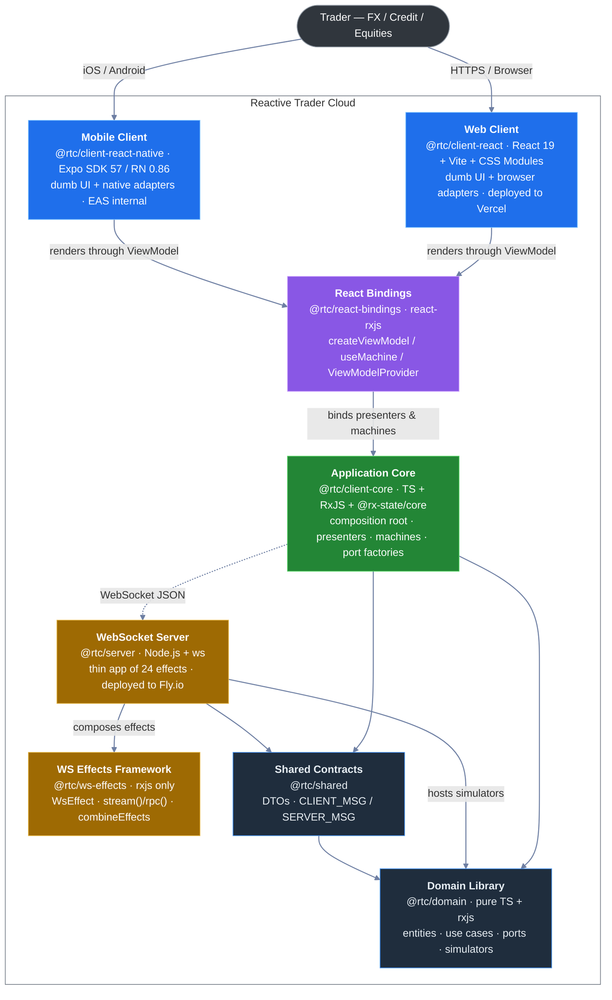

Two further packages exist **outside** the production dependency graph, as design-comprehension artifacts (see [§8.1](#81-the-multi-client-proof--the-solidjs-plan) for how they relate to the fidelity workstream):

| Package | What it is | Runtime deps |
|---|---|---|
| `@rtc/client-prototype` | A readable React 19 re-implementation of the `docs/design/v2` standalone design prototype. Mock data via seeded random walks; no domain, no rxjs. `pnpm dev:proto` → port 5273. | `react`, `react-dom` only |
| `docs/design/v2/standalone/` | Not a package -- a single self-contained ~836 KB HTML file (the canonical design artifact). Served by `scripts/serve-design.mjs` (`pnpm dev:design` → port 8899). | none |

### 2.3 Component Diagram -- Web Client

The web client is now three packages deep. The **Application Core** (`@rtc/client-core`) is plain TypeScript + RxJS -- no React imports anywhere. The **Bindings** (`@rtc/react-bindings`) turn core streams into hooks. What remains in `@rtc/client-react` is only the dumb UI plus the browser-specific leaves. Replacing React means rewriting the last package; core and bindings-contract are untouched.

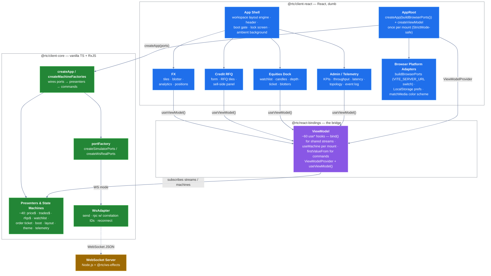

**Key boundary**: anything inside `@rtc/client-core` may use RxJS freely. Anything in `src/ui` must not import `rxjs`, `@react-rxjs`, or `@rx-state` and must not see `Observable<T>` -- machine-enforced by grep gate 26 (plus gates 27--29 banning `localStorage`, `fetch`/`import.meta.env`, and timers in the UI). The bindings package is the only place that bridges the two worlds, and it is small (~850 LOC) precisely so a `@rtc/solid-bindings` sibling can be written in about a day.

### 2.4 Component Diagram -- React Native Client

The mobile client (`@rtc/client-react-native`, Expo SDK 57 / RN 0.86) is deliberately boring: it is the **same architecture with different leaves**. Core and bindings are imported verbatim -- React is React on both platforms, so even the bindings package is shared. Only the UI components and two platform adapters are native-specific.

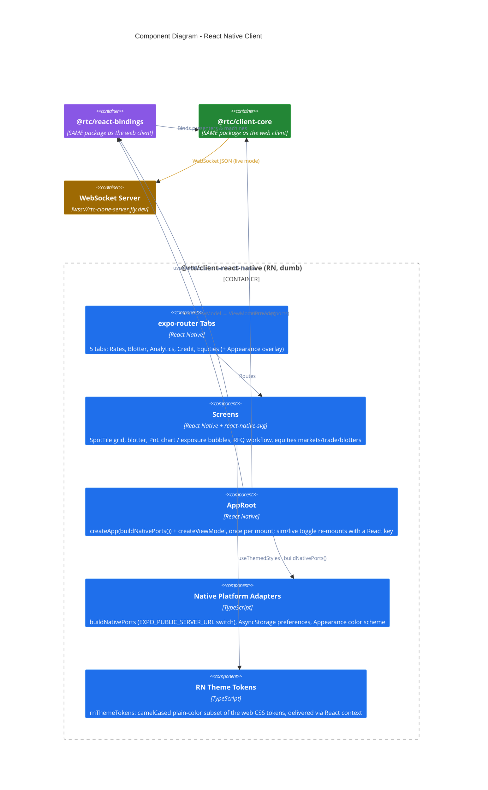

What is native-specific, exhaustively:

| Concern | Web (`client-react`) | Mobile (`client-react-native`) |
|---|---|---|
| Port selection switch | `src/app/buildBrowserPorts.ts` reads `VITE_SERVER_URL` | `src/app/buildNativePorts.ts` reads `EXPO_PUBLIC_SERVER_URL` via `expo-constants` (empty string forces simulator mode) |
| Preferences persistence | `LocalStoragePreferencesAdapter` (sync) | `AsyncStoragePreferencesAdapter` (seeds defaults synchronously, then `hydrate()` -- no-flash contract) |
| OS color scheme | `MediaQueryColorSchemeAdapter` (matchMedia) | `AppearanceColorSchemeAdapter` (RN `Appearance`) |
| Charts | SVG/canvas in React DOM | `react-native-svg`, geometry precomputed in pure vitest-tested helpers (`buildChart`, `buildCandles`, `buildGauge`, ...) |
| Theming | CSS custom properties (5 skins × dark/light) | `rnThemeTokens` context (same skins, CSS-only effects dropped) |
| Navigation | In-house workspace/layout engine | `expo-router` native tabs |
| Everything else | shared `@rtc/client-core` + `@rtc/react-bindings` | **identical imports** |

The Admin/telemetry workspace is web-only today; the RN app exposes five trading tabs. Distribution is the free path: EAS `development`/`preview` internal profiles, Android APK, no OTA updates (`updates.enabled: false`); the native `ios/`/`android/` folders are gitignored and regenerated by `expo prebuild` (`pnpm dev:ios` from the repo root).

### 2.5 Component Diagram -- WebSocket Server

The imperative `wsHandler.ts` switch is **gone**. The server is now a thin app composed of 24 declarative effects on top of `@rtc/ws-effects`. The entire connection wiring is four lines:

```typescript
const services = createServices();
const listen = createWsListener(combineEffects(...allEffects), services);
wss.on("connection", (ws) => listen(toSocket(ws)));
```

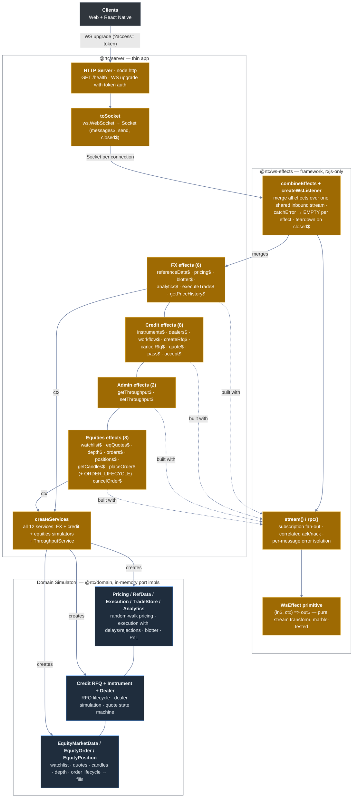

> **Naming**: these are **simulators**, not "mocks". They are production code that stands in for an external pricing or execution venue. *Test* mocks are a separate concept and live alongside tests.

> **One thing this diagram does not show** (detailed in [§7 Runtime Topology](#runtime-topology-what-runs-when)): these same simulators also run **in the browser / on the device** in simulator mode -- the server is only in the loop when a server URL is configured. Since the ws-effects rewrite shipped, the server serves **all four domains** (FX, Credit, Admin, Equities); the old equities gap is closed ([§7](#equities-over-the-wire-gap-closed)).

---

## 3. UML Class Diagrams

### 3.1 FX Domain Entities


**Key functions:**
- `calculateSpread(bid, ask, pipsPosition, ratePrecision)` -- converts bid-ask difference to a pips string formatted to `ratePrecision - pipsPosition` decimals
- `detectMovement(current, previous)` -- compares mid prices to determine UP/DOWN/NONE
- `parseNotional(input)` -- supports k/m suffixes ("1.5m" = 1,500,000)
- `isRfqRequired(notional)` -- true when notional >= 10M (triggers RFQ instead of direct execution)
- `deriveDealtCurrency(direction, pair)` -- Buy = base currency; Sell = terms currency

**Constants:** `DEFAULT_NOTIONAL = 1M`, `RFQ_THRESHOLD = 10M`, `MAX_NOTIONAL = 1B`, `PRICE_HISTORY_SIZE = 50`

> These functions are pure, vendor-neutral, and are consumed by use cases (not by hooks): `detectMovement + calculateSpread` live in `PriceStreamUseCase`, so no UI rewrite can lose them.

### 3.2 Credit Domain Entities

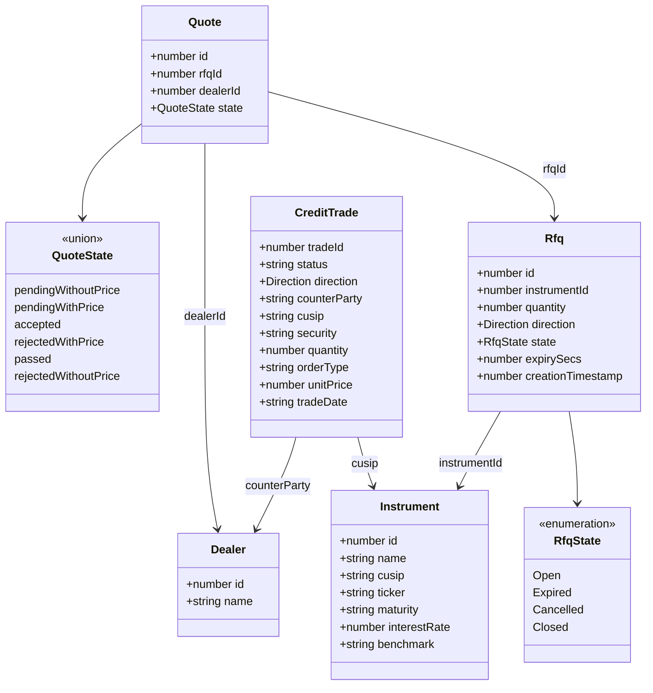

**Key functions:**
- `validQuoteTransitions(currentState)` -- returns allowed next states per current state
- **Constants:** `CREDIT_QUANTITY_MULTIPLIER = 1000`, `CREDIT_MAX_QUANTITY_INPUT = 100M`

### 3.3 Ports & Adapters (Hexagonal Architecture)

All ports use RxJS `Observable<T>` -- streaming feeds and one-shot ops alike. RxJS is the single explicit dependency exception in `@rtc/domain` (see [§1.3](#13-layered-architecture--terminology)). No other framework types leak into the domain.

The classic port surface is shown in three groups so each diagram renders at readable size (GitHub scales a diagram down to column width, so sibling count per row is the readability budget).

*A — the FX trade path (pricing, execution, blotter):*

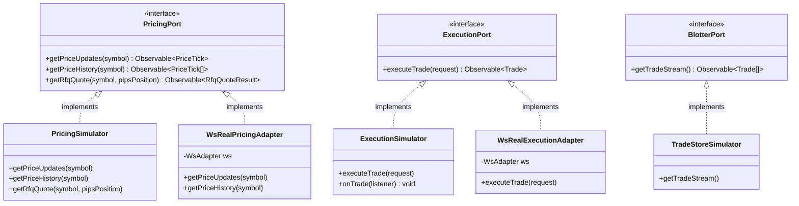

*B — the reference-data catalog (each also has a WsReal factory, elided for brevity):*

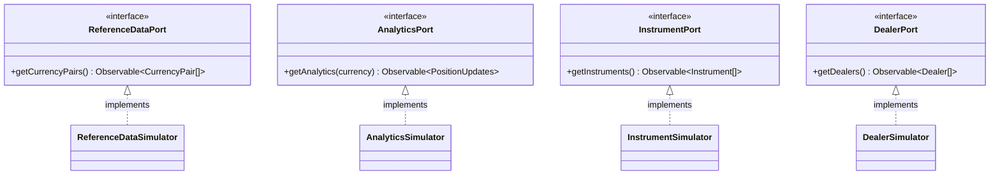

*C — the Credit RFQ workflow and connection events:*

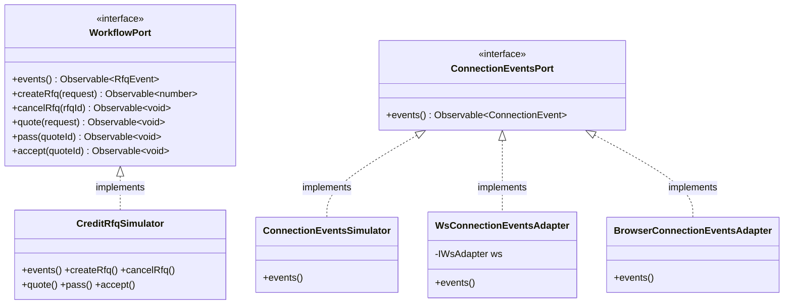

> **`WsReal*` adapters are factory functions, not classes.** The boxes above (`WsRealPricingAdapter`, `WsRealExecutionAdapter`, ...) are drawn as classes for diagram symmetry, but the real-mode port implementations are produced by factory functions (`createPricingPort`, `createExecutionPort`, ...) in `packages/client-core/src/adapters/portFactory.ts`, each closing over a shared `WsAdapter`. The eight classic transport ports plus `ConnectionEventsPort` (which has no contract-test layer — see [§9.6](#96-port-contract-test-layer)) are shown above; the port surface has since grown the families below.

**Newer port families** (added by the Equities, HUD, and Admin/telemetry workstreams; same dependency-inversion rules), again in two readable groups.

*D — equities market data, orders, positions:*

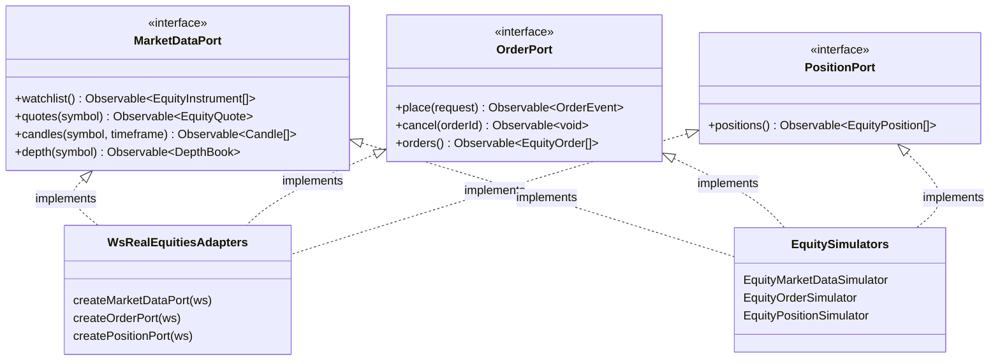

*E — admin, preferences, and the (simulator-only) telemetry family:*

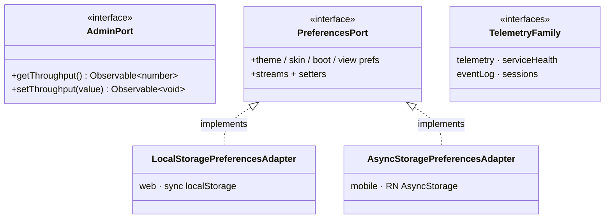

The telemetry family (`telemetry`, `serviceHealth`, `eventLog`, `sessions`) is simulator-only by design — it has no wire protocol and stays in-process even in WS mode (see [§7 Runtime Topology](#runtime-topology-what-runs-when)).

**Adapter selection** is performed at the **Composition Root** (single startup point), not at render time. Each client has one switch file that builds the full `AppPorts` either way:
- **Web** — `packages/client-react/src/app/buildBrowserPorts.ts` reads `VITE_SERVER_URL`: unset → `createSimulatorPorts()` (in-process, no transport); set → `new WsAdapter(buildWsUrl(url, token))` + `createWsRealPorts(ws, ...)`.
- **Mobile** — `packages/client-react-native/src/app/buildNativePorts.ts` reads `EXPO_PUBLIC_SERVER_URL` via `expo-constants`; an in-app sim/live toggle re-mounts `AppRoot` with a React `key` to switch branches without any branch logic in the tree.

Both factories (`createSimulatorPorts`, `createWsRealPorts`) live in `@rtc/client-core` and are shared; only the ~100-line switch file is per-platform.

**Gateway-events adapter pair.** `ConnectionEventsPort` is supplied by one of two transport-specific adapters chosen at the composition root: `WsConnectionEventsAdapter` (wraps `IWsAdapter.connectionEvents()` so `WsAdapter`'s `onopen`/`onclose` lifecycle reaches the state machine) in WS-real mode, or `ConnectionEventsSimulator` (one-shot `of(gatewayConnected)`) in simulator mode. Either choice is then merged with `BrowserConnectionEventsAdapter` (the source of `browserOnline`/`browserOffline`/`idleTimeout`/`userActivity`) via a plain `merge(...)` in `composition.ts`.

In simulator mode the composition root additionally pipes browser events through a `mergeMap` that synthesizes a `gatewayConnected` event after every `browserOnline`. This compensates for the fact that `ConnectionEventsSimulator.events()` is one-shot — without it the state machine would stay at `CONNECTING` permanently after a browser offline/online cycle (no real gateway exists in simulator mode to re-emit on reconnect). WS-real mode is unaffected: `WsAdapter` naturally emits a fresh `gatewayConnected` on each reconnect's `onopen`.

This pair replaced the Phase 3 `withSyntheticGatewayConnected` wrapper, which fabricated `gatewayConnected` events on every browser event independent of the actual transport state — a workaround that produced a misleading CONNECTED transient on server-down-on-boot in WS-real mode.

### 3.4 Use Cases

Use cases sit between ports and presenters. They take ports in their constructor (or factory), accept inputs, and return `Observable<T>` -- streams *and* one-shot ops alike. They are the home for application-specific orchestration and enrichment that today leaks into client hooks (e.g. `detectMovement + calculateSpread` for FX prices). Use cases may use RxJS operators (`map`, `scan`, `defer`, ...) but no React, no DOM.

*FX use cases:*

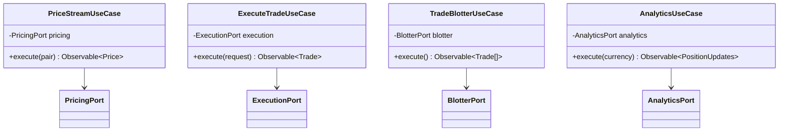

*Credit workflow & connection use cases:*

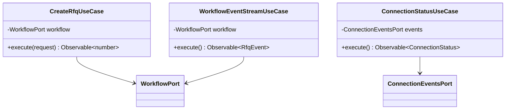

The diagram shows the use cases that carry real orchestration or enrichment. The full set in `packages/domain/src/usecases/` also includes `PriceHistoryUseCase` (rolling buffer), `CurrencyPairsUseCase`, `InstrumentsUseCase`, `DealersUseCase`, and `RfqQuoteUseCase` — twelve in total. The remaining workflow commands (`accept`, `cancel`, `pass`, `quote`) carry no application logic, so they are **not** wrapped in use cases: `RfqsPresenter` calls `WorkflowPort.accept`/`cancelRfq`/`pass`/`quote` directly. This follows the "Don't Over-Abstract" principle ([§1.2](#12-architectural-principles)) — a use case is added only when there is logic to home.

**Boundary type**: `Observable<T>` everywhere. No React types, no DOM types. Commands (`executeTrade`, `createRfq`, `accept`, ...) emit once and complete; callers `firstValueFrom(...)` to await imperatively when needed.

**Closure-in-`defer` pattern for stateful pipes.** Use cases that need per-subscription state (e.g. `PriceStreamUseCase` keeps `previousMid` to compute movement; `PriceHistoryUseCase` keeps a rolling buffer) wrap the pipeline in `defer(() => { ... })`. `defer` runs the factory on every `subscribe`, so each subscriber gets a fresh closure -- the same isolation the previous `AsyncIterable` version got from a function-scoped `let`:

```typescript
execute(pair: CurrencyPair): Observable<Price> {
  return defer(() => {
    let previousMid: number | undefined;
    return this.pricing.getPriceUpdates(pair.symbol).pipe(
      map((tick) => {
        const movement = detectMovement(tick.mid, previousMid);
        previousMid = tick.mid;
        return enrich(tick, movement);
      }),
    );
  });
}
```

**Why this layer exists**: it isolates application logic from both ports below (transport-agnostic) and presenters above (UI-framework-agnostic). Use cases are exhaustively tested via behavioural specs that swap port implementations between simulator and contract-test fixtures. RxJS in this layer is the explicit architectural exception; replacing React leaves use cases entirely untouched.

### 3.5 Presenters, Machines & State Streams

Presenters are the client-side glue between use cases (which already emit `Observable<T>`) and the UI (which consumes hooks). The presenter layer is where multicasting and UI-shaping happen -- `share`/`shareReplay` so the underlying port subscription is started once per symbol, `combineLatest` to fan in derived state, `scan` for accumulators that the UI snapshots. They all live in `packages/client-core/src/presenters/` -- roughly 40 presenters and machines across FX, Credit, Equities, Admin/telemetry, and shell concerns.

Alongside plain stream presenters, the core defines **state machines** -- the framework-neutral `Machine<TState, TIntents>` type (`{ state$, intents, dispose }` in `presenters/machine.ts`). Machines model per-component-instance lifecycles: `TileExecutionMachine`, `NotionalMachine`, `OrderTicketMachine`, `RfqCountdownMachine`, `BootSequenceMachine`, `LayoutMachine`, `IncidentMachine`, and friends. Their `state$` is a `StateObservable` from **`@rx-state/core`** -- the rxjs-only, framework-neutral half of react-rxjs -- which is what lets shareable, defaulted observable state live in the core while React (via `@react-rxjs/core` in the bindings) consumes it downstream. The split matters: `@rx-state/core` in `client-core`, `@react-rxjs/core` only in `react-bindings`.

RxJS appears in three layers: **port signatures** (`@rtc/domain` ports), **use cases** (`@rtc/domain` use cases), and **presenters/machines** (`@rtc/client-core`). It does **not** appear in:
- UI components or hook call sites in either client (use the ViewModel hooks; never import `rxjs` -- gate 26)

Because use cases already return `Observable<T>`, presenters are usually a thin `pipe(...)` over a use-case output rather than an `AsyncIterable -> Observable` conversion. Presenters expose the resulting stream to the bindings package, which turns it into a hook.

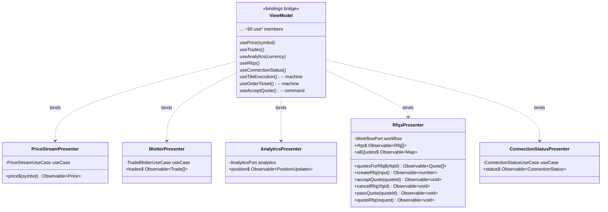

The diagram shows representative presenters. The full set in `packages/client-core/src/presenters/` also includes `PriceHistoryPresenter`, `CurrencyPairsPresenter`, `InstrumentsPresenter`, `DealersPresenter`, `TradeExecutionPresenter`, `RfqQuotePresenter`, the equities set (`WatchlistPresenter`, `CandleSeriesPresenter`, `OrdersBlotterPresenter`, `DepthPresenter`), the admin/telemetry set (`ThroughputMetricPresenter`, `LatencyPresenter`, `ErrorRatePresenter`, `ServiceTopologyPresenter`, `EventLogPresenter`, `SessionsPresenter`), and shell presenters (`SessionPresenter`, `AnimationDirector`, theme/boot/view preference presenters). **Command methods return `Observable<T>`, not `Promise<T>`** — they are one-shot streams. The UI no longer calls `firstValueFrom` itself: command hooks in the bindings (`useAcceptQuote`, `useCancelRfq`, ...) wrap it, so the UI layer imports **zero** RxJS symbols.

**Replacing react-rxjs (or React itself)**: react-rxjs is a small library (a few hundred lines, see [re-rxjs/react-rxjs](https://github.com/re-rxjs/react-rxjs)), and this repo already uses it split into its two halves: `@rx-state/core` (framework-neutral, in `client-core`) + `@react-rxjs/core` (React-facing, in `react-bindings`). To swap React -> SolidJS, write a `@rtc/solid-bindings` that maps the same `StateObservable`s to Solid signals -- presenters and below are unchanged. UI components are rewritten -- but their contracts (the ViewModel hook signatures) are mirrored 1:1, and the behavioural spec suite verifies the rewrite. See [§8.1](#81-the-multi-client-proof--the-solidjs-plan).

**Replacing RxJS itself** (for example with effect-ts): high-cost. RxJS is the boundary stream type, so swapping it touches every port, every simulator, every use case, and every presenter. The change is mechanical -- mostly `Observable<T>` → `Stream<T>` and operator-name remapping -- and behavioural tests at the UI level don't change, but it is no longer a single-layer rewrite. This is the cost paid in exchange for the simplicity of a single boundary stream type ([§8 Replaceability Matrix](#8-replaceability-matrix) tracks the trade-off).

### 3.6 The ViewModel Seam

The UI's **only** doorway into the application core is the ViewModel seam ([ADR-004](adr/ADR-004-viewmodel-seam-and-feature-flags.md)). It is deliberately a single, flat dependency-injection surface: one interface, one context, one accessor.

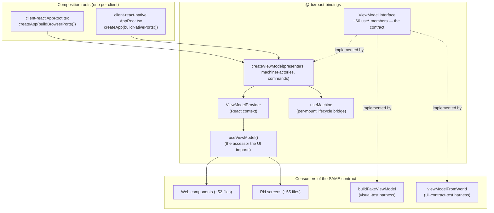

How the pieces divide the work inside `createViewModel`:

| Hook kind | Mechanism | Examples |
|---|---|---|
| Shared/global streams | react-rxjs `bind()` -- refcounted singletons | `usePrice`, `useTrades`, `useWatchlist`, `useThroughputState`, preference streams |
| Per-mount machines | `useMachine` -- lazy `useRef` factory, StrictMode-safe microtask-deferred `dispose()` | `useTileExecution`, `useOrderTicket`, `useNotional`, `useRfqTile` |
| One-shot commands | `firstValueFrom` wrapped inside the hook | `useAcceptQuote`, `useCancelRfq` |

Three properties make this a real seam rather than a service locator:

1. **Constructed once, before the tree.** Each client's `AppRoot` builds ports → `createApp` → `createViewModel` in a lazy `useRef` (surviving StrictMode double-invoke) and supplies it via `ViewModelProvider`. No per-render injection, no re-wiring on re-render.
2. **The interface is the portability contract.** The `ViewModel` type is implemented by the production factory *and* by two test harnesses (`buildFakeViewModel` for visual goldens, `viewModelFromWorld` for UI contract tests). A SolidJS client implements the same member list with signals.
3. **Nothing else crosses.** Injecting JSX or components through the ViewModel is forbidden (it would break the SolidJS-port contract, per ADR-004); the UI cannot reach presenters, ports, or Observables directly (gates 26--29).

---

## 4. Sequence Diagrams

### 4.1 FX Price Streaming

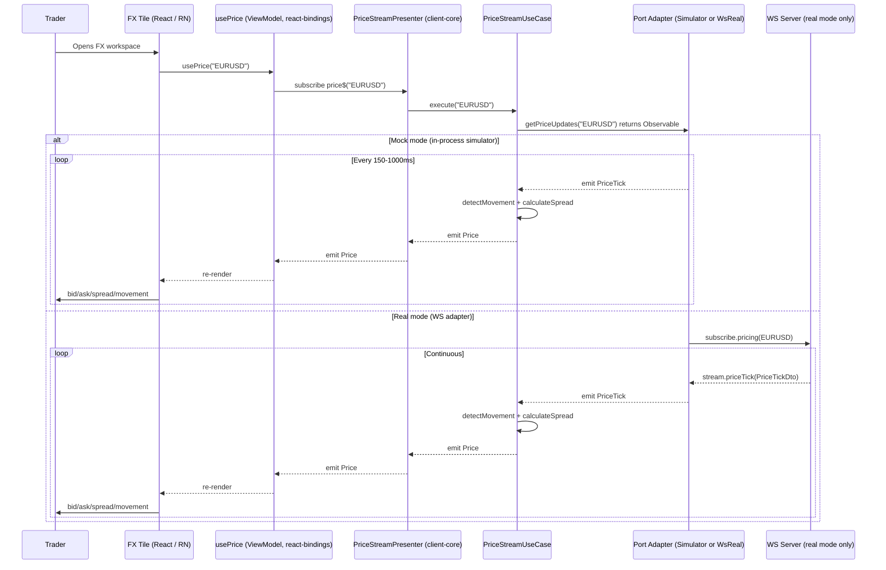

The tile — web or mobile, the flow is identical — knows nothing about subscriptions, transports, or enrichment. It calls `useViewModel().usePrice(symbol)` and renders. Enrichment (`detectMovement + calculateSpread`) lives in the use case, not the hook. In real mode the server side of the stream is the `pricing$` effect (`stream(SUBSCRIBE_PRICING, ...)` in `packages/server/src/effects/fx.effects.ts`).

### 4.2 FX Trade Execution (RPC)

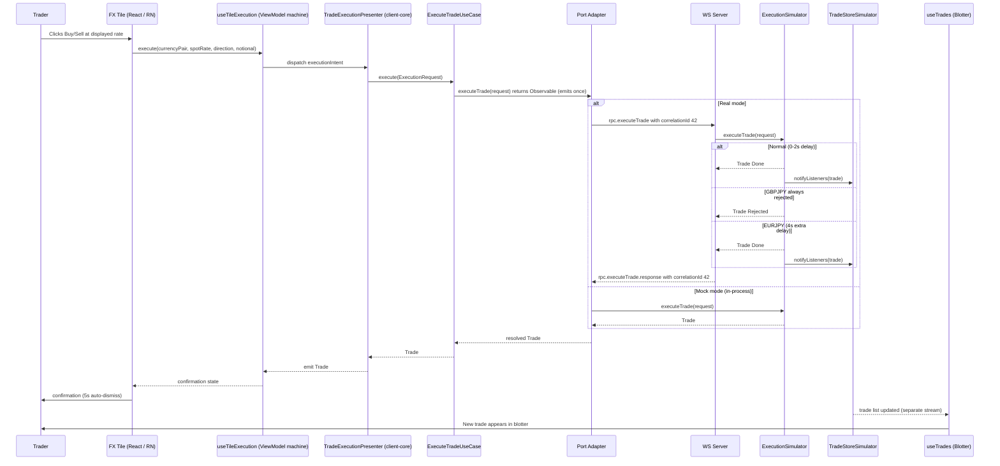

### 4.3 Credit RFQ Workflow

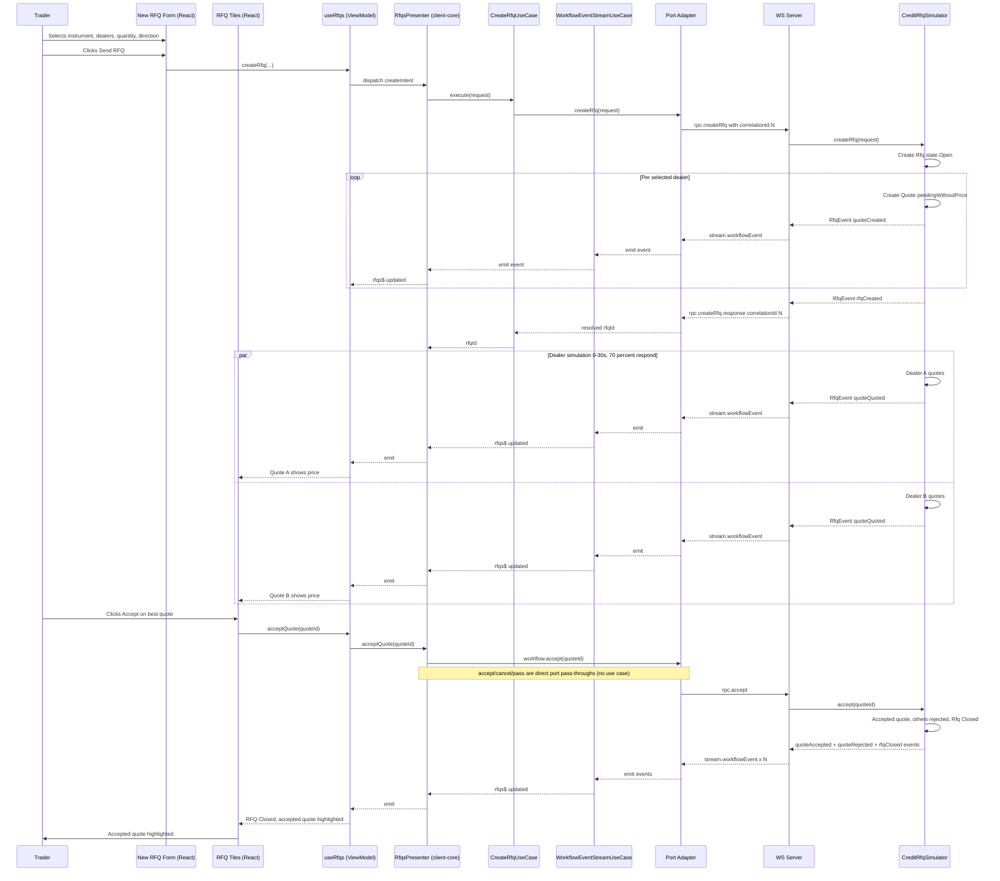

### 4.4 Equities Order Lifecycle

Placing an equity order is the one message flow that is **both** an RPC and a stream: the `placeOrder$` effect acks the RPC with the `orderId`, then keeps streaming `ORDER_LIFECYCLE` frames for that order until it reaches a terminal state. The client-side `OrderPort.place()` Observable completes on `filled`/`cancelled`/`rejected`.

```mermaid
sequenceDiagram
    participant Trader
    participant Ticket as Order Ticket (React / RN)
    participant Hook as useOrderTicket (ViewModel machine)
    participant Machine as OrderTicketMachine (client-core)
    participant Port as OrderPort (createOrderPort)
    participant Effect as placeOrder$ effect (server)
    participant OrderSim as EquityOrderSimulator
    participant PosSim as EquityPositionSimulator

    Trader->>Ticket: Sets side/qty/limit, taps Submit
    Ticket->>Hook: submit intent
    Hook->>Machine: dispatch(submit)
    Machine->>Port: place(request)
    Port->>Effect: rpc PLACE_ORDER (correlationId N)
    Effect->>OrderSim: place(request) → shared lifecycle$
    Effect-->>Port: PLACE_ORDER_RESPONSE ack { orderId }
    loop until terminal state
        OrderSim-->>Effect: lifecycle event (new → partial fills → filled)
        Effect-->>Port: ORDER_LIFECYCLE frame
        Port-->>Machine: emit OrderEvent
        Machine-->>Hook: state$ update
        Hook-->>Ticket: progress render
    end
    OrderSim->>PosSim: onFill(fill)
    Note over PosSim: positions$ subscription (separate stream)<br/>updates the Positions blotter
    Port-->>Machine: complete (terminal event)
    Ticket->>Trader: Order filled confirmation
```

The server keeps exactly one lifecycle observable per order (`shareReplay(1)` with refcount) so the ack and the stream cannot race; `placeOrder$` carries its own `catchError → nack` so a bad order rejects that one RPC without disabling the effect.

---

## 5. State Diagrams

### 5.1 Connection Status

Pure function `nextConnectionStatus(current, event)` drives all transitions.

```mermaid
stateDiagram-v2
    [*] --> CONNECTING : Application starts

    CONNECTING --> CONNECTED : gatewayConnected
    CONNECTING --> DISCONNECTED : gatewayDisconnected

    CONNECTED --> IDLE_DISCONNECTED : idleTimeout after 15 min
    CONNECTED --> DISCONNECTED : gatewayDisconnected
    CONNECTED --> OFFLINE_DISCONNECTED : browserOffline

    DISCONNECTED --> CONNECTING : reconnectAttempt every 10s
    DISCONNECTED --> OFFLINE_DISCONNECTED : browserOffline

    IDLE_DISCONNECTED --> CONNECTING : userActivity
    IDLE_DISCONNECTED --> OFFLINE_DISCONNECTED : browserOffline

    OFFLINE_DISCONNECTED --> CONNECTING : browserOnline
```

**Constants:** `IDLE_TIMEOUT_MS = 15 min`, `RECONNECT_INTERVAL_MS = 10s`

### 5.2 Quote State Machine (Credit RFQ)

Each dealer quote follows this state machine. Transitions are validated by `validQuoteTransitions()`.

```mermaid
stateDiagram-v2
    [*] --> pendingWithoutPrice : Quote created for dealer

    pendingWithoutPrice --> pendingWithPrice : Dealer submits price
    pendingWithoutPrice --> passed : Dealer passes
    pendingWithoutPrice --> rejectedWithoutPrice : Another quote accepted

    pendingWithPrice --> accepted : Trader accepts this quote
    pendingWithPrice --> rejectedWithPrice : Another quote accepted

    accepted --> [*] : Terminal
    rejectedWithPrice --> [*] : Terminal
    passed --> [*] : Terminal
    rejectedWithoutPrice --> [*] : Terminal
```

### 5.3 RFQ Lifecycle

```mermaid
stateDiagram-v2
    [*] --> Open : createRfq

    Open --> Closed : quote accepted by any dealer
    Open --> Cancelled : cancelRfq by trader
    Open --> Expired : expirySecs elapsed

    Closed --> [*] : Terminal
    Cancelled --> [*] : Terminal
    Expired --> [*] : Terminal
```

### 5.4 FX Trade Execution Flow

```mermaid
stateDiagram-v2
    [*] --> Idle : Tile mounted

    Idle --> Executing : Trader clicks Buy or Sell

    Executing --> Done : Server returns Done
    Executing --> Rejected : Server returns Rejected
    Executing --> Timeout : No response in 30s
    Executing --> TooLong : No response after 2s

    TooLong --> Done : Server returns Done late
    TooLong --> Rejected : Server returns Rejected late
    TooLong --> Timeout : 30s total elapsed

    Done --> Idle : Confirmation dismissed after 5s
    Rejected --> Idle : Confirmation dismissed after 5s
    Timeout --> Idle : Confirmation dismissed
```

**Constants:** `EXECUTION_TIMEOUT_MS = 30s`, `TOO_LONG_THRESHOLD_MS = 2s`, `CONFIRMATION_DISMISS_MS = 5s`

> **Implementation note.** The diagram names states for clarity; the `TileState` union in `useTileState.ts` uses `ready` (Idle), `started` (Executing), `tooLong`, `timeout`, and a single `finished` state that carries an `executionStatus` discriminator (`Done` / `Rejected` / `Timeout` / `CreditExceeded`) plus the resulting `Trade`. So the diagram's `Done` and `Rejected` are both the `finished` state with different `executionStatus` values, not separate union members.

---

## 6. Package Dependencies

Nine workspace packages plus the `tests` package. Every arrow is a real `dependencies` entry; dependencies flow **inward only** (toward `domain`).

```mermaid
graph TB
    subgraph clients["Clients (frameworks & drivers)"]
        webc["@rtc/client-react\nReact 19 + Vite\ndumb UI + browser adapters"]
        rnc["@rtc/client-react-native\nExpo SDK 57 / RN 0.86\ndumb UI + native adapters"]
        solidc["@rtc/client-solid\nSolidJS -- PLANNED"]
    end

    subgraph bridge["Bindings (framework ↔ streams)"]
        rb["@rtc/react-bindings\ncreateViewModel · useMachine\n@react-rxjs/core"]
        sb["@rtc/solid-bindings\nPLANNED\nObservable → signal"]
    end

    core["@rtc/client-core\nApplication Core\npresenters · machines · ports wiring\nRxJS + @rx-state/core, zero framework"]

    subgraph backend["Server side"]
        server["@rtc/server\nNode.js + ws\n24 declarative effects"]
        wse["@rtc/ws-effects\nEffects framework\nrxjs only"]
    end

    subgraph inner["Inner circles"]
        shared["@rtc/shared\nDTOs · wire protocol\nCLIENT_MSG / SERVER_MSG"]
        domain["@rtc/domain\nentities · ports · use cases · simulators\nrxjs only"]
    end

    proto["@rtc/client-prototype\ndesign-comprehension island\nreact + react-dom only"]
    tests["tests (@rtc/tests)\nbehavioural suites + gates"]

    webc --> rb
    webc --> core
    webc --> domain
    rnc --> rb
    rnc --> core
    rnc --> domain
    solidc -.-> sb
    solidc -.-> core
    rb --> core
    rb --> domain
    sb -.-> core
    core --> domain
    core --> shared
    server --> domain
    server --> shared
    server --> wse
    shared --> domain
    tests --> webc
    tests --> core
    tests --> server
    tests --> domain

    style domain fill:#4CAF50,color:#fff
    style shared fill:#2196F3,color:#fff
    style core fill:#00897B,color:#fff
    style rb fill:#FF9800,color:#fff
    style webc fill:#FB8C00,color:#fff
    style rnc fill:#8E24AA,color:#fff
    style server fill:#9C27B0,color:#fff
    style wse fill:#5E35B1,color:#fff
    style proto fill:#607D8B,color:#fff
    style solidc fill:#607D8B,color:#fff,stroke-dasharray: 5 5
    style sb fill:#607D8B,color:#fff,stroke-dasharray: 5 5
    style tests fill:#455A64,color:#fff
```

**Dependency rules** (each machine-enforced):
- `@rtc/domain` has **`rxjs` as its single runtime dependency** -- the explicit architectural exception, used as the boundary stream type. No other runtime deps are permitted (pnpm strict mode). `@rtc/ws-effects` follows the same rxjs-only constraint.
- `@rtc/shared` depends only on `domain`.
- `@rtc/client-core` depends on `domain` + `shared` (+ `rxjs`, `@rx-state/core`) and on **no framework** -- no React, no DOM types, no React Native.
- `@rtc/react-bindings` is the only package allowed to depend on both React and the core's streams.
- Clients (`client-react`, `client-react-native`) depend on `core` + `react-bindings` + `domain`; **clients and server never import each other** (dependency-cruiser `client-not-server` / `server-not-client`).
- `@rtc/client-prototype` is an intentional island: `react`/`react-dom` only, no `@rtc/*` imports.

**Build order** (Turborepo topological): `domain` → `shared` | `ws-effects` → `client-core` → `react-bindings` → `client-react` | `client-react-native` | `server` (prototype builds independently).

> The inward-only rule is machine-enforced by **dependency-cruiser** as a blocking CI gate (`pnpm check:deps`, config at `.dependency-cruiser.cjs`): `no-circular`, `domain-stays-pure`, `domain-no-node-builtins`, `shared-no-apps`, `client-not-server`, `server-not-client`, `ws-effects-stays-pure`. See [dependency-cruiser.md](./dependency-cruiser.md) for the rule-by-rule breakdown.

> **History**: the Application Layer originally lived inside `@rtc/client-react` (the doc's earlier revisions called this out as a possible future extraction). The React Native workstream forced the question, and the extraction happened: `@rtc/client-core` + `@rtc/react-bindings` are that promotion, executed without breaking UI consumers -- exactly because components only ever imported the hook bridge.

---

## 7. Communication Patterns

### WebSocket Message Format

```typescript
interface WsMessage {
  type: string;            // Message type identifier
  payload?: unknown;       // Data payload
  correlationId?: string;  // For RPC request-response matching
}
```

### Three Communication Styles

#### 1. Subscriptions (Fire & Forget)

Client subscribes; server streams continuously until connection closes.

```
Client -> Server:  { type: "subscribe.pricing", payload: { symbol: "EURUSD" } }
Server -> Client:  { type: "stream.priceTick", payload: PriceTickDto }  (repeated)
```

#### 2. RPC (Request-Response with Correlation ID)

```
Client -> Server:  { type: "rpc.executeTrade", payload: dto, correlationId: "42" }
Server -> Client:  { type: "rpc.executeTrade.response", payload: { type: "ack", payload: TradeDto }, correlationId: "42" }
```

#### 3. State-of-the-World (SoW)

Ensures clients have a consistent view after (re)connection.

**Bulk SoW** (blotter, reference data, analytics):
```typescript
{ updates: [...], isStateOfTheWorld: true, isStale: false }   // initial snapshot
{ updates: [...newItems], isStateOfTheWorld: false, isStale: false }  // subsequent deltas
```

**Marker-based SoW** (instruments, dealers, workflow):
```typescript
{ type: "startOfStateOfTheWorld" }
{ type: "added", payload: InstrumentDto }   // repeated per item
{ type: "endOfStateOfTheWorld" }
{ type: "added", payload: NewInstrumentDto }  // live updates after marker
```

### Observable Pipeline

RxJS `Observable<T>` is the universal streaming abstraction across the boundary -- streams *and* one-shot ops. Simulators on the server emit Observables directly; the ws-effects layer projects them onto the wire; client WS adapters wrap incoming WS messages as Observables. The presenter layer applies UI-shaping operators; the bindings package turns the resulting stream into a hook. **The whole path, server to pixel, is one composed Observable pipeline.**

```
Domain Port (interface)     ->  Observable<PriceTick>
  |
Simulator (server)          ->  defer(...) + new Observable / interval / Subject
  |
ws-effects stream()         ->  matchType(SUBSCRIBE_PRICING) -> mergeMap(project) -> out frames
  |
Client WS Adapter           ->  new Observable<T>(sub => ws.onmessage handler)   [@rtc/client-core]
  |
Use Case                    ->  enriches Observable<PriceTick> -> Observable<Price>   [@rtc/domain]
                                 (defer + closure for per-subscription state)
  |
Presenter                   ->  pipe(share/shareReplay/combineLatest) -> price$   [@rtc/client-core]
  |
ViewModel hook              ->  bind(price$) -> usePrice(symbol)   [@rtc/react-bindings]
  |
UI component                ->  const { usePrice } = useViewModel(); render   [client-react / client-react-native]
```

### Runtime Topology: What Runs When

The single most confusing thing about this system if you only read the code is: **where does the ticking data actually come from when you run the app?** The answer is *"it depends on one environment variable per client"* — and every answer is correct, because the same simulators are hosted in different places behind the same port interfaces.

**One switch per client decides everything.** Each composition root reads its platform's env var and builds the full `AppPorts` either way:

```mermaid
flowchart TD
    Dev["pnpm dev (web, local)"] -->|"VITE_SERVER_URL unset"| RootW
    Deploy["Vercel deployed build"] -->|"VITE_SERVER_URL set"| RootW
    E2E["fullstack e2e harness"] -->|"VITE_SERVER_URL set"| RootW
    Sim["expo dev, sim toggle ON<br/>or EXPO_PUBLIC_SERVER_URL=''"] -->|"simulator"| RootN
    Live["expo dev, live mode<br/>(default: wss://rtc-clone-server.fly.dev)"] -->|"URL set"| RootN

    RootW["buildBrowserPorts()<br/>client-react"] --> Q{"url present?"}
    RootN["buildNativePorts()<br/>client-react-native"] --> Q
    Q -->|"no"| SIM["createSimulatorPorts()<br/>simulators run IN the tab / on the device"]
    Q -->|"yes"| WS["createWsRealPorts(ws)<br/>thin WS adapters → backend"]
    SIM --> Ports["AppPorts — identical interface either way<br/>(both factories live in @rtc/client-core)"]
    WS --> Ports
    Ports --> UI["UI (cannot tell which transport)"]
```

| How it is run | Switch | Where prices / blotter / charts come from |
|---|---|---|
| **`pnpm dev` locally** (web, default) | `VITE_SERVER_URL` unset | **No backend at all.** The simulators run *inside the browser tab*. The `@rtc/server` package is not even started. |
| **Deployed site** (Vercel client → Fly server) | `VITE_SERVER_URL` set (baked at build) | **Backend over WebSocket** — all four domains: FX + Credit + Admin + Equities. |
| **Fullstack e2e** (`tests/fullstack/`) | `VITE_SERVER_URL` set (harness spins up a real server) | Backend over WebSocket — this is the path that actually exercises `@rtc/server`. |
| **Mobile app, live mode** (default) | `EXPO_PUBLIC_SERVER_URL` (defaults to the Fly URL) | Backend over WebSocket, token-authenticated (`?access=` from `EXPO_PUBLIC_WS_TOKEN`). |
| **Mobile app, simulator mode** | `EXPO_PUBLIC_SERVER_URL=""` or the in-app sim toggle | Simulators run **on the device**; toggling re-mounts `AppRoot` under a new React `key`. |

**All modes share one simulator set.** This is the clean-architecture payoff: the UI depends only on port interfaces, never on a transport, so each composition root can fulfil those ports either way.

```mermaid
flowchart LR
    subgraph SimMode["MODE A — simulator (no server)"]
        direction TB
        UIa["UI (web or RN)"] --> VMa["ViewModel / presenters"]
        VMa --> SPa["Simulator ports"]
        SPa --> Sa["domain simulators<br/>(in the tab / on the device)"]
    end

    subgraph WsMode["MODE B — live (Fly + Vercel / device)"]
        direction TB
        UIb["UI (web or RN)"] --> VMb["ViewModel / presenters"]
        VMb --> WPb["WS-real ports (thin)"]
        WPb --> Wsb["WsAdapter"]
        Wsb <-->|"WebSocket JSON<br/>{type,payload,correlationId}"| Srv["combineEffects(...allEffects)"]
        Srv --> SCb["createServices()"]
        SCb --> Sb["SAME domain simulators<br/>(on the server)"]
    end
```

A few ports are **always local**, even in Mode B: the telemetry family (`telemetry`, `serviceHealth`, `eventLog`, `sessions`) has no wire RPC, so `createWsRealPorts` instantiates those simulators in-process regardless of transport — mirroring how `preferences` is handled (injected per platform: localStorage on web, AsyncStorage on mobile). Note the deliberate split: the `admin` throughput port **is** WS-backed (`GET/SET_THROUGHPUT` RPC), while telemetry *sampling* uses its own local `ThroughputSimulator`. Everything else in Mode B is served over the wire.

> The per-tick sequence (subscribe → stream, and RPC with correlation) is the same in both modes — see [§4.1 FX Price Streaming](#41-fx-price-streaming) and [§4.2 FX Trade Execution](#42-fx-trade-execution-rpc), whose `alt` branches already show the mock-vs-real split.

### Animated: The Life of a Price Tick

The same story as an animation (committed SVG — GitHub plays SMIL animations in markdown-embedded images, so this renders as a small looping film right here; open the raw file if your viewer shows it static):


Watch for the two dots: the amber one (Mode B) crosses the WebSocket wire; the green one (Mode A) goes straight from the in-process simulator to the port. From `PricingPort` onward there is only one blue path — that single path is why the UI, the behavioural tests, and the presenters can never tell the modes apart.

### The Declarative Effects Server (`@rtc/ws-effects`)

The server's dispatch used to be an imperative `switch` in `wsHandler.ts`. That file is gone. Dispatch is now a small, declarative, RxJS-native **effects micro-framework** in its own package, `@rtc/ws-effects` (~220 LOC of production source, `rxjs` only, zero domain knowledge), with `@rtc/server` a thin app of 24 effects on top — each a stream transform `(in$, ctx) => out$`.

This realises the "any framework should be replaceable by changing only its package" principle from [§1.2](#12-architectural-principles): the transport-dispatch framework is a genuine, swappable package with the app on top of it.

```mermaid
flowchart TD
    Core["WsEffect primitive<br/>(in$, ctx) => out$   — pure, marble-tested"]
    Sugar1["stream(type, project)<br/>subscription fan-out"] --> Core
    Sugar2["rpc(type, outType, handle)<br/>ack/nack + correlationId"] --> Core
    App["24 app effects<br/>FX (6) · Credit (8) · Admin (2) · Equities (8)"] --> Sugar1
    App --> Sugar2
    Core --> Combine["combineEffects(...allEffects)<br/>→ createWsListener(ctx)"]
    Combine --> Socket["toSocket(ws)<br/>one Socket per connection"]
```

**Error isolation is layered** — a design goal, not an accident:

```mermaid
flowchart LR
    L1["per inner stream<br/>stream(): catchError → EMPTY<br/>one bad subscription dies alone"]
    L2["per message<br/>rpc(): error → nack reply<br/>same correlationId"]
    L3["per effect<br/>combineEffects: catchError → EMPTY<br/>one broken effect disables only itself"]
    L4["per connection<br/>createWsListener: takeUntil(closed$)<br/>teardown on socket close"]
    L1 --> L2 --> L3 --> L4
```

The wire protocol survived the rewrite unchanged (same `{ type, payload, correlationId }` envelope and message names); the duplicated protocol constants were consolidated into `@rtc/shared` (`packages/shared/src/protocol/messages.ts` — the single `CLIENT_MSG`/`SERVER_MSG` source of truth for both ends). Full design: [`docs/superpowers/specs/2026-07-02-ws-effects-declarative-server-design.md`](superpowers/specs/2026-07-02-ws-effects-declarative-server-design.md).

> **Historical note.** `@rtc/server` was originally scaffolded with `@marblejs/*` + `fp-ts` dependencies (hence old "Marble.js" mentions), but they were **never imported** and were removed by the knip dead-code gate. `@rtc/ws-effects` is a from-scratch homage to the marblejs *pattern* — declarative RxJS effects — without the unmaintained dependency and its transitive vulnerable `ws`.

### Equities Over the Wire (gap closed)

Earlier revisions of this document described an **equities coverage gap**: the panels were built simulator-first and the old `wsHandler` served FX + Credit + Admin only, so equities data silently vanished in Mode B. The ws-effects rewrite closed that gap — `createServices()` now instantiates the equities trio (`EquityMarketDataSimulator`, `EquityOrderSimulator`, `EquityPositionSimulator`) and eight equities effects serve the full surface:

| Concern | Wire messages | Client consumer (in `@rtc/client-core`) |
|---|---|---|
| Watchlist | `SUBSCRIBE_WATCHLIST` → `WATCHLIST` | `createMarketDataPort(ws).watchlist()` |
| Quotes | `SUBSCRIBE_EQ_QUOTES` → `EQ_QUOTE` | `createMarketDataPort(ws).quotes()` |
| Candles | rpc `GET_CANDLES` → `CANDLES_RESPONSE` | `createMarketDataPort(ws).candles()` |
| Depth ladder | `SUBSCRIBE_DEPTH` → `DEPTH` | `createMarketDataPort(ws).depth()` |
| Orders blotter | `SUBSCRIBE_ORDERS` → `ORDERS` | `createOrderPort(ws).orders()` |
| Place order | rpc `PLACE_ORDER` → ack **+** `ORDER_LIFECYCLE` stream | `createOrderPort(ws).place()` ([§4.4](#44-equities-order-lifecycle)) |
| Cancel order | rpc `CANCEL_ORDER` → `CANCEL_ORDER_RESPONSE` | `createOrderPort(ws).cancel()` |
| Positions | `SUBSCRIBE_POSITIONS` → `POSITIONS` | `createPositionPort(ws).positions()` |

| Feature | Mode A (local sim) | Mode B (deployed WS) |
|---|---|---|
| FX pricing / blotter / analytics | ✅ | ✅ |
| Credit RFQ | ✅ | ✅ |
| Admin throughput | ✅ | ✅ |
| Telemetry / incidents | ✅ | ✅ *(always in-process by design)* |
| Equities (watchlist, charts, depth, orders, positions) | ✅ | ✅ |

One deliberate asymmetry remains: equities frames carry **domain types directly** (no DTO layer in `@rtc/shared/src/` for equities yet, unlike `fx/` and `credit/`). The types are still shared via `@rtc/domain`, so both ends agree — but there is no wire-format indirection to version against. An acceptable IOU, called out here so it isn't mistaken for a rule.

### Deployment Topology

All deploys are **manual** (`workflow_dispatch`) — merging to `main` runs CI but deploys nothing.

```mermaid
flowchart LR
    subgraph GH["GitHub Actions (workflow_dispatch only)"]
        d1["deploy.yml<br/>deploy-server + deploy-client"]
        d2["deploy-proto.yml"]
        d3["deploy-cd-proto.yml"]
    end

    subgraph Fly["Fly.io (lhr)"]
        srv["rtc-clone-server<br/>@rtc/server · port 4000<br/>scale-to-zero · GET /health<br/>WS upgrade token-gated"]
    end

    subgraph Vercel["Vercel (all password/Basic-Auth gated)"]
        v1["rtc-clone<br/>@rtc/client-react<br/>VITE_SERVER_URL baked at build"]
        v2["rtc-clone-proto<br/>@rtc/client-prototype<br/>(v2-design React port)"]
        v3["rtc-clone-cd-proto<br/>docs/design standalone HTML"]
    end

    mob["Mobile app (EAS internal /<br/>Android APK, free path)"]

    d1 --> srv
    d1 --> v1
    d2 --> v2
    d3 --> v3
    v1 -->|"wss:// + ?access= token"| srv
    mob -->|"wss:// + ?access= token<br/>(EXPO_PUBLIC_* baked at build)"| srv
```

The client build bakes a stable Fly URL at build time, so the server and client deploy jobs are independent. The two prototype deploys serve the design-fidelity workstream, not production.

---

## 8. Replaceability Matrix

This is the load-bearing section: the architecture's value comes from the cost-of-change for each technology being bounded and well-understood.

| Component | Currently | Cost to replace | Contract that must hold | Tests that verify |
|---|---|---|---|---|
| **UI framework** | React 19 (web) / React Native (mobile) | ~1 dev-week (rewrite one UI package) — **empirically calibrated by the RN client**, which reused core + bindings verbatim | `ViewModel` hook signatures and intent callbacks. No business logic in components. | Behavioural specs (Gherkin) + visual goldens + UI contract suite, all unchanged |
| **State streams ↔ UI bridge** | `@rtc/react-bindings` (react-rxjs) | ~1 dev-day (write `@rtc/solid-bindings` etc.) | `Observable<T>`/`StateObservable<T>` -> framework-native reactive primitive; same `ViewModel` member list | UI contract tests, unchanged |
| **State streams** | RxJS + `@rx-state/core` | High -- swap touches ports, simulators, use cases, presenters, machines together | Boundary stream type matches across all layers | Use-case tests + port contract tests + presenter-direct e2e peers |
| **Use cases** | Vanilla TS + RxJS | N/A (this is the domain) | -- | Unit tests over use cases with simulator ports |
| **Boundary stream type** | RxJS `Observable<T>` | Very high (this is the spine) | -- | -- |
| **Port adapters (transport)** | WebSocket-backed factories in `client-core` | ~1 dev-week per adapter family | Implements port interface | Contract tests parameterised over adapter (simulator + WsReal) |
| **Server dispatch framework** | `@rtc/ws-effects` | ~1 dev-week (it is one package; effects are pure stream transforms) | `WsEffect = (in$, ctx) => out$`; wire protocol in `@rtc/shared` | Marble tests + fullstack smokes |
| **Server host** | Node.js + `ws` | ~2 dev-days (`toSocket` is the only ws-coupled file) | `Socket` interface (`messages$`, `send`, `closed$`) | Fullstack smokes |
| **Wire format** | JSON over WS | High (both ends change together) | DTOs + `CLIENT_MSG`/`SERVER_MSG` in `@rtc/shared` | DTO round-trip tests + wire-frame fixtures + e2e |
| **Build tooling** | Vite (web) · Metro/Expo (mobile) | ~1 dev-day | Bundles the client package, serves dev | -- |
| **Unit test runner** | Vitest (+ jest-expo for RN components) | ~1 dev-day | Same test files runnable | The tests themselves (proven: the presenter suite runs under cucumber-js *and* vitest) |
| **E2E driver** | Playwright (CI) + Cypress (local) | ~3 dev-days per new driver | Page Object interfaces unchanged; only implementations are added | Behavioural specs (Gherkin) drive all drivers via one shared step tree |
| **Behavioural spec language** | Gherkin | High (rewrite specs) | -- | -- |
| **Build orchestration** | pnpm + Turborepo | ~1 dev-day | Build graph: domain -> shared/ws-effects -> core -> bindings -> clients/server | -- |

**How this is achieved**: every "Cost" above assumes the rest of the system stays put. That is only true because (a) inner layers never import outer-layer types, (b) ports are dependency-inverted, and (c) behavioural tests are written against behaviour, not implementation.

### 8.1 The Multi-Client Proof & the SolidJS Plan

The replaceability matrix used to be a theory. The React Native client turned it into a measurement: **adding an entire second platform required zero changes to `@rtc/domain`, `@rtc/shared`, `@rtc/client-core`, or `@rtc/react-bindings`** — only a new UI package with two platform adapters. The animation below cycles through the three clients; note what never moves.


**Why the RN client was cheap** — the checklist of what it actually had to build:

```mermaid
flowchart TD
    subgraph new["What client-react-native wrote (new code)"]
        n1["RN screens & components<br/>(dumb, react-native-svg charts)"]
        n2["buildNativePorts.ts<br/>(EXPO_PUBLIC_SERVER_URL switch)"]
        n3["AsyncStoragePreferencesAdapter"]
        n4["AppearanceColorSchemeAdapter"]
        n5["rnThemeTokens<br/>(token subset, context delivery)"]
        n6["expo-router tabs + AppRoot"]
    end
    subgraph reused["What it imported verbatim"]
        r1["@rtc/client-core — every presenter,<br/>machine, WsAdapter, port factory"]
        r2["@rtc/react-bindings — the whole<br/>ViewModel (React is React)"]
        r3["@rtc/domain — entities, use cases,<br/>simulators (device-local Mode A!)"]
    end
    new -->|"plugs into"| reused
```

**The SolidJS plan** (`@rtc/client-solid`, not yet started) follows the same recipe with one extra step — since Solid is *not* React, it needs its own bindings package:

1. **`@rtc/solid-bindings`** (~1 dev-day): map `StateObservable` → Solid signal. `@rx-state/core` (already framework-neutral, already in `client-core`) is the same primitive react-rxjs's `bind()` consumes, so this is the `solid-rxjs` analogue the design always assumed. Implement the same `ViewModel` member list; `useMachine` becomes a `createMachine`-style per-component primitive with `onCleanup` instead of a StrictMode-deferred dispose.
2. **`@rtc/client-solid`** (~1 dev-week): rewrite the dumb components. CSS Modules port verbatim — the CSS-modules migration deliberately left zero inline styles and semantic `data-*` state hooks precisely so markup/styling survives the swap.
3. **Verification, all pre-existing**: the framework-neutral UI-contract specs (`*.contract.spec.ts` + a new `solid/` swap-trio next to `react/`), the visual goldens (`__screenshots__/react/` is the canonical cross-framework contract — a Solid render must match it), and the Gherkin behavioural suites (page objects get a Solid implementation; specs unchanged).

What ADR-004 forbids exists **for** this plan: no JSX through the ViewModel, no framework types below the bindings, no `rxjs` in UI files. Every one of those bans is a gate (26--29) so the Solid port cannot be quietly invalidated between now and whenever it starts.

---

## 9. Test Strategy

Tests are layered the same way the system is. Each layer has its own kind of test, and **no test is allowed to import a tool from a layer it isn't testing**.

```
Behavioural Specs (Gherkin)             - WHAT the system does
  |
Step Definitions / Page Objects         - HOW to drive the system today
  |  (Cucumber-JS + Cypress; one tree)
  |
Test Runner / Driver                    - Vitest, Playwright, Cypress, ...
```

### 9.1 Layers

| Test layer | Tests | Tooling-coupled? | Survives technology swap? |
|---|---|---|---|
| **Behavioural specs** (Gherkin `.feature` files) | End-user behaviour, scenario style | No -- pure spec | Yes |
| **Step definitions** | Map Gherkin steps to actions | Yes -- import the driver | Rewritten when driver changes |
| **Page Objects** | Encapsulate selectors, waits, intent emission | Yes -- import the driver | Rewritten when UI framework or driver changes |
| **Use-case tests** | Use case behaviour with stubbed ports | Test framework only | Yes (tests import vanilla TS) |
| **Port contract tests** | Same suite run against simulator and WsReal adapters | Test framework only | Yes |
| **Domain entity tests** | Pure functions over entities | Test framework only | Yes |
| **Component tests** (optional) | Render component, assert hook contract is honoured | UI framework + test framework | Rewritten when UI framework changes |
| **UI contract tests** (sociable RTL, [§9.8](#98-ui-contract-tier)) | Mount real components against a scripted `ViewModel`; assert behaviour | Framework-neutral specs + a thin per-framework swap layer | Specs survive; only the `react/` adapter directory is rewritten |
| **Visual goldens** (3 tiers, [§9.7](#97-visual-golden-tiers)) | Pixel screenshots of workspaces × skins × modes | Screenshot runners | Goldens survive — they **are** the cross-framework rendering contract |
| **RN component tests** (jest-expo + RNTL, [§9.9](#99-react-native-testing)) | Render RN screens against the ViewModel | jest-expo | Rewritten with the mobile UI |

### 9.2 Gherkin example

```gherkin
Feature: FX price streaming
  As a trader
  I want to see live bid/ask prices
  So that I can decide when to trade

  Scenario: a price tile shows the latest mid price
    Given the trader has the FX workspace open
    When the pricing service emits a tick for "EURUSD" with bid 1.1000 and ask 1.1002
    Then the EURUSD tile shows bid "1.1000" and ask "1.1002"
    And the spread is rendered as "2.0" pips
```

The same `.feature` file is consumed by:
- **client-side e2e step defs** (Playwright + Cypress — both share one step tree) -- drives a real browser, asserts DOM.
- **application-layer step defs** -- drives presenters directly, asserts hook output, no browser. Fast.

If a browser driver is replaced, only the page-object implementations for that driver change. Replacing React with SolidJS rewrites the page objects but not the specs.

### 9.3 Linking specs to existing project specs

The codebase already contains specs (separate from tests) that describe expected behaviour. The intent is to **converge** on Gherkin: existing specs become the seed for `.feature` files, and the `.feature` files become the single source of truth that all test layers reference. Where today's specs are prose, they will be incrementally rewritten in Given/When/Then form.

### 9.4 Port contract tests

A single test suite is parameterised over **all** adapters that implement a port. The same scenarios run against:
- the in-process simulator,
- the WsReal adapter (against a stub WebSocket server),
- any future adapter (e.g. a different transport).

This is what makes "swap an adapter" a low-cost operation: the contract is encoded in tests and they all must pass.

### 9.5 Ten-suite e2e stack (4 browser peers + 4 presenter peers + 2 fullstack smokes)

`tests/scripts/run-all.ts` orchestrates **ten suites**: eight behavioural peers exercising the same spec surface via six binding styles, plus two full-stack smokes (`tests/fullstack/`) that boot a real `@rtc/server` and a real client and assert live WS data end-to-end — the only suites that exercise the server process itself. The eight peers: Cucumber-JS (with Playwright) and Cypress (via cypress-cucumber-preprocessor) bind Gherkin scenarios in `tests/specs/**/*.feature` to a shared step-definition tree. Native `@playwright/test` and native Cypress bind scenarios programmatically through their own step trees. Four presenter-direct peers — **cucumber** (real timers), **cucumber-fake-timers**, **vitest-quickpickle-fake-timers**, and **vitest-fake-timers** (plain) — bind a subset of the same scenarios (tagged `@presenter`) to the RxJS presenter layer in pure Node with no browser; the `cucumber` peer uses wall-clock waits, `cucumber-fake-timers` wraps the same bodies in `@sinonjs/fake-timers` virtual time, `vitest-quickpickle-fake-timers` reruns the same bodies under Vitest + the qpickle-loader Vite plugin for Gherkin + `vi.useFakeTimers()`, and `vitest-fake-timers` reruns the same `_shared/` scenario modules under Vitest + raw `describe`/`it` (no Gherkin loader) + `vi.useFakeTimers()` to prove the `_shared/*.ts` / `_await.ts` / `_world.ts` abstractions are useful even without a BDD step-tree. See Phase 5B.1, 5B.2, 5B.3, and 5B.4 specs for details.

| Layer | Stack |
|---|---|
| Behaviour specs (`.feature`) | Gherkin · Cucumber-JS 11 (Playwright) + cypress-cucumber-preprocessor 22 (Cypress) |
| Step definitions | One shared tree — bundler alias maps `@cucumber/cucumber` → preprocessor for Cypress |
| Native Playwright specs (`.spec.ts`) | `tests/browser/playwright/*.spec.ts` — bind scenarios via `@playwright/test` `test()` bodies; no Gherkin |
| Native Cypress specs (`.spec.ts`) | `tests/browser/cypress/*.spec.ts` — bind cypress-forked scenarios via Mocha `it()` bodies; no Gherkin |
| Scenarios layer (shared) | `tests/browser/scenarios/*.ts` — async fns taking `(ctx: TestContext, args)`; driver-free; used by Cucumber+Playwright, Cucumber+Cypress, native Playwright |
| Scenarios layer (Cypress fork) | `tests/browser/cypress/scenarios/*.ts` — sync fns mirroring shared names 1:1; queue-aware; used by native Cypress only |
| Page-object contracts | TypeScript interfaces; `TESTIDS` and `STRINGS` SOTs |
| Page-object impls (drivers) | `tests/browser/page-objects/playwright/` (Playwright) + `tests/browser/page-objects/cypress/` (Cypress) |
| Per-runner support | `tests/browser/playwright-cucumber/{world,hooks}.ts` (Cucumber+Playwright) · `tests/browser/cypress-cucumber/{world,e2e}.ts` (Cucumber+Cypress) · `tests/browser/playwright/{_context,_openWorkspace}.ts` (native Playwright fixture) · `tests/browser/cypress/{_context,_openWorkspace}.ts` (native Cypress getCtx accessor) |
| Orchestration | `tests/scripts/run-all.ts` — ten suites in parallel, per-suite dev servers (`RTC_DEV_PORT` 3001+), OR-ed exit codes; `RTC_E2E_MAX_PARALLEL` cap; `RTC_E2E_SKIP_CYPRESS` opt-out |
| Full-stack smokes | `tests/fullstack/{node-smoke,browser-smoke}.ts` + `tests/fullstack/browser/fullstack.spec.ts` — real server + real client on dedicated ports, live pricing/equities assertions |
| Presenter-direct specs | Same `tests/specs/**/*.feature` files, scenarios tagged `@presenter` |
| Presenter-direct step defs | `tests/presenter/steps/*.steps.ts` — bind to presenter streams; no driver imports |
| Presenter-direct scenarios | `tests/presenter/scenarios/_shared/*.ts` — subscribe to RxJS streams with `firstValueFrom + timeout`; shared by all four presenter peers |
| Presenter-direct harness | `tests/presenter/scenarios/_buildApp.ts` (App + simulator + test ConnectionEventsPort) · `tests/presenter/cucumber/{world,hooks}.ts` |
| Presenter-fake-timers runner | `tests/presenter/cucumber-fake-timers/cucumber.js` · `@cucumber/cucumber` + `@sinonjs/fake-timers` — same 20 `@presenter` scenarios under virtual time |
| Presenter-fake-timers harness | `tests/presenter/cucumber-fake-timers/{world,hooks}.ts` (FakePresenterWorld installs/uninstalls `clock` per scenario; `_await.ts` shared `AwaitHelpers` interface) |
| Presenter-vitest-quickpickle-fake-timers runner | `tests/presenter/vitest-quickpickle-fake-timers/vitest.config.ts` · `vitest` + the qpickle-loader Vite plugin + `vi.useFakeTimers()` — same 20 `@presenter` scenarios under Vitest |
| Presenter-vitest-quickpickle-fake-timers harness | `tests/presenter/vitest-quickpickle-fake-timers/{world,hooks,setup}.ts` (VitestFakePresenterWorld implements the same `AwaitHelpers` interface as the cucumber peers; `setup.ts` barrel loaded via `vitest.config.setupFiles`) |
| Presenter-vitest-quickpickle-fake-timers step defs | `tests/presenter/vitest-quickpickle-fake-timers/steps/*.steps.ts` — functional mirrors of cucumber steps with loader import, world-type swap, and `async (state:)` callback shape |
| Presenter-vitest-fake-timers (plain) runner | `tests/presenter/vitest-fake-timers/vitest.config.ts` · `vitest` + raw `describe`/`it` (no Gherkin loader) + `vi.useFakeTimers()` — same 20 `@presenter` scenarios as the other 3 presenter peers |
| Presenter-vitest-fake-timers (plain) harness | `tests/presenter/vitest-fake-timers/_world.ts` (VitestPlainPresenterWorld plain-object factory implementing the same `AwaitHelpers` interface; one `*.test.ts` per feature, beforeEach/afterEach building/tearing down the world per `it()`) |

**Bundler-alias seam (Cucumber+Cypress).** `tests/browser/steps/*.steps.ts` files unconditionally `import { Given, When, Then } from "@cucumber/cucumber"`. Cucumber-JS resolves this natively in Node. Cypress's esbuild bundler (configured in `tests/browser/cypress-cucumber/cypress.config.ts`) installs a plugin that intercepts the `@cucumber/cucumber` specifier and remaps it to the sibling `cucumber-shim.ts`, which wraps `Given/When/Then/And/But` handlers in `cy.wrap().then()` so async step bodies (returning native Promises) are presented to the preprocessor as Cypress Chainables — avoiding the v24+ native-Promise guard — and re-exports everything else from the preprocessor's browser entrypoint unchanged. Both packages expose API-compatible `Given/When/Then/And/But/defineParameterType` decorators, so the same call sites compile cleanly under either resolution. The trick is invisible at the step-file level. Hooks and `World/setWorldConstructor` are NOT shared — they live in the per-runner `tests/browser/{playwright-cucumber,cypress-cucumber}/` directories.

**Native Playwright binding.** `tests/browser/playwright/*.spec.ts` files import a `test` symbol from `./_context.ts`, a Playwright fixture extension that exposes `{ ctx: TestContext }` built from `buildPlaywrightPageObjects(page) + new Scratchpad()`. Each `.feature` file has a sibling `.spec.ts` whose `test.describe` title, `test()` titles, and step ordering mirror the Gherkin 1:1. Three named helpers in `_openWorkspace.ts` (`withWorkspaceOpen` / `withFxWorkspaceOpen` / `withCreditWorkspaceOpen`) map 1:1 to the three Background phrasings, replacing Cucumber's implicit Background mechanism. Test bodies contain only `await scenarios.fn(ctx, ...)` calls — no direct `page.*`, `expect`, or `ctx.po.*` — enforced by grep gates 9–11 in `tests/scripts/grep-gates.ts`.

**Native Cypress binding (Phase 5A.4 §3.3).** `tests/browser/cypress/*.spec.ts` files are pure Mocha `describe`/`it` blocks. Each `it()` body opens with `const ctx = getCtx()` (from `_context.ts`'s module-scoped beforeEach builder) and then calls **synchronous** scenario fns from `tests/browser/cypress/scenarios/*.ts`. No `async`, no `await`, no `cy.*`, no `ctx.po.*`, no driver imports — enforced by grep gates 12–14. The forked `tests/browser/cypress/scenarios/` layer mirrors `tests/browser/scenarios/*.ts` fn-for-fn but uses cy queue idioms: a `chainable<T>` cast helper (in `_chainable.ts`) exposes Cypress's Chainable runtime under the shared layer's `Promise<T>` PO contract; reads call `.then(cb)` on chainables (queue-aware, propagates the subject); cross-call scratchpad reads sit inside `cy.then(() => ...)` to ensure ordering. **The fork was necessary, not desired:** Cypress's command-queue model and Promise-vs-Chainable thenable semantics make the shared async scenarios unusable in native `it()` bodies; four prior combinations were attempted and documented in spec §3.1, §3.2, §3.3 before this design landed. This is the architectural cost that proves the Cucumber-mediated stacks share strictly more (features + step defs + scenarios + Background mechanism) than the native stacks do (only PO contracts + features).

**Presenter-direct binding (Phase 5B.1).** `tests/presenter/steps/*.steps.ts` files use Cucumber-JS but in pure Node — no browser, no DOM, no React. Step bodies delegate to scenarios fns at `tests/presenter/scenarios/_shared/*.ts`, which subscribe to presenter streams (`priceStream.price$`, `connection.status$`, `blotter.trades$`, etc.) via `firstValueFrom + timeout` and assert on emitted values. Background steps are no-ops (workspaces are a UI concern). The `@presenter` tag in `.feature` files selects 20 scenarios that map cleanly to the application layer; UI-only scenarios (theme, hover, CSS, tabs) remain browser-only. `tests/presenter/scenarios/_buildApp.ts` is the sole seam to `createApp(simulatorPorts)`; grep gate 17 enforces it. Demonstrates that the same behavioural specs validate the application layer with no UI framework — closing the loop on `architecture.md §1.1` rule #4 ("Behavioural Tests as Insurance"). First sub-phase of Phase 5B; sub-phases 5B.2-5B.4 add variants (fake timers; Vitest+Gherkin; Vitest+plain-TS) as a comparison artifact.

**Virtual-time binding (Phase 5B.2):** the `cucumber-fake-timers` runner reuses the same 20 `@presenter` scenarios as the `cucumber` (real-timers) runner but runs each under `@sinonjs/fake-timers`. The `FakePresenterWorld` implements the same `AwaitHelpers` interface as the real-time `PresenterWorld`, advancing virtual time inside `awaitFirstWithin` via `clock.tickAsync`. Scenario bodies are shared verbatim. Runtime: ~1s vs ~18.6s for the real-time peer (≈19× speedup).

**Runner-portability binding (Phase 5B.3):** the `vitest-quickpickle-fake-timers` runner reuses the same 20 `@presenter` scenarios as the cucumber peers but executes them under Vitest with the qpickle-loader Vite plugin for Gherkin and `vi.useFakeTimers()` (sinon-based) for virtual time. The `VitestFakePresenterWorld` implements the same `AwaitHelpers` interface as `FakePresenterWorld`, advancing virtual time via `vi.advanceTimersByTimeAsync`. Step bodies are functional mirrors of the cucumber (real-timers) step files differing in three structural ways (`@cucumber/cucumber` → loader import, `PresenterWorld` type swap, and `function(this:)` callback shape → `async (state:) =>` because the loader's `Given/When/Then` types are `(state, ...args) => any` rather than this-bound). The peer is the **runner-portability proof:** the same `_shared/` scenario modules and the same `.feature` files drive cucumber-js *and* vitest under fake timers, validating that `_await.ts` / `_world.ts` aren't accidentally coupled to cucumber-js's lifecycle. Wall-clock: ~1.5s (vs ~1s for `cucumber-fake-timers` — the extra half-second is Vitest worker startup).

**Plain-TS binding (Phase 5B.4):** the `vitest-fake-timers` (plain) runner reuses the same 20 `@presenter` scenarios as the other 3 presenter peers but executes them under Vitest with **no Gherkin loader at all** — hand-written `describe`/`it` blocks in `tests/presenter/vitest-fake-timers/*.test.ts` call the existing `tests/presenter/scenarios/_shared/*.ts` modules directly. The `VitestPlainPresenterWorld` is a plain object literal (not a class) implementing the same `AwaitHelpers` interface as the other presenter peers; `buildWorld()` / `teardownWorld()` run in `beforeEach` / `afterEach`. No step-def files exist for this peer — the test bodies inline what would otherwise be step-def delegation. The peer is the **plain-TS portability proof:** the `_shared/` scenario modules, the `AwaitHelpers` interface, and the `PresenterWorld` shape are abstractions useful enough that a contributor writing presenter tests in raw Vitest tomorrow would not need a new abstraction layer. Grep gate 20 forbids Gherkin loader imports inside `tests/presenter/vitest-fake-timers/`; gate 21 enforces `@presenter` scenario count parity between `.feature` files and `*.test.ts` files via a `customCheck` extension to `grep-gates.ts`; gate 22 asserts every `describe(...)` title in that folder begins with `"@presenter Feature: "`. Wall-clock: ~1.5s (parity with `vitest-quickpickle-fake-timers` — same Vitest worker startup, same fake-timer mechanism).

### 9.6 Port contract test layer

The 8 transport ports (`ReferenceDataPort`, `PricingPort`, `ExecutionPort`,
`BlotterPort`, `AnalyticsPort`, `InstrumentPort`, `DealerPort`,
`WorkflowPort`) each have a contract describer at
`packages/domain/src/ports/__contracts__/<Port>Contract.ts` asserting
happy-path behavioral invariants the TypeScript type signature cannot
catch — emission shapes, SoW protocol, RFQ lifecycle, multi-subscriber
identity. Each describer is parameterised by a `makeHarness()` factory
returning `{port, driver, teardown}`, so the same assertions run twice:
once against the simulator implementation in `packages/domain/src/simulators/`
and once against the WsReal implementation in
`packages/client-core/src/adapters/portFactory.ts` driven by an in-memory
`FakeWsAdapter` that scripts canonical wire frames from
`packages/shared/src/__fixtures__/wireFrames.ts`. The equities port trio has
the same treatment (`wsRealMarketData.contract.test.ts`, `portFactory.equities.test.ts`
in `client-core`).

The contract is happy-path only. Error semantics (RPC nack handling) are
covered by three `wsReal<Execution|Pricing|Workflow>.errors.test.ts`
files outside the contract, since simulators have no equivalent failure
mode. Gate 23 (see §12) keeps the describers pure: they receive a port
via `makeHarness`, they don't reach into either implementation.

### 9.7 Visual golden tiers

`packages/client-react/tests/ui/visual/` runs the same screenshot scenarios through **three independent rasterizers**, because each one draws slightly differently and each catches different regressions:

| Tier | Runner | Config |
|---|---|---|
| 1 | Playwright Component Testing | `playwright-ct/` (also hosts the whole-app **paint smoke** — the guard against "renders in jsdom, paints empty in a real browser" bugs) |
| 2 | Plain Playwright over a Vite host | `playwright/` |
| 3 | Vitest browser mode (`toMatchScreenshot`) | `vitest-browser/` |

Two golden sets are committed per tier: `__screenshots__/react/` (rendered on pinned x86 CI — **the canonical cross-framework contract**, regenerated only via the `update-visual-goldens` workflow) and `__screenshots__/react-local/<platform>-<arch>/` (local runs, committed for review but never compared on CI). The render target lives behind the `visual/react/` seam barrel — the directory a SolidJS port swaps.

### 9.8 UI contract tier

`packages/client-react/tests/ui/contract/` is the second framework-swap pillar: **sociable RTL tests** where framework-neutral specs (`specs/**/*.contract.spec.ts`, per domain) drive framework-neutral page objects (`shared/pages/`), and only the thin `react/` directory (component registry, render adapter, `viewModelFromWorld`) knows React exists. CI enforces **≥95%** statement/branch/function/line coverage on this tier (`test:ui:contract:coverage`) — the strongest single gate in the repo, because it measures how much of the UI the swap-portable suite actually pins down.

### 9.9 React Native testing

The RN package runs a **dual runner** (`vitest run && jest`):
- **vitest** (node) for pure logic: chart geometry (`buildChart`, `buildCandles`, `buildGauge`, `buildSparkline`, `bubbleLayout`), port selection (`buildNativePorts`), theme tokens, the AsyncStorage adapter.
- **jest-expo + RNTL 14** for ~50 colocated component tests (`*.test.tsx`), mapping `@rtc/*` to built `dist/`.

CI additionally runs an **Expo export smoke** (Metro bundling of the real app) to catch monorepo-resolution breakage that jest never exercises. Two gaps are known and deliberate: no RN e2e yet (Maestro is the deferred plan) and no RN visual goldens — jsdom/jest cannot see paint, so whole-branch review + the live simulator remain the net for RN paint bugs.

### 9.10 The CI gauntlet

Everything above hangs off three **parallel** CI jobs (`.github/workflows/ci.yml`), triggered on PRs and pushes to `main`:

```mermaid
flowchart TD
    trigger["PR / push to main"]
    trigger --> checks
    trigger --> visual
    trigger --> e2e
    subgraph checks["Job 1 — checks"]
        direction TB
        c1["Biome ci · ESLint AST + custom rules (RuleTester)"]
        c1 --> c3["Stylelint · actionlint · manypkg/syncpack"]
        c3 --> c4["typecheck · unit + UI contract tests · coverage ≥ 95%"]
        c4 --> c6["build · Expo export smoke (RN Metro)"]
        c6 --> c7["knip · dependency-cruiser · ESLint type-aware"]
        c7 --> c8["grep gates (29) + pnpm audit"]
    end
    subgraph visual["Job 2 — visual"]
        v1["3 golden tiers vs<br/>__screenshots__/react/"]
    end
    subgraph e2e["Job 3 — e2e"]
        e1["Playwright browser peers<br/>+ presenter peers + fullstack smokes<br/>(Cypress de-gated on CI:<br/>RTC_E2E_SKIP_CYPRESS=1 — runs locally)"]
    end
```

---

## 10. Key Design Decisions

| Decision | Rationale |
|----------|-----------|
| **RxJS `Observable<T>` at every boundary** | RxJS is the explicit dependency exception in `@rtc/domain`, chosen because (a) the team already uses RxJS in the client and server, (b) `defer` + operators give per-subscription state and UI-shaping cheaply, and (c) one stream type across ports / use cases / presenters removes the `AsyncIterable -> Observable` interop seam. The cost is binding the spine to RxJS; behavioural tests still validate behaviour after a hypothetical swap. |
| **Closure-in-`defer` for stateful pipes** | Use cases that need per-subscription state (`previousMid`, rolling buffer, ...) wrap the pipeline in `defer(() => { let state; return source$.pipe(...); })`. Each subscriber gets a fresh closure -- same isolation a function-scoped `let` gave the earlier `AsyncIterable` version. |
| **react-rxjs as the UI bridge** | Tiny library, easy to replicate for SolidJS/Svelte/etc. UI sees only hook contracts, never `Observable<T>`. |
| **No DI in the UI tree** | Composition Root constructs the graph at startup. UI imports already-bound hooks. No `ServiceProvider` Context. |
| **Use cases own enrichment, not hooks** | `detectMovement + calculateSpread` and similar live in `PriceStreamUseCase`, so a UI rewrite cannot lose them. |
| **Streaming-first data model** | Real-time financial data naturally flows as streams, not snapshots + polling. |
| **Simulators in the domain (not "mocks")** | Production code that stands in for an external venue. Same port interfaces; adapters are swapped at the Composition Root. |
| **WebSocket + RPC pattern** | Subscriptions for data, RPC with correlation IDs for commands -- clean separation, multiplexed over one connection. |
| **SoW markers** | Ensures consistent state after reconnect without full re-fetch. |
| **Pure domain with one dep (rxjs)** | Fully testable, portable; pnpm strict mode enforces that the only `dependencies` entry in `@rtc/domain/package.json` is `rxjs`. |
| **AbortController per subscription** | Graceful cleanup when WebSocket closes -- all active streams are cancelled. |
| **Behavioural specs in Gherkin** | One source of truth for expected behaviour, runnable from multiple test drivers. Survives driver and framework swaps. |
| **Don't abstract React or RxJS behind portability shims** | Wrapping them produces leaky facades; instead keep their layers thin and rely on behavioural tests to make regeneration cheap. |
| **React Compiler instead of manual memoization** | The compiler auto-memoizes at build time, so the UI carries no `useMemo`/`useCallback`. Its lint half (`eslint-plugin-react-hooks` `recommended-latest`, scoped to `src`) guards the Rules-of-React purity the compiler needs. One provisional exception: `react-hooks/refs` is scoped off for the two StrictMode build-once-ref seam files (`useMachine.ts`, `AppRoot.tsx`). Full rationale and the revisit note in [ADR-003](adr/ADR-003-react-compiler-and-manual-memoization.md). |
| **Application core extracted to `@rtc/client-core`** | The RN client forced the "could be promoted later" IOU: presenters, machines, WsAdapter, and port factories moved out of `client-react` into a framework-free package. The extraction cost nothing at the UI call sites because components only ever imported the hook bridge — the payoff of the original layering. |
| **One ViewModel seam, not per-service DI** ([ADR-004](adr/ADR-004-viewmodel-seam-and-feature-flags.md)) | A single flat `ViewModel` interface (~60 `use*` members) built once at each client's `AppRoot` and delivered through one context. Implemented by production code and two test harnesses; forbidden from carrying JSX. It is simultaneously the DI surface, the test seam, and the SolidJS-port contract. |
| **`@rx-state/core` in the core, `@react-rxjs/core` in the bindings** | react-rxjs is used *split into its two halves*: the framework-neutral `state()`/`StateObservable` primitive lives in `client-core` (machines can hold defaulted shareable state with no React), while `bind()` lives only in `react-bindings`. A Solid port pairs the same core half with new bindings. |
| **State machines as `Machine<TState, TIntents>`** | Per-component lifecycles (tile execution, order ticket, RFQ countdown, boot sequence) are framework-neutral objects `{ state$, intents, dispose }` bridged by `useMachine` — one per mount, StrictMode-safe deferred dispose. Keeps imperative choreography out of both the UI and the global stream graph. |
| **Declarative WS effects (`@rtc/ws-effects`)** | The server's dispatch is data-flow, not control-flow: 24 pure `(in$, ctx) => out$` transforms merged over one shared inbound stream, with four layers of error isolation. The framework is rxjs-only and domain-blind, so it is itself swappable — and marble-testable without a socket. |
| **Per-platform code = adapters only** | Adding a platform means a switch file (`buildNativePorts`), a preferences adapter, a color-scheme adapter, and dumb UI. Everything else is imported. This is the enforced definition of "thin client shell". |
| **RN charts precompute geometry in pure functions** | `react-native-svg` draws what vitest-tested pure helpers (`buildCandles`, `buildGauge`, ...) computed. The paint layer stays dumb and the math stays unit-testable without a device. |
| **Design prototypes are production-isolated** | `@rtc/client-prototype` (React port) and the standalone HTML artifact exist for design comprehension and fidelity comparison; neither may import `@rtc/*` runtime packages, so design iteration can never leak into the product graph. |

---

## 11. Key Files Reference

| Area | Path | Description |
|------|------|-------------|
| **Domain Ports** | `packages/domain/src/ports/*.ts` | Port interfaces: the 8 classic transport ports + `ConnectionEventsPort` + equities (`MarketDataPort`, `OrderPort`, `PositionPort`) + admin/preferences/telemetry families |
| **FX Entities** | `packages/domain/src/fx/*.ts` | CurrencyPair, Price, Trade, Notional |
| **Credit Entities** | `packages/domain/src/credit/*.ts` | Instrument, Dealer, Rfq, Quote |
| **Connection** | `packages/domain/src/connection/*.ts` | ConnectionStatus state machine |
| **Use Cases** | `packages/domain/src/usecases/*.ts` | Application logic (12 use cases) |
| **Simulators** | `packages/domain/src/simulators/*.ts` | In-memory port impls (FX, credit, equities, telemetry) |
| **Shared DTOs** | `packages/shared/src/fx/*.ts`, `credit/*.ts` | Wire-format contracts |
| **Wire Protocol SoT** | `packages/shared/src/protocol/messages.ts` | `CLIENT_MSG` / `SERVER_MSG` constants for all 4 domains — single source for both ends |
| **Protocol Envelopes** | `packages/shared/src/protocol/{rpc,sow}.ts` | `RpcResponse` ack/nack; bulk + marker SoW envelopes |
| **Composition Root (core)** | `packages/client-core/src/composition.ts` | Framework-free `createApp(ports)` → `{ presenters, ports, commands }` + `createMachineFactories` |
| **Presenters & Machines** | `packages/client-core/src/presenters/*.ts` | ~40 RxJS presenters/machines; `machine.ts` defines `Machine<TState, TIntents>` |
| **Port Factory + Transport** | `packages/client-core/src/adapters/{portFactory,WsAdapter,WsConnectionEventsAdapter}.ts` | `createSimulatorPorts` / `createWsRealPorts`; the WebSocket transport |
| **ViewModel Bridge** | `packages/react-bindings/src/{createViewModel,useMachine,useViewModel,ViewModelProvider}.ts(x)` | The only React↔RxJS meeting point; `ViewModel` interface = the seam contract |
| **Web Composition Root** | `packages/client-react/src/AppRoot.tsx` + `src/app/buildBrowserPorts.ts` | `createApp(buildBrowserPorts())` + `createViewModel`, once per mount; `VITE_SERVER_URL` switch |
| **Web Platform Adapters** | `packages/client-react/src/app/adapters/*.ts`, `src/app/theme/*.ts` | LocalStorage preferences, browser connection events, matchMedia color scheme |
| **Web UI Components** | `packages/client-react/src/ui/{fx,credit,equities,admin,shell}/**/*.tsx` | React components grouped by trading domain (no rxjs — gates 26–29) |
| **RN Composition Root** | `packages/client-react-native/src/app/{AppRoot.tsx,buildNativePorts.ts}` | Same recipe with `EXPO_PUBLIC_SERVER_URL` + sim/live toggle |
| **RN Platform Adapters** | `packages/client-react-native/src/app/adapters/*.ts` | AsyncStorage preferences, Appearance color scheme |
| **RN UI + Routes** | `packages/client-react-native/{app,src/ui}/**` | expo-router tabs; screens with react-native-svg charts + `src/ui/theme/tokens.ts` |
| **WS Effects Framework** | `packages/ws-effects/src/{types,stream,rpc,combineEffects,createWsListener,operators}.ts` | `WsEffect` primitive + sugar; rxjs-only |
| **Server Entry** | `packages/server/src/index.ts` | node:http + `ws` + token auth (`auth.ts`); 4-line effect composition |
| **Server Effects** | `packages/server/src/effects/{fx,credit,admin,equities}.effects.ts` | The 24 effects |
| **Server Services** | `packages/server/src/services/{serviceContainer,ThroughputService}.ts` | `createServices()` — all 12 simulators/services |
| **Socket Adapter** | `packages/server/src/ws/toSocket.ts` | `ws.WebSocket` → transport-agnostic `Socket` |
| **Behavioural Specs** | `tests/specs/**/*.feature` | Gherkin scenarios, framework-free; SOT for behaviour |
| **Page Object Contracts** | `tests/browser/page-objects/contracts/**/*.ts` | Driver-free TS interfaces + `data-testid` constants; SOT for the UI surface |
| **Page Objects (Playwright)** | `tests/browser/page-objects/playwright/**/*.ts` | Playwright implementations of the contracts |
| **Page Objects (Cypress)** | `tests/browser/page-objects/cypress/**/*.ts` | Cypress implementations of the contracts |
| **Step Definitions** | `tests/browser/steps/**/*.ts` | Cucumber-JS step defs (shared tree for Cucumber+Playwright + Cucumber+Cypress); import only contracts |
| **Native Playwright Specs** | `tests/browser/playwright/*.spec.ts` | `@playwright/test` bodies binding scenarios directly; no Gherkin |
| **Native Playwright Harness** | `tests/browser/playwright/{playwright.config,_context,_openWorkspace}.ts` | `@playwright/test` config (Chromium, serial); fixture exposing `{ ctx }`; named Background helpers |
| **Native Cypress Specs** | `tests/browser/cypress/*.spec.ts` | Sync Mocha `it()` bodies binding cypress-forked scenarios; no Gherkin; no `async`/`await`/`cy.*`/`ctx.po.*` |
| **Native Cypress Harness** | `tests/browser/cypress/{cypress.config,_context,_openWorkspace}.ts` | Cypress config (no preprocessor); `getCtx()` accessor with module-scoped beforeEach builder; named Background helpers |
| **Cypress-forked Scenarios** | `tests/browser/cypress/scenarios/*.ts` (+ `_chainable.ts`) | Sync scenario fns mirroring shared `browser/scenarios/*.ts` 1:1 by name; queue-aware (use `chainable<T>` cast helper to expose Cypress Chainable under the shared `Promise<T>` PO contract); used by native Cypress only |
| **Test World + Hooks (Cucumber)** | `tests/browser/playwright-cucumber/{world,hooks}.ts` and `tests/browser/cypress-cucumber/{world,e2e}.ts` | Per-runner World, dev-server lifecycle, hooks |
| **Architectural Gates** | `tests/scripts/grep-gates.ts` | CI import-boundary enforcement (grep-based; 29 gates) |
| **Visual Golden Tiers** | `packages/client-react/tests/ui/visual/{playwright-ct,playwright,vitest-browser}/` | Three screenshot runners; dual golden sets (`react/` CI-canonical + `react-local/<arch>/`); ADR-001 lives here |
| **UI Contract Tier** | `packages/client-react/tests/ui/contract/{specs,shared,react}/` | Framework-neutral sociable RTL specs + the thin React swap layer; ≥95% coverage gate |
| **Dependency Rules** | `.dependency-cruiser.cjs` | `no-circular`, `domain-stays-pure`, `client-not-server`, `ws-effects-stays-pure`, ... (`pnpm check:deps`) |
| **Port Contract Describers** | `packages/domain/src/ports/__contracts__/<Port>Contract.ts` | Parameterised happy-path suites for all 8 transport ports; run against simulator + WsReal via `makeHarness()` |
| **Umbrella Scripts** | `tests/scripts/{with-server,run-all}.ts` | Dev-server lifecycle wrapper and ten-suite orchestration |

---

## 12. Architectural Gates

`tests/scripts/grep-gates.ts` encodes 28 import-boundary rules plus a supply-chain audit (29 gates total), enforced on every CI run. Gates use regex search — no runtime or type information — so they are fast and framework-agnostic.

| Gate | Rule |
|------|------|
| 1 | No raw `data-testid="..."` literals outside `testids.ts` (must use `TESTIDS` constants) |
| 2 | No driver imports (`@playwright/test`, `cypress`, `@badeball`) in page-object contracts |
| 3 | No driver names or `data-testid` references in `.feature` spec files |
| 4 | No raw `getByTestId("...")` calls in page-object implementations (must use `TESTIDS` constants) |
| 5 | No driver imports (`@playwright/test`, `"cypress"`, `@badeball`) in the scenarios layer |
| 6 | No `from "@playwright/test"` imports in step definition files |
| 7 | No copy-as-selector hardcoded text strings in page-object implementations (must use `STRINGS` constants) |
| 8 | No `this.page.*` calls in step definition files |
| 9 | No `from "@playwright/test"` imports in native Playwright spec bodies (allowed only in `playwright.config.ts` and `_context.ts`) |
| 10 | No direct `ctx.po.*` access in native Playwright spec bodies (allowed only in `_context.ts`) |
| 11 | No direct `page.*` calls in native Playwright spec bodies (allowed only in `_context.ts`) |
| 12 | No driver imports (`"cypress"`, `@badeball`, `@playwright/test`) in native Cypress spec bodies (allowed only in `cypress.config.ts` and `_context.ts`) |
| 13 | No direct `ctx.po.*` access in native Cypress spec bodies (allowed only in `_context.ts`) |
| 14 | No direct `cy.*` calls in native Cypress spec bodies (allowed only in `_context.ts`) |
| 15 | No driver imports in presenter step/scenario/support files (excludes the vitest-quickpickle-fake-timers peer) |
| 16 | No DOM or page references (`getByTestId`, `page.*`, `cy.*`) in presenter step/scenario files |
| 17 | `createApp` / `createSimulatorPorts` may only appear in `presenter/scenarios/_buildApp.ts` |
| 18 | No RxJS `timeout` keyword in presenter `_shared/` scenarios (must use `w.awaitFirstWithin`) |
| 19 | No vitest or qpickle-loader imports in the `cucumber` (real-timers), `cucumber-fake-timers`, or shared presenter scenarios |
| 20 | No Gherkin loader imports (`quickpickle`, `@cucumber/cucumber`) inside `tests/presenter/vitest-fake-timers/` |
| 21 | `@presenter` scenario count per `.feature` file must equal `it()` block count in the matching `vitest-fake-timers/*.test.ts` file (custom check) |
| 22 | Every `describe(...)` title in `tests/presenter/vitest-fake-timers/` must begin with `"@presenter Feature: "` |
| 23 | Contract describers in `packages/domain/src/ports/__contracts__/` may not import from `simulators/`, `@rtc/client-react`, or `@rtc/shared/__fixtures__/` |
| 24 | `vitest-quickpickle-fake-timers/setup.ts` must import every step file in `tests/presenter/vitest-quickpickle-fake-timers/steps/` (barrel completeness) |
| 25 | No high/critical advisories in production dependencies (`pnpm audit --prod`, non-blocking when the audit cannot run) |
| 26 | No `rxjs` / `@react-rxjs` / `@rx-state` imports in `client-react/src/ui` (the dumb-UI boundary; only the bindings bridge may) |
| 27 | No `localStorage` in `client-react/src/ui` (persistence belongs behind `PreferencesPort`) |
| 28 | No `fetch(` / `import.meta.env` in `client-react/src/ui` (transport & config belong in the app layer) |
| 29 | No `setTimeout` / `setInterval` in `client-react/src/ui` (time belongs in machines/presenters; custom check) |

Gates 26–29 are the machine-readable definition of "dumb UI": no streams, no storage, no transport, no clocks. They are what keeps the SolidJS-port contract ([§8.1](#81-the-multi-client-proof--the-solidjs-plan)) valid without anyone watching.
