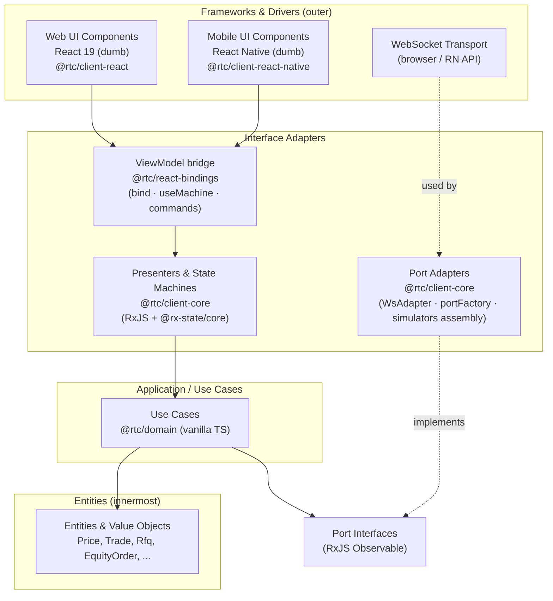
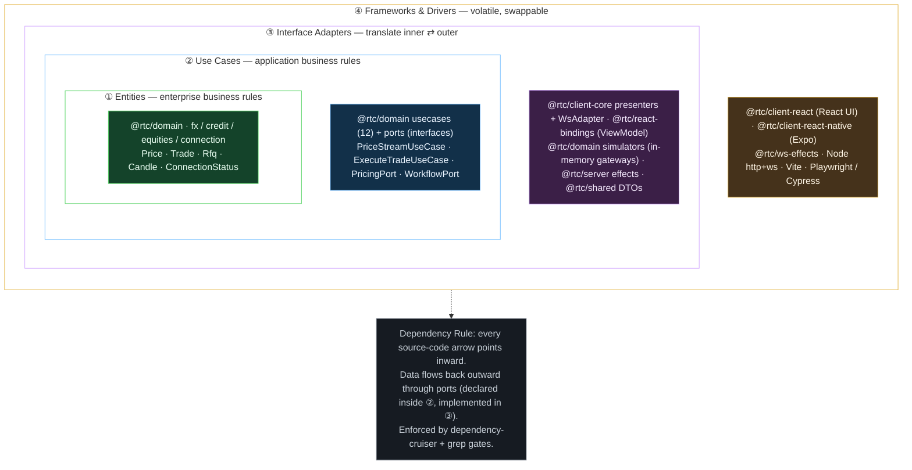
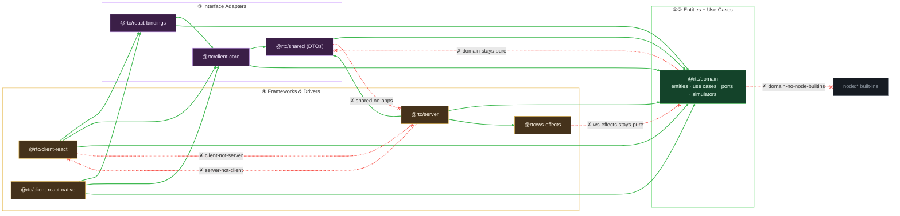

## 1. Overview

### 1.1 Purpose

**Reactive Trader Cloud Clone** is a real-time FX trading, Credit RFQ (Request for Quote), Equities, and Admin-telemetry platform. It serves equally as a working trading app and as a reference for clean, framework-agnostic architecture.

The codebase is organised so that any single technology -- React, RxJS, react-rxjs, Vite, the WebSocket transport, Vitest, Playwright -- can be replaced with another by changing only its layer. The rest of the system, and the behavioural test suite, continue to work unchanged.

That claim is no longer hypothetical. The same application core (`@rtc/client-core`) today drives **two shipping UIs** -- a React 19 web client and an Expo/React Native mobile client -- and is designed to drive a third (SolidJS, planned) by adding one bindings package and one UI package. See [§8.1](#81-the-multi-client-proof--the-solidjs-plan).

*Animated overview (renders live on GitHub): the two runtime modes feed the same `PricingPort`; everything from the port to the pixel is shared. Details in [§7 Runtime Topology](#runtime-topology-what-runs-when).*

### 1.2 Architectural Principles

These rules override individual technology choices.

**1. Make Choices, Defer Commitment.** Picking a technology is fine; binding the rest of the codebase to it is not. Framework types never cross inward boundaries. Choices are made at the edges and bound at a single Composition Root.

**2. The Dependency Rule** ([Uncle Bob, Clean Architecture](https://blog.cleancoder.com/uncle-bob/2012/08/13/the-clean-architecture.html)). Source-code dependencies point only inward. Inner circles know nothing about outer circles. Entities know nothing about use cases; use cases know nothing about presenters; presenters know nothing about UI frameworks.

**3. Dumb UI.** The UI layer renders state and emits intents. It contains no business logic, no transport awareness, and no orchestration. A complete UI rewrite from React to SolidJS (or anything else) should be tractable, given the ViewModel contract and a behavioural test suite. (The React Native client is the existence proof: same core, new leaves — [§8.1](#81-the-multi-client-proof--the-solidjs-plan).)

**4. Behavioural Tests as Insurance.** Tests describe *what* the system does, not *how*. They do not import React, RxJS, or Playwright internals; framework-specific glue lives in step definitions and page objects. Behavioural specs survive technology swaps and are the contract that makes a swap safe.

**5. Don't Over-Abstract.** Some technologies (a WebSocket transport, an HTTP client) are easy to wrap behind a port. Others (React, RxJS) are not -- abstracting them produces awkward, leaky facades that fight the framework's grain. Where wrapping is hard, keep the layer that uses the framework deliberately thin, so a behavioural-test-backed regeneration is cheap.

### 1.3 Layered Architecture & Terminology

Two terms commonly conflated -- "client" and "UI" -- mean different things here.

| Term | Meaning |
|---|---|
| **Domain** | Pure-TypeScript entities, value objects, ports, use cases, and simulators. Lives in `@rtc/domain`. RxJS is the single permitted runtime dependency (used as the boundary stream type). Knows nothing about UI or transport. |
| **Server** | Process that hosts the domain simulators behind declarative WebSocket effects (`@rtc/ws-effects`) and serves data to clients. |
| **Client** | Everything that runs on the user's device -- the whole bundle/app. **Includes** the application core, the bindings bridge, *and* the UI layer. There are two shipping clients (web React, mobile React Native) plus a planned SolidJS one. |
| **Application Core** | `@rtc/client-core` -- composition root, presenters, state machines, and port adapters (WS transport + simulator assembly). Vanilla TS + RxJS + `@rx-state/core`. **Zero framework imports** -- no React, no DOM, no React Native. Shared verbatim by every client. |
| **Bindings** | `@rtc/react-bindings` -- the one package that knows both worlds. Maps `Observable<T>` state to framework-native reactivity: `createViewModel` (react-rxjs `bind()` for shared streams, `useMachine` for per-mount machines, `firstValueFrom` for one-shot commands). A future SolidJS client gets a sibling `@rtc/solid-bindings`. |
| **UI Layer** | Dumb components only. Web: React 19 + CSS Modules in `@rtc/client-react/src/ui`. Mobile: React Native + `react-native-svg` in `@rtc/client-react-native/src/ui`. Consumes the core exclusively through the [ViewModel seam](#36-the-viewmodel-seam) (`useViewModel()`); **never imports `rxjs`** (machine-enforced, gate 26). |
| **Platform Adapters** | The thin per-client leaves: web has `LocalStoragePreferencesAdapter` / `MediaQueryColorSchemeAdapter` / `buildBrowserPorts`; mobile has `AsyncStoragePreferencesAdapter` / `AppearanceColorSchemeAdapter` / `buildNativePorts`. Everything else is shared. |

Note: **"no RxJS on the UI side" is not the same as "no RxJS on the client side"**. RxJS is the boundary stream type for ports and use cases (in `@rtc/domain`) and is the implementation language of `@rtc/client-core`. It is forbidden in the UI layer of both clients.

The arrows are source-code dependencies. The UI imports `useViewModel` but has no path to ports, adapters, use cases, or raw Observables. Ports are dependency-inverted -- adapters point at port interfaces, never the reverse. Each circle is now literally a package boundary, which is what makes the dependency rule machine-enforceable (dependency-cruiser + pnpm strict mode + grep gates).

#### 1.3.1 Clean Architecture, concretely -- which package is which ring

*A plain-English primer for readers who have never met Clean Architecture; everyone else can skim to the mapping table.*

Clean Architecture draws the system as **concentric rings**. The one rule that makes it work is the **Dependency Rule: source code may only point *inward***. An outer ring can name and use an inner ring; an inner ring must not even know an outer ring exists. The centre holds the things least likely to change (what a *Trade* or a *Price* fundamentally is); the outer edge holds the things most likely to change (React, the WebSocket, the build tool). Put the volatile stuff on the outside so churn there never forces a change in the stable core.

A useful mental image: the **business truth is the yolk**, and each shell around it is a *replaceable detail*. You could throw away React and keep every inner shell intact -- which is exactly what the React Native client proves ([§8.1](#81-the-multi-client-proof--the-solidjs-plan)).

The trick that lets **data flow outward while every code arrow points inward** is a *port*: an interface **declared** in an inner ring and **implemented** in an outer one (dependency inversion). `PricingPort` is declared next to the use cases; `WsAdapter` and the simulators implement it further out. The use case depends on the *interface* (inward); at runtime a concrete adapter is plugged in from outside. In this repo that rule isn't a guideline -- it is **machine-enforced** by dependency-cruiser (`domain-stays-pure`, `ws-effects-stays-pure`, ...; see [dependency-cruiser.md](dependency-cruiser.md)) and by the grep gates that ban `rxjs` in the UI.

The same containment, drawn inline (nested boxes = rings):

**The rings aren't a convention you have to remember -- they're compiled.** Every green arrow below is an *allowed* import; every red crossing is a layer violation that fails CI. This is the same package graph as the onion, flattened and annotated with the seven `.dependency-cruiser.cjs` rules that enforce it (full table in [dependency-cruiser.md](dependency-cruiser.md)); ring colors match the onion exactly.

> **Green** solid arrows are the allowed `dependencies` edges (they only ever point inward). **Red** dashed-✗ arrows are the crossings CI rejects. The seventh rule, `no-circular`, isn't a single arrow -- it forbids *any* import cycle anywhere in the graph (type-only edges excluded), keeping the whole onion a strict acyclic gradient from ④ inward to ①. (`@rtc/client-prototype` is omitted: as a design island with no `@rtc/*` deps it has no edges to show.)

The exact mapping, ring by ring:

| Ring | Clean Arch name | In one sentence | This repo |
|---|---|---|---|
| ① | **Entities** (Enterprise Business Rules) | What a thing *is*, independent of any app | `@rtc/domain/src/{fx,credit,equities,connection,analytics,telemetry,preferences}/` -- `Price`, `Notional`, `Trade`, `Instrument`, `Dealer`, `Rfq`, `Quote`, `EquityQuote`, `Candle`, `DepthBook`, `ConnectionStatus`, `PositionUpdates` |
| ② | **Use Cases** (Application Business Rules) | App-specific orchestration + the interfaces it needs | `@rtc/domain/src/usecases/` (12: `PriceStreamUseCase`, `ExecuteTradeUseCase`, `CreateRfqUseCase`, `ConnectionStatusUseCase`, ...) **and** `@rtc/domain/src/ports/` (the port interfaces -- `PricingPort`, `ExecutionPort`, `WorkflowPort`, `MarketDataPort`, ...) |
| ③ | **Interface Adapters** (presenters · gateways · controllers) | Convert between use-case shapes and the outside world | **Presenters/machines:** `@rtc/client-core/src/presenters/`. **Gateways (real):** `@rtc/client-core/src/adapters/` (`WsAdapter`, `portFactory`). **Gateways (in-memory, production -- not mocks):** `@rtc/domain/src/simulators/`. **Platform adapters:** `client-react/src/app/adapters/`, `client-react-native/src/app/adapters/`. **ViewModel bridge:** `@rtc/react-bindings`. **Server controllers/gateways:** `@rtc/server/src/effects/` + `toSocket`. **Boundary DTOs:** `@rtc/shared` |
| ④ | **Frameworks & Drivers** | The replaceable, volatile detail | `@rtc/client-react/src/ui/` (React + DOM + CSS Modules), `@rtc/client-react-native` UI (Expo/RN + react-native-svg), `@rtc/ws-effects` (the dispatch framework), the `@rtc/server` host (`node:http` + `ws`), Vite, Metro, Vitest/Playwright/Cypress, `@rtc/client-prototype` (design island) |

> **Where's the wiring?** `AppRoot.tsx` (web and RN) and `server/src/index.ts` are the **composition roots** -- they live at the very outer edge and are the *only* places that instantiate concrete adapters and inject them inward. Everything inner receives its dependencies; nothing inner constructs them.
>
> **Two subtleties worth internalizing:**
> - **Ports live with the use cases; adapters live outside.** `PricingPort` (②) is *declared* beside the use cases; `WsAdapter` and `PricingSimulator` (③) *implement* it. That inversion is what lets the arrow point inward while data flows out.
> - **Simulators are ring ③, not test doubles.** They are real in-memory gateways implementing the same ports as the WebSocket adapters, selected at the composition root -- production code, not mocks ([§10](#10-key-design-decisions)).

##### Entities vs Use Cases -- and why there is no "web use case"

The ①/② split is the most commonly confused boundary in Clean Architecture, so here it is in one line each, with this repo's own code:

- **Entity (Enterprise Business Rule)** -- a truth about the *business* that would hold even if this software didn't exist. "A spread is ask − bid." "Buy deals in the base currency." `calculateSpread`, `detectMovement`, and the `Price`/`Trade` shapes are entities: they don't know an app exists.
- **Use Case (Application Business Rule)** -- how *this system* behaves: orchestration of entities to fulfil a story. "Subscribe to pricing, enrich each tick with movement + spread, emit `Price`" is `PriceStreamUseCase` -- RTC's specific policy for delivering prices.

The test: **would the rule survive deleting all the software?** Yes → entity. Only true because this app works this way → use case.

A trap worth defusing explicitly: **"Application" does not mean "the web app" or "the mobile app".** It means the system being automated -- Reactive Trader as a product. Web and mobile are not two applications; they are **two delivery mechanisms (rings ③--④) onto the same application**. The web `Tile` and the RN `SpotTile` invoke the *same* `ExecuteTradeUseCase`; that is exactly why both clients share `@rtc/domain` + `@rtc/client-core` with zero duplication. A `WebExecuteTradeUseCase` / `MobileExecuteTradeUseCase` pair would be a smell -- a business rule leaking outward into the delivery layer.

Where legitimate platform differences go instead:

| Difference | Where it lives | Repo example |
|---|---|---|
| Same behaviour, different mechanism | One shared **port**, one adapter per platform (ring ③) | One `PreferencesPort`; `LocalStoragePreferencesAdapter` (web) vs `AsyncStoragePreferencesAdapter` (RN) |
| Feature mounted on one platform only | A **composition/UI decision** (ring ④), not a use-case fork | Admin/telemetry workspace: presenters are platform-neutral; the web client mounts them, the RN tabs don't |
| Genuinely different business behaviour | A real, *additional* use case in the shared core -- named by **what it does**, never `MobileFoo` | (none yet -- both clients run the same workflows) |

Litmus test: if two candidate use cases differ *only because one runs in a browser and one on a phone*, it isn't a use-case difference -- push it out to an adapter or the UI and keep one use case. If the *business* does something genuinely different, it's a separate use case, available to whichever client needs it.

And the whole thing in one concrete trace -- follow a single price tick across all four boundaries:

> A price update arrives on the **WebSocket (④)** → `WsAdapter` / `PricingSimulator` **(③ gateway)** turns the raw frame into a domain `PriceTick` and satisfies **`PricingPort` (②)** → `PriceStreamUseCase` **(②)** enriches it (`detectMovement`, spread) into a `Price` **entity (①)** → `PriceStreamPresenter` **(③)** multicasts it as `price$` → `createViewModel`'s `usePrice(pair)` **(③ ViewModel)** hands it to the **React `Tile` (④)** to paint.
>
> Notice the two directions: **control** flows outward-in-and-back-out (④→③→②→①→③→④), but every **source-code import** along that path still points inward. The only place the direction "reverses" is at `PricingPort` -- the port that inverts the dependency. (This is the same journey the [animated tick diagram](#animated-the-life-of-a-price-tick) shows in motion.)

### 1.4 Technology Choices

The current stack is a snapshot, not a commitment. Each row says what role is being played and what's playing it today. Cost-of-replacement is detailed in [§8 Replaceability Matrix](#8-replaceability-matrix).

| Role | Currently | Allowed inside the layer? |
|---|---|---|
| Entities & use cases | Pure TypeScript + RxJS | RxJS only (the explicit architectural exception in `@rtc/domain`) |
| Boundary stream type | RxJS `Observable<T>` | RxJS, the single explicit dependency exception in `@rtc/domain` |
| Client state streams & machines | RxJS + `@rx-state/core` in `@rtc/client-core` | RxJS, `@rx-state/core`, vanilla TS -- **no framework imports** |
| UI ↔ stream bridge | `@rtc/react-bindings` (react-rxjs `bind` + hand-written `useMachine`) | The bridge package only; the sole place React and RxJS meet |
| Web UI rendering | React 19 + CSS Modules | React; **no `rxjs` import** (gate 26) |
| Mobile UI rendering | React Native 0.86 / Expo SDK 57 + `react-native-svg` | React Native; same no-`rxjs` rule |
| UI memoization (web) | React Compiler (build-time) | No manual `useMemo`/`useCallback`; see [ADR-003](adr/ADR-003-react-compiler-and-manual-memoization.md) |
| Build tooling | Vite (web) · Metro/Expo (mobile) | -- |
| Server dispatch framework | `@rtc/ws-effects` (declarative RxJS effects) | rxjs only; zero domain knowledge |
| Server host | Node.js + `ws` + native `http` | -- |
| Wire format | JSON over WebSocket | DTOs + `CLIENT_MSG`/`SERVER_MSG` in `@rtc/shared` |
| Unit test runner | Vitest (all packages) + jest-expo (RN components) | -- |
| E2E driver | Playwright (CI gate) + Cypress (local, de-gated) | -- |
| Behavioural specs | Gherkin | -- |
| Build orchestration | pnpm workspaces + Turborepo | -- |

---

