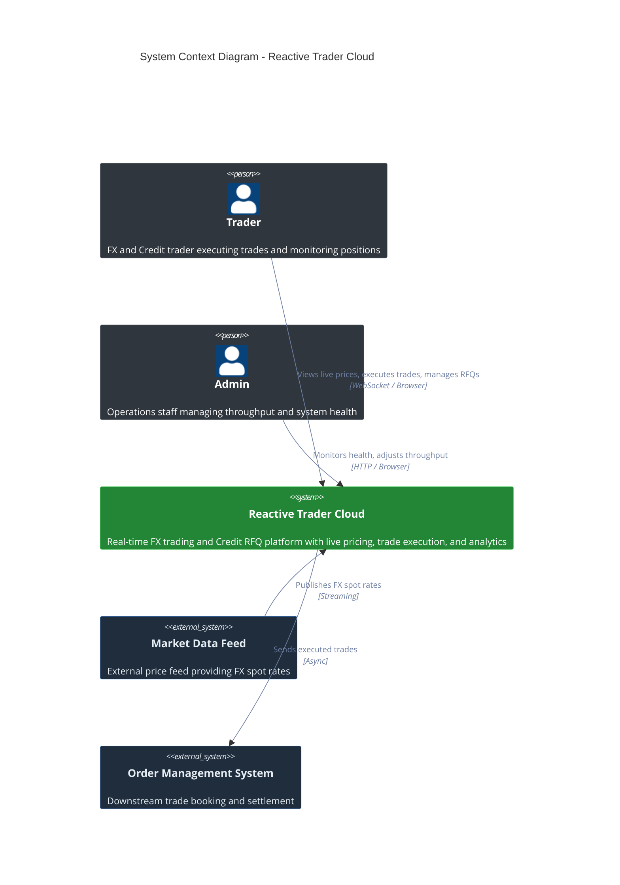
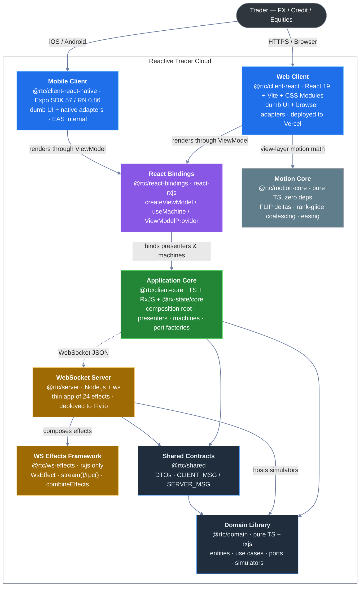
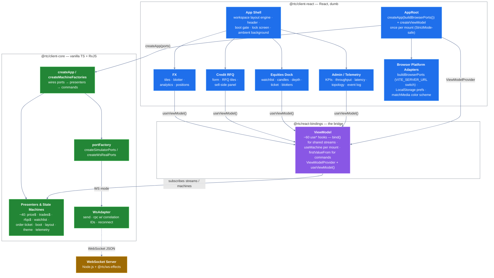
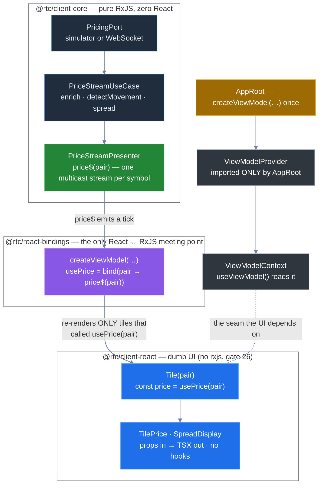
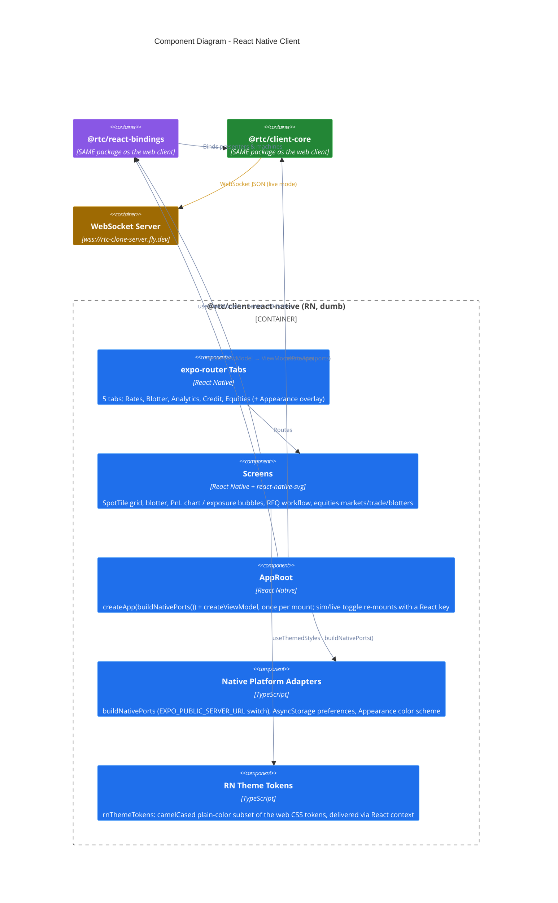
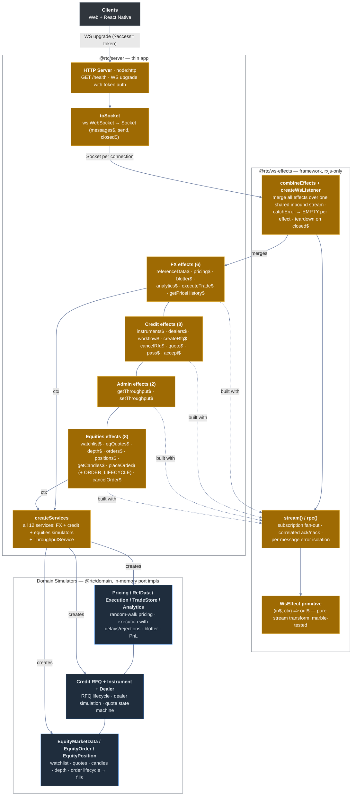

[◀ 1. Overview](01-overview.md) · [Architecture Document](../architecture.md) · [3. UML Class Diagrams ▶](03-uml-class-diagrams.md)

## 2. C4 Model

### 2.1 System Context Diagram

Shows the system boundary and external actors interacting with Reactive Trader Cloud.



> **Diagram theming note.** GitHub serves one SVG to readers on both light and dark themes, and Mermaid's default C4 palette (pale fills, faint gray arrows) is nearly invisible on the dark one. All §2 diagrams therefore use self-contained colors that contrast on both backgrounds, with one consistent scheme: **blue = UI**, **purple = bindings bridge**, **green = application core / the system**, **amber = server & effects framework**, **slate = domain & shared contracts**, **gray = actors/external**, **slate-gray = standalone pure-utility leaves** (`@rtc/motion-core`).

### 2.2 Container Diagram

Containers are described by **role first, current technology second**. The roles are the contract; the technology is replaceable.



Two further packages exist **outside** the production dependency graph, as design-comprehension artifacts (see [§8.1](08-replaceability-matrix.md#81-the-multi-client-proof--the-solidjs-plan) for how they relate to the fidelity workstream):

| Package | What it is | Runtime deps |
|---|---|---|
| `@rtc/client-prototype` | A readable React 19 re-implementation of the `docs/design/web/v2` standalone design prototype. Mock data via seeded random walks; no domain, no rxjs. `pnpm dev:proto` → port 5273. | `react`, `react-dom` only |
| `docs/design/web/v5/standalone/` | Not a package -- a single self-contained ~14 MB HTML file (the canonical web design artifact, superseding `docs/design/web/v4/standalone/`; v5 base64-embeds boot audio + intro video, hence the size, and is Git LFS-tracked). Served by `scripts/serve-design.mjs` (`pnpm dev:design` → port 8899). | none |
| `docs/design/mobile/v1/standalone/` | Not a package -- the self-contained mobile design prototype (the React Native UI/UX overhaul mockup). Served by `pnpm dev:design:mobile` → port 8899. | none |

### 2.3 Component Diagram -- Web Client

The web client is now three packages deep. The **Application Core** (`@rtc/client-core`) is plain TypeScript + RxJS -- no React imports anywhere. The **Bindings** (`@rtc/react-bindings`) turn core streams into hooks. What remains in `@rtc/client-react` is only the dumb UI plus the browser-specific leaves. Replacing React means rewriting the last package; core and bindings-contract are untouched.



**Key boundary**: anything inside `@rtc/client-core` may use RxJS freely. Anything in `src/ui` must not import `rxjs`, `@react-rxjs`, or `@rx-state` and must not see `Observable<T>` -- machine-enforced by grep gate 26 (plus gates 27--29 banning `localStorage`, `fetch`/`import.meta.env`, and timers in the UI). The bindings package is the only place that bridges the two worlds, and it is small (~850 LOC) precisely so a `@rtc/solid-bindings` sibling can be written in about a day.

#### 2.3.1 The shape of the simplicity

The web client is three moving parts, and only one of them contains logic.

**All business logic lives in presenters, which are pure RxJS -- no React at all.** A presenter is a plain class exposing `Observable<T>` streams (`price$`, `status$`, `trades$`, ...). It has never heard of a component, a render, or a hook. Because the stream is the source of truth, **the presenter decides *when* and *at what granularity* React re-renders** -- a tick pushed into `price$(EURUSD)` re-renders exactly the tiles subscribed to that symbol and nothing else. React is not the thing orchestrating updates; it is downstream of the streams, repainting on demand. There is no `useMemo`, no `useCallback`, no dependency-array bookkeeping (manual memoization is additionally banned by [ADR-003](../adr/ADR-003-react-compiler-and-manual-memoization.md) -- React Compiler covers what little remains), because React's re-render model isn't driving anything -- the RxJS graph is.

**The components are dumb on purpose: declarative TSX, almost no imperative code, and -- below the one `useViewModel()` call -- no further abstraction.** A leaf like `SpreadDisplay` is props-in / TSX-out with zero hooks. A container like `Tile` calls `useViewModel()` once, reads the granular hooks it needs, and renders. There is nothing to memoize because there is no derived state to cache -- the presenter already did the work upstream.

**The UI is fully decoupled from the wiring by a deliberate provider/context split.** Components depend only on `useViewModel()` and the `ViewModel` *type*. They never import `createViewModel` (the concrete factory) or `ViewModelProvider` (the injector) -- those are imported by exactly one file, `AppRoot`. So the entire concrete graph (which presenters, simulator vs. live transport, the react-rxjs `bind` calls) is invisible at every call site.



The same story in motion (animated SVG, renders live on GitHub) -- one tick, one re-render, idle tiles untouched:



And in code -- these are the real files, trimmed:

```typescript
// 1 — BUSINESS LOGIC. packages/client-core/src/presenters/PriceStreamPresenter.ts
//     A plain class of RxJS streams. No React, no hooks, no components.
export class PriceStreamPresenter {
  private readonly cache = new Map<string, Observable<Price>>();
  constructor(private readonly pricing: PricingPort) {}

  price$(pair: CurrencyPair): Observable<Price> {
    const cached = this.cache.get(pair.symbol);
    if (cached) return cached;                                   // one stream per symbol...
    const stream = new PriceStreamUseCase(this.pricing)
      .execute(pair)
      .pipe(shareReplay({ bufferSize: 1, refCount: true }));     // ...multicast, latest cached
    this.cache.set(pair.symbol, stream);
    return stream;
  }
}
```

```typescript
// 2 — THE SEAM. packages/react-bindings/src/createViewModel.ts
//     bind (react-rxjs) turns the per-symbol Observable into a hook. Subscription
//     granularity == the argument: usePrice(EURUSD) only ever re-renders
//     components that called usePrice(EURUSD).
const [usePrice] = bind((pair: CurrencyPair) => {
  return presenters.priceStream.price$(pair);
}, null);
```

```tsx
// 3 — THE UI. packages/client-react/src/ui/fx/liveRates/tile/Tile.tsx (trimmed)
//     One useViewModel() call, granular hooks, declarative return. No memo.
export function Tile({ pair, showChart }: TileProps): ReactElement {
  const { usePrice, usePriceHistory, useNotional, useTileExecution, useRfqTile } = useViewModel();
  const price = usePrice(pair);                 // this tile subscribes to THIS symbol
  const tileExecution = useTileExecution(pair); // a per-mount machine, auto-disposed
  // ... purely declarative TSX from here down
}

// ...and the leaf is dumber still — not even a hook (SpreadDisplay.tsx, verbatim):
export function SpreadDisplay({ spread }: SpreadDisplayProps): ReactElement {
  return <div className={styles.spread}>{spread}</div>;
}
```

The provider/context split is three tiny files in `@rtc/react-bindings`:

```typescript
// ViewModelContext.ts — the seam the UI reads. Just a context + the type. Nothing concrete.
export const ViewModelContext = createContext<ViewModel | null>(null);

// useViewModel.ts — what components import. Pulls in ONLY the context + type.
export function useViewModel(): ViewModel {
  const ctx = useContext(ViewModelContext);
  if (!ctx) throw new Error("useViewModel must be used within ViewModelProvider");
  return ctx;
}

// ViewModelProvider.tsx — imported by AppRoot ALONE. Supplies the concrete graph.
export function ViewModelProvider({ viewModel, children }: ViewModelProviderProps) {
  return <ViewModelContext.Provider value={viewModel}>{children}</ViewModelContext.Provider>;
}
```

Because `useViewModel`/`ViewModelContext` live in different modules than `ViewModelProvider`/`createViewModel`, a component that imports the accessor **cannot** transitively reach the concrete factory, the presenters, or react-rxjs. The dependency arrow only ever points *out* of the UI toward the `ViewModel` type. That is the entire coupling surface between `src/ui` and the rest of the app -- one type and one hook. Swapping simulator↔live transport, or even React↔Solid bindings, changes `AppRoot` and nothing in `src/ui`.

### 2.4 Component Diagram -- React Native Client

The mobile client (`@rtc/client-react-native`, Expo SDK 57 / RN 0.86) is deliberately boring: it is the **same architecture with different leaves**. Core and bindings are imported verbatim -- React is React on both platforms, so even the bindings package is shared. Only the UI components and two platform adapters are native-specific.



What is native-specific, exhaustively:

| Concern | Web (`client-react`) | Mobile (`client-react-native`) |
|---|---|---|
| Port selection switch | `src/app/buildBrowserPorts.ts` reads `VITE_SERVER_URL` | `src/app/buildNativePorts.ts` reads `EXPO_PUBLIC_SERVER_URL` via `expo-constants` (empty string forces simulator mode) |
| Preferences persistence | `LocalStoragePreferencesAdapter` (sync) | `AsyncStoragePreferencesAdapter` (seeds defaults synchronously, then `hydrate()` -- no-flash contract) |
| OS color scheme | `MediaQueryColorSchemeAdapter` (matchMedia) | `AppearanceColorSchemeAdapter` (RN `Appearance`) |
| Charts | SVG/canvas in React DOM | `react-native-svg`, geometry precomputed in pure vitest-tested helpers (`buildChart`, `buildCandles`, `buildGauge`, ...) |
| Theming | CSS custom properties (5 skins × dark/light) | `rnThemeTokens` context (same skins, CSS-only effects dropped) |
| Navigation | In-house workspace/layout engine | `expo-router` native tabs |
| Everything else | shared `@rtc/client-core` + `@rtc/react-bindings` | **identical imports** |

The Admin/telemetry workspace is web-only today; the RN app exposes five trading tabs. Distribution is the free path: EAS `development`/`preview` internal profiles, Android APK, no OTA updates (`updates.enabled: false`); the native `ios/`/`android/` folders are gitignored and regenerated by `expo prebuild` (`pnpm dev:ios` from the repo root).

### 2.5 Component Diagram -- WebSocket Server

The imperative `wsHandler.ts` switch is **gone**. The server is now a thin app composed of 24 declarative effects on top of `@rtc/ws-effects`. The entire connection wiring is four lines:

```typescript
const services = createServices();
const listen = createWsListener(combineEffects(...allEffects), services);
wss.on("connection", (ws) => listen(toSocket(ws)));
```



> **Naming**: these are **simulators**, not "mocks". They are production code that stands in for an external pricing or execution venue. *Test* mocks are a separate concept and live alongside tests.

> **One thing this diagram does not show** (detailed in [§7 Runtime Topology](07-communication-patterns.md#runtime-topology-what-runs-when)): these same simulators also run **in the browser / on the device** in simulator mode -- the server is only in the loop when a server URL is configured. Since the ws-effects rewrite shipped, the server serves **all four domains** (FX, Credit, Admin, Equities); the old equities gap is closed ([§7](07-communication-patterns.md#equities-over-the-wire-gap-closed)).

---

