## 3. UML Class Diagrams

### 3.1 FX Domain Entities

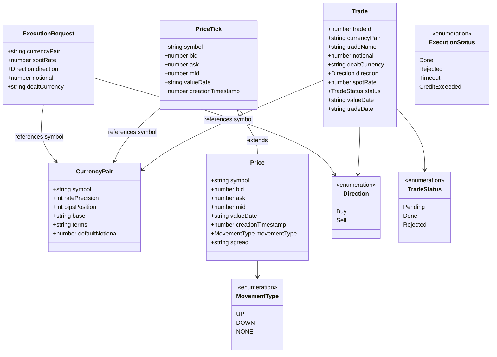

**Key functions:**
- `calculateSpread(bid, ask, pipsPosition, ratePrecision)` -- converts bid-ask difference to a pips string formatted to `ratePrecision - pipsPosition` decimals
- `detectMovement(current, previous)` -- compares mid prices to determine UP/DOWN/NONE
- `parseNotional(input)` -- supports k/m suffixes ("1.5m" = 1,500,000)
- `isRfqRequired(notional)` -- true when notional >= 10M (triggers RFQ instead of direct execution)
- `deriveDealtCurrency(direction, pair)` -- Buy = base currency; Sell = terms currency

**Constants:** `DEFAULT_NOTIONAL = 1M`, `RFQ_THRESHOLD = 10M`, `MAX_NOTIONAL = 1B`, `PRICE_HISTORY_SIZE = 50`

> These functions are pure, vendor-neutral, and are consumed by use cases (not by hooks): `detectMovement + calculateSpread` live in `PriceStreamUseCase`, so no UI rewrite can lose them.

### 3.2 Credit Domain Entities

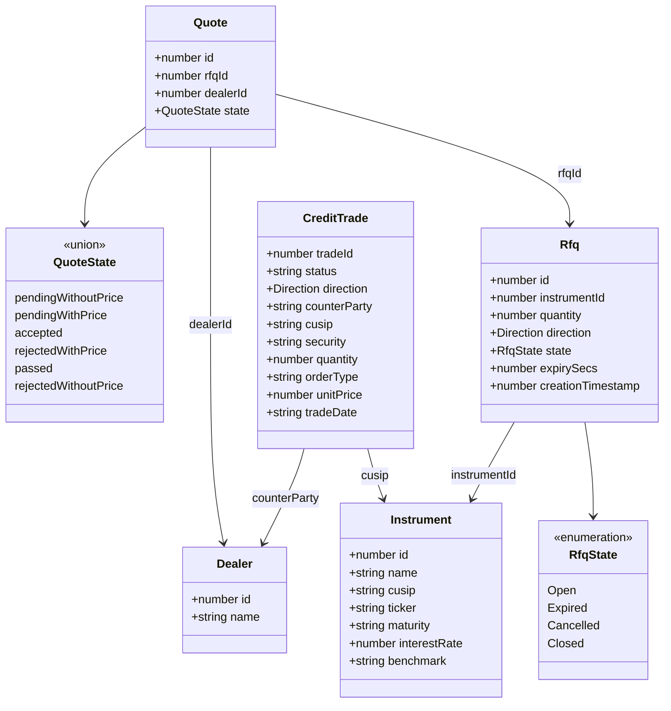

**Key functions:**
- `validQuoteTransitions(currentState)` -- returns allowed next states per current state
- **Constants:** `CREDIT_QUANTITY_MULTIPLIER = 1000`, `CREDIT_MAX_QUANTITY_INPUT = 100M`

### 3.3 Ports & Adapters (Hexagonal Architecture)

All ports use RxJS `Observable<T>` -- streaming feeds and one-shot ops alike. RxJS is the single explicit dependency exception in `@rtc/domain` (see [§1.3](#13-layered-architecture--terminology)). No other framework types leak into the domain.

The classic port surface is shown in three groups so each diagram renders at readable size (GitHub scales a diagram down to column width, so sibling count per row is the readability budget).

*A — the FX trade path (pricing, execution, blotter):*

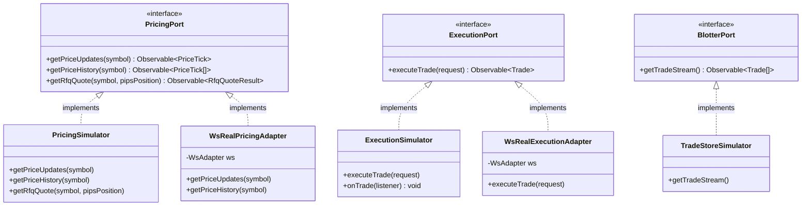

*B — the reference-data catalog (each also has a WsReal factory, elided for brevity):*

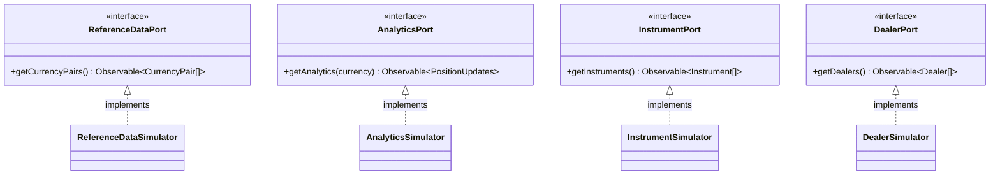

*C — the Credit RFQ workflow and connection events:*

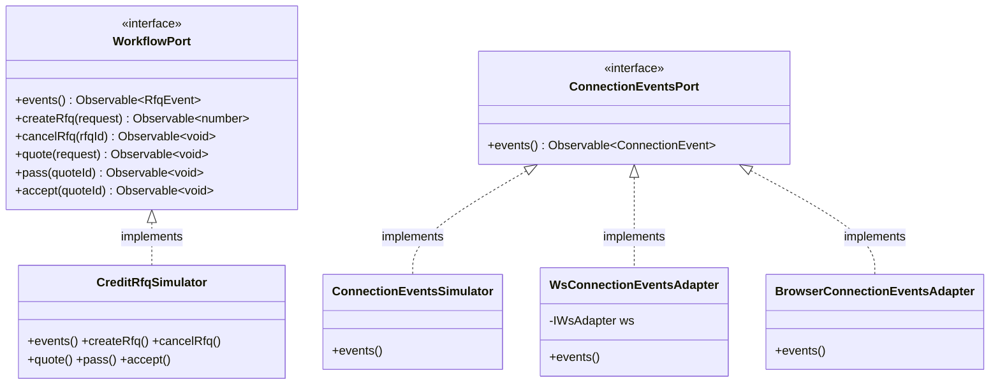

> **`WsReal*` adapters are factory functions, not classes.** The boxes above (`WsRealPricingAdapter`, `WsRealExecutionAdapter`, ...) are drawn as classes for diagram symmetry, but the real-mode port implementations are produced by factory functions (`createPricingPort`, `createExecutionPort`, ...) in `packages/client-core/src/adapters/portFactory.ts`, each closing over a shared `WsAdapter`. The eight classic transport ports plus `ConnectionEventsPort` (which has no contract-test layer — see [§9.6](#96-port-contract-test-layer)) are shown above; the port surface has since grown the families below.

**Newer port families** (added by the Equities, HUD, and Admin/telemetry workstreams; same dependency-inversion rules), again in two readable groups.

*D — equities market data, orders, positions:*

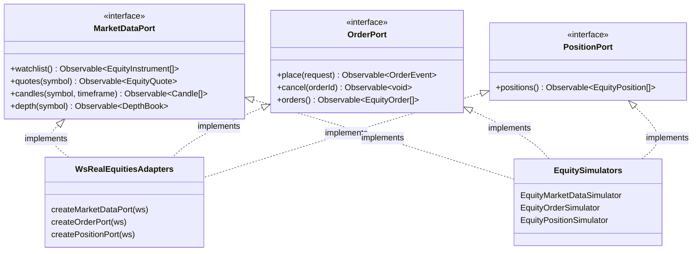

*E — admin, preferences, and the (simulator-only) telemetry family:*

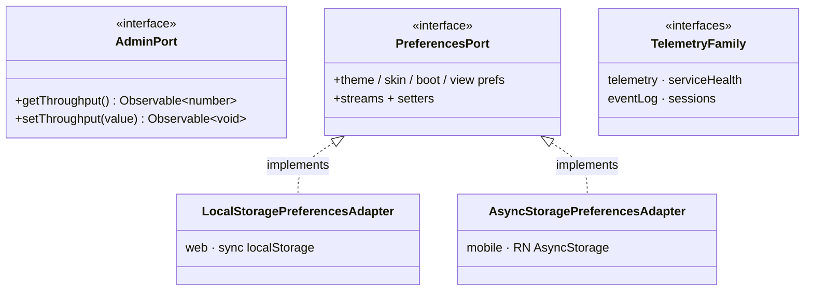

The telemetry family (`telemetry`, `serviceHealth`, `eventLog`, `sessions`) is simulator-only by design — it has no wire protocol and stays in-process even in WS mode (see [§7 Runtime Topology](#runtime-topology-what-runs-when)).

**Adapter selection** is performed at the **Composition Root** (single startup point), not at render time. Each client has one switch file that builds the full `AppPorts` either way:
- **Web** — `packages/client-react/src/app/buildBrowserPorts.ts` reads `VITE_SERVER_URL`: unset → `createSimulatorPorts()` (in-process, no transport); set → `new WsAdapter(buildWsUrl(url, token))` + `createWsRealPorts(ws, ...)`.
- **Mobile** — `packages/client-react-native/src/app/buildNativePorts.ts` reads `EXPO_PUBLIC_SERVER_URL` via `expo-constants`; an in-app sim/live toggle re-mounts `AppRoot` with a React `key` to switch branches without any branch logic in the tree.

Both factories (`createSimulatorPorts`, `createWsRealPorts`) live in `@rtc/client-core` and are shared; only the ~100-line switch file is per-platform.

**Gateway-events adapter pair.** `ConnectionEventsPort` is supplied by one of two transport-specific adapters chosen at the composition root: `WsConnectionEventsAdapter` (wraps `IWsAdapter.connectionEvents()` so `WsAdapter`'s `onopen`/`onclose` lifecycle reaches the state machine) in WS-real mode, or `ConnectionEventsSimulator` (one-shot `of(gatewayConnected)`) in simulator mode. Either choice is then merged with `BrowserConnectionEventsAdapter` (the source of `browserOnline`/`browserOffline`/`idleTimeout`/`userActivity`) via a plain `merge(...)` in `composition.ts`.

In simulator mode the composition root additionally pipes browser events through a `mergeMap` that synthesizes a `gatewayConnected` event after every `browserOnline`. This compensates for the fact that `ConnectionEventsSimulator.events()` is one-shot — without it the state machine would stay at `CONNECTING` permanently after a browser offline/online cycle (no real gateway exists in simulator mode to re-emit on reconnect). WS-real mode is unaffected: `WsAdapter` naturally emits a fresh `gatewayConnected` on each reconnect's `onopen`.

This pair replaced the Phase 3 `withSyntheticGatewayConnected` wrapper, which fabricated `gatewayConnected` events on every browser event independent of the actual transport state — a workaround that produced a misleading CONNECTED transient on server-down-on-boot in WS-real mode.

### 3.4 Use Cases

Use cases sit between ports and presenters. They take ports in their constructor (or factory), accept inputs, and return `Observable<T>` -- streams *and* one-shot ops alike. They are the home for application-specific orchestration and enrichment that today leaks into client hooks (e.g. `detectMovement + calculateSpread` for FX prices). Use cases may use RxJS operators (`map`, `scan`, `defer`, ...) but no React, no DOM.

*FX use cases:*

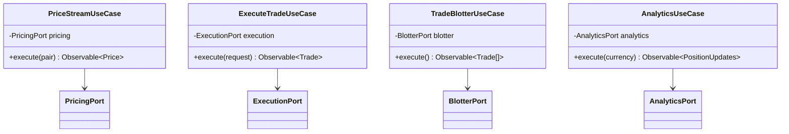

*Credit workflow & connection use cases:*

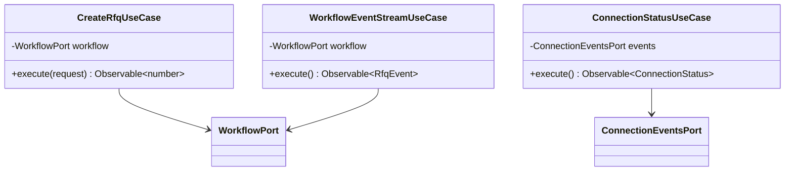

The diagram shows the use cases that carry real orchestration or enrichment. The full set in `packages/domain/src/usecases/` also includes `PriceHistoryUseCase` (rolling buffer), `CurrencyPairsUseCase`, `InstrumentsUseCase`, `DealersUseCase`, and `RfqQuoteUseCase` — twelve in total. The remaining workflow commands (`accept`, `cancel`, `pass`, `quote`) carry no application logic, so they are **not** wrapped in use cases: `RfqsPresenter` calls `WorkflowPort.accept`/`cancelRfq`/`pass`/`quote` directly. This follows the "Don't Over-Abstract" principle ([§1.2](#12-architectural-principles)) — a use case is added only when there is logic to home.

**Boundary type**: `Observable<T>` everywhere. No React types, no DOM types. Commands (`executeTrade`, `createRfq`, `accept`, ...) emit once and complete; callers `firstValueFrom(...)` to await imperatively when needed.

**Closure-in-`defer` pattern for stateful pipes.** Use cases that need per-subscription state (e.g. `PriceStreamUseCase` keeps `previousMid` to compute movement; `PriceHistoryUseCase` keeps a rolling buffer) wrap the pipeline in `defer(() => { ... })`. `defer` runs the factory on every `subscribe`, so each subscriber gets a fresh closure -- the same isolation the previous `AsyncIterable` version got from a function-scoped `let`:

```typescript
execute(pair: CurrencyPair): Observable<Price> {
  return defer(() => {
    let previousMid: number | undefined;
    return this.pricing.getPriceUpdates(pair.symbol).pipe(
      map((tick) => {
        const movement = detectMovement(tick.mid, previousMid);
        previousMid = tick.mid;
        return enrich(tick, movement);
      }),
    );
  });
}
```

**Why this layer exists**: it isolates application logic from both ports below (transport-agnostic) and presenters above (UI-framework-agnostic). Use cases are exhaustively tested via behavioural specs that swap port implementations between simulator and contract-test fixtures. RxJS in this layer is the explicit architectural exception; replacing React leaves use cases entirely untouched.

### 3.5 Presenters, Machines & State Streams

Presenters are the client-side glue between use cases (which already emit `Observable<T>`) and the UI (which consumes hooks). The presenter layer is where multicasting and UI-shaping happen -- `share`/`shareReplay` so the underlying port subscription is started once per symbol, `combineLatest` to fan in derived state, `scan` for accumulators that the UI snapshots. They all live in `packages/client-core/src/presenters/` -- roughly 40 presenters and machines across FX, Credit, Equities, Admin/telemetry, and shell concerns.

Alongside plain stream presenters, the core defines **state machines** -- the framework-neutral `Machine<TState, TIntents>` type (`{ state$, intents, dispose }` in `presenters/machine.ts`). Machines model per-component-instance lifecycles: `TileExecutionMachine`, `NotionalMachine`, `OrderTicketMachine`, `RfqCountdownMachine`, `BootSequenceMachine`, `LayoutMachine`, `IncidentMachine`, and friends. Their `state$` is a `StateObservable` from **`@rx-state/core`** -- the rxjs-only, framework-neutral half of react-rxjs -- which is what lets shareable, defaulted observable state live in the core while React (via `@react-rxjs/core` in the bindings) consumes it downstream. The split matters: `@rx-state/core` in `client-core`, `@react-rxjs/core` only in `react-bindings`.

RxJS appears in three layers: **port signatures** (`@rtc/domain` ports), **use cases** (`@rtc/domain` use cases), and **presenters/machines** (`@rtc/client-core`). It does **not** appear in:
- UI components or hook call sites in either client (use the ViewModel hooks; never import `rxjs` -- gate 26)

Because use cases already return `Observable<T>`, presenters are usually a thin `pipe(...)` over a use-case output rather than an `AsyncIterable -> Observable` conversion. Presenters expose the resulting stream to the bindings package, which turns it into a hook.

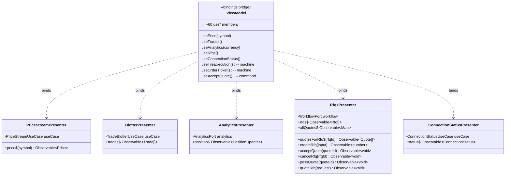

The diagram shows representative presenters. The full set in `packages/client-core/src/presenters/` also includes `PriceHistoryPresenter`, `CurrencyPairsPresenter`, `InstrumentsPresenter`, `DealersPresenter`, `TradeExecutionPresenter`, `RfqQuotePresenter`, the equities set (`WatchlistPresenter`, `CandleSeriesPresenter`, `OrdersBlotterPresenter`, `DepthPresenter`), the admin/telemetry set (`ThroughputMetricPresenter`, `LatencyPresenter`, `ErrorRatePresenter`, `ServiceTopologyPresenter`, `EventLogPresenter`, `SessionsPresenter`), and shell presenters (`SessionPresenter`, `AnimationDirector`, theme/boot/view preference presenters). **Command methods return `Observable<T>`, not `Promise<T>`** — they are one-shot streams. The UI no longer calls `firstValueFrom` itself: command hooks in the bindings (`useAcceptQuote`, `useCancelRfq`, ...) wrap it, so the UI layer imports **zero** RxJS symbols.

**Replacing react-rxjs (or React itself)**: react-rxjs is a small library (a few hundred lines, see [re-rxjs/react-rxjs](https://github.com/re-rxjs/react-rxjs)), and this repo already uses it split into its two halves: `@rx-state/core` (framework-neutral, in `client-core`) + `@react-rxjs/core` (React-facing, in `react-bindings`). To swap React -> SolidJS, write a `@rtc/solid-bindings` that maps the same `StateObservable`s to Solid signals -- presenters and below are unchanged. UI components are rewritten -- but their contracts (the ViewModel hook signatures) are mirrored 1:1, and the behavioural spec suite verifies the rewrite. See [§8.1](#81-the-multi-client-proof--the-solidjs-plan).

**Replacing RxJS itself** (for example with effect-ts): high-cost. RxJS is the boundary stream type, so swapping it touches every port, every simulator, every use case, and every presenter. The change is mechanical -- mostly `Observable<T>` → `Stream<T>` and operator-name remapping -- and behavioural tests at the UI level don't change, but it is no longer a single-layer rewrite. This is the cost paid in exchange for the simplicity of a single boundary stream type ([§8 Replaceability Matrix](#8-replaceability-matrix) tracks the trade-off).

### 3.6 The ViewModel Seam

The UI's **only** doorway into the application core is the ViewModel seam ([ADR-004](adr/ADR-004-viewmodel-seam-and-feature-flags.md)). It is deliberately a single, flat dependency-injection surface: one interface, one context, one accessor.

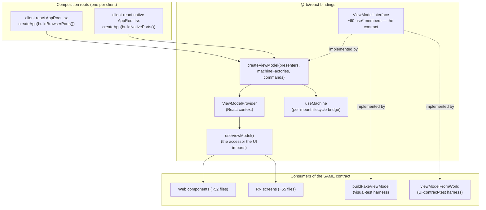

How the pieces divide the work inside `createViewModel`:

| Hook kind | Mechanism | Examples |
|---|---|---|
| Shared/global streams | react-rxjs `bind()` -- refcounted singletons | `usePrice`, `useTrades`, `useWatchlist`, `useThroughputState`, preference streams |
| Per-mount machines | `useMachine` -- lazy `useRef` factory, StrictMode-safe microtask-deferred `dispose()` | `useTileExecution`, `useOrderTicket`, `useNotional`, `useRfqTile` |
| One-shot commands | `firstValueFrom` wrapped inside the hook | `useAcceptQuote`, `useCancelRfq` |

Three properties make this a real seam rather than a service locator:

1. **Constructed once, before the tree.** Each client's `AppRoot` builds ports → `createApp` → `createViewModel` in a lazy `useRef` (surviving StrictMode double-invoke) and supplies it via `ViewModelProvider`. No per-render injection, no re-wiring on re-render.
2. **The interface is the portability contract.** The `ViewModel` type is implemented by the production factory *and* by two test harnesses (`buildFakeViewModel` for visual goldens, `viewModelFromWorld` for UI contract tests). A SolidJS client implements the same member list with signals.
3. **Nothing else crosses.** Injecting JSX or components through the ViewModel is forbidden (it would break the SolidJS-port contract, per ADR-004); the UI cannot reach presenters, ports, or Observables directly (gates 26--29).

---

