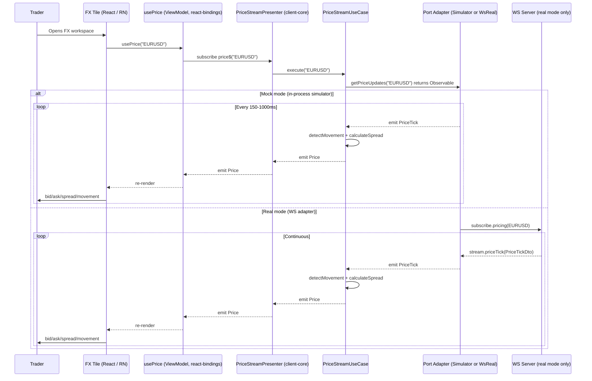
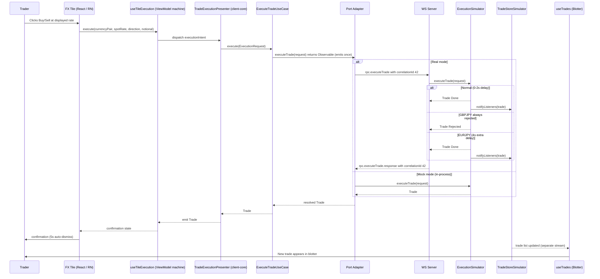
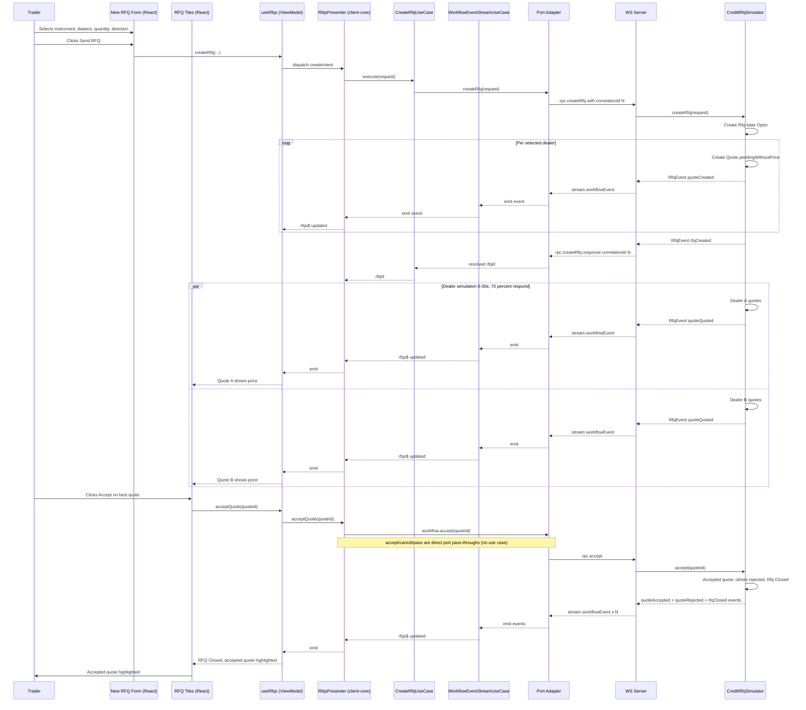
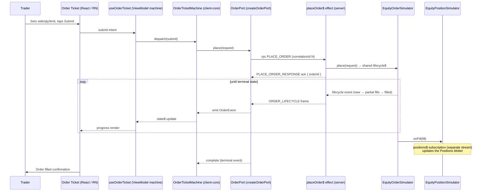

[◀ 3. UML Class Diagrams](03-uml-class-diagrams.md) · [Architecture Document](../architecture.md) · [5. State Diagrams ▶](05-state-diagrams.md)

## 4. Sequence Diagrams

### 4.1 FX Price Streaming

The tile — web or mobile, the flow is identical — knows nothing about subscriptions, transports, or enrichment. It calls `useViewModel().usePrice(symbol)` and renders. Enrichment (`detectMovement + calculateSpread`) lives in the use case, not the hook. In real mode the server side of the stream is the `pricing$` effect (`stream(SUBSCRIBE_PRICING, ...)` in `packages/server/src/effects/fx.effects.ts`).

### 4.2 FX Trade Execution (RPC)

### 4.3 Credit RFQ Workflow

### 4.4 Equities Order Lifecycle

Placing an equity order is the one message flow that is **both** an RPC and a stream: the `placeOrder$` effect acks the RPC with the `orderId`, then keeps streaming `ORDER_LIFECYCLE` frames for that order until it reaches a terminal state. The client-side `OrderPort.place()` Observable completes on `filled`/`cancelled`/`rejected`.

The server keeps exactly one lifecycle observable per order (`shareReplay(1)` with refcount) so the ack and the stream cannot race; `placeOrder$` carries its own `catchError → nack` so a bad order rejects that one RPC without disabling the effect.

---

