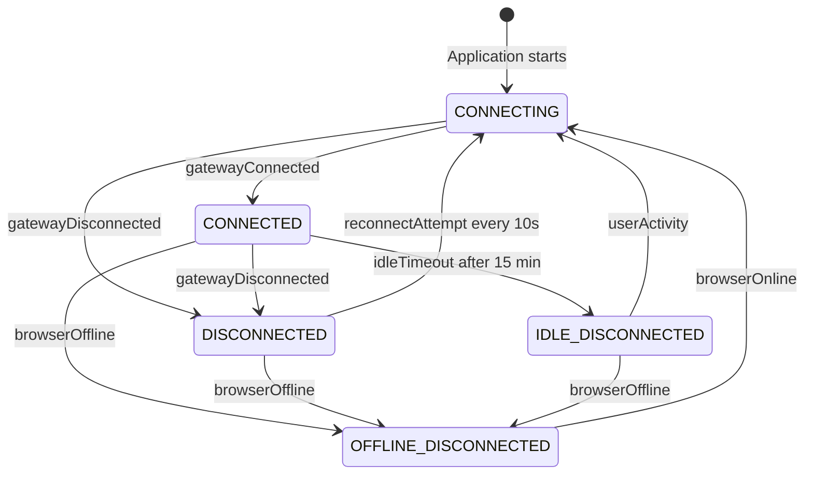
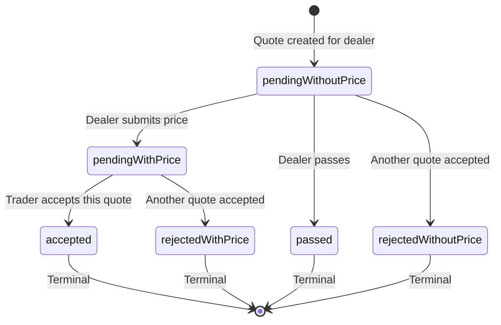
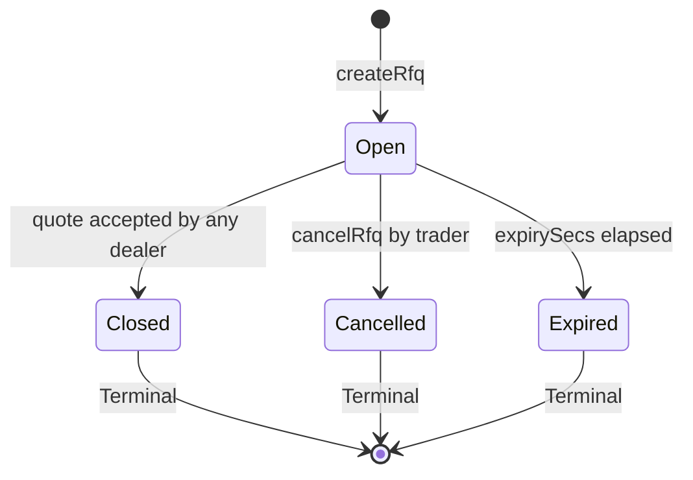
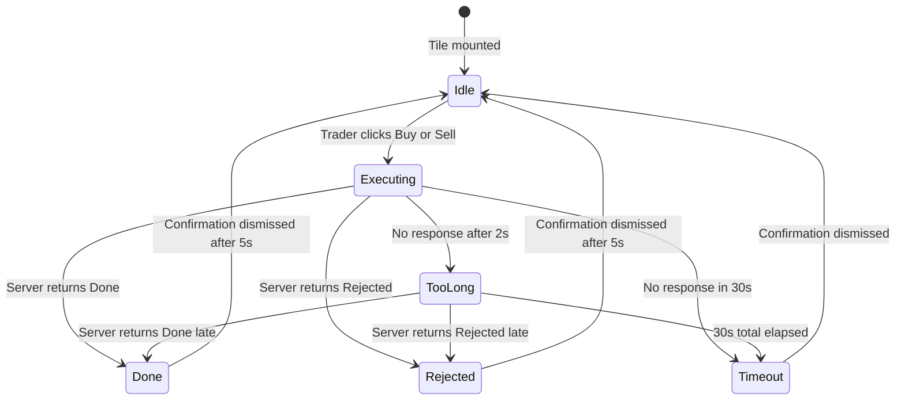

[◀ 4. Sequence Diagrams](04-sequence-diagrams.md) · [Architecture Document](../architecture.md) · [6. Package Dependencies ▶](06-package-dependencies.md)

## 5. State Diagrams

### 5.1 Connection Status

Pure function `nextConnectionStatus(current, event)` drives all transitions.

**Constants:** `IDLE_TIMEOUT_MS = 15 min`, `RECONNECT_INTERVAL_MS = 10s`

### 5.2 Quote State Machine (Credit RFQ)

Each dealer quote follows this state machine. Transitions are validated by `validQuoteTransitions()`.

### 5.3 RFQ Lifecycle

### 5.4 FX Trade Execution Flow

**Constants:** `EXECUTION_TIMEOUT_MS = 30s`, `TOO_LONG_THRESHOLD_MS = 2s`, `CONFIRMATION_DISMISS_MS = 5s`

> **Implementation note.** The diagram names states for clarity; the `TileState` union in `useTileState.ts` uses `ready` (Idle), `started` (Executing), `tooLong`, `timeout`, and a single `finished` state that carries an `executionStatus` discriminator (`Done` / `Rejected` / `Timeout` / `CreditExceeded`) plus the resulting `Trade`. So the diagram's `Done` and `Rejected` are both the `finished` state with different `executionStatus` values, not separate union members.

---

