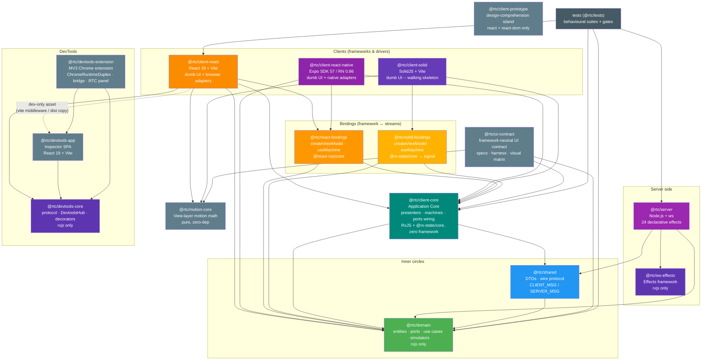

[◀ 5. State Diagrams](05-state-diagrams.md) · [Architecture Document](../architecture.md) · [7. Communication Patterns ▶](07-communication-patterns.md)

## 6. Package Dependencies

Fifteen workspace packages plus the `tests` package. Every arrow is a real `dependencies` entry; dependencies flow **inward only** (toward `domain`).

**Dependency rules** (each machine-enforced):
- `@rtc/domain` has **`rxjs` as its single runtime dependency** -- the explicit architectural exception, used as the boundary stream type. No other runtime deps are permitted (pnpm strict mode). `@rtc/ws-effects` follows the same rxjs-only constraint.
- `@rtc/shared` depends only on `domain`.
- `@rtc/client-core` depends on `domain` + `shared` (+ `rxjs`, `@rx-state/core`) and on **no framework** -- no React, no DOM types, no React Native.
- `@rtc/react-bindings` is the only package allowed to depend on both React and the core's streams.
- Clients (`client-react`, `client-react-native`) depend on `core` + `react-bindings` + `domain`; `client-solid` depends on `core` + `solid-bindings` + `domain` the same way. **Clients and server never import each other** (dependency-cruiser `client-not-server` / `server-not-client`).
- `@rtc/client-prototype` is an intentional island: `react`/`react-dom` only, no `@rtc/*` imports.
- `@rtc/motion-core` is a zero-runtime-dependency leaf (no `rxjs`, no DOM, no React) consumed directly by a client's animation shell -- `client-react` and `client-solid` each depend on it the same way (`client-solid → motion-core`), never through `client-core`/`react-bindings`/`solid-bindings`.
- `@rtc/ui-contract` is the framework-neutral UI test contract (shared harness + contract specs + visual scenario matrix, extracted from client-react's test tree). It depends on `client-core` + `domain` + `motion-core` (+ `rxjs`) and is framework-free; clients consume it as a **devDependency** for their contract/visual suites -- it never appears in any `src/` import.
- `@rtc/devtools-core` is an `rxjs`-only leaf, like `ws-effects` -- it decorates by structural shape and must not import any other `@rtc/*` package (dependency-cruiser `devtools-core-stays-pure`). `@rtc/devtools-app` (the inspector SPA) depends only on `devtools-core` + `react`/`react-dom` -- it understands the wire protocol, never `client-core`/`domain` (`devtools-app-protocol-only`). `client-react` has a real runtime edge to `devtools-core` (the composition-root decorators) plus a **dev-only asset edge** to `devtools-app` -- a `devDependency` used only to build-order and locate its `dist/` for the `/devtools/` Vite middleware/copy (see [§20](20-devtools.md)).
- `@rtc/devtools-extension` (the MV3 Chrome DevTools extension -- a third `Duplex` transport that attaches the inspector to any running app, including the deployed build) is itself a **leaf consumer** of the devtools pair: it may import only `devtools-core` (transport/protocol/store) and `devtools-app` (the `InspectorApp`), never a client/server/domain package (dependency-cruiser `devtools-extension-is-a-leaf`). It is the **only** workspace package that imports `devtools-app` as source (its own Vite build transpiles it); nothing else imports `devtools-app`, and nothing depends on `devtools-extension`.

**Build order** (Turborepo topological): `domain` | `ws-effects` | `motion-core` | `devtools-core` → `shared` → `client-core` → `react-bindings` | `solid-bindings` | `ui-contract` | `devtools-app` → `client-react` | `client-react-native` | `client-solid` | `server` | `devtools-extension` (prototype builds independently).

> The inward-only rule is machine-enforced by **dependency-cruiser** as a blocking CI gate (`pnpm check:deps`, config at `.dependency-cruiser.cjs`): `no-circular`, `domain-stays-pure`, `domain-no-node-builtins`, `shared-no-apps`, `client-not-server`, `server-not-client`, `ws-effects-stays-pure`, `motion-core-stays-pure`, `devtools-core-stays-pure`, `devtools-core-no-node-builtins`, `devtools-app-protocol-only`, `devtools-extension-is-a-leaf`. See [dependency-cruiser.md](../dependency-cruiser.md) for the rule-by-rule breakdown.

> **History**: the Application Layer originally lived inside `@rtc/client-react` (the doc's earlier revisions called this out as a possible future extraction). The React Native workstream forced the question, and the extraction happened: `@rtc/client-core` + `@rtc/react-bindings` are that promotion, executed without breaking UI consumers -- exactly because components only ever imported the hook bridge.

---

