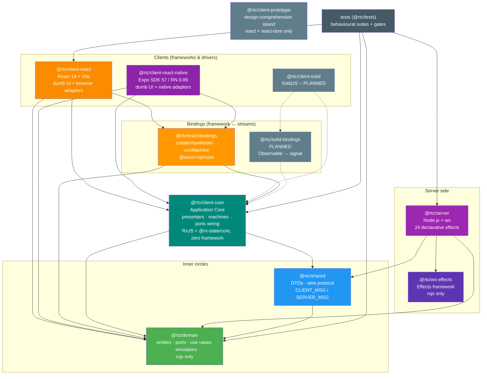

## 6. Package Dependencies

Nine workspace packages plus the `tests` package. Every arrow is a real `dependencies` entry; dependencies flow **inward only** (toward `domain`).

**Dependency rules** (each machine-enforced):
- `@rtc/domain` has **`rxjs` as its single runtime dependency** -- the explicit architectural exception, used as the boundary stream type. No other runtime deps are permitted (pnpm strict mode). `@rtc/ws-effects` follows the same rxjs-only constraint.
- `@rtc/shared` depends only on `domain`.
- `@rtc/client-core` depends on `domain` + `shared` (+ `rxjs`, `@rx-state/core`) and on **no framework** -- no React, no DOM types, no React Native.
- `@rtc/react-bindings` is the only package allowed to depend on both React and the core's streams.
- Clients (`client-react`, `client-react-native`) depend on `core` + `react-bindings` + `domain`; **clients and server never import each other** (dependency-cruiser `client-not-server` / `server-not-client`).
- `@rtc/client-prototype` is an intentional island: `react`/`react-dom` only, no `@rtc/*` imports.

**Build order** (Turborepo topological): `domain` → `shared` | `ws-effects` → `client-core` → `react-bindings` → `client-react` | `client-react-native` | `server` (prototype builds independently).

> The inward-only rule is machine-enforced by **dependency-cruiser** as a blocking CI gate (`pnpm check:deps`, config at `.dependency-cruiser.cjs`): `no-circular`, `domain-stays-pure`, `domain-no-node-builtins`, `shared-no-apps`, `client-not-server`, `server-not-client`, `ws-effects-stays-pure`. See [dependency-cruiser.md](./dependency-cruiser.md) for the rule-by-rule breakdown.

> **History**: the Application Layer originally lived inside `@rtc/client-react` (the doc's earlier revisions called this out as a possible future extraction). The React Native workstream forced the question, and the extraction happened: `@rtc/client-core` + `@rtc/react-bindings` are that promotion, executed without breaking UI consumers -- exactly because components only ever imported the hook bridge.

---

