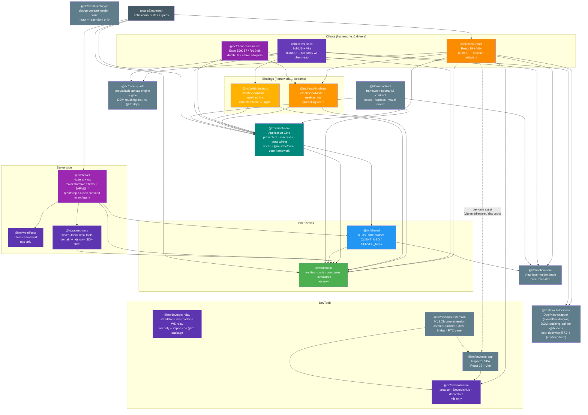

[◀ 5. State Diagrams](05-state-diagrams.md) · [Architecture Document](../architecture.md) · [7. Communication Patterns ▶](07-communication-patterns.md)

## 6. Package Dependencies

Twenty workspace packages plus the `tests` package. Every arrow is a real `dependencies` entry; dependencies flow **inward only** (toward `domain`).

```mermaid
graph TB
    subgraph clients["Clients (frameworks & drivers)"]
        webc["@rtc/client-react\nReact 19 + Vite\ndumb UI + browser adapters"]
        rnc["@rtc/client-react-native\nExpo SDK 57 / RN 0.86\ndumb UI + native adapters"]
        solidc["@rtc/client-solid\nSolidJS + Vite\ndumb UI -- full parity w/ client-react"]
    end

    subgraph bridge["Bindings (framework ↔ streams)"]
        rb["@rtc/react-bindings\ncreateViewModel · useMachine\n@react-rxjs/core"]
        sb["@rtc/solid-bindings\ncreateViewModel · useMachine\n@rx-state/core → signal"]
    end

    core["@rtc/client-core\nApplication Core\npresenters · machines · ports wiring\nRxJS + @rx-state/core, zero framework"]

    subgraph backend["Server side"]
        server["@rtc/server\nNode.js + ws\n24 declarative effects + JARVIS_*\n@anthropic-ai/sdk confined to src/agent"]
        wse["@rtc/ws-effects\nEffects framework\nrxjs only"]
        agt["@rtc/agent-tools\nseven Jarvis desk tools\ndomain + rxjs only, SDK-free"]
    end

    subgraph devtools["DevTools"]
        dtcore["@rtc/devtools-core\nprotocol · DevtoolsHub · decorators\nrxjs only"]
        dtapp["@rtc/devtools-app\nInspector SPA\nReact 19 + Vite"]
        dtext["@rtc/devtools-extension\nMV3 Chrome extension\nChromeRuntimeDuplex · bridge · RTC panel"]
        dtrelay["@rtc/devtools-relay\nstandalone dev-machine WS relay\nws only -- imports no @rtc package"]
    end

    subgraph inner["Inner circles"]
        shared["@rtc/shared\nDTOs · wire protocol\nCLIENT_MSG / SERVER_MSG"]
        domain["@rtc/domain\nentities · ports · use cases · simulators\nrxjs only"]
    end

    proto["@rtc/client-prototype\ndesign-comprehension island\nreact + react-dom only"]
    motion["@rtc/motion-core\nView-layer motion math\npure, zero-dep"]
    boot["@rtc/boot-splash\nboot/splash canvas engine + gate\nDOM-touching leaf, no @rtc deps"]
    dockv["@rtc/layout-dockview\nDockview wrapper (createDockEngine)\nDOM-touching leaf, no @rtc deps\ndep: dockview@7.0.4 (confined here)"]
    uic["@rtc/ui-contract\nframework-neutral UI contract\nspecs · harness · visual matrix"]
    tests["tests (@rtc/tests)\nbehavioural suites + gates"]

    webc --> rb
    webc --> core
    webc --> domain
    webc --> motion
    webc --> boot
    webc --> dockv
    webc --> dtcore
    webc -.->|"dev-only asset\n(vite middleware / dist copy)"| dtapp
    dtapp --> dtcore
    dtext --> dtcore
    dtext --> dtapp
    rnc --> rb
    rnc --> core
    rnc --> domain
    solidc --> sb
    solidc --> core
    solidc --> motion
    solidc --> boot
    solidc --> dockv
    rb --> core
    rb --> domain
    sb --> core
    sb --> domain
    core --> domain
    core --> shared
    server --> domain
    server --> shared
    server --> wse
    server --> agt
    agt --> domain
    shared --> domain
    shared --> motion
    uic --> core
    uic --> domain
    uic --> motion
    tests --> webc
    tests --> core
    tests --> server
    tests --> domain

    %% Invisible rank constraints -- stack the lanes vertically:
    %% core → Server side → Inner circles → DevTools (horizontal space is scarce, vertical scroll is free)
    core ~~~ server
    core ~~~ wse
    shared ~~~ dtcore
    domain ~~~ dtext
    domain ~~~ dtrelay
    motion ~~~ dockv

    style domain fill:#4CAF50,color:#fff
    style shared fill:#2196F3,color:#fff
    style core fill:#00897B,color:#fff
    style rb fill:#FF9800,color:#fff
    style webc fill:#FB8C00,color:#fff
    style rnc fill:#8E24AA,color:#fff
    style server fill:#9C27B0,color:#fff
    style wse fill:#5E35B1,color:#fff
    style agt fill:#5E35B1,color:#fff
    style proto fill:#607D8B,color:#fff
    style motion fill:#607D8B,color:#fff
    style boot fill:#607D8B,color:#fff
    style dockv fill:#607D8B,color:#fff
    style uic fill:#607D8B,color:#fff
    style solidc fill:#673AB7,color:#fff
    style sb fill:#FFB300,color:#fff
    style tests fill:#455A64,color:#fff
    style dtcore fill:#5E35B1,color:#fff
    style dtapp fill:#607D8B,color:#fff
    style dtext fill:#607D8B,color:#fff
    style dtrelay fill:#5E35B1,color:#fff
```

**Dependency rules** (each machine-enforced):
- `@rtc/domain` has **`rxjs` as its single runtime dependency** -- the explicit architectural exception, used as the boundary stream type. No other runtime deps are permitted (pnpm strict mode). `@rtc/ws-effects` follows the same rxjs-only constraint.
- `@rtc/shared` depends on `domain`, `rxjs`, and, narrowly, `motion-core`: `src/jarvis/ScriptedJarvisEngine.ts` (the transport-neutral scripted Jarvis brain, shared by the sim-mode client adapter and the server's ScriptedAgentLoop) uses `speechChunks`/`SPEECH_CHUNK_INTERVAL_MS` typed-reveal chunk math to pace Jarvis replies -- the dependency-cruiser allowlist (`shared-no-apps`) was widened accordingly.
- `@rtc/client-core` depends on `domain` + `shared` (+ `rxjs`, `@rx-state/core`) and on **no framework** -- no React, no DOM types, no React Native. `ScriptedJarvisAdapter` is now a thin subclass shim over `@rtc/shared`'s `ScriptedJarvisEngine`, so client-core no longer imports `motion-core` directly.
- `@rtc/react-bindings` is the only package allowed to depend on both React and the core's streams.
- Clients (`client-react`, `client-react-native`) depend on `core` + `react-bindings` + `domain`; `client-solid` depends on `core` + `solid-bindings` + `domain` the same way. **Clients and server never import each other** (dependency-cruiser `client-not-server` / `server-not-client`).
- `@rtc/client-prototype` is an intentional island: `react`/`react-dom` only, no `@rtc/*` imports.
- `@rtc/motion-core` is a zero-runtime-dependency leaf (no `rxjs`, no DOM, no React) consumed directly by a client's animation shell -- `client-react` and `client-solid` each depend on it the same way (`client-solid → motion-core`), never through `react-bindings`/`solid-bindings`. `@rtc/shared` is also a direct consumer (`shared → motion`, above) -- narrowly, for the scripted Jarvis brain's speech-chunk pacing (`speechChunks`) -- so the "never through an inner-circle package" framing no longer holds; the framework-shell edges and the shared-package edge are both real, and dependency-cruiser's `shared-no-apps` rule allows the latter explicitly.
- `@rtc/boot-splash` is the framework-free boot/splash feature: the canvas draw engine (six 3D scene variants + shared laser/docking helpers), the reduced-motion/webdriver gate, and the two `*.module.css` stylesheets. It must not import any other `@rtc/*` package (dependency-cruiser `boot-splash-stays-pure`), but -- unlike `motion-core` -- it is a **DOM-touching** leaf, not a no-DOM one: the engine reaches the canvas 2D context and the gate reads `navigator`/`location` directly. Both web clients (`client-react`, `client-solid`) depend on it directly, each supplying its own thin `BootSequence`/`BootGate` shell.
- `@rtc/layout-dockview` is the framework-neutral Dockview wrapper behind the [`LayoutEngine` preference](../adr/ADR-002-layout-management-port.md) (`"inhouse" | "dockview"`, default in-house). It must not import any other `@rtc/*` package (dependency-cruiser `layout-dockview-stays-pure`) -- like `boot-splash`, it is a DOM-touching leaf (`createDockEngine` mounts Dockview into a container element), not a no-DOM one like `motion-core`. Its one runtime dependency, `dockview@7.0.4`, is confined to this package by a second rule (`dockview-only-in-layout-dockview`) -- a direct client import of `dockview`/`dockview-core` would leak the engine's vocabulary and break the swap guarantee the ADR exists to buy. Both web clients (`client-react`, `client-solid`) depend on it directly, each supplying its own thin `DockviewLayoutEngine` bridge that portal-mounts the existing panel registries' content into Dockview's panels.
- `@rtc/ui-contract` is the framework-neutral UI test contract (shared harness + contract specs + visual scenario matrix, extracted from client-react's test tree). It depends on `client-core` + `domain` + `motion-core` (+ `rxjs`) and is framework-free -- the `motion-core` edge is the canvas chart spike's `drawChartScene` consuming the `ChartScene` type and `chartScene` function; clients consume `ui-contract` as a **devDependency** for their contract/visual suites -- it never appears in any `src/` import.
- `@rtc/agent-tools` is the framework-neutral **Jarvis desk-tool registry** (the seven tools an AI may call over the domain's ports, as JSON Schema + a `run(input): Promise<string>` handler). It depends on `@rtc/domain` (+ `rxjs`) and **nothing else** in the workspace -- not `shared`, not `client-core`, not a client, not `server` (dependency-cruiser `agent-tools-stays-inner`). It is deliberately **SDK-free**: no Anthropic SDK, no MCP SDK, no transport imports, so the same registry serves both transports and its tests call `run` straight against the domain simulators. Consumed by `server` only. See [§18.13](18-jarvis-ai-agent-surface.md#1813-phase-3-shipped--the-real-loop).
- **`@anthropic-ai/sdk` is a server-only runtime dependency**, confined to `packages/server/src/agent/`. Dependency-cruiser's `no-anthropic-sdk-in-inner-packages` pins it -- and does so as an **allowlist inversion** (`from: ^packages/, pathNot: ^packages/server/` → `to: node_modules/@anthropic-ai/`) rather than an enumerated blocklist of the inner packages that happened to exist when the rule was written. The first draft *was* a blocklist, and it silently left the browser clients uncovered, where an SDK import could ship a key-bearing code path into a bundle; the inversion means a package invented tomorrow is covered by default. Note that npm-package bans need their own rule shape: the workspace-path rules above are blind to `node_modules` edges.
- `@rtc/devtools-core` is an `rxjs`-only leaf, like `ws-effects` -- it decorates by structural shape and must not import any other `@rtc/*` package (dependency-cruiser `devtools-core-stays-pure`). `@rtc/devtools-app` (the inspector SPA) depends only on `devtools-core` + `react`/`react-dom` -- it understands the wire protocol, never `client-core`/`domain` (`devtools-app-protocol-only`). `client-react` has a real runtime edge to `devtools-core` (the composition-root decorators) plus a **dev-only asset edge** to `devtools-app` -- a `devDependency` used only to build-order and locate its `dist/` for the `/devtools/` Vite middleware/copy (see [§20](20-devtools.md)).
- `@rtc/devtools-extension` (the MV3 Chrome DevTools extension -- a third `Duplex` transport that attaches the inspector to any running app, including the deployed build) is itself a **leaf consumer** of the devtools pair: it may import only `devtools-core` (transport/protocol/store) and `devtools-app` (the `InspectorApp`), never a client/server/domain package (dependency-cruiser `devtools-extension-is-a-leaf`). It is the **only** workspace package that imports `devtools-app` as source (its own Vite build transpiles it); nothing else imports `devtools-app`, and nothing depends on `devtools-extension`.
- `@rtc/devtools-relay` is a standalone dev-machine WebSocket relay (bridging the browser inspector to the React Native client over `ws://localhost:8790`) that imports **no `@rtc/*` package at all** -- its only runtime dependency is `ws` (dependency-cruiser `devtools-relay-standalone`), making it structurally disconnected from every arrow in this graph. `WsRelayDuplex` (in `devtools-core`) is the RN/cross-machine transport that talks to it over the wire -- a runtime protocol pairing, not a package dependency, so it draws no edge here. `client-react-native` applies the same three composition-root decorators under `__DEV__` only to reach it.

**Build order** (Turborepo topological): `domain` | `ws-effects` | `motion-core` | `boot-splash` | `layout-dockview` | `devtools-core` | `devtools-relay` → `shared` | `agent-tools` → `client-core` → `react-bindings` | `solid-bindings` | `ui-contract` | `devtools-app` → `client-react` | `client-react-native` | `client-solid` | `server` | `devtools-extension` (prototype builds independently).

> The inward-only rule is machine-enforced by **dependency-cruiser** as a blocking CI gate (`pnpm check:deps`, config at `.dependency-cruiser.cjs`): `no-circular`, `domain-stays-pure`, `domain-no-node-builtins`, `shared-no-apps`, `client-not-server`, `server-not-client`, `ws-effects-stays-pure`, `agent-tools-stays-inner`, `no-anthropic-sdk-in-inner-packages`, `motion-core-stays-pure`, `boot-splash-stays-pure`, `layout-dockview-stays-pure`, `dockview-only-in-layout-dockview`, `devtools-core-stays-pure`, `devtools-core-no-node-builtins`, `devtools-app-protocol-only`, `devtools-extension-is-a-leaf`, `devtools-relay-standalone`. See [dependency-cruiser.md](../dependency-cruiser.md) for the rule-by-rule breakdown.

> **History**: the Application Layer originally lived inside `@rtc/client-react` (the doc's earlier revisions called this out as a possible future extraction). The React Native workstream forced the question, and the extraction happened: `@rtc/client-core` + `@rtc/react-bindings` are that promotion, executed without breaking UI consumers -- exactly because components only ever imported the hook bridge.

---

