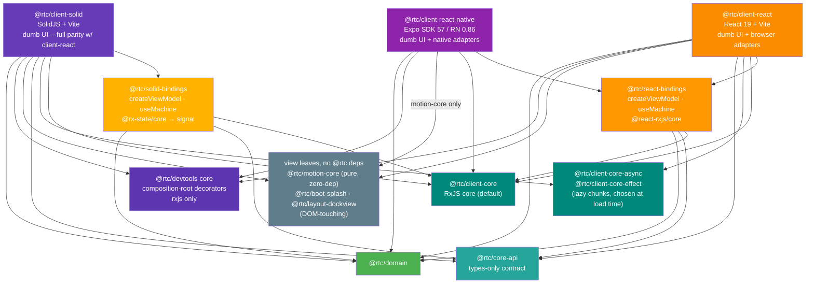
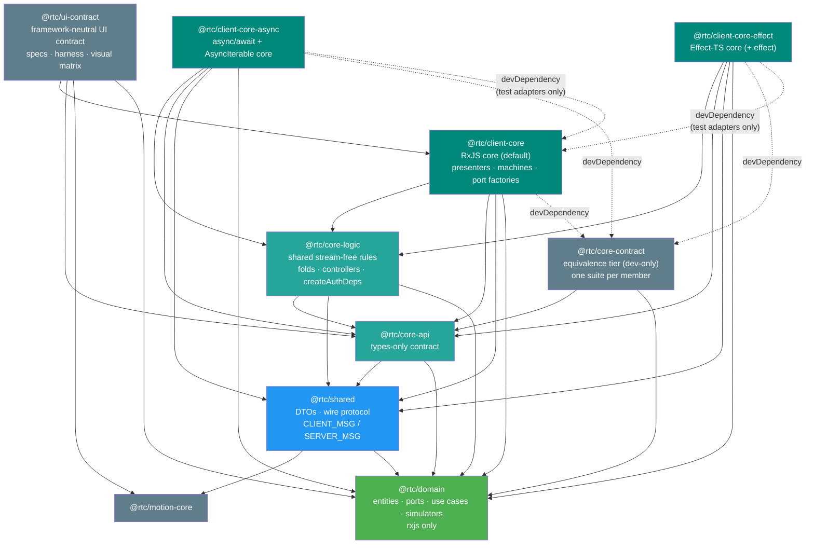
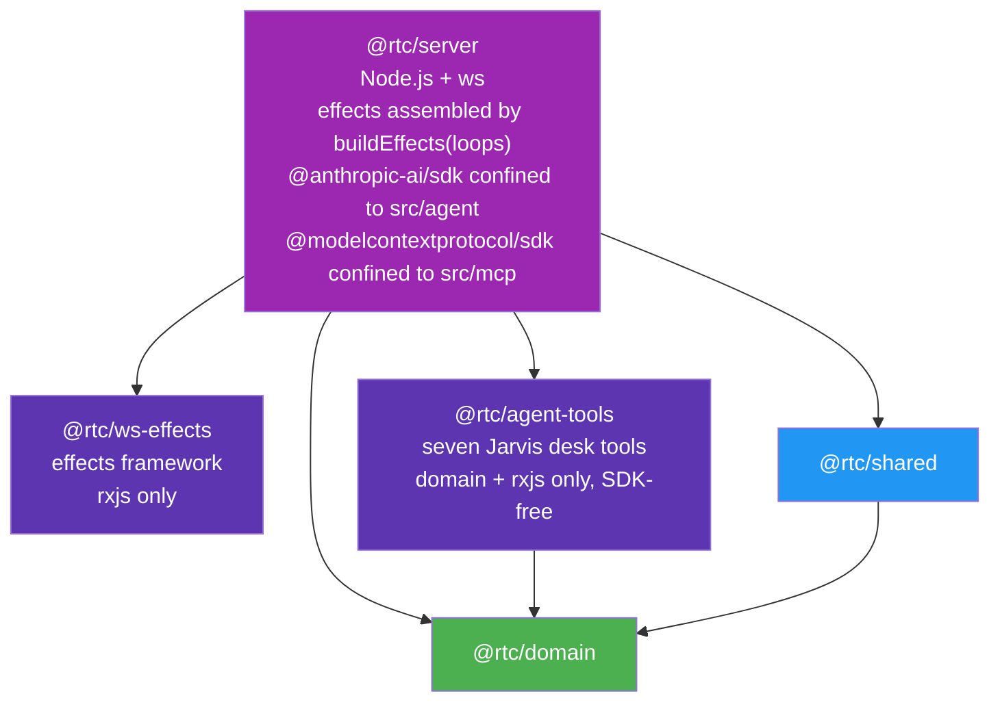
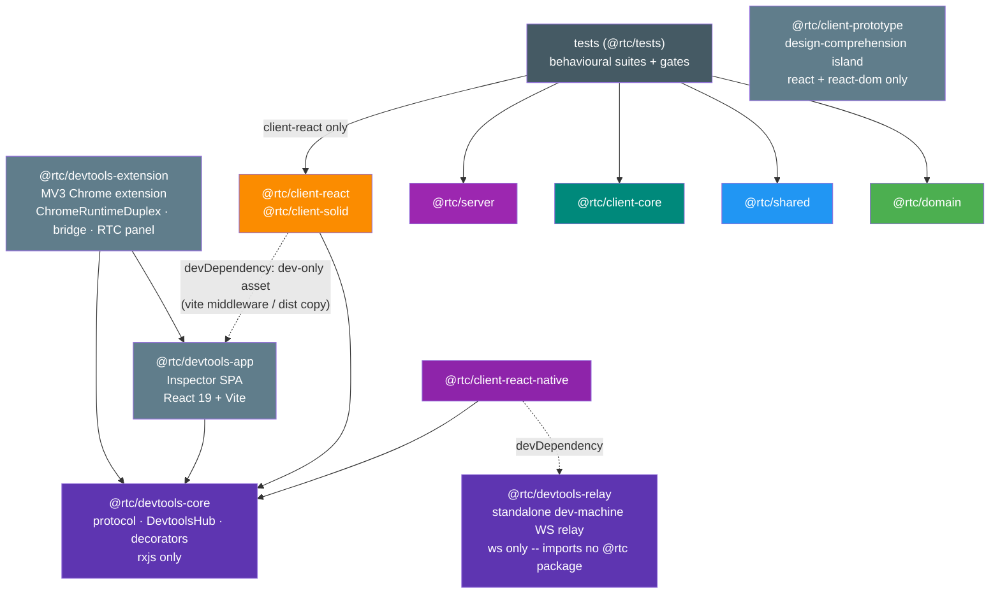

[◀ 5. State Diagrams](05-state-diagrams.md) · [Architecture Document](../architecture.md) · [7. Communication Patterns ▶](07-communication-patterns.md)

## 6. Package Dependencies

Twenty-five workspace packages plus the `tests` package. Every solid arrow is a real `dependencies` entry (verified against each `package.json`); a dashed arrow is a `devDependencies` entry, drawn only where it carries architectural meaning. Dependencies flow **inward only** (toward `domain`). One diagram of all 26 would be unreadable at column width, so the graph is drawn in four slices; a package that appears in two slices is the same node.

**Slice 1 -- the clients and what they import.** The core boxes (`client-core`, the two alternative cores, `core-api`) are expanded in slice 2.

```mermaid
graph TB
    webc["@rtc/client-react<br/>React 19 + Vite<br/>dumb UI + browser adapters"]
    solidc["@rtc/client-solid<br/>SolidJS + Vite<br/>dumb UI -- full parity w/ client-react"]
    rnc["@rtc/client-react-native<br/>Expo SDK 57 / RN 0.86<br/>dumb UI + native adapters"]

    rb["@rtc/react-bindings<br/>createViewModel · useMachine<br/>@react-rxjs/core"]
    sb["@rtc/solid-bindings<br/>createViewModel · useMachine<br/>@rx-state/core → signal"]

    core["@rtc/client-core<br/>RxJS core (default)"]
    alts["@rtc/client-core-async<br/>@rtc/client-core-effect<br/>(lazy chunks, chosen at load time)"]
    api["@rtc/core-api<br/>types-only contract"]

    leaves["view leaves, no @rtc deps<br/>@rtc/motion-core (pure, zero-dep)<br/>@rtc/boot-splash · @rtc/layout-dockview<br/>(DOM-touching)"]
    dtcore["@rtc/devtools-core<br/>composition-root decorators<br/>rxjs only"]
    domain["@rtc/domain"]

    webc --> rb
    webc --> core
    webc --> alts
    webc --> api
    webc --> leaves
    webc --> dtcore
    webc --> domain
    solidc --> sb
    solidc --> core
    solidc --> alts
    solidc --> api
    solidc --> leaves
    solidc --> dtcore
    solidc --> domain
    rnc --> rb
    rnc --> core
    rnc -->|"motion-core only"| leaves
    rnc --> dtcore
    rnc --> domain
    rb --> core
    rb --> api
    rb --> domain
    sb --> core
    sb --> api
    sb --> domain

    %% Invisible rank constraints -- keep each rank to four boxes (tall, not wide)
    rb ~~~ alts
    sb ~~~ leaves
    sb ~~~ dtcore
    core ~~~ api
    core ~~~ domain

    style webc fill:#FB8C00,color:#fff
    style solidc fill:#673AB7,color:#fff
    style rnc fill:#8E24AA,color:#fff
    style rb fill:#FF9800,color:#fff
    style sb fill:#FFB300,color:#fff
    style core fill:#00897B,color:#fff
    style alts fill:#00897B,color:#fff
    style api fill:#26A69A,color:#fff
    style leaves fill:#607D8B,color:#fff
    style dtcore fill:#5E35B1,color:#fff
    style domain fill:#4CAF50,color:#fff
```

**Slice 2 -- the application cores and the inner circles.** `@rtc/core-contract` (the behavioural equivalence tier) and `@rtc/ui-contract` (the UI test contract) are test-only: every core takes `core-contract` as a devDependency, both web clients take `ui-contract` as one, and each is imported only from test files (the per-core runner, e.g. `client-core/src/composition.coreContract.test.ts`, lives beside the source; `client-core-src-uses-core-contract-only-in-tests` / `alt-cores-use-core-contract-only-in-tests` keep it there).

```mermaid
graph TB
    core["@rtc/client-core<br/>RxJS core (default)<br/>presenters · machines · port factories"]
    acore["@rtc/client-core-async<br/>async/await + AsyncIterable core"]
    ecore["@rtc/client-core-effect<br/>Effect-TS core (+ effect)"]

    uic["@rtc/ui-contract<br/>framework-neutral UI contract<br/>specs · harness · visual matrix"]
    cc["@rtc/core-contract<br/>equivalence tier (dev-only)<br/>one suite per member"]
    logic["@rtc/core-logic<br/>shared stream-free rules<br/>folds · controllers · createAuthDeps"]

    api["@rtc/core-api<br/>types-only contract"]
    shared["@rtc/shared<br/>DTOs · wire protocol<br/>CLIENT_MSG / SERVER_MSG"]
    motion["@rtc/motion-core"]

    domain["@rtc/domain<br/>entities · ports · use cases · simulators<br/>rxjs only"]

    core --> logic
    core --> api
    core --> shared
    core --> domain
    acore --> logic
    acore --> api
    acore --> shared
    acore --> domain
    ecore --> logic
    ecore --> api
    ecore --> shared
    ecore --> domain
    uic --> core
    uic --> api
    uic --> motion
    uic --> domain
    cc --> api
    cc --> domain
    logic --> api
    logic --> shared
    logic --> domain
    api --> shared
    api --> domain
    shared --> motion
    shared --> domain
    core -. "devDependency" .-> cc
    acore -. "devDependency" .-> cc
    ecore -. "devDependency" .-> cc
    acore -. "devDependency<br/>(test adapters only)" .-> core
    ecore -. "devDependency<br/>(test adapters only)" .-> core

    style core fill:#00897B,color:#fff
    style acore fill:#00897B,color:#fff
    style ecore fill:#00897B,color:#fff
    style logic fill:#26A69A,color:#fff
    style api fill:#26A69A,color:#fff
    style cc fill:#607D8B,color:#fff
    style uic fill:#607D8B,color:#fff
    style shared fill:#2196F3,color:#fff
    style motion fill:#607D8B,color:#fff
    style domain fill:#4CAF50,color:#fff
```

**Slice 3 -- the server side.**

```mermaid
graph TB
    server["@rtc/server<br/>Node.js + ws<br/>effects assembled by buildEffects(loops)<br/>@anthropic-ai/sdk confined to src/agent<br/>@modelcontextprotocol/sdk confined to src/mcp"]
    wse["@rtc/ws-effects<br/>effects framework<br/>rxjs only"]
    agt["@rtc/agent-tools<br/>seven Jarvis desk tools<br/>domain + rxjs only, SDK-free"]
    shared["@rtc/shared"]
    domain["@rtc/domain"]

    server --> wse
    server --> agt
    server --> shared
    server --> domain
    agt --> domain
    shared --> domain

    style server fill:#9C27B0,color:#fff
    style wse fill:#5E35B1,color:#fff
    style agt fill:#5E35B1,color:#fff
    style shared fill:#2196F3,color:#fff
    style domain fill:#4CAF50,color:#fff
```

**Slice 4 -- devtools, the `tests` workspace, and the prototype island.**

```mermaid
graph TB
    tests["tests (@rtc/tests)<br/>behavioural suites + gates"]
    dtext["@rtc/devtools-extension<br/>MV3 Chrome extension<br/>ChromeRuntimeDuplex · bridge · RTC panel"]
    webclients["@rtc/client-react<br/>@rtc/client-solid"]
    rnc["@rtc/client-react-native"]

    dtapp["@rtc/devtools-app<br/>Inspector SPA<br/>React 19 + Vite"]
    dtrelay["@rtc/devtools-relay<br/>standalone dev-machine WS relay<br/>ws only -- imports no @rtc package"]
    server["@rtc/server"]
    core["@rtc/client-core"]

    dtcore["@rtc/devtools-core<br/>protocol · DevtoolsHub · decorators<br/>rxjs only"]
    shared["@rtc/shared"]
    domain["@rtc/domain"]
    proto["@rtc/client-prototype<br/>design-comprehension island<br/>react + react-dom only"]

    dtext --> dtapp
    dtext --> dtcore
    dtapp --> dtcore
    webclients --> dtcore
    webclients -. "devDependency: dev-only asset<br/>(vite middleware / dist copy)" .-> dtapp
    rnc --> dtcore
    rnc -. "devDependency" .-> dtrelay
    tests -->|"client-react only"| webclients
    tests --> core
    tests --> server
    tests --> shared
    tests --> domain

    style tests fill:#455A64,color:#fff
    style dtext fill:#607D8B,color:#fff
    style dtapp fill:#607D8B,color:#fff
    style dtrelay fill:#5E35B1,color:#fff
    style dtcore fill:#5E35B1,color:#fff
    style webclients fill:#FB8C00,color:#fff
    style rnc fill:#8E24AA,color:#fff
    style server fill:#9C27B0,color:#fff
    style core fill:#00897B,color:#fff
    style shared fill:#2196F3,color:#fff
    style domain fill:#4CAF50,color:#fff
    style proto fill:#607D8B,color:#fff
```

`tests` depends on `@rtc/client-react` only -- not `@rtc/client-solid`; the Solid e2e runs reach the Solid client through `RTC_CLIENT_PKG` instead ([§21](21-cross-framework-testing.md)).

**Dependency rules** (each machine-enforced):
- `@rtc/domain` has **`rxjs` as its single runtime dependency** -- the explicit architectural exception, used as the boundary stream type. No other runtime deps are permitted (pnpm strict mode). `@rtc/ws-effects` follows the same rxjs-only constraint.
- `@rtc/shared` depends on `domain`, `rxjs`, and, narrowly, `motion-core`: `src/jarvis/ScriptedJarvisEngine.ts` (the transport-neutral scripted Jarvis brain, shared by the sim-mode client adapter and the server's ScriptedAgentLoop) uses `speechChunks`/`SPEECH_CHUNK_INTERVAL_MS` typed-reveal chunk math to pace Jarvis replies -- the dependency-cruiser allowlist (`shared-no-apps`) was widened accordingly.
- `@rtc/client-core` depends on `core-api` + `core-logic` + `domain` + `shared` (+ `rxjs`, `@rx-state/core`) and on **no framework** -- no React, no DOM types, no React Native. `ScriptedJarvisAdapter` is now a thin subclass shim over `@rtc/shared`'s `ScriptedJarvisEngine`, so client-core no longer imports `motion-core` directly.
- **The application core is pluggable** ([§22](22-pluggable-application-core.md), ADR-006): `@rtc/core-api` (types only, grep gate 42) is the contract all three cores implement; `@rtc/core-logic` holds the rules they share that need no stream library (runtime deps `domain` + `shared` only -- `core-logic-stays-pure`, `core-logic-stays-inner`). `@rtc/client-core-async` and `@rtc/client-core-effect` compose from `core-logic`, `core-api`, `domain`, `shared` and their own members only: `rxjs` is a value import only inside each one's `bridge/` (`bridge-owns-rxjs`), and `@rtc/client-core` is a devDependency for test adapters, never a runtime import (`alt-cores-no-client-core-at-runtime`, since slice 8). Both web clients depend on all three and ship all three in one build -- each composition root a lazy chunk chosen at load time (`src/app/coreSelection.ts`; ADR-006 Decision 6, approach B since 2026-10-02; the RxJS root behind the `@rtc/client-core/core` subpath) -- with `pnpm check:core-bundle` asserting the eager/lazy split; React Native stays on the RxJS core.
- `@rtc/react-bindings` is the only package allowed to depend on both React and the core's streams.
- `client-react` depends on `client-core` (and the two alternative cores) + `core-api` + `react-bindings` + `domain`; `client-solid` depends on the same set with `solid-bindings` in place of `react-bindings`; `client-react-native` depends on `client-core` + `react-bindings` + `domain` only (plus the `motion-core` and `devtools-core` leaves). The bindings list `core-api` too, as a type-only import (e.g. `CoreSelection`, behind `useCoreSelection`). **Clients and server never import each other** (dependency-cruiser `client-not-server` / `server-not-client`).
- `@rtc/client-prototype` is an intentional island: `react`/`react-dom` only, no `@rtc/*` imports.
- `@rtc/motion-core` is a zero-runtime-dependency leaf (no `rxjs`, no DOM, no React) consumed directly by a client's animation shell -- `client-react` and `client-solid` each depend on it the same way (`client-solid → motion-core`), never through `react-bindings`/`solid-bindings`. `@rtc/shared` is also a direct consumer (`shared → motion`, above) -- narrowly, for the scripted Jarvis brain's speech-chunk pacing (`speechChunks`) -- so the "never through an inner-circle package" framing no longer holds; the framework-shell edges and the shared-package edge are both real, and dependency-cruiser's `shared-no-apps` rule allows the latter explicitly.
- `@rtc/boot-splash` is the framework-free boot/splash feature: the canvas draw engine (six 3D scene variants + shared laser/docking helpers), the reduced-motion/webdriver gate, and the two `*.module.css` stylesheets. It must not import any other `@rtc/*` package (dependency-cruiser `boot-splash-stays-pure`), but -- unlike `motion-core` -- it is a **DOM-touching** leaf, not a no-DOM one: the engine reaches the canvas 2D context and the gate reads `navigator`/`location` directly. Both web clients (`client-react`, `client-solid`) depend on it directly, each supplying its own thin `BootSequence`/`BootGate` shell.
- `@rtc/layout-dockview` is the framework-neutral Dockview wrapper behind the [`LayoutEngine` preference](../adr/ADR-002-layout-management-port.md) (`"inhouse" | "dockview"`, default dockview — an existing "inhouse" choice is kept). It must not import any other `@rtc/*` package (dependency-cruiser `layout-dockview-stays-pure`) -- like `boot-splash`, it is a DOM-touching leaf (`createDockEngine` mounts Dockview into a container element), not a no-DOM one like `motion-core`. Its one runtime dependency, `dockview@8.3.1`, is confined to this package by a second rule (`dockview-only-in-layout-dockview`) -- a direct client import of `dockview`/`dockview-core` would leak the engine's vocabulary and break the swap guarantee the ADR exists to buy. Both web clients (`client-react`, `client-solid`) depend on it directly, each supplying its own thin `DockviewLayoutEngine` bridge that portal-mounts the existing panel registries' content into Dockview's panels.
- `@rtc/ui-contract` is the framework-neutral UI test contract (shared harness + contract specs + visual scenario matrix, extracted from client-react's test tree). It depends on `client-core` + `domain` + `motion-core` (+ `rxjs`) and is framework-free -- the `motion-core` edge is the canvas chart spike's `drawChartScene` consuming the `ChartScene` type and `chartScene` function; clients consume `ui-contract` as a **devDependency** for their contract/visual suites -- it never appears in any `src/` import.
- `@rtc/agent-tools` is the framework-neutral **Jarvis desk-tool registry** (the seven tools an AI may call over the domain's ports, as JSON Schema + a `run(input): Promise<string>` handler). It depends on `@rtc/domain` (+ `rxjs`) and **nothing else** in the workspace -- not `shared`, not `client-core`, not a client, not `server` (dependency-cruiser `agent-tools-stays-inner`). It is deliberately **SDK-free**: no Anthropic SDK, no MCP SDK, no transport imports, so the same registry serves both transports and its tests call `run` straight against the domain simulators. Consumed by `server` only. See [§18.13](18-jarvis-ai-agent-surface.md#1813-phase-3-shipped--the-real-loop).
- **`@anthropic-ai/sdk` is a server-only runtime dependency**, confined to `packages/server/src/agent/`. Dependency-cruiser's `no-anthropic-sdk-in-inner-packages` pins it -- and does so as an **allowlist inversion** (`from: ^packages/, pathNot: ^packages/server/` → `to: node_modules/@anthropic-ai/`) rather than an enumerated blocklist of the inner packages that happened to exist when the rule was written. The first draft *was* a blocklist, and it silently left the browser clients uncovered, where an SDK import could ship a key-bearing code path into a bundle; the inversion means a package invented tomorrow is covered by default. Note that npm-package bans need their own rule shape: the workspace-path rules above are blind to `node_modules` edges.
- `@rtc/devtools-core` is an `rxjs`-only leaf, like `ws-effects` -- it decorates by structural shape and must not import any other `@rtc/*` package (dependency-cruiser `devtools-core-stays-pure`). `@rtc/devtools-app` (the inspector SPA) depends only on `devtools-core` + `react`/`react-dom` -- it understands the wire protocol, never `client-core`/`domain` (`devtools-app-protocol-only`). `client-react` has a real runtime edge to `devtools-core` (the composition-root decorators) plus a **dev-only asset edge** to `devtools-app` -- a `devDependency` used only to build-order and locate its `dist/` for the `/devtools/` Vite middleware/copy (see [§20](20-devtools.md)).
- `@rtc/devtools-extension` (the MV3 Chrome DevTools extension -- a third `Duplex` transport that attaches the inspector to any running app, including the deployed build) is itself a **leaf consumer** of the devtools pair: it may import only `devtools-core` (transport/protocol/store) and `devtools-app` (the `InspectorApp`), never a client/server/domain package (dependency-cruiser `devtools-extension-is-a-leaf`). It is the **only** workspace package that imports `devtools-app` as source (its own Vite build transpiles it); nothing else imports `devtools-app`, and nothing depends on `devtools-extension`.
- `@rtc/devtools-relay` is a standalone dev-machine WebSocket relay (bridging the browser inspector to the React Native client over `ws://localhost:8790`) that imports **no `@rtc/*` package at all** -- its only runtime dependency is `ws` (dependency-cruiser `devtools-relay-standalone`), so no solid arrow leaves it; the one dashed arrow into it is `client-react-native`'s devDependency. `WsRelayDuplex` (in `devtools-core`) is the RN/cross-machine transport that talks to it over the wire -- a runtime protocol pairing, not a package dependency, so it draws no edge here. `client-react-native` applies the same three composition-root decorators under `__DEV__` only to reach it.

**Build order** (Turborepo topological): `domain` | `ws-effects` | `motion-core` | `boot-splash` | `layout-dockview` | `devtools-core` | `devtools-relay` → `shared` | `agent-tools` → `core-api` → `core-logic` | `core-contract` → `client-core` | `client-core-async` | `client-core-effect` → `react-bindings` | `solid-bindings` | `ui-contract` | `devtools-app` → `client-react` | `client-react-native` | `client-solid` | `server` | `devtools-extension` (prototype builds independently).

> The inward-only rule is machine-enforced by **dependency-cruiser** as a blocking CI gate (`pnpm check:deps`): about forty named rules in `.dependency-cruiser.mts` (the file is the source of truth; `grep -c 'name:' .dependency-cruiser.mts` counts them), among them `no-circular`, `domain-stays-pure`, `shared-no-apps`, `client-not-server` / `server-not-client`, the per-leaf `*-stays-pure` rules, `no-anthropic-sdk-in-inner-packages` / `no-mcp-sdk-outside-server`, the core rules (`core-api-stays-inner`, `core-logic-stays-pure`, `core-contract-stays-neutral`, `client-core-framework-free`, `alt-cores-framework-free`, `alt-cores-no-client-core-at-runtime`, `bridge-owns-rxjs`, `effect-only-in-client-core-effect`, `effect-port-subscription-owned-by-the-bridge`) and the client rules (`clients-never-import-each-other`, `solid-stays-react-free`, `prototype-isolated`). See [dependency-cruiser.md](../dependency-cruiser.md) for the rule-by-rule breakdown.

> **History**: the Application Layer originally lived inside `@rtc/client-react` (the doc's earlier revisions called this out as a possible future extraction). The React Native workstream forced the question, and the extraction happened: `@rtc/client-core` + `@rtc/react-bindings` are that promotion, executed without breaking UI consumers -- exactly because components only ever imported the hook bridge.

---

