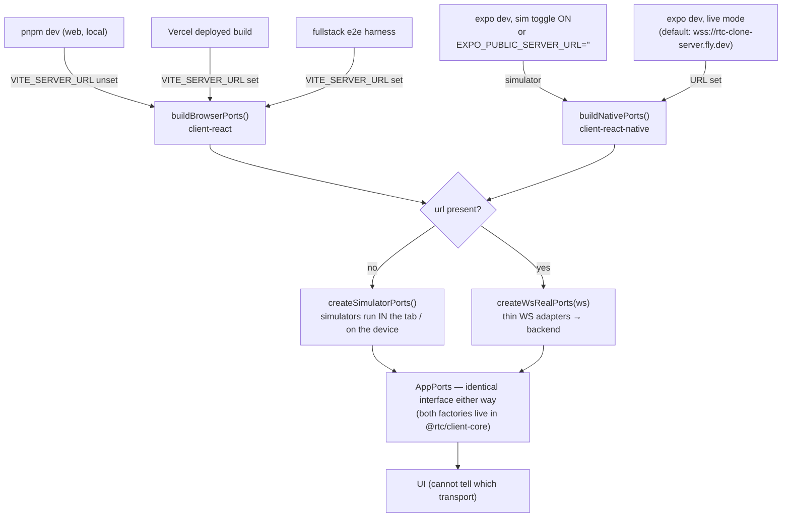
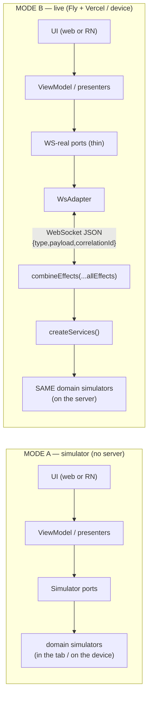
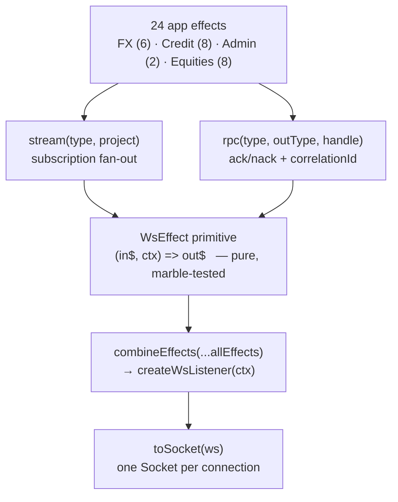
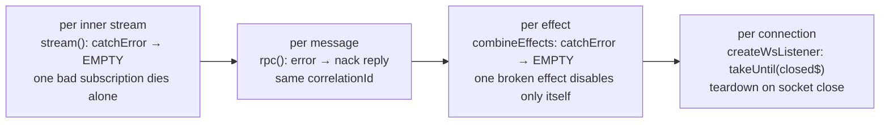
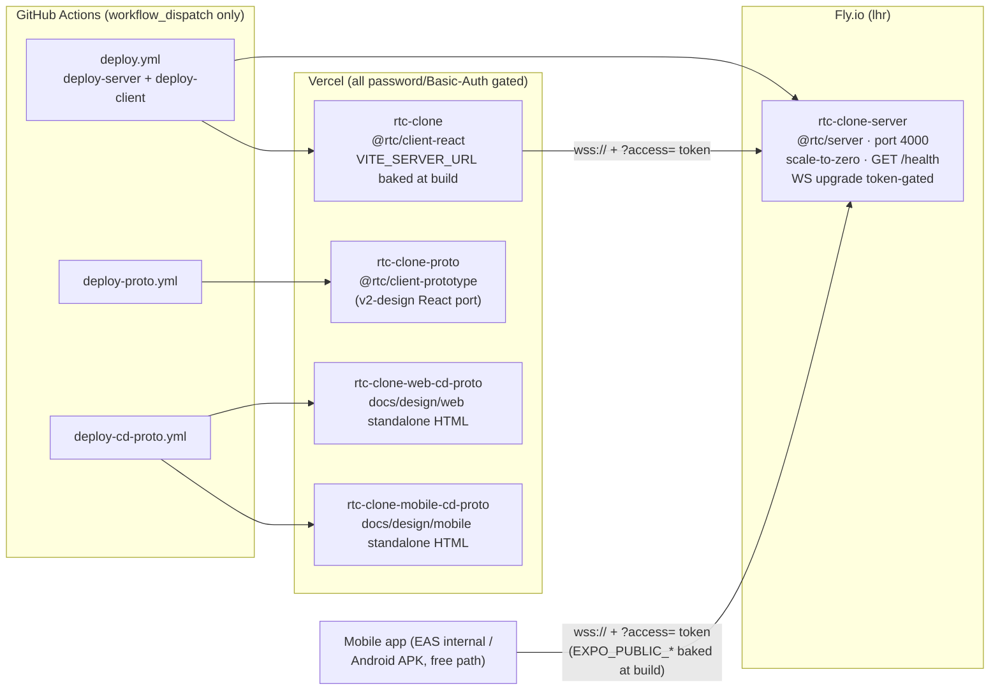

[◀ 6. Package Dependencies](06-package-dependencies.md) · [Architecture Document](../architecture.md) · [8. Replaceability Matrix ▶](08-replaceability-matrix.md)

## 7. Communication Patterns

### WebSocket Message Format

```typescript
interface WsMessage {
  type: string;            // Message type identifier
  payload?: unknown;       // Data payload
  correlationId?: string;  // For RPC request-response matching
}
```

### Three Communication Styles

#### 1. Subscriptions (Fire & Forget)

Client subscribes; server streams continuously until connection closes.

```
Client -> Server:  { type: "subscribe.pricing", payload: { symbol: "EURUSD" } }
Server -> Client:  { type: "stream.priceTick", payload: PriceTickDto }  (repeated)
```

#### 2. RPC (Request-Response with Correlation ID)

```
Client -> Server:  { type: "rpc.executeTrade", payload: dto, correlationId: "42" }
Server -> Client:  { type: "rpc.executeTrade.response", payload: { type: "ack", payload: TradeDto }, correlationId: "42" }
```

#### 3. State-of-the-World (SoW)

Ensures clients have a consistent view after (re)connection.

**Bulk SoW** (blotter, reference data, analytics):
```typescript
{ updates: [...], isStateOfTheWorld: true, isStale: false }   // initial snapshot
{ updates: [...newItems], isStateOfTheWorld: false, isStale: false }  // subsequent deltas
```

**Marker-based SoW** (instruments, dealers, workflow):
```typescript
{ type: "startOfStateOfTheWorld" }
{ type: "added", payload: InstrumentDto }   // repeated per item
{ type: "endOfStateOfTheWorld" }
{ type: "added", payload: NewInstrumentDto }  // live updates after marker
```

### Observable Pipeline

RxJS `Observable<T>` is the universal streaming abstraction across the boundary -- streams *and* one-shot ops. Simulators on the server emit Observables directly; the ws-effects layer projects them onto the wire; client WS adapters wrap incoming WS messages as Observables. The presenter layer applies UI-shaping operators; the bindings package turns the resulting stream into a hook. **The whole path, server to pixel, is one composed Observable pipeline.**

```
Domain Port (interface)     ->  Observable<PriceTick>
  |
Simulator (server)          ->  defer(...) + new Observable / interval / Subject
  |
ws-effects stream()         ->  matchType(SUBSCRIBE_PRICING) -> mergeMap(project) -> out frames
  |
Client WS Adapter           ->  new Observable<T>(sub => ws.onmessage handler)   [@rtc/client-core]
  |
Use Case                    ->  enriches Observable<PriceTick> -> Observable<Price>   [@rtc/domain]
                                 (defer + closure for per-subscription state)
  |
Presenter                   ->  pipe(share/shareReplay/combineLatest) -> price$   [@rtc/client-core]
  |
ViewModel hook              ->  bind(price$) -> usePrice(symbol)   [@rtc/react-bindings]
  |
UI component                ->  const { usePrice } = useViewModel(); render   [client-react / client-react-native]
```

### Runtime Topology: What Runs When

The single most confusing thing about this system if you only read the code is: **where does the ticking data actually come from when you run the app?** The answer is *"it depends on one environment variable per client"* — and every answer is correct, because the same simulators are hosted in different places behind the same port interfaces.

**One switch per client decides everything.** Each composition root reads its platform's env var and builds the full `AppPorts` either way:



| How it is run | Switch | Where prices / blotter / charts come from |
|---|---|---|
| **`pnpm dev` locally** (web, default) | `VITE_SERVER_URL` unset | **No backend at all.** The simulators run *inside the browser tab*. The `@rtc/server` package is not even started. |
| **Deployed site** (Vercel client → Fly server) | `VITE_SERVER_URL` set (baked at build) | **Backend over WebSocket** — all four domains: FX + Credit + Admin + Equities. |
| **Fullstack e2e** (`tests/fullstack/`) | `VITE_SERVER_URL` set (harness spins up a real server) | Backend over WebSocket — this is the path that actually exercises `@rtc/server`. |
| **Mobile app, live mode** (default) | `EXPO_PUBLIC_SERVER_URL` (defaults to the Fly URL) | Backend over WebSocket, session-token-authenticated (`?access=` from a `/login` token, obtained by signing in through the login screen against the real server's `AUTH_USERS`). |
| **Mobile app, simulator mode** | `EXPO_PUBLIC_SERVER_URL=""` or the in-app sim toggle | Simulators run **on the device**; toggling re-mounts `AppRoot` under a new React `key`. |

**All modes share one simulator set.** This is the clean-architecture payoff: the UI depends only on port interfaces, never on a transport, so each composition root can fulfil those ports either way.



A few ports are **always local**, even in Mode B: the telemetry family (`telemetry`, `serviceHealth`, `eventLog`, `sessions`) has no wire RPC, so `createWsRealPorts` instantiates those simulators in-process regardless of transport — mirroring how `preferences` is handled (injected per platform: localStorage on web, AsyncStorage on mobile). Note the deliberate split: the `admin` throughput port **is** WS-backed (`GET/SET_THROUGHPUT` RPC), while telemetry *sampling* uses its own local `ThroughputSimulator`. Everything else in Mode B is served over the wire.

> The per-tick sequence (subscribe → stream, and RPC with correlation) is the same in both modes — see [§4.1 FX Price Streaming](04-sequence-diagrams.md#41-fx-price-streaming) and [§4.2 FX Trade Execution](04-sequence-diagrams.md#42-fx-trade-execution-rpc), whose `alt` branches already show the mock-vs-real split.

### Animated: The Life of a Price Tick

The same story as an animation (committed SVG — GitHub plays SMIL animations in markdown-embedded images, so this renders as a small looping film right here; open the raw file if your viewer shows it static):



Watch for the two dots: the amber one (Mode B) crosses the WebSocket wire; the green one (Mode A) goes straight from the in-process simulator to the port. From `PricingPort` onward there is only one blue path — that single path is why the UI, the behavioural tests, and the presenters can never tell the modes apart.

### The Declarative Effects Server (`@rtc/ws-effects`)

The server's dispatch used to be an imperative `switch` in `wsHandler.ts`. That file is gone. Dispatch is now a small, declarative, RxJS-native **effects micro-framework** in its own package, `@rtc/ws-effects` (~220 LOC of production source, `rxjs` only, zero domain knowledge), with `@rtc/server` a thin app of 24 effects on top — each a stream transform `(in$, ctx) => out$`.

This realises the "any framework should be replaceable by changing only its package" principle from [§1.2](01-overview.md#12-architectural-principles): the transport-dispatch framework is a genuine, swappable package with the app on top of it.



**Error isolation is layered** — a design goal, not an accident:



The wire protocol survived the rewrite unchanged (same `{ type, payload, correlationId }` envelope and message names); the duplicated protocol constants were consolidated into `@rtc/shared` (`packages/shared/src/protocol/messages.ts` — the single `CLIENT_MSG`/`SERVER_MSG` source of truth for both ends). Full design: [`docs/superpowers/specs/2026-07-02-ws-effects-declarative-server-design.md`](../superpowers/specs/2026-07-02-ws-effects-declarative-server-design.md).

> **Historical note.** `@rtc/server` was originally scaffolded with `@marblejs/*` + `fp-ts` dependencies (hence old "Marble.js" mentions), but they were **never imported** and were removed by the knip dead-code gate. `@rtc/ws-effects` is a from-scratch homage to the marblejs *pattern* — declarative RxJS effects — without the unmaintained dependency and its transitive vulnerable `ws`.

### Equities Over the Wire (gap closed)

Earlier revisions of this document described an **equities coverage gap**: the panels were built simulator-first and the old `wsHandler` served FX + Credit + Admin only, so equities data silently vanished in Mode B. The ws-effects rewrite closed that gap — `createServices()` now instantiates the equities trio (`EquityMarketDataSimulator`, `EquityOrderSimulator`, `EquityPositionSimulator`) and eight equities effects serve the full surface:

| Concern | Wire messages | Client consumer (in `@rtc/client-core`) |
|---|---|---|
| Watchlist | `SUBSCRIBE_WATCHLIST` → `WATCHLIST` | `createMarketDataPort(ws).watchlist()` |
| Quotes | `SUBSCRIBE_EQ_QUOTES` → `EQ_QUOTE` | `createMarketDataPort(ws).quotes()` |
| Candles | rpc `GET_CANDLES` → `CANDLES_RESPONSE` | `createMarketDataPort(ws).candles()` |
| Depth ladder | `SUBSCRIBE_DEPTH` → `DEPTH` | `createMarketDataPort(ws).depth()` |
| Orders blotter | `SUBSCRIBE_ORDERS` → `ORDERS` | `createOrderPort(ws).orders()` |
| Place order | rpc `PLACE_ORDER` → ack **+** `ORDER_LIFECYCLE` stream | `createOrderPort(ws).place()` ([§4.4](04-sequence-diagrams.md#44-equities-order-lifecycle)) |
| Cancel order | rpc `CANCEL_ORDER` → `CANCEL_ORDER_RESPONSE` | `createOrderPort(ws).cancel()` |
| Positions | `SUBSCRIBE_POSITIONS` → `POSITIONS` | `createPositionPort(ws).positions()` |

| Feature | Mode A (local sim) | Mode B (deployed WS) |
|---|---|---|
| FX pricing / blotter / analytics | ✅ | ✅ |
| Credit RFQ | ✅ | ✅ |
| Admin throughput | ✅ | ✅ |
| Telemetry / incidents | ✅ | ✅ *(always in-process by design)* |
| Equities (watchlist, charts, depth, orders, positions) | ✅ | ✅ |

One deliberate asymmetry remains: equities frames carry **domain types directly** (no DTO layer in `@rtc/shared/src/` for equities yet, unlike `fx/` and `credit/`). The types are still shared via `@rtc/domain`, so both ends agree — but there is no wire-format indirection to version against. An acceptable IOU, called out here so it isn't mistaken for a rule.

### Deployment Topology

All deploys are **manual** (`workflow_dispatch`) — merging to `main` runs CI but deploys nothing.



The client build bakes a stable Fly URL at build time, so the server and client deploy jobs are independent. The two prototype deploys serve the design-fidelity workstream, not production.

---

