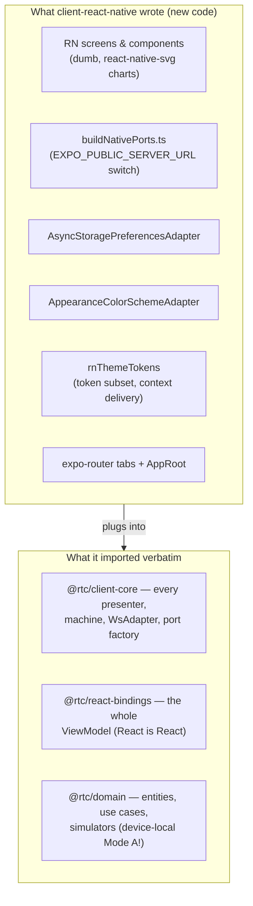

## 8. Replaceability Matrix

This is the load-bearing section: the architecture's value comes from the cost-of-change for each technology being bounded and well-understood.

| Component | Currently | Cost to replace | Contract that must hold | Tests that verify |
|---|---|---|---|---|
| **UI framework** | React 19 (web) / React Native (mobile) | ~1 dev-week (rewrite one UI package) — **empirically calibrated by the RN client**, which reused core + bindings verbatim | `ViewModel` hook signatures and intent callbacks. No business logic in components. | Behavioural specs (Gherkin) + visual goldens + UI contract suite, all unchanged |
| **State streams ↔ UI bridge** | `@rtc/react-bindings` (react-rxjs) | ~1 dev-day (write `@rtc/solid-bindings` etc.) | `Observable<T>`/`StateObservable<T>` -> framework-native reactive primitive; same `ViewModel` member list | UI contract tests, unchanged |
| **State streams** | RxJS + `@rx-state/core` | High -- swap touches ports, simulators, use cases, presenters, machines together | Boundary stream type matches across all layers | Use-case tests + port contract tests + presenter-direct e2e peers |
| **Use cases** | Vanilla TS + RxJS | N/A (this is the domain) | -- | Unit tests over use cases with simulator ports |
| **Boundary stream type** | RxJS `Observable<T>` | Very high (this is the spine) | -- | -- |
| **Port adapters (transport)** | WebSocket-backed factories in `client-core` | ~1 dev-week per adapter family | Implements port interface | Contract tests parameterised over adapter (simulator + WsReal) |
| **Server dispatch framework** | `@rtc/ws-effects` | ~1 dev-week (it is one package; effects are pure stream transforms) | `WsEffect = (in$, ctx) => out$`; wire protocol in `@rtc/shared` | Marble tests + fullstack smokes |
| **Server host** | Node.js + `ws` | ~2 dev-days (`toSocket` is the only ws-coupled file) | `Socket` interface (`messages$`, `send`, `closed$`) | Fullstack smokes |
| **Wire format** | JSON over WS | High (both ends change together) | DTOs + `CLIENT_MSG`/`SERVER_MSG` in `@rtc/shared` | DTO round-trip tests + wire-frame fixtures + e2e |
| **Build tooling** | Vite (web) · Metro/Expo (mobile) | ~1 dev-day | Bundles the client package, serves dev | -- |
| **Unit test runner** | Vitest (+ jest-expo for RN components) | ~1 dev-day | Same test files runnable | The tests themselves (proven: the presenter suite runs under cucumber-js *and* vitest) |
| **E2E driver** | Playwright (CI) + Cypress (local) | ~3 dev-days per new driver | Page Object interfaces unchanged; only implementations are added | Behavioural specs (Gherkin) drive all drivers via one shared step tree |
| **Behavioural spec language** | Gherkin | High (rewrite specs) | -- | -- |
| **Build orchestration** | pnpm + Turborepo | ~1 dev-day | Build graph: domain -> shared/ws-effects -> core -> bindings -> clients/server | -- |

**How this is achieved**: every "Cost" above assumes the rest of the system stays put. That is only true because (a) inner layers never import outer-layer types, (b) ports are dependency-inverted, and (c) behavioural tests are written against behaviour, not implementation.

### 8.1 The Multi-Client Proof & the SolidJS Plan

The replaceability matrix used to be a theory. The React Native client turned it into a measurement: **adding an entire second platform required zero changes to `@rtc/domain`, `@rtc/shared`, `@rtc/client-core`, or `@rtc/react-bindings`** — only a new UI package with two platform adapters. The animation below cycles through the three clients; note what never moves.

**Why the RN client was cheap** — the checklist of what it actually had to build:

**The SolidJS plan** (`@rtc/client-solid`, not yet started) follows the same recipe with one extra step — since Solid is *not* React, it needs its own bindings package:

1. **`@rtc/solid-bindings`** (~1 dev-day): map `StateObservable` → Solid signal. `@rx-state/core` (already framework-neutral, already in `client-core`) is the same primitive react-rxjs's `bind()` consumes, so this is the `solid-rxjs` analogue the design always assumed. Implement the same `ViewModel` member list; `useMachine` becomes a `createMachine`-style per-component primitive with `onCleanup` instead of a StrictMode-deferred dispose.
2. **`@rtc/client-solid`** (~1 dev-week): rewrite the dumb components. CSS Modules port verbatim — the CSS-modules migration deliberately left zero inline styles and semantic `data-*` state hooks precisely so markup/styling survives the swap.
3. **Verification, all pre-existing**: the framework-neutral UI-contract specs (`*.contract.spec.ts` + a new `solid/` swap-trio next to `react/`), the visual goldens (`__screenshots__/react/` is the canonical cross-framework contract — a Solid render must match it), and the Gherkin behavioural suites (page objects get a Solid implementation; specs unchanged).

What ADR-004 forbids exists **for** this plan: no JSX through the ViewModel, no framework types below the bindings, no `rxjs` in UI files. Every one of those bans is a gate (26--29) so the Solid port cannot be quietly invalidated between now and whenever it starts.

---

