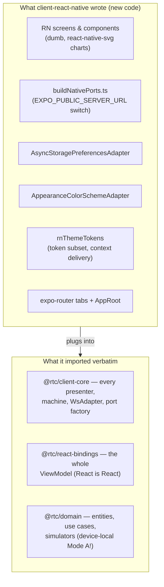

[◀ 7. Communication Patterns](07-communication-patterns.md) · [Architecture Document](../architecture.md) · [9. Test Strategy ▶](09-test-strategy.md)

## 8. Replaceability Matrix

This is the load-bearing section: the architecture's value comes from the cost-of-change for each technology being bounded and well-understood.

Columns folded to three so the table stays readable at GitHub's narrow column width (`Currently` is merged into the component name; `Contract that must hold` and `Tests that verify` share one cell under *Verified:*).

| Component (current) | Cost to replace | Contract & verification |
|---|---|---|
| **UI framework** React 19 (web) / React Native (mobile) | ~1 dev-week (rewrite one UI package) — **empirically calibrated by the RN client**, which reused core + bindings verbatim | `ViewModel` hook signatures and intent callbacks. No business logic in components. *Verified:* Behavioural specs (Gherkin) + visual goldens + UI contract suite, all unchanged |
| **State streams ↔ UI bridge** `@rtc/react-bindings` (react-rxjs) | ~1 dev-day (write `@rtc/solid-bindings` etc.) | `Observable<T>`/`StateObservable<T>` -> framework-native reactive primitive; same `ViewModel` member list. *Verified:* UI contract tests, unchanged |
| **State streams** RxJS + `@rx-state/core` | High -- swap touches ports, simulators, use cases, presenters, machines together | Boundary stream type matches across all layers. *Verified:* Use-case tests + port contract tests + presenter-direct e2e peers |
| **Use cases** Vanilla TS + RxJS | N/A (this is the domain) | *Verified:* Unit tests over use cases with simulator ports |
| **Boundary stream type** RxJS `Observable<T>` | Very high (this is the spine) | -- |
| **Port adapters (transport)** WebSocket-backed factories in `client-core` | ~1 dev-week per adapter family | Implements port interface. *Verified:* Contract tests parameterised over adapter (simulator + WsReal) |
| **Server dispatch framework** `@rtc/ws-effects` | ~1 dev-week (it is one package; effects are pure stream transforms) | `WsEffect = (in$, ctx) => out$`; wire protocol in `@rtc/shared`. *Verified:* Marble tests + fullstack smokes |
| **View-layer motion math** `@rtc/motion-core` | ~1 dev-day per consumer (pure functions; no framework/DOM coupling to unwind) | `flipDeltas`/`coalesceOrder`/`computeRankDirections`/`sameOrder` signatures + easing/duration constants. *Verified:* Unit tests in `packages/motion-core` (`flip.test.ts`, `rankGlide.test.ts`) |
| **Server host** Node.js + `ws` | ~2 dev-days (`toSocket` is the only ws-coupled file) | `Socket` interface (`messages$`, `send`, `closed$`). *Verified:* Fullstack smokes |
| **Wire format** JSON over WS | High (both ends change together) | DTOs + `CLIENT_MSG`/`SERVER_MSG` in `@rtc/shared`. *Verified:* DTO round-trip tests + wire-frame fixtures + e2e |
| **Build tooling** Vite (web) · Metro/Expo (mobile) | ~1 dev-day | Bundles the client package, serves dev |
| **Unit test runner** Vitest (+ jest-expo for RN components) | ~1 dev-day | Same test files runnable. *Verified:* The tests themselves (proven: the presenter suite runs under cucumber-js *and* vitest) |
| **E2E driver** Playwright (CI) + Cypress (local) | ~3 dev-days per new driver | Page Object interfaces unchanged; only implementations are added. *Verified:* Behavioural specs (Gherkin) drive all drivers via one shared step tree |
| **Behavioural spec language** Gherkin | High (rewrite specs) | -- |
| **Build orchestration** pnpm + Turborepo | ~1 dev-day | Build graph: domain -> shared/ws-effects/motion-core -> core -> bindings -> clients/server |

**How this is achieved**: every "Cost" above assumes the rest of the system stays put. That is only true because (a) inner layers never import outer-layer types, (b) ports are dependency-inverted, and (c) behavioural tests are written against behaviour, not implementation.

### 8.1 The Multi-Client Proof & the SolidJS Plan

The replaceability matrix used to be a theory. The React Native client turned it into a measurement: **adding an entire second platform required zero changes to `@rtc/domain`, `@rtc/shared`, `@rtc/client-core`, or `@rtc/react-bindings`** — only a new UI package with two platform adapters. The animation below cycles through the three clients; note what never moves.

**Why the RN client was cheap** — the checklist of what it actually had to build:

**The SolidJS plan** (`@rtc/client-solid`, not yet started) follows the same recipe with one extra step — since Solid is *not* React, it needs its own bindings package:

1. **`@rtc/solid-bindings`** (~1 dev-day): map `StateObservable` → Solid signal. `@rx-state/core` (already framework-neutral, already in `client-core`) is the same primitive react-rxjs's `bind()` consumes, so this is the `solid-rxjs` analogue the design always assumed. Implement the same `ViewModel` member list; `useMachine` becomes a `createMachine`-style per-component primitive with `onCleanup` instead of a StrictMode-deferred dispose.
2. **`@rtc/client-solid`** (~1 dev-week): rewrite the dumb components. CSS Modules port verbatim — the CSS-modules migration deliberately left zero inline styles and semantic `data-*` state hooks precisely so markup/styling survives the swap.
3. **Verification, all pre-existing**: the framework-neutral UI-contract specs (`*.contract.spec.ts` + a new `solid/` swap-trio next to `react/`), the visual goldens (`__screenshots__/react/` is the canonical cross-framework contract — a Solid render must match it), and the Gherkin behavioural suites (page objects get a Solid implementation; specs unchanged).

What ADR-004 forbids exists **for** this plan: no JSX through the ViewModel, no framework types below the bindings, no `rxjs` in UI files. Every one of those bans is a gate (26--29) so the Solid port cannot be quietly invalidated between now and whenever it starts.

### 8.2 The Custom-Hook Surface

The "~1 dev-week to swap the UI framework" figure in the matrix above rests on a claim worth making explicit and measurable, because it is where a React codebase most often leaks framework lock-in. **A React hook is a React-only primitive** — `useState`, `useEffect`, `useLayoutEffect`, the rules-of-hooks call ordering — with no equivalent concept in Solid, Svelte, or Vue (Solid runs its logic once and tracks signals; there is no re-render, no dependency array, no hook ordering). So *every genuine custom hook is React-specific code a framework swap must re-author*. The swap is bounded only if that surface is deliberately kept small. It is.

A component in this app calls two kinds of `useX`, and only one of them is React-specific work:

- **ViewModel-provided hooks** — `useLayout`, `useOrderTicket`, `useBootSequence`, `useSession`, `useBootGate`, `useMetrics`, and their siblings all arrive through `useViewModel()` from `@rtc/react-bindings`. Each is a *thin binding* over a framework-free RxJS machine or presenter in `@rtc/client-core` (e.g. `useLayout` is one line: `useMachine(() => machines.layout(tab))`). The behaviour lives outside React entirely, so the Solid port re-implements only the ~1-line binding once in `@rtc/solid-bindings` (§8.1 step 1) — never the logic. These do not count against the swap budget.
- **Standalone UI hooks** — hooks actually *defined* inside `@rtc/client-react/src/ui`. This is the whole React-specific surface a Solid port must re-author, and the entire set is **seven**:

| Hook | Lines | Kind | What a Solid port re-writes |
|---|---:|---|---|
| `useFxView` | 17 | Context reader | Trivial — reads a tab-scoped context seam (Solid `useContext` equivalent) |
| `useCreditView` | 20 | Context reader | Trivial — same |
| `useTheme` | 13 | Context reader | Trivial — same |
| `useTickFlash` | 43 | Pure derived state | Low — a value derived from current vs previous input; the pure logic ports verbatim |
| `useNewestOrderId` | 62 | Pure derived state | Low — an id-set diff; the pure `newestUnseenId` helper ports verbatim |
| `useFlipGrid` | 301 | DOM-imperative animation | Average — a thin WAAPI/`ResizeObserver` shell; its FLIP math already lives in `@rtc/motion-core` |
| `useRankGlide` | 244 | DOM-imperative animation | Average — same shape; `coalesceOrder`/`computeRankDirections` already live in `@rtc/motion-core` |

Read the table by kind, not by line count. **Three of the seven are thin context readers** — no logic at all, just a `useContext` call plus a provider-presence guard. **Two more are small pure-derived-state helpers** (`useTickFlash`, `useNewestOrderId`) whose actual computation is framework-agnostic and moves to Solid untouched. That leaves **only two hooks of genuine complexity** — the FLIP animation pair — and even their line counts overstate the port cost: those are mostly DOM plumbing and doc comments, because the *algorithms* (`flipDeltas`, `coalesceOrder`, `computeRankDirections`, `sameOrder`) were extracted into the framework-free `@rtc/motion-core` package precisely so both clients share one implementation ([ADR-005](../adr/ADR-005-ui-logic-placement.md)). What a Solid port rewrites for those two is a thin imperative shell over identical shared functions, not the motion logic itself.

So the React-specific hook surface a framework swap confronts is: three trivial readers, two small pure helpers, and two thin animation shells over shared math. That deliberately-tiny surface — not optimism — is why the React Native client reused `client-core` and `react-bindings` verbatim, and why the "UI framework — ~1 dev-week" row is a measurement rather than a hope.

---

