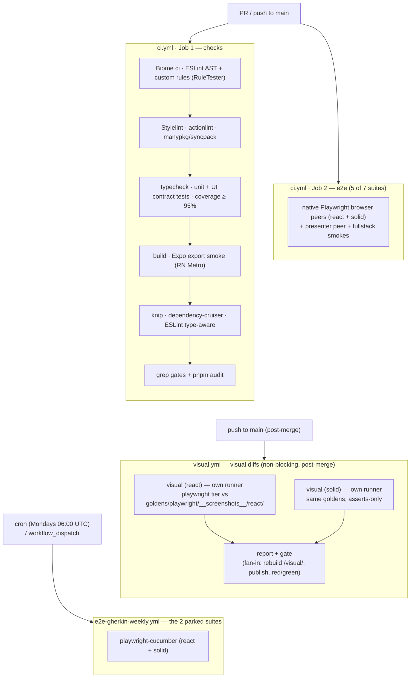

[◀ 8. Replaceability Matrix](08-replaceability-matrix.md) · [Architecture Document](../architecture.md) · [10. Key Design Decisions ▶](10-key-design-decisions.md)

## 9. Test Strategy

Tests are layered the same way the system is. Each layer has its own kind of test, and **no test is allowed to import a tool from a layer it isn't testing**.

```
Behavioural Specs (Gherkin)             - WHAT the system does
  |
Step Definitions / Page Objects         - HOW to drive the system today
  |
Test Runner / Driver                    - Vitest, Playwright, ...
```

### 9.1 Layers

| Test layer | Tests | Tooling-coupled? | Survives technology swap? |
|---|---|---|---|
| **Behavioural specs** (Gherkin `.feature` files) | End-user behaviour, scenario style | No -- pure spec | Yes |
| **Step definitions** | Map Gherkin steps to actions | Yes -- import the driver | Rewritten when driver changes |
| **Page Objects** | Encapsulate selectors, waits, intent emission | Yes -- import the driver | Rewritten when UI framework or driver changes |
| **Use-case tests** | Use case behaviour with stubbed ports | Test framework only | Yes (tests import vanilla TS) |
| **Port contract tests** | Same suite run against simulator and WsReal adapters | Test framework only | Yes |
| **Domain entity tests** | Pure functions over entities | Test framework only | Yes |
| **Component tests** (optional) | Render component, assert hook contract is honoured | UI framework + test framework | Rewritten when UI framework changes |
| **UI contract tests** (sociable RTL, [§9.8](#98-ui-contract-tier)) | Mount real components against a scripted `ViewModel`; assert behaviour | Framework-neutral specs + a thin per-framework swap layer | Specs survive; only the `react/` adapter directory is rewritten |
| **Visual goldens** (CI-asserted `playwright` tier, [§9.7](#97-visual-golden-tiers)) | Pixel screenshots of workspaces × skins × modes | Screenshot runners | Goldens survive — they **are** the cross-framework rendering contract |
| **RN component tests** (jest-expo + RNTL, [§9.9](#99-react-native-testing)) | Render RN screens against the ViewModel | jest-expo | Rewritten with the mobile UI |

### 9.2 Gherkin example

```gherkin
Feature: FX price streaming
  As a trader
  I want to see live bid/ask prices
  So that I can decide when to trade

  Scenario: a price tile shows the latest mid price
    Given the trader has the FX workspace open
    When the pricing service emits a tick for "EURUSD" with bid 1.1000 and ask 1.1002
    Then the EURUSD tile shows bid "1.1000" and ask "1.1002"
    And the spread is rendered as "2.0" pips
```

The same `.feature` file is consumed by:
- **client-side e2e step defs** (Playwright) -- drives a real browser, asserts DOM.
- **application-layer step defs** -- drives presenters directly, asserts hook output, no browser. Fast.

If a browser driver is replaced, only the page-object implementations for that driver change. Replacing React with SolidJS rewrites the page objects but not the specs.

### 9.3 Linking specs to existing project specs

The codebase already contains specs (separate from tests) that describe expected behaviour. The intent is to **converge** on Gherkin: existing specs become the seed for `.feature` files, and the `.feature` files become the single source of truth that all test layers reference. Where today's specs are prose, they will be incrementally rewritten in Given/When/Then form.

### 9.4 Port contract tests

A single test suite is parameterised over **all** adapters that implement a port. The same scenarios run against:
- the in-process simulator,
- the WsReal adapter (against a stub WebSocket server),
- any future adapter (e.g. a different transport).

This is what makes "swap an adapter" a low-cost operation: the contract is encoded in tests and they all must pass.

### 9.5 Seven-suite e2e stack (4 browser peers + 1 presenter peer + 2 fullstack smokes)

`tests/scripts/run-all.ts` orchestrates **seven suites**: five behavioural peers exercising the same spec surface via two binding styles, plus two full-stack smokes (`tests/fullstack/`) that boot a real `@rtc/server` and a real client and assert live WS data end-to-end — the only suites that exercise the server process itself. The five peers: Cucumber-JS (with Playwright) binds Gherkin scenarios in `tests/specs/**/*.feature` to a shared step-definition tree; native `@playwright/test` binds scenarios programmatically through its own step tree. Both peers are additionally duplicated against `@rtc/client-solid` (via `RTC_CLIENT_PKG`, ports 3003/3004), bringing the browser family to four peers. One presenter-direct peer, **vitest-fake-timers** (plain), binds a subset of the same scenarios (tagged `@presenter`) to the RxJS presenter layer in pure Node with no browser, rerunning the `_shared/` scenario modules under Vitest + raw `describe`/`it` (no Gherkin loader) + `vi.useFakeTimers()`.

**Browser bake-off (2026-07-20) — native Playwright is the gating SOT; Gherkin browser peers parked weekly.** Of the four browser peers, the two Cucumber-JS (Playwright) suites — react and solid — were dropped from the PR gate (not deleted): native Playwright won the bake-off ([§9.7](#97-visual-golden-tiers) sibling verdict for the visual tier; see `tests/STRATEGY.md` §7.1 for this one), so it is declared the browser stack's source of truth going forward — new browser behaviour lands in `tests/browser/playwright/*.spec.ts` first, and a matching `.feature` scenario is optional while the layer stays parked. `tests/scripts/run-all.ts` filters both `test:browser:playwright-cucumber*` suites when `RTC_E2E_SKIP_GHERKIN_BROWSER=1` (set by the CI PR gate in `ci.yml`); a new weekly workflow, `.github/workflows/e2e-gherkin-weekly.yml`, runs both parked suites every Monday so the `.feature`/step tree can't silently rot while it's off the gate. Net effect: the PR gate runs **5 of the 7** suites (2 native-Playwright browser + 1 presenter + 2 fullstack); a plain local `pnpm test:e2e` (env var unset) and the weekly workflow both still exercise all 7.

**Presenter bake-off (retired 2026-07-20).** The presenter family used to run four runner/time-model peers over the same 21 `@presenter` scenarios: **cucumber** (real timers, the wall-clock reference), **cucumber-fake-timers** (same bodies under `@sinonjs/fake-timers`), **vitest-quickpickle-fake-timers** (same bodies under Vitest + the qpickle-loader Vite plugin for Gherkin + `vi.useFakeTimers()`), and **vitest-fake-timers** (plain — the same `_shared/` scenario modules under Vitest + raw `describe`/`it` + `vi.useFakeTimers()`, proving the `_shared/*.ts` / `_await.ts` / `_world.ts` abstractions are useful even without a BDD step-tree). All four were the deliverable of Phase 5B.1-5B.4; the comparison concluded with the plain `vitest-fake-timers` peer winning on speed (1s local / 2.5s CI) and zero Gherkin-loader dependencies, and the other three were retired. See `tests/STRATEGY.md` §5.2 for the full verdict.

| Layer | Stack |
|---|---|
| Behaviour specs (`.feature`) | Gherkin · Cucumber-JS 11 (Playwright) |
| Step definitions | One tree, `tests/browser/steps/*.steps.ts` |
| Native Playwright specs (`.spec.ts`) | `tests/browser/playwright/*.spec.ts` — bind scenarios via `@playwright/test` `test()` bodies; no Gherkin |
| Scenarios layer (shared) | `tests/browser/scenarios/*.ts` — async fns taking `(ctx: TestContext, args)`; driver-free; used by Cucumber+Playwright and native Playwright (both clients) |
| Page-object contracts | TypeScript interfaces; `TESTIDS` and `STRINGS` SOTs |
| Page-object impls (drivers) | `tests/browser/page-objects/playwright/` |
| Per-runner support | `tests/browser/playwright-cucumber/{world,hooks}.ts` (Cucumber+Playwright) · `tests/browser/playwright/{_context,_openWorkspace}.ts` (native Playwright fixture) |
| Orchestration | `tests/scripts/run-all.ts` — seven suites in parallel, per-suite dev servers (`RTC_DEV_PORT` 3001+), OR-ed exit codes; `RTC_E2E_MAX_PARALLEL` cap |
| Full-stack smokes | `tests/fullstack/{node-smoke,browser-smoke}.ts` + `tests/fullstack/browser/fullstack.spec.ts` — real server + real client on dedicated ports, live pricing/equities assertions |
| Presenter-direct specs | Same `tests/specs/**/*.feature` files, scenarios tagged `@presenter` |
| Presenter-direct scenarios | `tests/presenter/scenarios/_shared/*.ts` — subscribe to RxJS streams with `firstValueFrom + timeout` |
| Presenter-direct harness | `tests/presenter/scenarios/_buildApp.ts` (App + simulator + test ConnectionEventsPort) |
| Presenter-vitest-fake-timers (plain) runner | `tests/presenter/vitest-fake-timers/vitest.config.ts` · `vitest` + raw `describe`/`it` (no Gherkin loader) + `vi.useFakeTimers()` |
| Presenter-vitest-fake-timers (plain) harness | `tests/presenter/vitest-fake-timers/_world.ts` (VitestPlainPresenterWorld plain-object factory implementing the `AwaitHelpers` interface; one `*.test.ts` per feature, beforeEach/afterEach building/tearing down the world per `it()`) |

**Native Playwright binding.** `tests/browser/playwright/*.spec.ts` files import a `test` symbol from `./_context.ts`, a Playwright fixture extension that exposes `{ ctx: TestContext }` built from `buildPlaywrightPageObjects(page) + new Scratchpad()`. Each `.feature` file has a sibling `.spec.ts` whose `test.describe` title, `test()` titles, and step ordering mirror the Gherkin 1:1. Three named helpers in `_openWorkspace.ts` (`withWorkspaceOpen` / `withFxWorkspaceOpen` / `withCreditWorkspaceOpen`) map 1:1 to the three Background phrasings, replacing Cucumber's implicit Background mechanism. Test bodies contain only `await scenarios.fn(ctx, ...)` calls — no direct `page.*`, `expect`, or `ctx.po.*` — enforced by grep gates 9–11 in `tests/scripts/grep-gates.ts`.

**Historical note:** a second browser driver, Cypress, ran alongside Playwright through 2026-07-19 as a native suite and a Cucumber-driven suite (the latter via a bundler-alias seam remapping `@cucumber/cucumber` to a Chainable-wrapping shim; the former via a forked, queue-aware `scenarios/` layer, since its command-queue model couldn't reuse the shared `Promise`-shaped one). Both were deleted 2026-07-20 after a framework bake-off; see `tests/STRATEGY.md` §5.1 for the verdict.

**Presenter-direct binding.** `tests/presenter/vitest-fake-timers/*.test.ts` files call scenario fns at `tests/presenter/scenarios/_shared/*.ts` directly (no step-def indirection, no Gherkin loader), which subscribe to presenter streams (`priceStream.price$`, `connection.status$`, `blotter.trades$`, etc.) via `firstValueFrom + timeout` and assert on emitted values. The `@presenter` tag in `.feature` files marks the scenarios that map cleanly to the application layer; UI-only scenarios (theme, hover, CSS, tabs) remain browser-only. `tests/presenter/scenarios/_buildApp.ts` is the sole seam to `createApp(simulatorPorts)`; grep gate 17 enforces it. Demonstrates that the same behavioural specs validate the application layer with no UI framework — closing the loop on [§1.2 rule #4 ("Behavioural Tests as Insurance")](01-overview.md#12-architectural-principles). Originated as Phase 5B's first sub-phase (5B.1, Gherkin via Cucumber-JS); sub-phases 5B.2-5B.4 added the fake-timers/Gherkin-under-Vitest/plain-TS variants as the comparison artifact retired above. Grep gate 20 forbids Gherkin loader imports inside `tests/presenter/vitest-fake-timers/`; gate 21 enforces `@presenter` scenario count parity between `.feature` files and `*.test.ts` files via a `customCheck` extension to `grep-gates.ts`; gate 22 asserts every `describe(...)` title in that folder begins with `"@presenter Feature: "`. Wall-clock: ~1s local / ~2.5s CI.

### 9.6 Port contract test layer

The transport ports (17 contract describers — see
`packages/domain/src/ports/__contracts__/`) each have a contract describer at
`packages/domain/src/ports/__contracts__/<Port>Contract.ts` asserting
happy-path behavioral invariants the TypeScript type signature cannot
catch — emission shapes, SoW protocol, RFQ lifecycle, multi-subscriber
identity. Each describer is parameterised by a `makeHarness()` factory
returning `{port, driver, teardown}`, so the same assertions run twice:
once against the simulator implementation in `packages/domain/src/simulators/`
and once against the WsReal implementation in
`packages/client-core/src/adapters/portFactory.ts` driven by an in-memory
`FakeWsAdapter` that scripts canonical wire frames from
`packages/shared/src/__fixtures__/wireFrames.ts`. The equities port trio has
the same treatment (`wsRealMarketData.contract.test.ts`, `portFactory.equities.test.ts`
in `client-core`).

The contract is happy-path only. Error semantics (RPC nack handling) are
covered by three `wsReal<Execution|Pricing|Workflow>.errors.test.ts`
files outside the contract, since simulators have no equivalent failure
mode. Gate 23 (see §12) keeps the describers pure: they receive a port
via `makeHarness`, they don't reach into either implementation.

### 9.7 Visual golden tiers

`packages/client-react/tests/ui/visual/` screenshots the UI against the same
scenario matrix through a single CI-asserted rasterizer — plain **Playwright
over a Vite host** (`playwright/`) — after a 2026-07-20 bake-off (§9.7 Outcome
below) retired the other two candidate tiers from the assert role:

| Tier | Runner | Config | Role today |
|---|---|---|---|
| **Playwright** (the sole CI-asserted tier) | Plain Playwright over a Vite host | `playwright/` | Asserts on every push to `main` — the framework-agnostic spec (`visual.spec.ts`) is reused **verbatim** by `client-solid` |
| Vitest browser mode | `vitest-browser-react` + `toMatchScreenshot` | `vitest-browser/` | **Coverage-only instrument** — still renders + interacts through the full 1282-scenario matrix so istanbul sees every branch, but the pixel assert is compiled out (`__RTC_VISUAL_SKIP_DIFF__`); never gates anything |
| ~~Playwright Component Testing~~ | ~~`@playwright/experimental-ct-react`~~ | ~~`playwright-ct/`~~ | **Retired** — deleted along with its goldens |

Two golden sets are committed for the surviving tier, under
`packages/ui-contract/goldens/playwright/__screenshots__/` — generated only
from `client-react` renders: `react/` (rendered on pinned x86 CI — **the
canonical cross-framework contract**) and `react-local/<platform>-<arch>/`
(local runs, committed for review but never compared on CI). The render
target lives behind the `visual/react/` seam barrel — the directory a
SolidJS port swaps.

**Updating goldens** is its own operational runbook — the two sets, the three
update routes (dispatch the CI workflow / regenerate locally in Docker / the
native fast loop), and which to run for a regression vs. a deliberate change
vs. a new scenario: [`packages/client-react/tests/ui/visual/UPDATING-GOLDENS.md`](../../packages/client-react/tests/ui/visual/UPDATING-GOLDENS.md).

How `client-solid` runs this same tier **assert-only** against these goldens
— never writing one of its own — is [§21 Mechanism 2 — assert-only visual tiers](21-cross-framework-testing.md#mechanism-2--assert-only-visual-tiers).

**Outcome (2026-07-20 — the test-tooling bake-off's visual tier verdict).**
Measured at the full 1282-scenario matrix (see `tests/ui/visual/README.md`'s
"Measured durations"): playwright-ct 241s, playwright 258s, vitest-browser
83s — so speed alone didn't decide it. Playwright (the URL-host tier) won the
CI-asserted role because it is the actual cross-framework portability
contract: `visual.spec.ts` is framework-agnostic and reused verbatim by
`client-solid`, with no CT-adapter version lag (the official Solid CT adapter
trailed the core Playwright version by ~1.5 years — the exact hazard the
now-deleted `playwright-ct` tier for Solid worked around with a
URL-navigation fallback that never became a real CT mount), and it exercises
production-like `page.route`/navigation rather than an in-process component
mount. `playwright-ct` was retired outright — its Solid side was always a
fallback, never the CT adapter it was meant to demonstrate. `vitest-browser`
was retired from the assert role but kept as the istanbul **coverage
gap-finder**: it still renders and interacts through every scenario (so
branch coverage reflects the true rendered surface), but its pixel assert is
compiled out via a `define`-injected `__RTC_VISUAL_SKIP_DIFF__` flag, so it
never reads a golden. Net effect: the post-merge `visual.yml` job dropped from
~52 min (3 tiers × 2 clients) to ~29 min measured (1 tier × 2 clients run
serially in one job); a follow-up job-matrix parallelization ([§9.10](#910-the-ci-gauntlet))
then took it to **~15 min** (measured 14.9) by running the two clients on
separate runners.

### 9.8 UI contract tier

`packages/client-react/tests/ui/contract/` is the second framework-swap pillar: **sociable RTL tests** where framework-neutral specs (`specs/**/*.contract.spec.ts`, per domain) drive framework-neutral page objects (`shared/pages/`), and only the thin `react/` directory (component registry, render adapter, `viewModelFromWorld`) knows React exists. CI enforces **≥95%** statement/branch/function/line coverage on this tier (`test:ui:contract:coverage`) — the strongest single gate in the repo, because it measures how much of the UI the swap-portable suite actually pins down.

The `UiContractDriver` seam that lets the same specs run against `client-solid`'s Solid render target instead of React's is [§21 Mechanism 1 — the contract swap-trio](21-cross-framework-testing.md#mechanism-1--the-contract-swap-trio).

### 9.9 React Native testing

The RN package runs a **dual runner** (`vitest run && jest`):
- **vitest** (node) for pure logic: chart geometry (`buildChart`, `buildCandles`, `buildGauge`, `buildSparkline`, `bubbleLayout`), port selection (`buildNativePorts`), theme tokens, the AsyncStorage adapter.
- **jest-expo + RNTL 14** for ~50 colocated component tests (`*.test.tsx`), mapping `@rtc/*` to built `dist/`.

CI additionally runs an **Expo export smoke** (Metro bundling of the real app) to catch monorepo-resolution breakage that jest never exercises. Two gaps are known and deliberate: no RN e2e yet (Maestro is the deferred plan) and no RN visual goldens — jsdom/jest cannot see paint, so whole-branch review + the live simulator remain the net for RN paint bugs.

### 9.10 The CI gauntlet

The blocking gauntlet is two **parallel** jobs in `.github/workflows/ci.yml`, triggered on PRs and pushes to `main`. The ~15-min visual-diff job (react + solid, the sole `playwright` tier each — see `visual.yml`; ~29 min when the two clients ran serially in one job, ~52 min before the 2026-07-20 tier retirement in §9.7) is **not** among them: it runs post-merge only, in its own `.github/workflows/visual.yml` (triggered on push to `main` — i.e. right after a PR merges — plus manual `workflow_dispatch`), as a **matrix of two per-client jobs on separate runners** — one browser stack per runner, the isolation the ±1px stable-frame lesson needs — feeding a fan-in report/gate job. Branch pushes are never blocked while the UI is still churning. A red post-merge visual run is the signal to inspect the diff and either fix the regression or regenerate the goldens (via `update-visual-goldens.yml`). To restore it as a PR gate once the UI stabilises, move the job back into `ci.yml` **and** re-add `visual diffs` to `main`'s required status checks — both halves, or you get a gate that runs-but-doesn't-block or blocks-but-doesn't-run.

The e2e job runs `RTC_E2E_SKIP_GHERKIN_BROWSER=1 pnpm test:e2e` — 5 of the 7
`run-all.ts` suites (native Playwright react + solid, the presenter peer, both
fullstack smokes). The two `playwright-cucumber` suites (react + solid) are
parked off the gate, not deleted: native Playwright is the browser SOT
(§9.5), and a separate `.github/workflows/e2e-gherkin-weekly.yml` runs the
parked pair every Monday so the Gherkin tree can't silently rot while it's
off the PR gate.



---

