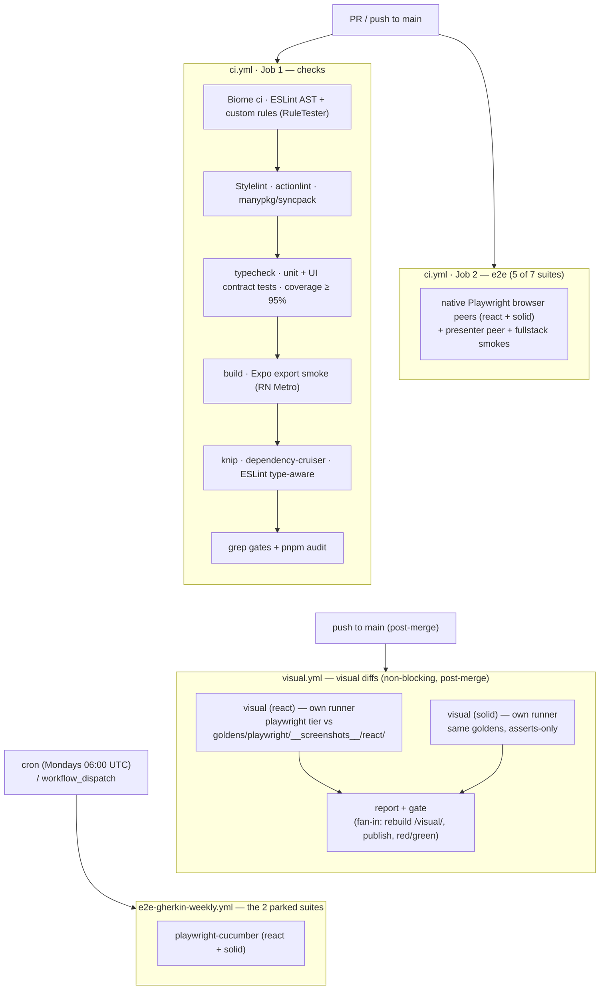

[◀ 8. Replaceability Matrix](08-replaceability-matrix.md) · [Architecture Document](../architecture.md) · [10. Key Design Decisions ▶](10-key-design-decisions.md)

## 9. Test Strategy

Tests are layered the same way the system is. Each layer has its own kind of test, and **no test is allowed to import a tool from a layer it isn't testing**.

```
Behavioural Specs (Gherkin)             - WHAT the system does
  |
Step Definitions / Page Objects         - HOW to drive the system today
  |
Test Runner / Driver                    - Vitest, Playwright, ...
```

### 9.1 Layers

| Test layer | Tests | Tooling-coupled? | Survives technology swap? |
|---|---|---|---|
| **Behavioural specs** (Gherkin `.feature` files) | End-user behaviour, scenario style | No -- pure spec | Yes |
| **Step definitions** | Map Gherkin steps to actions | Yes -- import the driver | Rewritten when driver changes |
| **Page Objects** | Encapsulate selectors, waits, intent emission | Yes -- import the driver | Rewritten when UI framework or driver changes |
| **Use-case tests** | Use case behaviour with stubbed ports | Test framework only | Yes (tests import vanilla TS) |
| **Port contract tests** | Same suite run against simulator and WsReal adapters | Test framework only | Yes |
| **Domain entity tests** | Pure functions over entities | Test framework only | Yes |
| **Component tests** (optional) | Render component, assert hook contract is honoured | UI framework + test framework | Rewritten when UI framework changes |
| **UI contract tests** (sociable RTL, [§9.8](#98-ui-contract-tier)) | Mount real components against a scripted `ViewModel`; assert behaviour | Framework-neutral specs + a thin per-framework swap layer | Specs survive; only the `react/` adapter directory is rewritten |
| **Visual goldens** (CI-asserted `playwright` tier, [§9.7](#97-visual-golden-tiers)) | Pixel screenshots of workspaces × skins × modes | Screenshot runners | Goldens survive — they **are** the cross-framework rendering contract |
| **RN component tests** (jest-expo + RNTL, [§9.9](#99-react-native-testing)) | Render RN screens against the ViewModel | jest-expo | Rewritten with the mobile UI |

### 9.2 Gherkin example

```gherkin
Feature: FX price streaming
  As a trader
  I want to see live bid/ask prices
  So that I can decide when to trade

  Scenario: a price tile shows the latest mid price
    Given the trader has the FX workspace open
    When the pricing service emits a tick for "EURUSD" with bid 1.1000 and ask 1.1002
    Then the EURUSD tile shows bid "1.1000" and ask "1.1002"
    And the spread is rendered as "2.0" pips
```

The same `.feature` file is consumed by:
- **client-side e2e step defs** (Playwright) -- drives a real browser, asserts DOM.
- **application-layer step defs** -- drives presenters directly, asserts hook output, no browser. Fast.

If a browser driver is replaced, only the page-object implementations for that driver change. Replacing React with SolidJS rewrites the page objects but not the specs.

### 9.3 Linking specs to existing project specs

The codebase already contains specs (separate from tests) that describe expected behaviour. The intent is to **converge** on Gherkin: existing specs become the seed for `.feature` files, and the `.feature` files become the single source of truth that all test layers reference. Where today's specs are prose, they will be incrementally rewritten in Given/When/Then form.

### 9.4 Port contract tests

A single test suite is parameterised over **all** adapters that implement a port. The same scenarios run against:
- the in-process simulator,
- the WsReal adapter (against a stub WebSocket server),
- any future adapter (e.g. a different transport).

This is what makes "swap an adapter" a low-cost operation: the contract is encoded in tests and they all must pass.

### 9.5 Seven-suite e2e stack (4 browser peers + 1 presenter peer + 2 fullstack smokes)

`tests/scripts/run-all.ts` orchestrates **seven suites**: five behavioural peers exercising the same spec surface via two binding styles, plus two full-stack smokes (`tests/fullstack/`) that boot a real `@rtc/server` and a real client and assert live WS data end-to-end — the only suites that exercise the server process itself. The five peers: Cucumber-JS (with Playwright) binds Gherkin scenarios in `tests/specs/**/*.feature` to a shared step-definition tree; native `@playwright/test` binds scenarios programmatically through its own step tree. Both peers are additionally duplicated against `@rtc/client-solid` (via `RTC_CLIENT_PKG`, ports 3003/3004), bringing the browser family to four peers. One presenter-direct peer, **vitest-fake-timers** (plain), binds a subset of the same scenarios (tagged `@presenter`) to the RxJS presenter layer in pure Node with no browser, rerunning the `_shared/` scenario modules under Vitest + raw `describe`/`it` (no Gherkin loader) + `vi.useFakeTimers()`. **The `.feature` files are one shared corpus (`tests/specs/`) that each peer runs a tag-selected slice of — the "one corpus, two layers" mechanism (and the `@presenter` / `@presenterOnly` routing rules) is diagrammed in [`tests/GHERKIN.md`](../../tests/GHERKIN.md).**

**Browser bake-off (2026-07-20) — native Playwright is the gating SOT; Gherkin browser peers parked weekly.** Of the four browser peers, the two Cucumber-JS (Playwright) suites — react and solid — were dropped from the PR gate (not deleted): native Playwright won the bake-off ([§9.7](#97-visual-golden-tiers) sibling verdict for the visual tier; see `tests/STRATEGY.md` §7.1 for this one), so it is declared the browser stack's source of truth going forward — new browser behaviour lands in `tests/browser/playwright/*.spec.ts` first, and a matching `.feature` scenario is optional while the layer stays parked. `tests/scripts/run-all.ts` filters both `test:browser:playwright-cucumber*` suites when `RTC_E2E_SKIP_GHERKIN_BROWSER=1` (set by the CI PR gate in `ci.yml`); a new weekly workflow, `.github/workflows/e2e-gherkin-weekly.yml`, runs both parked suites every Monday so the `.feature`/step tree can't silently rot while it's off the gate. Net effect: the PR gate runs **5 of the 7** suites (2 native-Playwright browser + 1 presenter + 2 fullstack); a plain local `pnpm test:e2e` (env var unset) and the weekly workflow both still exercise all 7.

**Presenter bake-off (retired 2026-07-20).** The presenter family used to run four runner/time-model peers over the same 21 `@presenter` scenarios: **cucumber** (real timers, the wall-clock reference), **cucumber-fake-timers** (same bodies under `@sinonjs/fake-timers`), **vitest-quickpickle-fake-timers** (same bodies under Vitest + the qpickle-loader Vite plugin for Gherkin + `vi.useFakeTimers()`), and **vitest-fake-timers** (plain — the same `_shared/` scenario modules under Vitest + raw `describe`/`it` + `vi.useFakeTimers()`, proving the `_shared/*.ts` / `_await.ts` / `_world.ts` abstractions are useful even without a BDD step-tree). All four were the deliverable of Phase 5B.1-5B.4; the comparison concluded with the plain `vitest-fake-timers` peer winning the **gating** role on speed (1s local / 2.5s CI) and zero Gherkin-loader dependencies. Of the other three, **`cucumber-fake-timers` was kept as a parked presenter BDD showcase** — the presenter-tier twin of the parked `playwright-cucumber` browser peer (same `@cucumber/cucumber` runner, same `cucumber.js`/`hooks`/`world`/shared-`steps` shape, same `specs/**/*.feature` corpus), so the Gherkin corpus is driven by Cucumber.js at both layers. It is never in `run-all.ts` (so it never touches the PR gate), runs via `test:presenter:cucumber-fake-timers`, and is exercised weekly by `e2e-gherkin-weekly.yml` (its own job) so its step tree can't rot. The real-timer `cucumber` peer (slowest) and `vitest-quickpickle-fake-timers` were deleted. See `tests/STRATEGY.md` §5.2 for the full verdict and the twin-of-the-browser-peer rationale.

| Layer | Stack |
|---|---|
| Behaviour specs (`.feature`) | Gherkin · Cucumber-JS 11 (Playwright) |
| Step definitions | One tree, `tests/browser/steps/*.steps.ts` |
| Native Playwright specs (`.spec.ts`) | `tests/browser/playwright/*.spec.ts` — bind scenarios via `@playwright/test` `test()` bodies; no Gherkin |
| Scenarios layer (shared) | `tests/browser/scenarios/*.ts` — async fns taking `(ctx: TestContext, args)`; driver-free; used by Cucumber+Playwright and native Playwright (both clients) |
| Page-object contracts | TypeScript interfaces; `TESTIDS` and `STRINGS` SOTs |
| Page-object impls (drivers) | `tests/browser/page-objects/playwright/` |
| Per-runner support | `tests/browser/playwright-cucumber/{world,hooks}.ts` (Cucumber+Playwright) · `tests/browser/playwright/{_context,_openWorkspace}.ts` (native Playwright fixture) |
| Orchestration | `tests/scripts/run-all.ts` — seven suites in parallel, per-suite dev servers (`RTC_DEV_PORT` 3001+), OR-ed exit codes; `RTC_E2E_MAX_PARALLEL` cap |
| Full-stack smokes | `tests/fullstack/{node-smoke,browser-smoke}.ts` + `tests/fullstack/browser/fullstack.spec.ts` — real server + real client on dedicated ports, live pricing/equities assertions |
| Presenter-direct specs | Same `tests/specs/**/*.feature` files, scenarios tagged `@presenter` |
| Presenter-direct scenarios | `tests/presenter/scenarios/_shared/*.ts` — subscribe to RxJS streams with `firstValueFrom + timeout` |
| Presenter-direct harness | `tests/presenter/scenarios/_buildApp.ts` (App + simulator + test ConnectionEventsPort) |
| Presenter-vitest-fake-timers (plain) runner | `tests/presenter/vitest-fake-timers/vitest.config.ts` · `vitest` + raw `describe`/`it` (no Gherkin loader) + `vi.useFakeTimers()` |
| Presenter-vitest-fake-timers (plain) harness | `tests/presenter/vitest-fake-timers/_world.ts` (VitestPlainPresenterWorld plain-object factory implementing the `AwaitHelpers` interface; one `*.test.ts` per feature, beforeEach/afterEach building/tearing down the world per `it()`) |

**Native Playwright binding.** `tests/browser/playwright/*.spec.ts` files import a `test` symbol from `./_context.ts`, a Playwright fixture extension that exposes `{ ctx: TestContext }` built from `buildPlaywrightPageObjects(page) + new Scratchpad()`. Each `.feature` file has a sibling `.spec.ts` whose `test.describe` title, `test()` titles, and step ordering mirror the Gherkin 1:1. Three named helpers in `_openWorkspace.ts` (`withWorkspaceOpen` / `withFxWorkspaceOpen` / `withCreditWorkspaceOpen`) map 1:1 to the three Background phrasings, replacing Cucumber's implicit Background mechanism. Test bodies contain only `await scenarios.fn(ctx, ...)` calls — no direct `page.*`, `expect`, or `ctx.po.*` — enforced by grep gates 9–11 in `tests/scripts/grep-gates.ts`.

**Known flake class: a lost CDP drag release.** Playwright's CDP drag interception can silently fail to deliver the release — worth knowing for any drag gesture written against this suite, not just the one that surfaced it. Diagnosed from two `layout.spec.ts` failures on `main` (a dockview tab drag) that reproduced under CPU throttling: the helper issued `dragstart` and a full run of `dragover` events, dockview's own `.dv-drop-target` overlay was covering the destination, and then **no `drop` event arrived at all** (`drop=0`, `dragend=1`) — the renderer's accept-state for the last `dragover` had not reached the browser process by the time `mouse.up()` dispatched the release, so Chromium cancelled it. Nothing threw; the helper returned "success" having done nothing, and the next assertion blamed the product for a gesture it was never shown — this repo's own "absence reported as a clean reading" class. Measured under `Emulation.setCPUThrottlingRate`: 4 failures in 95 gestures at 8×, 0 in 60 after the fix. The fix is a **witness, not a longer wait**: the drag helper (`dragDockTabToPoint` in `tests/browser/page-objects/playwright/Layout.ts`) now returns only once the page has been shown to have received a `drop` event, and otherwise re-drives the whole gesture (4 attempts, then a named throw) — a longer timeout cannot turn an undelivered release into a delivered one, but re-driving the gesture can. `layout.spec.ts:18`, previously carried as a separate "known flake", turned out to be the same loss through the same helper.

**Historical note:** a second browser driver, Cypress, ran alongside Playwright through 2026-07-19 as a native suite and a Cucumber-driven suite (the latter via a bundler-alias seam remapping `@cucumber/cucumber` to a Chainable-wrapping shim; the former via a forked, queue-aware `scenarios/` layer, since its command-queue model couldn't reuse the shared `Promise`-shaped one). Both were deleted 2026-07-20 after a framework bake-off; see `tests/STRATEGY.md` §5.1 for the verdict.

**Presenter-direct binding.** `tests/presenter/vitest-fake-timers/*.test.ts` files call scenario fns at `tests/presenter/scenarios/_shared/*.ts` directly (no step-def indirection, no Gherkin loader), which subscribe to presenter streams (`priceStream.price$`, `connection.status$`, `blotter.trades$`, etc.) via `firstValueFrom + timeout` and assert on emitted values. The `@presenter` tag in `.feature` files marks the scenarios that map cleanly to the application layer; UI-only scenarios (theme, hover, CSS, tabs) remain browser-only. `tests/presenter/scenarios/_buildApp.ts` is the sole seam to `createApp(simulatorPorts)`; grep gate 17 enforces it. Demonstrates that the same behavioural specs validate the application layer with no UI framework — closing the loop on [§1.2 rule #4 ("Behavioural Tests as Insurance")](01-overview.md#12-architectural-principles). Originated as Phase 5B's first sub-phase (5B.1, Gherkin via Cucumber-JS); sub-phases 5B.2-5B.4 added the fake-timers/Gherkin-under-Vitest/plain-TS variants as the comparison artifact retired above. Grep gate 20 forbids Gherkin loader imports inside `tests/presenter/vitest-fake-timers/`; gate 21 enforces `@presenter` scenario count parity between `.feature` files and `*.test.ts` files via a `customCheck` extension to `grep-gates.ts`; gate 22 asserts every `describe(...)` title in that folder begins with `"@presenter Feature: "`. Wall-clock: ~1s local / ~2.5s CI.

### 9.6 Port contract test layer

The transport ports (17 contract describers — see
`packages/domain/src/ports/__contracts__/`) each have a contract describer at
`packages/domain/src/ports/__contracts__/<Port>Contract.ts` asserting
happy-path behavioral invariants the TypeScript type signature cannot
catch — emission shapes, SoW protocol, RFQ lifecycle, multi-subscriber
identity. Each describer is parameterised by a `makeHarness()` factory
returning `{port, driver, teardown}`, so the same assertions run twice:
once against the simulator implementation in `packages/domain/src/simulators/`
and once against the WsReal implementation in
`packages/client-core/src/adapters/portFactory.ts` driven by an in-memory
`FakeWsAdapter` that scripts canonical wire frames from
`packages/shared/src/__fixtures__/wireFrames.ts`. The equities port trio has
the same treatment (`wsRealMarketData.contract.test.ts`, `portFactory.equities.test.ts`
in `client-core`).

The contract is happy-path only. Error semantics (RPC nack handling) are
covered by three `wsReal<Execution|Pricing|Workflow>.errors.test.ts`
files outside the contract, since simulators have no equivalent failure
mode. Gate 23 (see §12) keeps the describers pure: they receive a port
via `makeHarness`, they don't reach into either implementation.

### 9.7 Visual golden tiers

`packages/client-react/tests/ui/visual/` screenshots the UI against the same
scenario matrix through a single CI-asserted rasterizer — plain **Playwright
over a Vite host** (`playwright/`) — after a 2026-07-20 bake-off (§9.7 Outcome
below) retired the other two candidate tiers from the assert role:

| Tier | Runner | Config | Role today |
|---|---|---|---|
| **Playwright** (the sole CI-asserted tier) | Plain Playwright over a Vite host | `playwright/` | Asserts on every push to `main` — the framework-agnostic spec (`visual.spec.ts`) is reused **verbatim** by `client-solid` |
| Vitest browser mode | `vitest-browser-react` + `toMatchScreenshot` | `vitest-browser/` | **Coverage-only instrument** — still renders + interacts through the full 1282-scenario matrix so istanbul sees every branch, but the pixel assert is compiled out (`__RTC_VISUAL_SKIP_DIFF__`); never gates anything |
| ~~Playwright Component Testing~~ | ~~`@playwright/experimental-ct-react`~~ | ~~`playwright-ct/`~~ | **Retired** — deleted along with its goldens |

Two golden sets are committed for the surviving tier, under
`packages/ui-contract/goldens/playwright/__screenshots__/` — generated only
from `client-react` renders: `react/` (rendered on pinned x86 CI — **the
canonical cross-framework contract**) and `react-local/<platform>-<arch>/`
(local runs, committed for review but never compared on CI). The render
target lives behind the `visual/react/` seam barrel — the directory a
SolidJS port swaps.

**Updating goldens** is its own operational runbook — the two sets, the three
update routes (dispatch the CI workflow / regenerate locally in Docker / the
native fast loop), and which to run for a regression vs. a deliberate change
vs. a new scenario: [`packages/client-react/tests/ui/visual/UPDATING-GOLDENS.md`](../../packages/client-react/tests/ui/visual/UPDATING-GOLDENS.md).

How `client-solid` runs this same tier **assert-only** against these goldens
— never writing one of its own — is [§21 Mechanism 2 — assert-only visual tiers](21-cross-framework-testing.md#mechanism-2--assert-only-visual-tiers).

**Outcome (2026-07-20 — the test-tooling bake-off's visual tier verdict).**
Measured at the full 1282-scenario matrix (see `tests/ui/visual/README.md`'s
"Measured durations"): playwright-ct 241s, playwright 258s, vitest-browser
83s — so speed alone didn't decide it. Playwright (the URL-host tier) won the
CI-asserted role because it is the actual cross-framework portability
contract: `visual.spec.ts` is framework-agnostic and reused verbatim by
`client-solid`, with no CT-adapter version lag (the official Solid CT adapter
trailed the core Playwright version by ~1.5 years — the exact hazard the
now-deleted `playwright-ct` tier for Solid worked around with a
URL-navigation fallback that never became a real CT mount), and it exercises
production-like `page.route`/navigation rather than an in-process component
mount. `playwright-ct` was retired outright — its Solid side was always a
fallback, never the CT adapter it was meant to demonstrate. `vitest-browser`
was retired from the assert role but kept as the istanbul **coverage
gap-finder**: it still renders and interacts through every scenario (so
branch coverage reflects the true rendered surface), but its pixel assert is
compiled out via a `define`-injected `__RTC_VISUAL_SKIP_DIFF__` flag, so it
never reads a golden. Net effect: the post-merge `visual.yml` job dropped from
~52 min (3 tiers × 2 clients) to ~29 min measured (1 tier × 2 clients run
serially in one job); a follow-up job-matrix parallelization ([§9.10](#910-the-ci-gauntlet))
then took it to **~15 min** (measured 14.9) by running the two clients on
separate runners.

### 9.8 UI contract tier

`packages/client-react/tests/ui/contract/` is the second framework-swap pillar: **sociable RTL tests** where framework-neutral specs (`specs/**/*.contract.spec.ts`, per domain) drive framework-neutral page objects (`shared/pages/`), and only the thin `react/` directory (component registry, render adapter, `viewModelFromWorld`) knows React exists. CI enforces **≥95%** statement/branch/function/line coverage on this tier (`test:ui:contract:coverage`) — the strongest single gate in the repo, because it measures how much of the UI the swap-portable suite actually pins down.

The `UiContractDriver` seam that lets the same specs run against `client-solid`'s Solid render target instead of React's is [§21 Mechanism 1 — the contract swap-trio](21-cross-framework-testing.md#mechanism-1--the-contract-swap-trio).

### Page objects in the co-located tier

The isolation rule stated for the contract and e2e tiers ("specs do not
import React, RxJS, or Playwright internals") applies to the co-located
`src/**` unit tier too, enforced by `rtc/no-framework-calls-in-specs`:
specs call semantic methods on page modules under the package's
`tests/**/pages/`; those modules are the only test files importing
`@testing-library/*`. Rollout state and per-package backlog:
[`docs/lint-warnings.md`](../lint-warnings.md). Design:
[page-object isolation spec](../superpowers/specs/2026-09-01-spec-page-object-isolation-design.md).

**A page object must also CONSTRUCT the component it is named for**, not accept
one already built — `rtc/page-objects-own-their-component`. This is the same
doctrine as above, but it needs its own rule because
`no-framework-calls-in-specs` enforces the doctrine by banning framework
*imports*: a page whose contract is `mount(element: ReactElement)` passes that
rule cleanly while leaving the entire **arrange** half in the spec. The type
erases the component, so nothing about the page can encapsulate it.

That gap was load-bearing. `client-react` was marked migrated (and held to
`error`) the whole time its `DockviewLayoutEngine.docked.test.tsx` wrote **all
15 props at each of 16 render sites — 9 of them byte-identical every time**,
144 lines of pure noise in a 747-line file. Two cases differing in one prop
could only be told apart by eye-diffing two 15-line blocks. The solid twin,
forced by Solid's once-running component bodies to take live accessors, had
been built the right way from the start.

The sanctioned shape is a props object with documented defaults, so a case
states only what it varies:

```ts
page.mount({ registry, store, docked: ["panel-dyn-1"] });
page.mount({ registry, store, docked: ["panel-dyn-1"], closed: ["panel-dyn-1"] });
```

A **bare `Element`** stays legal — that is the DOM interface, and a page
measuring a node it was handed (`UseFlipGridPage`) is doing its job; only
`ReactElement` and qualified `JSX.Element` are the "spec built the subject"
shape. A parameter named `children` is exempt: a provider page wrapping
arbitrary children is composition, not handing over the subject. Only the
page's **published interface** is checked — its own plumbing may hold an
element, since RTL's `rerender` takes one.

The rule is **unconditional** — it carries no ignore list. Ten page objects
were converted, in two rounds:

- **The element shape** — `mount(element: ReactElement)`: `client-react`'s
  `DockviewLayoutEngineDockedPage` (16 sites) and `DockviewLayoutEngineStrictModePage`
  (8 sites across four specs), `client-react-native`'s `BootCanvasPage` and
  `ExposureBubblePage`, and `devtools-app`'s `NavTreePage`.
- **The render-function shape** — `mount(element: () => JSX.Element)`, which
  the first version of the rule could not see: `client-solid`'s
  `DockviewLayoutEngineBridgePage` (the `instances`, `popout` and `floating`
  specs), `BootSequencePage`, `UseJarvisDrivenPulsePage` and
  `UseLiveMetricsPage`, and `client-react-native`'s `StatusStripPage`.

**Why the second round existed.** The rule lets an element appear as a
*return type* (`engineOf(): ReactElement` is the page building its component —
exactly right), and the first version stopped its walk at the nearest
function-shaped node. In `element: () => JSX.Element`, that node is the
parameter's own *function type*, so `JSX.Element` read as a harmless return
type. That is the natural **Solid** shape — Solid's `render()` takes a function —
so the rule was effectively React-only, and a Solid spec added after it shipped
(`DockviewLayoutEngine.floating.test.tsx`) wrote the full fifteen-prop block
unflagged. The walk now climbs through a function type and stops only at a real
signature.

**Solid pages take `Live<T>` props.** A Solid component body runs once, so a
prop a case changes after mounting must reach the page as an accessor
(`maximized` from the case's own `createSignal`), while one that never changes
reads better as a plain value. `DockviewLayoutEngineBridgePage` accepts either
and dereferences each inside its JSX so Solid wraps it in a reactive getter —
passing `maximized()` instead of `maximized` freezes the value and breaks the
case that toggles it (checked).

Two of those needed more than a prop swap, and both shapes are worth knowing:

- **A wrapper that is itself the subject.** The StrictMode spec mounts inside
  `<StrictMode>`, and moving that page-side would have hidden what the test
  mounts. `mountInStrictMode(props)` keeps it visible at the call site without
  handing the page an element.
- **A stateful harness.** `NavTreePage` and `BootCanvasPage` mount components
  that call hooks (`useState`, `useSharedValue`) to drive the subject. The page
  declares those harnesses itself and exposes their handles — a spec that built
  them would be composing the subject again.

`BootCanvasPage` additionally loads its component through `require` inside
`mount`, not a static import: the spec mocks `BootCanvas`'s dependencies with
factories that close over spec-level `const`s, so a static import would pull
`bootScene` in before those initialise and hit the temporal dead zone.

### Readable JSON fixtures

A test's ARRANGEMENT must not drown its SUBJECT. Two lint rules enforce that
for JSON fixtures, and both of their thresholds were **measured against the
tree, not assumed** — each sits inside an empirically empty band, so neither
can fire on legitimate code:

| rule | scope | bans | threshold (and why it is safe) |
|---|---|---|---|
| `rtc/no-minified-json-literal` | repo-wide | a JSON payload pasted as a single-line string | **120 chars** — every legitimate JSON string literal in the repo is ≤ 41 chars; the blob it exists to prevent was 880. Nothing lives between. |
| `rtc/json-fixtures-in-factories` | tests only | a large inline `JSON.stringify({ … })`, and a fixture factory not named `create*` | **10 lines** — inline spans here are bimodal (4 at ≥ 15 lines, 18 at ≤ 6, **none in 7–14**), so the bar sits in the gap. |

The sanctioned shapes are an object literal bound to a name
(`JSON.stringify(layout)` — allowed at any size, because the object already
has a name) or a `create*` factory declared **below** the cases
(`rtc/newspaper-order`). Writing the object literal instead of the string is
always behaviour-neutral: `JSON.stringify` re-emits the captured payload byte
for byte, since key order is insertion order.

Why the naming half is **tests only**: "fixture factory" is a concept that
exists only in a test. Production code that builds JSON is a *serializer*, and
naming it for its effect means `serializeLayout`, not `createLayout` — a
repo-wide draft of the rule flagged exactly that function, and the rule was
wrong, not the code.

Two known limits. The rule sees only `JSON.stringify` factories, so a
bare-noun factory returning a plain object (`poppedBlob()`,
`legacyRailBlob()`) is not caught — widening it to "any function returning an
object literal" would be far too broad. And it pins only the `create` prefix;
`rtc/name-functions-by-effect` governs the rest of the name.

**Re-measure before moving either threshold.** A bar set from an assumption is
how the visual tier's tolerance ended up wrong in both directions at once —
see [§9.7](#97-visual-golden-tiers).

#### Fixture factories are named `create*`

`rtc/name-fixture-factories` (specs only, no ignore list) pins the naming.
`docs/handler-naming.md` requires a name to state its **effect**; a bare noun
names a *thing*, so `poppedBlob()` reads as a constant until you notice the
parens — which matters because each call returns a **fresh** value, and sharing
one constant instead would couple cases through mutable state.

`rtc/name-functions-by-effect` cannot catch this: it works from a **blocklist**
of bad prefixes (`on*`, `handle*`, a vacuous-verb set) and passes everything
else. Requiring a verb instead would need an unbounded **lexicon** that fails
the build on the first word nobody thought of. So this rule takes the only two
shapes that need none:

| arm | shape | fix |
|---|---|---|
| factory synonyms | `make*`, `build*`, `fake*`, `stub*` at any arity | `create*`, `createFake*`, `createStub*` |
| noun-named fixtures | zero-parameter, body is exactly `return { … }` / `return [ … ]` | `create<Noun>` |

**The single-statement requirement is the safety property.** The looser test
("returns an object/array anywhere in the body") caught seven *actions* that
merely happen to return something — `mountPillWorkspace`, `wireAppToInspector`,
`renderModal`, `useTicketSubmission` … — every one already correctly named. The
single-return form caught none of them.

**Known limit, stated rather than hidden:** a noun-named factory that builds up
locals before returning is out of arm 2's reach, and there is no syntactic
discriminator separating those from actions without the lexicon this rule avoids.
Arm 1 still covers them whenever they carry a factory-synonym prefix.

**Parameterised noun-named functions are a deliberate boundary, not a miss.**
A function taking arguments and returning an object literal may be a factory
(`trade(id)`) or a transform (`withLastSeq(node, id, seq)`), and nothing
syntactic separates the two. Measured on 2026-09-18: 202 such functions in specs.
The **37 whose first parameter is an overrides/options bag** (`overrides`,
`over`, `opts`, `props`, …) are unambiguously fixture factories and were renamed
to `create*`; the rest were left as named, by decision. The rule does not gate
this shape, so a new parameterised factory is a review call, not a lint error.

`createFake*` / `createStub*` deliberately keep the test-double vocabulary
rather than flattening it — `create` states the effect, `Fake`/`Stub` states what
is produced.

### Proving a test can fail — `scripts/mutation-check.mjs`

The defect this repo produces most often is not a wrong assertion but a test
that **cannot fail**: a witness called through the proxy that supplies its
`this`, an invariant whose setup could never violate it, a resolve issued
before the subscriber that would have received it (all three shipped, all three
caught in review). A passing test says nothing about which of those it is. The
only thing that does is a mutant: change the implementation to be wrong in a
specific way and confirm the test goes red.

`scripts/mutation-check.mjs` runs a batch of those and prints a kill table:

```bash
node scripts/mutation-check.mjs mutants.json [--keep-going]
```

Each mutant is `{ name, file, find, replace, test }`; `find` is a literal that
must match **exactly once** (an ambiguous mutant is an error, not a guess), and
the file is restored in a `finally` — so a crash mid-run cannot leave a mutant
in the tree, which is otherwise read as a real result by the next run.

Two rules that make the table mean something:
- write the mutant that a **plausible wrong implementation** would contain
  (`slice(0, N)` for `slice(-N)`, a dropped `includes` guard, `refCount: true`),
  not a syntax error;
- a SURVIVED row is a finding about the **test**, not about the tool. Either
  strengthen the test until it kills the mutant, or record why that behaviour
  is deliberately uncontracted.

### Waiting on time — fake timers, and the one safe real wait

**A test that waits for a timer-driven outcome runs on fake timers**
(`vi.useFakeTimers()` before composition, then `vi.advanceTimersByTimeAsync`).
Both application cores follow them: RxJS schedules through `setTimeout` /
`setInterval`, and `Effect.sleep` advances under them
(`client-core-effect/src/bridge/clock.test.ts`). A comment claiming a
composition-level test "still runs on a REAL scheduler" was wrong in every
place it appeared.

A real-time wait (`await new Promise((r) => setTimeout(r, N))`) is safe in
exactly one shape: what it waits for is a **single timer**, armed before the
wait or within the same microtasks, with an **earlier deadline**. The timer
queue fires in deadline order however slow the runner is, so the outcome is
decided by order, not by the clock — `createDockEngine.test.ts`'s debounce
waits are this shape. It **races** when the outcome sits behind a chain of
async hops, each arming its timer AFTER the wait's own: a Jarvis reply
pipeline before a drive stagger, scheduler hops before a persistence debounce,
React's `MessageChannel` commit after a redirect timer. On a loaded CI runner
the wait wins. Measured 2026-09-26 (#829 and the fake-timer PR): the
alternative cores' `composition.seams.test.ts` took ~3 s locally and
9.9–14.3 s on CI, timed out at 5 s twice, and — given a longer timeout — read a
drive that had not landed (`expected 'AAPL' to be 'MSFT'`). A wait for an
ABSENCE in the racing shape is worse: it passes vacuously.

Not affected: a `setTimeout(r, 0)` **yield** (ordering, not duration — the
`settle()` convention of the core runners); `vi.waitFor` / retry-loop
**condition polling** (the right tool for DOM work such as Dockview, whose
`requestAnimationFrame` / `ResizeObserver` fake timers would disturb); and a
real-browser Playwright test that measures wall-clock motion
(`freeze.spec.ts`).

Two traps when a UI test goes fake:

- **user-event** waits on its own timers between keystrokes; give it
  `userEvent.setup({ advanceTimers })`, guarded by `vi.isFakeTimers()` in a
  page object that real-timer specs share (`NewRfqPanelPage`).
- **@testing-library/react** drains every interaction with a `setTimeout(0)`
  it only advances when it detects *Jest's* fake timers. The React contract
  setup (`client-react/tests/ui/contract/react/setup.ts`) supplies the one
  `jest.advanceTimersByTime` call RTL makes — also for the co-located
  `src/ui/**` unit tests `test:ui:contract:coverage` runs with that same
  setup, but not under plain `pnpm test`, so a co-located fake-timer test must
  not rely on the drain either way. And React commits a timer's state
  change on a `MessageChannel` task, so wrap each advance in the harness's
  `flushAsync` (the React driver's `act`) before asserting on the DOM.

A converted test still has to fail when the code is wrong: mutation-check it
on fake timers exactly as on real ones.

### 9.9 React Native testing

The RN package runs a **dual runner** (`vitest run && jest`):
- **vitest** (node) for pure logic: chart geometry (`buildChart`, `buildCandles`, `bubbleLayout`), port selection (`buildNativePorts`), theme tokens, the AsyncStorage adapter.
- **jest-expo + RNTL 14** for ~50 colocated component tests (`*.test.tsx`), mapping `@rtc/*` to built `dist/`.

**Why jest and not vitest for the `.tsx` half.** Decided by a pre-registered
fail-fast spike (2026-07-01, [walking-skeleton plan Task 2](../superpowers/plans/2026-07-01-phase2-walking-skeleton.md)):
vitest was tried first with a full `vitest.rn.config.ts`
(`server.deps.inline` for the RN packages) and failed structurally — from
commit `cc9365e4c`, verbatim:

> vitest cannot render RN (Flow `import typeof` in react-native source is
> unparseable by esbuild, even with server.deps.inline). Fell back to a
> scoped jest-expo island.

Beyond the parse blocker, the jest island carries machinery with no vitest
equivalent: the `jest-expo` preset (bootstraps the RN runtime — globals,
`__DEV__`, platform/asset resolution), a composed resolver that restores
pre-`exports`-map resolution for react-native and filters
react-native-worklets' `.native.` extensions under pnpm, pnpm-aware
`transformIgnorePatterns`, and ~12 KB of native-module mocks (reanimated,
Skia, expo-blur/haptics/sensors) in `jest.setup.ts`. Revisit only if RN
ships Flow-free ESM source or vitest gains an RN transform — until then the
split is: **`.test.ts` = vitest (node logic), `.test.tsx` = jest (renders
RN)**. Coverage for the two halves is measured separately and is not
comparable — see
[`README-COVERAGE.md`](../../packages/client-react-native/README-COVERAGE.md).

CI additionally runs an **Expo export smoke** (Metro bundling of the real app) to catch monorepo-resolution breakage that jest never exercises. Two gaps are known and deliberate: no RN e2e yet (Maestro is the deferred plan) and no RN visual goldens — jsdom/jest cannot see paint, so whole-branch review + the live simulator remain the net for RN paint bugs.

### 9.10 The CI gauntlet

The blocking gauntlet is two **parallel** jobs in `.github/workflows/ci.yml`, triggered on PRs and pushes to `main`. The ~15-min visual-diff job (react + solid, the sole `playwright` tier each — see `visual.yml`; ~29 min when the two clients ran serially in one job, ~52 min before the 2026-07-20 tier retirement in §9.7) is **not** among them: it runs post-merge only, in its own `.github/workflows/visual.yml` (triggered on push to `main` — i.e. right after a PR merges — plus manual `workflow_dispatch`), as a **matrix of two per-client jobs on separate runners** — one browser stack per runner, the isolation the ±1px stable-frame lesson needs — feeding a fan-in report/gate job. Branch pushes are never blocked while the UI is still churning. A red post-merge visual run is the signal to inspect the diff and either fix the regression or regenerate the goldens (via `update-visual-goldens.yml`). To restore it as a PR gate once the UI stabilises, move the job back into `ci.yml` **and** re-add `visual diffs` to `main`'s required status checks — both halves, or you get a gate that runs-but-doesn't-block or blocks-but-doesn't-run.

The e2e job runs `RTC_E2E_SKIP_GHERKIN_BROWSER=1 pnpm test:e2e` — 5 of the 7
`run-all.ts` suites (native Playwright react + solid, the presenter peer, both
fullstack smokes). The two `playwright-cucumber` suites (react + solid) are
parked off the gate, not deleted: native Playwright is the browser SOT
(§9.5), and a separate `.github/workflows/e2e-gherkin-weekly.yml` runs the
parked pair every Monday so the Gherkin tree can't silently rot while it's
off the PR gate.


```mermaid
flowchart TD
    trigger["PR / push to main"]
    trigger --> checks
    trigger --> e2e
    subgraph checks["ci.yml · Job 1 — checks"]
        direction TB
        c1["Biome ci · ESLint AST + custom rules (RuleTester)"]
        c1 --> c3["Stylelint · actionlint · manypkg/syncpack"]
        c3 --> c4["typecheck · unit + UI contract tests · coverage ≥ 95%"]
        c4 --> c6["build · Expo export smoke (RN Metro)"]
        c6 --> c7["knip · dependency-cruiser · ESLint type-aware"]
        c7 --> c8["grep gates + pnpm audit"]
    end
    subgraph e2e["ci.yml · Job 2 — e2e (5 of 7 suites)"]
        e1["native Playwright browser peers (react + solid)<br/>+ presenter peer + fullstack smokes"]
    end
    checks ~~~ postmerge
    e2e ~~~ postmerge
    postmerge["push to main (post-merge)"]
    postmerge --> visual
    subgraph visual["visual.yml — visual diffs (non-blocking, post-merge)"]
        direction TB
        v1a["visual (react) — own runner<br/>playwright tier vs<br/>goldens/playwright/__screenshots__/react/"]
        v1b["visual (solid) — own runner<br/>same goldens, asserts-only"]
        v2["report + gate<br/>(fan-in: rebuild /visual/, publish, red/green)"]
        v1a --> v2
        v1b --> v2
    end
    cron["cron (Mondays 06:00 UTC)<br/>/ workflow_dispatch"]
    cron --> weekly
    subgraph weekly["e2e-gherkin-weekly.yml — the 2 parked suites"]
        w1["playwright-cucumber (react + solid)"]
    end
    visual ~~~ weekly
```

---

