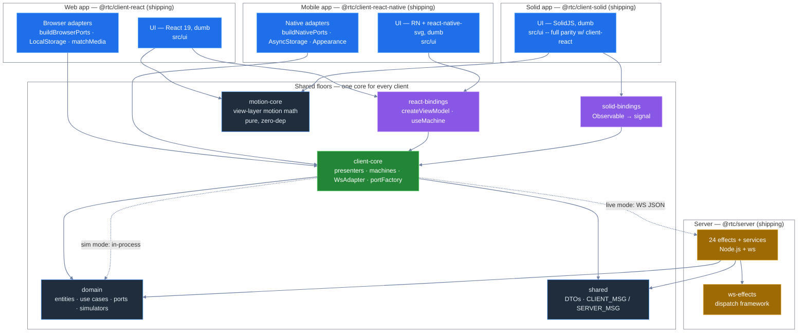

[◀ 12. Architectural Gates](12-architectural-gates.md) · [Architecture Document](../architecture.md) · [14. Composition & Wiring ▶](14-composition-and-wiring.md)

## 13. Codebase Map

§§1–12 explain the *rules* -- the dependency rule, the rings, the gates. This section is the *map*: what's actually in the repo, at three zoom levels, plus a matrix of exactly what's reused verbatim versus adapted across the three client apps and the server.

### 13.1 L0 -- The System On One Screen

Eleven workspace packages plus `tests`, drawn as five "buildings": three shipping client apps, the shared floors every client stands on, and the server. `@rtc/client-prototype` is omitted here too (as in [§1.3.1](01-overview.md#131-clean-architecture-concretely----which-package-is-which-ring)) -- it is a design-comprehension island with zero `@rtc/*` edges into this graph. `@rtc/motion-core` *does* appear (as `motion`) since `client-react` and `client-solid` both genuinely depend on it. `@rtc/ui-contract` and the devtools packages are omitted from this L0 view for the same reason as `client-prototype` -- they exist to test/instrument the graph below, not to run inside it; both get their own L1 cards.



Two runtime modes both terminate in `client-core`, never in the UI: **simulator mode** runs `@rtc/domain`'s simulators in-process (dashed-free solid edge `core --> domain`, taken via `createSimulatorPorts`); **live mode** routes the same port interfaces over a `WsAdapter` to `@rtc/server`, which hosts the *identical* simulator classes behind `@rtc/ws-effects`. Full detail: [§7 Runtime Topology](07-communication-patterns.md#runtime-topology-what-runs-when).

### 13.2 L1 -- The Package Line Map

One card per package -- what it is, which ring it sits in ([§1.3.1](01-overview.md#131-clean-architecture-concretely----which-package-is-which-ring)), its real `dependencies` (verified against each `package.json`), who consumes it, and one fact that isn't obvious from the name. The authoritative, always-current detail for each package lives in its own README; these cards are the map, not the territory.

#### `@rtc/domain`

| | |
|---|---|
| **What it is** | Entities, use cases, port interfaces, and simulators -- pure TypeScript, the innermost package. |
| **Ring** | ①② Entities & Use Cases -- the yolk |
| **Depends on** | `rxjs` only (`packages/domain/package.json` `dependencies`) |
| **Consumed by** | `shared`, `client-core`, `react-bindings`, `client-react`, `client-react-native`, `server`, `tests` -- every workspace package except the three zero-`@rtc`-dependency islands (`ws-effects`, `client-prototype`, `motion-core`) lists `@rtc/domain` directly |
| **Non-obvious** | `src/simulators/` is ring ③ (gateways), not ring ①②, even though it lives inside this package -- and they're production code, not test doubles ([§10](10-key-design-decisions.md#10-key-design-decisions)). The single-dependency constraint (`rxjs` only) is enforced by pnpm strict mode, not just convention. |
| **README** | [`packages/domain/README.md`](../../packages/domain/README.md) |

#### `@rtc/shared`

| | |
|---|---|
| **What it is** | Wire-protocol DTOs and the `CLIENT_MSG`/`SERVER_MSG` envelope types shared by client and server. |
| **Ring** | ③ Interface Adapters -- boundary DTOs |
| **Depends on** | `@rtc/domain` only (`packages/shared/package.json` `dependencies`) |
| **Consumed by** | `client-core`, `server` -- *not* `client-react` or `client-react-native` directly (neither lists it; see the wire-protocol row of [§13.4](#134-the-reuse-matrix)) |
| **Non-obvious** | Ships a second public entry point, `./__fixtures__/wireFrames` (`packages/shared/package.json` `exports`) -- wire-format test fixtures are a first-class export, not a buried internal helper. |
| **README** | [`packages/shared/README.md`](../../packages/shared/README.md) |

#### `@rtc/client-core`

| | |
|---|---|
| **What it is** | The framework-free application core: composition root, presenters, state machines, `WsAdapter` + `portFactory`. |
| **Ring** | ③ Interface Adapters -- presenters, gateways, ViewModel wiring |
| **Depends on** | `@rtc/domain`, `@rtc/shared`, `rxjs`, `@rx-state/core` (`packages/client-core/package.json` `dependencies`) |
| **Consumed by** | `react-bindings`, `client-react`, `client-react-native`, `tests` |
| **Non-obvious** | Zero framework imports -- no React, no DOM types, no React Native -- despite being consumed by three UI-facing packages ([§1.3](01-overview.md#13-layered-architecture--terminology)); machine-enforced by dependency-cruiser's `client-core-stays-inner` + `client-core-framework-free` pair rules ([§6](06-package-dependencies.md#6-package-dependencies)). |
| **README** | [`packages/client-core/README.md`](../../packages/client-core/README.md) |

#### `@rtc/react-bindings`

| | |
|---|---|
| **What it is** | The one package that knows both worlds: `createViewModel`, `useMachine`, `ViewModelProvider`/`useViewModel`. |
| **Ring** | ③ Interface Adapters -- ViewModel bridge |
| **Depends on** | `@react-rxjs/core`, `@rtc/client-core`, `@rtc/domain`, `react`, `rxjs` (`packages/react-bindings/package.json` `dependencies`) |
| **Consumed by** | `client-react`, `client-react-native` |
| **Non-obvious** | The *only* package permitted to depend on both React and the core's RxJS streams ([§6](06-package-dependencies.md#6-package-dependencies)) -- kept small (~850 LOC, [§2.3](02-c4-model.md#23-component-diagram----web-client)) precisely so a `@rtc/solid-bindings` sibling was roughly a day's work, which it was. |
| **README** | [`packages/react-bindings/README.md`](../../packages/react-bindings/README.md) |

#### `@rtc/solid-bindings`

| | |
|---|---|
| **What it is** | The Solid↔RxJS bridge, parallel to `react-bindings`: `createViewModel`, `useMachine`, `ViewModelProvider`/`useViewModel`, implementing the exact same `ViewModel` member list over Solid signals instead of React hooks. |
| **Ring** | ③ Interface Adapters -- ViewModel bridge |
| **Depends on** | `@rtc/client-core`, `@rtc/domain`, `@rx-state/core`, `rxjs`, `solid-js` (`packages/solid-bindings/package.json` `dependencies`) |
| **Consumed by** | `client-solid` (the only client on this bridge -- `react-bindings` and `solid-bindings` never share a client) |
| **Non-obvious** | Not a reuse of `react-bindings` -- a sibling package binding the *same*, unmodified `client-core` (the multi-client proof in miniature, [§8.1](08-replaceability-matrix.md#81-the-multi-client-proof--the-solidjs-port)). `useMachine`'s Solid counterpart uses `onCleanup` instead of react-bindings' StrictMode-safe microtask-deferred `dispose()` -- Solid has no StrictMode double-invoke to guard against, so the lifecycle bridge is simpler here, not just differently spelled. At ~980 LOC it lands within the same order of magnitude as `react-bindings`' ~850--930. |
| **README** | [`packages/solid-bindings/README.md`](../../packages/solid-bindings/README.md) |

#### `@rtc/client-react`

| | |
|---|---|
| **What it is** | The web client: dumb React 19 UI (`src/ui`) + browser-specific platform adapters (`src/app`). |
| **Ring** | ④ Frameworks & Drivers (`src/ui`) + ③ platform adapters (`src/app/adapters`) |
| **Depends on** | `@rtc/client-core`, `@rtc/domain`, `@rtc/motion-core`, `@rtc/react-bindings`, `react`, `react-dom`, `rxjs`, `motion`, `@fontsource/*` (`packages/client-react/package.json` `dependencies`) |
| **Consumed by** | `tests` (`@rtc/tests` workspace) |
| **Non-obvious** | Depends on `@rtc/domain` directly, not only transitively through `client-core` -- e.g. `ThemeMode`/`ThemeSkin` types are imported straight from `@rtc/domain` in `src/ui/shell/theme/tokens.ts`. `rxjs` is a listed runtime dependency but appears only in `src/app` (e.g. `MediaQueryColorSchemeAdapter`); it is machine-banned from `src/ui` by gate 26. `@rtc/motion-core` (pure FLIP/rank-glide math) and `motion` (the third-party animation library) are two distinct dependencies despite the similar name -- don't confuse them. |
| **README** | [`packages/client-react/README.md`](../../packages/client-react/README.md) |

#### `@rtc/client-react-native`

| | |
|---|---|
| **What it is** | The mobile client: dumb Expo/RN UI (`src/ui`) + native-specific platform adapters (`src/app`). |
| **Ring** | ④ Frameworks & Drivers (`src/ui`) + ③ platform adapters (`src/app/adapters`) |
| **Depends on** | `@rtc/client-core`, `@rtc/domain`, `@rtc/react-bindings`, `react`, `react-dom`, `react-native`, `react-native-svg`, `@react-native-async-storage/async-storage`, `rxjs`, `expo` + six `expo-*` modules (router · constants · dev-client · font · linking · status-bar), `@expo-google-fonts/*`, + 2 more RN runtime packages (`react-native-screens`, `react-native-safe-area-context`) -- 22 in total (`packages/client-react-native/package.json` `dependencies`) |
| **Consumed by** | Nothing in-workspace -- it is a leaf app, and unlike `client-react` it is *not* a `tests` dependency (`tests/package.json` lists `@rtc/client-react` but not `@rtc/client-react-native`) |
| **Non-obvious** | `rxjs` is a listed runtime dep and appears in `src/app/adapters` (e.g. `AppearanceColorSchemeAdapter` returns `Observable<boolean>`) but never in `src/ui` -- the same dumb-UI discipline as web, now machine-gated here too by gates 30–33, the RN counterpart of gates 26–29 on `client-react/src/ui`. Its own suite runs vitest + jest-expo; it isn't exercised by the root `tests` e2e/presenter/fullstack suites, and RN e2e (Maestro) is a deferred workstream. |
| **README** | [`packages/client-react-native/README.md`](../../packages/client-react-native/README.md) |

#### `@rtc/client-solid`

| | |
|---|---|
| **What it is** | The SolidJS web client: dumb Solid UI (`src/ui`) + browser-specific platform adapters (`src/app`), at full parity with `@rtc/client-react` -- same contract specs, same visual goldens, same behavioural suites. |
| **Ring** | ④ Frameworks & Drivers (`src/ui`) + ③ platform adapters (`src/app/adapters`) |
| **Depends on** | `@rtc/client-core`, `@rtc/domain`, `@rtc/motion-core`, `@rtc/solid-bindings`, `solid-js`, `rxjs`, `@fontsource/*` (`packages/client-solid/package.json` `dependencies`) |
| **Consumed by** | Nothing in-workspace -- like `client-react-native`, it is a leaf app and *not* a `tests` (`@rtc/tests`) dependency; its own suite (contract + one visual tier) runs in-package |
| **Non-obvious** | Asserts against goldens generated only from `client-react`'s renders rather than owning any of its own (`packages/ui-contract/goldens/<tier>/__screenshots__/`) -- a passing Solid visual run is a direct cross-framework pixel match, not a self-comparison ([its README](../../packages/client-solid/README.md)). `@rx-state/core` and `@rtc/ui-contract` are `devDependencies`, not runtime deps -- the former backs `solid-bindings`' streams in tests, the latter supplies the shared contract specs and visual scenario manifest. |
| **README** | [`packages/client-solid/README.md`](../../packages/client-solid/README.md) |

#### `@rtc/client-prototype`

| | |
|---|---|
| **What it is** | A readable React 19 port of the `docs/design/web/v2` standalone design artifact -- a comprehension aid, not a shipping client. |
| **Ring** | None -- a design island, explicitly excluded from the ring diagrams ([§1.3.1](01-overview.md#131-clean-architecture-concretely----which-package-is-which-ring)) |
| **Depends on** | `react`, `react-dom` only (`packages/client-prototype/package.json` `dependencies`) -- zero `@rtc/*` imports, machine-enforced by dependency-cruiser's `prototype-isolated` rule ([§6](06-package-dependencies.md#6-package-dependencies)) |
| **Consumed by** | Nothing -- no other `package.json` in the workspace lists `@rtc/client-prototype` |
| **Non-obvious** | Its `src/mock/` folder generates data via seeded random walks; it never touches `@rtc/domain`'s simulators, so it can drift visually from the real app without breaking anything -- the tradeoff for total framework isolation. |
| **README** | [`packages/client-prototype/README.md`](../../packages/client-prototype/README.md) |

#### `@rtc/motion-core`

| | |
|---|---|
| **What it is** | Framework-free, zero-dependency view-layer motion math: FLIP deltas (`flipDeltas`), rank-glide coalescing (`coalesceOrder`, `computeRankDirections`, `sameOrder`), and easing/duration constants. |
| **Ring** | ④ Frameworks & Drivers -- a pure utility consumed directly by a UI shell, not the domain/use-case layer |
| **Depends on** | Nothing -- no runtime `dependencies` at all (`packages/motion-core/package.json`), stricter than the `rxjs`-only exception `domain` and `ws-effects` get |
| **Consumed by** | `client-react` (`src/ui/shell/motion/useFlipGrid.ts`, `src/ui/equities/watchlist/useRankGlide.ts`) and `client-solid` (`src/ui/shell/motion/useFlipGrid.ts`, `src/ui/equities/watchlist/useRankGlide.ts`, `src/ui/shell/status/useLiveMetrics.ts`, the equities chart components) -- the same math, two thin per-framework shells |
| **Non-obvious** | Machine-enforced purity via dependency-cruiser's `motion-core-stays-pure` rule ([§6](06-package-dependencies.md#6-package-dependencies)); see [ADR-005](../adr/ADR-005-ui-logic-placement.md) for why this animation math lives here rather than behind the ViewModel. |
| **README** | [`packages/motion-core/README.md`](../../packages/motion-core/README.md) |

#### `@rtc/ui-contract`

| | |
|---|---|
| **What it is** | The framework-neutral UI test contract: the shared sociable-RTL harness, the `*.contract.spec.ts` specs, and the visual scenario/fixture manifest -- extracted from `client-react`'s test tree so a second UI framework's test suites can depend on it without depending on `client-react`. |
| **Ring** | ④ Frameworks & Drivers -- a test-only leaf, not part of either client's runtime bundle |
| **Depends on** | `@rtc/client-core`, `@rtc/domain`, `@rtc/motion-core`, `rxjs` (`packages/ui-contract/package.json` `dependencies`) |
| **Consumed by** | `client-react` and `client-solid`, both as a **devDependency** -- it never appears in either client's `src/` (only their `tests/`) |
| **Non-obvious** | `src/visual/` is the piece with the highest leverage: `scenarios.ts`, `scenarioActions.ts`, `fixtures.ts`, `appData.ts`, `goldenPath.ts`, and `freezeClock.ts` are the single source of truth every visual tier-runner loops over -- adding a scenario here gives all three (react's CI-asserted `playwright` tier, solid's assert-only `playwright` tier, and react's coverage-only `vitest-browser` instrument) the test for free. `src/specs/` holds the 86 shared contract spec files / 622 tests (fx/credit/equities/admin/shell); each client supplies only its own render-target "swap trio" (`react/` vs `solid/`) that the specs mount against. `goldens/` -- the committed golden PNG trees for the single asserted `playwright` tier, generated only from `client-react` renders -- sits beside `src/` at the package root; it is not compiled, not exported, and not part of the `tsconfig`/knip/biome surface. |
| **README** | [`packages/ui-contract/README.md`](../../packages/ui-contract/README.md) |

#### `@rtc/ws-effects`

| | |
|---|---|
| **What it is** | A small declarative RxJS effects framework for dispatching WebSocket messages -- `WsEffect`, `stream()`/`rpc()`, `combineEffects`. |
| **Ring** | ④ Frameworks & Drivers -- the dispatch framework |
| **Depends on** | `rxjs` only (`packages/ws-effects/package.json` `dependencies`) |
| **Consumed by** | `server` only (`packages/server/package.json` lists `@rtc/ws-effects`; no client package does) |
| **Non-obvious** | Follows the exact same single-dependency (`rxjs`-only) constraint as `@rtc/domain`, per `CLAUDE.md`, despite living in the outermost ring -- purity isn't reserved for the domain. |
| **README** | [`packages/ws-effects/README.md`](../../packages/ws-effects/README.md) |

#### `@rtc/devtools-core`

| | |
|---|---|
| **What it is** | The devtools event protocol, the `DevtoolsHub` collector (registry, dormancy, coalescing, ring buffer), the three composition-root decorators (`instrumentPresenters`, `instrumentMachineFactories`, `instrumentWsAdapter`), and the `BroadcastChannelDuplex` transport adapter. |
| **Ring** | ④ Frameworks & Drivers -- a leaf instrumentation framework, structurally analogous to `ws-effects` |
| **Depends on** | `rxjs` only (`packages/devtools-core/package.json` `dependencies`) |
| **Consumed by** | `devtools-app`, `client-react` |
| **Non-obvious** | Never imports `@rtc/client-core` or any other `@rtc/*` package -- it decorates by *structural* shape (`InstrumentableMachine`, `WsAdapterLike`), machine-enforced by dependency-cruiser's `devtools-core-stays-pure` rule ([§6](06-package-dependencies.md#6-package-dependencies)). Dormant cost is one boolean check per tapped emission: `registerStream`/`machineCreated` only write to a registry `Map` until an inspector's `hello` flips the hub live and subscribes everything ([§20.3](20-devtools.md#203-the-dormancy-contract)). |
| **README** | [`packages/devtools-core/README.md`](../../packages/devtools-core/README.md) |

#### `@rtc/devtools-app`

| | |
|---|---|
| **What it is** | The inspector SPA: a Vite + React 19 app, timeline-first ([§20.11](20-devtools.md#2011-timeline-first-ux-v2)) — a unified event timeline with pin-to-moment selection, an Event/State/Diff context pane, and Machines/Wire as cross-linked lenses — driven entirely by the wire protocol. |
| **Ring** | ④ Frameworks & Drivers -- a leaf tool, not part of the app's own client stack |
| **Depends on** | `@rtc/devtools-core`, `react`, `react-dom` (`packages/devtools-app/package.json` `dependencies`) |
| **Consumed by** | Nothing in-workspace as a source dependency -- `client-react` only takes a `devDependency` build-order/dist-path edge to it (§6), never imports its source |
| **Non-obvious** | Never imports `@rtc/client-core` or `@rtc/domain` -- it understands only the protocol types from `devtools-core` (dependency-cruiser's `devtools-app-protocol-only` rule, [§6](06-package-dependencies.md#6-package-dependencies)), which is what makes a future Chrome-extension shell a thin wrapper around the same bundle ([§20.8](20-devtools.md#208-future-extensions)). Its own dev server (port 5280) has no same-origin hub to pair with and always renders "disconnected" by design -- the real inspector is served at `/devtools/` from the app's own origin. |
| **README** | [`packages/devtools-app/README.md`](../../packages/devtools-app/README.md) |

#### `@rtc/server`

| | |
|---|---|
| **What it is** | The WebSocket server: a thin Node.js host composed of 24 declarative effects over `@rtc/ws-effects`. |
| **Ring** | ④ host (`src/index.ts`, `node:http` + `ws`) + ③ effects/gateways (`src/effects/`, `src/socket/`'s `toSocket`) |
| **Depends on** | `@rtc/domain`, `@rtc/shared`, `@rtc/ws-effects`, `rxjs`, `ws` (`packages/server/package.json` `dependencies`) |
| **Consumed by** | `tests` |
| **Non-obvious** | Never imports `@rtc/client-core` (`grep -rln "@rtc/client-core" packages/server/src` returns nothing) -- server and clients share only `domain`/`shared`, enforced as a hard boundary by dependency-cruiser's `client-not-server`/`server-not-client` rules ([§6](06-package-dependencies.md#6-package-dependencies)). It also skips `domain`'s `usecases/` entirely (`grep -rn "UseCase" packages/server/src` returns nothing) -- use cases are client-orchestration; the server drives simulators directly. |
| **README** | [`packages/server/README.md`](../../packages/server/README.md) |

#### `tests` (the 16th card -- not a package, the behavioural-insurance layer)

| | |
|---|---|
| **What it is** | Cross-package browser e2e, presenter-integration, and full-stack smoke suites, plus the architectural grep gates ([§12](12-architectural-gates.md#12-architectural-gates)). |
| **Ring** | N/A -- sits outside the rings entirely, exercising them from the outside |
| **Depends on** | `@rtc/client-core`, `@rtc/client-react`, `@rtc/domain`, `@rtc/server`, `rxjs`, `ws` (`tests/package.json` `dependencies`) |
| **Consumed by** | Nothing -- it is the root of the dependency graph, not a dependency of anything |
| **Non-obvious** | Deliberately excludes `@rtc/client-react-native`, `@rtc/react-bindings`, `@rtc/shared`, `@rtc/ws-effects`, and `@rtc/client-prototype` as direct dependencies -- those are exercised only transitively (through `client-react`/`server`) or by their own package-local `test` script, not by this workspace's e2e/presenter/fullstack suites. |
| **README** | [`tests/README.md`](../../tests/README.md) |

### 13.3 L2 -- Module Maps

A compressed shape of each package's `src/` -- folder names and one-word roles, not an inventory. **The authoritative, file-by-file module detail lives in each package's own README** (linked above); these trees exist only to orient a reader before they open one.

`@rtc/domain`:
```
src/
├── fx/ credit/ equities/    entities — per-domain business rules
├── connection/ analytics/    entities — cross-cutting (status, positions)
├── preferences/ telemetry/    entities — app-level settings & metrics
├── ports/                     interfaces — dependency-inverted boundaries
├── usecases/                  orchestration — the 12 application business rules
└── simulators/                 gateways — production in-memory port impls
```

`@rtc/shared`:
```
src/
├── fx/            DTOs — pricing · execution · analytics · blotter · reference data
├── credit/         DTOs — dealer · instrument · workflow
├── protocol/        wire envelope — CLIENT_MSG/SERVER_MSG · rpc correlation · sow
└── __fixtures__/     wireFrames — public fixture export for consumers
```

`@rtc/client-core`:
```
src/
├── presenters/    ~40 presenters & state machines — the business logic
├── adapters/       WsAdapter, portFactory, wsReal* gateways
├── layout/          layout port + default layout data
└── theme/           ColorSchemeSource app-port (OS dark/light signal)
```

`@rtc/react-bindings` (flat -- no subfolders):
```
src/
├── createViewModel.ts    the ~60 use* hooks factory (bind + useMachine + commands)
├── useMachine.ts          per-mount RxJS machine → hook bridge
├── ViewModelContext.ts    the seam: context + type only
├── ViewModelProvider.tsx  injector — imported ONLY by AppRoot
└── useViewModel.ts        the accessor components import
```

`@rtc/solid-bindings` (flat -- no subfolders):
```
src/
├── createViewModel.ts    the same ~60 use* accessor factory, over Solid signals
├── useMachine.ts          per-mount RxJS machine → Solid primitive bridge (onCleanup, not microtask-deferred dispose)
├── toSignal.ts            Observable/StateObservable → Solid signal, the @rx-state/core → signal seam
├── ViewModelContext.ts    the seam: context + type only
├── ViewModelProvider.tsx  injector — imported ONLY by AppRoot
└── useViewModel.ts        the accessor components import
```

`@rtc/client-react`:
```
src/
├── app/            composition root — AppRoot, buildBrowserPorts, adapters/, theme/
├── ui/fx/          tiles · blotter · analytics · positions
├── ui/credit/      RFQ form · RFQ tiles · sell-side panel
├── ui/equities/    watchlist · candles · depth · ticket · blotters
├── ui/admin/       KPIs · throughput · latency · topology · event log
└── ui/shell/       layout engine · header · boot gate · lock screen
```

`@rtc/client-react-native`:
```
src/
├── app/              composition root — AppRoot, buildNativePorts, adapters/
├── ui/ (top-level)   SpotTile · TileGrid · Blotter · TradeTicket · ConnectionBanner
├── ui/credit/         RFQ form · RFQ tiles · sell-side panel
├── ui/equities/        markets · trade ticket · blotters
├── ui/analytics/        PnL chart · exposure bubbles (react-native-svg)
├── ui/shell/             boot sequence · lock screen · appearance overlay
└── ui/theme/              rnThemeTokens · ThemeProvider · DepthTokens
```

`@rtc/client-solid`:
```
src/
├── app/            composition root — AppRoot, buildBrowserPorts, adapters/, theme/
├── ui/fx/          tiles · blotter · analytics · positions
├── ui/credit/      RFQ form · RFQ tiles · sell-side panel
├── ui/equities/    watchlist · candles · depth · ticket · blotters
├── ui/admin/       KPIs · throughput · latency · topology · event log
└── ui/shell/       layout engine · header · boot gate · lock screen · power-saver
```

`@rtc/client-prototype`:
```
src/
├── fx/ credit/ equities/ admin/    per-domain screen ports (readable React re-implementation)
├── shell/                           boot · header · lock screen · ambient background
├── layout/                           workspace layout port
├── mock/                              seeded random-walk mock data (no domain, no rxjs)
├── motion/                             animation helpers
└── theme/                               design tokens
```

`@rtc/motion-core` (flat -- no subfolders):
```
src/
├── flip.ts            flipDeltas + FLIP_*/EXIT_* easing/duration constants
├── rankGlide.ts        coalesceOrder · computeRankDirections · sameOrder + GLIDE_*/HIGHLIGHT_* constants
└── reducedMotion.ts     REDUCED_MOTION_QUERY -- shared prefers-reduced-motion media query string
```

`@rtc/ui-contract`:
```
src/
├── specs/fx/ credit/ equities/ admin/ shell/    86 shared *.contract.spec.ts files / 622 tests, sociable RTL over a render-target prop
├── shared/harness/, shared/pages/                mount helper + Page-Object-ish query helpers, framework-neutral
├── shared/components.ts, shared/mount.ts          the render-target seam each client's swap-trio implements
└── visual/     scenarios.ts · scenarioActions.ts · fixtures.ts · appData.ts · goldenPath.ts · freezeClock.ts
                 — the manifest + interaction table + fixture data both clients' visual tiers loop over
```

`@rtc/ws-effects` (flat -- no subfolders):
```
src/
├── types.ts             WsEffect primitive — (in$, ctx) => out$
├── stream.ts, rpc.ts      subscription fan-out · correlated ack/nack sugar
├── operators.ts            out() / matchType() message helpers
├── combineEffects.ts       merges effects over one shared inbound stream
└── createWsListener.ts      wires a Socket to combined effects, teardown on closed$
```

`@rtc/devtools-core`:
```
src/
├── protocol.ts               DevtoolsEvent / AppToInspector / InspectorToApp / PresenterManifest
├── serialize.ts                depth/array/string caps + Map/Set tagged encodings
├── diff.ts                       diffSerialized — structural diff over two SerializedValue trees
├── DevtoolsHub.ts               registry · dormancy · coalescing · ring buffer · flush loop
├── transport.ts, channel.ts       DevtoolsTransport port · Duplex · in-memory pair
├── BroadcastChannelDuplex.ts, WsRelayDuplex.ts   same-origin + RN-relay transport adapters
├── instrument/                     instrumentPresenters · instrumentMachineFactories · instrumentWsAdapter
├── InspectorClient.ts, InspectorStore.ts   panel-side: wraps a Duplex, rebuilds InspectorState
├── projectSnapshot.ts              InspectorState → a synthetic seed AppToInspector frame
├── LiveHistory.ts, Recorder.ts, recording.ts   rolling time-travel buffer · bounded flight recorder · Recording JSON (de)serialize
└── index.ts                          public export surface
```

`@rtc/devtools-app`:
```
src/
├── main.tsx, InspectorApp.tsx     entry point + shell (connection rail, lens switcher)
├── inspectorSession.ts             wires an InspectorClient to React state
├── useInspectorState.ts             hook exposing the live InspectorState
├── panels/                           StateTreePanel · MachinesPanel · WirePanel · ValueView
├── timeline/                          TimelinePane · ContextPane · FilterControls · DiffView · timelineModel · useTimeline
└── recording/                         RecordingToolbar · useRecording · downloadRecording
```

`@rtc/server`:
```
src/
├── effects/        24 declarative WsEffects — fx · credit · admin · equities
├── services/         serviceContainer (12 simulators/services) · ThroughputService
├── socket/            toSocket adapter · protocol · FakeWs test helper
├── auth.ts             WS-upgrade token check
└── index.ts             composition root — http server + combineEffects + listen
```

`tests` (not a package, included for orientation):
```
tests/
├── browser/       playwright · playwright-cucumber + shared browser/steps
├── presenter/      vitest-fake-timers
├── fullstack/       node-smoke · browser-smoke against the REAL server
├── scripts/          grep-gates · run-all · with-server · free-port
└── specs/             shared .feature Gherkin files
```

### 13.4 The Reuse Matrix

What's shared verbatim, what's adapted per platform, and what doesn't apply -- verified by grepping each app's actual imports, not by reading intent off a diagram.

| Concern | `client-react` | `client-react-native` | `client-solid` | `server` |
|---|---|---|---|---|
| Ports (`domain/src/ports/`) | ✅ | ✅ | ✅ | ✅ |
| Use cases (`domain/src/usecases/`) | ✅ | ✅ | ✅ | — |
| Presenters (`client-core/src/presenters/*Presenter.ts`) | ✅ | ✅ | ✅ | — |
| Machines (`client-core/src/presenters/*Machine.ts`) | ✅ | ✅ | ✅ | — |
| Simulators (`domain/src/simulators/`) | ✅ | ✅ | ✅ | ✅ |
| WsAdapter + port factories (`client-core/src/adapters/`) | ✅ | ✅ | ✅ | — |
| Theme (skin/mode preference + tokens) | 🔧[^1] | 🔧[^1] | 🔧[^1] | — |
| Wire protocol (`shared/src/protocol/`) | ✅[^2] | ✅[^2] | ✅[^2] | ✅ |
| ws-effects framework (`@rtc/ws-effects`) | — | — | — | ✅ |
| View-layer motion math (`@rtc/motion-core`) | ✅ | — | ✅ | — |
| ViewModel bindings (`createViewModel`/`useMachine`/`useViewModel`) | ✅ | ✅ | 🔧[^3] | — |
| UI contract + visual scenario manifest (`@rtc/ui-contract`) | 🔧[^4] | — | 🔧[^4] | — |

[^1]: The preference presenter (`ThemeSkinPreferencePresenter`/`ThemePreferencePresenter`, `packages/client-core/src/presenters/`) is shared verbatim by every UI. What's adapted is the token *rendering*: `client-react` applies CSS custom properties from `packages/client-react/src/ui/shell/theme/tokens.ts` via `:root`; `client-react-native` delivers a plain-object `rnThemeTokens` tree (plus an RN-only `DepthTokens` shadow/elevation descriptor, since RN can't express layered/inset box-shadows) from `packages/client-react-native/src/ui/theme/tokens.ts` via React context; `client-solid` applies the same CSS custom properties as `client-react` (the CSS Modules ported byte-for-byte), a third instance of the same rendering strategy, not a third design.
[^2]: Consumed transitively, not directly: neither `client-react` nor `client-react-native` nor `client-solid` lists `@rtc/shared` as a dependency or imports `CLIENT_MSG`/`SERVER_MSG` anywhere in `src/` (`grep -rln "@rtc/shared" packages/client-react/src packages/client-react-native/src packages/client-solid/src` returns nothing) -- only `client-core`'s `WsAdapter`/`wsReal*` adapters touch it. `client-solid` inherits the same indirection by reusing `client-core`.
[^3]: `client-solid` uses the sibling package `@rtc/solid-bindings` (`@rx-state/core` → Solid signal), not a reuse of `@rtc/react-bindings` -- `docs/architecture/06-package-dependencies.md` draws `solidc --> sb` and `sb --> core`, i.e. a separate framework-specific bridge binding the *same*, unmodified `client-core`. This is the multi-client proof in miniature: only the bridge and the UI change; everything below stays put ([§8.1](08-replaceability-matrix.md#81-the-multi-client-proof--the-solidjs-port)).
[^4]: Both web clients consume `@rtc/ui-contract` as a **devDependency only** -- it never appears in either client's `src/`, only in `tests/`. Each supplies its own render-target "swap trio" (`react/` vs `solid/`) that the shared contract specs and visual scenarios mount against; `client-react-native` has no equivalent because the shared contract/visual tiers are web-only (RN's own suite runs vitest + jest-expo, per its own §13.2 card).

**What each app adds on top of the shared floors:**

- **Web** (`client-react`): browser platform adapters (`buildBrowserPorts`, `LocalStoragePreferencesAdapter`, `MediaQueryColorSchemeAdapter`), the CSS-Modules-driven HUD, Vite as the build tool.
- **Mobile** (`client-react-native`): native platform adapters (`buildNativePorts`, `AsyncStoragePreferencesAdapter`, `AppearanceColorSchemeAdapter`), `react-native-svg`-rendered skins, Expo/`expo-router` for build and navigation.
- **Solid web** (`client-solid`): the same browser platform adapters as `client-react` (`buildBrowserPorts`, `LocalStoragePreferencesAdapter`, `MediaQueryColorSchemeAdapter`), the same CSS Modules, Vite as the build tool -- the smallest possible delta from `client-react`, by design.
- **Server** (`server`): the 24 `@rtc/ws-effects` effects and their `serviceContainer` services -- the one place the domain simulators are wired to a live network socket instead of an in-process port.

---
