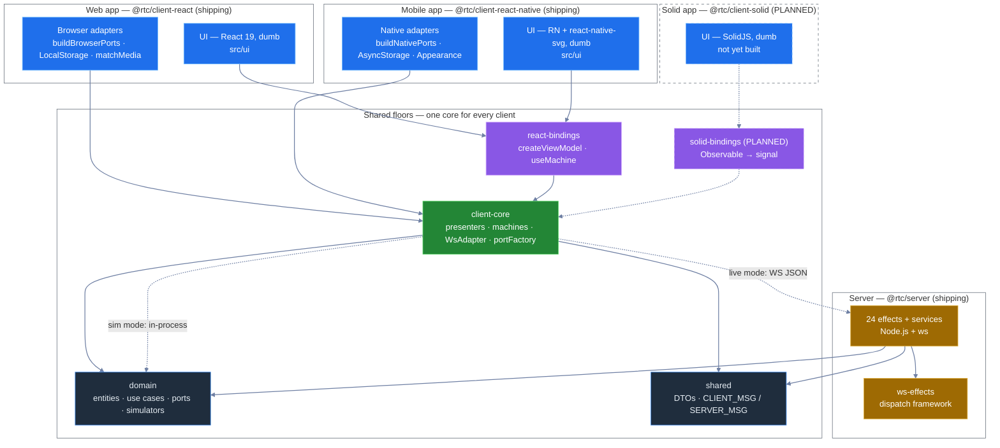

[◀ 12. Architectural Gates](12-architectural-gates.md) · [Architecture Document](../architecture.md) · [14. Composition & Wiring ▶](14-composition-and-wiring.md)

## 13. Codebase Map

§§1–12 explain the *rules* -- the dependency rule, the rings, the gates. This section is the *map*: what's actually in the repo, at three zoom levels, plus a matrix of exactly what's reused verbatim versus adapted across the three client apps and the server.

### 13.1 L0 -- The System On One Screen

Nine workspace packages plus `tests`, drawn as five "buildings": two shipping client apps, one planned client, the shared floors every client stands on, and the server. `@rtc/client-prototype` is omitted here too (as in [§1.3.1](01-overview.md#131-clean-architecture-concretely----which-package-is-which-ring)) -- it is a design-comprehension island with zero `@rtc/*` edges into this graph.



Two runtime modes both terminate in `client-core`, never in the UI: **simulator mode** runs `@rtc/domain`'s simulators in-process (dashed-free solid edge `core --> domain`, taken via `createSimulatorPorts`); **live mode** routes the same port interfaces over a `WsAdapter` to `@rtc/server`, which hosts the *identical* simulator classes behind `@rtc/ws-effects`. Full detail: [§7 Runtime Topology](07-communication-patterns.md#runtime-topology-what-runs-when).

### 13.2 L1 -- The Package Line Map

One card per package -- what it is, which ring it sits in ([§1.3.1](01-overview.md#131-clean-architecture-concretely----which-package-is-which-ring)), its real `dependencies` (verified against each `package.json`), who consumes it, and one fact that isn't obvious from the name. The authoritative, always-current detail for each package lives in its own README; these cards are the map, not the territory.

#### `@rtc/domain`

| | |
|---|---|
| **What it is** | Entities, use cases, port interfaces, and simulators -- pure TypeScript, the innermost package. |
| **Ring** | ①② Entities & Use Cases -- the yolk |
| **Depends on** | `rxjs` only (`packages/domain/package.json` `dependencies`) |
| **Consumed by** | `shared`, `client-core`, `react-bindings`, `client-react`, `client-react-native`, `server`, `tests` -- every workspace package except the two rxjs-only/no-`@rtc` islands (`ws-effects`, `client-prototype`) lists `@rtc/domain` directly |
| **Non-obvious** | `src/simulators/` is ring ③ (gateways), not ring ①②, even though it lives inside this package -- and they're production code, not test doubles ([§10](10-key-design-decisions.md#10-key-design-decisions)). The single-dependency constraint (`rxjs` only) is enforced by pnpm strict mode, not just convention. |
| **README** | [`packages/domain/README.md`](../../packages/domain/README.md) |

#### `@rtc/shared`

| | |
|---|---|
| **What it is** | Wire-protocol DTOs and the `CLIENT_MSG`/`SERVER_MSG` envelope types shared by client and server. |
| **Ring** | ③ Interface Adapters -- boundary DTOs |
| **Depends on** | `@rtc/domain` only (`packages/shared/package.json` `dependencies`) |
| **Consumed by** | `client-core`, `server` -- *not* `client-react` or `client-react-native` directly (neither lists it; see the wire-protocol row of [§13.4](#134-the-reuse-matrix)) |
| **Non-obvious** | Ships a second public entry point, `./__fixtures__/wireFrames` (`packages/shared/package.json` `exports`) -- wire-format test fixtures are a first-class export, not a buried internal helper. |
| **README** | [`packages/shared/README.md`](../../packages/shared/README.md) |

#### `@rtc/client-core`

| | |
|---|---|
| **What it is** | The framework-free application core: composition root, presenters, state machines, `WsAdapter` + `portFactory`. |
| **Ring** | ③ Interface Adapters -- presenters, gateways, ViewModel wiring |
| **Depends on** | `@rtc/domain`, `@rtc/shared`, `rxjs`, `@rx-state/core` (`packages/client-core/package.json` `dependencies`) |
| **Consumed by** | `react-bindings`, `client-react`, `client-react-native`, `tests` |
| **Non-obvious** | Zero framework imports -- no React, no DOM types, no React Native -- despite being consumed by three UI-facing packages ([§1.3](01-overview.md#13-layered-architecture--terminology)); machine-enforced by dependency-cruiser's `client-core-stays-inner` + `client-core-framework-free` pair rules ([§6](06-package-dependencies.md#6-package-dependencies)). |
| **README** | [`packages/client-core/README.md`](../../packages/client-core/README.md) |

#### `@rtc/react-bindings`

| | |
|---|---|
| **What it is** | The one package that knows both worlds: `createViewModel`, `useMachine`, `ViewModelProvider`/`useViewModel`. |
| **Ring** | ③ Interface Adapters -- ViewModel bridge |
| **Depends on** | `@react-rxjs/core`, `@rtc/client-core`, `@rtc/domain`, `react`, `rxjs` (`packages/react-bindings/package.json` `dependencies`) |
| **Consumed by** | `client-react`, `client-react-native` |
| **Non-obvious** | The *only* package permitted to depend on both React and the core's RxJS streams ([§6](06-package-dependencies.md#6-package-dependencies)) -- kept small (~850 LOC, [§2.3](02-c4-model.md#23-component-diagram----web-client)) precisely so a `@rtc/solid-bindings` sibling is roughly a day's work. |
| **README** | [`packages/react-bindings/README.md`](../../packages/react-bindings/README.md) |

#### `@rtc/client-react`

| | |
|---|---|
| **What it is** | The web client: dumb React 19 UI (`src/ui`) + browser-specific platform adapters (`src/app`). |
| **Ring** | ④ Frameworks & Drivers (`src/ui`) + ③ platform adapters (`src/app/adapters`) |
| **Depends on** | `@rtc/client-core`, `@rtc/domain`, `@rtc/react-bindings`, `react`, `react-dom`, `rxjs`, `motion`, `@fontsource/*` (`packages/client-react/package.json` `dependencies`) |
| **Consumed by** | `tests` (`@rtc/tests` workspace) |
| **Non-obvious** | Depends on `@rtc/domain` directly, not only transitively through `client-core` -- e.g. `ThemeMode`/`ThemeSkin` types are imported straight from `@rtc/domain` in `src/ui/shell/theme/tokens.ts`. `rxjs` is a listed runtime dependency but appears only in `src/app` (e.g. `MediaQueryColorSchemeAdapter`); it is machine-banned from `src/ui` by gate 26. |
| **README** | [`packages/client-react/README.md`](../../packages/client-react/README.md) |

#### `@rtc/client-react-native`

| | |
|---|---|
| **What it is** | The mobile client: dumb Expo/RN UI (`src/ui`) + native-specific platform adapters (`src/app`). |
| **Ring** | ④ Frameworks & Drivers (`src/ui`) + ③ platform adapters (`src/app/adapters`) |
| **Depends on** | `@rtc/client-core`, `@rtc/domain`, `@rtc/react-bindings`, `react`, `react-dom`, `react-native`, `react-native-svg`, `@react-native-async-storage/async-storage`, `rxjs`, `expo` + six `expo-*` modules (router · constants · dev-client · font · linking · status-bar), `@expo-google-fonts/*`, + 2 more RN runtime packages (`react-native-screens`, `react-native-safe-area-context`) -- 22 in total (`packages/client-react-native/package.json` `dependencies`) |
| **Consumed by** | Nothing in-workspace -- it is a leaf app, and unlike `client-react` it is *not* a `tests` dependency (`tests/package.json` lists `@rtc/client-react` but not `@rtc/client-react-native`) |
| **Non-obvious** | `rxjs` is a listed runtime dep and appears in `src/app/adapters` (e.g. `AppearanceColorSchemeAdapter` returns `Observable<boolean>`) but never in `src/ui` -- the same dumb-UI discipline as web, now machine-gated here too by gates 30–33, the RN counterpart of gates 26–29 on `client-react/src/ui`. Its own suite runs vitest + jest-expo; it isn't exercised by the root `tests` e2e/presenter/fullstack suites, and RN e2e (Maestro) is a deferred workstream. |
| **README** | [`packages/client-react-native/README.md`](../../packages/client-react-native/README.md) |

#### `@rtc/client-prototype`

| | |
|---|---|
| **What it is** | A readable React 19 port of the `docs/design/v2` standalone design artifact -- a comprehension aid, not a shipping client. |
| **Ring** | None -- a design island, explicitly excluded from the ring diagrams ([§1.3.1](01-overview.md#131-clean-architecture-concretely----which-package-is-which-ring)) |
| **Depends on** | `react`, `react-dom` only (`packages/client-prototype/package.json` `dependencies`) -- zero `@rtc/*` imports, machine-enforced by dependency-cruiser's `prototype-isolated` rule ([§6](06-package-dependencies.md#6-package-dependencies)) |
| **Consumed by** | Nothing -- no other `package.json` in the workspace lists `@rtc/client-prototype` |
| **Non-obvious** | Its `src/mock/` folder generates data via seeded random walks; it never touches `@rtc/domain`'s simulators, so it can drift visually from the real app without breaking anything -- the tradeoff for total framework isolation. |
| **README** | [`packages/client-prototype/README.md`](../../packages/client-prototype/README.md) |

#### `@rtc/ws-effects`

| | |
|---|---|
| **What it is** | A small declarative RxJS effects framework for dispatching WebSocket messages -- `WsEffect`, `stream()`/`rpc()`, `combineEffects`. |
| **Ring** | ④ Frameworks & Drivers -- the dispatch framework |
| **Depends on** | `rxjs` only (`packages/ws-effects/package.json` `dependencies`) |
| **Consumed by** | `server` only (`packages/server/package.json` lists `@rtc/ws-effects`; no client package does) |
| **Non-obvious** | Follows the exact same single-dependency (`rxjs`-only) constraint as `@rtc/domain`, per `CLAUDE.md`, despite living in the outermost ring -- purity isn't reserved for the domain. |
| **README** | [`packages/ws-effects/README.md`](../../packages/ws-effects/README.md) |

#### `@rtc/server`

| | |
|---|---|
| **What it is** | The WebSocket server: a thin Node.js host composed of 24 declarative effects over `@rtc/ws-effects`. |
| **Ring** | ④ host (`src/index.ts`, `node:http` + `ws`) + ③ effects/gateways (`src/effects/`, `src/socket/`'s `toSocket`) |
| **Depends on** | `@rtc/domain`, `@rtc/shared`, `@rtc/ws-effects`, `rxjs`, `ws` (`packages/server/package.json` `dependencies`) |
| **Consumed by** | `tests` |
| **Non-obvious** | Never imports `@rtc/client-core` (`grep -rln "@rtc/client-core" packages/server/src` returns nothing) -- server and clients share only `domain`/`shared`, enforced as a hard boundary by dependency-cruiser's `client-not-server`/`server-not-client` rules ([§6](06-package-dependencies.md#6-package-dependencies)). It also skips `domain`'s `usecases/` entirely (`grep -rn "UseCase" packages/server/src` returns nothing) -- use cases are client-orchestration; the server drives simulators directly. |
| **README** | [`packages/server/README.md`](../../packages/server/README.md) |

#### `tests` (the 10th card -- not a package, the behavioural-insurance layer)

| | |
|---|---|
| **What it is** | Cross-package browser e2e, presenter-integration, and full-stack smoke suites, plus the architectural grep gates ([§12](12-architectural-gates.md#12-architectural-gates)). |
| **Ring** | N/A -- sits outside the rings entirely, exercising them from the outside |
| **Depends on** | `@rtc/client-core`, `@rtc/client-react`, `@rtc/domain`, `@rtc/server`, `rxjs`, `ws` (`tests/package.json` `dependencies`) |
| **Consumed by** | Nothing -- it is the root of the dependency graph, not a dependency of anything |
| **Non-obvious** | Deliberately excludes `@rtc/client-react-native`, `@rtc/react-bindings`, `@rtc/shared`, `@rtc/ws-effects`, and `@rtc/client-prototype` as direct dependencies -- those are exercised only transitively (through `client-react`/`server`) or by their own package-local `test` script, not by this workspace's e2e/presenter/fullstack suites. |
| **README** | [`tests/README.md`](../../tests/README.md) |

### 13.3 L2 -- Module Maps

A compressed shape of each package's `src/` -- folder names and one-word roles, not an inventory. **The authoritative, file-by-file module detail lives in each package's own README** (linked above); these trees exist only to orient a reader before they open one.

`@rtc/domain`:
```
src/
├── fx/ credit/ equities/    entities — per-domain business rules
├── connection/ analytics/    entities — cross-cutting (status, positions)
├── preferences/ telemetry/    entities — app-level settings & metrics
├── ports/                     interfaces — dependency-inverted boundaries
├── usecases/                  orchestration — the 12 application business rules
└── simulators/                 gateways — production in-memory port impls
```

`@rtc/shared`:
```
src/
├── fx/            DTOs — pricing · execution · analytics · blotter · reference data
├── credit/         DTOs — dealer · instrument · workflow
├── protocol/        wire envelope — CLIENT_MSG/SERVER_MSG · rpc correlation · sow
└── __fixtures__/     wireFrames — public fixture export for consumers
```

`@rtc/client-core`:
```
src/
├── presenters/    ~40 presenters & state machines — the business logic
├── adapters/       WsAdapter, portFactory, wsReal* gateways
├── layout/          layout port + default layout data
└── theme/           ColorSchemeSource app-port (OS dark/light signal)
```

`@rtc/react-bindings` (flat -- no subfolders):
```
src/
├── createViewModel.ts    the ~60 use* hooks factory (bind + useMachine + commands)
├── useMachine.ts          per-mount RxJS machine → hook bridge
├── ViewModelContext.ts    the seam: context + type only
├── ViewModelProvider.tsx  injector — imported ONLY by AppRoot
└── useViewModel.ts        the accessor components import
```

`@rtc/client-react`:
```
src/
├── app/            composition root — AppRoot, buildBrowserPorts, adapters/, theme/
├── ui/fx/          tiles · blotter · analytics · positions
├── ui/credit/      RFQ form · RFQ tiles · sell-side panel
├── ui/equities/    watchlist · candles · depth · ticket · blotters
├── ui/admin/       KPIs · throughput · latency · topology · event log
└── ui/shell/       layout engine · header · boot gate · lock screen
```

`@rtc/client-react-native`:
```
src/
├── app/              composition root — AppRoot, buildNativePorts, adapters/
├── ui/ (top-level)   SpotTile · TileGrid · Blotter · TradeTicket · ConnectionBanner
├── ui/credit/         RFQ form · RFQ tiles · sell-side panel
├── ui/equities/        markets · trade ticket · blotters
├── ui/analytics/        PnL chart · exposure bubbles (react-native-svg)
├── ui/shell/             boot sequence · lock screen · appearance overlay
└── ui/theme/              rnThemeTokens · ThemeProvider · DepthTokens
```

`@rtc/client-prototype`:
```
src/
├── fx/ credit/ equities/ admin/    per-domain screen ports (readable React re-implementation)
├── shell/                           boot · header · lock screen · ambient background
├── layout/                           workspace layout port
├── mock/                              seeded random-walk mock data (no domain, no rxjs)
├── motion/                             animation helpers
└── theme/                               design tokens
```

`@rtc/ws-effects` (flat -- no subfolders):
```
src/
├── types.ts             WsEffect primitive — (in$, ctx) => out$
├── stream.ts, rpc.ts      subscription fan-out · correlated ack/nack sugar
├── operators.ts            out() / matchType() message helpers
├── combineEffects.ts       merges effects over one shared inbound stream
└── createWsListener.ts      wires a Socket to combined effects, teardown on closed$
```

`@rtc/server`:
```
src/
├── effects/        24 declarative WsEffects — fx · credit · admin · equities
├── services/         serviceContainer (12 simulators/services) · ThroughputService
├── socket/            toSocket adapter · protocol · FakeWs test helper
├── auth.ts             WS-upgrade token check
└── index.ts             composition root — http server + combineEffects + listen
```

`tests` (not a package, included for orientation):
```
tests/
├── browser/       playwright · cypress · *-cucumber variants + shared browser/steps
├── presenter/      cucumber · cucumber-fake-timers · vitest-fake-timers · vitest-quickpickle-fake-timers
├── fullstack/       node-smoke · browser-smoke against the REAL server
├── scripts/          grep-gates · run-all · with-server · free-port
└── specs/             shared .feature Gherkin files
```

### 13.4 The Reuse Matrix

What's shared verbatim, what's adapted per platform, and what doesn't apply -- verified by grepping each app's actual imports, not by reading intent off a diagram.

| Concern | `client-react` | `client-react-native` | `client-solid` (planned) | `server` |
|---|---|---|---|---|
| Ports (`domain/src/ports/`) | ✅ | ✅ | ✅ | ✅ |
| Use cases (`domain/src/usecases/`) | ✅ | ✅ | ✅ | — |
| Presenters (`client-core/src/presenters/*Presenter.ts`) | ✅ | ✅ | ✅ | — |
| Machines (`client-core/src/presenters/*Machine.ts`) | ✅ | ✅ | ✅ | — |
| Simulators (`domain/src/simulators/`) | ✅ | ✅ | ✅ | ✅ |
| WsAdapter + port factories (`client-core/src/adapters/`) | ✅ | ✅ | ✅ | — |
| Theme (skin/mode preference + tokens) | 🔧[^1] | 🔧[^1] | 🔧[^1] | — |
| Wire protocol (`shared/src/protocol/`) | ✅[^2] | ✅[^2] | ✅[^2] | ✅ |
| ws-effects framework (`@rtc/ws-effects`) | — | — | — | ✅ |
| ViewModel bindings (`createViewModel`/`useMachine`/`useViewModel`) | ✅ | ✅ | 🔧[^3] | — |

[^1]: The preference presenter (`ThemeSkinPreferencePresenter`/`ThemePreferencePresenter`, `packages/client-core/src/presenters/`) is shared verbatim by every UI. What's adapted is the token *rendering*: `client-react` applies CSS custom properties from `packages/client-react/src/ui/shell/theme/tokens.ts` via `:root`; `client-react-native` delivers a plain-object `rnThemeTokens` tree (plus an RN-only `DepthTokens` shadow/elevation descriptor, since RN can't express layered/inset box-shadows) from `packages/client-react-native/src/ui/theme/tokens.ts` via React context. A planned `client-solid` would need the same third rendering strategy.
[^2]: Consumed transitively, not directly: neither `client-react` nor `client-react-native` lists `@rtc/shared` as a dependency or imports `CLIENT_MSG`/`SERVER_MSG` anywhere in `src/` (`grep -rln "@rtc/shared" packages/client-react/src packages/client-react-native/src` returns nothing) -- only `client-core`'s `WsAdapter`/`wsReal*` adapters touch it. A planned `client-solid` would inherit the same indirection by reusing `client-core`.
[^3]: `client-solid` is planned to get a sibling package `@rtc/solid-bindings` (Observable → signal), not a reuse of `@rtc/react-bindings` -- `docs/architecture/06-package-dependencies.md` draws `solidc -.-> sb` and `sb -.-> core`, i.e. a new framework-specific bridge binding the *same*, unmodified `client-core`. This is the multi-client proof in miniature: only the bridge and the UI change; everything below stays put ([§8.1](08-replaceability-matrix.md#81-the-multi-client-proof--the-solidjs-plan)).

**What each app adds on top of the shared floors:**

- **Web** (`client-react`): browser platform adapters (`buildBrowserPorts`, `LocalStoragePreferencesAdapter`, `MediaQueryColorSchemeAdapter`), the CSS-Modules-driven HUD, Vite as the build tool.
- **Mobile** (`client-react-native`): native platform adapters (`buildNativePorts`, `AsyncStoragePreferencesAdapter`, `AppearanceColorSchemeAdapter`), `react-native-svg`-rendered skins, Expo/`expo-router` for build and navigation.
- **Server** (`server`): the 24 `@rtc/ws-effects` effects and their `serviceContainer` services -- the one place the domain simulators are wired to a live network socket instead of an in-process port.

---
