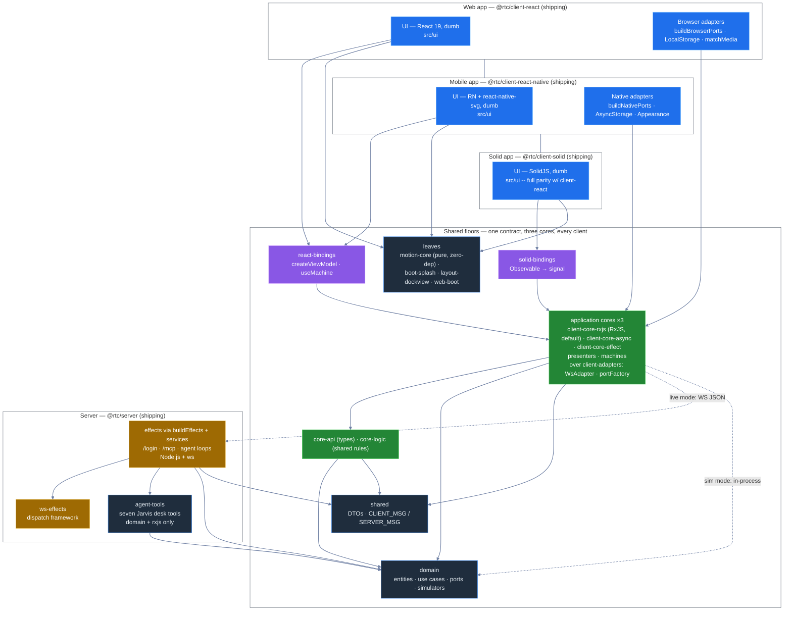

[◀ 12. Architectural Gates](12-architectural-gates.md) · [Architecture Document](../architecture.md) · [14. Composition & Wiring ▶](14-composition-and-wiring.md)

## 13. Codebase Map

§§1–12 explain the *rules* -- the dependency rule, the rings, the gates. This section is the *map*: what's actually in the repo, at three zoom levels, plus a matrix of exactly what's reused verbatim versus adapted across the three client apps, the server and the two alternative application cores.

### 13.1 L0 -- The System On One Screen

Twenty-seven workspace packages plus `tests`, drawn as five "buildings": three shipping client apps, the shared floors every client stands on, and the server. `@rtc/client-prototype` is omitted here too (as in [§1.3.1](01-overview.md#131-clean-architecture-concretely----which-package-is-which-ring)) -- it is a design-comprehension island with zero `@rtc/*` edges into this graph. The view leaves *do* appear (as `leaves`: `@rtc/motion-core`, `@rtc/boot-splash`, `@rtc/layout-dockview`, `@rtc/web-boot`) since the clients genuinely depend on them, and the three application cores appear as one box, since they are interchangeable implementations of one contract ([§22](22-pluggable-application-core.md#22-pluggable-application-core)). `@rtc/ui-contract`, `@rtc/core-contract` and the four devtools packages are omitted from this L0 view for the same reason as `client-prototype` -- they exist to test/instrument the graph below, not to run inside it; each gets its own L1 card.


```mermaid
flowchart TB
    subgraph WebApp["Web app — @rtc/client-react (shipping)"]
        webUi["UI — React 19, dumb<br/>src/ui"]:::ui
        webAdapt["Browser adapters<br/>buildBrowserPorts · LocalStorage · matchMedia"]:::ui
    end

    subgraph MobileApp["Mobile app — @rtc/client-react-native (shipping)"]
        rnUi["UI — RN + react-native-svg, dumb<br/>src/ui"]:::ui
        rnAdapt["Native adapters<br/>buildNativePorts · AsyncStorage · Appearance"]:::ui
    end

    subgraph SolidApp["Solid app — @rtc/client-solid (shipping)"]
        solidUi["UI — SolidJS, dumb<br/>src/ui -- full parity w/ client-react"]:::ui
    end

    subgraph SharedFloors["Shared floors — one contract, three cores, every client"]
        rb["react-bindings<br/>createViewModel · useMachine"]:::bridge
        sb["solid-bindings<br/>Observable → signal"]:::bridge
        core["application cores ×3<br/>client-core-rxjs (RxJS, default) · client-core-async · client-core-effect<br/>presenters · machines<br/>over client-adapters: WsAdapter · portFactory"]:::core
        api["core-api (types) · core-logic (shared rules)"]:::core
        domain["domain<br/>entities · use cases · ports · simulators"]:::domain
        shared["shared<br/>DTOs · CLIENT_MSG / SERVER_MSG"]:::domain
        motion["leaves<br/>motion-core (pure, zero-dep) ·<br/>boot-splash · layout-dockview · web-boot"]:::domain
    end

    subgraph Server["Server — @rtc/server (shipping)"]
        srv["effects via buildEffects + services<br/>/login · /mcp · agent loops<br/>Node.js + ws"]:::server
        wse["ws-effects<br/>dispatch framework"]:::server
        agt["agent-tools<br/>seven Jarvis desk tools<br/>domain + rxjs only"]:::domain
    end

    webUi --> rb
    webUi --> motion
    webAdapt --> core
    rnUi --> rb
    rnUi --> motion
    rnAdapt --> core
    solidUi --> sb
    solidUi --> motion
    rb --> core
    sb --> core
    core --> api
    core --> domain
    core --> shared
    api --> domain
    api --> shared
    core -. "live mode: WS JSON" .-> srv
    core -. "sim mode: in-process" .-> domain
    srv --> wse
    srv --> agt
    srv --> domain
    srv --> shared
    agt --> domain

    %% stack the three app buildings vertically (edge-less subgraphs would tile side by side)
    WebApp ~~~ MobileApp
    MobileApp ~~~ SolidApp

    classDef ui fill:#1f6feb,stroke:#79c0ff,color:#ffffff
    classDef bridge fill:#8957e5,stroke:#d2a8ff,color:#ffffff
    classDef core fill:#238636,stroke:#56d364,color:#ffffff
    classDef server fill:#9e6a03,stroke:#e3b341,color:#ffffff
    classDef domain fill:#1f2d3d,stroke:#4493f8,color:#e6edf3
    style WebApp fill:transparent,stroke:#6e7681
    style MobileApp fill:transparent,stroke:#6e7681
    style SolidApp fill:transparent,stroke:#6e7681
    style SharedFloors fill:transparent,stroke:#6e7681
    style Server fill:transparent,stroke:#6e7681
    linkStyle default stroke:#6e7fa3,stroke-width:1.5px
```

Two runtime modes both terminate in the application core, never in the UI (the RxJS core's port factories build the ports; whichever core is loaded consumes them): **simulator mode** runs `@rtc/domain`'s simulators in-process (dashed-free solid edge `core --> domain`, taken via `createSimulatorPorts`); **live mode** routes the same port interfaces over a `WsAdapter` to `@rtc/server`, which hosts the *identical* simulator classes behind `@rtc/ws-effects`. Full detail: [§7 Runtime Topology](07-communication-patterns.md#runtime-topology-what-runs-when).

### 13.2 L1 -- The Package Line Map

One card per package -- what it is, which ring it sits in ([§1.3.1](01-overview.md#131-clean-architecture-concretely----which-package-is-which-ring)), its real `dependencies` (verified against each `package.json`), who consumes it, and one fact that isn't obvious from the name. The authoritative, always-current detail for each package lives in its own README; these cards are the map, not the territory.

#### `@rtc/domain`

| | |
|---|---|
| **What it is** | Entities, use cases, port interfaces, and simulators -- pure TypeScript, the innermost package. |
| **Ring** | ①② Entities & Use Cases -- the yolk |
| **Depends on** | `rxjs` only (`packages/domain/package.json` `dependencies`) |
| **Consumed by** | `shared`, `core-api`, `core-logic`, `core-contract`, the three cores, both bindings, `ui-contract`, the three clients, `server`, `agent-tools`, `tests` -- every workspace package except the zero-`@rtc`-dependency islands (`ws-effects`, `client-prototype`, `motion-core`, `boot-splash`, `layout-dockview`) and the four devtools packages lists `@rtc/domain` directly |
| **Non-obvious** | `src/simulators/` is ring ③ (gateways), not ring ①②, even though it lives inside this package -- and they're production code, not test doubles ([§10](10-key-design-decisions.md#10-key-design-decisions)). The single-dependency constraint (`rxjs` only) is enforced by pnpm strict mode, not just convention. |
| **README** | [`packages/domain/README.md`](../../packages/domain/README.md) |

#### `@rtc/shared`

| | |
|---|---|
| **What it is** | Wire-protocol DTOs and the `CLIENT_MSG`/`SERVER_MSG` envelope types shared by client and server, plus the transport-neutral scripted Jarvis brain (`src/jarvis/`) -- shared by the sim-mode client adapter and the server's `ScriptedAgentLoop`. |
| **Ring** | ③ Interface Adapters -- boundary DTOs |
| **Depends on** | `@rtc/domain`, `@rtc/motion-core` (+ `rxjs`) (`packages/shared/package.json` `dependencies`) |
| **Consumed by** | `client-adapters`, `core-logic`, `server`, `tests`, and two of the RxJS core's tests. Never by `core-api` or the UI side (the clients, both bindings, `ui-contract`): what they name is domain vocabulary (dependency-cruiser `ui-never-imports-shared` and `core-api-stays-inner`; see the wire-protocol row of [§13.4](#134-the-reuse-matrix)) |
| **Non-obvious** | Ships a second public entry point, `./__fixtures__/wireFrames` (`packages/shared/package.json` `exports`) -- wire-format test fixtures are a first-class export, not a buried internal helper. |
| **README** | [`packages/shared/README.md`](../../packages/shared/README.md) |

#### `@rtc/client-adapters`

| | |
|---|---|
| **What it is** | The ports every application core consumes, and the factories that build them: `WsAdapter` + `portFactory` (`createSimulatorPorts` / `createWsRealPorts`), the auth adapters, the session and data-source stores. No core lives here; until 2026-10-04 it also held the RxJS core. To be renamed `@rtc/client-adapters` (ADR-006 Follow-up 10). |
| **Ring** | ③ Interface Adapters -- gateways and port assembly |
| **Depends on** | `@rtc/core-api`, `@rtc/core-logic`, `@rtc/domain`, `@rtc/shared`, `rxjs` (`packages/client-adapters/package.json` `dependencies`) |
| **Consumed by** | The three clients and `tests`; a devDependency (test adapters, through the root index and the `./testing` entry) of the three cores and both bindings |
| **Non-obvious** | Zero framework imports and zero core imports: a core is a sibling that receives these ports as `createApp(ports)`'s argument. Machine-enforced by dependency-cruiser's `client-adapters-stays-inner` + `client-adapters-framework-free` pair rules ([§6](06-package-dependencies.md#6-package-dependencies)). |
| **README** | [`packages/client-adapters/README.md`](../../packages/client-adapters/README.md) |

#### `@rtc/client-core-rxjs`

| | |
|---|---|
| **What it is** | The RxJS application core -- the default one of three that implement `@rtc/core-api`: composition root, presenters, state machines. A package of its own since 2026-10-04, a sibling of the two below. |
| **Ring** | ③ Interface Adapters -- presenters and machines, ViewModel wiring |
| **Depends on** | `@rtc/core-api`, `@rtc/core-logic`, `@rtc/domain`, `rxjs`, `@rx-state/core` (`packages/client-core-rxjs/package.json` `dependencies`; `@rtc/shared` is a devDependency, for two tests) |
| **Consumed by** | `client-react`, `client-solid` -- as a lazy chunk, loaded only when chosen ([§22](22-pluggable-application-core.md#selection-at-load-time)); `client-react-native`, statically; `ui-contract` and `tests`, whose harnesses compose it; a devDependency of both bindings |
| **Non-obvious** | Takes its ports as arguments: its source imports nothing from `@rtc/client-adapters`, which is a devDependency for test adapters (`cores-take-ports-as-arguments`). Imports no other core (`cores-stay-inner`) and no framework (`cores-framework-free`). A web client's source may not import it statically (`web-clients-load-cores-lazily`). |
| **README** | [`packages/client-core-rxjs/README.md`](../../packages/client-core-rxjs/README.md) |

#### `@rtc/core-api`

| | |
|---|---|
| **What it is** | The types-only application-core contract ([ADR-006](../adr/ADR-006-pluggable-application-core.md)): the `Stream<T>` / `StateStream<S>` aliases, one interface per presenter, every machine's state/intents types, `Machine` / `MachineFactories` / `Presenters` / `AppCommands` / `AppPorts` / `App`, and `CoreFactory`. |
| **Ring** | ③ Interface Adapters -- the plug every core implements, innermost after `domain` |
| **Depends on** | `@rtc/domain`, `rxjs`, `@rx-state/core` (`packages/core-api/package.json` `dependencies`) -- `rxjs` and `@rx-state/core` only for the type aliases (`Stream<T> = Observable<T>`, `StateStream<S> = StateObservable<S>`) |
| **Consumed by** | `core-logic`, `core-contract`, the three cores, both bindings, `ui-contract`, the three clients, `tests` |
| **Non-obvious** | Exports no runtime value at all -- grep gate 42 fails the build on one -- so a client can name "a core" without importing any implementation. `core-api-stays-inner` (dependency-cruiser) keeps it pointing only at `domain`: the Jarvis vocabulary its interfaces carry lives there, so the contract names no wire type. |
| **README** | [`packages/core-api/README.md`](../../packages/core-api/README.md) |

#### `@rtc/core-logic`

| | |
|---|---|
| **What it is** | The pure rules, with no stream library, shared by the three cores and the UIs: the pure folds (`blotterFolds`, `staleFlagFold`, `incidentFold`, …), view derivations, the layout reducer and workspace/Jarvis controllers (`createWorkspaceDock`, `createJarvisController`, …), `createAuthDeps`, and the view helpers a UI calls directly (`blotter/` sort and filter, `admin/adminKpisVm`, `layout/` `lockedWidthPx` · `maximizeBoundaryPath` · `visibleRootOf` -- moved in from `client-core` on 2026-10-04). |
| **Ring** | ③ Interface Adapters -- application rules below the stream shell of each core |
| **Depends on** | `@rtc/core-api`, `@rtc/domain`, `@rtc/shared` (`packages/core-logic/package.json` `dependencies`) -- `core-api` for types only |
| **Consumed by** | The three cores; the three clients and `ui-contract`, which call its view rules directly (`client-react-native` from its visual fakes, which the app bundle includes) |
| **Non-obvious** | A rule written here cannot drift between cores, because there is only one copy ([§23](23-application-cores-explained.md#the-shared-rulebook)). `core-logic-stays-pure` forbids a runtime `rxjs`/`@rx-state` import (grep gate 43 backs it up), and `core-logic-stays-inner` is an allowlist. |
| **README** | [`packages/core-logic/README.md`](../../packages/core-logic/README.md) |

#### `@rtc/client-core-async`

| | |
|---|---|
| **What it is** | The second application core, on `async`/`await` + `AsyncIterable`: a `Store` / `Topic` / `spawn` / `sleep` / `createRunSlot` kernel (`src/kernel/`) and native implementations of every `core-api` member. |
| **Ring** | ③ Interface Adapters -- presenters and machines, like `client-core-rxjs` |
| **Depends on** | `@rtc/core-api`, `@rtc/core-logic`, `@rtc/domain`, `rxjs`, `@rx-state/core` (`packages/client-core-async/package.json` `dependencies`) |
| **Consumed by** | `client-react`, `client-solid` -- as a lazy chunk, loaded only when chosen ([§22](22-pluggable-application-core.md#selection-at-load-time)) |
| **Non-obvious** | `rxjs` is a runtime dependency only because the ports and the bindings speak it: outside `src/bridge/` it may be imported as types only (`bridge-owns-rxjs`, grep gate 43). `@rtc/client-adapters` is a devDependency for test adapters, never a runtime import (`cores-take-ports-as-arguments`). |
| **README** | [`packages/client-core-async/README.md`](../../packages/client-core-async/README.md) |

#### `@rtc/client-core-effect`

| | |
|---|---|
| **What it is** | The third application core, on Effect-TS: a `Layer` graph run by a `ManagedRuntime`, with `Stream` and the `SyncRef` state cell at the edge (`src/bridge/`) and native implementations of every `core-api` member. |
| **Ring** | ③ Interface Adapters -- presenters and machines, like `client-core-rxjs` |
| **Depends on** | `@rtc/core-api`, `@rtc/core-logic`, `@rtc/domain`, `effect`, `rxjs`, `@rx-state/core` (`packages/client-core-effect/package.json` `dependencies`) |
| **Consumed by** | `client-react`, `client-solid` -- as a lazy chunk, loaded only when chosen |
| **Non-obvious** | The only package allowed to import `effect` (`effect-only-in-client-core-effect`); the same `bridge-owns-rxjs` / types-only-outside-`bridge/` rule as the async core, plus `effect-port-subscription-owned-by-the-bridge`. |
| **README** | [`packages/client-core-effect/README.md`](../../packages/client-core-effect/README.md) |

#### `@rtc/core-contract`

| | |
|---|---|
| **What it is** | The behavioural equivalence tier over the cores: `CONTRACT_SUITES`, an exhaustive registry with one suite per `core-api` member, the `PENDING_SUITES` drift check, and a scripted-`AppPorts` harness. |
| **Ring** | ④ -- a test-only leaf, like `ui-contract`, not part of any bundle |
| **Depends on** | `@rtc/core-api`, `@rtc/domain`, `rxjs` (`packages/core-contract/package.json` `dependencies`) |
| **Consumed by** | All three cores, as a **devDependency** -- each runs it from one runner test file |
| **Non-obvious** | Never imports a core, `@rtc/client-core-rxjs` included (`core-contract-stays-neutral`) -- the reference implementation is judged by the contract, not the other way round, and importing it would create a build-order cycle. See [§22](22-pluggable-application-core.md#the-contract-tier). |
| **README** | [`packages/core-contract/README.md`](../../packages/core-contract/README.md) |

#### `@rtc/react-bindings`

| | |
|---|---|
| **What it is** | The one package that knows both worlds: `createViewModel`, `useMachine`, `ViewModelProvider`/`useViewModel`. |
| **Ring** | ③ Interface Adapters -- ViewModel bridge |
| **Depends on** | `@react-rxjs/core`, `@rtc/core-api`, `@rtc/domain`, `react`, `rxjs` (`packages/react-bindings/package.json` `dependencies`); `@rtc/client-adapters` and `@rtc/client-core-rxjs` are devDependencies, for its tests |
| **Consumed by** | `client-react`, `client-react-native` |
| **Non-obvious** | The *only* package permitted to depend on both React and the core's RxJS streams ([§6](06-package-dependencies.md#6-package-dependencies)) -- kept small ([§2.3](02-c4-model.md#23-component-diagram----web-client)) precisely so a `@rtc/solid-bindings` sibling was roughly a day's work, which it was. |
| **README** | [`packages/react-bindings/README.md`](../../packages/react-bindings/README.md) |

#### `@rtc/solid-bindings`

| | |
|---|---|
| **What it is** | The Solid↔RxJS bridge, parallel to `react-bindings`: `createViewModel`, `useMachine`, `ViewModelProvider`/`useViewModel`, implementing the exact same `ViewModel` member list over Solid signals instead of React hooks. |
| **Ring** | ③ Interface Adapters -- ViewModel bridge |
| **Depends on** | `@rtc/core-api`, `@rtc/domain`, `@rx-state/core`, `rxjs`, `solid-js` (`packages/solid-bindings/package.json` `dependencies`); `@rtc/client-adapters` and `@rtc/client-core-rxjs` are devDependencies, for its tests |
| **Consumed by** | `client-solid` (the only client on this bridge -- `react-bindings` and `solid-bindings` never share a client) |
| **Non-obvious** | Not a reuse of `react-bindings` -- a sibling package binding the *same*, unmodified `client-core-rxjs` (the multi-client proof in miniature, [§8.1](08-replaceability-matrix.md#81-the-multi-client-proof--the-solidjs-port)). `useMachine`'s Solid counterpart uses `onCleanup` instead of react-bindings' StrictMode-safe microtask-deferred `dispose()` -- Solid has no StrictMode double-invoke to guard against, so the lifecycle bridge is simpler here, not just differently spelled. It lands within the same order of magnitude of size as `react-bindings`. |
| **README** | [`packages/solid-bindings/README.md`](../../packages/solid-bindings/README.md) |

#### `@rtc/client-react`

| | |
|---|---|
| **What it is** | The web client: dumb React 19 UI (`src/ui`) + the browser composition (`src/app`: `buildBrowserPorts`, the devtools hub, the tree mount); the browser platform adapters live in `@rtc/web-boot`. |
| **Ring** | ④ Frameworks & Drivers (`src/ui`) + the composition root (`src/app`); its ③ platform adapters are in `@rtc/web-boot` |
| **Depends on** | `@rtc/client-adapters`, `@rtc/client-core-rxjs`, `@rtc/client-core-async`, `@rtc/client-core-effect`, `@rtc/core-api`, `@rtc/core-logic`, `@rtc/domain`, `@rtc/react-bindings`, `@rtc/web-boot`, `@rtc/motion-core`, `@rtc/boot-splash`, `@rtc/layout-dockview`, `@rtc/devtools-core`, `react`, `react-dom`, `rxjs`, `motion`, `@fontsource/*` (`packages/client-react/package.json` `dependencies`) |
| **Consumed by** | `tests` (`@rtc/tests` workspace) |
| **Non-obvious** | Depends on `@rtc/domain` directly, not only transitively through `client-core-rxjs` -- e.g. `ThemeMode`/`ThemeSkin` types are imported straight from `@rtc/domain` in `src/ui/shell/theme/tokens.ts`. `rxjs` is a listed runtime dependency but appears only in `src/app` (`buildBrowserPorts.ts`); it is machine-banned from `src/ui` by gate 26. `@rtc/motion-core` (pure FLIP/rank-glide math) and `motion` (the third-party animation library) are two distinct dependencies despite the similar name -- don't confuse them. All three cores are runtime dependencies, and none is in the eager bundle: `@rtc/web-boot`'s `coreSelection.ts` lazy-imports each core on demand (`pnpm check:core-bundle` asserts the split; `web-clients-load-cores-lazily` rejects a static import on source). |
| **README** | [`packages/client-react/README.md`](../../packages/client-react/README.md) |

#### `@rtc/client-react-native`

| | |
|---|---|
| **What it is** | The mobile client: dumb Expo/RN UI (`src/ui`) + native-specific platform adapters (`src/app`). |
| **Ring** | ④ Frameworks & Drivers (`src/ui`) + ③ platform adapters (`src/app/adapters`) |
| **Depends on** | `@rtc/client-adapters`, `@rtc/client-core-rxjs`, `@rtc/core-api`, `@rtc/core-logic`, `@rtc/domain`, `@rtc/react-bindings`, `@rtc/motion-core`, `@rtc/devtools-core`, `react`, `react-dom`, `react-native`, `rxjs`, `expo` + its `expo-*` modules, `@expo-google-fonts/*`, and the RN runtime packages (`react-native-svg`, `@shopify/react-native-skia`, `react-native-reanimated` + `react-native-worklets`, `react-native-gesture-handler`, `react-native-screens`, `react-native-safe-area-context`, `@gorhom/bottom-sheet`, `@react-native-async-storage/async-storage`) -- the full list is `packages/client-react-native/package.json` `dependencies` |
| **Consumed by** | Nothing in-workspace -- it is a leaf app, and unlike `client-react` it is *not* a `tests` dependency (`tests/package.json` lists `@rtc/client-react` but not `@rtc/client-react-native`) |
| **Non-obvious** | `rxjs` is a listed runtime dep and appears in `src/app/adapters` (e.g. `AppearanceColorSchemeAdapter` returns `Observable<boolean>`) but never in `src/ui` -- the same dumb-UI discipline as web, now machine-gated here too by gates 30–33, the RN counterpart of gates 26–29 on `client-react/src/ui`. Its own suite runs vitest + jest-expo; it isn't exercised by the root `tests` e2e/presenter/fullstack suites. It has its own visual goldens, captured on the iOS simulator by two runners (`test:rn:visual:simctl`, `test:rn:visual:maestro`, under `tests/visual/`). It stays on the RxJS core (it depends on `client-core-rxjs` only) and applies the devtools decorators under `__DEV__`, reaching the browser inspector through `@rtc/devtools-relay` (a devDependency). |
| **Styling doctrine** | No CSS on native; StyleSheet.create + useThemedStyles; array-form runtime channel: see [rn-styling.md](../rn-styling.md) |
| **README** | [`packages/client-react-native/README.md`](../../packages/client-react-native/README.md) |

#### `@rtc/client-solid`

| | |
|---|---|
| **What it is** | The SolidJS web client: dumb Solid UI (`src/ui`) + the browser composition (`src/app`: `buildBrowserPorts`, the devtools hub, the tree mount); the browser platform adapters live in `@rtc/web-boot`, at full parity with `@rtc/client-react` -- same contract specs, same visual goldens, same behavioural suites. |
| **Ring** | ④ Frameworks & Drivers (`src/ui`) + the composition root (`src/app`); its ③ platform adapters are in `@rtc/web-boot` |
| **Depends on** | `@rtc/client-adapters`, `@rtc/client-core-rxjs`, `@rtc/client-core-async`, `@rtc/client-core-effect`, `@rtc/core-api`, `@rtc/core-logic`, `@rtc/domain`, `@rtc/solid-bindings`, `@rtc/web-boot`, `@rtc/motion-core`, `@rtc/boot-splash`, `@rtc/layout-dockview`, `@rtc/devtools-core`, `solid-js`, `rxjs`, `@fontsource/*` (`packages/client-solid/package.json` `dependencies`) |
| **Consumed by** | Nothing in-workspace -- like `client-react-native`, it is a leaf app and *not* a `tests` (`@rtc/tests`) dependency; its own suite (contract + one visual tier) runs in-package |
| **Non-obvious** | Asserts against goldens generated only from `client-react`'s renders rather than owning any of its own (`packages/ui-contract/goldens/<tier>/__screenshots__/`) -- a passing Solid visual run is a direct cross-framework pixel match, not a self-comparison ([its README](../../packages/client-solid/README.md)). `@rtc/ui-contract` and `@rtc/devtools-app` are `devDependencies`, not runtime deps -- the former supplies the shared contract specs and visual scenario manifest, the latter the `/devtools/` inspector build. |
| **README** | [`packages/client-solid/README.md`](../../packages/client-solid/README.md) |

#### `@rtc/client-prototype`

| | |
|---|---|
| **What it is** | A readable React 19 port of the `docs/design/web/v2` standalone design artifact -- a comprehension aid, not a shipping client. |
| **Ring** | None -- a design island, explicitly excluded from the ring diagrams ([§1.3.1](01-overview.md#131-clean-architecture-concretely----which-package-is-which-ring)) |
| **Depends on** | `react`, `react-dom` only (`packages/client-prototype/package.json` `dependencies`) -- zero `@rtc/*` imports, machine-enforced by dependency-cruiser's `prototype-isolated` rule ([§6](06-package-dependencies.md#6-package-dependencies)) |
| **Consumed by** | Nothing -- no other `package.json` in the workspace lists `@rtc/client-prototype` |
| **Non-obvious** | Its `src/mock/` folder generates data via seeded random walks; it never touches `@rtc/domain`'s simulators, so it can drift visually from the real app without breaking anything -- the tradeoff for total framework isolation. |
| **README** | [`packages/client-prototype/README.md`](../../packages/client-prototype/README.md) |

#### `@rtc/motion-core`

| | |
|---|---|
| **What it is** | Framework-free, zero-dependency view-layer motion math: FLIP deltas (`flipDeltas`), rank-glide coalescing (`coalesceOrder`, `computeRankDirections`, `sameOrder`), and easing/duration constants. |
| **Ring** | ④ Frameworks & Drivers -- a pure utility consumed directly by a UI shell, not the domain/use-case layer |
| **Depends on** | Nothing -- no runtime `dependencies` at all (`packages/motion-core/package.json`), stricter than the `rxjs`-only exception `domain` and `ws-effects` get |
| **Consumed by** | `client-react` and `client-solid` (e.g. `src/ui/shell/motion/useFlipGrid.ts`, `src/ui/equities/watchlist/useRankGlide.ts`, `src/ui/shell/status/useLiveMetrics.ts`, the equities chart hooks -- the same math, two thin per-framework shells), plus `client-react-native`, `ui-contract`, and `shared` (narrowly: the scripted Jarvis brain's `speechChunks` typed-reveal pacing) |
| **Non-obvious** | Machine-enforced purity via dependency-cruiser's `motion-core-stays-pure` rule ([§6](06-package-dependencies.md#6-package-dependencies)); see [ADR-005](../adr/ADR-005-ui-logic-placement.md) for why this animation math lives here rather than behind the ViewModel. |
| **README** | [`packages/motion-core/README.md`](../../packages/motion-core/README.md) |

#### `@rtc/boot-splash`

| | |
|---|---|
| **What it is** | The framework-free boot/splash feature: the canvas draw engine (`bootCanvas.ts` + six 3D scene variants under `src/variants/`), the reduced-motion/webdriver gate (`bootSplashGate.ts`), and the two `*.module.css` stylesheets. |
| **Ring** | ④ Frameworks & Drivers -- a DOM-touching view leaf |
| **Depends on** | Nothing -- no runtime `dependencies` (`packages/boot-splash/package.json`) |
| **Consumed by** | `client-react`, `client-solid`, each supplying its own thin `BootSequence` / `BootGate` shell |
| **Non-obvious** | Unlike `motion-core`, it *does* touch the DOM (the canvas 2D context, `navigator` / `location`); `boot-splash-stays-pure` forbids any `@rtc/*` import. |
| **README** | [`packages/boot-splash/README.md`](../../packages/boot-splash/README.md) |

#### `@rtc/layout-dockview`

| | |
|---|---|
| **What it is** | The framework-neutral Dockview wrapper behind the `LayoutEngine` preference (default `"dockview"`, [ADR-002](../adr/ADR-002-layout-management-port.md)): `createDockEngine` (seed tree → Dockview layout, opaque-blob restore/serialize, emulated collapse and maximize, `mount` / `mountTab` / `mountActions` hooks) plus `dockview-hud.css`. |
| **Ring** | ④ Frameworks & Drivers -- a DOM-touching view leaf |
| **Depends on** | `dockview` only (`packages/layout-dockview/package.json` `dependencies`) |
| **Consumed by** | `client-react`, `client-solid`, each through a thin `DockviewLayoutEngine` bridge that portal-mounts the panel registries' content |
| **Non-obvious** | `dockview` is confined here by `dockview-only-in-layout-dockview` -- a client importing it directly would leak the engine's vocabulary; `layout-dockview-stays-pure` forbids any `@rtc/*` import. |
| **README** | [`packages/layout-dockview/README.md`](../../packages/layout-dockview/README.md) |

#### `@rtc/web-boot`

| | |
|---|---|
| **What it is** | The boot code both web clients share: the browser adapters (LocalStorage stores, connection events, color scheme), the load-time core selection (`coreSelection.ts`, which holds the three `import()` calls), the core host, the swap cover and the presenter manifest. |
| **Ring** | ③ Interface Adapters -- platform adapters; DOM-touching and framework-free |
| **Depends on** | `@rtc/client-adapters`, `@rtc/client-core-rxjs`, `@rtc/client-core-async`, `@rtc/client-core-effect`, `@rtc/core-api`, `@rtc/devtools-core`, `@rtc/domain`, `rxjs`, `@rx-state/core` (`packages/web-boot/package.json` `dependencies`) |
| **Consumed by** | `client-react`, `client-solid` |
| **Non-obvious** | Reaches a core only through `import()` (`web-clients-load-cores-lazily`) and imports no UI framework (`web-boot-stays-framework-free`). Both clients consume its built `dist`, so a client's test run needs the package rebuilt after an edit to it. |
| **README** | [`packages/web-boot/README.md`](../../packages/web-boot/README.md) |

#### `@rtc/ui-contract`

| | |
|---|---|
| **What it is** | The framework-neutral UI test contract: the shared sociable-RTL harness, the `*.contract.spec.ts` specs, and the visual scenario/fixture manifest -- extracted from `client-react`'s test tree so a second UI framework's test suites can depend on it without depending on `client-react`. |
| **Ring** | ④ Frameworks & Drivers -- a test-only leaf, not part of either client's runtime bundle |
| **Depends on** | `@rtc/client-core-rxjs`, `@rtc/core-api`, `@rtc/core-logic`, `@rtc/domain`, `@rtc/motion-core`, `rxjs` (`packages/ui-contract/package.json` `dependencies`) |
| **Consumed by** | `client-react` and `client-solid`, both as a **devDependency** -- it never appears in either client's `src/` (only their `tests/`) |
| **Non-obvious** | `src/visual/` is the piece with the highest leverage: `scenarios.ts`, `scenarioActions.ts`, `fixtures.ts`, `appData.ts`, `goldenPath.ts`, and `freezeClock.ts` are the single source of truth every visual tier-runner loops over -- adding a scenario here gives all three (react's CI-asserted `playwright` tier, solid's assert-only `playwright` tier, and react's coverage-only `vitest-browser` instrument) the test for free. `src/specs/` holds the shared `*.contract.spec.ts` files (fx/credit/equities/admin/shell), the same set run by each client; each client supplies only its own render-target "swap trio" (`react/` vs `solid/`) that the specs mount against. `goldens/` -- the committed golden PNG trees for the single asserted `playwright` tier, generated only from `client-react` renders -- sits beside `src/` at the package root; it is not compiled, not exported, and not part of the `tsconfig`/knip/biome surface. |
| **README** | [`packages/ui-contract/README.md`](../../packages/ui-contract/README.md) |

#### `@rtc/ws-effects`

| | |
|---|---|
| **What it is** | A small declarative RxJS effects framework for dispatching WebSocket messages -- `WsEffect`, `stream()`/`rpc()`, `combineEffects`. |
| **Ring** | ④ Frameworks & Drivers -- the dispatch framework |
| **Depends on** | `rxjs` only (`packages/ws-effects/package.json` `dependencies`) |
| **Consumed by** | `server` only (`packages/server/package.json` lists `@rtc/ws-effects`; no client package does) |
| **Non-obvious** | Follows the exact same single-dependency (`rxjs`-only) constraint as `@rtc/domain`, per `CLAUDE.md`, despite living in the outermost ring -- purity isn't reserved for the domain. |
| **README** | [`packages/ws-effects/README.md`](../../packages/ws-effects/README.md) |

#### `@rtc/devtools-core`

| | |
|---|---|
| **What it is** | The devtools event protocol, the `DevtoolsHub` collector (registry, dormancy, coalescing, ring buffer), the three composition-root decorators (`instrumentPresenters`, `instrumentMachineFactories`, `instrumentWsAdapter`), and the `BroadcastChannelDuplex` transport adapter. |
| **Ring** | ④ Frameworks & Drivers -- a leaf instrumentation framework, structurally analogous to `ws-effects` |
| **Depends on** | `rxjs` only (`packages/devtools-core/package.json` `dependencies`) |
| **Consumed by** | `devtools-app`, `devtools-extension`, and all three clients (the composition-root decorators; `client-react-native` under `__DEV__` only) |
| **Non-obvious** | Never imports `@rtc/client-adapters` or any other `@rtc/*` package -- it decorates by *structural* shape (`InstrumentableMachine`, `WsAdapterLike`), machine-enforced by dependency-cruiser's `devtools-core-stays-pure` rule ([§6](06-package-dependencies.md#6-package-dependencies)). Dormant cost is one boolean check per tapped emission: `registerStream`/`machineCreated` only write to a registry `Map` until an inspector's `hello` flips the hub live and subscribes everything ([§20.3](20-devtools.md#203-the-dormancy-contract)). |
| **README** | [`packages/devtools-core/README.md`](../../packages/devtools-core/README.md) |

#### `@rtc/devtools-app`

| | |
|---|---|
| **What it is** | The inspector SPA: a Vite + React 19 app, store-first ([§20.12](20-devtools.md#2012-store-first-navigation-v3)) — a navigation tree (All / Presenters→streams / Machines→kind→instance / Wire→msgType) scopes a shared actions list and an Event/State/Diff/Machine context pane — driven entirely by the wire protocol. |
| **Ring** | ④ Frameworks & Drivers -- a leaf tool, not part of the app's own client stack |
| **Depends on** | `@rtc/devtools-core`, `react`, `react-dom` (`packages/devtools-app/package.json` `dependencies`) |
| **Consumed by** | `devtools-extension`, the one package that imports its source (the `InspectorApp`, transpiled by the extension's own Vite build); `client-react` and `client-solid` take only a `devDependency` build-order/dist-path edge to it (§6), never importing its source |
| **Non-obvious** | Never imports `@rtc/client-adapters` or `@rtc/domain` -- it understands only the protocol types from `devtools-core` (dependency-cruiser's `devtools-app-protocol-only` rule, [§6](06-package-dependencies.md#6-package-dependencies)), which is what let the Chrome-extension shell (`@rtc/devtools-extension`, card below) be a thin wrapper around the same app ([§20](20-devtools.md#20-rtc-devtools)). Its own dev server (port 5280) has no same-origin hub to pair with and always renders "disconnected" by design -- the real inspector is served at `/devtools/` from the app's own origin. |
| **README** | [`packages/devtools-app/README.md`](../../packages/devtools-app/README.md) |

#### `@rtc/devtools-extension`

| | |
|---|---|
| **What it is** | An MV3 Chrome DevTools extension: a third `Duplex` transport (`ChromeRuntimeDuplex`, a reconnecting content-script bridge, a tab-keyed background router) that mounts the same `InspectorApp` in an "RTC" DevTools panel. |
| **Ring** | ④ Frameworks & Drivers -- a leaf tool |
| **Depends on** | `@rtc/devtools-core`, `@rtc/devtools-app`, `react`, `react-dom`, `rxjs` (`packages/devtools-extension/package.json` `dependencies`) |
| **Consumed by** | Nothing -- it is loaded unpacked into Chrome |
| **Non-obvious** | Attaches the inspector to any running app, including the deployed build, with no change to the app. `devtools-extension-is-a-leaf` allows it only the two devtools packages. See [§20](20-devtools.md#20-rtc-devtools). |
| **README** | [`packages/devtools-extension/README.md`](../../packages/devtools-extension/README.md) |

#### `@rtc/devtools-relay`

| | |
|---|---|
| **What it is** | A standalone dev-machine WebSocket relay (`relayServer.ts`, `ws://localhost:8790`) bridging the browser inspector to the React Native client. |
| **Ring** | ④ Frameworks & Drivers -- a leaf tool, dev-only |
| **Depends on** | `ws` only (`packages/devtools-relay/package.json` `dependencies`) |
| **Consumed by** | `client-react-native`, as a devDependency |
| **Non-obvious** | Imports no `@rtc/*` package at all (`devtools-relay-standalone`); its partner, `WsRelayDuplex`, lives in `devtools-core` and pairs with it over the wire, not through a package edge. |
| **README** | [`packages/devtools-relay/README.md`](../../packages/devtools-relay/README.md) |

#### `@rtc/agent-tools`

| | |
|---|---|
| **What it is** | The framework-neutral Jarvis desk-tool registry: the seven tools an AI may call over the app's own capabilities (`list_currency_pairs`, `get_price`, `get_price_history`, `get_blotter`, `get_analytics`, `get_service_health`, and the confirm-gated `execute_trade`), each a `name` + `description` + raw-JSON-Schema `inputSchema` + `run(input): Promise<string>`. |
| **Ring** | ③ Interface Adapters -- it adapts domain use cases/ports to an LLM's tool-call idiom, the same way a presenter adapts them to a view |
| **Depends on** | `@rtc/domain` (+ `rxjs`) (`packages/agent-tools/package.json` `dependencies`) |
| **Consumed by** | `server` only (`packages/server/package.json` lists `@rtc/agent-tools`; no client package does) |
| **Non-obvious** | **SDK-free by design** -- no Anthropic SDK, no MCP SDK, no transport imports, so the identical registry serves the WS agent loop and the `/mcp` endpoint, and its tests call `run` straight against the domain simulators with no network anywhere. Every failure returns a *descriptive string*, never a rejected promise: the model must be told "the desk didn't respond in time" so it can say so, rather than being handed a generic turn failure and left to fill the gap from memory. Prices are returned as `toFixed(ratePrecision)` **strings** (plus the `ratePrecision`), because a JSON number drops trailing zeros and makes the persona's "state the price exactly as the tools return it" unsatisfiable. Machine-pinned by dependency-cruiser's `agent-tools-stays-inner` ([§6](06-package-dependencies.md#6-package-dependencies)); see [§18.13](18-jarvis-ai-agent-surface.md#1813-phase-3-shipped--the-real-loop). |
| **README** | — (none yet; the package is two source files, `buildJarvisTools.ts` + `jarvisToolDefinition.ts`) |

#### `@rtc/server`

| | |
|---|---|
| **What it is** | The WebSocket server: a thin Node.js host whose declarative effects over `@rtc/ws-effects` are assembled by `buildEffects(loops)` (`src/effects/index.ts`: FX, Credit, Admin, Equities, plus the `JARVIS_*` effects), with token auth (`src/auth/`), `/login` (`src/http/`), the scripted and Anthropic agent loops (`src/agent/`) and the `/mcp` endpoint (`src/mcp/`). |
| **Ring** | ④ host (`src/index.ts`, `node:http` + `ws`) + ③ effects/gateways (`src/effects/`, `src/agent/`, `src/mcp/`, `src/socket/`'s `toSocket`) |
| **Depends on** | `@rtc/domain`, `@rtc/shared`, `@rtc/ws-effects`, `@rtc/agent-tools`, `@anthropic-ai/sdk`, `@modelcontextprotocol/sdk`, `rxjs`, `ws` (`packages/server/package.json` `dependencies`) |
| **Consumed by** | `tests` |
| **Non-obvious** | Never imports `@rtc/client-adapters` (`grep -rln "@rtc/client-adapters" packages/server/src` returns nothing) -- server and clients share only `domain`/`shared`, enforced as a hard boundary by dependency-cruiser's `client-not-server`/`server-not-client` rules ([§6](06-package-dependencies.md#6-package-dependencies)). It also skips `domain`'s `usecases/` entirely (`grep -rn "UseCase" packages/server/src` still returns nothing) -- use cases are client-orchestration; the server drives simulators directly, and where Jarvis *does* need them it reaches them through `@rtc/agent-tools`, not directly. It is the **only** package allowed to import `@anthropic-ai/sdk` (dependency-cruiser `no-anthropic-sdk-in-inner-packages`, an allowlist over `packages/server/`), and the SDK stays confined to `src/agent/`; `@modelcontextprotocol/sdk` gets the same treatment, confined to `src/mcp/` (`no-mcp-sdk-outside-server`). |
| **README** | [`packages/server/README.md`](../../packages/server/README.md) |

#### `tests` (the last card -- not a package, the behavioural-insurance layer)

| | |
|---|---|
| **What it is** | Cross-package browser e2e, presenter-integration, and full-stack smoke suites, plus the architectural grep gates ([§12](12-architectural-gates.md#12-architectural-gates)). |
| **Ring** | N/A -- sits outside the rings entirely, exercising them from the outside |
| **Depends on** | `@rtc/client-adapters`, `@rtc/client-core-rxjs`, `@rtc/client-react`, `@rtc/core-api`, `@rtc/domain`, `@rtc/server`, `@rtc/shared`, `rxjs`, `ws` (`tests/package.json` `dependencies`) |
| **Consumed by** | Nothing -- it is the root of the dependency graph, not a dependency of anything |
| **Non-obvious** | Deliberately excludes `@rtc/client-solid`, `@rtc/client-react-native`, `@rtc/react-bindings`, `@rtc/ws-effects`, `@rtc/client-prototype` and the alternative cores as direct dependencies -- those are exercised transitively (through `client-react`/`server`), by an environment switch (`RTC_CLIENT_PKG=@rtc/client-solid` reruns the Playwright pair against Solid; `RTC_CORE_IMPL` selects the core), or by their own package-local `test` script. |
| **README** | [`tests/README.md`](../../tests/README.md) |

### 13.3 L2 -- Module Maps

A compressed shape of each package's `src/` -- folder names and one-word roles, not an inventory. **The authoritative, file-by-file module detail lives in each package's own README** (linked above); these trees exist only to orient a reader before they open one.

`@rtc/domain`:
```
src/
├── fx/ credit/ equities/    entities — per-domain business rules
├── connection/ analytics/    entities — cross-cutting (status, positions)
├── preferences/ telemetry/    entities — app-level settings & metrics
├── auth/ boot/                 demo roster · session user · auth TTL · boot cadence
├── jarvis/ workspace/          Jarvis constants + anomaly detector · workspace limits
├── ports/                     interfaces — dependency-inverted boundaries
├── usecases/                  orchestration — the application business rules
└── simulators/                 gateways — production in-memory port impls
```

`@rtc/shared`:
```
src/
├── fx/            DTOs — pricing · execution · analytics · blotter · reference data
├── credit/         DTOs — dealer · instrument · workflow
├── protocol/        wire envelope — CLIENT_MSG/SERVER_MSG · rpc correlation · sow
├── jarvis/           scripted Jarvis brain — ScriptedJarvisEngine, jarvisIntent, jarvisEvent wire types
└── __fixtures__/     wireFrames — public fixture export for consumers
```

`@rtc/core-api` (types only):
```
src/
├── app.ts              Presenters · AppCommands · AppPorts · App · CoreFactory
├── machine.ts           Machine<S,I> · MachineFactories
├── stream.ts             Stream<T> / StateStream<S> aliases
├── presenters/ machines/   one interface / state+intents type set per member
└── adapters.ts layout.ts layoutPresets.ts panelStream.ts   app-port, layout, preset and panel-data types
```

`@rtc/core-logic`:
```
src/
├── presenters/     pure folds + view derivations + Jarvis controller/drive commands
├── layout/          layout reducer · workspace dock · preset controller · persistence
└── adapters/        createAuthDeps · in-memory dock-layout and preset stores
```

`@rtc/client-adapters` (the adapters):
```
src/
├── adapters/        WsAdapter, portFactory (createSimulatorPorts / createWsRealPorts), HttpAuthAdapter, Jarvis adapters, stores
├── wsUrl.ts         buildWsUrl
└── testing.ts       the ./testing entry: FakeWsAdapter · awaitPendingRpc · createFakeConnectionPorts
```

`@rtc/client-core-rxjs` (the RxJS core):
```
src/
├── composition.ts  createApp · createMachineFactories — the composition root
├── presenters/     presenters & state machines, RxJS shells over core-logic rules
├── layout/          the RxJS shells: layout presets · workspace persistence writer
└── ports/           withLoginDelay · readPreferenceNow
```

`@rtc/client-core-async`:
```
src/
├── composition.ts commands.ts   createApp · the two commands
├── kernel/          Store · Topic · spawn · sleep · createRunSlot — the async primitives
├── bridge/           the only place rxjs is a value import (ports in, streams out)
└── presenters/ machines/   native members
```

`@rtc/client-core-effect`:
```
src/
├── composition.ts layers.ts services.ts commands.ts   Layer graph over a ManagedRuntime
├── bridge/           rxjs ↔ Stream, and the SyncRef state cell (in.ts · out.ts · syncRef.ts · peek.ts · rpc.ts)
└── presenters/ machines/   native members (machines/runSlot.ts = createRunSlot)
```

`@rtc/core-contract`:
```
src/
├── registry.ts     CONTRACT_SUITES (one entry per member) + PENDING_SUITES
├── suites/          describe<Member>Contract — one file per member, plus the cross-member suites
└── harness/         scriptPorts · createPendingQueue · withFakeClock · settle
```

`@rtc/react-bindings` (flat -- no subfolders):
```
src/
├── createViewModel.ts    the ~60 use* hooks factory (bind + useMachine + commands)
├── useMachine.ts          per-mount RxJS machine → hook bridge
├── ViewModelContext.ts    the seam: context + type only
├── ViewModelProvider.tsx  injector — imported ONLY by AppRoot
└── useViewModel.ts        the accessor components import
```

`@rtc/solid-bindings` (flat -- no subfolders):
```
src/
├── createViewModel.ts    the same ~60 use* accessor factory, over Solid signals
├── useMachine.ts          per-mount RxJS machine → Solid primitive bridge (onCleanup, not microtask-deferred dispose)
├── toSignal.ts            Observable/StateObservable → Solid signal, the @rx-state/core → signal seam
├── ViewModelContext.ts    the seam: context + type only
├── ViewModelProvider.tsx  injector — imported ONLY by AppRoot
└── useViewModel.ts        the accessor components import
```

`@rtc/client-react`:
```
src/
├── app/            composition root — AppRoot, buildBrowserPorts, adapters/, theme/
├── ui/fx/          tiles · blotter · analytics · positions
├── ui/credit/      RFQ form · RFQ tiles · sell-side panel
├── ui/equities/    watchlist · candles · depth · ticket · blotters
├── ui/admin/       KPIs · throughput · latency · topology · event log
└── ui/shell/       layout engine · header · boot gate · lock screen
```

`@rtc/client-react-native`:
```
src/
├── app/              composition root — AppRoot, buildNativePorts, adapters/
├── ui/ (top-level)   SpotTile · TileGrid · Blotter · TradeTicket · ConnectionBanner
├── ui/credit/         RFQ form · RFQ tiles · sell-side panel
├── ui/equities/        markets · trade ticket · blotters
├── ui/analytics/        PnL chart · exposure bubbles (react-native-svg)
├── ui/shell/             boot sequence · lock screen · appearance overlay
└── ui/theme/              rnThemeTokens · ThemeProvider · DepthTokens
```

`@rtc/client-solid`:
```
src/
├── app/            composition root — AppRoot, buildBrowserPorts, adapters/, theme/
├── ui/fx/          tiles · blotter · analytics · positions
├── ui/credit/      RFQ form · RFQ tiles · sell-side panel
├── ui/equities/    watchlist · candles · depth · ticket · blotters
├── ui/admin/       KPIs · throughput · latency · topology · event log
└── ui/shell/       layout engine · header · boot gate · lock screen · power-saver
```

`@rtc/client-prototype`:
```
src/
├── fx/ credit/ equities/ admin/    per-domain screen ports (readable React re-implementation)
├── shell/                           boot · header · lock screen · ambient background
├── layout/                           workspace layout port
├── mock/                              seeded random-walk mock data (no domain, no rxjs)
├── motion/                             animation helpers
└── theme/                               design tokens
```

`@rtc/boot-splash`:
```
src/
├── bootCanvas.ts        canvas draw engine
├── bootSplashGate.ts     reduced-motion / webdriver gate
├── variants/              six 3D boot scenes
└── styles/                BootGate / BootSequence *.module.css
```

`@rtc/layout-dockview`:
```
src/
├── createDockEngine.ts          the engine: mount · restore/serialize · collapse · maximize
├── dockSeed.ts dockBlob.ts dockGroups.ts dockDropRules.ts   seed-tree conversion, blob, groups, drop rules
├── Hook{Content,Tab,Actions}Renderer.ts   the mount / mountTab / mountActions hooks
└── styles/dockview-hud.css      Dockview chrome restyled as the in-house panel chrome
```

`@rtc/web-boot`:
```
src/
├── bootApp.ts coreSelection.ts      the pre-boot resolve-and-load (the three import() calls)
├── coreHost.ts coreSwapCover.ts coreSwapView.ts coverTimings.ts   the core host and its swap cover
├── adapters/                        LocalStorage stores, browser connection events
├── theme/                           MediaQueryColorSchemeAdapter
└── devtools/                        presenterManifest
```

`@rtc/motion-core` (flat -- no subfolders):
```
src/
├── flip.ts            flipDeltas + FLIP_*/EXIT_* easing/duration constants
├── rankGlide.ts        coalesceOrder · computeRankDirections · sameOrder + GLIDE_*/HIGHLIGHT_* constants
└── reducedMotion.ts     REDUCED_MOTION_QUERY -- shared prefers-reduced-motion media query string
```

`@rtc/ui-contract`:
```
src/
├── specs/fx/ credit/ equities/ admin/ shell/    the shared *.contract.spec.ts files, sociable RTL over a render-target prop
├── shared/harness/, shared/pages/                mount helper + Page-Object-ish query helpers, framework-neutral
├── shared/components.ts, shared/mount.ts          the render-target seam each client's swap-trio implements
└── visual/     scenarios.ts · scenarioActions.ts · fixtures.ts · appData.ts · goldenPath.ts · freezeClock.ts
                 — the manifest + interaction table + fixture data both clients' visual tiers loop over
```

`@rtc/agent-tools` (flat -- no subfolders):
```
src/
├── jarvisToolDefinition.ts   the tool shape: name · description · JSON Schema inputSchema · run()
└── buildJarvisTools.ts        the seven desk tools over injected domain ports
```

`@rtc/ws-effects` (flat -- no subfolders):
```
src/
├── types.ts             WsEffect primitive — (in$, ctx) => out$
├── stream.ts, rpc.ts      subscription fan-out · correlated ack/nack sugar
├── operators.ts            out() / matchType() message helpers
├── combineEffects.ts       merges effects over one shared inbound stream
└── createWsListener.ts      wires a Socket to combined effects, teardown on closed$
```

`@rtc/devtools-core`:
```
src/
├── protocol.ts               DevtoolsEvent / AppToInspector / InspectorToApp / PresenterManifest
├── serialize.ts                depth/array/string caps + Map/Set tagged encodings
├── diff.ts                       diffSerialized — structural diff over two SerializedValue trees
├── DevtoolsHub.ts               registry · dormancy · coalescing · ring buffer · flush loop
├── transport.ts, channel.ts       DevtoolsTransport port · Duplex · in-memory pair
├── BroadcastChannelDuplex.ts, WsRelayDuplex.ts   same-origin + RN-relay transport adapters
├── instrument/                     instrumentPresenters · instrumentMachineFactories · instrumentWsAdapter
├── InspectorClient.ts, InspectorStore.ts   panel-side: wraps a Duplex, rebuilds InspectorState
├── projectSnapshot.ts              InspectorState → a synthetic seed AppToInspector frame
├── LiveHistory.ts, Recorder.ts, recording.ts   rolling time-travel buffer · bounded flight recorder · Recording JSON (de)serialize
└── index.ts                          public export surface
```

`@rtc/devtools-app`:
```
src/
├── main.tsx, InspectorApp.tsx     entry point + shell (connection rail, nav tree, main column)
├── inspectorSession.ts             wires an InspectorClient to React state
├── useInspectorState.ts             hook exposing the live InspectorState
├── nav/                               scope.ts · buildNavTree.ts · NavTree.tsx · useNavigation.ts
├── panels/                           StateTreePanel · ValueView
├── timeline/                          TimelinePane · ContextPane · MachineTab · DiffView · timelineModel · useTimeline
└── recording/                         RecordingToolbar · useRecording · downloadRecording
```

`@rtc/devtools-extension`:
```
src/
├── background.ts portRouter.ts   tab-keyed background router
├── contentBridge.ts bridgeRelay.ts   reconnecting content-script bridge
├── ChromeRuntimeDuplex.ts         the third Duplex transport
└── devtools.ts panel/              registers the "RTC" panel, mounts InspectorApp
```

`@rtc/devtools-relay` (flat):
```
src/
├── relayServer.ts   the "app" ↔ "panel" WebSocket relay
└── bin.ts           CLI entry (ws://localhost:8790)
```

`@rtc/server`:
```
src/
├── effects/        declarative WsEffects — fx · credit · admin · equities · jarvis, assembled by buildEffects(loops)
├── services/         serviceContainer (ServiceContainer) · ThroughputService · UsageMeter · JarvisGateService
├── agent/             ScriptedAgentLoop · AnthropicAgentLoop (@anthropic-ai/sdk confined here) · Jarvis persona + tools
├── auth/               AuthService · token · rateLimit · loadUsers
├── http/               /login handler
├── mcp/                /mcp Streamable-HTTP endpoint over @rtc/agent-tools
├── observability/      connection log
├── socket/            toSocket adapter · protocol · FakeWs test helper
└── index.ts             composition root — http server + combineEffects(...buildEffects(loops)) + listen
```

`tests` (not a package, included for orientation):
```
tests/
├── browser/       playwright · playwright-cucumber + shared browser/steps
├── presenter/      vitest-fake-timers
├── fullstack/       node-smoke · browser-smoke against the REAL server
├── scripts/          grep-gates · run-all · with-server · free-port
└── specs/             shared .feature Gherkin files
```

### 13.4 The Reuse Matrix

What's shared verbatim, what's adapted per platform, and what doesn't apply -- verified by grepping each app's actual imports, not by reading intent off a diagram. The last two columns are the alternative application cores: not apps, but the other place the same concerns get re-implemented, so they sit in the same table.

| Concern | `client-react` | `client-react-native` | `client-solid` | `server` | `client-core-async` | `client-core-effect` |
|---|---|---|---|---|---|---|
| Ports (`domain/src/ports/`) | ✅ | ✅ | ✅ | ✅ | ✅ | ✅ |
| Use cases (`domain/src/usecases/`) | ✅ | ✅ | ✅ | — | ✅ | ✅ |
| Shared core rules (`@rtc/core-logic`) | ✅[^5] | ✅[^5] | ✅[^5] | — | ✅ | ✅ |
| Presenters (`client-core-rxjs/src/presenters/*Presenter.ts`) | ✅ | ✅ | ✅ | — | 🔧[^6] | 🔧[^6] |
| Machines (`client-core-rxjs/src/presenters/*Machine.ts`) | ✅ | ✅ | ✅ | — | 🔧[^6] | 🔧[^6] |
| Simulators (`domain/src/simulators/`) | ✅ | ✅ | ✅ | ✅ | —[^7] | —[^7] |
| WsAdapter + port factories (`client-adapters/src/adapters/`) | ✅ | ✅ | ✅ | — | —[^7] | —[^7] |
| Theme (skin/mode preference + tokens) | 🔧[^1] | 🔧[^1] | 🔧[^1] | — | 🔧[^6] | 🔧[^6] |
| Wire protocol (`shared/src/protocol/`) | ✅[^2] | ✅[^2] | ✅[^2] | ✅ | —[^7] | —[^7] |
| ws-effects framework (`@rtc/ws-effects`) | — | — | — | ✅ | — | — |
| View-layer motion math (`@rtc/motion-core`) | ✅ | ✅ | ✅ | — | — | — |
| ViewModel bindings (`createViewModel`/`useMachine`/`useViewModel`) | ✅ | ✅ | 🔧[^3] | — | — | — |
| UI contract + visual scenario manifest (`@rtc/ui-contract`) | 🔧[^4] | — | 🔧[^4] | — | — | — |

[^1]: The preference presenter (`ThemeSkinPreferencePresenter`/`ThemePreferencePresenter`, `packages/client-core-rxjs/src/presenters/`) is shared verbatim by every UI. What's adapted is the token *rendering*: `client-react` applies CSS custom properties from `packages/client-react/src/ui/shell/theme/tokens.ts` via `:root`; `client-react-native` delivers a plain-object `rnThemeTokens` tree (plus an RN-only `DepthTokens` shadow/elevation descriptor, since RN can't express layered/inset box-shadows) from `packages/client-react-native/src/ui/theme/tokens.ts` via React context; `client-solid` applies the same CSS custom properties as `client-react` (the CSS Modules ported byte-for-byte), a third instance of the same rendering strategy, not a third design.
[^2]: Consumed transitively, not directly: no client imports `CLIENT_MSG`/`SERVER_MSG` or any other **value** from `@rtc/shared` -- only `client-adapters`'s `WsAdapter`/`wsReal*` adapters touch the protocol, and `client-solid` inherits the same indirection by reusing `client-adapters`. No client, binding or `ui-contract` lists `@rtc/shared` at all: the Jarvis types their usage card and view models name (`JarvisEvent`, `JarvisUsage`, `JarvisUsageSnapshot`) are domain vocabulary, declared in `@rtc/domain` since 2026-10-05. dependency-cruiser's `ui-never-imports-shared` rejects a value edge from the UI side into `packages/shared/`; a type edge cannot resolve, because the manifests do not list the package (`tests/scripts/lib/packageSurfaces.test.ts` pins them).
[^3]: `client-solid` uses the sibling package `@rtc/solid-bindings` (`@rx-state/core` → Solid signal), not a reuse of `@rtc/react-bindings` -- `docs/architecture/06-package-dependencies.md` draws `solidc --> sb` and `sb --> api`, i.e. a separate framework-specific bridge over the *same* contract, composed by the client with the same, unmodified `client-core-rxjs`. This is the multi-client proof in miniature: only the bridge and the UI change; everything below stays put ([§8.1](08-replaceability-matrix.md#81-the-multi-client-proof--the-solidjs-port)).
[^5]: Imported directly from `@rtc/core-logic` (until 2026-10-04 through `@rtc/client-core`, which re-exported it whole); every core also composes from it.
[^6]: Implemented natively, member for member, against the same `@rtc/core-api` interface -- `async`/`await` + `AsyncIterable` in one, Effect-TS in the other -- with the pure rule imported from `@rtc/core-logic` wherever there is one. `@rtc/core-contract` runs the same suite against all three cores to witness that they agree ([§22](22-pluggable-application-core.md#the-contract-tier)).
[^7]: Not in the core at all: a core receives its ports already built (by `client-adapters`'s `createSimulatorPorts` / `createWsRealPorts`, called from the client's `buildBrowserPorts`), so simulators, the `WsAdapter` and the wire protocol stay on the port side of the plug. No core's source imports `@rtc/shared` (the Jarvis vocabulary a core folds is declared in `@rtc/domain`); the RxJS core lists it as a devDependency for two tests, and every core lists `client-adapters` as a devDependency, for test adapters.
[^4]: Both web clients consume `@rtc/ui-contract` as a **devDependency only** -- it never appears in either client's `src/`, only in `tests/`. Each supplies its own render-target "swap trio" (`react/` vs `solid/`) that the shared contract specs and visual scenarios mount against; `client-react-native` has no equivalent because the shared contract/visual tiers are web-only (RN's own suite runs vitest + jest-expo, per its own §13.2 card).

**What each app adds on top of the shared floors:**

- **Web** (`client-react`): browser platform adapters (`buildBrowserPorts`, `LocalStoragePreferencesAdapter`, `MediaQueryColorSchemeAdapter`), the CSS-Modules-driven HUD, Vite as the build tool.
- **Mobile** (`client-react-native`): native platform adapters (`buildNativePorts`, `AsyncStoragePreferencesAdapter`, `AppearanceColorSchemeAdapter`), `react-native-svg`-rendered skins, Expo/`expo-router` for build and navigation.
- **Solid web** (`client-solid`): the same browser platform adapters as `client-react` (`buildBrowserPorts`, `LocalStoragePreferencesAdapter`, `MediaQueryColorSchemeAdapter`), the same CSS Modules, Vite as the build tool -- the smallest possible delta from `client-react`, by design.
- **Server** (`server`): the `@rtc/ws-effects` effects assembled by `buildEffects(loops)`, their `serviceContainer` services, token auth, the agent loops and `/mcp` -- the one place the domain simulators are wired to a live network socket instead of an in-process port.

---
