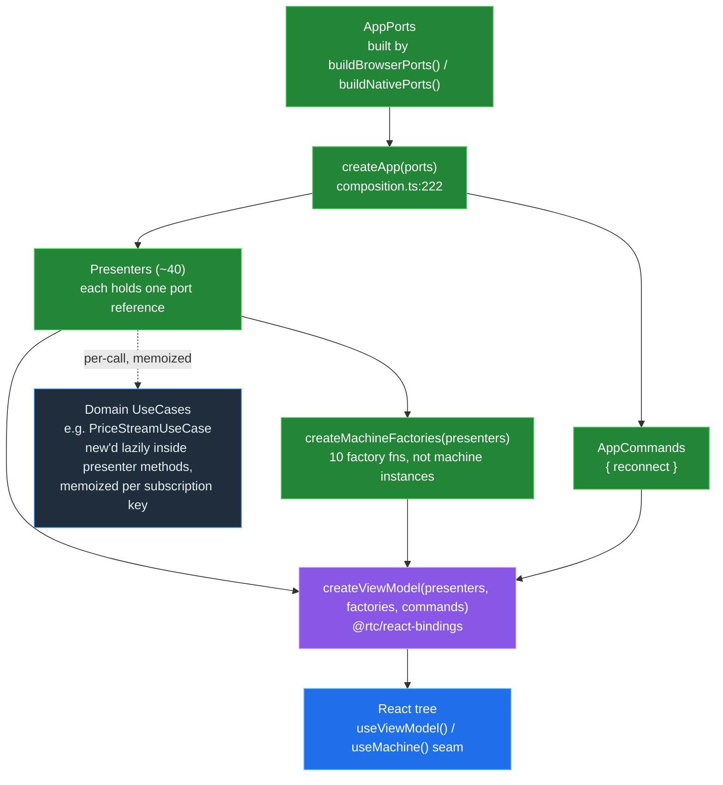
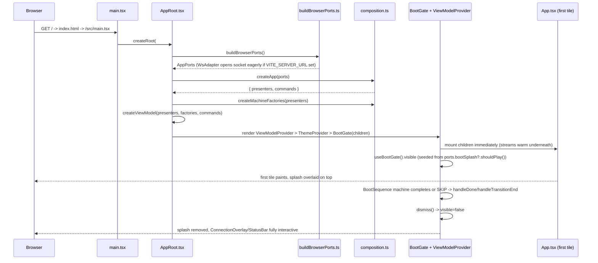
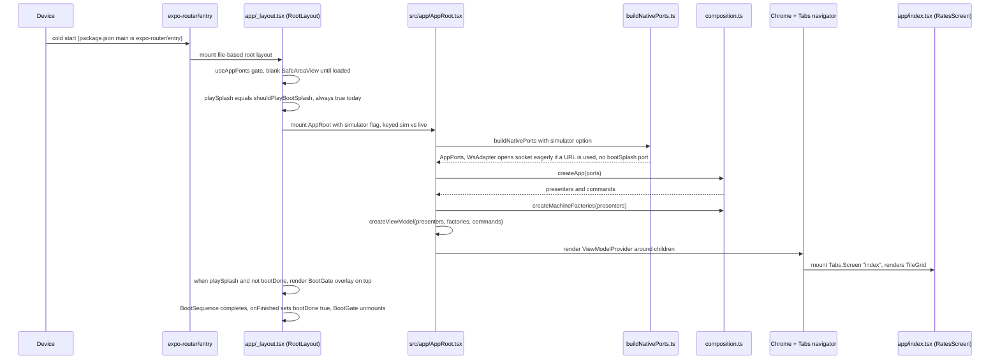
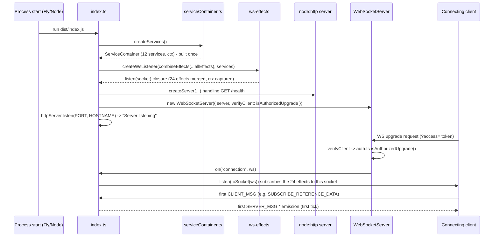

[◀ 13. Codebase Map](13-codebase-map.md) · [Architecture Document](../architecture.md) · [15. Flows ▶](15-flows.md)

## 14. Composition & Wiring

Every app in this repo — web, mobile, server — is built from the same three moving parts: a platform-specific **port builder** that decides simulator-vs-real-transport and constructs the platform adapters (storage, color scheme, connection lifecycle); the shared **composition root** (`createApp`, `createMachineFactories` in `@rtc/client-core`) that turns a completed `AppPorts` into presenters, machines, and commands; and a platform-specific **boot shell** that mounts the result and shows/hides a splash while the app's streams warm underneath. This section walks that pipeline end to end for all three runtimes. For *when* each client picks simulator vs. real WebSocket (the env-var switch and the topology table), see [§7 Runtime Topology](07-communication-patterns.md#runtime-topology-what-runs-when) — this section does not repeat it.

### 14.1 The Composition Root

`createApp(ports: AppPorts): App` (`packages/client-core/src/composition.ts:222`) is the framework-free heart of both clients. It is a plain function — no DI container, no React — that takes one `AppPorts` object and returns `{ presenters, ports, commands }`. Construction order, in the order the statements appear in the function body:

1. **Four presenters are hoisted to local `const`s** before the `presenters` object literal, because later presenters need direct references to their streams rather than going through the `Presenters` map: `connection = new ConnectionStatusPresenter(ports.connectionEvents)` (`composition.ts:225`), `priceStream = new PriceStreamPresenter(ports.pricing)` (`:227`), `execution = new TradeExecutionPresenter(ports.execution)` (`:228`), `rfqs = new RfqsPresenter(ports.workflow)` (`:229`), `currencyPairs = new CurrencyPairsPresenter(ports.referenceData)` (`:230`), `ordersBlotter = new OrdersBlotterPresenter(ports.orders)` (`:233`), `watchlist = new WatchlistPresenter(ports.marketData)` (`:236`).
2. **`colorScheme` is resolved with a fallback** — `ports.colorScheme ?? { prefersDark$: () => of(false) }` (`:240-244`) — so tests, the simulator harness, and any environment without `matchMedia`/`Appearance` still get a deterministic light scheme.
3. **The `Presenters` object literal is built** (`:246-313`), constructing roughly forty presenters/machines, each wrapping exactly one port. Two are worth calling out because they're wired from the hoisted presenters above rather than from a port directly: `animationDirector: new AnimationDirector({ pairs$: currencyPairs.pairs$, priceFor: ..., connectionStatus$: connection.status$, executions$: execution.executions$, rfqEvents$: rfqs.events$, equityFills$: ordersBlotter.fills$ })` (`:275-284`), and `bootGate: new BootGatePresenter(ports.bootSplash?.shouldPlay() ?? true)` (`:288`) — a **one-shot read**, not a subscription, of the platform's boot-splash decision. `incident` and `eqWorkspace` are built via factory functions (`createIncidentMachine`, `createEqWorkspaceMachine`) rather than `new`, and `eqWorkspace`'s initial symbol is captured by synchronously peeking the first emission of `watchlist.watchlist$` (`peekFirstWatchlistSymbol`, `:187-198`, called at `:303`) — reliable for the simulator's synchronous `of(WATCHLIST)`, empty for a WS-real backend where it recovers via the async `seed$` (`firstWatchlistSymbol$`, `:208-220`, `:304`).
4. **`commands = { reconnect }`** is built (`:314-318`), closing over the module-level `reconnect$` Subject.
5. **`createApp` returns `{ presenters, ports, commands }`** (`:319`).

A second, separate function — **`createMachineFactories(presenters): MachineFactories`** (`composition.ts:324-387`) — is *not* called inside `createApp`; both `AppRoot`s call it themselves, immediately after, passing the just-built `presenters`. It returns an object of ten factory functions (`tileExecution`, `rfqTile`, `staleFlag`, `analyticsStaleFlag`, `rowHighlight`, `notional`, `rfqSubmission`, `ticketSubmission`, `layout`, `boot`, `orderTicket`) — each one, when called, builds one fresh `Machine<TState, TIntents>` wired to a closure over `presenters` (e.g. `tileExecution: (pair) => createTileExecutionMachine(pair, { execute: (input) => presenters.execution.execute(input) })`, `:328-334`).

**What is constructed once vs. per-mount:**

| Built | When | Where |
|---|---|---|
| `AppPorts` (adapters, `WsAdapter`/simulators) | Once, at composition-root mount | `buildBrowserPorts()` / `buildNativePorts()` |
| `Presenters` (~40) + `AppCommands` | Once, at composition-root mount | `createApp(ports)` |
| `MachineFactories` (the factory object itself) | Once, at composition-root mount, right after `createApp` | `createMachineFactories(presenters)` |
| `ViewModel` bundle | Once, at composition-root mount | `createViewModel(presenters, factories, commands)` (`@rtc/react-bindings`) |
| Individual `Machine` instances (tile execution, RFQ tile, boot sequence, ...) | **Fresh per component mount** — a factory call each time a component using that machine mounts | `useMachine` (`react-bindings`) calling into `MachineFactories` |
| Domain use cases (e.g. `PriceStreamUseCase`) | **Lazily, per unique subscription key**, inside a presenter method, then cached | e.g. `PriceStreamPresenter.price$(pair)` — `new PriceStreamUseCase(this.pricing)` per new `pair.symbol`, cached in a `Map` + `shareReplay({ bufferSize: 1, refCount: true })` (`packages/client-core/src/presenters/PriceStreamPresenter.ts:22-24`) |

Both web and RN guard the once-only build against React StrictMode's double-invoked render body with a **lazy `useRef`** rather than `useState`/`useMemo`: `AppRoot.tsx` (client-react, `:29-38`) and `AppRoot.tsx` (client-react-native, `:54-65`) both check `if (ref.current === null)` before building, so `createApp()` runs exactly once per real mount even though StrictMode invokes the render body twice in dev.

### 14.2 Adapter Tables Per App

Each app's port builder calls the *same* two factories from `@rtc/client-core/src/adapters/portFactory.ts` — `createSimulatorPorts(deps)` (`:122-161`) and `createWsRealPorts(ws, deps)` (`:1019-1051`) — and layers platform-specific adapters (`preferences`, `colorScheme`, `connectionEvents`, and web-only `bootSplash`) on top. Four port families are **always simulator-backed, in both modes, on every client** — `telemetry`, `serviceHealth`, `eventLog`, `sessions` (plus the `metricControls` array) have no wire protocol; `createWsRealPorts` constructs fresh `LatencySimulator(1)` / `ErrorRateSimulator(2)` / `ServiceTopologySimulator(3)` / `EventLogSimulator(4)` instances itself (`portFactory.ts:1025-1028`) rather than sourcing them from the server.

#### Web (`@rtc/client-react`)

Built by `buildBrowserPorts()` (`packages/client-react/src/app/buildBrowserPorts.ts`), switched on `VITE_SERVER_URL` (`:25,34,63`).

| Port family | Simulator-mode impl | WS-mode impl | Shared with other apps? |
|---|---|---|---|
| `referenceData`, `pricing`, `execution`, `blotter`, `analytics`, `instruments`, `dealers`, `workflow`, `admin`, `marketData`, `orders`, `positions` | `@rtc/domain` simulators (e.g. `ReferenceDataSimulator`, `PricingSimulator`) via `createSimulatorPorts` | Thin `createXPort(ws)` wire adapters via `createWsRealPorts` (e.g. `createReferenceDataPort`, `createPricingPort`) | **Yes** — identical `portFactory.ts` code path used by RN |
| `telemetry`, `serviceHealth`, `eventLog`, `sessions`, `metricControls` | Local simulators (`TelemetrySimulator`, `ServiceTopologySimulator`, `EventLogSimulator`, `SessionSimulator`) | **Same simulators, still local** — no wire protocol for these even in WS mode | **Yes** — identical in RN; server has its own separate instances |
| `preferences` | `LocalStoragePreferencesAdapter` (`src/app/adapters/LocalStoragePreferencesAdapter.ts`) — same class regardless of transport mode | same | No — web-only (RN uses `AsyncStoragePreferencesAdapter`) |
| `colorScheme` | `MediaQueryColorSchemeAdapter` (`src/app/theme/MediaQueryColorSchemeAdapter.ts`, backed by `window.matchMedia`) | same | No — web-only (RN uses `AppearanceColorSchemeAdapter`) |
| `connectionEvents` | `ConnectionEventsSimulator` (`@rtc/domain`) merged with `BrowserConnectionEventsAdapter` + `reconnect$` + `incident$` (`buildBrowserPorts.ts:65-94`) | `WsConnectionEventsAdapter(ws)` merged with the same browser/reconnect/incident streams (`:36-56`) | Partial — `BrowserConnectionEventsAdapter` (tab visibility/idle) is web-only; RN's `connectionEvents` omits it |
| `bootSplash` | `{ shouldPlay: shouldPlayBootSplash }` (`src/bootSplashGate.ts`) | same | No — web-only. RN never sets this port; `composition.ts:288` falls back to `?? true` |

Mode selection: `buildBrowserPorts.ts:25` reads `import.meta.env.VITE_SERVER_URL`; `:34` branches `if (url)`. Platform-specific adapters: `preferences`, `colorScheme`, `bootSplash`, and the `BrowserConnectionEventsAdapter` half of `connectionEvents`. Verbatim-shared: every `createSimulatorPorts`/`createWsRealPorts` port, `WsAdapter`, `WsConnectionEventsAdapter`, `buildWsUrl` — all from `@rtc/client-core`.

#### Mobile (`@rtc/client-react-native`)

Built by `buildNativePorts(opts)` (`packages/client-react-native/src/app/buildNativePorts.ts`), switched on `Constants.expoConfig?.extra.serverUrl` unless the in-app `simulator` toggle forces the simulator branch (`:51-54`).

| Port family | Simulator-mode impl | WS-mode impl | Shared with other apps? |
|---|---|---|---|
| `referenceData` … `positions` (12 transport families) | Same `@rtc/domain` simulators via `createSimulatorPorts` | Same `createXPort(ws)` wire adapters via `createWsRealPorts` | **Yes** — identical to web |
| `telemetry`, `serviceHealth`, `eventLog`, `sessions`, `metricControls` | Same local simulators | Same local simulators (still no wire protocol) | **Yes** — identical to web |
| `preferences` | `AsyncStoragePreferencesAdapter` (`src/app/adapters/AsyncStoragePreferencesAdapter.ts`, backed by `@react-native-async-storage/async-storage`) | same | No — RN-only (web uses `LocalStoragePreferencesAdapter`) |
| `colorScheme` | `AppearanceColorSchemeAdapter` (`src/app/adapters/AppearanceColorSchemeAdapter.ts`, backed by RN's `Appearance`) | same | No — RN-only (web uses `MediaQueryColorSchemeAdapter`) |
| `connectionEvents` | `ConnectionEventsSimulator` merged with `reconnect$` + `incident$` only — **no browser-lifecycle stream** (`buildNativePorts.ts:87-103`) | `WsConnectionEventsAdapter(ws)` merged with `reconnect$` + `incident$` (`:60-74`) | Partial — narrower than web's merge (no DOM tab-idle detection on RN) |
| `bootSplash` | **Not set.** `NativeComposition.ports` never assigns a `bootSplash` key | n/a | No — RN's boot-splash decision (`shouldPlayBootSplash()`, `src/app/bootSplashGate.ts`, always returns `true`) is read directly by the route layout (`app/_layout.tsx:42`), bypassing `AppPorts` entirely |

Mode selection: `buildNativePorts.ts:51-54` (`extra.serverUrl`, short-circuited by the `simulator` option threaded from `app/_layout.tsx`'s `useState`). Platform-specific: `preferences`, `colorScheme`, and the (absent) browser-lifecycle half of `connectionEvents`. Verbatim-shared: same transport-port factories, `WsAdapter`, `buildWsUrl` as web — plus a platform-only concern web doesn't have: `buildNativePorts` returns a `dispose()` that closes the `WsAdapter`'s eagerly-opened socket on unmount (`:81-84`), because RN's `AppRoot` can be remounted under a new `key` by the demo sim/live toggle (`packages/client-react-native/app/_layout.tsx:46`).

#### Server (`@rtc/server`)

The server has no simulator/WS-real split — it *is* the thing WS-real mode connects to. `createServices(): ServiceContainer` (`packages/server/src/services/serviceContainer.ts:37-72`) builds all twelve services **once**, at module load (`packages/server/src/index.ts:17`), and the *same* instances are shared by every connected client for the process's lifetime (there is no per-connection service construction).

| Service family (`ServiceContainer` member) | Implementation | Shared with client apps? |
|---|---|---|
| `referenceData`, `pricing`, `execution`, `blotter`, `analytics`, `instruments`, `dealers`, `workflow` | Same `@rtc/domain` simulator classes as the clients' simulator-mode ports (`ReferenceDataSimulator`, `PricingSimulator`, `ExecutionSimulator`, `TradeStoreSimulator`, `AnalyticsSimulator`, `InstrumentSimulator`, `DealerSimulator`, `CreditRfqSimulator`) | **Yes, same classes** (`@rtc/domain`) — but this is one server-side instance driving every client, not a per-tab instance |
| `marketData`, `orders`, `positions` | Same equities simulator classes (`EquityMarketDataSimulator`, `EquityOrderSimulator`, `EquityPositionSimulator`) | **Yes, same classes** — one server-side instance |
| `throughput` | `ThroughputService` (`packages/server/src/services/ThroughputService.ts`) — a small bounded counter (0–1000), **not** the client-side `ThroughputSimulator` from `@rtc/domain` | **No** — server-specific class; distinct from the client `admin`/`telemetry` ports' `ThroughputSimulator` |

Wiring: `createWsListener(combineEffects(...allEffects), services)` (`index.ts:18`) merges the 24 effects from `packages/server/src/effects/index.ts:9-14` (`fxEffects` + `creditEffects` + `adminEffects` + `equitiesEffects`) into one `WsEffect<Ctx>` where `Ctx = ServiceContainer` (`packages/server/src/effects/context.ts:1`), and returns a `(socket: Socket) => void` closure. There is no adapter split by design: `services` are constructed exactly once and every inbound `WebSocket` connection is handed the same `ctx`.

### 14.3 Boot Sequences

#### Web

1. `index.html` loads `/src/main.tsx` as a module script (`packages/client-react/index.html:8`).
2. `main.tsx` imports the fonts, finds `#root`, and renders `<StrictMode><AppRoot><App/></AppRoot></StrictMode>` (`main.tsx:26-38`).
3. `AppRoot` (`AppRoot.tsx:31-38`) builds `buildBrowserPorts()` once (lazy ref) — this is where the `WsAdapter` constructor opens the raw `WebSocket` eagerly (`WsAdapter.ts:56-61`), if `VITE_SERVER_URL` is set, so the socket handshake begins before `createApp` even runs.
4. `createApp(ports)` builds all presenters/commands (§14.1); `createMachineFactories(presenters)` and `createViewModel(...)` follow immediately (`AppRoot.tsx:32-37`).
5. `AppRoot` renders `ViewModelProvider > ThemeProvider > BootGate` (`:43-49`). `BootGate` (`ui/shell/boot/BootGate.tsx:24-58`) mounts `children` (the real `<App/>` tree) **unconditionally and immediately** — so its streams start receiving data — and overlays the `BootSequence` splash on top only while `useBootGate().visible` is `true`.
6. `App.tsx` (`:19-32`) renders `AmbientBackground`, `HeaderChrome`, the first `WorkspaceEngine` (FX tile grid via `InhouseLayoutEngine`), `StatusBar`, `ConnectionOverlay`, `LockScreen` — this is the "first rendered tick", already live underneath the splash.
7. The `BootSequence` machine (built by `machineFactories.boot`, `composition.ts:369-377`) runs to completion or is skipped; `BootGate`'s `onTransitionEnd`/reduced-motion path calls `dismiss()` (`BootGate.tsx:28-46`), setting `visible=false` and revealing the already-warm app.

#### Mobile (RN / Expo)

1. Expo's entry (`package.json` `"main": "expo-router/entry"`) mounts the file-based root layout, `packages/client-react-native/app/_layout.tsx`'s default export `RootLayout` (`:33`).
2. `RootLayout` gates on `useAppFonts()`: while fonts are loading it renders only a blank `SafeAreaView` (`:38-40`), so no leaf ever renders with a missing font family.
3. Once fonts are ready, `playSplash = shouldPlayBootSplash()` is read (`:42`, `src/app/bootSplashGate.ts:12-14` — currently a hardcoded `true`; RN has no `navigator.webdriver`/`?nosplash` equivalent yet).
4. `<AppRoot key={simulator ? "sim" : "live"} simulator={simulator}>` mounts (`:46`). `AppRoot` (`src/app/AppRoot.tsx:56-65`) builds `buildNativePorts({ simulator })` once via a lazy ref, then `createApp(ports)`, `createMachineFactories(presenters)`, `createViewModel(...)` — the identical shared-core recipe as web (§14.1), minus the `bootSplash` port.
5. `AppRoot` renders `<ViewModelProvider>{children}</ViewModelProvider>` (`:83-85`); `children` is `ThemeProvider > Chrome` from `_layout.tsx:47-56`.
6. `Chrome` (`_layout.tsx:69-132`) renders the toolbar (wordmark, sim/live `Switch`, appearance/lock buttons), `ConnectionBanner`, and the expo-router `Tabs` navigator with five screens; the `"index"` tab mounts `app/index.tsx`'s `RatesScreen`, which renders `TileGrid` (`app/index.tsx:7-9`) — the first rendered tick.
7. `BootGate` (`src/ui/shell/boot/BootGate.tsx:25-55`) is conditionally rendered on top (`playSplash && !bootDone`, `_layout.tsx:49-55`) as an `Animated.View` splash; on completion (or `AccessibilityInfo.isReduceMotionEnabled()`) it fades out and calls `onFinished`, which flips `bootDone` and unmounts the gate (`_layout.tsx:50-54`).

#### Server

1. `createServices()` builds the `ServiceContainer` — all twelve simulators/services — exactly once, at module load (`index.ts:17`, `serviceContainer.ts:37-72`).
2. `createWsListener(combineEffects(...allEffects), services)` (`index.ts:18`) merges the 24 effects — `fxEffects`, `creditEffects`, `adminEffects`, `equitiesEffects` (`effects/index.ts:9-14`) — into one `WsEffect<Ctx>` via `combineEffects` (error-isolated per effect, `ws-effects/src/combineEffects.ts`), and returns a `(socket) => void` closure that captures `services` as `ctx`.
3. `createServer(...)` builds the HTTP server, handling only `GET /health` with a permissive CORS header (`index.ts:25-37`); everything else 404s.
4. `new WebSocketServer({ server: httpServer, verifyClient: ... })` (`:41-49`) wires `verifyClient` to `isAuthorizedUpgrade(info.req.url, WS_ACCESS_TOKEN)` (`auth.ts:9-19`), which 401s an unauthorized upgrade **before a socket exists** — `listen()` only ever runs for authorized connections.
5. `httpServer.listen(PORT, HOSTNAME, ...)` starts accepting connections and logs the listening addresses (`:57-61`).
6. On each successful upgrade, `wss.on("connection", ws => listen(toSocket(ws)))` (`:51-53`) wraps the raw `ws.WebSocket` into a transport-agnostic `Socket` (`toSocket.ts:6-39`: `{ messages$, closed$, send }`), and `listen` subscribes the merged effect's output to that socket, `takeUntil(socket.closed$)` (`ws-effects/src/createWsListener.ts:19-31`).
7. The first tick for that connection is whichever effect reacts first to the client's first `CLIENT_MSG` — e.g. a `SUBSCRIBE_REFERENCE_DATA` triggering the reference-data effect's first `SERVER_MSG.REFERENCE_DATA` push.

---
