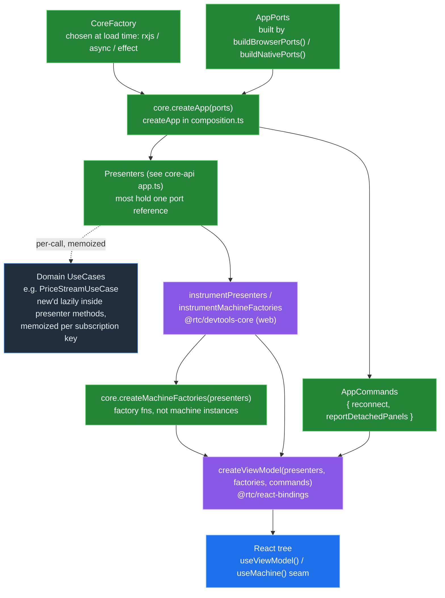
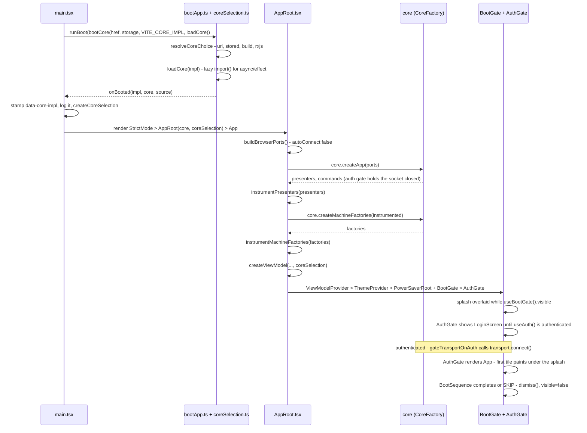
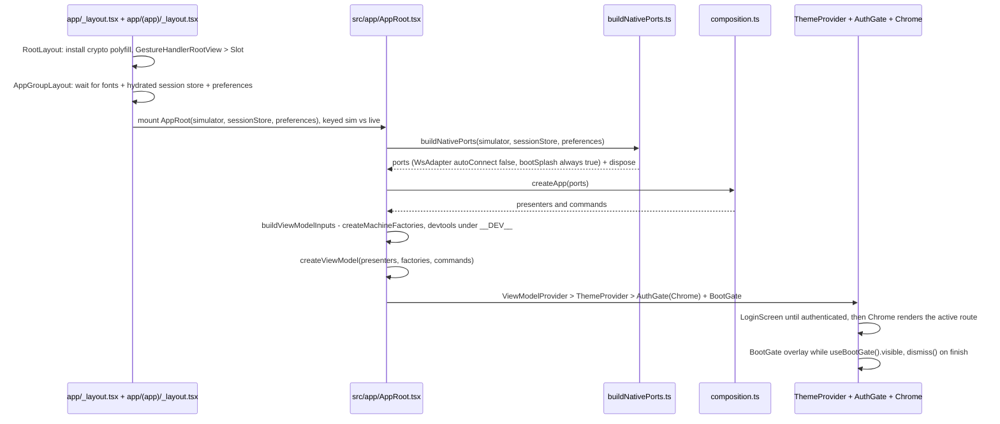
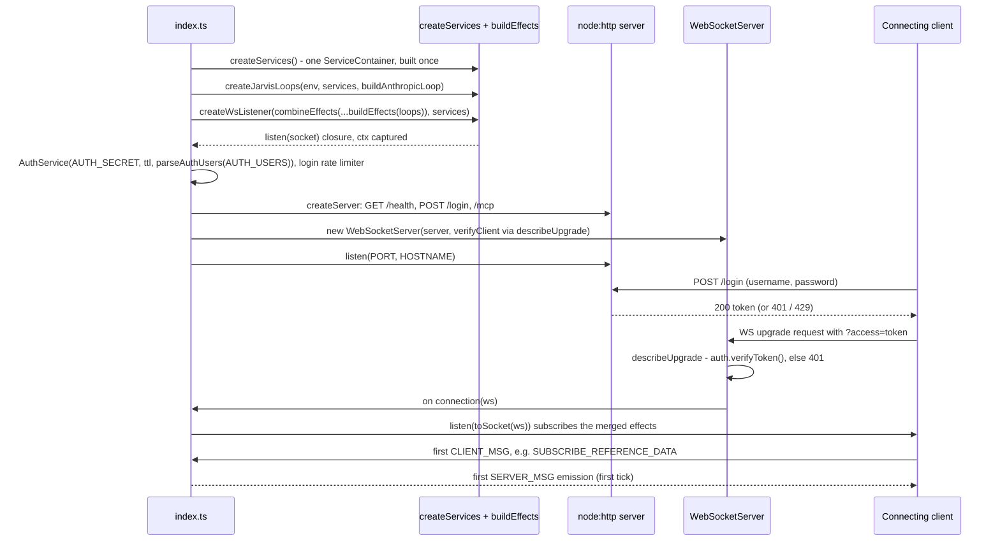

[◀ 13. Codebase Map](13-codebase-map.md) · [Architecture Document](../architecture.md) · [15. Flows ▶](15-flows.md)

## 14. Composition & Wiring

Every app in this repo — web, mobile, server — is built from the same three moving parts: a platform-specific **port builder** that decides simulator-vs-real-transport and constructs the platform adapters (storage, color scheme, connection lifecycle, session and layout stores); the shared **composition root** (`createApp`, `createMachineFactories`) that turns a completed `AppPorts` into presenters, machines, and commands; and a platform-specific **boot shell** that mounts the result and shows/hides a splash while the app's streams warm underneath. On the web a fourth step comes first: **choosing which application core** supplies that composition root — the RxJS `@rtc/client-core` by default, or one of its two siblings (see [§14.1.1](#1411-how-the-other-two-cores-plug-in)). This section walks that pipeline end to end for all three runtimes. For *when* each client picks simulator vs. real WebSocket (the env-var switch and the topology table), see [§7 Runtime Topology](07-communication-patterns.md#runtime-topology-what-runs-when) — this section does not repeat it.

### 14.1 The Composition Root

`createApp(ports: AppPorts): App` (`packages/client-core/src/composition.ts`, the RxJS core's composition root) is the framework-free heart of every client. It is a plain function — no DI container, no React — that takes one `AppPorts` object and returns `{ presenters, ports, commands, dispose }`. Construction order, in the order the statements appear in the function body:

1. **A handful of presenters and machines are hoisted to local `const`s** before the `presenters` object literal, because later members need direct references to their streams or intents rather than going through the `Presenters` map: `connection` (`ConnectionStatusPresenter` over `ports.connectionEvents`), `powerSaver` (whose `isCalm$` gates `priceStream`'s conflation), `priceStream`, `execution`, `rfqs`, `currencyPairs`, `ordersBlotter`, `watchlist`, and the members built from them — `eqWorkspace`, `themeSkinPreference`, `jarvisPreferences`, the `jarvis` machine and its panels presenter, `workspaceNav`, and the shared auth wiring (`createAuthDeps`). The function's own comments say, per `const`, which later consumer needed the hoist.
2. **The workspace is wired before the literal**, too: `createWorkspaceDock` (the shared dock-bridge rules from `@rtc/core-logic`), the per-tab layout singletons behind `layoutFor(tab)` (see the table below — layout is the one machine that is *not* per-mount), `createLayoutPresets`, and a debounced `createWorkspacePersistenceWriter` that writes every layout change back through `ports.preferences.setWorkspaceLayout` — followed by the Jarvis members that drive the workspace (`jarvisDriver`, `jarvisDemo`, the narrator).
3. **`colorScheme` is resolved with a fallback** — `ports.colorScheme ?? { prefersDark$: () => of(false) }` — so tests, the simulator harness, and any environment without `matchMedia`/`Appearance` still get a deterministic light scheme. The last two hoists follow: `incident` and `eqDrawings`, pulled out of the literal so `app.dispose()` can dispose them.
4. **The `Presenters` object literal is built**, one entry per member of the `Presenters` interface in `@rtc/core-api` (`packages/core-api/src/app.ts` — 61 members today; the interface, not this sentence, is the list). Most wrap exactly one port. Two are worth calling out for their unusual wiring. `animationDirector` is sourced from the sibling presenters' streams rather than from a port directly — `new AnimationDirector({ pairs$, priceFor, connectionStatus$: connection.status$, executions$: execution.executions$, rfqEvents$: rfqs.events$, equityFills$: ordersBlotter.fills$ })` — which is why those presenters are hoisted in step 1. `bootGate` *does* read a port, but as a **one-shot synchronous call** rather than a passed-through observable: `new BootGatePresenter(ports.bootSplash?.shouldPlay() ?? true)` evaluates the platform's boot-splash decision exactly once, at composition time. `incident` and `eqWorkspace` are built via factory functions (`createIncidentMachine`, `createEqWorkspaceMachine`) rather than `new`, and `eqWorkspace`'s initial symbol is captured by synchronously peeking the first emission of `watchlist.watchlist$` (`peekFirstWatchlistSymbol`) — reliable for the simulator's synchronous `of(WATCHLIST)`, empty for a WS-real backend where it recovers via the async `seed$` (`firstWatchlistSymbol$`).
5. **The transport is gated on auth**: `gateTransportOnAuth(ports.transport, presenters.auth)` subscribes to `auth.state$` and calls `transport.connect()` on `"authenticated"`, `transport.disconnect()` otherwise. Both port builders construct their `WsAdapter` with `autoConnect: false`, so no socket opens until the user has signed in (a resumed session is authenticated synchronously at composition time, so a returning user connects at once). Simulator mode supplies no `transport`, making the gate a no-op.
6. **`commands: AppCommands`** is built (the `commands` literal in `createApp`): `reconnect` calls `ports.connectionIntents.reconnect()` — the port half of the `pairConnectionPorts` pair the platform port-builder supplied alongside `connectionEvents` (`@rtc/core-api`'s `TransportPorts` omits both together, ADR-006 Follow-up 5) — and `reportDetachedPanels` delegates to the workspace dock.
7. **`createApp` returns `{ presenters, ports, commands, dispose }`** (the `app` literal at the end of `createApp`) — `dispose` releases the session-lifetime subscriptions `createApp` holds, stops a Jarvis demo run, disposes the machines it owns, and ends every `warmReplay` singleton's port hold, so no port subscription is held by the app once its consumers have let go (see its own comment; witnessed by the `@rtc/core-contract` `dispose` suite). A refcounted stream a consumer still holds keeps delivering; that subscription is the consumer's.

A second, separate function — **`createMachineFactories(presenters): MachineFactories`** (same file) — is *not* called inside `createApp`; every composition root calls it itself, immediately after, passing the just-built (on the web, devtools-instrumented) `presenters`. It returns an object of twelve factory functions, one per member of `MachineFactories` in `packages/core-api/src/machine.ts` (`tileExecution`, `rfqTile`, `staleFlag`, `analyticsStaleFlag`, `rowHighlight`, `notional`, `rfqSubmission`, `ticketSubmission`, `rfqCountdown`, `layout`, `boot`, `orderTicket`). Eleven of them build one fresh `Machine<TState, TIntents>` per call, wired to a closure over `presenters` (e.g. `tileExecution: (pair) => createTileExecutionMachine(pair, { execute: (input) => presenters.execution.execute(input) })`). The twelfth, `layout`, is the documented exception: it resolves to `presenters.layoutFor(tab)`, a composition-root singleton per tab whose handle's `dispose()` is deliberately inert.

**What is constructed once vs. per-mount:**

| Built | When | Where |
|---|---|---|
| `CoreFactory` (which core's `createApp`/`createMachineFactories`) | Once per page load, **before** React mounts (web only) | `bootCore(...)` in `packages/client-react/src/app/bootApp.ts` + `loadCore` in `coreSelection.ts` |
| `AppPorts` (adapters, `WsAdapter`/simulators) | Once, at composition-root mount | `buildBrowserPorts()` / `buildNativePorts()` |
| `Presenters` + `AppCommands` | Once, at composition-root mount | `core.createApp(ports)` (web) / `createApp(ports)` (RN) |
| Per-tab layout machines | Lazily, once per tab on first open, then kept for the app's lifetime (they survive the `WorkspaceEngine` remount on a tab switch) | `layoutFor(tab)` inside `createApp`, seeded from the persisted workspace layout |
| `MachineFactories` (the factory object itself) | Once, at composition-root mount, right after `createApp` | `createMachineFactories(presenters)` |
| `ViewModel` bundle | Once, at composition-root mount | `createViewModel(presenters, factories, commands, { coreSelection })` (`@rtc/react-bindings`) |
| Individual `Machine` instances (tile execution, RFQ tile, boot sequence, ...) | **Fresh per component mount** — a factory call each time a component using that machine mounts | `useMachine` (`react-bindings`) calling into `MachineFactories` |
| Domain use cases (e.g. `PriceStreamUseCase`) | **Lazily, per unique subscription key**, inside a presenter method, then cached | e.g. `PriceStreamPresenter.price$(pair)` — `new PriceStreamUseCase(this.pricing)` per new `pair.symbol`, cached in a `Map` + `shareReplay({ bufferSize: 1, refCount: true })` (`packages/client-core/src/presenters/PriceStreamPresenter.ts`) |

Both web and RN guard the once-only build against React StrictMode's double-invoked render body with a **lazy `useRef`** rather than `useState`/`useMemo`: `AppRoot` in `packages/client-react/src/AppRoot.tsx` and `AppRoot` in `packages/client-react-native/src/app/AppRoot.tsx` both check `ref.current === null` before building, so `createApp()` runs exactly once per real mount even though StrictMode invokes the render body twice in dev.

```mermaid
flowchart TD
    Core["CoreFactory<br/>chosen at load time: rxjs / async / effect"]:::core
    Ports["AppPorts<br/>built by buildBrowserPorts() / buildNativePorts()"]:::core
    Create["core.createApp(ports)<br/>createApp in composition.ts"]:::core
    Pres["Presenters (see core-api app.ts)<br/>most hold one port reference"]:::core
    Cmd["AppCommands<br/>{ reconnect, reportDetachedPanels }"]:::core
    UC["Domain UseCases<br/>e.g. PriceStreamUseCase<br/>new'd lazily inside presenter methods,<br/>memoized per subscription key"]:::domain
    Dev["instrumentPresenters /<br/>instrumentMachineFactories<br/>@rtc/devtools-core (web)"]:::bridge
    Mach["core.createMachineFactories(presenters)<br/>factory fns, not machine instances"]:::core
    VM["createViewModel(presenters, factories, commands)<br/>@rtc/react-bindings"]:::bridge
    UI["React tree<br/>useViewModel() / useMachine() seam"]:::ui

    Core --> Create
    Ports --> Create
    Create --> Pres
    Create --> Cmd
    Pres -.->|"per-call, memoized"| UC
    Pres --> Dev
    Dev --> Mach
    Mach --> VM
    Dev --> VM
    Cmd --> VM
    VM --> UI

    classDef ui     fill:#1f6feb,stroke:#79c0ff,color:#ffffff
    classDef bridge fill:#8957e5,stroke:#d2a8ff,color:#ffffff
    classDef core   fill:#238636,stroke:#56d364,color:#ffffff
    classDef domain fill:#1f2d3d,stroke:#4493f8,color:#e6edf3
```

#### 14.1.1 How the other two cores plug in

Everything above describes the RxJS core, but the web `AppRoot` never imports it by name: it receives a `core: CoreFactory` prop — `{ createApp, createMachineFactories }`, the `CoreFactory` interface in `@rtc/core-api` — and calls `core.createApp(buildBrowserPorts())` and `core.createMachineFactories(...)`. `main.tsx` decides which core that is before React mounts (`bootCore` resolves `?core=` → the stored Preferences choice → the `VITE_CORE_IMPL` build default → `"rxjs"`; `loadCore` returns the statically imported `rxjsCore`, or `import()`s `@rtc/client-core-async`'s `asyncCore` / `@rtc/client-core-effect`'s `effectCore` as lazy chunks). The ports, the devtools decorators, `createViewModel` and the whole UI are identical whichever core booted; `@rtc/client-solid` shares the same `bootApp`/`coreSelection` shape. The RN client does not take part: its `AppRoot` imports `createApp` from `@rtc/client-core` directly. How each alternative core builds the same `Presenters`/`MachineFactories` contract is [§22 Selection: at load time](22-pluggable-application-core.md#selection-at-load-time) and [§23 How a core is chosen and loaded](23-application-cores-explained.md#how-a-core-is-chosen-and-loaded).

### 14.2 Adapter Tables Per App

Each app's port builder calls the *same* two factories from `@rtc/client-core`'s `src/adapters/portFactory.ts` — `createSimulatorPorts(deps)` and `createWsRealPorts(ws, deps)` — and layers platform-specific adapters (`connectionEvents`/`connectionIntents`, `colorScheme`, `bootSplash`, `transport`, and on the web the two layout stores) on top; `preferences`, `auth` and `sessionStore` are passed *into* both factories as `PortFactoryDeps`. Four port families are **always simulator-backed, in both modes, on every client** — `telemetry`, `serviceHealth`, `eventLog`, `sessions` (plus the `metricControls` array) have no wire protocol; `createWsRealPorts` constructs fresh `LatencySimulator(1)` / `ErrorRateSimulator(2)` / `ServiceTopologySimulator(3)` / `EventLogSimulator(4)` instances itself rather than sourcing them from the server.

#### Web (`@rtc/client-react`)

Built by `buildBrowserPorts()` (`packages/client-react/src/app/buildBrowserPorts.ts`), switched on `VITE_SERVER_URL`.

| Port family | Simulator-mode impl | WS-mode impl | Shared with other apps? |
|---|---|---|---|
| `referenceData`, `pricing`, `execution`, `blotter`, `analytics`, `instruments`, `dealers`, `workflow`, `admin`, `marketData`, `orders`, `positions` | `@rtc/domain` simulators (e.g. `ReferenceDataSimulator`, `PricingSimulator`) via `createSimulatorPorts` | Thin `createXPort(ws)` wire adapters via `createWsRealPorts` (e.g. `createReferenceDataPort`, `createPricingPort`) | **Yes** — identical `portFactory.ts` code path used by RN |
| `jarvis`, `jarvisUsage` | `ScriptedJarvisAdapter` (the scripted brain in-process) and an all-zero usage stream | `WsJarvisAdapter(ws)`, `WsJarvisUsageAdapter(ws)` | **Yes** — same factories as RN |
| `telemetry`, `serviceHealth`, `eventLog`, `sessions`, `metricControls` | Local simulators (`TelemetrySimulator`, `ServiceTopologySimulator`, `EventLogSimulator`, `SessionSimulator`) | **Same simulators, still local** — no wire protocol for these even in WS mode | **Yes** — identical in RN; server has its own separate instances |
| `auth` | `AuthSimulator` over the `VITE_DEV_AUTH` roster (`parseDevAuth`) | `HttpAuthAdapter(wsUrlToHttpBase(url))` — `POST /login` on the server | Same classes as RN; the dev roster source differs |
| `sessionStore` | `LocalStorageSessionStore` (`src/app/adapters/LocalStorageSessionStore.ts`) — same class regardless of transport mode | same; the `WsAdapter` reads its token from it on every (re)connect | No — web-only (RN uses `AsyncStorageSessionStore`) |
| `preferences` | `LocalStoragePreferencesAdapter` (`src/app/adapters/LocalStoragePreferencesAdapter.ts`) — same class regardless of transport mode; also stores the persisted workspace layout | same | No — web-only (RN uses `AsyncStoragePreferencesAdapter`) |
| `dockLayoutStore`, `layoutPresetStore` | `LocalStorageDockLayoutStore` (the Dockview blob per tab) and `LocalStorageLayoutPresetStore` (saved layouts per tab), in `src/app/adapters/` | same | No — web-only; RN supplies neither and `createApp` falls back to in-memory stores |
| `colorScheme` | `MediaQueryColorSchemeAdapter` (`src/app/theme/MediaQueryColorSchemeAdapter.ts`, backed by `window.matchMedia`) | same | No — web-only (RN uses `AppearanceColorSchemeAdapter`) |
| `connectionEvents` + `connectionIntents` | `ConnectionEventsSimulator` (`@rtc/domain`) merged with `BrowserConnectionEventsAdapter`, paired via `pairConnectionPorts(events$, { reconnectRendering: "intent-then-connected" })` | `WsConnectionEventsAdapter(ws)` merged with the same browser events, paired via `pairConnectionPorts(events$)` (default rendering), with a `routeIdleLifecycle` tap that closes/reopens the socket | Partial — `BrowserConnectionEventsAdapter` (tab visibility/idle) is web-only; RN's `connectionEvents` omits it |
| `transport` | not set — no socket | the `WsAdapter` itself, built with `autoConnect: false` and wrapped in `instrumentWsAdapter(..., devtoolsHub)` so the devtools Wire view sees every frame | RN sets the bare `WsAdapter` (no wire tap) |
| `bootSplash` | `{ shouldPlay: shouldPlayBootSplash }`, imported from `@rtc/boot-splash` | same | Shape shared; RN supplies its own always-`true` `shouldPlayBootSplash` |

Mode selection: `buildBrowserPorts` reads `import.meta.env.VITE_SERVER_URL` and branches on `if (url)`. Platform-specific adapters: `preferences`, `sessionStore`, the two layout stores, `colorScheme`, `bootSplash`, and the `BrowserConnectionEventsAdapter` half of `connectionEvents`. Verbatim-shared: every `createSimulatorPorts`/`createWsRealPorts` port, `WsAdapter`, `WsConnectionEventsAdapter`, `HttpAuthAdapter`, `pairConnectionPorts` — all from `@rtc/client-core`.

#### Mobile (`@rtc/client-react-native`)

Built by `buildNativePorts(opts)` (`packages/client-react-native/src/app/buildNativePorts.ts`), switched on `Constants.expoConfig?.extra.serverUrl` unless the in-app `simulator` toggle forces the simulator branch.

| Port family | Simulator-mode impl | WS-mode impl | Shared with other apps? |
|---|---|---|---|
| `referenceData` … `positions` (12 transport families) plus `jarvis`, `jarvisUsage` | Same `@rtc/domain` simulators / scripted Jarvis via `createSimulatorPorts` | Same `createXPort(ws)` wire adapters via `createWsRealPorts` | **Yes** — identical to web |
| `telemetry`, `serviceHealth`, `eventLog`, `sessions`, `metricControls` | Same local simulators | Same local simulators (still no wire protocol) | **Yes** — identical to web |
| `auth` | `AuthSimulator(DEV_CREDENTIALS)` (`src/app/nativeAuthConfig.ts`) | `HttpAuthAdapter` | Same classes as web |
| `sessionStore` | `AsyncStorageSessionStore`, hydrated by the `(app)` group layout before `AppRoot` mounts and injected (defaults to `InMemorySessionStore`) | same | No — RN-only |
| `preferences` | `AsyncStoragePreferencesAdapter` (`src/app/adapters/AsyncStoragePreferencesAdapter.ts`, backed by `@react-native-async-storage/async-storage`), likewise pre-hydrated and injected | same | No — RN-only (web uses `LocalStoragePreferencesAdapter`) |
| `colorScheme` | `AppearanceColorSchemeAdapter` (`src/app/adapters/AppearanceColorSchemeAdapter.ts`, backed by RN's `Appearance`) | same | No — RN-only (web uses `MediaQueryColorSchemeAdapter`) |
| `connectionEvents` + `connectionIntents` | `ConnectionEventsSimulator` paired via `pairConnectionPorts(events$, { reconnectRendering: "connected-only" })` — **no browser-lifecycle stream**, and no raw reconnect intent either, unlike the web simulators | `WsConnectionEventsAdapter(ws)` paired via `pairConnectionPorts(events$)` (default rendering) | Partial — narrower than web's merge (no DOM tab-idle detection on RN) |
| `transport` | not set | the `WsAdapter` (`autoConnect: false`) | Shape shared with web |
| `bootSplash` | `{ shouldPlay: shouldPlayBootSplash }` from `src/app/bootSplashGate.ts` — always `true` (RN has no `navigator.webdriver`/`?nosplash` equivalent yet) | same | Shape shared with web |

Mode selection: `buildNativePorts` (`extra.serverUrl`, short-circuited by the `simulator` option threaded from the `(app)` group layout's `useState`). Platform-specific: `sessionStore`, `preferences`, `colorScheme`, `bootSplash`, and the (absent) browser-lifecycle half of `connectionEvents`. Verbatim-shared: same transport-port factories, `WsAdapter`, `HttpAuthAdapter` as web — plus a platform-only concern web doesn't have: `buildNativePorts` returns a `dispose()` that closes the `WsAdapter`'s socket (and suppresses its reconnect) on unmount, because RN's `AppRoot` can be remounted under a new `key` by the demo sim/live toggle in `packages/client-react-native/app/(app)/_layout.tsx`.

#### Server (`@rtc/server`)

The server has no simulator/WS-real split — it *is* the thing WS-real mode connects to. `createServices(): ServiceContainer` (`packages/server/src/services/serviceContainer.ts`) builds every service **once**, at module load in `packages/server/src/index.ts`, and the *same* instances are shared by every connected client for the process's lifetime (there is no per-connection service construction). The `ServiceContainer` interface in that file is the member list.

| Service family (`ServiceContainer` member) | Implementation | Shared with client apps? |
|---|---|---|
| `referenceData`, `pricing`, `execution`, `blotter`, `analytics`, `instruments`, `dealers`, `workflow`, `serviceHealth` | Same `@rtc/domain` simulator classes as the clients' simulator-mode ports (`ReferenceDataSimulator`, `PricingSimulator`, `ExecutionSimulator`, `TradeStoreSimulator`, `AnalyticsSimulator`, `InstrumentSimulator`, `DealerSimulator`, `CreditRfqSimulator`, `ServiceTopologySimulator(3)`) | **Yes, same classes** (`@rtc/domain`) — but this is one server-side instance driving every client, not a per-tab instance. `serviceHealth` feeds the Jarvis desk tools, not a client port |
| `marketData`, `orders`, `positions` | Same equities simulator classes (`EquityMarketDataSimulator`, `EquityOrderSimulator`, `EquityPositionSimulator`) | **Yes, same classes** — one server-side instance |
| `throughput` | `ThroughputService` (`packages/server/src/services/ThroughputService.ts`) — a small bounded counter, **not** the client-side `ThroughputSimulator` from `@rtc/domain` | **No** — server-specific class |
| `usageMeter`, `jarvisGate` | `UsageMeter` (per-model token usage behind the admin Jarvis-usage dock) and `JarvisGateService` (the `RTC_JARVIS_*` usage gate over it), in `packages/server/src/services/` | **No** — server-only |

Wiring: `createWsListener(combineEffects(...buildEffects(jarvisLoops)), services)` merges every effect `buildEffects` (`packages/server/src/effects/index.ts`) assembles — `allEffects` (FX, Credit, Admin, the admin Jarvis-usage effects, Equities) plus `jarvisEffects(loops)` — into one `WsEffect<Ctx>` where `Ctx = ServiceContainer` (`packages/server/src/effects/context.ts`), and returns a `(socket: Socket) => void` closure. `jarvisLoops` comes from `createJarvisLoops(process.env, services, buildAnthropicLoop)` — scripted, dual scripted+Anthropic, or `null` (Jarvis absent) by env. There is no adapter split by design: `services` are constructed exactly once and every inbound `WebSocket` connection is handed the same `ctx`.

### 14.3 Boot Sequences

#### Web

```mermaid
sequenceDiagram
    participant M as main.tsx
    participant BC as bootApp.ts + coreSelection.ts
    participant AR as AppRoot.tsx
    participant C as core (CoreFactory)
    participant G as BootGate + AuthGate

    M->>BC: runBoot(bootCore(href, storage, VITE_CORE_IMPL, loadCore))
    BC->>BC: resolveCoreChoice - url, stored, build, rxjs
    BC->>BC: loadCore(impl) - lazy import() for async/effect
    BC-->>M: onBooted(impl, core, source)
    M->>M: stamp data-core-impl, log it, createCoreSelection
    M->>AR: render StrictMode > AppRoot(core, coreSelection) > App
    AR->>AR: buildBrowserPorts() - autoConnect false
    AR->>C: core.createApp(ports)
    C-->>AR: presenters, commands (auth gate holds the socket closed)
    AR->>AR: instrumentPresenters(presenters)
    AR->>C: core.createMachineFactories(instrumented)
    C-->>AR: factories
    AR->>AR: instrumentMachineFactories(factories)
    AR->>AR: createViewModel(..., coreSelection)
    AR->>G: ViewModelProvider > ThemeProvider > PowerSaverRoot + BootGate > AuthGate
    G->>G: splash overlaid while useBootGate().visible
    G->>G: AuthGate shows LoginScreen until useAuth() is authenticated
    Note over C,G: authenticated - gateTransportOnAuth calls transport.connect()
    G->>G: AuthGate renders App - first tile paints under the splash
    G->>G: BootSequence completes or SKIP - dismiss(), visible=false
```

1. `packages/client-react/index.html` holds the `#root` mount point and loads `/src/main.tsx` as a module script.
2. `main.tsx` imports the fonts, finds `#root`, and — before any React renders — calls `runBoot(bootCore({ href, storage, buildDefault: import.meta.env.VITE_CORE_IMPL, warn, load: loadCore }), onBooted, onError)` (`src/app/bootApp.ts`). `bootCore` resolves the core through `resolveCoreChoice` (`src/app/coreSelection.ts`: `?core=` for this load only → the stored `rtc.coreImpl` choice → the build default → `"rxjs"`), then `loadCore(impl)` returns the statically imported `rxjsCore` or `import()`s the chosen sibling core's lazy chunk. A failed load (or a throw inside `onBooted`) routes to `renderBootError`, a plain-DOM message with a "Load the default core" button; an invalid `VITE_CORE_IMPL` throws synchronously as a developer error.
3. `onBooted` stamps `<html data-core-impl>`, logs `[core] booted <impl> from <source>`, builds a `CoreSelection` (the Preferences core picker's seam), and renders `<StrictMode><AppRoot core={core} coreSelection={coreSelection}><App/></AppRoot></StrictMode>`.
4. `AppRoot` builds, once per real mount (lazy ref): `buildBrowserPorts()`, then `core.createApp(ports)` (§14.1), then wraps the presenters with `instrumentPresenters(presenters, PRESENTER_MANIFEST, devtoolsHub)` and the factories with `instrumentMachineFactories(core.createMachineFactories(instrumented), devtoolsHub)` — dormant decorators until an inspector attaches ([§20](20-devtools.md)) — and finally `createViewModel(instrumented, factories, commands, { coreSelection })`. The `WsAdapter` (WS-real mode) is constructed with `autoConnect: false`; no socket opens here.
5. `AppRoot` renders `ViewModelProvider > ThemeProvider > [PowerSaverRoot, BootGate > AuthGate > children]`. `PowerSaverRoot` renders nothing and applies the power-saver level to the document root. `BootGate` (`src/ui/shell/boot/BootGate.tsx`) mounts its `children` **unconditionally and immediately** and overlays the `BootSequence` splash on top only while `useBootGate().visible` is `true` — so the splash also plays over the login screen. `AuthGate` (`src/ui/shell/auth/AuthGate.tsx`) renders `LoginScreen` until `useAuth().state.status` is `"authenticated"` (a resumed session skips it), then its `children`, the real `<App/>`; the moment auth flips, `createApp`'s `gateTransportOnAuth` opens the socket.
6. `App.tsx` renders `AmbientBackground`, `HeaderChrome`, the workspace region holding the active tab's `WorkspaceEngine` (`key={activeTab}`, the tab coming from `useWorkspaceNav()`; it renders `DockviewLayoutEngine`, the default `LayoutEngine`, or `InhouseLayoutEngine` for a user who picked "inhouse"), `StatusBar`, `ConnectionOverlay`, `LockScreen`, `JarvisOverlay`, `JarvisPanelLayer` — this is the "first rendered tick", already live underneath the splash.
7. The `BootSequence` machine (built per mount by `machineFactories.boot`) runs to completion or is skipped; `BootGate`'s `dismissOnOpacityEnd` (the splash's CSS fade) or `dismissOnJumpCut` (reduced motion) calls `dismiss()`, setting `visible=false` and revealing the already-warm app.

#### Mobile (RN / Expo)

```mermaid
sequenceDiagram
    participant RL as app/_layout.tsx + app/(app)/_layout.tsx
    participant AR as src/app/AppRoot.tsx
    participant BP as buildNativePorts.ts
    participant CA as composition.ts
    participant UI as ThemeProvider + AuthGate + Chrome

    RL->>RL: RootLayout: install crypto polyfill, GestureHandlerRootView > Slot
    RL->>RL: AppGroupLayout: wait for fonts + hydrated session store + preferences
    RL->>AR: mount AppRoot(simulator, sessionStore, preferences), keyed sim vs live
    AR->>BP: buildNativePorts(simulator, sessionStore, preferences)
    BP-->>AR: ports (WsAdapter autoConnect false, bootSplash always true) + dispose
    AR->>CA: createApp(ports)
    CA-->>AR: presenters and commands
    AR->>AR: buildViewModelInputs - createMachineFactories, devtools under __DEV__
    AR->>AR: createViewModel(presenters, factories, commands)
    AR->>UI: ViewModelProvider > ThemeProvider > AuthGate(Chrome) + BootGate
    UI->>UI: LoginScreen until authenticated, then Chrome renders the active route
    UI->>UI: BootGate overlay while useBootGate().visible, dismiss() on finish
```

1. Expo's entry (`package.json` `"main": "expo-router/entry"`) mounts the file-based root layout, `packages/client-react-native/app/_layout.tsx`'s `RootLayout` — now a minimal shell that installs the Web Crypto polyfill at module scope and renders a `GestureHandlerRootView` around a `<Slot/>`. The app shell itself lives in the `(app)` route group; the dev-only `__visual` harness route is its sibling.
2. `AppGroupLayout` (`app/(app)/_layout.tsx`) gates first paint on `useAppFonts()` **and** on hydrating an `AsyncStorageSessionStore` and an `AsyncStoragePreferencesAdapter` — both are read synchronously at construction (`AuthPresenter.resume()`, `BootPreferencePresenter.current()`), so each must be loaded into its in-memory mirror before `AppRoot` mounts.
3. `<AppRoot key={simulator ? "sim" : "live"} simulator={simulator} sessionStore={…} preferences={…}>` mounts. `AppRoot` builds `buildNativePorts({ simulator, sessionStore, preferences })` once via a lazy ref, then `createApp(ports)` (RN always runs the RxJS core), then `buildViewModelInputs` (`createMachineFactories`, plus the devtools decorators and relay hub under `__DEV__` only) and `createViewModel(...)` — the identical shared-core recipe as web (§14.1). Unmount disposes the composition on a deferred microtask, so StrictMode's same-mount double effect does not kill the socket.
4. `AppRoot` renders `<ViewModelProvider>{children}</ViewModelProvider>`; `children` is `ThemeProvider > [AuthGate > Chrome, BootGate]` from `AppGroupLayout`.
5. `AuthGate` shows the RN `LoginScreen` until authenticated; `Chrome` then renders `AmbientBackground`, `ShellHeader` (with the sim/live toggle), `ConnectionBanner`, the active route through `<Slot/>` — the default `index` route is `RatesScreen`, which renders `RatesModule` — then `StatusStrip`, `RadialCommandDock`, the appearance sheet and `LockScreen`.
6. `BootGate` (`src/ui/shell/boot/BootGate.tsx`) reads `useBootGate()` — seeded, as on the web, from the `bootSplash` port at composition — overlays the splash while `visible`, and calls `dismiss()` on completion (or immediately under reduced motion).

#### Server

```mermaid
sequenceDiagram
    participant Idx as index.ts
    participant SC as createServices + buildEffects
    participant HTTP as node:http server
    participant WSS as WebSocketServer
    participant Client as Connecting client

    Idx->>SC: createServices() - one ServiceContainer, built once
    Idx->>SC: createJarvisLoops(env, services, buildAnthropicLoop)
    Idx->>SC: createWsListener(combineEffects(...buildEffects(loops)), services)
    SC-->>Idx: listen(socket) closure, ctx captured
    Idx->>Idx: AuthService(AUTH_SECRET, ttl, parseAuthUsers(AUTH_USERS)), login rate limiter
    Idx->>HTTP: createServer: GET /health, POST /login, /mcp
    Idx->>WSS: new WebSocketServer(server, verifyClient via describeUpgrade)
    Idx->>HTTP: listen(PORT, HOSTNAME)
    Client->>HTTP: POST /login (username, password)
    HTTP-->>Client: 200 token (or 401 / 429)
    Client->>WSS: WS upgrade request with ?access=token
    WSS->>WSS: describeUpgrade - auth.verifyToken(), else 401
    WSS->>Idx: on connection(ws)
    Idx->>Client: listen(toSocket(ws)) subscribes the merged effects
    Client->>Idx: first CLIENT_MSG, e.g. SUBSCRIBE_REFERENCE_DATA
    Idx-->>Client: first SERVER_MSG emission (first tick)
```

1. `createServices()` builds the `ServiceContainer` exactly once, at module load (`index.ts`, `services/serviceContainer.ts`); `createJarvisLoops(process.env, services, buildAnthropicLoop)` picks the Jarvis brain set by env (the Anthropic SDK stays confined to `src/agent/`).
2. `combineEffects(...buildEffects(jarvisLoops))` merges every effect `buildEffects` returns into one process-wide `WsEffect<Ctx>` (error-isolated per effect, `ws-effects/src/combineEffects.ts`); the `(socket) => void` listener is built PER CONNECTION in step 7 (`createWsListener(effect, scopeServicesToConnection(services))`), so each socket gets its own connection-scoped `ctx` over the shared simulators.
3. `new AuthService({ secret: AUTH_SECRET, ttlMs, credentials: parseAuthUsers(AUTH_USERS) })` (`src/auth/AuthService.ts`, async scrypt per login), `createRateLimiter(10, 60_000)` (`src/auth/rateLimit.ts`, an evicting, bounded table), `createBanList(...)` (`src/auth/banList.ts`, the §9.2 in-app expiring ban table) and `createConnectionGuard(...)` (`src/socket/connectionGuard.ts`, per-IP and total live-socket caps) are built, every one keyed on the trusted client IP (`resolveClientIp`, `src/http/clientIp.ts` — `Fly-Client-IP`, never `X-Forwarded-For`); `createMcpRequestHandler` (`src/mcp/mcpHttpHandler.ts`) is built over the same `auth` and the `@rtc/agent-tools` registry.
4. `createServer(...)` builds the HTTP server, with a permissive CORS header: `GET /health` (token-free Fly probe); `POST /login` (plus its `OPTIONS` preflight), which reads the body through `readBodyWithLimit` (4 KiB by bytes received, `413` past it) and delegates to `authenticateLoginRequest` (`src/http/loginHandler.ts`) — ban check first, then rate-limited per client IP (a `429` is a ban strike), validates the request shape, then `await AuthService.login(username, password)` scrypt-hashes the candidate and `timingSafeEqual`-compares it against the roster built from `AUTH_USERS`, returning a signed session token on success; and `/mcp`, the Streamable-HTTP MCP endpoint, which requires `Authorization: Bearer <token>` with a token from `/login` ([§18](18-jarvis-ai-agent-surface.md)). Everything else 404s.
5. `new WebSocketServer({ server: httpServer, maxPayload: WS_MAX_PAYLOAD_BYTES, verifyClient })` caps every inbound frame at 64 KiB (`src/config/limits.ts`, hardening S1 — `ws` closes an offending socket with 1009) and wires `verifyClient` (callback form) to `decideUpgrade(url, ip, deps)` (`src/http/upgradeGate.ts`): a banned IP is refused with 429 before anything else, a capped IP or a full process with 503, and only then `describeUpgrade` reads the `?access=` query param and calls `AuthService.verifyToken` — a missing URL, missing param, bad signature, wrong secret, or expired token is always rejected with 401 (no open-when-empty fallback). The rejection reason is logged by `createConnectionLog` (never the token), all **before a socket exists**, so `listen()` only ever runs for authorized connections.
6. `httpServer.listen(PORT, HOSTNAME, ...)` starts accepting connections and logs the HTTP, MCP and WS addresses.
7. On each successful upgrade, `wss.on("connection", ...)` records the connect, attaches an `error` listener (a protocol-violating frame makes `ws` emit `error` on that socket; unhandled, Node would crash the process — hardening S14 — so it is logged by code only), acquires the connection's slot in the connection guard (released on `close`), then `createWsListener(effect, scopeServicesToConnection(services))(toSocket(ws, guard))` wraps the raw `ws.WebSocket` into a transport-agnostic `Socket` (`src/socket/toSocket.ts`: `{ messages$, closed$, send }`) behind a per-socket inbound token bucket (`src/socket/tokenBucket.ts`; frames past the burst are dropped, 100 drops close the socket with 1008 and strike the ban list), gives the connection its own `ThroughputService` (S10), and subscribes the merged effect's output to that socket until `socket.closed$` (`ws-effects/src/createWsListener.ts`).
8. The first tick for that connection is whichever effect reacts first to the client's first `CLIENT_MSG` — e.g. a `SUBSCRIBE_REFERENCE_DATA` triggering the reference-data effect's first `SERVER_MSG.REFERENCE_DATA` push.

---
