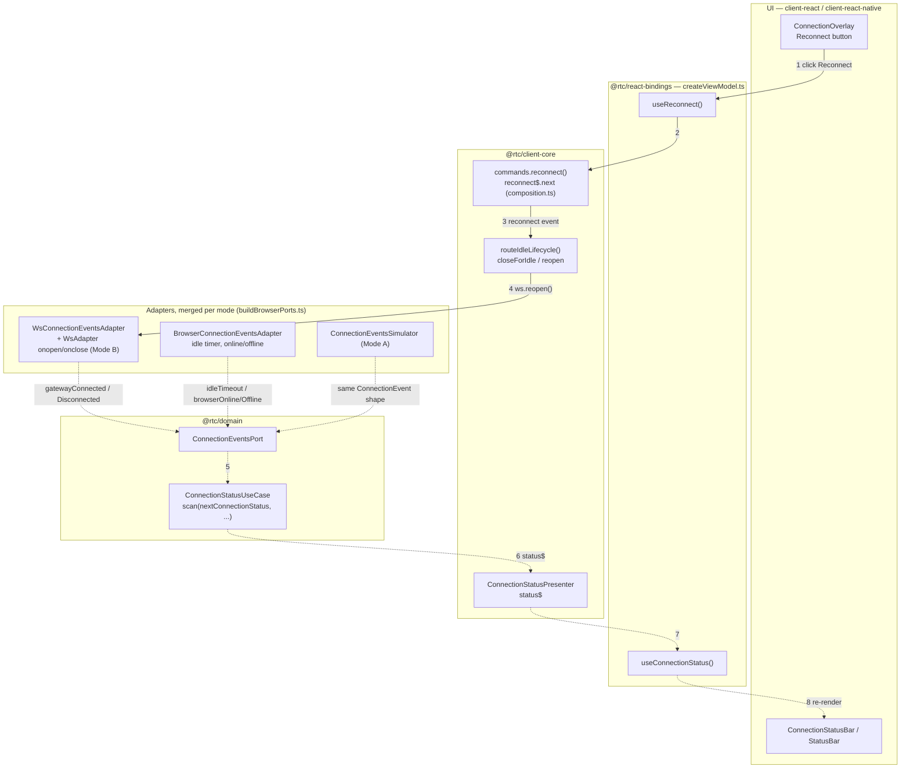
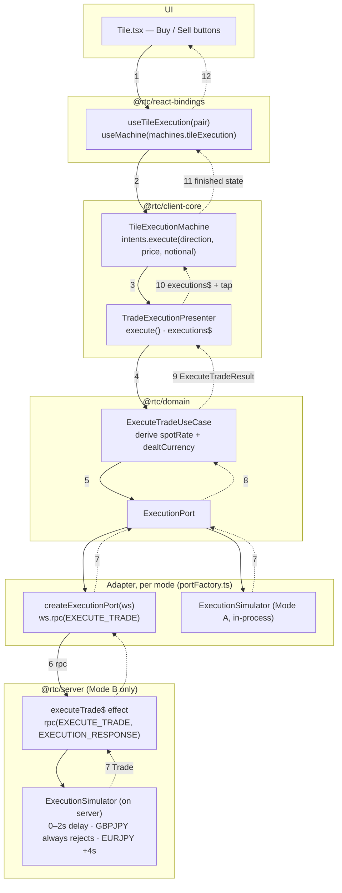
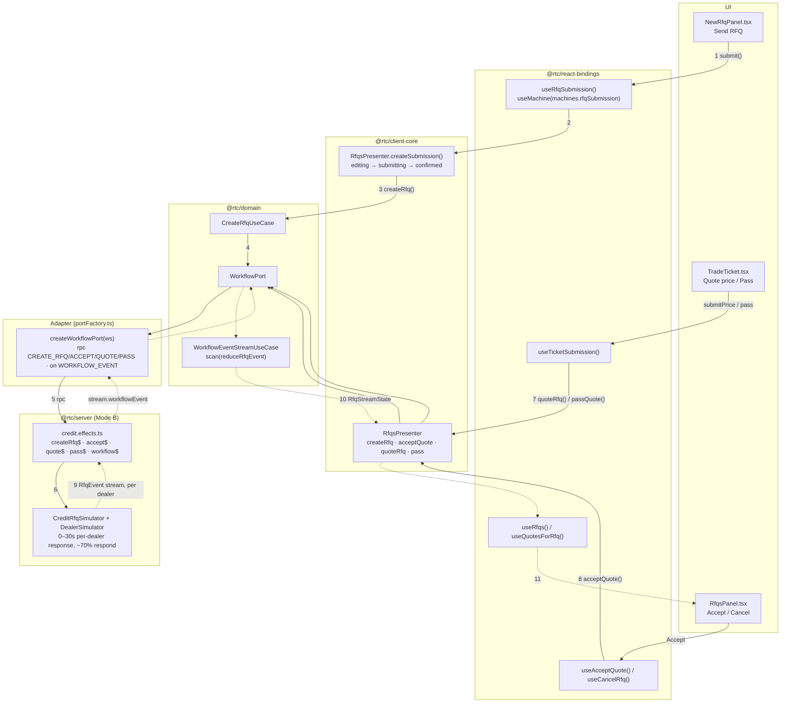
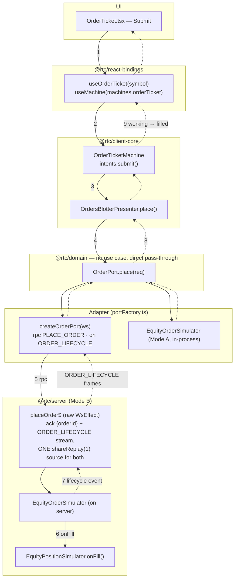
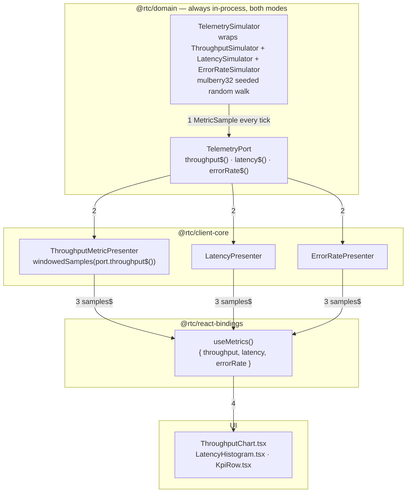

[◀ 14. Composition & Wiring](14-composition-and-wiring.md) · [Architecture Document](../architecture.md) · [16. Trailheads ▶](16-trailheads.md)

## 15. Flows

§§4–5 show what crosses the wire and which states a machine visits, message by message. This section walks the same five journeys end to end through the *code* — every hop through a real file and a real symbol, from a UI event or a server tick to the pixel or the wire. Read it as the companion to §13's static package map: §13 shows where the rooms are, §15 shows someone actually walking through the house.

### 15.1 Control Flow vs Imports vs Data Flow

Three different "directions" are easy to conflate in a codebase this layered, and each flow below draws on all three:

**Imports** are a compile-time fact, fixed by the dependency rule: `client-react` / `client-react-native` depend on `react-bindings`, which depends on `client-core`, which depends on `domain` and `shared` ([§6 Package Dependencies](06-package-dependencies.md)). This direction never reverses — it's enforced by `package.json` and the grep gates in [§12](12-architectural-gates.md), not by any runtime behaviour.

**Control flow** — who calls whom — mostly follows imports *inward*: a click handler in the UI calls a ViewModel hook (`useViewModel()`), which calls a machine intent or a presenter method, which constructs a domain use case, which calls a port method, which an adapter fulfils (a WS `rpc()`/`send()` or an in-process simulator call). This is a synchronous call chain even though most of the methods being called return `Observable`s — nothing has *happened* yet at the moment of the call; a subscription has merely been arranged.

**Data flow** is the reverse: once a port's `Observable` is subscribed, values travel *outward* — an adapter emits, a domain use case enriches or reduces it, a presenter multicasts it (`shareReplay`/`share`), a bindings hook re-renders on it, and the UI paints. So the same six layers are walked in opposite orders for control vs. data, and the diagrams below draw both: solid arrows for a command travelling in, dashed arrows for the resulting stream travelling back out.

```mermaid
flowchart TB
    subgraph imports["Imports — compile time, inward only, never reverses"]
        direction LR
        i1["UI"]:::ui --> i2["Bindings"]:::bridge --> i3["Core"]:::core --> i4["Domain / Shared"]:::domain
    end
    subgraph control["Control — a click or command, synchronous call chain, inward"]
        direction LR
        c1["UI event"]:::ui --> c2["Hook / intent"]:::bridge --> c3["Presenter / Machine"]:::core --> c4["Use Case → Port"]:::domain
    end
    subgraph data["Data — an Observable emission, the reverse chain, outward"]
        direction LR
        d1["Adapter emits"]:::domain --> d2["Use Case enriches"]:::domain --> d3["Presenter multicasts"]:::core --> d4["Hook re-renders UI"]:::bridge
    end

    classDef ui     fill:#1f6feb,stroke:#79c0ff,color:#ffffff
    classDef bridge fill:#8957e5,stroke:#d2a8ff,color:#ffffff
    classDef core   fill:#238636,stroke:#56d364,color:#ffffff
    classDef domain fill:#1f2d3d,stroke:#4493f8,color:#e6edf3
    style imports fill:transparent,stroke:#6e7681
    style control fill:transparent,stroke:#6e7681
    style data fill:transparent,stroke:#6e7681
```

**The highest-frequency flow — FX price streaming — is deliberately not repeated here.** [§7's animated treatment](07-communication-patterns.md#animated-the-life-of-a-price-tick) already walks that exact journey (`PricingSimulator` → `pricing$` effect → `WsAdapter` → `PricingPort` → `PriceStreamUseCase` → `PriceStreamPresenter.price$` → `usePrice()` → `Tile`), frame by frame, for both Mode A and Mode B; see also [§4.1](04-sequence-diagrams.md#41-fx-price-streaming). What follows are the five flows that stream doesn't cover: connecting, executing, quoting, ordering, and observing the system itself.

### 15.2 Connection Lifecycle — Gateway Up, Down, and Reconnect

The connection status shown in the header ([`ConnectionStatusBar.tsx`](../../packages/client-react/src/ui/shell/connection/ConnectionStatusBar.tsx), [`StatusBar.tsx`](../../packages/client-react/src/ui/shell/status/StatusBar.tsx)) and the blocking overlay ([`ConnectionOverlay.tsx`](../../packages/client-react/src/ui/shell/connection/ConnectionOverlay.tsx), or `ConnectionBanner.tsx` on RN) is a pure function of a merged event stream, not a raw socket read.

1. **Reconnect click** (idle-disconnected only): `ConnectionOverlay.tsx` calls `reconnect` from `useReconnect()`.
2. `useReconnect` resolves to `commands.reconnect` in `packages/client-core/src/composition.ts`.
3. `commands.reconnect()` pushes `{ type: "reconnect" }` onto the module-level `reconnect$` Subject (`composition.ts`).
4. `reconnect$` is merged into the `ConnectionEventsPort.events()` stream at the composition root (`buildBrowserPorts.ts`); the merged stream is piped through `routeIdleLifecycle()` (`composition.ts`), whose `tap` calls `ws.reopen()` on `WsAdapter` for a `reconnect` event (and `ws.closeForIdle()` for `idleTimeout`) — the one place a connection event has a *side effect* on the transport, not just a state transition.
5. Whichever adapter produced the event — `WsConnectionEventsAdapter` wrapping `WsAdapter`'s `onopen`/`onclose` handlers in Mode B, `BrowserConnectionEventsAdapter`'s idle timer and `online`/`offline` listeners (always active, both modes), or `ConnectionEventsSimulator` in Mode A — reaches `ConnectionStatusUseCase.execute()` (`packages/domain/src/usecases/ConnectionStatusUseCase.ts`) via the `ConnectionEventsPort`.
6. The use case `scan`s every event through the pure function `nextConnectionStatus()` (`packages/domain/src/connection/connectionStatus.ts`), producing the next `ConnectionStatus`.
7. `ConnectionStatusPresenter.status$` (`packages/client-core/src/presenters/ConnectionStatusPresenter.ts`) multicasts it with `shareReplay({ bufferSize: 1, refCount: true })`.
8. `useConnectionStatus()` (bound in `createViewModel.ts`) re-renders every subscribed component — the status bar, the overlay, `ConnectionBanner.tsx` on RN.

Same state machine at message level: [§5.1 Connection Status](05-state-diagrams.md#51-connection-status). The idle/offline wording split lives in `ConnectionOverlay.tsx`'s `overlayMessages` map, not in the domain layer — the domain only knows the five `ConnectionStatus` values.

### 15.3 FX Trade Execution — Click to Confirmation

1. `Tile.tsx` reads `useTileExecution` from `useViewModel()`; clicking Buy/Sell calls `tileExecution.intents.execute(direction, price, notional)`.
2. `useTileExecution(pair)` (`createViewModel.ts`) is a per-mount `useMachine(machines.tileExecution(pair))` — a fresh `TileExecutionMachine` per tile, auto-disposed on unmount.
3. `createTileExecutionMachine` (`packages/client-core/src/presenters/TileExecutionMachine.ts`) pushes the command onto its internal `execute$` Subject, which `switchMap`s into a lifecycle race: `started` → (`tooLong` at 2s / a result / `timeout` at 30s) → `finished`. The constants (`TOO_LONG_THRESHOLD_MS`, `EXECUTION_TIMEOUT_MS`, `CONFIRMATION_DISMISS_MS`) live in `@rtc/domain`.
4. The machine's `deps.execute` is wired in `composition.ts` to `TradeExecutionPresenter.execute()` (`packages/client-core/src/presenters/TradeExecutionPresenter.ts`).
5. `TradeExecutionPresenter.execute()` constructs `new ExecuteTradeUseCase(this.execution).execute(input)` (`packages/domain/src/usecases/ExecuteTradeUseCase.ts`), which derives `spotRate` from the tile's displayed bid/ask by `direction` and computes `dealtCurrency`, then calls `ExecutionPort.executeTrade(request)`.
6. In Mode B, `createExecutionPort(ws)` (`packages/client-core/src/adapters/portFactory.ts`) sends `CLIENT_MSG.EXECUTE_TRADE` via `ws.rpc(...)` with a correlation ID; the `executeTrade$` effect (`packages/server/src/effects/fx.effects.ts`, built with `rpc(CLIENT_MSG.EXECUTE_TRADE, SERVER_MSG.EXECUTION_RESPONSE, ...)`) calls `ctx.execution.executeTrade(...)` against the server-hosted `ExecutionSimulator` (`packages/domain/src/simulators/ExecutionSimulator.ts` — GBPJPY is always rejected, EURJPY carries an extra 4s delay, everything else resolves in 0–2s). In Mode A the same `ExecutionSimulator` class runs in-process, called directly.
7–9. The resolved `Trade` (or rejection) flows back through the port, and `ExecuteTradeUseCase` maps `TradeStatus.Rejected` to `ExecutionStatus.Rejected`, everything else to `Done`.
10. `TradeExecutionPresenter.execute()`'s `tap` also pushes an `ExecutionOutcome` onto its own `executions$` Subject (a side channel other tiles/the blotter can observe independently of this call's caller).
11. Back in the machine, the result collapses the race into `{ status: "finished", executionStatus, trade }`, then auto-dismisses to `ready` after `CONFIRMATION_DISMISS_MS` (5s).
12. `useTileExecution` re-renders `Tile.tsx` at every state transition — `started` → possibly `tooLong` → `finished` → back to `ready`.

Same message exchange, and the trade also landing in the blotter via a *separate* `TradeStoreSimulator` subscription: [§4.2 FX Trade Execution (RPC)](04-sequence-diagrams.md#42-fx-trade-execution-rpc). Same state machine: [§5.4 FX Trade Execution Flow](05-state-diagrams.md#54-fx-trade-execution-flow).

### 15.4 Credit RFQ — Request to Accepted Deal

The credit RFQ flow is the one with the richest state machine (§5.2, §5.3) and the widest fan-out (one RFQ, N dealer quotes, each independently timed) — the animated diagram below focuses on that fan-out and convergence, which a static diagram flattens.

1. `NewRfqPanel.tsx` calls `submission.intents.submit(input, onRedirect)` from `useRfqSubmission()`.
2. `useRfqSubmission()` is a per-mount `useMachine(machines.rfqSubmission())`, wired in `composition.ts` to `presenters.rfqs.createSubmission()`.
3. `RfqsPresenter.createSubmission()` (`packages/client-core/src/presenters/RfqsPresenter.ts`) runs `editing → submitting`, then calls its own `createRfq(input)`.
4. `RfqsPresenter.createRfq()` constructs `new CreateRfqUseCase(this.workflow).execute(input)` (`packages/domain/src/usecases/CreateRfqUseCase.ts`), which calls `WorkflowPort.createRfq(request)`.
5. `createWorkflowPort(ws)` (`portFactory.ts`) sends `CLIENT_MSG.CREATE_RFQ` via `ws.rpc(...)`; the `createRfq$` rpc effect (`packages/server/src/effects/credit.effects.ts`) hands it to `CreditRfqSimulator`.
6. The simulator creates the `Rfq` (state `Open`) and, per selected dealer, a `Quote` (state `pendingWithoutPrice`), driven by `DealerSimulator`'s per-dealer response timing (0–30s, ~70% respond at all).
7. On the sell side, `TradeTicket.tsx` drives `useTicketSubmission()` → `RfqsPresenter.quoteRfq()`/`passQuote()` → the same `WorkflowPort`, `rpc(QUOTE)`/`rpc(PASS)`.
8. Accept/cancel/pass are **direct port pass-throughs with no dedicated use case** — `RfqsPresenter.acceptQuote(quoteId)` calls `this.workflow.accept(quoteId)` directly (mirrored in `RfqsPanel.tsx`'s `useAcceptQuote()`), matching the "accept/cancel/pass are direct port pass-throughs" note already called out in [§4.3](04-sequence-diagrams.md#43-credit-rfq-workflow).
9. Every `RfqEvent` the simulator emits (`quoteCreated`, `quoteQuoted`, `quoteAccepted`, `quoteRejected`, `rfqClosed`, ...) streams back over `SERVER_MSG.WORKFLOW_EVENT` to `WorkflowPort.events()`.
10. `WorkflowEventStreamUseCase.execute()` (`packages/domain/src/usecases/WorkflowEventStreamUseCase.ts`) `scan`s every event through the pure `reduceRfqEvent()` reducer into an `RfqStreamState` (`ReadonlyMap` of RFQs and quotes); `RfqsPresenter` derives `rfqs$`, `allQuotes$`, and per-RFQ `quotesForRfq$` from it, each `distinctUntilChanged` + `shareReplay`.
11. `useRfqs()` / `useQuotesForRfq(rfqId)` re-render `RfqsPanel.tsx` and `RfqCard.tsx` as quotes arrive and the RFQ closes.

Same message exchange: [§4.3 Credit RFQ Workflow](04-sequence-diagrams.md#43-credit-rfq-workflow). Same per-quote and per-RFQ state machines: [§5.2 Quote State Machine](05-state-diagrams.md#52-quote-state-machine-credit-rfq), [§5.3 RFQ Lifecycle](05-state-diagrams.md#53-rfq-lifecycle).

**Animated: the quote race.** `15-rfq-quote-race.svg` (SMIL, loops every 12s, same conventions as [`tick-journey.svg`](tick-journey.svg)) shows three dealer quotes starting `pendingWithoutPrice` together, two pricing in (`pendingWithPrice`) while the third passes, then the trader accepting one — the accepted quote turns green, the other priced quote turns red (`rejectedWithPrice`), matching §5.2's transition table:

### 15.5 Equities Order — Ticket to Fill

Order placement is the one flow with **no domain use case in the client path** — `OrderTicketMachine` calls the port directly, matching `OrderPort`'s shape (`place`/`cancel`/`orders`, no enrichment step) and the "raw primitive" nature of the server's `placeOrder$` effect (§4.4).

1. `OrderTicket.tsx` reads `useOrderTicket` and calls `intents.submit()`.
2. `useOrderTicket(symbol)` is a per-mount `useMachine(machines.orderTicket(defaultSymbol))`, wired in `composition.ts` (`orderTicket: (defaultSymbol) => createOrderTicketMachine({ place: presenters.ordersBlotter.place, defaultSymbol })`).
3. `createOrderTicketMachine` (`packages/client-core/src/presenters/OrderTicketMachine.ts`) validates the form (`qty > 0`, a limit price for `type: "limit"`), goes `editing → submitting`, and calls `deps.place(req)`.
4. `deps.place` is `OrdersBlotterPresenter.place()` (`packages/client-core/src/presenters/OrdersBlotterPresenter.ts`), which calls `this.orderPort.place(req)` — **directly**; there is no `PlaceOrderUseCase` in `@rtc/domain/usecases`, unlike every other command flow in this document.
5. In Mode B, `createOrderPort(ws)` (`portFactory.ts`) sends `CLIENT_MSG.PLACE_ORDER` via `ws.rpc(...)`. The `placeOrder$` effect (`packages/server/src/effects/equities.effects.ts`) is a raw `WsEffect`, not the `rpc()`/`stream()` sugar — it builds one `shareReplay({ bufferSize: 1, refCount: true })` source from `ctx.orders.place(...)` and derives *both* the RPC ack (`take(1)`, mapped to `{ orderId }`) and the `ORDER_LIFECYCLE` stream from it, so the ack and the first lifecycle frame can never race.
6. `EquityOrderSimulator` (`packages/domain/src/simulators/` — Mode A runs the same class in-process) advances the order through `new → working → partiallyFilled → filled` (or `rejected`); each fill also calls `EquityPositionSimulator.onFill(fill)`, updating the Positions blotter on a stream `OrderTicketMachine` never touches.
7–8. Lifecycle frames flow back through `OrderPort.place()`'s `Observable` (`createOrderPort`'s `ws.on(SERVER_MSG.ORDER_LIFECYCLE, ...)` filters by `orderId` and completes on a terminal status) into `OrdersBlotterPresenter.place()` and back to the machine.
9. `orderToPhase()` inside the machine maps each `EquityOrder.status` to a `OrderTicketState` phase (`working` / `partiallyFilled` / `filled` / `rejected`); `useOrderTicket` re-renders `OrderTicket.tsx` at each phase.

Same message exchange, including the "ack + stream from one shared source" detail: [§4.4 Equities Order Lifecycle](04-sequence-diagrams.md#44-equities-order-lifecycle).

### 15.6 Admin Telemetry — Simulated Metrics to Chart

This flow never touches the wire in *either* mode — confirmed by grepping `packages/shared/src/protocol/messages.ts` for any `telemetry`/throughput-sampling message name and finding none. `TelemetrySimulator` is constructed directly in both `createSimulatorPorts` and `createWsRealPorts` (`packages/client-core/src/adapters/portFactory.ts`), mirroring how `preferences` is handled — see the "always local" callout in [§7 Runtime Topology](07-communication-patterns.md#runtime-topology-what-runs-when). (The `admin` throughput *setpoint* is the one exception: `GET_THROUGHPUT`/`SET_THROUGHPUT` *is* WS-backed in Mode B — only the sampled telemetry series are always local.)

1. `TelemetrySimulator` (`packages/domain/src/simulators/TelemetrySimulator.ts`) walks each metric as a seeded random offset around the admin-set throughput setpoint (`mulberry32` PRNG, `WALK_STEP_FRACTION`/`WALK_CLAMP_FRACTION`), emitting a `MetricSample { t, value }` per tick from `throughput$()`/`latency$()`/`errorRate$()` (`packages/domain/src/ports/telemetryPort.ts`).
2. Each `*MetricPresenter` (`packages/client-core/src/presenters/ThroughputMetricPresenter.ts` and its `LatencyPresenter`/`ErrorRatePresenter` siblings) pipes the port stream through `windowedSamples()` (`packages/client-core/src/presenters/windowedSamples.ts`), rolling the last N samples oldest-first for a chart series.
3. `useMetrics()` (bound in `createViewModel.ts`) plain-`bind`s all three `samples$` streams (not per-mount — one shared subscription for every consumer).
4. `ThroughputChart.tsx`, `LatencyHistogram.tsx`, and `KpiRow.tsx` (`packages/client-react/src/ui/admin/`) re-render on each new sample.

There is no §4/§5 message-level companion for this flow — it is the one flow in this document with no wire protocol at all, which is itself the point: the same seam (`TelemetryPort`) that would carry a WS message in a wire-backed flow here just wraps a local class, and nothing above the port can tell the difference.

---
