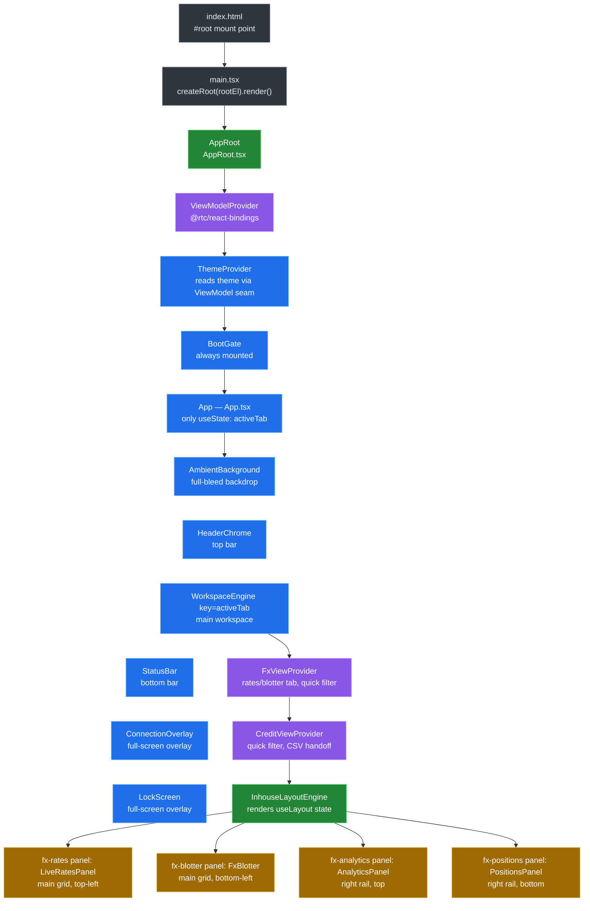
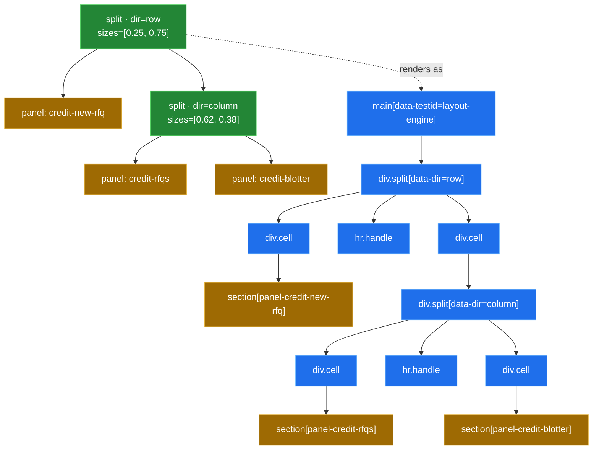

[◀ 16. Trailheads](16-trailheads.md) · [Architecture Document](../architecture.md)

## 17. The Web Client, Up Close

The web client's shell is a permanently-animated HUD sitting over a live data stream — tiles glide, panels maximize, the connection banner fades, all while prices keep ticking underneath. That kind of continuous surface is normally where React fights back: a component tree that owns its own state has to decide, on every tick, whether to re-render, and a per-frame `setState` becomes a render storm. This shell avoids the fight by construction — no business or lifecycle state lives inside a React component. Presenters and machines (`@rtc/client-core`) own every stream and every state transition outside the framework; the JSX tree that remains is a thin, replaceable renderer reading that state through one seam (`useViewModel`) and painting it, nothing more.

The five subsections below walk that renderer from the outside in: §17.1 the component tree and the provider stack that wires the seam into the DOM, §17.2 the layout engine that gives panels their maximize/collapse/resize behaviour, §17.3 the motion toolbox those panels animate with, and §17.4–17.5 the two full-screen overlays (boot splash, session lock) that sit above everything else. Each subsection ends with a one-line payoff connecting the mechanism back to "continuous UI without fighting the framework" — [§10.11](10-key-design-decisions.md#1011-continuous-ui-without-fighting-the-framework) is the long-form argument for *why* the shell is built this way; this section is the *how*.

### 17.1 The Component Tree and the Provider Stack

**Mount chain.** `packages/client-react/index.html` has one static mount point, `
` (`index.html:9`), and loads the app as an ES module, `<script type="module" src="/src/main.tsx">` (`index.html:10`). `src/main.tsx` looks that element up, throws if it's missing (`main.tsx:26-30`), and renders one tree into it: `createRoot(rootEl).render(<StrictMode><AppRoot><App /></AppRoot></StrictMode>)` (`main.tsx:32-38`). Everything downstream of that call is the subject of this section.

**`AppRoot` — the lazy-`useRef` one-shot build.** `AppRoot` (`src/AppRoot.tsx:28-50`) is the app's composition root as a component. It holds `const viewModelRef = useRef<ViewModel | null>(null)` (`AppRoot.tsx:29`) and, only while that ref is still `null`, builds the whole app in one block: `const { presenters, commands } = createApp(buildBrowserPorts())` followed by `viewModelRef.current = createViewModel(presenters, createMachineFactories(presenters), commands)` (`AppRoot.tsx:31-38`). The guard is a ref rather than `useState`/`useMemo` for a specific reason the file's own doc comment gives: "React StrictMode double-invokes the render body (and state/memo initializers) in dev to surface impurity, which would construct — and discard — a second App with its own presenters and transport wiring" (`AppRoot.tsx:23-26`). A ref cell is shared across both StrictMode invocations of the same mount, so `createApp()` — and the WebSocket/simulator wiring it starts — runs exactly once per real mount, never twice.

**Provider stack — `ViewModelProvider > ThemeProvider > BootGate`.** The built `ViewModel` is handed down through `ViewModelProvider` (`AppRoot.tsx:44`, `@rtc/react-bindings`), which nests `ThemeProvider`, which nests `BootGate` around `children` (`AppRoot.tsx:45-47`). The nesting order is load-bearing, not incidental: `ThemeProvider` nests *inside* `ViewModelProvider` "because it reads the theme preference through the ViewModel seam" (`AppRoot.tsx:20-21`) — and indeed its first line of work is `const { useThemePreference, useThemeSkinPreference } = useViewModel()` (`ThemeProvider.tsx:23`), which would throw outside a `ViewModelProvider` (`useViewModel.ts:12-14`). `BootGate` is "always mounted; whether the splash overlay shows is the BootGatePresenter's visible$ seam" (`AppRoot.tsx:40-41`) — it renders `children` unconditionally and only ever overlays a splash on top, so it never gates whether `App` itself mounts.

**`App.tsx` — six children, one `useState`.** `App` (`App.tsx:19-32`) renders exactly six children in this order: `AmbientBackground`, `HeaderChrome`, `WorkspaceEngine` (keyed by `activeTab`), `StatusBar`, `ConnectionOverlay`, `LockScreen` (`App.tsx:24-29`). The only shell-level `useState` in the whole file — and, by the "no business/lifecycle state in React" rule above, the only piece of state `App` itself owns — is `const [activeTab, setActiveTab] = useState<WorkspaceTab>("fx")` (`App.tsx:20`); everything the other five children need (connection status, session lock, boot visibility) arrives through `useViewModel()` inside those components, not through props from `App`.

**`WorkspaceEngine` and the `key={activeTab}` remount.** `WorkspaceEngine` (`App.tsx:38-57`) is the fourth child, given `key={activeTab}` at its call site (`App.tsx:26`). Inside it, `const { useLayout } = useViewModel()` then `const { state, maximize, restore, collapse, expand, resize } = useLayout(tab)` (`App.tsx:39-40`) — one call that returns both the current `LayoutState` and its five intents, passed straight into `InhouseLayoutEngine` along with the two id→component registries, `appPanelRegistry` and `appHeadRegistry` (`App.tsx:44-53`). Because React remounts a keyed subtree whenever its key changes, switching `activeTab` unmounts the entire previous `WorkspaceEngine` (and everything under it) and mounts a fresh one for the new tab — §17.2 covers the layout engine `InhouseLayoutEngine` renders into in detail; the payoff below works out what that remount actually costs.

**Secondary contexts.** `WorkspaceEngine` wraps `InhouseLayoutEngine` in two more providers, `FxViewProvider` then `CreditViewProvider` (`App.tsx:42-55`) — narrower, tab-scoped seams (not the global `ViewModel`) for view-only UI state that several sibling panels need to share:

| Provider | What it supplies | Who consumes it |
|---|---|---|
| `FxViewProvider` (`ui/fx/FxViewProvider.tsx:16-46`) | `ratesTab`/`setRatesTab`, `blotterTab`/`setBlotterTab`, `quickFilter`/`setQuickFilter`, `exportCsv`/`setExportCsvHandler` — the last pair is a ref, not state, so invoking the handler never forces a re-render (`FxViewProvider.tsx:13-15,22`) | `LiveRatesHead` (`ratesTab`, `LiveRatesHead.tsx:14`), `LiveRatesPanel` (`ratesTab`, `LiveRatesPanel.tsx:24`), `FxBlotterHead` (`FxBlotterHead.tsx:19`), `FxBlotter` (`blotterTab`/`quickFilter`/`setExportCsvHandler`, `FxBlotter.tsx:33`) |
| `CreditViewProvider` (`ui/credit/CreditViewProvider.tsx:15-41`) | `quickFilter`/`setQuickFilter`, `exportCsv`/`setExportCsvHandler` (same ref-based export handoff as FX, `CreditViewProvider.tsx:9-13,19`) | `CreditBlotterHead` (`quickFilter`/`setQuickFilter`/`exportCsv`, `CreditBlotterHead.tsx:22`), `CreditBlotter` (`quickFilter`/`setExportCsvHandler`, `CreditBlotter.tsx:43`) |

Both providers exist for the same reason: a head component (the panel's title bar) and its body (the panel's content) are siblings under `InhouseLayoutEngine`, not parent/child, so tab/filter state that both need has nowhere to live in props — a small context per workspace, scoped to one `WorkspaceEngine` mount, is the seam.

*A tab switch throws away every React component under `WorkspaceEngine` — and, unlike prices, orders, or the connection status (all of which live in shared presenters `App` never touches directly), the tab's layout arrangement is not one of the things that survives. `useLayout(tab)` resolves to `useMachine(() => machines.layout(tab))` (`createViewModel.ts:724-727`), and `machines.layout` is `(tab) => createLayoutMachine(createDefaultLayoutPort(tab))` (`composition.ts:366-368`). `createDefaultLayoutPort(tab)` builds a brand-new `{ root: ROOTS[tab], maximized: null, collapsed: [] }` on every call (`defaultLayoutPort.ts:163-170`), and `createLayoutMachine` seeds its `scan` reducer from exactly that value (`LayoutMachine.ts:135,139`) with no external store behind it. Because `useMachine` builds one machine per mount (`useMachine.ts:40-44`) and disposes it on unmount (`useMachine.ts:51-59`), and the `key={activeTab}` remount unmounts the whole `WorkspaceEngine` subtree on every tab change, any maximize/collapse/resize a user made resets to that tab's static default the next time they visit it — layout is deliberately NOT one of the things this shell keeps warm across a tab switch, even though everything upstream of the render tree (prices, orders, connection state) is.*

### 17.2 The Layout System

**The state model — a tree, not a store of pixels.** `LayoutState` (`layoutPort.ts:47-51`) is three fields: `root` (a `LayoutNode`), `maximized` (a `PanelId | null`), and `collapsed` (a `readonly PanelId[]`). `LayoutNode` (`layoutPort.ts:28-46`) is a discriminated union of exactly two shapes — `{ kind: "split", dir: "row" | "column", children, sizes }` or `{ kind: "panel", panelId }` — nothing else the engine renders exists in this type. A split's `sizes` (`layoutPort.ts:33`) are relative ratios along its `dir` axis, not literal pixel amounts; two escape hatches sit alongside them: `fixedPx`, a per-child literal-px override that also suppresses the resize handle either side of it (`layoutPort.ts:34-37`), and `initialPx`, a per-child *default* px width that renders identically but **keeps** the handle — the first drag through it converts the split to plain fractions, permanently (`layoutPort.ts:38-44`; the machine enforces this below). Every shipped tree uses `initialPx` for its rail, never `fixedPx` — nothing in the current app is genuinely un-resizable.

Panel identity and behaviour live separately, in `PANEL_SPECS` (`defaultLayoutPort.ts:17-65`) — a `PanelId → PanelSpec` map keyed by the same ids the trees reference. Most entries are just a `title`. Two optional flags carry real behaviour: `maximizeScope: "nearest-column"` on `fx-analytics`, `fx-positions`, `eq-ticket`, and `eq-watchlist` (`defaultLayoutPort.ts:22-31,50-59`) — the four rail panels that maximize within their own column rather than the whole dock — and `maximizable: false` on `credit-new-rfq` alone (`defaultLayoutPort.ts:36-40`), which hides only that one panel's maximize control (it still collapses to a strip when a sibling maximizes). A third flag, `pinned`, is spec'd but dormant: the comment above `PANEL_SPECS` calls it "unused by any default tree today" (`defaultLayoutPort.ts:11`) and says the machinery it drives — a fixed bottom strip a resizable split's `sizes` never touch — "stays for a future panel that genuinely needs to opt out of resizing" (`defaultLayoutPort.ts:11-16`); every shipped tree is fully user-resizable instead.

`createDefaultLayoutPort(tab: WorkspaceTab)` (`defaultLayoutPort.ts:163-170`; `WorkspaceTab = "fx" | "credit" | "admin" | "equities"` at `defaultLayoutPort.ts:9`) is the only `LayoutPort` implementation in the app — it looks up one of four hand-built `LayoutNode` trees (`ROOTS`, `defaultLayoutPort.ts:153-158`) and wraps it in `{ root, maximized: null, collapsed: [] }`. The trees encode the prototype's measured design: FX and Equities are near-identical two-column docks (`FX_ROOT`, `defaultLayoutPort.ts:74-99`; `EQUITIES_ROOT`, `:126-151`) — a tiles-over-blotter / chart-over-blotter left column at a 0.66/0.34 ratio beside a full-height right rail opening at a 360px or 290px `initialPx` respectively; Credit (`CREDIT_ROOT`, `:103-120`) is a 330px `initialPx` New RFQ rail beside an RFQs-over-Blotter column at 0.62/0.38; Admin (`ADMIN_ROOT`, `:122`) is a single unsplit panel. None of this is persisted anywhere — §17.1 already traces why: `createDefaultLayoutPort(tab)` builds this object fresh on every call, and nothing sits behind `LayoutPort` to remember the shape a user last dragged it into.

**`createLayoutMachine` — a redux-shaped core with a stream-shaped surface.** `createLayoutMachine(port)` (`LayoutMachine.ts:98-173`) is the `LayoutPort`'s only consumer. Five intents — `maximize`, `restore`, `collapse`, `expand`, `resize` (`LayoutIntents`, `LayoutMachine.ts:14-20`) — are five RxJS `Subject`s, `merge`d into one `LayoutEvent` stream and folded through `scan(reduce, port.initial)` (`LayoutMachine.ts:107-135`). `reduce` (`LayoutMachine.ts:69-92`) is a plain, synchronous, fully immutable switch over the five event shapes; the only case with recursive work is `resize`, which walks `resizeAt` (`LayoutMachine.ts:37-67`) down a child-index `path` to the target split and replaces its `sizes` — every ancestor on the path is a fresh object, everything off the path is referentially untouched. The folded stream feeds `@rx-state/core`'s `state()` (`LayoutMachine.ts:137-140`), and the machine keeps a `warm` subscription open (`LayoutMachine.ts:143`) — released in `dispose()` (`:164-171`) — for the reason every other machine in this codebase does the same thing: `state$` must already hold a value before `useMachine` first subscribes, not just start emitting from that point on. The reducer is entirely transactional — each event is one atomic tree replacement — yet nothing about the machine dictates how often, or how granularly, a consumer re-renders from it; that choice belongs entirely to `InhouseLayoutEngine` below. It is the same "core owns the transitions, the framework owns the rendering" split every other `@rtc/client-core` machine uses, applied here to a tree instead of a scalar.

One `reduce` case doubles as UI policy, not just bookkeeping: `resizeAt` clears the target split's `initialPx` on every resize (`LayoutMachine.ts:47`, full function `:37-67`) — a design-width rail becomes an ordinary ratio split the instant a user drags it, forever after (a second drag on the same split has no `initialPx` left to clear).

**`InhouseLayoutEngine` — the one framework-coupled spot.** The component's own header comment states its role: "the pointer-event resize drag and the strip/maximize transitions are the ONE framework-coupled spot in the app (interfaces doc §5) — confined to this component behind the LayoutPort, so a SolidJS swap re-implements only this file" (`InhouseLayoutEngine.tsx:26-31`). It splits into two renderers for a rules-of-hooks reason: `SplitNode` (`InhouseLayoutEngine.tsx:257-507`) is a real component — it owns a `useRef` for its drag handle's DOM node — and recurses by rendering a `.cell` per child plus a sibling `
` resize handle between adjacent non-pinned/non-fixed/non-stripped children; `renderPanel` (`:515-636`) is a hook-free plain function, because a panel leaf may recurse arbitrarily deep and conditionally through `renderNode` (`:640-660`) — putting a hook inside it would violate React's "same hooks, same order, every render" rule the moment two calls at the same tree position took different branches.

Two id-keyed registries are the seam between this dumb renderer and the actual per-tab UI: `appPanelRegistry` (`appPanelRegistry.tsx:31-81`) maps every `PanelId` to the module root that fills its body (`registry[panelId]?.()`, `InhouseLayoutEngine.tsx:629`), and `appHeadRegistry` (`appHeadRegistry.tsx:23-60`) optionally overrides just the header's title slot per panel — e.g. `fx-rates` renders `LiveRatesHead`'s own tab strip there instead of the default title span (`headRegistry?.[panelId]`, `InhouseLayoutEngine.tsx:539,582-591`). Ids without a head-registry entry (Credit's Sell Side, for instance) fall back to the same styled title span every other panel uses. Every panel body is additionally wrapped in `PanelErrorBoundary` (`InhouseLayoutEngine.tsx:628-630`; class component at `PanelErrorBoundary.tsx:37-63`) — the only class component in `client-react/src`, because React 19 still has no hook equivalent for `getDerivedStateFromError` — so one panel's render or effect crash renders that panel's own `PANEL ERROR` fallback instead of unmounting the whole `InhouseLayoutEngine` tree.

**The animation mechanics — CSS transitions on attribute flips, with one imperative escape hatch for the drag itself.** Maximize is render-time policy, not stored geometry: `LayoutState.maximized` is a bare `PanelId | null` (`layoutPort.ts:49`), and every render recomputes `maximizeBoundaryPath(state.root, state.maximized, specs)` (`InhouseLayoutEngine.tsx:50-53`; implementation `maximizeBoundary.ts:13-43`) — `[]` (the whole dock) for a "root"-scope panel, or the path to the nearest ancestor `dir: "column"` split for a "nearest-column" one, walked outward from the panel's own parent (`maximizeBoundary.ts:32-40`). `strippedPanelIds` (`InhouseLayoutEngine.tsx:215-227`) then collects every panel leaf under that boundary except the maximized one itself — exactly the set the current maximize forces to strips; panels outside the boundary render untouched, which is how a rail panel maximizing "within its column" leaves the main column and the rail's own width alone.

A stripped subtree's shrink is computed, not stored, too: `isStripSubtree` (`InhouseLayoutEngine.tsx:193-208`) walks a node's whole subtree and is true only when every leaf inside it is a strip (collapsed, or forced-stripped by the current maximize) — its own doc comment records the regression this fixed: without cascading the flag onto the wrapping `.cell` (`.cell[data-strip-cell="true"]`, `InhouseLayoutEngine.module.css:117-123`), only the innermost `.panel` shrank to its 32/38px bar while the cell around it kept its full ratio-derived size, leaving a dead gap. A second derived value, `stripDir`, threads the *reclaim axis* down through nested strips — the parent split's own `dir`, or the inherited ancestor `dir` when the parent itself is already fully stripped (`InhouseLayoutEngine.tsx:428`) — which is what lets multiple vertical strips in a collapsed rail stack down that rail's full height (`data-strip-fill`, `:434`; CSS at `InhouseLayoutEngine.module.css:125-135`) instead of each hugging independently.

None of this recomputation is animated in JS. Every one of those derived booleans and paths becomes a `data-*` attribute — `data-maximized`, `data-strip`, `data-strip-cell`, `data-strip-fill`, `data-initial-cell` among them — and every sizing value becomes a CSS custom property, `--split-size` for a ratio cell or `--split-fixed` for a `fixedPx`/`initialPx` cell (`InhouseLayoutEngine.tsx:455-467`). The module CSS reads those back: a `.cell`'s `flex-grow` is `calc(var(--split-size, 1) * 1000)` (`InhouseLayoutEngine.module.css:53`), a `data-fixed-cell`/`data-initial-cell` cell is `flex: 0 0 var(--split-fixed)` (`:145-156`), and both `.cell` and `.panel` carry a `prefers-reduced-motion`-gated `transition` on `flex-grow`/`flex-basis` (plus `width`/`height` on `.panel`) at 0.34s (`:169-179,271-279`). A maximize, collapse, or restore is therefore nothing but a re-render that flips these attributes and variables — the glide is the browser's own compositor animating the resulting flex-basis/flex-grow change, not a `requestAnimationFrame` loop or a spring library.

The one place a CSS transition would actively fight the user is an interactive resize drag, and the engine bypasses it imperatively rather than through React state. `onHandlePointerDown` (`InhouseLayoutEngine.tsx:276-355`) treats `setPointerCapture` as a progressive enhancement, guarded behind a `typeof` check so the drag still works where the API is absent — older engines, jsdom — (`:283-288`); it computes a `baseSizes` fraction array for the pair either side of the handle — normally just `node.sizes`, but for a split still holding `initialPx`, `measuredFractions` (`:158-181`) reads the cells' current rendered px instead, so the drag's first frame does not jump (`:314-325`) — and on every `pointermove` dispatches `onResize(path, next)` straight into the machine's `resize` intent, which (per `reduce` above) clears that split's `initialPx` for good. For the drag's own duration, the handler sets `container.dataset.dragging = "true"` directly on the DOM node (`InhouseLayoutEngine.tsx:301-309`), not via React state, because the CSS rule it triggers — `.split[data-dragging="true"] .cell { transition: none }` (`InhouseLayoutEngine.module.css:176-178`) — has to suppress the *same* `flex-grow` transition that a mid-drag re-render (which `onResize` causes on every `pointermove`) would otherwise re-enable, making the split visibly lag a frame behind the pointer between renders.

Credit's default tree (`CREDIT_ROOT`, `defaultLayoutPort.ts:103-120`) is the smallest of the four to show both node kinds and a resize handle at two nesting depths, so it stands in above for the general `LayoutNode` → DOM mapping every tab follows: `renderNode` (`InhouseLayoutEngine.tsx:640-660`) dispatches on `node.kind` at every level, and `SplitNode` inserts a handle between adjacent cells only when neither side is pinned, `fixedPx`-set, or itself a fully-stripped subtree (`InhouseLayoutEngine.tsx:435-442`).

**The executable spec.** `maximizeBoundary.test.ts` and `defaultLayoutPort.test.ts` (`packages/client-core/src/layout/__tests__/`) pin the boundary-path and per-tab-tree behaviour above, including the "nearest, not outermost, column ancestor" case for nested columns and the fallback-to-root cases; `LayoutMachine.test.ts` (`packages/client-core/src/presenters/__tests__/`) pins the reducer's immutability and the per-split `initialPx`-clearing behaviour, independent of any component. Together they are the executable form of everything this section describes in prose.

*Maximize, strip, and resize all read as instantaneous JS state changes wearing the browser's own compositor as their animation engine — `state$` update → attribute/variable flip → CSS transition — which is exactly the "continuous UI without fighting the framework" pattern [§10.11](10-key-design-decisions.md#1011-continuous-ui-without-fighting-the-framework) argues for: the layout engine never runs its own render loop to animate anything, so the permanently-ticking price stream underneath never has to share a frame budget with a spring or a `requestAnimationFrame` callback the layout system owns.*

### 17.3 The Motion Toolbox

*Written in a later task.*

### 17.4 The Boot Splash

*Written in a later task.*

### 17.5 The Session Lock

*Written in a later task.*
