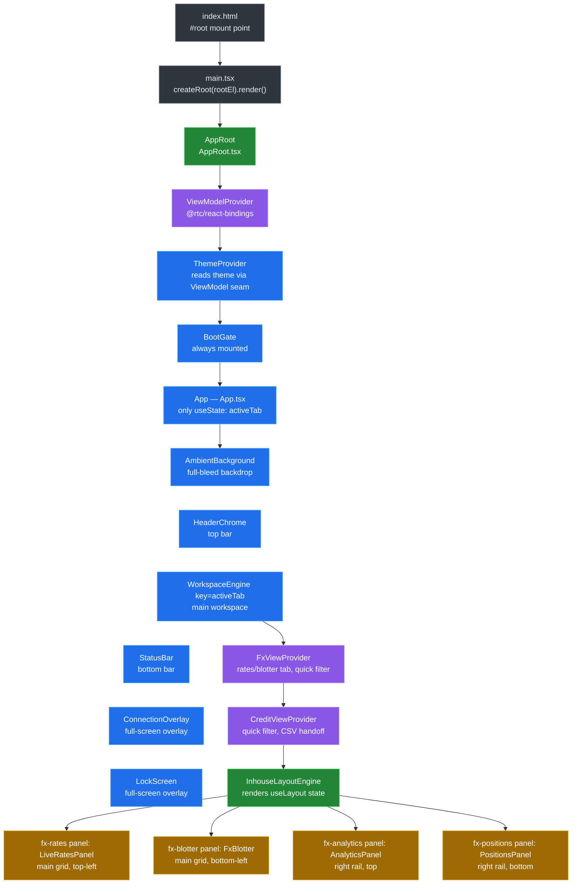
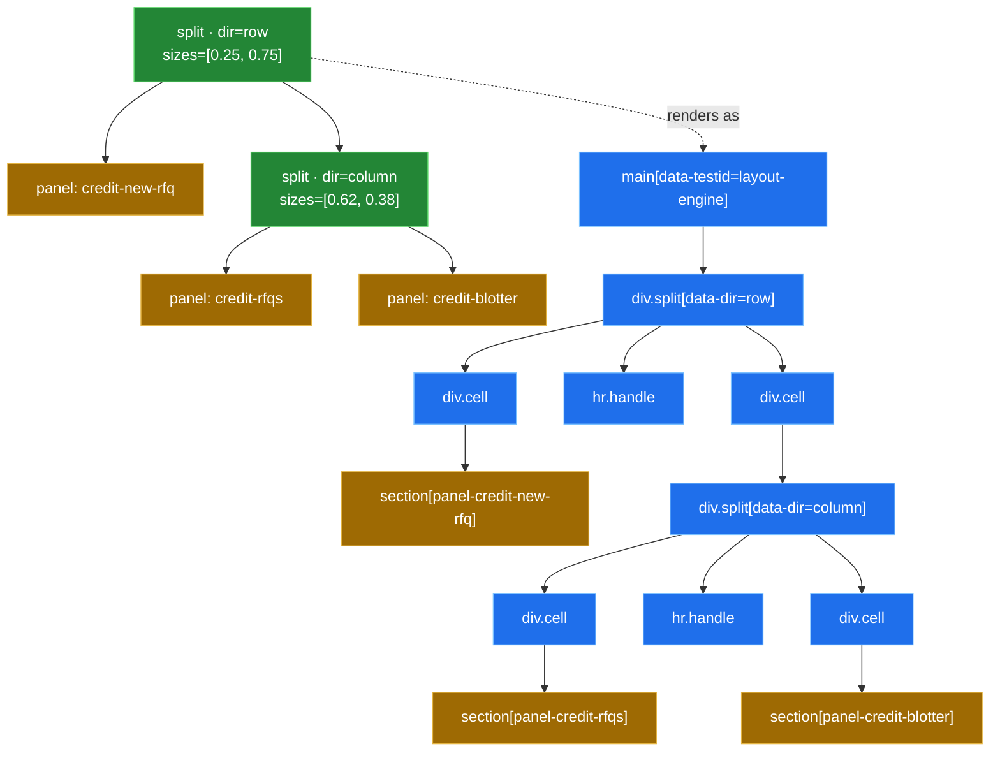
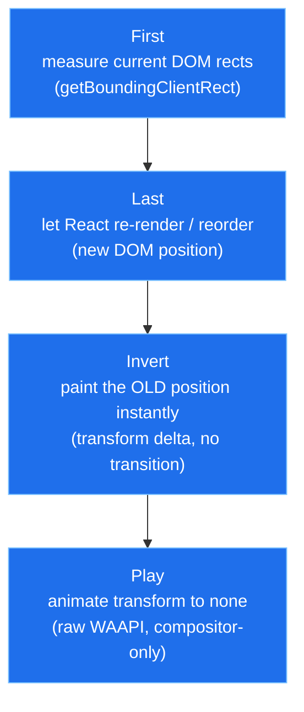

[◀ 16. Trailheads](16-trailheads.md) · [Architecture Document](../architecture.md)

## 17. The Web Client, Up Close

The web client's shell is a permanently-animated HUD sitting over a live data stream — tiles glide, panels maximize, the connection banner fades, all while prices keep ticking underneath. That kind of continuous surface is normally where React fights back: a component tree that owns its own state has to decide, on every tick, whether to re-render, and a per-frame `setState` becomes a render storm. This shell avoids the fight by construction — no business or lifecycle state lives inside a React component. Presenters and machines (`@rtc/client-core`) own every stream and every state transition outside the framework; the JSX tree that remains is a thin, replaceable renderer reading that state through one seam (`useViewModel`) and painting it, nothing more.

The five subsections below walk that renderer from the outside in: §17.1 the component tree and the provider stack that wires the seam into the DOM, §17.2 the layout engine that gives panels their maximize/collapse/resize behaviour, §17.3 the motion toolbox those panels animate with, and §17.4–17.5 the two full-screen overlays (boot splash, session lock) that sit above everything else. Each subsection ends with a one-line payoff connecting the mechanism back to "continuous UI without fighting the framework" — [§10.11](10-key-design-decisions.md#1011-continuous-ui-without-fighting-the-framework) is the long-form argument for *why* the shell is built this way; this section is the *how*.

### 17.1 The Component Tree and the Provider Stack

**Mount chain.** `packages/client-react/index.html` has one static mount point, `
` (`index.html:9`), and loads the app as an ES module, `<script type="module" src="/src/main.tsx">` (`index.html:10`). `src/main.tsx` looks that element up, throws if it's missing (`main.tsx:26-30`), and renders one tree into it: `createRoot(rootEl).render(<StrictMode><AppRoot><App /></AppRoot></StrictMode>)` (`main.tsx:32-38`). Everything downstream of that call is the subject of this section.

**`AppRoot` — the lazy-`useRef` one-shot build.** `AppRoot` (`src/AppRoot.tsx:28-50`) is the app's composition root as a component. It holds `const viewModelRef = useRef<ViewModel | null>(null)` (`AppRoot.tsx:29`) and, only while that ref is still `null`, builds the whole app in one block: `const { presenters, commands } = createApp(buildBrowserPorts())` followed by `viewModelRef.current = createViewModel(presenters, createMachineFactories(presenters), commands)` (`AppRoot.tsx:31-38`). The guard is a ref rather than `useState`/`useMemo` for a specific reason the file's own doc comment gives: "React StrictMode double-invokes the render body (and state/memo initializers) in dev to surface impurity, which would construct — and discard — a second App with its own presenters and transport wiring" (`AppRoot.tsx:23-26`). A ref cell is shared across both StrictMode invocations of the same mount, so `createApp()` — and the WebSocket/simulator wiring it starts — runs exactly once per real mount, never twice.

**Provider stack — `ViewModelProvider > ThemeProvider > BootGate`.** The built `ViewModel` is handed down through `ViewModelProvider` (`AppRoot.tsx:44`, `@rtc/react-bindings`), which nests `ThemeProvider`, which nests `BootGate` around `children` (`AppRoot.tsx:45-47`). The nesting order is load-bearing, not incidental: `ThemeProvider` nests *inside* `ViewModelProvider` "because it reads the theme preference through the ViewModel seam" (`AppRoot.tsx:20-21`) — and indeed its first line of work is `const { useThemePreference, useThemeSkinPreference } = useViewModel()` (`ThemeProvider.tsx:23`), which would throw outside a `ViewModelProvider` (`useViewModel.ts:12-14`). `BootGate` is "always mounted; whether the splash overlay shows is the BootGatePresenter's visible$ seam" (`AppRoot.tsx:40-41`) — it renders `children` unconditionally and only ever overlays a splash on top, so it never gates whether `App` itself mounts.

**`App.tsx` — six children, one `useState`.** `App` (`App.tsx:19-32`) renders exactly six children in this order: `AmbientBackground`, `HeaderChrome`, `WorkspaceEngine` (keyed by `activeTab`), `StatusBar`, `ConnectionOverlay`, `LockScreen` (`App.tsx:24-29`). The only shell-level `useState` in the whole file — and, by the "no business/lifecycle state in React" rule above, the only piece of state `App` itself owns — is `const [activeTab, setActiveTab] = useState<WorkspaceTab>("fx")` (`App.tsx:20`); everything the other five children need (connection status, session lock, boot visibility) arrives through `useViewModel()` inside those components, not through props from `App`.

**`WorkspaceEngine` and the `key={activeTab}` remount.** `WorkspaceEngine` (`App.tsx:38-57`) is the fourth child, given `key={activeTab}` at its call site (`App.tsx:26`). Inside it, `const { useLayout } = useViewModel()` then `const { state, maximize, restore, collapse, expand, resize } = useLayout(tab)` (`App.tsx:39-40`) — one call that returns both the current `LayoutState` and its five intents, passed straight into `InhouseLayoutEngine` along with the two id→component registries, `appPanelRegistry` and `appHeadRegistry` (`App.tsx:44-53`). Because React remounts a keyed subtree whenever its key changes, switching `activeTab` unmounts the entire previous `WorkspaceEngine` (and everything under it) and mounts a fresh one for the new tab — §17.2 covers the layout engine `InhouseLayoutEngine` renders into in detail; the payoff below works out what that remount actually costs.

**Secondary contexts.** `WorkspaceEngine` wraps `InhouseLayoutEngine` in two more providers, `FxViewProvider` then `CreditViewProvider` (`App.tsx:42-55`) — narrower, tab-scoped seams (not the global `ViewModel`) for view-only UI state that several sibling panels need to share:

| Provider | What it supplies | Who consumes it |
|---|---|---|
| `FxViewProvider` (`ui/fx/FxViewProvider.tsx:16-46`) | `ratesTab`/`setRatesTab`, `blotterTab`/`setBlotterTab`, `quickFilter`/`setQuickFilter`, `exportCsv`/`setExportCsvHandler` — the last pair is a ref, not state, so invoking the handler never forces a re-render (`FxViewProvider.tsx:13-15,22`) | `LiveRatesHead` (`ratesTab`, `LiveRatesHead.tsx:14`), `LiveRatesPanel` (`ratesTab`, `LiveRatesPanel.tsx:24`), `FxBlotterHead` (`FxBlotterHead.tsx:19`), `FxBlotter` (`blotterTab`/`quickFilter`/`setExportCsvHandler`, `FxBlotter.tsx:33`) |
| `CreditViewProvider` (`ui/credit/CreditViewProvider.tsx:15-41`) | `quickFilter`/`setQuickFilter`, `exportCsv`/`setExportCsvHandler` (same ref-based export handoff as FX, `CreditViewProvider.tsx:9-13,19`) | `CreditBlotterHead` (`quickFilter`/`setQuickFilter`/`exportCsv`, `CreditBlotterHead.tsx:22`), `CreditBlotter` (`quickFilter`/`setExportCsvHandler`, `CreditBlotter.tsx:43`) |

Both providers exist for the same reason: a head component (the panel's title bar) and its body (the panel's content) are siblings under `InhouseLayoutEngine`, not parent/child, so tab/filter state that both need has nowhere to live in props — a small context per workspace, scoped to one `WorkspaceEngine` mount, is the seam.

*A tab switch throws away every React component under `WorkspaceEngine` — and, unlike prices, orders, or the connection status (all of which live in shared presenters `App` never touches directly), the tab's layout arrangement is not one of the things that survives. `useLayout(tab)` resolves to `useMachine(() => machines.layout(tab))` (`createViewModel.ts:724-727`), and `machines.layout` is `(tab) => createLayoutMachine(createDefaultLayoutPort(tab))` (`composition.ts:366-368`). `createDefaultLayoutPort(tab)` builds a brand-new `{ root: ROOTS[tab], maximized: null, collapsed: [] }` on every call (`defaultLayoutPort.ts:163-170`), and `createLayoutMachine` seeds its `scan` reducer from exactly that value (`LayoutMachine.ts:135,139`) with no external store behind it. Because `useMachine` builds one machine per mount (`useMachine.ts:40-44`) and disposes it on unmount (`useMachine.ts:51-59`), and the `key={activeTab}` remount unmounts the whole `WorkspaceEngine` subtree on every tab change, any maximize/collapse/resize a user made resets to that tab's static default the next time they visit it — layout is deliberately NOT one of the things this shell keeps warm across a tab switch, even though everything upstream of the render tree (prices, orders, connection state) is.*

### 17.2 The Layout System

**The state model — a tree, not a store of pixels.** `LayoutState` (`layoutPort.ts:47-51`) is three fields: `root` (a `LayoutNode`), `maximized` (a `PanelId | null`), and `collapsed` (a `readonly PanelId[]`). `LayoutNode` (`layoutPort.ts:28-46`) is a discriminated union of exactly two shapes — `{ kind: "split", dir: "row" | "column", children, sizes }` or `{ kind: "panel", panelId }` — nothing else the engine renders exists in this type. A split's `sizes` (`layoutPort.ts:33`) are relative ratios along its `dir` axis, not literal pixel amounts; two escape hatches sit alongside them: `fixedPx`, a per-child literal-px override that also suppresses the resize handle either side of it (`layoutPort.ts:34-37`), and `initialPx`, a per-child *default* px width that renders identically but **keeps** the handle — the first drag through it converts the split to plain fractions, permanently (`layoutPort.ts:38-44`; the machine enforces this below). Every shipped tree uses `initialPx` for its rail, never `fixedPx` — nothing in the current app is genuinely un-resizable.

Panel identity and behaviour live separately, in `PANEL_SPECS` (`defaultLayoutPort.ts:17-65`) — a `PanelId → PanelSpec` map keyed by the same ids the trees reference. Most entries are just a `title`. Two optional flags carry real behaviour: `maximizeScope: "nearest-column"` on `fx-analytics`, `fx-positions`, `eq-ticket`, and `eq-watchlist` (`defaultLayoutPort.ts:22-31,50-59`) — the four rail panels that maximize within their own column rather than the whole dock — and `maximizable: false` on `credit-new-rfq` alone (`defaultLayoutPort.ts:36-40`), which hides only that one panel's maximize control (it still collapses to a strip when a sibling maximizes). A third flag, `pinned`, is spec'd but dormant: the comment above `PANEL_SPECS` calls it "unused by any default tree today" (`defaultLayoutPort.ts:11`) and says the machinery it drives — a fixed bottom strip a resizable split's `sizes` never touch — "stays for a future panel that genuinely needs to opt out of resizing" (`defaultLayoutPort.ts:11-16`); every shipped tree is fully user-resizable instead.

`createDefaultLayoutPort(tab: WorkspaceTab)` (`defaultLayoutPort.ts:163-170`; `WorkspaceTab = "fx" | "credit" | "admin" | "equities"` at `defaultLayoutPort.ts:9`) is the only `LayoutPort` implementation in the app — it looks up one of four hand-built `LayoutNode` trees (`ROOTS`, `defaultLayoutPort.ts:153-158`) and wraps it in `{ root, maximized: null, collapsed: [] }`. The trees encode the prototype's measured design: FX and Equities are near-identical two-column docks (`FX_ROOT`, `defaultLayoutPort.ts:74-99`; `EQUITIES_ROOT`, `:126-151`) — a tiles-over-blotter / chart-over-blotter left column at a 0.66/0.34 ratio beside a full-height right rail opening at a 360px or 290px `initialPx` respectively; Credit (`CREDIT_ROOT`, `:103-120`) is a 330px `initialPx` New RFQ rail beside an RFQs-over-Blotter column at 0.62/0.38; Admin (`ADMIN_ROOT`, `:122`) is a single unsplit panel. None of this is persisted anywhere — §17.1 already traces why: `createDefaultLayoutPort(tab)` builds this object fresh on every call, and nothing sits behind `LayoutPort` to remember the shape a user last dragged it into.

**`createLayoutMachine` — a redux-shaped core with a stream-shaped surface.** `createLayoutMachine(port)` (`LayoutMachine.ts:98-173`) is the `LayoutPort`'s only consumer. Five intents — `maximize`, `restore`, `collapse`, `expand`, `resize` (`LayoutIntents`, `LayoutMachine.ts:14-20`) — are five RxJS `Subject`s, `merge`d into one `LayoutEvent` stream and folded through `scan(reduce, port.initial)` (`LayoutMachine.ts:107-135`). `reduce` (`LayoutMachine.ts:69-92`) is a plain, synchronous, fully immutable switch over the five event shapes; the only case with recursive work is `resize`, which walks `resizeAt` (`LayoutMachine.ts:37-67`) down a child-index `path` to the target split and replaces its `sizes` — every ancestor on the path is a fresh object, everything off the path is referentially untouched. The folded stream feeds `@rx-state/core`'s `state()` (`LayoutMachine.ts:137-140`), and the machine keeps a `warm` subscription open (`LayoutMachine.ts:143`) — released in `dispose()` (`:164-171`) — for the reason every other machine in this codebase does the same thing: `state$` must already hold a value before `useMachine` first subscribes, not just start emitting from that point on. The reducer is entirely transactional — each event is one atomic tree replacement — yet nothing about the machine dictates how often, or how granularly, a consumer re-renders from it; that choice belongs entirely to `InhouseLayoutEngine` below. It is the same "core owns the transitions, the framework owns the rendering" split every other `@rtc/client-core` machine uses, applied here to a tree instead of a scalar.

One `reduce` case doubles as UI policy, not just bookkeeping: `resizeAt` clears the target split's `initialPx` on every resize (`LayoutMachine.ts:47`, full function `:37-67`) — a design-width rail becomes an ordinary ratio split the instant a user drags it, forever after (a second drag on the same split has no `initialPx` left to clear).

**`InhouseLayoutEngine` — the one framework-coupled spot.** The component's own header comment states its role: "the pointer-event resize drag and the strip/maximize transitions are the ONE framework-coupled spot in the app (interfaces doc §5) — confined to this component behind the LayoutPort, so a SolidJS swap re-implements only this file" (`InhouseLayoutEngine.tsx:26-31`). It splits into two renderers for a rules-of-hooks reason: `SplitNode` (`InhouseLayoutEngine.tsx:257-507`) is a real component — it owns a `useRef` for its drag handle's DOM node — and recurses by rendering a `.cell` per child plus a sibling `
` resize handle between adjacent non-pinned/non-fixed/non-stripped children; `renderPanel` (`:515-636`) is a hook-free plain function, because a panel leaf may recurse arbitrarily deep and conditionally through `renderNode` (`:640-660`) — putting a hook inside it would violate React's "same hooks, same order, every render" rule the moment two calls at the same tree position took different branches.

Two id-keyed registries are the seam between this dumb renderer and the actual per-tab UI: `appPanelRegistry` (`appPanelRegistry.tsx:31-81`) maps every `PanelId` to the module root that fills its body (`registry[panelId]?.()`, `InhouseLayoutEngine.tsx:629`), and `appHeadRegistry` (`appHeadRegistry.tsx:23-60`) optionally overrides just the header's title slot per panel — e.g. `fx-rates` renders `LiveRatesHead`'s own tab strip there instead of the default title span (`headRegistry?.[panelId]`, `InhouseLayoutEngine.tsx:539,582-591`). Ids without a head-registry entry (Credit's Sell Side, for instance) fall back to the same styled title span every other panel uses. Every panel body is additionally wrapped in `PanelErrorBoundary` (`InhouseLayoutEngine.tsx:628-630`; class component at `PanelErrorBoundary.tsx:37-63`) — the only class component in `client-react/src`, because React 19 still has no hook equivalent for `getDerivedStateFromError` — so one panel's render or effect crash renders that panel's own `PANEL ERROR` fallback instead of unmounting the whole `InhouseLayoutEngine` tree.

**The animation mechanics — CSS transitions on attribute flips, with one imperative escape hatch for the drag itself.** Maximize is render-time policy, not stored geometry: `LayoutState.maximized` is a bare `PanelId | null` (`layoutPort.ts:49`), and every render recomputes `maximizeBoundaryPath(state.root, state.maximized, specs)` (`InhouseLayoutEngine.tsx:50-53`; implementation `maximizeBoundary.ts:13-43`) — `[]` (the whole dock) for a "root"-scope panel, or the path to the nearest ancestor `dir: "column"` split for a "nearest-column" one, walked outward from the panel's own parent (`maximizeBoundary.ts:32-40`). `strippedPanelIds` (`InhouseLayoutEngine.tsx:215-227`) then collects every panel leaf under that boundary except the maximized one itself — exactly the set the current maximize forces to strips; panels outside the boundary render untouched, which is how a rail panel maximizing "within its column" leaves the main column and the rail's own width alone.

A stripped subtree's shrink is computed, not stored, too: `isStripSubtree` (`InhouseLayoutEngine.tsx:193-208`) walks a node's whole subtree and is true only when every leaf inside it is a strip (collapsed, or forced-stripped by the current maximize) — its own doc comment records the regression this fixed: without cascading the flag onto the wrapping `.cell` (`.cell[data-strip-cell="true"]`, `InhouseLayoutEngine.module.css:117-123`), only the innermost `.panel` shrank to its 32/38px bar while the cell around it kept its full ratio-derived size, leaving a dead gap. A second derived value, `stripDir`, threads the *reclaim axis* down through nested strips — the parent split's own `dir`, or the inherited ancestor `dir` when the parent itself is already fully stripped (`InhouseLayoutEngine.tsx:428`) — which is what lets multiple vertical strips in a collapsed rail stack down that rail's full height (`data-strip-fill`, `:434`; CSS at `InhouseLayoutEngine.module.css:125-135`) instead of each hugging independently.

None of this recomputation is animated in JS. Every one of those derived booleans and paths becomes a `data-*` attribute — `data-maximized`, `data-strip`, `data-strip-cell`, `data-strip-fill`, `data-initial-cell` among them — and every sizing value becomes a CSS custom property, `--split-size` for a ratio cell or `--split-fixed` for a `fixedPx`/`initialPx` cell (`InhouseLayoutEngine.tsx:455-467`). The module CSS reads those back: a `.cell`'s `flex-grow` is `calc(var(--split-size, 1) * 1000)` (`InhouseLayoutEngine.module.css:53`), a `data-fixed-cell`/`data-initial-cell` cell is `flex: 0 0 var(--split-fixed)` (`:145-156`), and both `.cell` and `.panel` carry a `prefers-reduced-motion`-gated `transition` on `flex-grow`/`flex-basis` (plus `width`/`height` on `.panel`) at 0.34s (`:169-179,271-279`). A maximize, collapse, or restore is therefore nothing but a re-render that flips these attributes and variables — the glide is the browser's own compositor animating the resulting flex-basis/flex-grow change, not a `requestAnimationFrame` loop or a spring library.

The one place a CSS transition would actively fight the user is an interactive resize drag, and the engine bypasses it imperatively rather than through React state. `onHandlePointerDown` (`InhouseLayoutEngine.tsx:276-355`) treats `setPointerCapture` as a progressive enhancement, guarded behind a `typeof` check so the drag still works where the API is absent — older engines, jsdom — (`:283-288`); it computes a `baseSizes` fraction array for the pair either side of the handle — normally just `node.sizes`, but for a split still holding `initialPx`, `measuredFractions` (`:158-181`) reads the cells' current rendered px instead, so the drag's first frame does not jump (`:314-325`) — and on every `pointermove` dispatches `onResize(path, next)` straight into the machine's `resize` intent, which (per `reduce` above) clears that split's `initialPx` for good. For the drag's own duration, the handler sets `container.dataset.dragging = "true"` directly on the DOM node (`InhouseLayoutEngine.tsx:301-309`), not via React state, because the CSS rule it triggers — `.split[data-dragging="true"] .cell { transition: none }` (`InhouseLayoutEngine.module.css:176-178`) — has to suppress the *same* `flex-grow` transition that a mid-drag re-render (which `onResize` causes on every `pointermove`) would otherwise re-enable, making the split visibly lag a frame behind the pointer between renders.

Credit's default tree (`CREDIT_ROOT`, `defaultLayoutPort.ts:103-120`) is the smallest of the four to show both node kinds and a resize handle at two nesting depths, so it stands in above for the general `LayoutNode` → DOM mapping every tab follows: `renderNode` (`InhouseLayoutEngine.tsx:640-660`) dispatches on `node.kind` at every level, and `SplitNode` inserts a handle between adjacent cells only when neither side is pinned, `fixedPx`-set, or itself a fully-stripped subtree (`InhouseLayoutEngine.tsx:435-442`).

**The executable spec.** `maximizeBoundary.test.ts` and `defaultLayoutPort.test.ts` (`packages/client-core/src/layout/__tests__/`) pin the boundary-path and per-tab-tree behaviour above, including the "nearest, not outermost, column ancestor" case for nested columns and the fallback-to-root cases; `LayoutMachine.test.ts` (`packages/client-core/src/presenters/__tests__/`) pins the reducer's immutability and the per-split `initialPx`-clearing behaviour, independent of any component. Together they are the executable form of everything this section describes in prose.

*Maximize, strip, and resize all read as instantaneous JS state changes wearing the browser's own compositor as their animation engine — `state$` update → attribute/variable flip → CSS transition — which is exactly the "continuous UI without fighting the framework" pattern [§10.11](10-key-design-decisions.md#1011-continuous-ui-without-fighting-the-framework) argues for: the layout engine never runs its own render loop to animate anything, so the permanently-ticking price stream underneath never has to share a frame budget with a spring or a `requestAnimationFrame` callback the layout system owns.*

### 17.3 The Motion Toolbox

Four techniques cover every animated surface in the shell. Which one a piece of UI reaches for follows directly from what's moving and how often: a one-off attribute flip, a keyed grid reordering, a one-shot entrance, or a business event several unrelated components care about.

**1. CSS transitions on `data-*` flips — the default.** Most of the shell's motion — the layout engine's maximize/collapse/resize glide, tick-color flashes, fill/reject pulses — never touches JS at all: a presenter or machine flips a `data-*` attribute or a `--custom-property` on render, and a `prefers-reduced-motion`-gated CSS `transition`/`animation` already declared on the element does the rest, compositor-only. §17.2 above walks the fullest instance of this pattern — the layout engine's maximize glide — in depth (`InhouseLayoutEngine.tsx:455-467`, CSS at `InhouseLayoutEngine.module.css:169-179,271-279`); `animations.module.css` (`packages/client-react/src/ui/shell/motion/animations.module.css:1-64`) holds the shell's other reusable keyframes — `hudTickUp`, `hudTickDown`, `hudFillPulse`, `hudRejectPulse`, `hudExpiryPulse`, `hudRowIn` — driven the same way, off a `data-anim` attribute its own header comment says is "driven by `data-anim` (set from `useAnimationIntents`); never by a timer" (`animations.module.css:1-4`). It's the default because it's compositor-friendly by construction, interruptible for free (a transition just re-targets mid-flight), and costs zero JS per frame; the three techniques below exist only where this one can't reach — reordering a keyed grid, a handful of one-shot effects, and choreography sourced from business events rather than a single component's own render.

**2. `useFlipGrid` — FLIP over raw WAAPI for keyed-grid reorders.** `useFlipGrid` (`packages/client-react/src/ui/shell/motion/useFlipGrid.ts:18-100`) implements FLIP (First-Last-Invert-Play). Consumers pass a `register(key)` ref callback to each grid item (`useFlipGrid.ts:82-97`); whenever the caller's `deps` array changes, a `useLayoutEffect` (`:59-80`) re-measures every registered element's `getBoundingClientRect()` — First, captured as `prevPositions` from the previous pass — lets React's own re-render already reorder the DOM — Last — computes the inverse delta between old and new rects (`flipDeltas`, `:108-130`) — Invert — and plays it as a raw `Element.animate` translate-to-none tween (`playFlip`, `:159-164`, `440`ms `cubic-bezier(.22,.85,.3,1)`, `:186-187`) — Play. Two production consumers: the Live Rates grid FLIPs on currency-category filter changes (`useFlipGrid([filter])`, `LiveRatesPanel.tsx:33`, tiles registered at `:51`), and the credit RfqsPanel FLIPs on filter-or-visible-id-set changes (`useFlipGrid([filter, renderedIdsKey])`, `RfqsPanel.tsx:194`).

Two subtleties the hook's own comments call out. First, a separate effect (`:28-57`) keeps a `ResizeObserver` plus a `window` `resize` listener that re-measure and overwrite the stored origins WITHOUT animating whenever the grid's geometry changes for a reason other than a tracked dep — a browser resize, or a dock panel being dragged/resized (both change tile sizes) — so the next real deps-change FLIP starts from the current layout, not a stale one (`useFlipGrid.ts:23-27`). Second, that refresh is itself guarded: `getBoundingClientRect` includes in-flight WAAPI transforms, so a refresh landing mid-glide would capture a transformed rect and store it as the next FLIP's origin — reading as a jump-cut. `anyGlideRunning` (`:137-145`) skips the refresh whenever any registered element still has a running `Animation`; a skipped refresh self-heals because the deps-change effect re-measures from scratch regardless the next time `deps` changes (`:30-37,59-73`).

The hook's own doc comment gives the reason it reaches for raw WAAPI here instead of the `animateOnce` Motion One wrapper below: "FLIP fires per-item on every layout, so a short-lived native animation avoids spinning up the Motion One engine per grid item" (`useFlipGrid.ts:10-12`).

`useRankGlide` (`packages/client-react/src/ui/equities/watchlist/useRankGlide.ts:193-317`) is the 1-D sibling for the equities watchlist's rank column. Instead of measuring DOM rects it derives a `translateY` delta from each symbol's index move in the sort order (`computeRankDirections`, `:34-51`) and layers in a direction-colored highlight pulse — green on a rank rise, red on a fall (`playHighlight`, `:140-173`). Its header comment records a gate `useFlipGrid` doesn't need: the default "chg" sort re-derives the order from up to six independent 500ms quote streams — as many as ~12 candidate reorders/sec against a 560ms glide (`:12-19`) — so committing every candidate would start overlapping animations and corrupt the mid-glide row-height measurement (rows visibly stacking/overlapping). `coalesceOrder` (`:86-105`) buffers all but the latest candidate while a glide is in flight and applies it only once the current glide's WAAPI `.finished` promises settle (`:293-307`).

**3. `animateOnce` — the Motion One wrapper, staged for one-shot entrances.** `animateOnce` (`packages/client-react/src/ui/shell/motion/index.ts:10-16`) wraps `motion`'s `animate(...).finished` in a promise the caller can `await`. Its module doc comment frames it as "the single Motion One import site. Everything else in the UI animates through this wrapper so the engine stays swappable" (`index.ts:3-7`) — the planned SolidJS client swaps this one file for `solid-motionone` without touching any consumer, since nothing outside it imports Motion One directly. As of this writing, `animateOnce` has no production caller in `packages/client-react/src` — it is exercised only by its own unit test (`motion.test.ts:1-24`) — which matches its role as a prepared seam for one-shot entrance animations rather than a mechanism already wired into a panel; CSS transitions (technique 1) and FLIP (technique 2) currently cover every animation the shell actually ships.

**4. `AnimationDirector` — choreography as a presenter, not a component effect.** `AnimationDirector` (`packages/client-core/src/presenters/AnimationDirector.ts:96-175`) sits one layer below all three techniques above: it subscribes to sibling presenters' domain streams — price ticks, FX/credit/equity execution outcomes, RFQ events, connection status — and emits `AnimationIntent`s (`{ target, kind }`, `:39-42`) merged into one `all$` and filterable per target via `intentsFor` (`:167-174`); its own doc comment states it has "NO DOM access — the dumb UI maps an intent to a `data-anim` attribute / Motion One call" (`:85-86`). A component reads its slice through `useAnimationIntents(target)` and derives the attribute value itself — `Tile` narrows the emitted `kind` into a `tickAnim` (`tickUp`/`tickDown`) and a separate `confirmAnim` (`fill`/`reject`) from the same intent (`Tile.tsx:42,71-78`) before painting them as `data-*` attributes technique 1's CSS reads. §14.1 already documents how the director itself is built: it's "sourced from the sibling presenters' streams rather than from a port directly" (`docs/architecture/14-composition-and-wiring.md:13`), which is why those presenters are hoisted earlier in `composition.ts`. The point of building this as a presenter rather than a `useEffect` per component: an animation trigger (a fill, a tick, an expiry) is a business event several unrelated components care about, so *when* to animate is decided once, by the stream that produces the event, not re-derived separately inside every component that renders it.

**Cross-cutting: `prefers-reduced-motion` and the compositor rules.** Every glide/pulse mechanism above gates on the identical `matchMedia("(prefers-reduced-motion: reduce)")` query: `useFlipGrid.ts:166-168,190`, `useRankGlide.ts:175-177,30`, and `RfqsPanel`'s own `prefersReducedMotion` helper, whose comment names it as "the same matchMedia seam `BootGate`/`BootSequence`/`useFlipGrid` already consult" (`RfqsPanel.tsx:311-319`) — the two full-screen overlays check the same query at `BootGate.tsx:29-31` and `BootSequence.tsx:27-29` (§17.4 covers what each does with it). None of the above is exempt from the compositor discipline [`docs/performance.md`](../performance.md) sets for the whole app — steady-state animations may touch only `transform`/`opacity`, with literal keyframe values, one animation per property per element — that guide is where the fix patterns and the profiling recipe behind every claim in this section live; it is not restated here. [§15](15-flows.md) traces a few of these same triggers (a fill, an RFQ expiry) through full user journeys, end to end.

*Even though committing a new order re-renders the grid or watchlist that reordered, the glide itself never becomes React's problem: `useFlipGrid`/`useRankGlide` measure and animate entirely inside a layout effect and the browser's own WAAPI, so a filter change or a burst of price-driven reorders never asks the render loop to animate anything frame-by-frame — it only asks it to reconcile a list that is already sitting in its final order, the same "continuous UI without fighting the framework" trade this whole shell makes ([§10.11](10-key-design-decisions.md#1011-continuous-ui-without-fighting-the-framework)).*

### 17.4 The Boot Splash

**The suppression gate — a one-shot environment read, kept out of the dumb UI.** `shouldPlayBootSplash()` (`packages/client-react/src/bootSplashGate.ts:15-25`) decides whether a page load gets the splash at all: it returns `false` under browser automation — `navigator.webdriver`, true for every Playwright and Cypress load, with no per-test URL changes required (`:20-22`) — or when the URL carries `?nosplash` (`:24`, a manual override for humans and a belt-and-suspenders e2e escape hatch), and `true` otherwise. Its own doc comment gives the reason it lives in the composition layer rather than under `src/ui`: it reads `navigator` and `window.location`, which the dumb-UI constraint this shell holds everywhere else forbids inside the renderer (`bootSplashGate.ts:12-13`). `buildBrowserPorts()` wraps it in a one-line port, `const bootSplash = { shouldPlay: shouldPlayBootSplash }` (`packages/client-react/src/app/buildBrowserPorts.ts:32`), included verbatim in both the WS-real and simulator `AppPorts` returns (`:61,99`).

**The port seed → `BootGatePresenter`, a one-shot call — → `BootGate`, which always mounts its children.** `createApp` reads that port exactly once, at composition time: `new BootGatePresenter(ports.bootSplash?.shouldPlay() ?? true)` (`packages/client-core/src/composition.ts:288`; [§14.1 step 3](14-composition-and-wiring.md#141-the-composition-root) walks this same line as one of the two unusually-wired presenters). `BootGatePresenter` (`packages/client-core/src/presenters/BootGatePresenter.ts:13-41`) mirrors `SessionPresenter` below: a `BehaviorSubject<boolean>`, a synchronous `visible` getter UI bindings seed their first render from — so a `?nosplash`/webdriver load never flashes the opaque splash for one frame before the real value lands (`:24-30`) — `reboot()` that re-raises it (`:33-35`), and `dismiss()` that lowers it (`:38-40`). `createViewModel` exposes it as `useBootGate()` → `{ visible, reboot, dismiss }` over a plain `bind()` rather than a per-mount machine, because visibility is global/shared state exactly like the session lock (`packages/react-bindings/src/createViewModel.ts:428-431,433-439,711-716`). `BootGate` itself (`packages/client-react/src/ui/shell/boot/BootGate.tsx:24-58`) renders `{children}` unconditionally and *then* `visible ? 
<BootSequence .../>
 : null` (`:49-55`) — the real `<App/>` tree mounts warm underneath on the very first render, streams already flowing, and the splash is nothing but an overlay sitting on top of an app that was already live. Dismissal is therefore never a mount, a fetch, or a first paint — just a `div` disappearing from over content that was there the whole time.

**`BootSequence` — a canvas `requestAnimationFrame` loop, one variant per boot.** `machineFactories.boot` (`composition.ts:369-377`) builds `createBootSequenceMachine({ variant: presenters.bootPreference.current(), advance, onDone })` fresh per mount via `useMachine` inside `useBootSequence(onDone)` (`createViewModel.ts:729-733`) — every raise of the splash, whether a hard reload or an Account-menu reboot, gets its own machine instance. `createBootSequenceMachine` (`packages/client-core/src/presenters/BootSequenceMachine.ts:39-100`) reads the persisted variant once and, in the same call, **advances the persisted pointer to the next one** — `deps.advance(BOOT_VARIANTS[(BOOT_VARIANTS.indexOf(variant) + 1) % BOOT_VARIANTS.length])` (`:45-46`) — before the progress ramp even starts, matching what the prototype does at boot start per the code's own citation (`:43-44`). `BOOT_VARIANTS` is exactly three entries, `["core", "laser", "docking"]` (`:10-14`), and `advance` writes through `BootPreferencePresenter.setVariant` → `PreferencesPort.setBootVariant` → `LocalStoragePreferencesAdapter` (`composition.ts:372-374`; `BootPreferencePresenter.ts:28-30`; `packages/client-react/src/app/adapters/LocalStoragePreferencesAdapter.ts:217-220`), so the pointer survives a real page reload, not just a component remount.

This is a correction worth stating plainly, since the shipped visual (below) can read otherwise: **a single boot renders exactly one of the three draw variants, never a globe-then-laser-then-docking sequence within one boot.** `BootSequence` picks its draw function once per mount, `const draw = DRAW[state.variant]` (`packages/client-react/src/ui/shell/boot/BootSequence.tsx:54`), from a fixed table — `const DRAW = { core: drawBootCore, laser: drawBootLaser, docking: drawBootDocking } as const` (`:151-155`) — and its `requestAnimationFrame` loop calls only that single function every frame for the whole boot (`:57-62`); there is no per-phase branch inside the loop. The three pure draw functions live in `bootCanvas.ts`, "ported verbatim from prototype (Reactive Trader.dc.html:819, 852-1045). No React, no DOM-owning state, no requestAnimationFrame (the rAF loop lives in BootSequence.tsx)" per its own header (`packages/client-react/src/ui/shell/boot/bootCanvas.ts:1-3`): `drawBootCore` (`:102-211`) is the rotating wireframe globe, `drawBootLaser` (`:212-536`) laser-draws panel outlines, `drawBootDocking` (`:537-1040`) converges docking-target rectangles. Theme accents are read from CSS custom properties once, at loop start — `cs.getPropertyValue("--accent-primary")` and its three siblings (`BootSequence.tsx:44-53`) — not re-read per frame. Two early-outs skip the canvas entirely: `prefers-reduced-motion: reduce` returns before the effect ever calls `getContext` (`:27-33`), and a missing 2D context — jsdom, or a canvas-less environment — returns after (`:38-42`, its own comment reading "jsdom / no-GPU: render chrome only"). The `SKIP ▸` button (`:113-120`) dispatches the machine's `skip` intent, which short-circuits the ramp straight to `progress: 100, done: true` (`BootSequenceMachine.ts:63-67,89-93`) regardless of which variant was mid-draw.

**Dismissal — two paths converging on one seam.** `onTransitionEnd` on `BootGate`'s host div calls `dismiss()` only when `event.propertyName === "opacity"` (`BootGate.tsx:40-46`), bubbled up from the splash root's own CSS fade — `.boot` transitions `opacity` over `0.8s` and drops to `0` on `[data-done="true"]` (`packages/client-react/src/ui/shell/boot/BootSequence.module.css:10,13-14`). Under `prefers-reduced-motion: reduce`, that CSS transition is itself turned off (`.boot { transition: none }`, `.canvas { display: none }`, `BootSequence.module.css:116-126`) — so no `transitionend` would ever fire — and `BootGate.handleDone` (invoked from `BootSequenceMachine`'s own `onDone`, which still fires from the state machine's `done: true` tick independent of whether the canvas painted anything, `BootSequenceMachine.ts:74-84`) calls `dismiss()` directly instead (`BootGate.tsx:28-38`). This is the same `matchMedia("(prefers-reduced-motion: reduce)")` seam §17.3 named both full-screen overlays as consulting (`BootGate.tsx:29-31`, `BootSequence.tsx:27-29`): each overlay's reduced-motion path is a real, independently-verified alternate route to the same outcome, not a silently-skipped animation. The other path back to a visible splash is the Account menu's **⟳ Reboot HUD** row (`packages/client-react/src/ui/shell/chrome/AccountMenu.tsx:122-133`), which calls the same `reboot()` obtained from `useBootGate()` (`:26,28`) — splash replay only, no app-state reset, matching the prototype. Because `BootGate` conditionally renders `<BootSequence>` off `visible`, a reboot remounts it fresh, so its per-mount machine reads and advances the variant pointer exactly as a page reload would.

*Illustrative composite: the diagram above chains all three boot variants — globe, laser-draw, docking — into one continuous reel purely for exposition. A real boot renders exactly one of the three per mount, as verified above: `DRAW[state.variant]` is read once and never re-selected mid-boot (`BootSequence.tsx:54,151-155`), and which variant that is comes from a pointer that advances on every reboot (`BootSequenceMachine.ts:45-46`).*

[§14.3](14-composition-and-wiring.md#143-boot-sequences) zooms into the same events at render level — its "Web" sequence diagram and numbered steps 5–7 trace `BootGate` mounting `children` unconditionally, `App.tsx` painting its first live tick underneath, and the `BootSequence` machine completing or being skipped, dismissing the overlay.

*The splash is the clearest instance in this shell of state living entirely outside the component that renders it: `BootGatePresenter`/`BootSequenceMachine` own visibility, variant, and progress, and `BootGate`/`BootSequence` do nothing but paint whatever those streams currently say — which is exactly why the real app underneath never waits for the splash to finish deciding anything. It is the same "continuous UI without fighting the framework" split [§10.11](10-key-design-decisions.md#1011-continuous-ui-without-fighting-the-framework) argues for, applied to a full-screen overlay instead of a single tile: dismissal reveals an already-warm app, never a pop-in.*

### 17.5 The Session Lock

**`SessionPresenter` — the same one-shot-seed, `BehaviorSubject`-backed shape as `BootGatePresenter`.** `SessionPresenter` (`packages/client-core/src/presenters/SessionPresenter.ts:43-66`) owns exactly two things: a `locked$ = new BehaviorSubject<boolean>(false)` (`:46`) and a static `SessionUser` (`:48`, defaulting to `DEMO_USER` — "Anthony Stark", `TRD-0042`, `:26-34` — the prototype's `this.user`, since the app has no real auth backend). `state$` combines them into `{ locked, user }` behind a `shareReplay({ bufferSize: 1, refCount: true })` (`:49-54`). Its own doc comment draws the line this section turns on: "REAL orchestration over the session seam (the lock/unlock transition is genuinely wired), only the biometric readout in the view is decorative" (`:37-41`). `lock()` sets `locked$` to `true` (`:58-60`); `unlock()` "re-authenticates" — the same comment's phrase — by simply clearing it back to `false` (`:62-65`), since there is nothing behind it to actually authenticate against. `createViewModel` exposes both over a plain `bind()` on `presenters.session.state$` (`packages/react-bindings/src/createViewModel.ts:407-411`) as `useSession()` → `{ state, lock, unlock }` (`:704-710`), through `lockSession`/`unlockSession` wrapper functions that close over `presenters.session` (`:413-420`).

**`LockScreen` — render-`null`-unless-locked, the same overlay pattern as `BootGate`, with genuinely no local state.** `LockScreen` (`packages/client-react/src/ui/shell/lock/LockScreen.tsx:17-80`) reads `const { state, unlock } = useSession()` and returns `null` outright when `!state.locked` (`:18-23`) — there is no wrapping conditional at a call site the way `BootGate` conditionally renders `<BootSequence>`; the component itself is the gate. When locked, it renders the operator identity (initials, name, role, id) straight from `state.user`, the shared `HudLogo` component also used in `HeaderChrome` (`LockScreen.tsx:5,32-34`; `packages/client-react/src/ui/shell/chrome/HeaderChrome.tsx:3,56`), and two purely cosmetic components each headed by the same one-line comment, "DECORATIVE — cosmetic HUD readout, intentionally not wired to any port (spec: decorative-but-dead is allowed and explicit)" (`BiometricChannel.tsx:1`, `BiometricDots.tsx:1`): `BiometricDots` renders a fixed 4-of-6 lit/unlit dot row between the role line and the button (`BiometricDots.tsx:13-24`), and `BiometricChannel` renders the static `BIOMETRIC · ENCRYPTED CHANNEL` line below it (`BiometricChannel.tsx:12-18`) — both explicitly not backed by any port or live signal. The one live control is the `AUTHENTICATE ▸` button, wired directly to the seam's `unlock` — `onClick={unlock}` (`LockScreen.tsx:67-74`) — which is the whole re-authentication flow: one click, no form, no request, `locked$.next(false)`.

**The trigger — the Account menu's lock row.** `AccountMenu` obtains both intents from the session seam in one destructure, `const { state, lock } = useSession()` (`packages/client-react/src/ui/shell/chrome/AccountMenu.tsx:27`), and its **⏻ LOCK SESSION** row — styled as the prototype's red Sign Out row (`:137-148`) — calls `lock()` directly (`:144`), raising `LockScreen` the same render cycle `App.tsx` next re-renders `state.locked` from the shared presenter.

*The lock overlay is the boot splash's structural twin: state (`locked`, `user`) lives entirely in `SessionPresenter`, outside any component, and `LockScreen` is a dumb renderer of whatever that state currently says — down to the same `useViewModel()` seam and the same render-nothing-unless-visible idiom `BootGate` uses for the splash. That symmetry is also this section's payoff for [§10.11](10-key-design-decisions.md#1011-continuous-ui-without-fighting-the-framework): a third client swapping React for SolidJS ([§8.1](08-replaceability-matrix.md#81-the-multi-client-proof--the-solidjs-plan)) reimplements only `LockScreen`'s JSX — `SessionPresenter`, `useSession`, and every byte of lock/unlock orchestration carry over unchanged, exactly as they would for `BootGate`.*
