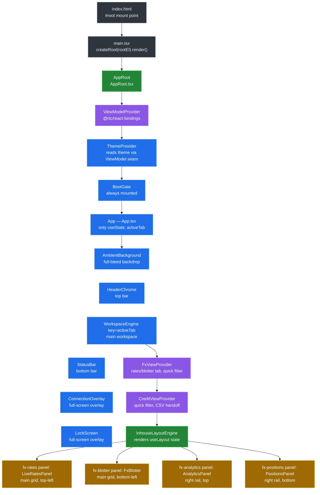

[◀ 16. Trailheads](16-trailheads.md) · [Architecture Document](../architecture.md)

## 17. The Web Client, Up Close

The web client's shell is a permanently-animated HUD sitting over a live data stream — tiles glide, panels maximize, the connection banner fades, all while prices keep ticking underneath. That kind of continuous surface is normally where React fights back: a component tree that owns its own state has to decide, on every tick, whether to re-render, and a per-frame `setState` becomes a render storm. This shell avoids the fight by construction — no business or lifecycle state lives inside a React component. Presenters and machines (`@rtc/client-core`) own every stream and every state transition outside the framework; the JSX tree that remains is a thin, replaceable renderer reading that state through one seam (`useViewModel`) and painting it, nothing more.

The five subsections below walk that renderer from the outside in: §17.1 the component tree and the provider stack that wires the seam into the DOM, §17.2 the layout engine that gives panels their maximize/collapse/resize behaviour, §17.3 the motion toolbox those panels animate with, and §17.4–17.5 the two full-screen overlays (boot splash, session lock) that sit above everything else. Each subsection ends with a one-line payoff connecting the mechanism back to "continuous UI without fighting the framework" — [§10.11](10-key-design-decisions.md#1011-continuous-ui-without-fighting-the-framework) is the long-form argument for *why* the shell is built this way; this section is the *how*.

### 17.1 The Component Tree and the Provider Stack

**Mount chain.** `packages/client-react/index.html` has one static mount point, `
` (`index.html:9`), and loads the app as an ES module, `<script type="module" src="/src/main.tsx">` (`index.html:10`). `src/main.tsx` looks that element up, throws if it's missing (`main.tsx:26-30`), and renders one tree into it: `createRoot(rootEl).render(<StrictMode><AppRoot><App /></AppRoot></StrictMode>)` (`main.tsx:32-38`). Everything downstream of that call is the subject of this section.

**`AppRoot` — the lazy-`useRef` one-shot build.** `AppRoot` (`src/AppRoot.tsx:28-50`) is the app's composition root as a component. It holds `const viewModelRef = useRef<ViewModel | null>(null)` (`AppRoot.tsx:29`) and, only while that ref is still `null`, builds the whole app in one block: `const { presenters, commands } = createApp(buildBrowserPorts())` followed by `viewModelRef.current = createViewModel(presenters, createMachineFactories(presenters), commands)` (`AppRoot.tsx:31-38`). The guard is a ref rather than `useState`/`useMemo` for a specific reason the file's own doc comment gives: "React StrictMode double-invokes the render body (and state/memo initializers) in dev to surface impurity, which would construct — and discard — a second App with its own presenters and transport wiring" (`AppRoot.tsx:23-26`). A ref cell is shared across both StrictMode invocations of the same mount, so `createApp()` — and the WebSocket/simulator wiring it starts — runs exactly once per real mount, never twice.

**Provider stack — `ViewModelProvider > ThemeProvider > BootGate`.** The built `ViewModel` is handed down through `ViewModelProvider` (`AppRoot.tsx:44`, `@rtc/react-bindings`), which nests `ThemeProvider`, which nests `BootGate` around `children` (`AppRoot.tsx:45-47`). The nesting order is load-bearing, not incidental: `ThemeProvider` nests *inside* `ViewModelProvider` "because it reads the theme preference through the ViewModel seam" (`AppRoot.tsx:20-21`) — and indeed its first line of work is `const { useThemePreference, useThemeSkinPreference } = useViewModel()` (`ThemeProvider.tsx:23`), which would throw outside a `ViewModelProvider` (`useViewModel.ts:12-14`). `BootGate` is "always mounted; whether the splash overlay shows is the BootGatePresenter's visible$ seam" (`AppRoot.tsx:40-41`) — it renders `children` unconditionally and only ever overlays a splash on top, so it never gates whether `App` itself mounts.

**`App.tsx` — six children, one `useState`.** `App` (`App.tsx:19-32`) renders exactly six children in this order: `AmbientBackground`, `HeaderChrome`, `WorkspaceEngine` (keyed by `activeTab`), `StatusBar`, `ConnectionOverlay`, `LockScreen` (`App.tsx:24-29`). The only shell-level `useState` in the whole file — and, by the "no business/lifecycle state in React" rule above, the only piece of state `App` itself owns — is `const [activeTab, setActiveTab] = useState<WorkspaceTab>("fx")` (`App.tsx:20`); everything the other five children need (connection status, session lock, boot visibility) arrives through `useViewModel()` inside those components, not through props from `App`.

**`WorkspaceEngine` and the `key={activeTab}` remount.** `WorkspaceEngine` (`App.tsx:38-57`) is the fourth child, given `key={activeTab}` at its call site (`App.tsx:26`). Inside it, `const { useLayout } = useViewModel()` then `const { state, maximize, restore, collapse, expand, resize } = useLayout(tab)` (`App.tsx:39-40`) — one call that returns both the current `LayoutState` and its five intents, passed straight into `InhouseLayoutEngine` along with the two id→component registries, `appPanelRegistry` and `appHeadRegistry` (`App.tsx:44-53`). Because React remounts a keyed subtree whenever its key changes, switching `activeTab` unmounts the entire previous `WorkspaceEngine` (and everything under it) and mounts a fresh one for the new tab — §17.2 covers the layout engine `InhouseLayoutEngine` renders into in detail; the payoff below works out what that remount actually costs.

**Secondary contexts.** `WorkspaceEngine` wraps `InhouseLayoutEngine` in two more providers, `FxViewProvider` then `CreditViewProvider` (`App.tsx:42-55`) — narrower, tab-scoped seams (not the global `ViewModel`) for view-only UI state that several sibling panels need to share:

| Provider | What it supplies | Who consumes it |
|---|---|---|
| `FxViewProvider` (`ui/fx/FxViewProvider.tsx:16-46`) | `ratesTab`/`setRatesTab`, `blotterTab`/`setBlotterTab`, `quickFilter`/`setQuickFilter`, `exportCsv`/`setExportCsvHandler` — the last pair is a ref, not state, so invoking the handler never forces a re-render (`FxViewProvider.tsx:13-15,22`) | `LiveRatesHead` (`ratesTab`, `LiveRatesHead.tsx:14`), `LiveRatesPanel` (`ratesTab`, `LiveRatesPanel.tsx:24`), `FxBlotterHead` (`FxBlotterHead.tsx:19`), `FxBlotter` (`blotterTab`/`quickFilter`/`setExportCsvHandler`, `FxBlotter.tsx:33`) |
| `CreditViewProvider` (`ui/credit/CreditViewProvider.tsx:15-41`) | `quickFilter`/`setQuickFilter`, `exportCsv`/`setExportCsvHandler` (same ref-based export handoff as FX, `CreditViewProvider.tsx:9-13,19`) | `CreditBlotterHead` (`quickFilter`/`setQuickFilter`/`exportCsv`, `CreditBlotterHead.tsx:22`), `CreditBlotter` (`quickFilter`/`setExportCsvHandler`, `CreditBlotter.tsx:43`) |

Both providers exist for the same reason: a head component (the panel's title bar) and its body (the panel's content) are siblings under `InhouseLayoutEngine`, not parent/child, so tab/filter state that both need has nowhere to live in props — a small context per workspace, scoped to one `WorkspaceEngine` mount, is the seam.

*A tab switch throws away every React component under `WorkspaceEngine` — and, unlike prices, orders, or the connection status (all of which live in shared presenters `App` never touches directly), the tab's layout arrangement is not one of the things that survives. `useLayout(tab)` resolves to `useMachine(() => machines.layout(tab))` (`createViewModel.ts:724-727`), and `machines.layout` is `(tab) => createLayoutMachine(createDefaultLayoutPort(tab))` (`composition.ts:366-368`). `createDefaultLayoutPort(tab)` builds a brand-new `{ root: ROOTS[tab], maximized: null, collapsed: [] }` on every call (`defaultLayoutPort.ts:163-170`), and `createLayoutMachine` seeds its `scan` reducer from exactly that value (`LayoutMachine.ts:135,139`) with no external store behind it. Because `useMachine` builds one machine per mount (`useMachine.ts:40-44`) and disposes it on unmount (`useMachine.ts:51-59`), and the `key={activeTab}` remount unmounts the whole `WorkspaceEngine` subtree on every tab change, any maximize/collapse/resize a user made resets to that tab's static default the next time they visit it — layout is deliberately NOT one of the things this shell keeps warm across a tab switch, even though everything upstream of the render tree (prices, orders, connection state) is.*

### 17.2 The Layout System

*Written in a later task.*

### 17.3 The Motion Toolbox

*Written in a later task.*

### 17.4 The Boot Splash

*Written in a later task.*

### 17.5 The Session Lock

*Written in a later task.*
