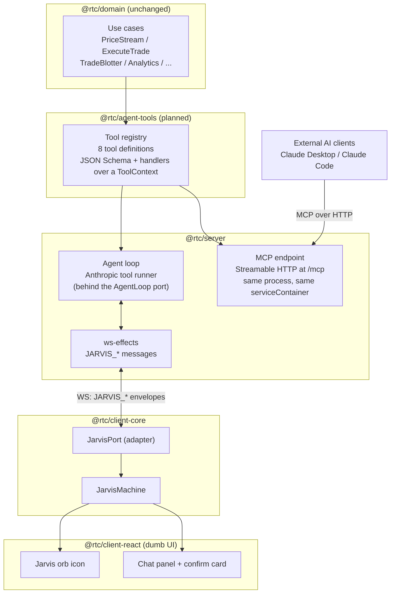
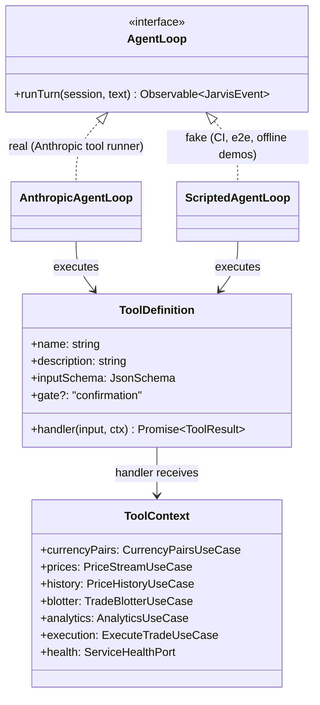
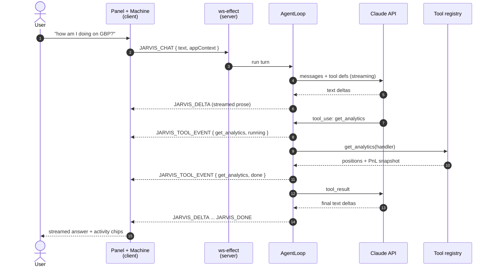
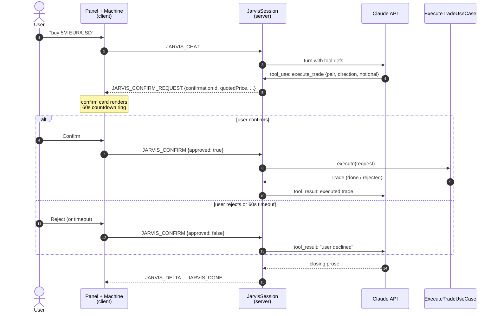
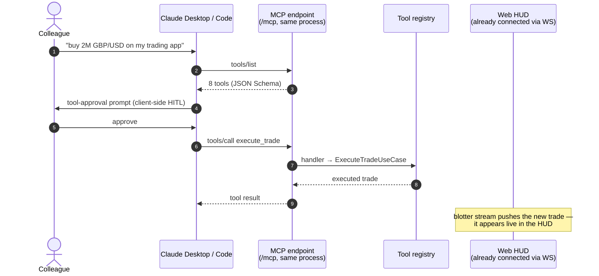
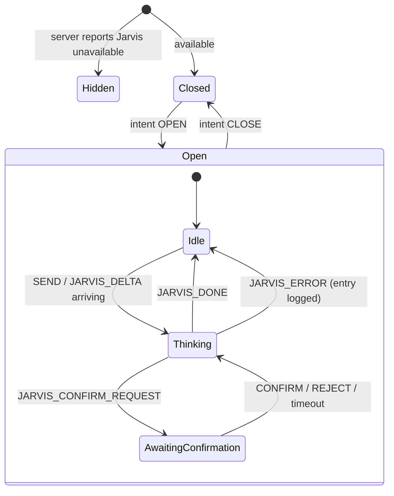
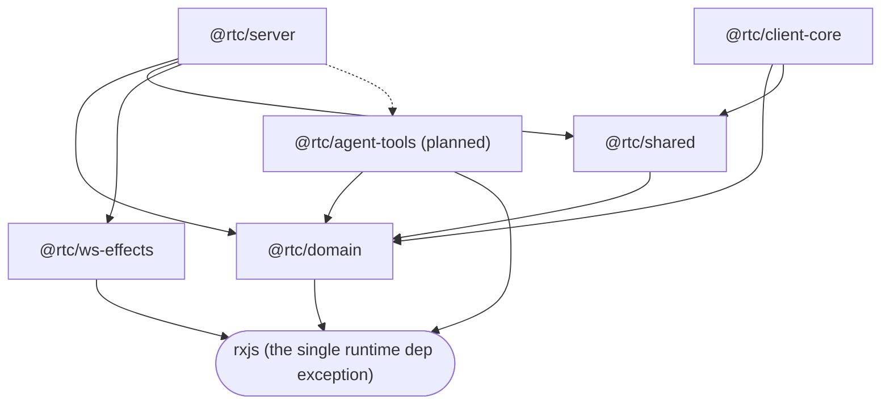

# 18. The Jarvis AI Agent Surface

> **Status: approved design, pre-implementation.** This section documents the
> architecture of the Jarvis AI assistant workstream ahead of its build-out. The
> authoritative decision record is the design spec at
> [`docs/superpowers/specs/2026-07-12-jarvis-ai-assistant-design.md`](../superpowers/specs/2026-07-12-jarvis-ai-assistant-design.md);
> this section is the architecture-level view. Where a diagram shows a package or
> module that does not exist yet, it is marked *(planned)*.

Jarvis is an AI presence in the HUD — a pulsating orb in the shell chrome that opens
into a chat panel, answers questions about the live market by consulting the app's own
domain, and executes trades behind an explicit in-chat confirmation. The same tool
surface is exposed over MCP so that external AI clients (Claude Desktop, Claude Code)
can operate the app from outside. The companion section
[§19](19-ai-capability-roadmap.md) catalogues where this grows next.

## 18.1 The thesis: AI as the third client

The web client and the RN client already share the framework-free `@rtc/client-core`
(§8.1, the multi-client proof). Jarvis is the **third head** — and unlike the planned
SolidJS swap, it is not even a UI framework. It is the strongest test yet of the
dependency rule, because an AI agent consumes the *application*, not the DOM.

The claim this workstream proves: every AI-era capability below falls out of decisions
this repo enforced long before "agent" was a product category — business logic in
framework-free use cases behind ports, UI state in explicit machines, dependency
inversion at a composition root, dumb UI, and a test strategy built on injected fakes.
None of it was designed "for AI". AI is simply the first non-UI consumer to arrive.

| Capability | The seam that makes it a bolt-on | Counterfactual in a fetch-in-`useEffect` codebase |
|---|---|---|
| Agent tools over the domain | Use cases are plain classes over injected ports, callable from any process | Trading logic lives in `onClick` handlers and effect chains; there is nothing callable to wrap |
| MCP server as a thin wrapper | Same registry, second transport; zero domain changes | The "API for the AI" becomes a parallel reimplementation, forever chasing the UI |
| A third client (the agent) | `client-core` has no React/DOM/RN imports | Logic captured in hooks is locked inside React's render lifecycle |
| Agent drives the UI (roadmap) | All UI state is machines with explicit intents | State scattered across `useState` islands; no addressable surface to act on |
| LLM market participants (roadmap) | Dealers/pricing are simulators behind ports | Mock data hardcoded in components; a smart counterparty means rewriting the tab |
| Deterministic tests for an LLM feature | The agent loop itself sits behind a port; a scripted fake serves CI and offline demos | LLM `fetch` inline in components; tests mock the network globally and flake |
| Time travel / self-introspection (roadmap) | Event-shaped WS protocol + machines + devtools observe bus | State transitions are implicit in re-renders; there is no event log to replay |

The one-paragraph counterfactual: to add "an AI that can trade" to a codebase where
fetching and business logic live inside components, you must first *invent* an API
that does not exist, keep it in sync with UI behavior forever, rebuild state handling
so an agent can observe and act, and invent a test seam for a nondeterministic
dependency — a rewrite wearing a feature's clothes. Here, the same feature is one
rxjs-only package (the registry), two adapters (agent loop, MCP endpoint), one
machine, and one dumb panel — with `@rtc/domain` byte-identical.

## 18.2 The agent surface at a glance

One tool registry, two transports, three kinds of consumer:

Reading order for the dependency rule: arrows into `@rtc/domain` never exist; the
registry depends on domain use cases; both transports depend on the registry; neither
the registry nor the domain knows either transport exists.

## 18.3 The tool registry (planned package: `@rtc/agent-tools`)

The registry is *the port* of the whole surface — a framework-free catalogue of what
an AI may do to this application:

- Runtime dependency: `rxjs` only (the same constraint as `domain`, `ws-effects`,
  `motion-core`).
- No Anthropic SDK, no MCP SDK, no transport imports. JSON Schema (plain objects)
  describes tool inputs; the Anthropic adapter passes it through and the MCP adapter
  converts at the edge.
- Handlers receive a `ToolContext` of domain use cases and ports — never server
  services.
- Read tools snapshot live Observables (`firstValueFrom` + timeout). Standing
  subscriptions are deliberately excluded until the sentinel phase (§19, Tier 2).
- Gated tools (`execute_trade`) carry `gate: "confirmation"` metadata; each transport
  realizes the gate in its own idiom (§18.5, §18.6).

The slice-1 tool set:

| Tool | Wraps | Access |
|---|---|---|
| `list_currency_pairs` | `CurrencyPairsUseCase` | read |
| `get_price` | `PriceStreamUseCase` (first-value snapshot) | read |
| `get_price_history` | `PriceHistoryUseCase` | read |
| `get_blotter` | `TradeBlotterUseCase` | read |
| `get_analytics` | `AnalyticsUseCase` (positions, PnL) | read |
| `get_service_health` | service-health port | read |
| `execute_trade` | `ExecuteTradeUseCase` | **gated** |
| `get_app_context` | tab/theme snapshot sent by the client per turn | read |

## 18.4 A chat turn, end to end

The client renders `JARVIS_TOOL_EVENT`s as inline activity chips
("⟢ consulting analytics…" → "✓ analytics") — transparency that doubles as theater.

## 18.5 Confirm-gated trade execution

`execute_trade` never runs on the model's say-so. The handler suspends the agent loop
on a promise that only an explicit user action resolves:

## 18.6 An external AI trades over MCP

The MCP endpoint is mounted **in the same Node process** as the WS server — a
correctness decision, not a convenience: a separate stdio process would own separate
simulator instances and a different blotter. In-process, a trade executed from Claude
Desktop lands in the same live state the HUD is streaming.

Human-in-the-loop lives at the architecturally honest layer per transport: the in-app
chat renders our confirm card (§18.5); external MCP clients enforce approval through
their own tool-permission surface.

## 18.7 Client state: the JarvisMachine and the orb

Chat state is an RxJS machine in `client-core/src/presenters/` (per
[ADR-005](../adr/ADR-005-ui-logic-placement.md): an autonomous async fold decoupled
from the view). The `JarvisPort` lives in `client-core/adapters` — deliberately *not*
in `domain/ports`, because chat is an application concern; keeping `@rtc/domain`
untouched is the headline.

The orb icon renders machine state through `data-jarvis-state`, and its animation obeys
[`docs/performance.md`](../performance.md) to the letter — `transform: scale()` and
`opacity` only, pre-rendered glow layers, long-period keyframes instead of JS timers,
zero `compositeFailed` events at steady state:

| `data-jarvis-state` | Visual | Driven by |
|---|---|---|
| `idle` | slow 4s breathing pulse, occasional flicker | machine `Idle` |
| `thinking` | faster, brighter pulse | machine `Thinking` |
| `attention` | distinct urgent pulse | machine `AwaitingConfirmation` |
| (icon hidden) | — | machine `Hidden` |

## 18.8 Wire protocol additions

All additive; existing clients ignore unknown message types.

| Direction | Message | Payload |
|---|---|---|
| client → server | `JARVIS_CHAT` | `{ text, appContext }` |
| client → server | `JARVIS_CONFIRM` | `{ confirmationId, approved }` |
| server → client | `JARVIS_DELTA` | streamed assistant text |
| server → client | `JARVIS_TOOL_EVENT` | `{ tool, status: running \| done }` |
| server → client | `JARVIS_CONFIRM_REQUEST` | `{ confirmationId, pair, direction, notional, quotedPrice }` |
| server → client | `JARVIS_DONE` / `JARVIS_ERROR` | turn end / error surface |

## 18.9 Determinism: the fake agent loop

The Anthropic SDK is confined behind the `AgentLoop` interface, chosen at the
composition root — the same move as `WsAdapter` and every other port in this repo.
`ScriptedAgentLoop` (`RTC_JARVIS_FAKE=1`) replays deterministic turns including tool
calls and a confirm round-trip, which buys three things at once:

1. **CI never calls the API** — ws-effects tests, machine tests, contract specs, and
   the Playwright smoke all run against the fake.
2. **The wire choreography is testable** exactly like every other effect:
   `JARVIS_CHAT → DELTA/TOOL_EVENT/CONFIRM_REQUEST/DONE`.
3. **Offline demos** — no key, no network, five minutes before showtime: the fake
   still streams, still raises the confirm card.

| Flag state | Behavior |
|---|---|
| `ANTHROPIC_API_KEY` set | real Jarvis + MCP endpoint enabled |
| `RTC_JARVIS_FAKE=1` | Jarvis enabled with `ScriptedAgentLoop` |
| neither | Jarvis effects + MCP not registered; client hides the icon |

## 18.10 Package dependencies after slice 1

Additions to the §6 graph (planned edges dashed conceptually — `agent-tools` follows
the same rxjs-only rule as `ws-effects` and `motion-core`):

`@rtc/server` gains two confined third-party deps: the Anthropic SDK
(`src/agent/`) and the MCP SDK (`src/mcp/`). Neither leaks past its directory; the
registry and domain stay clean, so swapping either SDK touches one directory — the
same replaceability contract as everything else in §8.
