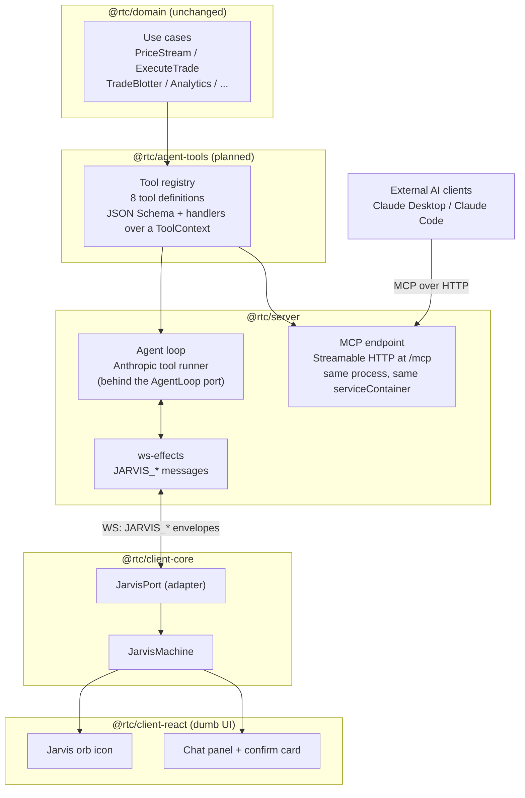
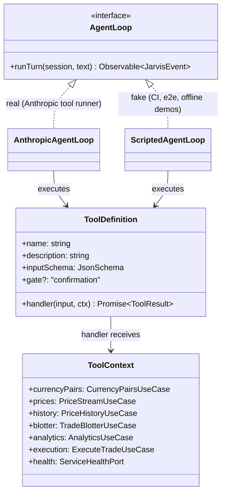
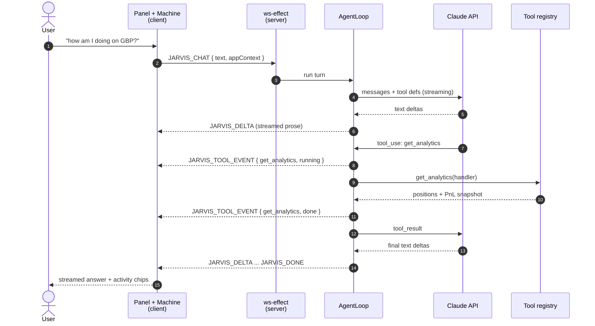
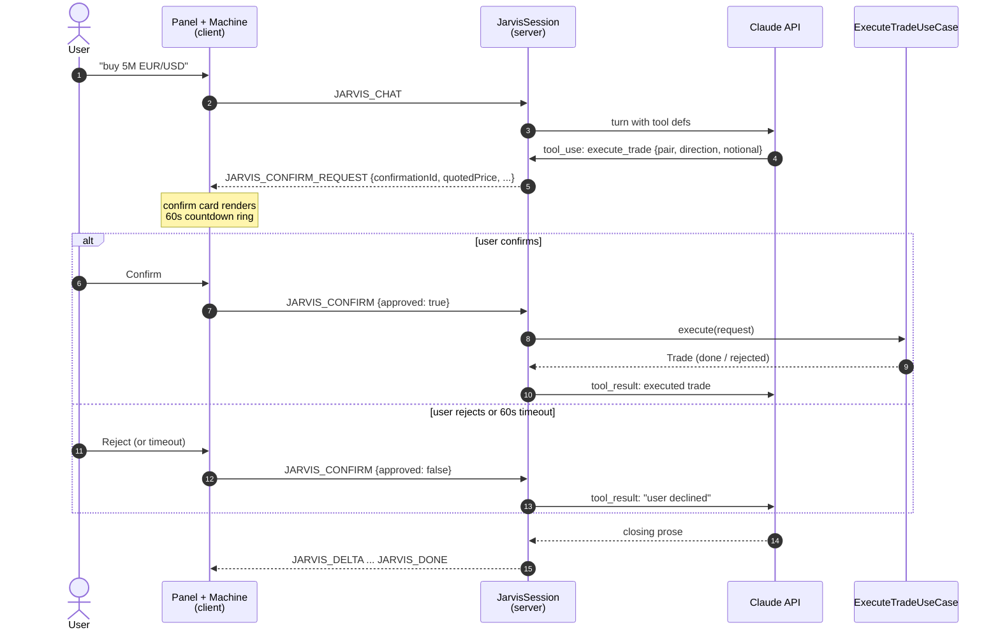
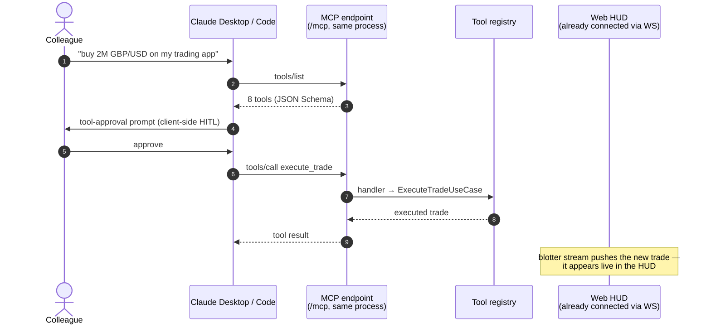
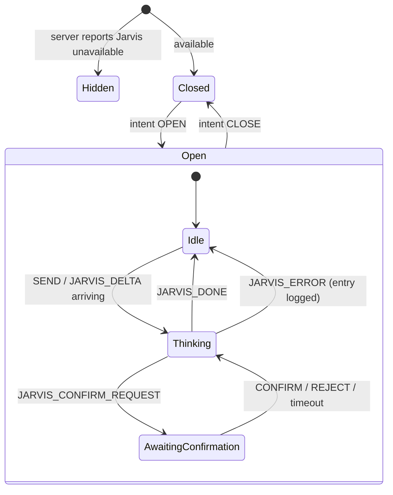
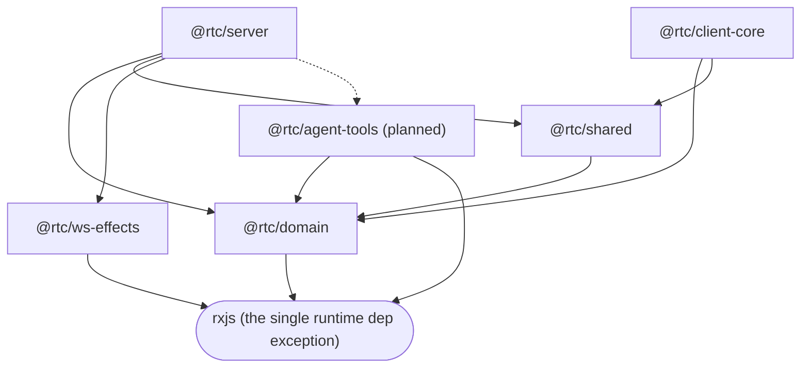
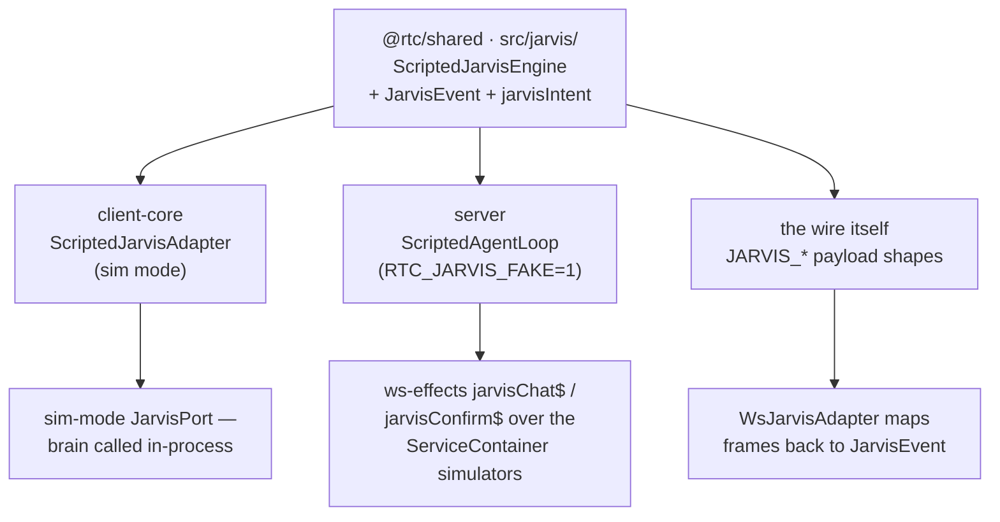

# 18. The Jarvis AI Agent Surface

> **Status: Phase 1 (scripted core surface) SHIPPED — PR #405, 2026-07-27.
> Phase 2 (the `JARVIS_*` WS wire + the server's scripted agent loop) SHIPPED —
> 2026-07-31. Next is P3: `@rtc/agent-tools` + the real Anthropic tool-runner
> loop, then MCP (P4).** The authoritative decision records are the phase-1 spec
> at
> [`docs/superpowers/specs/2026-07-26-jarvis-phase-1-scripted-surface-design.md`](../superpowers/specs/2026-07-26-jarvis-phase-1-scripted-surface-design.md)
> and the parent spec at
> [`docs/superpowers/specs/2026-07-12-jarvis-ai-assistant-design.md`](../superpowers/specs/2026-07-12-jarvis-ai-assistant-design.md);
> this section is the architecture-level view. Where a diagram shows a package or
> module that does not exist yet, it is marked *(planned)*. §18.11 records what
> phase 1 proved; §18.12 records what phase 2 proved.

Jarvis is an AI presence in the HUD — a pulsating orb in the shell chrome that opens
into a chat panel, answers questions about the live market by consulting the app's own
domain, and executes trades behind an explicit in-chat confirmation. The same tool
surface is exposed over MCP so that external AI clients (Claude Desktop, Claude Code)
can operate the app from outside. The companion section
[§19](19-ai-capability-roadmap.md) catalogues where this grows next.

## 18.1 The thesis: AI as the third client

The web client and the RN client already share the framework-free `@rtc/client-core`
(§8.1, the multi-client proof). Jarvis is the **third head** — and unlike the planned
SolidJS swap, it is not even a UI framework. It is the strongest test yet of the
dependency rule, because an AI agent consumes the *application*, not the DOM.

The claim this workstream proves: every AI-era capability below falls out of decisions
this repo enforced long before "agent" was a product category — business logic in
framework-free use cases behind ports, UI state in explicit machines, dependency
inversion at a composition root, dumb UI, and a test strategy built on injected fakes.
None of it was designed "for AI". AI is simply the first non-UI consumer to arrive.

| Capability | The seam that makes it a bolt-on | Counterfactual in a fetch-in-`useEffect` codebase |
|---|---|---|
| Agent tools over the domain | Use cases are plain classes over injected ports, callable from any process | Trading logic lives in `onClick` handlers and effect chains; there is nothing callable to wrap |
| MCP server as a thin wrapper | Same registry, second transport; zero domain changes | The "API for the AI" becomes a parallel reimplementation, forever chasing the UI |
| A third client (the agent) | `client-core` has no React/DOM/RN imports | Logic captured in hooks is locked inside React's render lifecycle |
| Agent drives the UI (roadmap) | All UI state is machines with explicit intents | State scattered across `useState` islands; no addressable surface to act on |
| LLM market participants (roadmap) | Dealers/pricing are simulators behind ports | Mock data hardcoded in components; a smart counterparty means rewriting the tab |
| Deterministic tests for an LLM feature | The agent loop itself sits behind a port; a scripted fake serves CI and offline demos | LLM `fetch` inline in components; tests mock the network globally and flake |
| Time travel / self-introspection (roadmap) | Event-shaped WS protocol + machines + devtools observe bus | State transitions are implicit in re-renders; there is no event log to replay |

The one-paragraph counterfactual: to add "an AI that can trade" to a codebase where
fetching and business logic live inside components, you must first *invent* an API
that does not exist, keep it in sync with UI behavior forever, rebuild state handling
so an agent can observe and act, and invent a test seam for a nondeterministic
dependency — a rewrite wearing a feature's clothes. Here, the same feature is one
rxjs-only package (the registry), two adapters (agent loop, MCP endpoint), one
machine, and one dumb panel — with `@rtc/domain` byte-identical.

## 18.2 The agent surface at a glance

One tool registry, two transports, three kinds of consumer:


```mermaid
flowchart TD
    subgraph domain["@rtc/domain (unchanged)"]
        UC["Use cases<br/>PriceStream / ExecuteTrade<br/>TradeBlotter / Analytics / ..."]
    end

    subgraph tools["@rtc/agent-tools (planned)"]
        REG["Tool registry<br/>8 tool definitions<br/>JSON Schema + handlers over a ToolContext"]
    end

    subgraph server["@rtc/server"]
        LOOP["Agent loop<br/>Anthropic tool runner<br/>(behind the AgentLoop port)"]
        MCPX["MCP endpoint<br/>Streamable HTTP at /mcp<br/>same process, same serviceContainer"]
        EFF["ws-effects<br/>JARVIS_* messages"]
    end

    subgraph core["@rtc/client-core"]
        JPORT["JarvisPort (adapter)"]
        JM["JarvisMachine"]
    end

    subgraph ui["@rtc/client-react (dumb UI)"]
        ICON["Jarvis orb icon"]
        PANEL["Chat panel + confirm card"]
    end

    EXT["External AI clients<br/>Claude Desktop / Claude Code"]

    UC --> REG
    REG --> LOOP
    REG --> MCPX
    EXT -- "MCP over HTTP" --> MCPX
    LOOP <--> EFF
    EFF <-- "WS: JARVIS_* envelopes" --> JPORT
    JPORT --> JM
    JM --> ICON
    JM --> PANEL
```

Reading order for the dependency rule: arrows into `@rtc/domain` never exist; the
registry depends on domain use cases; both transports depend on the registry; neither
the registry nor the domain knows either transport exists.

## 18.3 The tool registry (planned package: `@rtc/agent-tools`)

The registry is *the port* of the whole surface — a framework-free catalogue of what
an AI may do to this application:

- Runtime dependency: `rxjs` only (the same constraint as `domain`, `ws-effects`,
  `motion-core`).
- No Anthropic SDK, no MCP SDK, no transport imports. JSON Schema (plain objects)
  describes tool inputs; the Anthropic adapter passes it through and the MCP adapter
  converts at the edge.
- Handlers receive a `ToolContext` of domain use cases and ports — never server
  services.
- Read tools snapshot live Observables (`firstValueFrom` + timeout). Standing
  subscriptions are deliberately excluded until the sentinel phase (§19, Tier 2).
- Gated tools (`execute_trade`) carry `gate: "confirmation"` metadata; each transport
  realizes the gate in its own idiom (§18.5, §18.6).


```mermaid
classDiagram
    class ToolDefinition {
        +name: string
        +description: string
        +inputSchema: JsonSchema
        +gate?: "confirmation"
        +handler(input, ctx) Promise~ToolResult~
    }
    class ToolContext {
        +currencyPairs: CurrencyPairsUseCase
        +prices: PriceStreamUseCase
        +history: PriceHistoryUseCase
        +blotter: TradeBlotterUseCase
        +analytics: AnalyticsUseCase
        +execution: ExecuteTradeUseCase
        +health: ServiceHealthPort
    }
    class AgentLoop {
        <<interface>>
        +runTurn(session, text) Observable~JarvisEvent~
    }
    class AnthropicAgentLoop
    class ScriptedAgentLoop

    ToolDefinition --> ToolContext : handler receives
    AgentLoop <|.. AnthropicAgentLoop : real (Anthropic tool runner)
    AgentLoop <|.. ScriptedAgentLoop : fake (CI, e2e, offline demos)
    AnthropicAgentLoop --> ToolDefinition : executes
    ScriptedAgentLoop --> ToolDefinition : executes
```

The slice-1 tool set:

| Tool | Wraps | Access |
|---|---|---|
| `list_currency_pairs` | `CurrencyPairsUseCase` | read |
| `get_price` | `PriceStreamUseCase` (first-value snapshot) | read |
| `get_price_history` | `PriceHistoryUseCase` | read |
| `get_blotter` | `TradeBlotterUseCase` | read |
| `get_analytics` | `AnalyticsUseCase` (positions, PnL) | read |
| `get_service_health` | service-health port | read |
| `execute_trade` | `ExecuteTradeUseCase` | **gated** |
| `get_app_context` | tab/theme snapshot sent by the client per turn | read |

## 18.4 A chat turn, end to end


```mermaid
sequenceDiagram
    autonumber
    actor U as User
    participant P as Panel + Machine<br/>(client)
    participant E as ws-effect<br/>(server)
    participant L as AgentLoop
    participant A as Claude API
    participant T as Tool registry

    U->>P: "how am I doing on GBP?"
    P->>E: JARVIS_CHAT { text, appContext }
    E->>L: run turn
    L->>A: messages + tool defs (streaming)
    A-->>L: text deltas
    L-->>P: JARVIS_DELTA (streamed prose)
    A->>L: tool_use: get_analytics
    L-->>P: JARVIS_TOOL_EVENT { get_analytics, running }
    L->>T: get_analytics(handler)
    T-->>L: positions + PnL snapshot
    L-->>P: JARVIS_TOOL_EVENT { get_analytics, done }
    L->>A: tool_result
    A-->>L: final text deltas
    L-->>P: JARVIS_DELTA ... JARVIS_DONE
    P-->>U: streamed answer + activity chips
```

The client renders `JARVIS_TOOL_EVENT`s as inline activity chips
("⟢ consulting analytics…" → "✓ analytics") — transparency that doubles as theater.

## 18.5 Confirm-gated trade execution

`execute_trade` never runs on the model's say-so. The handler suspends the agent loop
on a promise that only an explicit user action resolves:


```mermaid
sequenceDiagram
    autonumber
    actor U as User
    participant P as Panel + Machine<br/>(client)
    participant S as JarvisSession<br/>(server)
    participant A as Claude API
    participant X as ExecuteTradeUseCase

    U->>P: "buy 5M EUR/USD"
    P->>S: JARVIS_CHAT
    S->>A: turn with tool defs
    A->>S: tool_use: execute_trade {pair, direction, notional}
    S-->>P: JARVIS_CONFIRM_REQUEST {confirmationId, quotedPrice, ...}
    Note over P: confirm card renders<br/>60s countdown ring
    alt user confirms
        U->>P: Confirm
        P->>S: JARVIS_CONFIRM {approved: true}
        S->>X: execute(request)
        X-->>S: Trade (done / rejected)
        S->>A: tool_result: executed trade
    else user rejects or 60s timeout
        U->>P: Reject (or timeout)
        P->>S: JARVIS_CONFIRM {approved: false}
        S->>A: tool_result: "user declined"
    end
    A-->>S: closing prose
    S-->>P: JARVIS_DELTA ... JARVIS_DONE
```

## 18.6 An external AI trades over MCP

The MCP endpoint is mounted **in the same Node process** as the WS server — a
correctness decision, not a convenience: a separate stdio process would own separate
simulator instances and a different blotter. In-process, a trade executed from Claude
Desktop lands in the same live state the HUD is streaming.


```mermaid
sequenceDiagram
    autonumber
    actor C as Colleague
    participant D as Claude Desktop / Code
    participant M as MCP endpoint<br/>(/mcp, same process)
    participant T as Tool registry
    participant H as Web HUD<br/>(already connected via WS)

    C->>D: "buy 2M GBP/USD on my trading app"
    D->>M: tools/list
    M-->>D: 8 tools (JSON Schema)
    D->>C: tool-approval prompt (client-side HITL)
    C->>D: approve
    D->>M: tools/call execute_trade
    M->>T: handler → ExecuteTradeUseCase
    T-->>M: executed trade
    M-->>D: tool result
    Note over H: blotter stream pushes the new trade —<br/>it appears live in the HUD
```

Human-in-the-loop lives at the architecturally honest layer per transport: the in-app
chat renders our confirm card (§18.5); external MCP clients enforce approval through
their own tool-permission surface.

## 18.7 Client state: the JarvisMachine and the orb

Chat state is an RxJS machine in `client-core/src/presenters/` (per
[ADR-005](../adr/ADR-005-ui-logic-placement.md): an autonomous async fold decoupled
from the view). The `JarvisPort` lives in `client-core/adapters` — deliberately *not*
in `domain/ports`, because chat is an application concern; keeping `@rtc/domain`
untouched is the headline.


```mermaid
stateDiagram-v2
    [*] --> Hidden : server reports Jarvis unavailable
    [*] --> Closed : available
    Closed --> Open : intent OPEN
    Open --> Closed : intent CLOSE
    state Open {
        [*] --> Idle
        Idle --> Thinking : SEND / JARVIS_DELTA arriving
        Thinking --> AwaitingConfirmation : JARVIS_CONFIRM_REQUEST
        AwaitingConfirmation --> Thinking : CONFIRM / REJECT / timeout
        Thinking --> Idle : JARVIS_DONE
        Thinking --> Idle : JARVIS_ERROR (entry logged)
    }
```

The orb icon renders machine state through `data-jarvis-state`, and its animation obeys
[`docs/performance.md`](../performance.md) to the letter — `transform: scale()` and
`opacity` only, pre-rendered glow layers, long-period keyframes instead of JS timers,
zero `compositeFailed` events at steady state:

| `data-jarvis-state` | Visual | Driven by |
|---|---|---|
| `idle` | slow 4s breathing pulse, occasional flicker | machine `Idle` |
| `thinking` | faster, brighter pulse | machine `Thinking` |
| `attention` | distinct urgent pulse | machine `AwaitingConfirmation` |
| (icon hidden) | — | machine `Hidden` |

## 18.8 Wire protocol additions

All additive; existing clients ignore unknown message types. **Shipped in phase 2**
(§18.12) — payloads below are the as-shipped shapes; a field not yet carried is
marked *(P3)*, following the same convention the diagrams use for *(planned)*.

Every `server → client` payload obeys one rule: it **is** the matching `JarvisEvent`
variant minus its `type` discriminant (the message type carries the discriminant).
See `@rtc/shared`'s `src/jarvis/jarvisEvent.ts` for the single source of both.

| Direction | Message | Payload |
|---|---|---|
| client → server | `JARVIS_CHAT` | `{ text }` — *(P3: `+ appContext`, landing with the tool registry that consumes it)* |
| client → server | `JARVIS_CONFIRM` | `{ confirmationId, approved }` |
| server → client | `JARVIS_DELTA` | `{ text }` — one chunk of streamed assistant prose |
| server → client | `JARVIS_TOOL_EVENT` | `{ tool, status: running \| done }` |
| server → client | `JARVIS_CONFIRM_REQUEST` | `{ confirmationId, symbol, direction, notional, quotedPrice, ratePrecision }` |
| server → client | `JARVIS_DONE` / `JARVIS_ERROR` | `{}` / `{ message }` — turn end / error surface |

`JARVIS_CONFIRM_REQUEST` carries `symbol` (the pair's symbol, matching every other
message in the protocol) and `ratePrecision`, the pair's display precision — so the
confirm card formats `quotedPrice` exactly like a spot tile
(`toFixed(ratePrecision)`) without a reference-data lookup UI-side.

**No turn correlation id, by design in P2** — `JarvisMachine` serializes turns, so
at most one is in flight per connection. See §18.12 for the accepted limitation this
carries and its P3 fix.

## 18.9 Determinism: the fake agent loop

The Anthropic SDK is confined behind the `AgentLoop` interface, chosen at the
composition root — the same move as `WsAdapter` and every other port in this repo.
`ScriptedAgentLoop` (`RTC_JARVIS_FAKE=1`) replays deterministic turns including tool
calls and a confirm round-trip, which buys three things at once:

1. **CI never calls the API** — ws-effects tests, machine tests, contract specs, and
   the Playwright smoke all run against the fake.
2. **The wire choreography is testable** exactly like every other effect:
   `JARVIS_CHAT → DELTA/TOOL_EVENT/CONFIRM_REQUEST/DONE`.
3. **Offline demos** — no key, no network, five minutes before showtime: the fake
   still streams, still raises the confirm card.

The gate is `createAgentLoop(env, services)`, which returns the loop or `null`; a
`null` loop means the `JARVIS_*` effects are never registered.

| Flag state | Behavior |
|---|---|
| `ANTHROPIC_API_KEY` set | real Jarvis + MCP endpoint enabled *(P3)* |
| `RTC_JARVIS_FAKE=1` | Jarvis enabled with `ScriptedAgentLoop` — **shipped, P2** |
| neither | Jarvis effects (+ MCP *(P4)*) not registered. **P2 behavior:** the client still shows the icon — there is no availability handshake, so a turn simply hits `WsJarvisAdapter`'s 10 s first-event timeout and degrades into one "Jarvis is offline, sir" error event. **Client-side hiding is *(P3)***, arriving with key detection. |

## 18.10 Package dependencies after slice 1

Additions to the §6 graph (planned edges dashed conceptually — `agent-tools` follows
the same rxjs-only rule as `ws-effects` and `motion-core`):


```mermaid
flowchart TD
    RXJS(["rxjs (the single runtime dep exception)"])

    DOM["@rtc/domain"]
    AGT["@rtc/agent-tools (planned)"]
    SHD["@rtc/shared"]
    WSE["@rtc/ws-effects"]
    SRV["@rtc/server"]
    CC["@rtc/client-core"]

    DOM --> RXJS
    AGT --> DOM
    AGT --> RXJS
    SHD --> DOM
    WSE --> RXJS
    SRV --> DOM
    SRV --> SHD
    SRV --> WSE
    SRV -.-> AGT
    CC --> DOM
    CC --> SHD
```

`@rtc/server` gains two confined third-party deps: the Anthropic SDK
(`src/agent/`) and the MCP SDK (`src/mcp/`). Neither leaks past its directory; the
registry and domain stay clean, so swapping either SDK touches one directory — the
same replaceability contract as everything else in §8.

## 18.11 Phase 1 shipped — the receipt

Phase 1 (PR #405, 2026-07-27) delivered the scripted core surface in **both** web
clients: the header orb (two skins), the full-screen cinematic overlay, scripted
desk intelligence, and confirm-gated FX execution. There is no LLM yet — the
"brain" is the v5 prototype's regex intent cascade, ported into a client-side
`ScriptedJarvisAdapter` behind `JarvisPort`. The load-bearing observation:

> **Everything Jarvis says and does runs against the live application.** "Where
> is EURUSD?" reads the actual streaming price at that moment; the session P&L
> and movers are computed from the real analytics and history streams; and "Buy
> 5M EURUSD" quotes the live ask, raises the confirm card, and — on approval —
> executes through the same `ExecuteTradeUseCase` the spot tile uses, landing a
> genuine trade in the blotter. In `:ws:remote` mode the same conversation reads
> and trades against the deployed server. Scripted intelligence, real hands.

That is not a property of the Jarvis code; it is a property of the architecture
it plugged into. Because trading logic lives in framework-free use cases behind
ports — not inside `onClick` handlers — a chat adapter could *call the same
capabilities the UI calls* without a single change to them. The §18.1 thesis had
its first falsifiable test, and the counterfactual from the phase-1 spec (§7)
held under review of the final diff:

| Claim | Outcome (PR #405) |
|---|---|
| `@rtc/domain` stays byte-identical | Changed only by the `JarvisSkin` preference (a type + port methods) — zero domain logic touched |
| `@rtc/server` untouched | Zero changes |
| No new package | Zero; `@rtc/agent-tools` correctly deferred to P3 |
| The feature is "adapters + one machine + dumb UI" | One port (`JarvisPort`), one adapter (`ScriptedJarvisAdapter`), one machine (`JarvisMachine`), one chunk-math module (`speechChunks`), two dumb UI trees at byte-identical CSS |
| Deterministic testing of a chat feature | 19 shared contract specs pass against **both** frameworks via the swap-trio; the reveal cadence is TestScheduler-virtual-time; e2e runs keyless in sim mode on both clients |

Two structural choices from phase 1 carry forward:

- **The reveal is data, not animation.** The typed-out effect is the adapter
  emitting `speechChunks`-paced delta events — the exact shape `JARVIS_DELTA`
  will stream in P2 — so the machine and UI cannot tell the scripted brain from
  the future wire, and the swap stays invisible.
- **The port was constructed inside both port factories**, so every client in
  every data-source mode received Jarvis with zero composition-root edits — the
  same mechanism that will one day swap in the `WsJarvisAdapter`.

Phase-1 deferred minors are tracked in [`docs/STATUS.md`](../STATUS.md) under the
Jarvis entry.

## 18.12 Phase 2 shipped — the wire

Phase 2 (2026-07-31) put Jarvis on the WebSocket. The scripted brain that phase 1
ran in the browser now also runs **on the server**, behind the `AgentLoop` seam
where `AnthropicAgentLoop` will slot in; the client gained a second `JarvisPort`
implementation that speaks `JARVIS_*` frames instead of calling the brain
in-process. Still no LLM — the point of this phase was the *transport*, proved
against a brain whose output is already deterministic.

### The move: one brain, three consumers

The scripted engine did not get reimplemented server-side. It **moved** —
`ScriptedJarvisAdapter`'s body relocated verbatim to `@rtc/shared`
(`src/jarvis/`: `jarvisEvent.ts`, `jarvisIntent.ts`, `ScriptedJarvisEngine.ts`),
where both a client and the server can reach it. `@rtc/shared` is the right home
for the same reason the `CLIENT_MSG`/`SERVER_MSG` envelopes live there: it is the
one package **both sides of the wire already depend on**, and it is transport-neutral
by construction. Putting the brain in `client-core` would have forced the server to
import a client package; putting it in `domain` would have put chat — an application
concern — inside the domain and broken the rxjs-only rule (the engine needs
`motion-core`'s `speechChunks` to pace its reveal). `shared` was already the seam
where "vocabulary both processes agree on" lives, and the brain is exactly that.


```mermaid
flowchart TD
    ENG["@rtc/shared · src/jarvis/<br/>ScriptedJarvisEngine<br/>+ JarvisEvent + jarvisIntent"]

    C1["client-core<br/>ScriptedJarvisAdapter<br/>(sim mode)"]
    C2["server<br/>ScriptedAgentLoop<br/>(RTC_JARVIS_FAKE=1)"]
    C3["the wire itself<br/>JARVIS_* payload shapes"]

    ENG --> C1
    ENG --> C2
    ENG --> C3

    C1 --> USE1["sim-mode JarvisPort —<br/>brain called in-process"]
    C2 --> USE2["ws-effects jarvisChat$ /<br/>jarvisConfirm$ over the<br/>ServiceContainer simulators"]
    C3 --> USE3["WsJarvisAdapter maps<br/>frames back to JarvisEvent"]
```

The third consumer is the interesting one. `JarvisEvent` is not merely *similar to*
the wire vocabulary — it **is** the wire vocabulary, under one rule stated on the
type itself:

> **Each `SERVER_MSG.JARVIS_*` payload IS the matching `JarvisEvent` variant minus
> its `type` discriminant** — the message type carries the discriminant, so the
> payload only needs the variant's remaining fields.

That collapses what is normally a hand-written DTO layer into a single five-row
lookup (`WIRE_TYPE_BY_EVENT`) plus object rest/spread in each direction: the server
effect does `const { type, ...body } = event`, and `WsJarvisAdapter` re-attaches the
discriminant. There is no serializer to drift, because there is no serializer.

### The payoff: the port swap was invisible

Phase 1 predicted this in §18.11 ("the reveal is data, not animation"; "the port was
constructed inside both port factories"). Phase 2 is the falsification test, and the
diff is the receipt:

| Layer | Phase-2 changes |
|---|---|
| `JarvisMachine` | **zero** |
| Both dumb UI trees (React + Solid) | **zero** |
| `@rtc/ui-contract` specs (the 19 shared behavioural specs) | **zero** |
| Visual goldens | **zero** |
| `@rtc/domain` | **zero** |
| Composition roots | one line per factory — `new WsJarvisAdapter(ws)` in the ws-real branch |

A chat feature changed its brain's *process* — browser to server, in-process call to
streamed WebSocket frames — and everything above the port could not tell. That is the
§18.1 thesis's second falsifiable test: the first (P1) proved an AI-shaped consumer
could call the domain's real capabilities with no domain changes; this one proves the
*transport* under a consumer is a port swap, exactly as it is for prices and trades.

### Accepted phase-2 constraints

Documented deliberately, so nobody "fixes" them as bugs:

- **No availability handshake.** The orb renders in ws mode even against a server
  running without `RTC_JARVIS_FAKE` (where `createAgentLoop` returns `null` and the
  `JARVIS_*` effects are never registered). Rather than hang, `WsJarvisAdapter`'s
  first-event timeout — `timeout({ first: JARVIS_FIRST_EVENT_TIMEOUT_MS })`, 10 s —
  degrades a dead turn into one synthetic `error` event ("Jarvis is offline, sir —
  the desk link is down.") and completes. Graceful degradation now; real gating
  arrives with **P3's key detection**, when "is Jarvis available" becomes a question
  with a non-trivial answer (`ANTHROPIC_API_KEY` present or not); §18.9's flag table
  marks the icon-hiding row accordingly.
- **No turn correlation ids.** `JarvisMachine` serializes turns (`concatMap`) and
  `ask()` completes on `done`/`error`, so at most one turn is in flight per
  connection and untagged frames are unambiguous. **The documented limitation:** after
  an offline timeout the client tears its listeners down but sends no cancel frame, so
  a server still streaming the now-orphaned turn has its stragglers land on whichever
  turn subscribes *next*. Hard to reach in practice (the machine serializes; the UI
  disables input while speaking), and unfixable at the adapter layer — **the root fix
  is a wire correlation field, explicitly deferred to P3.** The limitation is recorded
  in `WsJarvisAdapter.ask()` at the code, and in `docs/STATUS.md`.
- **Ws mode always paces; `instantReveal` is sim-only.** `ScriptedAgentLoop` passes
  `instantReveal$: of(false)` — the server cannot know a client's motion preferences,
  and P3's real token stream will behave identically (tokens arrive when they arrive).
  Sim mode keeps instant-reveal for reduced-motion/Freeze, and since the contract specs
  and the power-saver e2e both run sim mode, nothing regressed.
- **`appContext` is not on the wire yet.** §18.8's table carries the as-shipped
  shapes; `JARVIS_CHAT` is `{ text }` alone, because the field exists to feed a tool
  registry that does not exist until P3 — sending it now would be a payload no
  consumer reads.

### What review hardening added

Four fixes emerged from the review rounds, and each is worth keeping as a pattern:

1. **`.js` ESM specifiers on the moved engine's relative imports.** The relocated file
   imported `./jarvisIntent` extensionless. `tsc`/`tsc-alias` emit that verbatim under
   `"moduleResolution": "bundler"`, and plain Node — which the production server
   Dockerfile runs against `dist/index.js` — fails with `ERR_MODULE_NOT_FOUND`. **No
   suite could have caught it**: vitest and tsx both resolve extensionless specifiers,
   so the entire test tree stays green while the shipped server dist refuses to boot.
   The witness had to be a direct Node ESM import of the rebuilt `dist`.
2. **`crypto.randomUUID()` confirmation ids.** The engine minted them from a sequential
   counter (`confirm-1`, `confirm-2`, …). Harmless in phase 1, where each browser owned
   its own engine — but the server's loop is **process-wide across every connected
   socket**, so an authenticated client B could approve client A's staged trade by
   guessing the next id. The same code moving from a per-tab to a per-process lifetime
   is what turned a naming detail into a cross-socket auth hole; a relocation review
   should ask "what was single-tenant that is now shared?".
3. **Snapshot handler dispatch in `WsAdapter`.** Its per-type handler dispatch iterated
   the live `Set`. A `done` handler completing its Rx subscriber can *synchronously*
   start the next turn (the machine's `concatMap`), which registers a fresh same-type
   handler — and **ES `Set` iterators visit mid-iteration insertions**, so the new turn's
   `done` handler fired against the *old* turn's payload and killed it before its own
   reply arrived. Both dispatch loops now iterate `[...handlers]`. Only a two-turn
   sequence exposes it; a single-turn test tree never would.
4. **A five-variant mutation-proof table test on the wire map.** `WIRE_TYPE_BY_EVENT`'s
   `error → JARVIS_ERROR` row was reachable by no test — mutating it to `JARVIS_DONE`
   left the whole server suite green. A table test drives `jarvisEffects` with a stub
   `AgentLoop` over all five `JarvisEvent` variants, asserting each maps to its exact
   wire type with a type-stripped body. The lesson generalises to any exhaustive
   `Record<Union, …>`: whole-system choreography tests reach the *common* rows, and
   silently leave the rest unpinned.

### The P3 seam

`createAgentLoop(env, services)` is the one function P3 edits:

```ts
export function createAgentLoop(env, services): AgentLoop | null {
  if (env.RTC_JARVIS_FAKE === "1") { return new ScriptedAgentLoop(services); }
  return null;   // P3 adds the ANTHROPIC_API_KEY branch → new AnthropicAgentLoop(...)
}
```

`AgentLoop` is two methods — `runTurn(text): Observable<JarvisEvent>` and
`resolveConfirmation(confirmationId, approved)` — so `AnthropicAgentLoop` owes the
wire nothing new: same event union, same frames, same client. What P3 adds is
`@rtc/agent-tools` (the registry §18.3 describes) plus the Anthropic SDK confined to
`server/src/agent/`, and the deferrals listed above (`appContext`, availability
gating, turn correlation ids, session history). The determinism guarantee of §18.9
survives intact, because `ScriptedAgentLoop` does not go away when the real loop
arrives — it stays as the CI path and the offline-demo path.

Phase-2 open items are tracked in [`docs/STATUS.md`](../STATUS.md) under the Jarvis
entry.
