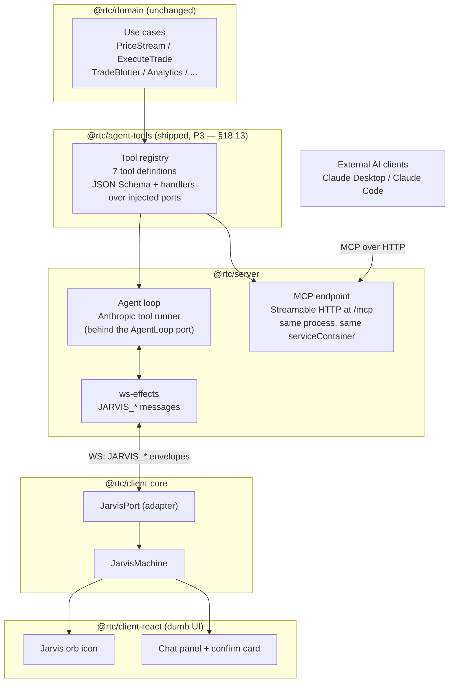
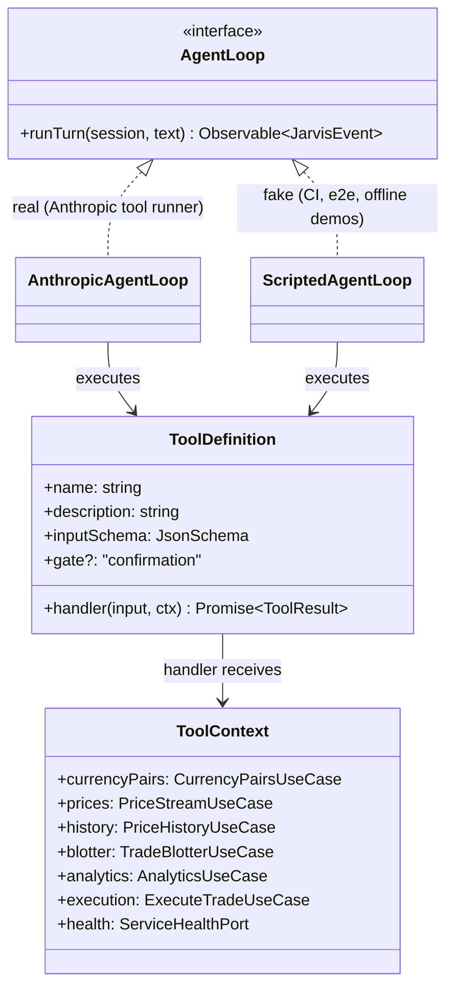
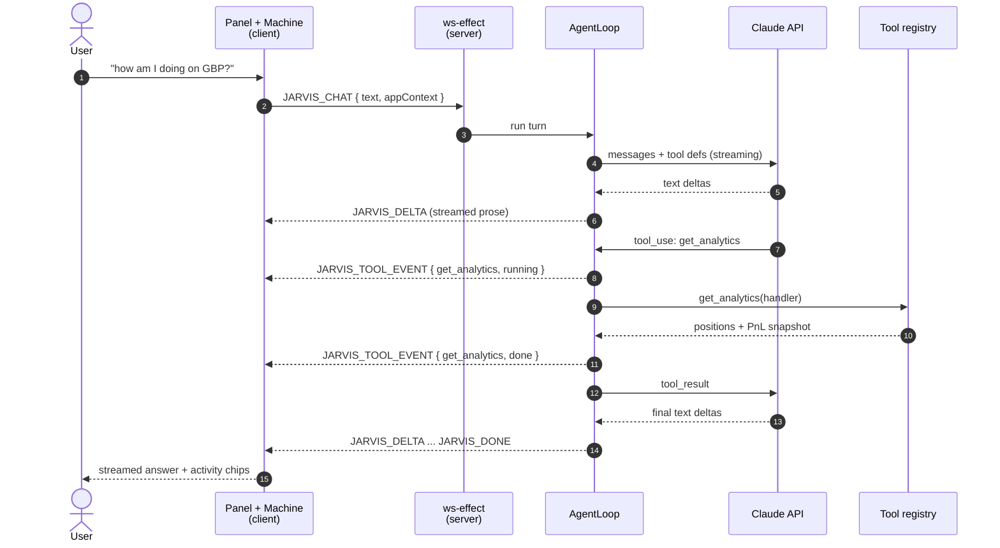
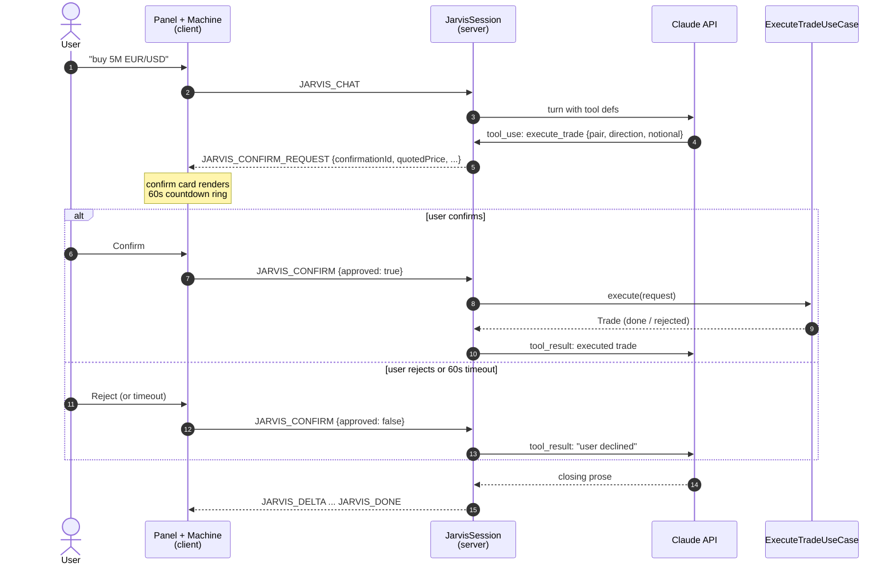
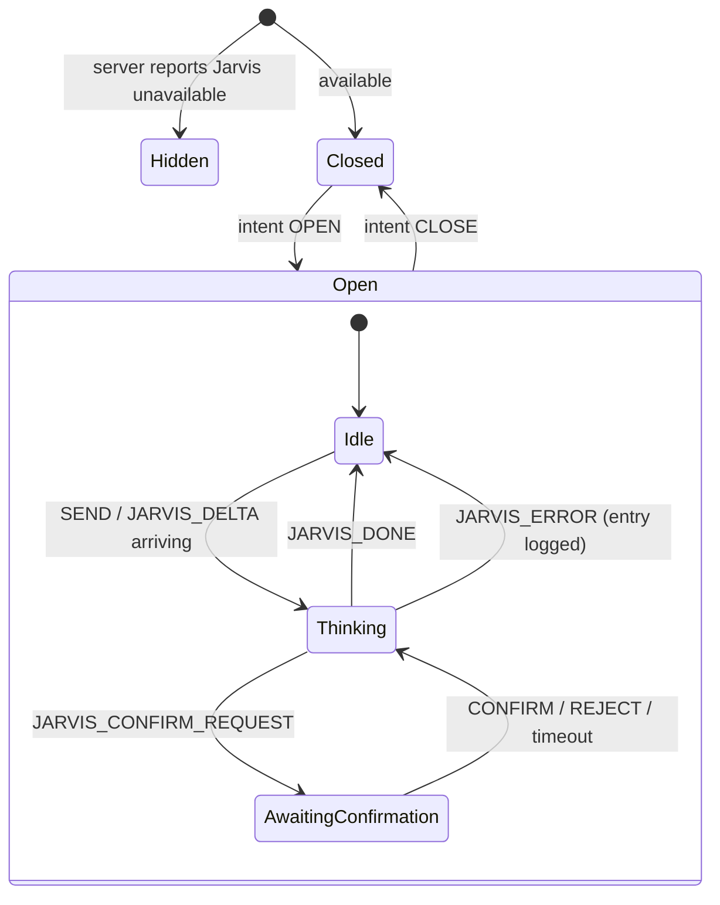
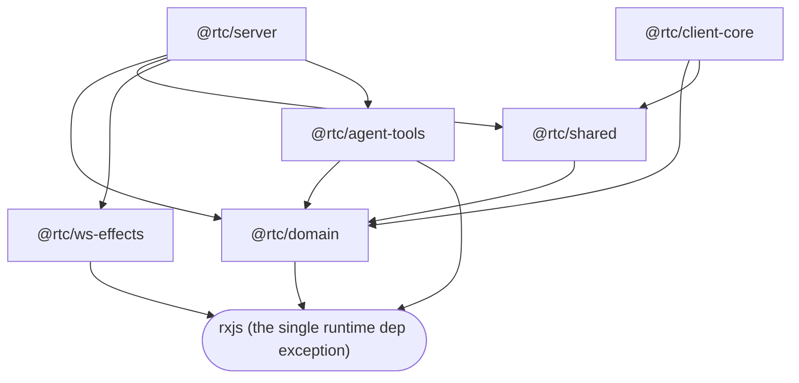
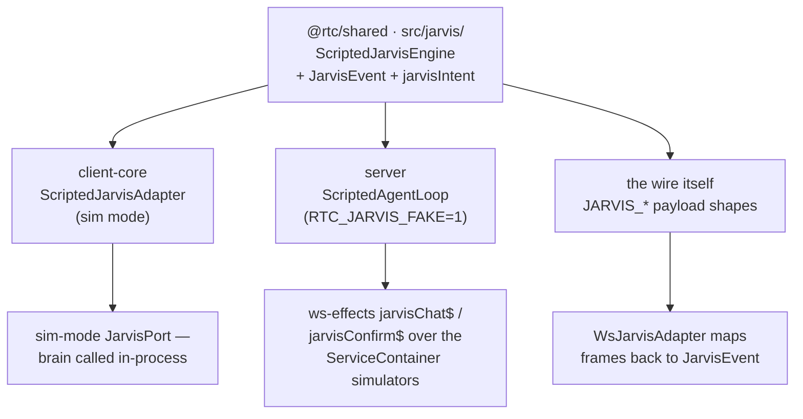
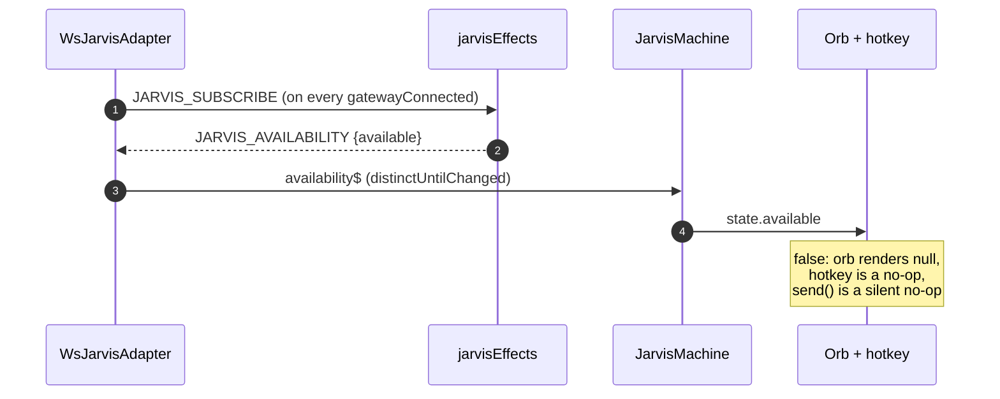

# 18. The Jarvis AI Agent Surface

> **Status: Phase 1 (scripted core surface) SHIPPED — PR #405, 2026-07-27.
> Phase 2 (the `JARVIS_*` WS wire + the server's scripted agent loop) SHIPPED —
> PR #440, 2026-07-31. Phase 3 (`@rtc/agent-tools` + the real Anthropic
> tool-runner loop) SHIPPED — 2026-08-01. Phase 4 (the MCP endpoint at `/mcp`)
> SHIPPED — 2026-08-01. Next is P5+: the roadmap in §10 of the parent spec.**
> The authoritative decision records are the phase-1 spec
> at
> [`docs/superpowers/specs/2026-07-26-jarvis-phase-1-scripted-surface-design.md`](../superpowers/specs/2026-07-26-jarvis-phase-1-scripted-surface-design.md)
> and the parent spec at
> [`docs/superpowers/specs/2026-07-12-jarvis-ai-assistant-design.md`](../superpowers/specs/2026-07-12-jarvis-ai-assistant-design.md);
> this section is the architecture-level view. Where a diagram shows a package or
> module that does not exist yet, it is marked *(planned)*. §18.11 records what
> phase 1 proved; §18.12 records what phase 2 proved; §18.13 records what
> phase 3 proved — and closes, one by one, the accepted limitations §18.12
> logged; **§18.14 records what phase 4 proved.** Earlier sections still carry
> their as-of-P2 prose; where a later phase changed the answer, the line points
> forward rather than being rewritten, so the sequence of decisions stays
> legible.

Jarvis is an AI presence in the HUD — a pulsating orb in the shell chrome that opens
into a chat panel, answers questions about the live market by consulting the app's own
domain, and executes trades behind an explicit in-chat confirmation. The same tool
surface is exposed over MCP so that external AI clients (Claude Desktop, Claude Code)
can operate the app from outside. The companion section
[§19](19-ai-capability-roadmap.md) catalogues where this grows next.

## 18.1 The thesis: AI as the third client

The web client and the RN client already share the framework-free `@rtc/client-core`
(§8.1, the multi-client proof). Jarvis is the **third head** — and unlike the planned
SolidJS swap, it is not even a UI framework. It is the strongest test yet of the
dependency rule, because an AI agent consumes the *application*, not the DOM.

The claim this workstream proves: every AI-era capability below falls out of decisions
this repo enforced long before "agent" was a product category — business logic in
framework-free use cases behind ports, UI state in explicit machines, dependency
inversion at a composition root, dumb UI, and a test strategy built on injected fakes.
None of it was designed "for AI". AI is simply the first non-UI consumer to arrive.

| Capability | The seam that makes it a bolt-on | Counterfactual in a fetch-in-`useEffect` codebase |
|---|---|---|
| Agent tools over the domain | Use cases are plain classes over injected ports, callable from any process | Trading logic lives in `onClick` handlers and effect chains; there is nothing callable to wrap |
| MCP server as a thin wrapper | Same registry, second transport; zero domain changes | The "API for the AI" becomes a parallel reimplementation, forever chasing the UI |
| A third client (the agent) | `client-core` has no React/DOM/RN imports | Logic captured in hooks is locked inside React's render lifecycle |
| Agent drives the UI (roadmap) | All UI state is machines with explicit intents | State scattered across `useState` islands; no addressable surface to act on |
| LLM market participants (roadmap) | Dealers/pricing are simulators behind ports | Mock data hardcoded in components; a smart counterparty means rewriting the tab |
| Deterministic tests for an LLM feature | The agent loop itself sits behind a port; a scripted fake serves CI and offline demos | LLM `fetch` inline in components; tests mock the network globally and flake |
| Time travel / self-introspection (roadmap) | Event-shaped WS protocol + machines + devtools observe bus | State transitions are implicit in re-renders; there is no event log to replay |

The one-paragraph counterfactual: to add "an AI that can trade" to a codebase where
fetching and business logic live inside components, you must first *invent* an API
that does not exist, keep it in sync with UI behavior forever, rebuild state handling
so an agent can observe and act, and invent a test seam for a nondeterministic
dependency — a rewrite wearing a feature's clothes. Here, the same feature is one
rxjs-only package (the registry), two adapters (agent loop, MCP endpoint), one
machine, and one dumb panel — with `@rtc/domain` byte-identical.

## 18.2 The agent surface at a glance

One tool registry, two transports, three kinds of consumer:


```mermaid
flowchart TD
    subgraph domain["@rtc/domain (unchanged)"]
        UC["Use cases<br/>PriceStream / ExecuteTrade<br/>TradeBlotter / Analytics / ..."]
    end

    subgraph tools["@rtc/agent-tools (shipped, P3 — §18.13)"]
        REG["Tool registry<br/>7 tool definitions<br/>JSON Schema + handlers over injected ports"]
    end

    subgraph server["@rtc/server"]
        LOOP["Agent loop<br/>Anthropic tool runner<br/>(behind the AgentLoop port)"]
        MCPX["MCP endpoint<br/>Streamable HTTP at /mcp<br/>same process, same serviceContainer"]
        EFF["ws-effects<br/>JARVIS_* messages"]
    end

    subgraph core["@rtc/client-core"]
        JPORT["JarvisPort (adapter)"]
        JM["JarvisMachine"]
    end

    subgraph ui["@rtc/client-react (dumb UI)"]
        ICON["Jarvis orb icon"]
        PANEL["Chat panel + confirm card"]
    end

    EXT["External AI clients<br/>Claude Desktop / Claude Code"]

    UC --> REG
    REG --> LOOP
    REG --> MCPX
    EXT -- "MCP over HTTP" --> MCPX
    LOOP <--> EFF
    EFF <-- "WS: JARVIS_* envelopes" --> JPORT
    JPORT --> JM
    JM --> ICON
    JM --> PANEL
```

Reading order for the dependency rule: arrows into `@rtc/domain` never exist; the
registry depends on domain use cases; both transports depend on the registry; neither
the registry nor the domain knows either transport exists.

## 18.3 The tool registry (`@rtc/agent-tools`)

> **Shipped in P3** — see [§18.13](#1813-phase-3-shipped--the-real-loop) for the
> as-built shape. The design below held; the two deviations are `ToolContext`
> (built as an injected `JarvisToolDeps` of *ports* plus a `confirmTrade` gate,
> not a bag of use-case instances) and `get_app_context` (still deferred past
> P4 — see [§18.14](#1814-p4--the-mcp-endpoint-second-transport)).

The registry is *the port* of the whole surface — a framework-free catalogue of what
an AI may do to this application:

- Runtime dependency: `rxjs` only (the same constraint as `domain`, `ws-effects`,
  `motion-core`).
- No Anthropic SDK, no MCP SDK, no transport imports. JSON Schema (plain objects)
  describes tool inputs; the Anthropic adapter passes it through and the MCP adapter
  converts at the edge.
- Handlers receive a `ToolContext` of domain use cases and ports — never server
  services.
- Read tools snapshot live Observables (`firstValueFrom` + timeout). Standing
  subscriptions are deliberately excluded until the sentinel phase (§19, Tier 2).
- Gated tools (`execute_trade`) carry `gate: "confirmation"` metadata; each transport
  realizes the gate in its own idiom (§18.5, §18.6).


```mermaid
classDiagram
    class ToolDefinition {
        +name: string
        +description: string
        +inputSchema: JsonSchema
        +gate?: "confirmation"
        +handler(input, ctx) Promise~ToolResult~
    }
    class ToolContext {
        +currencyPairs: CurrencyPairsUseCase
        +prices: PriceStreamUseCase
        +history: PriceHistoryUseCase
        +blotter: TradeBlotterUseCase
        +analytics: AnalyticsUseCase
        +execution: ExecuteTradeUseCase
        +health: ServiceHealthPort
    }
    class AgentLoop {
        <<interface>>
        +runTurn(session, text) Observable~JarvisEvent~
    }
    class AnthropicAgentLoop
    class ScriptedAgentLoop

    ToolDefinition --> ToolContext : handler receives
    AgentLoop <|.. AnthropicAgentLoop : real (Anthropic tool runner)
    AgentLoop <|.. ScriptedAgentLoop : fake (CI, e2e, offline demos)
    AnthropicAgentLoop --> ToolDefinition : executes
    ScriptedAgentLoop --> ToolDefinition : executes
```

The slice-1 tool set:

| Tool | Wraps | Access |
|---|---|---|
| `list_currency_pairs` | `CurrencyPairsUseCase` | read |
| `get_price` | `PriceStreamUseCase` (first-value snapshot) | read |
| `get_price_history` | `PriceHistoryUseCase` | read |
| `get_blotter` | `TradeBlotterUseCase` | read |
| `get_analytics` | `AnalyticsUseCase` (positions, PnL) | read |
| `get_service_health` | service-health port | read |
| `execute_trade` | `ExecuteTradeUseCase` | **gated** |
| `get_app_context` | tab/theme snapshot sent by the client per turn | read — **still deferred past P4** ([§18.14](#1814-p4--the-mcp-endpoint-second-transport)) |

## 18.4 A chat turn, end to end


```mermaid
sequenceDiagram
    autonumber
    actor U as User
    participant P as Panel + Machine<br/>(client)
    participant E as ws-effect<br/>(server)
    participant L as AgentLoop
    participant A as Claude API
    participant T as Tool registry

    U->>P: "how am I doing on GBP?"
    P->>E: JARVIS_CHAT { text, appContext }
    E->>L: run turn
    L->>A: messages + tool defs (streaming)
    A-->>L: text deltas
    L-->>P: JARVIS_DELTA (streamed prose)
    A->>L: tool_use: get_analytics
    L-->>P: JARVIS_TOOL_EVENT { get_analytics, running }
    L->>T: get_analytics(handler)
    T-->>L: positions + PnL snapshot
    L-->>P: JARVIS_TOOL_EVENT { get_analytics, done }
    L->>A: tool_result
    A-->>L: final text deltas
    L-->>P: JARVIS_DELTA ... JARVIS_DONE
    P-->>U: streamed answer + activity chips
```

The client renders `JARVIS_TOOL_EVENT`s as inline activity chips
("⟢ consulting analytics…" → "✓ analytics") — transparency that doubles as theater.

## 18.5 Confirm-gated trade execution

`execute_trade` never runs on the model's say-so. The handler suspends the agent loop
on a promise that only an explicit user action resolves:


```mermaid
sequenceDiagram
    autonumber
    actor U as User
    participant P as Panel + Machine<br/>(client)
    participant S as JarvisSession<br/>(server)
    participant A as Claude API
    participant X as ExecuteTradeUseCase

    U->>P: "buy 5M EUR/USD"
    P->>S: JARVIS_CHAT
    S->>A: turn with tool defs
    A->>S: tool_use: execute_trade {pair, direction, notional}
    S-->>P: JARVIS_CONFIRM_REQUEST {confirmationId, quotedPrice, ...}
    Note over P: confirm card renders<br/>60s countdown ring
    alt user confirms
        U->>P: Confirm
        P->>S: JARVIS_CONFIRM {approved: true}
        S->>X: execute(request)
        X-->>S: Trade (done / rejected)
        S->>A: tool_result: executed trade
    else user rejects or 60s timeout
        U->>P: Reject (or timeout)
        P->>S: JARVIS_CONFIRM {approved: false}
        S->>A: tool_result: "user declined"
    end
    A-->>S: closing prose
    S-->>P: JARVIS_DELTA ... JARVIS_DONE
```

## 18.6 An external AI trades over MCP

**Shipped in P4** — see [§18.14](#1814-p4--the-mcp-endpoint-second-transport)
for the receipt; this section is the original plan-level diagram, corrected
where P4 shipped a different number. The MCP endpoint is mounted **in the
same Node process** as the WS server — a correctness decision, not a
convenience: a separate stdio process would own separate simulator instances
and a different blotter. In-process, a trade executed from Claude Desktop
lands in the same live state the HUD is streaming.


```mermaid
sequenceDiagram
    autonumber
    actor C as Colleague
    participant D as Claude Desktop / Code
    participant M as MCP endpoint<br/>(/mcp, same process)
    participant T as Tool registry
    participant H as Web HUD<br/>(already connected via WS)

    C->>D: "buy 2M GBP/USD on my trading app"
    D->>M: tools/list
    M-->>D: 7 tools (JSON Schema)
    D->>C: tool-approval prompt (client-side HITL)
    C->>D: approve
    D->>M: tools/call execute_trade
    M->>T: handler → ExecuteTradeUseCase
    T-->>M: executed trade
    M-->>D: tool result
    Note over H: blotter stream pushes the new trade —<br/>it appears live in the HUD
```

Seven, not the eight this diagram originally showed — `get_app_context` stays
deferred (§18.13's decision, revised again in §18.14: it is a WS-chat-surface
tool with nothing for an external client to read, so it does not arrive with
a later MCP-adjacent phase either).

Human-in-the-loop lives at the architecturally honest layer per transport: the in-app
chat renders our confirm card (§18.5); external MCP clients enforce approval through
their own tool-permission surface.

## 18.7 Client state: the JarvisMachine and the orb

Chat state is an RxJS machine in `client-core/src/presenters/` (per
[ADR-005](../adr/ADR-005-ui-logic-placement.md): an autonomous async fold decoupled
from the view). The `JarvisPort` lives in `client-core/adapters` — deliberately *not*
in `domain/ports`, because chat is an application concern; keeping `@rtc/domain`
untouched is the headline.


```mermaid
stateDiagram-v2
    [*] --> Hidden : server reports Jarvis unavailable
    [*] --> Closed : available
    Closed --> Open : intent OPEN
    Open --> Closed : intent CLOSE
    state Open {
        [*] --> Idle
        Idle --> Thinking : SEND / JARVIS_DELTA arriving
        Thinking --> AwaitingConfirmation : JARVIS_CONFIRM_REQUEST
        AwaitingConfirmation --> Thinking : CONFIRM / REJECT / timeout
        Thinking --> Idle : JARVIS_DONE
        Thinking --> Idle : JARVIS_ERROR (entry logged)
    }
```

The orb icon renders machine state through `data-jarvis-state`, and its animation obeys
[`docs/performance.md`](../performance.md) to the letter — `transform: scale()` and
`opacity` only, pre-rendered glow layers, long-period keyframes instead of JS timers,
zero `compositeFailed` events at steady state:

| `data-jarvis-state` | Visual | Driven by |
|---|---|---|
| `idle` | slow 4s breathing pulse, occasional flicker | machine `Idle` |
| `thinking` | faster, brighter pulse | machine `Thinking` |
| `attention` | distinct urgent pulse | machine `AwaitingConfirmation` |
| (icon hidden) | — | machine `Hidden` |

## 18.8 Wire protocol additions

All additive; existing clients ignore unknown message types. Shipped in phase 2
(§18.12) and **extended in phase 3** (§18.13) with turn correlation, cancel, and
the availability handshake — the table below is the current as-shipped set.

Every turn-scoped `server → client` payload obeys one rule: it **is** the matching
`JarvisEvent` variant minus its `type` discriminant (the message type carries the
discriminant), **plus** a `turnId` correlating it to the client-generated turn.
`JARVIS_AVAILABILITY` is the one non-turn-scoped frame and carries no `turnId`.
See `@rtc/shared`'s `src/jarvis/jarvisEvent.ts` for the single source of all of it.

| Direction | Message | Payload |
|---|---|---|
| client → server | `JARVIS_CHAT` | `{ text, turnId, history? }` — *(`appContext` still not on the wire — the `get_app_context` tool that would consume it stays deferred past P4 too, [§18.14](#1814-p4--the-mcp-endpoint-second-transport))* |
| client → server | `JARVIS_CONFIRM` | `{ confirmationId, approved }` |
| client → server | `JARVIS_CANCEL` | `{ turnId }` — **P3**; abandons the named in-flight turn |
| client → server | `JARVIS_SUBSCRIBE` | `{}` — **P3**; opens the availability channel |
| server → client | `JARVIS_DELTA` | `{ turnId, text }` — one chunk of streamed assistant prose |
| server → client | `JARVIS_TOOL_EVENT` | `{ turnId, tool, status: running \| done }` |
| server → client | `JARVIS_CONFIRM_REQUEST` | `{ turnId, confirmationId, symbol, direction, notional, quotedPrice, ratePrecision }` |
| server → client | `JARVIS_DONE` / `JARVIS_ERROR` | `{ turnId }` / `{ turnId, message }` — turn end / error surface |
| server → client | `JARVIS_AVAILABILITY` | `{ available }` — **P3**; answered on subscribe, pushed on change |

`JARVIS_CONFIRM_REQUEST` carries `symbol` (the pair's symbol, matching every other
message in the protocol) and `ratePrecision`, the pair's display precision — so the
confirm card formats `quotedPrice` exactly like a spot tile
(`toFixed(ratePrecision)`) without a reference-data lookup UI-side.

~~**No turn correlation id, by design in P2**~~ — **CLOSED by P3.** Every
turn-scoped frame now carries the client-generated `turnId`, the client filters on
it before delivering, and `JARVIS_CANCEL` names the turn it abandons. §18.12 keeps
the original reasoning; [§18.13](#1813-phase-3-shipped--the-real-loop) records the
fix and the effect-layer gate that keeps a *stale* cancel from killing the wrong
turn.

## 18.9 Determinism: the fake agent loop

The Anthropic SDK is confined behind the `AgentLoop` interface, chosen at the
composition root — the same move as `WsAdapter` and every other port in this repo.
`ScriptedAgentLoop` (`RTC_JARVIS_FAKE=1`) replays deterministic turns including tool
calls and a confirm round-trip, which buys three things at once:

1. **CI never calls the API** — ws-effects tests, machine tests, contract specs, and
   the Playwright smoke all run against the fake.
2. **The wire choreography is testable** exactly like every other effect:
   `JARVIS_CHAT → DELTA/TOOL_EVENT/CONFIRM_REQUEST/DONE`.
3. **Offline demos** — no key, no network, five minutes before showtime: the fake
   still streams, still raises the confirm card.

The gate is `createAgentLoop(env, services, buildAnthropicLoop)`, which returns the
loop or `null`. A `null` loop means the per-connection **session** effect is never
registered — but since P3 the **availability** responder registers regardless, so
the client's handshake always gets an answer instead of hanging (§18.13).

| Flag state | Behavior |
|---|---|
| `RTC_JARVIS_FAKE=1` | Jarvis enabled with `ScriptedAgentLoop` — **shipped, P2**. Deliberately checked **first**, so it wins even when a key is also set (§18.13, "FAKE wins"). |
| `ANTHROPIC_API_KEY` set (and no `RTC_JARVIS_FAKE`) | real Jarvis on `AnthropicAgentLoop` — **shipped, P3** (the `/mcp` endpoint is a separate, unconditional mount — **shipped, P4**, [§18.14](#1814-p4--the-mcp-endpoint-second-transport)) |
| neither | Only the availability responder registers; the session effect does not. **P3 behavior:** `JARVIS_AVAILABILITY {available:false}` answers the handshake, and the client **hides the orb and disarms the hotkey**. (~~P2 behavior: the icon stayed, and a turn degraded into one "Jarvis is offline, sir" error after `WsJarvisAdapter`'s 10 s first-event timeout~~ — that timeout still exists as the belt-and-braces path for a server that never answers at all.) |

## 18.10 Package dependencies after slice 1

Additions to the §6 graph, **as shipped in P3 and P4** — `agent-tools` follows
the same `domain`-plus-`rxjs` rule the package table describes, and `server` is
the only package allowed to see the Anthropic SDK **or** the MCP SDK:


```mermaid
flowchart TD
    RXJS(["rxjs (the single runtime dep exception)"])

    DOM["@rtc/domain"]
    AGT["@rtc/agent-tools"]
    SHD["@rtc/shared"]
    WSE["@rtc/ws-effects"]
    SRV["@rtc/server"]
    CC["@rtc/client-core"]

    DOM --> RXJS
    AGT --> DOM
    AGT --> RXJS
    SHD --> DOM
    WSE --> RXJS
    SRV --> DOM
    SRV --> SHD
    SRV --> WSE
    SRV --> AGT
    CC --> DOM
    CC --> SHD
```

`@rtc/server` gains two confined third-party deps: the Anthropic SDK
(`src/agent/`, **shipped P3** — `@anthropic-ai/sdk`) and the MCP SDK
(`src/mcp/`, **shipped P4** — `@modelcontextprotocol/sdk`,
[§18.14](#1814-p4--the-mcp-endpoint-second-transport)). Neither leaks past its
directory; the registry and domain stay clean, so swapping either SDK touches
one directory — the same replaceability contract as everything else in §8.
Three dependency-cruiser rules make that machine-checked rather than
aspirational: `agent-tools-stays-inner` (agent-tools may import only
`domain`), `no-anthropic-sdk-in-inner-packages`, and `no-mcp-sdk-outside-server`
(see §18.13 for why the Anthropic rule is written as an allowlist over
`server` rather than a blocklist of today's inner packages — the MCP rule
mirrors that same allowlist shape).

## 18.11 Phase 1 shipped — the receipt

Phase 1 (PR #405, 2026-07-27) delivered the scripted core surface in **both** web
clients: the header orb (two skins), the full-screen cinematic overlay, scripted
desk intelligence, and confirm-gated FX execution. There is no LLM yet — the
"brain" is the v5 prototype's regex intent cascade, ported into a client-side
`ScriptedJarvisAdapter` behind `JarvisPort`. The load-bearing observation:

> **Everything Jarvis says and does runs against the live application.** "Where
> is EURUSD?" reads the actual streaming price at that moment; the session P&L
> and movers are computed from the real analytics and history streams; and "Buy
> 5M EURUSD" quotes the live ask, raises the confirm card, and — on approval —
> executes through the same `ExecuteTradeUseCase` the spot tile uses, landing a
> genuine trade in the blotter. In `:ws:remote` mode the same conversation reads
> and trades against the deployed server. Scripted intelligence, real hands.

That is not a property of the Jarvis code; it is a property of the architecture
it plugged into. Because trading logic lives in framework-free use cases behind
ports — not inside `onClick` handlers — a chat adapter could *call the same
capabilities the UI calls* without a single change to them. The §18.1 thesis had
its first falsifiable test, and the counterfactual from the phase-1 spec (§7)
held under review of the final diff:

| Claim | Outcome (PR #405) |
|---|---|
| `@rtc/domain` stays byte-identical | Changed only by the `JarvisSkin` preference (a type + port methods) — zero domain logic touched |
| `@rtc/server` untouched | Zero changes |
| No new package | Zero; `@rtc/agent-tools` correctly deferred to P3 |
| The feature is "adapters + one machine + dumb UI" | One port (`JarvisPort`), one adapter (`ScriptedJarvisAdapter`), one machine (`JarvisMachine`), one chunk-math module (`speechChunks`), two dumb UI trees at byte-identical CSS |
| Deterministic testing of a chat feature | 19 shared contract specs pass against **both** frameworks via the swap-trio; the reveal cadence is TestScheduler-virtual-time; e2e runs keyless in sim mode on both clients |

Two structural choices from phase 1 carry forward:

- **The reveal is data, not animation.** The typed-out effect is the adapter
  emitting `speechChunks`-paced delta events — the exact shape `JARVIS_DELTA`
  will stream in P2 — so the machine and UI cannot tell the scripted brain from
  the future wire, and the swap stays invisible.
- **The port was constructed inside both port factories**, so every client in
  every data-source mode received Jarvis with zero composition-root edits — the
  same mechanism that will one day swap in the `WsJarvisAdapter`.

Phase-1 deferred minors are tracked in [`docs/STATUS.md`](../STATUS.md) under the
Jarvis entry.

## 18.12 Phase 2 shipped — the wire

Phase 2 (2026-07-31) put Jarvis on the WebSocket. The scripted brain that phase 1
ran in the browser now also runs **on the server**, behind the `AgentLoop` seam
where `AnthropicAgentLoop` will slot in; the client gained a second `JarvisPort`
implementation that speaks `JARVIS_*` frames instead of calling the brain
in-process. Still no LLM — the point of this phase was the *transport*, proved
against a brain whose output is already deterministic.

### The move: one brain, three consumers

The scripted engine did not get reimplemented server-side. It **moved** —
`ScriptedJarvisAdapter`'s body relocated verbatim to `@rtc/shared`
(`src/jarvis/`: `jarvisEvent.ts`, `jarvisIntent.ts`, `ScriptedJarvisEngine.ts`),
where both a client and the server can reach it. `@rtc/shared` is the right home
for the same reason the `CLIENT_MSG`/`SERVER_MSG` envelopes live there: it is the
one package **both sides of the wire already depend on**, and it is transport-neutral
by construction. Putting the brain in `client-core` would have forced the server to
import a client package; putting it in `domain` would have put chat — an application
concern — inside the domain and broken the rxjs-only rule (the engine needs
`motion-core`'s `speechChunks` to pace its reveal). `shared` was already the seam
where "vocabulary both processes agree on" lives, and the brain is exactly that.


```mermaid
flowchart TD
    ENG["@rtc/shared · src/jarvis/<br/>ScriptedJarvisEngine<br/>+ JarvisEvent + jarvisIntent"]

    C1["client-core<br/>ScriptedJarvisAdapter<br/>(sim mode)"]
    C2["server<br/>ScriptedAgentLoop<br/>(RTC_JARVIS_FAKE=1)"]
    C3["the wire itself<br/>JARVIS_* payload shapes"]

    ENG --> C1
    ENG --> C2
    ENG --> C3

    C1 --> USE1["sim-mode JarvisPort —<br/>brain called in-process"]
    C2 --> USE2["ws-effects jarvisChat$ /<br/>jarvisConfirm$ over the<br/>ServiceContainer simulators"]
    C3 --> USE3["WsJarvisAdapter maps<br/>frames back to JarvisEvent"]
```

The third consumer is the interesting one. `JarvisEvent` is not merely *similar to*
the wire vocabulary — it **is** the wire vocabulary, under one rule stated on the
type itself:

> **Each `SERVER_MSG.JARVIS_*` payload IS the matching `JarvisEvent` variant minus
> its `type` discriminant** — the message type carries the discriminant, so the
> payload only needs the variant's remaining fields.

That collapses what is normally a hand-written DTO layer into a single five-row
lookup (`WIRE_TYPE_BY_EVENT`) plus object rest/spread in each direction: the server
effect does `const { type, ...body } = event`, and `WsJarvisAdapter` re-attaches the
discriminant. There is no serializer to drift, because there is no serializer.

### The payoff: the port swap was invisible

Phase 1 predicted this in §18.11 ("the reveal is data, not animation"; "the port was
constructed inside both port factories"). Phase 2 is the falsification test, and the
diff is the receipt:

| Layer | Phase-2 changes |
|---|---|
| `JarvisMachine` | **zero** |
| Both dumb UI trees (React + Solid) | **zero** |
| `@rtc/ui-contract` specs (the 19 shared behavioural specs) | **zero** |
| Visual goldens | **zero** |
| `@rtc/domain` | **zero** |
| Composition roots | one line per factory — `new WsJarvisAdapter(ws)` in the ws-real branch |

A chat feature changed its brain's *process* — browser to server, in-process call to
streamed WebSocket frames — and everything above the port could not tell. That is the
§18.1 thesis's second falsifiable test: the first (P1) proved an AI-shaped consumer
could call the domain's real capabilities with no domain changes; this one proves the
*transport* under a consumer is a port swap, exactly as it is for prices and trades.

### Accepted phase-2 constraints

Documented deliberately, so nobody "fixes" them as bugs. **Three of the four are
now CLOSED by phase 3** — each is annotated below and kept rather than deleted, so
the reasoning that made them acceptable at the time is still readable next to the
fix that retired them. The one that stands is `instantReveal` staying sim-only.

- ~~**No availability handshake.**~~ **CLOSED by P3** ([§18.13](#1813-phase-3-shipped--the-real-loop)):
  `JARVIS_SUBSCRIBE`/`JARVIS_AVAILABILITY` gate the orb and the hotkey end to end.
  The original P2 reasoning: the orb renders in ws mode even against a server
  running without `RTC_JARVIS_FAKE` (where `createAgentLoop` returns `null` and the
  `JARVIS_*` effects are never registered). Rather than hang, `WsJarvisAdapter`'s
  first-event timeout — `timeout({ first: JARVIS_FIRST_EVENT_TIMEOUT_MS })`, 10 s —
  degrades a dead turn into one synthetic `error` event ("Jarvis is offline, sir —
  the desk link is down.") and completes. Graceful degradation now; real gating
  arrives with **P3's key detection**, when "is Jarvis available" becomes a question
  with a non-trivial answer (`ANTHROPIC_API_KEY` present or not); §18.9's flag table
  marks the icon-hiding row accordingly.
- ~~**No turn correlation ids.**~~ **CLOSED by P3** ([§18.13](#1813-phase-3-shipped--the-real-loop)):
  `turnId` is on every turn-scoped frame, `JARVIS_CANCEL` exists, and the adapter
  fires one on *every* teardown path. Note the P2 prescription below — "unfixable
  at the adapter layer" — is now spent, and the P3 fix landed at the wire exactly
  as predicted. The original P2 reasoning: `JarvisMachine` serializes turns (`concatMap`) and
  `ask()` completes on `done`/`error`, so at most one turn is in flight per
  connection and untagged frames are unambiguous. **The documented limitation:** after
  an offline timeout the client tears its listeners down but sends no cancel frame, so
  a server still streaming the now-orphaned turn has its stragglers land on whichever
  turn subscribes *next*. Hard to reach in practice (the machine serializes; the UI
  disables input while speaking), and unfixable at the adapter layer — **the root fix
  is a wire correlation field, explicitly deferred to P3.** The limitation is recorded
  in `WsJarvisAdapter.ask()` at the code, and in `docs/STATUS.md`.
- **Ws mode always paces; `instantReveal` is sim-only.** `ScriptedAgentLoop` passes
  `instantReveal$: of(false)` — the server cannot know a client's motion preferences,
  and P3's real token stream will behave identically (tokens arrive when they arrive).
  Sim mode keeps instant-reveal for reduced-motion/Freeze, and since the contract specs
  and the power-saver e2e both run sim mode, nothing regressed.
- **`appContext` is not on the wire yet.** Still true after P3 and after P4,
  for the same reason: `JARVIS_CHAT` gained `turnId` and `history` but not
  `appContext`, because `get_app_context` — the only tool that would read it —
  needs a client→server app-context channel neither the chat payload carries nor
  the UI yet produces. Half-shipping it would put a payload on the wire no
  consumer reads. §18.13 records the deferral; [§18.14](#1814-p4--the-mcp-endpoint-second-transport)
  explains why it did not ride along with P4 either; `docs/STATUS.md` tracks it.

### What review hardening added

Four fixes emerged from the review rounds, and each is worth keeping as a pattern:

1. **`.js` ESM specifiers on the moved engine's relative imports.** The relocated file
   imported `./jarvisIntent` extensionless. `tsc`/`tsc-alias` emit that verbatim under
   `"moduleResolution": "bundler"`, and plain Node — which the production server
   Dockerfile runs against `dist/index.js` — fails with `ERR_MODULE_NOT_FOUND`. **No
   suite could have caught it**: vitest and tsx both resolve extensionless specifiers,
   so the entire test tree stays green while the shipped server dist refuses to boot.
   The witness had to be a direct Node ESM import of the rebuilt `dist`.
2. **`crypto.randomUUID()` confirmation ids.** The engine minted them from a sequential
   counter (`confirm-1`, `confirm-2`, …). Harmless in phase 1, where each browser owned
   its own engine — but the server's loop is **process-wide across every connected
   socket**, so an authenticated client B could approve client A's staged trade by
   guessing the next id. The same code moving from a per-tab to a per-process lifetime
   is what turned a naming detail into a cross-socket auth hole; a relocation review
   should ask "what was single-tenant that is now shared?".
3. **Snapshot handler dispatch in `WsAdapter`.** Its per-type handler dispatch iterated
   the live `Set`. A `done` handler completing its Rx subscriber can *synchronously*
   start the next turn (the machine's `concatMap`), which registers a fresh same-type
   handler — and **ES `Set` iterators visit mid-iteration insertions**, so the new turn's
   `done` handler fired against the *old* turn's payload and killed it before its own
   reply arrived. Both dispatch loops now iterate `[...handlers]`. Only a two-turn
   sequence exposes it; a single-turn test tree never would.
4. **A five-variant mutation-proof table test on the wire map.** `WIRE_TYPE_BY_EVENT`'s
   `error → JARVIS_ERROR` row was reachable by no test — mutating it to `JARVIS_DONE`
   left the whole server suite green. A table test drives `jarvisEffects` with a stub
   `AgentLoop` over all five `JarvisEvent` variants, asserting each maps to its exact
   wire type with a type-stripped body. The lesson generalises to any exhaustive
   `Record<Union, …>`: whole-system choreography tests reach the *common* rows, and
   silently leave the rest unpinned.

### The P3 seam

`createAgentLoop(env, services)` is the one function P3 edits:

```ts
export function createAgentLoop(env, services): AgentLoop | null {
  if (env.RTC_JARVIS_FAKE === "1") { return new ScriptedAgentLoop(services); }
  return null;   // P3 adds the ANTHROPIC_API_KEY branch → new AnthropicAgentLoop(...)
}
```

`AgentLoop` is two methods — `runTurn(text): Observable<JarvisEvent>` and
`resolveConfirmation(confirmationId, approved)` — so `AnthropicAgentLoop` owes the
wire nothing new: same event union, same frames, same client. What P3 adds is
`@rtc/agent-tools` (the registry §18.3 describes) plus the Anthropic SDK confined to
`server/src/agent/`, and the deferrals listed above (`appContext`, availability
gating, turn correlation ids, session history). The determinism guarantee of §18.9
survives intact, because `ScriptedAgentLoop` does not go away when the real loop
arrives — it stays as the CI path and the offline-demo path.

**What actually landed** (P3, §18.13): the prediction held on the outside — same
event union, same frames, an untouched client above the port — but `AgentLoop`
itself split in two. It is now **one method**, `createSession(): AgentSession`, and
the turn-serving methods moved onto the per-connection `AgentSession`
(`runTurn(text, history)`, `resolveConfirmation`, `cancelTurn`, `dispose`). Per-
socket state, not a process-wide loop, is what a real conversation needs.

Phase-2 open items are tracked in [`docs/STATUS.md`](../STATUS.md) under the Jarvis
entry.

## 18.13 Phase 3 shipped — the real loop

Phase 3 (2026-08-01) put a real model behind the orb. `@rtc/agent-tools` is the
registry §18.3 described; `AnthropicAgentLoop` is the `AgentLoop` implementation
§18.12's seam was cut for; and the three deferrals P2 logged as accepted
constraints — availability gating, turn correlation, session history — are closed
at the wire rather than worked around above it. Everything the previous two phases
proved about the *shape* stayed true: `@rtc/domain` is untouched again, the client
above `JarvisPort` still cannot tell which brain answered, and the scripted loop is
still the CI path.

What is genuinely new is the class of problem. P1 and P2 moved deterministic code
between processes. P3 hands the desk's real capabilities to a nondeterministic
consumer that can be wrong, can loop, can cost money per sentence, and can be
asked to trade. Most of this section is about what that costs in guard rails.

### The package: seven tools, no SDK

`@rtc/agent-tools` is a `domain`-plus-`rxjs` package (dependency-cruiser
`agent-tools-stays-inner`), and it has never heard of Anthropic. A tool is four
fields — `name`, `description`, a raw-JSON-Schema `inputSchema`, and
`run(input): Promise<string>` — so the whole registry is testable by calling `run`
against the domain simulators, with no SDK and no network anywhere in the suite.
The server's `adaptTool` is the only place that knows what a `betaTool` is.

| Tool | Reads | Notes |
|---|---|---|
| `list_currency_pairs` | `CurrencyPairsUseCase` | symbol + `ratePrecision` + `pipsPosition` |
| `get_price` | `PriceStreamUseCase` | bid/ask/mid as **strings** |
| `get_price_history` | `PricingPort.getPriceHistory` | the accumulated buffer, capped at 100 points |
| `get_blotter` | `TradeBlotterUseCase` | newest first, default 20 / max 50 |
| `get_analytics` | `AnalyticsUseCase` | per-pair positions + the session P&L headline |
| `get_service_health` | `ServiceHealthPort` | a `ServiceTopologySimulator(3)` added to the server's container for this tool — the server has no service-health *effect*, so this is its own instance, not the one a client's status strip reads |
| `execute_trade` | `ExecuteTradeUseCase` | **gated** — suspends on the injected `ConfirmGate` |

Three decisions in that table are worth naming:

- **Prices are pair-precision strings, not JSON numbers.** The persona instructs
  Jarvis to state every price "exactly as the tools return it" — which a bare JSON
  number makes unsatisfiable, because `1.08700` serialises as `1.087` and the model
  can only then re-derive the trailing zeros by guessing. Each price field is
  `toFixed(pair.ratePrecision)` at the source, with `ratePrecision` alongside it.
  Formatting at the boundary is the same reason the confirm card carries
  `ratePrecision` (§18.8): whoever knows the precision should apply it.
- **`get_price_history` binds the raw port, not `PriceHistoryUseCase`.** That use
  case folds *live* ticks into a caller-owned window, so a one-shot `take(1)`
  snapshot of it yields a degenerate single-tick "history". The port method returns
  the already-accumulated buffer — which is what the tool name promises.
- **Every failure is a descriptive string, never a rejected promise.** A timed-out
  read returns `"Could not get a price for EURUSD: the desk didn't respond in
  time."`. The model needs to be *told* the desk is down so it can say so; a thrown
  exception would surface as a generic turn failure and invite it to fill the gap
  from memory.

`ConfirmGate` — `(details) => Promise<boolean>` — lives in `agent-tools` because
`execute_trade` needs the type, and is *injected* per session, which is the hinge
the next subsection turns on.

### The seam moved down: one session per socket

P2's `AgentLoop` served turns directly. P3 splits it: `AgentLoop` is now one
method, `createSession(): AgentSession`, and every WS connection gets its own
session. The mechanism is not a registry or a map keyed by connection id — it is
where the code sits:

```ts
function jarvisSessionEffect(in$, ctx) {
  const session = activeLoop.createSession();   // once per socket
  // ... chat / confirm / cancel sub-streams over THIS session
  return merge(...).pipe(finalize(() => session.dispose()));
}
```

`jarvisEffects` returns that **function** rather than a constant `WsEffect[]`, and
`createWsListener` invokes each effect body once per socket. So the session's
lifetime *is* the socket's lifetime — allocated on connect, disposed by the
`finalize` on disconnect — with no bookkeeping to leak and no id to forge. Two
consequences the design leans on:

- **`createSession()` is allocation-only.** It constructs a session object and its
  `betaTool` wrappers; it opens no connection and makes no API call. The `Anthropic`
  client is built **once**, in `AnthropicAgentLoop`'s constructor, and shared. That
  matters because every socket mints a session, including the ones that never chat.
- **Tools are built per session, not per loop.** `AnthropicAgentLoopOptions` takes
  a `buildTools(confirmTrade)` callback rather than a tool array, because
  `execute_trade`'s gate closes over *this* session's event stream and pending-
  confirmation table. A shared array would put every connection's confirmations in
  one closure — precisely the cross-socket hole P2's review found and fixed.

### The loop: `AnthropicAgentSession`

One class, one connection's conversation. It drives the SDK's **streaming tool
runner** (`client.beta.messages.toolRunner(params, { signal })`) and translates
what comes back into the same five `JarvisEvent` variants P1 invented:

| SDK stream event | `JarvisEvent` pushed |
|---|---|
| `content_block_start` (`tool_use`) | `toolEvent {tool, status: "running"}` |
| `content_block_stop` for that index | `toolEvent {tool, status: "done"}` |
| `content_block_delta` (`text_delta`) | `delta {text}` |
| `stop_reason: "refusal"` | `error {message}` — one fixed line |
| natural end of the runner's loop | `done` |

The chip labels are a **separate** map (`JARVIS_TOOL_FRIENDLY_NAMES`:
`get_analytics → "desk"`, `execute_trade → "trade"`) rather than the tool
descriptions, because a UI chip wants one word and the model wants a sentence;
conflating them would either bloat the prompt with UI concerns or truncate the
model-facing description to fit a chip.

Four behaviours in that loop are deliberate, and each exists because the honest
answer is more useful than a tidy one:

- **`pause_turn` is resumed, not surfaced.** The runner does not auto-resume a
  paused turn, so the loop pushes the paused assistant message back with
  `pushMessages` and lets its own `for await` pick up the next iteration —
  bounded by `max_iterations` so a model that keeps pausing cannot spin forever.
- **Truncation is announced.** `stop_reason: "max_tokens"` appends "…that's as far
  as I can go this turn, sir", and a runner cut off by the iteration ceiling while
  still mid-task appends "I ran out of runway mid-task, sir — the answer above may
  be incomplete." Falling through to a clean `done` would report a truncated answer
  as a complete one.
- **SDK errors are sanitized at the boundary.** The client always gets the same
  line ("The desk link faltered, sir — do try again."). The server log gets the
  error's **constructor name** plus an HTTP status if the thrown value carries one
  — enough to tell auth from rate-limit from malformed-request — and never
  `error.message`, which can quote request content, and never anything key-shaped.
- **Model choice is pinned, not floated.** `JARVIS_MODEL_ID = "claude-opus-5"` is a
  constant, not an env var and not a `-latest` alias. A silent upstream swap would
  change latency and per-token cost, and — since model behaviour shifts under the
  same system prompt — could regress the confirmation-before-execution guarantee.
  (The P3 plan was written against `claude-opus-4-8`; the shipped pin is
  `claude-opus-5` per current API guidance. Recorded here because a pinned model is
  a reviewed decision with an expiry date, not a constant nobody should touch.)
  **Superseded by the brain-picker round — see
  [§18.15](#1815-the-brain-picker--usage-display-round--the-receipt).**
  `JARVIS_MODEL_ID` is deleted; model choice is now per-turn, selected by a
  validated user preference against a server-side allowlist, with
  `claude-haiku-4-5` as the new default.

### Cost hygiene: four caps and a cached prefix

The scripted branch is free; every live turn is metered. `jarvisRunnerConfig.ts`
exists purely to bound what an unbounded chat can cost — these are ceilings, not
quality tuning:

| Cap | Value | Bounds |
|---|---|---|
| `JARVIS_MAX_TOKENS_PER_TURN` | 4,096 | one reply's own generation cost |
| ~~`JARVIS_EFFORT`~~ | `"medium"` | how much of that budget goes to thinking — **superseded**: now the per-user effort preference, capability-gated ([§18.15](#1815-the-brain-picker--usage-display-round--the-receipt)) |
| `JARVIS_MAX_TURNS_PER_SESSION` | 40 | a session that never ends |
| `JARVIS_HISTORY_MAX_MESSAGES` | 30 | replayed context, billed on *every* later turn |

`JARVIS_EFFORT` deserves its own line (**superseded** — the constant is gone; effort now comes from the user preference, defaulting to domain's `DEFAULT_JARVIS_EFFORT`, and is sent only to effort-capable brains — see [§18.15](#1815-the-brain-picker--usage-display-round--the-receipt)): thinking is adaptive-by-default at `"high"`
on this model and draws from the **same** `max_tokens` ceiling as the visible
reply, so an unbounded-effort tool-heavy turn can burn the entire budget thinking
and deliver nothing but a truncation notice. `"medium"` is a cost/quality tradeoff
for a terse desk assistant — not a sampling parameter, so it does not trade away
repeatability the way temperature would. A fifth, narrower ceiling
(`JARVIS_RUNNER_MAX_ITERATIONS`, 8) caps tool round-trips *within* one turn, kept
deliberately distinct from the per-session cap: conflating the two axes would
either let one turn eat the session's budget or starve a legitimate
"quote, then trade" turn.

Against that, one cheap saving: the system prompt carries an ephemeral
`cache_control` breakpoint, and the tools are **sorted by name** (plain code-point
order, not `localeCompare`, whose result depends on the ICU build). Persona plus
seven schemas is comfortably over the model's minimum cacheable prefix, so every
turn after the first re-hits the cache instead of re-billing the prefix as fresh
input. The sort is load-bearing: an unstable tool order makes the prefix a
different prefix, and the cache never hits.

### Availability, end to end

P2's orb rendered whether or not a brain existed. P3 makes "is Jarvis available"
a real question with a real answer, threaded from the server's env all the way to
a DOM node that is simply absent:


```mermaid
sequenceDiagram
    autonumber
    participant W as WsJarvisAdapter
    participant S as jarvisEffects
    participant M as JarvisMachine
    participant O as Orb + hotkey

    W->>S: JARVIS_SUBSCRIBE (on every gatewayConnected)
    S-->>W: JARVIS_AVAILABILITY {available}
    W->>M: availability$ (distinctUntilChanged)
    M->>O: state.available
    Note over O: false: orb renders null,<br/>hotkey is a no-op,<br/>send() is a silent no-op
```

Four details make it hold up:

- **The responder always registers.** `jarvisEffects(null)` still returns the
  availability effect — only the session effect is conditional. A server with no
  brain answers `false` instead of leaving the handshake to time out.
- **It re-queries per connection, not once.** `availability$()` hangs off
  `ws.connectionEvents()`, filtered to `gatewayConnected` and `switchMap`ped, so a
  reconnect (including one after a server restart that *gained* a key) re-asks. The
  first implementation subscribed once; a login slower than ten seconds latched it
  to `false` for the life of the tab, and nothing ever re-asked.
- **The per-connection deadline does not complete the stream.** `ask()` can use
  RxJS `timeout()` because a turn is one-shot; availability is a live push channel,
  so a plain `setTimeout` pushes a synthetic `false` and a real answer landing late
  still reaches subscribers.
- **The machine keeps a mutable cache beside the state.** `send()` needs the
  *current* value synchronously at call time, and `state$`'s `getValue()` is not
  reliably synchronous — so the one live availability subscription updates both the
  folded state and a local `available` flag the `concatMap` reads. Unavailable
  sends append no user entry and never call `port.ask`.

Simulator mode wires no `availability$` at all and the machine defaults it to
`of(true)`, so sim, contract specs and every golden are unaffected — which is why
the visual tier needed no re-pin.

### `turnId` and cancel — P2's limitation, closed

P2 recorded the straggler problem and named the fix ("a wire correlation field").
P3 shipped exactly that, plus the piece the P2 note did not anticipate:

1. **`turnId` on every turn-scoped frame.** The client mints it
   (`crypto.randomUUID()`), sends it on `JARVIS_CHAT`, and each of the five turn
   listeners drops any payload whose `turnId` is not its own. A straggler from an
   abandoned turn is now silently ignored instead of landing on whichever turn
   subscribed next.
2. **`JARVIS_CANCEL {turnId}` on every teardown path.** The adapter fires it from
   the turn stream's teardown — early unsubscribe, offline timeout, *and* normal
   completion. The client always completes locally first; the cancel is
   best-effort server-side cleanup it never waits on, and a cancelled turn gets no
   terminal frame back. That is why "Cancelled, sir." is safe to emit server-side:
   the client's turnId filter has already stopped listening.
3. **The turn-correlated cancel gate.** `session.cancelTurn()` is turnId-blind — it
   aborts whatever is running. Since the client sends a cancel on *normal
   completion* too, a stale cancel arriving just after the next turn started would
   have killed the new turn mid-stream. `jarvisEffects` tracks the currently-open
   `inFlightTurnId` (set at subscribe, cleared in that turn's own `finalize`) and
   ignores a cancel that does not name it. This is the defect P2's framing could
   not have predicted, because P2 had no cancel frame to get stale.

### What review hardening added

Five defects reached review as green, passing code. Each one is a pattern worth
keeping, and the common thread is that **none of them was reachable by the tests
that existed** — the failure modes live in sequences (two turns, a reconnect, a
cancel mid-confirmation) that a single-path suite never assembles.

1. **Assistant-first history bricked the session permanently.** The Messages API
   requires `messages[0].role === "user"`. Two independent truncations can violate
   that — the wire layer's 20-entry cap and the session's own 30-message cap — e.g.
   a reconnect mid-conversation whose window happens to start on a Jarvis reply.
   Unguarded it is not a bad turn, it is a **bricked session**: the 400 is caught as
   a generic error, an errored turn appends nothing to history, so every later turn
   resends the same bad prefix forever. `capMessages` now drops leading assistant
   entries on every call, not only when trimming removed something.
2. **Concurrent turns corrupted the session's single slot.** The generic `stream()`
   helper is hardwired to `mergeMap`, so two rapid `jarvis.chat` frames on one
   socket ran concurrently: turn B's `confirmRequest` could land on turn A's open
   stream, and whichever finished first nulled the *other* turn's
   `currentPush`/`currentAbort`. The chat sub-stream is now hand-rolled on
   `concatMap` — matching the client's own machine — while confirm and cancel stay
   merge-live, because they must reach the *running* turn even with a chat frame
   queued behind it.
3. **Cancel-while-confirming deadlocked the turn.** `controller.abort()` cancels
   the SDK's network request; it does not touch this session's separate,
   signal-unaware confirmation `Promise`. A cancel arriving while the confirm card
   was open left `runOneTurn` awaiting a tool call awaiting a confirmation nothing
   would ever resolve. `cancelTurn()` now also releases every pending confirmation
   as declined — as does the Observable's own teardown, for a socket drop that
   bypasses `cancelTurn()` entirely.
4. **A stale cancel killed the wrong turn** — the `inFlightTurnId` gate above.
5. **Availability latched false and never re-asked** — the connection-driven
   re-query above.

Two smaller ones are worth the line: the dep-cruiser rule banning the Anthropic SDK
from inner packages was first written as a **blocklist** of the four packages that
happened to matter, which silently left the browser clients uncovered — an SDK
import there could ship a key-bearing code path into a bundle. It is now an
**allowlist inversion**: everything except `packages/server/` is forbidden, so a
package invented tomorrow is covered by default. And every tool *description* was
rewritten to carry an explicit when-to-call trigger clause ("Call this whenever the
user asks for a quote, a rate, or where a pair is trading right now") — nothing
else in the system routes a user's question to a tool, so a description that says
only what a tool *is* has no backstop.

### Doctrine: what "per-session" means for the scripted engine

The scripted branch did **not** get a per-session engine. `ScriptedJarvisEngine`
stays one process-wide instance with one pending-confirmation table, and
`ScriptedAgentSession` is a thin per-socket wrapper that tracks the confirmation
ids **its own** `runTurn` stream emitted, forwarding `resolveConfirmation` only for
those. Anything else is a silent no-op.

That is the deliberate shape, adjudicated during review rather than left implicit:
*the scripted engine keeps one process-wide pending-confirmation table; isolation
comes from a per-session ownership guard.* It is worth stating because the
Anthropic session achieves the same property differently — it owns its table
outright — so a reader comparing the two branches will find one that looks
"properly" isolated and one that looks like a workaround. Both are correct; they
sit at different points on the same trade. The guard is cheap, it is the only thing
standing between connection B and connection A's staged trade, and it should not be
"simplified away" on the grounds that the ids are UUIDs. If the scripted engine is
ever made per-session, the guard becomes redundant — until then it is load-bearing.

### `RTC_JARVIS_FAKE` wins

`createAgentLoop` checks the fake flag **first**:

```ts
if (env.RTC_JARVIS_FAKE === "1") { return new ScriptedAgentLoop(services); }
if (env.ANTHROPIC_API_KEY)       { return buildAnthropicLoop(env, services); }
return null;                     // availability responder only
```

The spec left the both-set case undefined. Rehearsal-override was chosen
deliberately: it makes the offline demo one env var away without unsetting a key
from the shell. That is the §18.9 determinism promise growing a second job — the
scripted loop is now the CI path, the offline-demo path, **and** the deliberate
fallback when the real thing must not be used (a flaky conference network, a
rehearsal, a cost-sensitive walkthrough). A key present with no builder wired logs
one warning and falls through to `null` rather than pretending to be online.

### The one surface that touches a real key

No test, anywhere, calls the Anthropic API. The runner-factory seam means the whole
loop is exercised against fakes, and CI has no key to leak. The compile-time
witness is that `AnthropicAgentLoop`'s default factory assigns
`client.beta.messages.toolRunner(...)` straight onto `AnthropicRunnerFactory` with
**no cast** — if the SDK changes shape under us, that assignment stops compiling.

What a fake cannot witness is whether the real API agrees with our reading of it.
That is `scripts/jarvis-live-smoke.ts` (`pnpm jarvis:smoke:live`) — manual,
key-gated, refusing to run without `ANTHROPIC_API_KEY`, dependency-free (it
hand-mirrors the wire vocabulary so it needs no build), and never run by CI because
every turn is a real metered call. It boots the real server on a scratch port, logs
in for a real token, and drives raw WebSocket frames through four checks:

1. `jarvis.subscribe` reports `available: true`;
2. a quote turn streams deltas, tool chips, and a terminal frame;
3. a trade turn raises the confirm card and, **declined**, still produces a reply;
4. a **fresh WebSocket** replays turns 1–3 as wire `history`, padded so the
   server's own 20-entry cap truncates it into an assistant-first array before it
   reaches the session.

Check 4 is the one to understand, because its first version was a false witness.
The session consults the wire's `history` **only on its first turn** (after that it
grows its own copy), so reusing the earlier connection made the constructed history
silently ignored — the check passed with the guard deleted. A fresh socket is a
fresh session, which is exactly the reconnect-mid-conversation scenario the guard
describes. The fixture is engineered to strip exactly **two** leading Jarvis
entries: an odd count would leave an array ending on `"user"`, and appending the
new turn's user message would then trip the API's *separate* roles-must-alternate
400 — a different failure the check must not be fooled by.

That is the shape of the general problem with testing an LLM feature: the cheap
witness usually witnesses the wrong thing.

### Deferred, and why

- **`get_app_context`** — the eighth tool from §18.3, and the only one not
  shipped. It depends on a client→server app-context channel the chat payload does
  not carry and the UI does not yet produce (§18.12's `appContext` note). Shipping
  the tool against a field nobody populates would be a tool that lies. This note
  originally moved it to P4 with the MCP work; **revised in
  [§18.14](#1814-p4--the-mcp-endpoint-second-transport)** — it turned out to be a
  WS-chat-surface tool with nothing for an external MCP client to read, so it
  stays deferred past P4 too. Logged in [`docs/STATUS.md`](../STATUS.md).
- ~~**The MCP endpoint (§18.6)** — unchanged and still P4.~~ **SHIPPED in P4**
  ([§18.14](#1814-p4--the-mcp-endpoint-second-transport)). Note that P3 made it
  cheaper, not harder: `@rtc/agent-tools` is the registry both transports were
  always meant to share, and it landed SDK-free precisely so the MCP adapter can
  convert at its own edge.

Phase-3 open items, deferred minors, and the deployed-server key decision are
tracked in [`docs/STATUS.md`](../STATUS.md) under the Jarvis entry.

## 18.14 P4 — the MCP endpoint (second transport)

Phase 4 (2026-08-01) gave the desk a second transport. `packages/server/src/mcp/`
holds two files: `buildJarvisMcpServer` (`@rtc/agent-tools`' registry → an MCP
`Server`) and `createMcpRequestHandler` (Bearer auth → a stateless Streamable
HTTP transport), and `index.ts` mounts the result at `/mcp` on the same
`node:http` server that already answers `/health`, `/login` and the WS upgrade.
Nothing about the WS path changed; §18.6's plan diagram is now shipped code.

`buildJarvisMcpServer` deliberately uses the SDK's **low-level** `Server`, not
the Zod-first `McpServer`. The registry already stores raw JSON Schema
(§18.13), and the low-level `setRequestHandler(ListToolsRequestSchema, …)`
passes it through verbatim — routing it through `McpServer.registerTool`
would force a Zod round-trip a JSON-Schema-native registry has no business
paying for. `CallToolRequestSchema`'s handler looks the tool up by name and
calls `run(arguments)`; a caught rejection becomes `{ isError: true, content }`
the same way every tool already reports its own failures (§18.13's "every
failure is a descriptive string" table), so a bad trade or a stale symbol
reads to the model exactly like it would over the WS wire. `Server` and
`StreamableHTTPServerTransport` are built **fresh per POST**
(`sessionIdGenerator: undefined`) — there is no session table to leak and no
cross-request state beyond the tool closures themselves, so any request can
land on any process. `buildJarvisMcpServer(tools)`'s only shared state across
calls is those closures, which already close over the one process-wide
`ServiceContainer`.

### Same-process is the point

The tools handed to `buildJarvisMcpServer` come from the same
`buildJarvisToolsFor` builder over the same `ServiceContainer` the WS path
uses — same simulators, same blotter. (Not the same *array*: each WS session
builds its own, because its `ConfirmGate` must close over that session's
confirmation registry — collapsing the two builds into one shared array would
break that per-session invariant.) An `execute_trade` call from Claude Code is not
"an MCP client's own copy of the desk"; it lands in the running application's
state, and the Task 2 test (`buildJarvisMcpServer.test.ts`, "execute_trade
through MCP lands the trade on the SAME services' blotter") pins exactly that:
it trades through the MCP server, then reads the same services' `get_blotter`
tool and asserts the trade is in it. A colleague who is also watching the web
HUD sees the fill arrive over the WS blotter stream, live, from a trade they
did not place through the UI at all.

### Auth

`Authorization: Bearer <token>` is checked against the same `AuthService`
session tokens `POST /login` already issues — one credential system for both
transports, not a second one to provision and rotate. `bearerToken()` matches
the scheme case-insensitively (`Bearer`/`bearer`/`BEARER` all name the same
scheme per RFC 9110 §11.1) but takes the token itself verbatim, since only the
scheme name is case-folded. A missing or invalid token gets a generic 401 that
never echoes the presented credential — the two failure modes ("no header"
and "wrong token") are indistinguishable to the caller by design, the same
posture the WS upgrade takes. Every rejection, 401 and 405 alike, is a
JSON-RPC-shaped body (`{jsonrpc, error: {code: -32000, message}, id: null}`)
rather than a bare status line, so an MCP client's own error surface has
something readable to show. A non-`POST` method gets 405 with an `Allow: POST`
header (RFC 9110 §15.5.6) — this endpoint is stateless-only, so `GET` (session
resumption) and `DELETE` (session teardown) have nothing to attach to.

Two lines get an MCP client talking to a local server:

```bash
TOKEN=$(curl -s -X POST http://localhost:4000/login -H 'Content-Type: application/json' \
  -d '{"username":"demo","password":"mcdc2026"}' | python3 -c 'import json,sys; print(json.load(sys.stdin)["token"])')
claude mcp add --transport http rtc-desk http://localhost:4000/mcp --header "Authorization: Bearer $TOKEN"
```

Point the first line at `https://rtc-clone-server.fly.dev/login` instead for
the deployed server (subject to whichever `RTC_JARVIS_FAKE`/`ANTHROPIC_API_KEY`
decision STATUS.md's Jarvis entry records at the time — the tools work either
way, since they read the desk's live simulators, not the loop). Both the
`token` field name and the `claude mcp add --transport http <name> <url>
--header "..."` flag syntax were verified against a real login response and
the installed CLI's `--help` while implementing this (Task 4's report has the
verbatim server log and login JSON).

### `execute_trade` ungated here

The MCP path installs `approveWithoutPrompt` as the `execute_trade` tool's
`ConfirmGate` — every trade is approved the instant the model calls the tool,
with no server-side confirm round-trip at all. That is not a shortcut; it is
the correct place to put the decision. Claude Desktop and Claude Code both ask
their own user before running a tool the model has proposed, and that
tool-approval surface is the architecturally honest human-in-the-loop layer
for this transport (parent §3.4) — a second confirm card behind ours would be
approval theatre over a decision an external client's user already made. The
WS path keeps its own confirm-card round-trip (§18.5) because there the
"client" *is* our UI and we own the only approval surface that exists. The
injected `approveWithoutPrompt` (built once, at `index.ts`'s composition root,
with a doc comment naming the decision) makes that explicit in code rather
than leaving a reader to wonder why `execute_trade` looks ungated.

### Recorded deviations from parent §3.4

- **Seven tools, not eight.** `get_app_context` stays deferred — see
  "Deferred, and why" below; it was never a P4 candidate to begin with.
- **Mounted unconditionally**, not behind the `RTC_JARVIS_FAKE`/
  `ANTHROPIC_API_KEY` availability gate that decides whether the *orb* renders
  (§18.13). MCP brings its own model — an external client like Claude Code
  supplies the reasoning loop, so `/mcp` needs no `ANTHROPIC_API_KEY` on this
  server at all. Auth stays mandatory regardless: an unauthenticated `/mcp` is
  a bigger hole than an unauthenticated WS connection, because every tool
  including `execute_trade` is reachable from the first `tools/call`.
- **Session tokens, not the spec's static shared token.** The parent spec
  predates the auth overhaul (#210/#226/#234); by the time P4 landed there was
  already a real per-user `AuthService` issuing real tokens, and inventing a
  second static credential would have meant two credential systems answering
  the same question. Reusing `AuthService` was the smaller, more honest move.
- **Unknown-tool errors are `ErrorCode.InvalidParams`, not the plan's literal
  `MethodNotFound`.** The `tools/call` *method* is implemented; it is the
  `name` argument that is bad, and `MethodNotFound` (-32601) would tell a
  strict client the method itself is unsupported — potentially disabling tool
  use for the whole session rather than just the one bad call. This matches
  the SDK's own high-level `McpServer`, which reports an unregistered tool the
  same way.
- **No input validation at the MCP boundary**, by registry convention rather
  than oversight. The low-level `Server` does not validate `arguments` against
  `inputSchema` the way the Zod-first `McpServer` would; a malformed call
  reaches `run()` as-is, and `@rtc/agent-tools` already treats a validation
  failure as an ordinary **success** — a descriptive string like `"Invalid
  input: …"` — the identical contract the Anthropic loop's tool runner sees
  (§18.13). That means MCP is not silently laxer than the WS path; both
  transports hand the same tool the same unchecked input and get the same
  kind of answer back. Externally visible at this boundary and accepted, not
  a defect to fix later.
- **The verified identity is not plumbed into the SDK's `req.auth`/
  `extra.authInfo` channel.** `verifyToken`'s `{ username }` is checked — a
  bad or missing token still gets a 401 — and then discarded; no tool sees
  *who* called it. The whole server is shared singletons behind one
  `ServiceContainer` (auth Phase 2's per-user isolation is still un-spec'd —
  see the auth workstream entry in `docs/STATUS.md`), and no WS-path trade
  carries a user identity either, so plumbing identity into MCP alone would
  add a capability the WS transport does not have and nothing downstream
  could consume yet. It lands with the isolation phase, on both transports
  together. Recorded here so it is not rediscovered as a bug in review.

### Token TTL caveat

Tokens expire (`AUTH_TTL_MS`, default 8 hours) like any other `AuthService`
token. An MCP client configured once and left running will eventually start
getting 401s from a token that quietly aged out mid-session — the fix is the
same two-line recipe above, a fresh `/login` call, not a bug in the endpoint.

### One pre-existing hardening flag, widened by this phase

`AUTH_SECRET` already defaulted to `""` when unset (`index.ts`, predating P4)
— under a bare, unconfigured boot every token is forgeable. That was already
true for the WS path; `/mcp` raises what an attacker with a forged token can
do from "read the live data feed" to "call every desk tool including
`execute_trade`". Fly and the `dev:*` scripts always set a real
`AUTH_SECRET`, so this is a known pre-existing item, not a new one — recorded
here because P4 is the phase that makes an unset secret matter more.

### Stateless by design

Every `/mcp` POST gets its own `Server` + `StreamableHTTPServerTransport`
pair, closed on `res`'s `"close"` event. There is no session id, no
connection-scoped state, and therefore nothing an unauthenticated caller
could probe or collide with across requests — a deliberate trade against a
publicly reachable endpoint with no session affinity requirement (unlike the
WS path, where one socket really does need one long-lived `AgentSession`).
The cost is a fresh `Server` per call; at desk-tool volumes that is not
worth optimizing away.

### Deferred, and why (unchanged from P3, now revised)

`get_app_context` does not ride along after all. §18.13 deferred it to "the
phase with the MCP work" on the assumption that P4 was the natural place for
an eighth tool; in practice it is a WS-chat-surface tool — it reads
`appContext`, a value only the in-app chat UI could ever populate, and an
external MCP client has no app attached to read from. Bundling the
client→server app-context wire change into a transport phase would also
couple two unrelated deliverables. It stays deferred to whichever phase
builds that channel; `docs/STATUS.md`'s Jarvis entry carries the current
wording.

Phase-4 open items are tracked in [`docs/STATUS.md`](../STATUS.md) under the
Jarvis entry.

## 18.15 The brain picker + usage display round — the receipt

Round 1 (2026-08-02) of the "Jarvis LLM usage governance + model preferences"
workstream — the `docs/STATUS.md` ⚪ entry P3 opened. It builds items (1)
server-side usage metering, (3) footer/Admin surfacing, and (4) model+effort
preference, plus a brain picker with Scripted as a first-class choice — the
run-out-of-credits demo escape hatch. **Display-only, by design:** usage is
measured and shown; nothing automatically swaps the loop. Item (2)
(Claude-Code-style usage-window auto-gating) and item (5) (multi-provider,
bring-your-own-key) are explicitly out — the closing subsection below records
what (2) inherits from this round's plumbing.

### The brain vocabulary lives in domain — a deliberate departure

```ts
type JarvisBrain = "scripted" | "claude-haiku-4-5" | "claude-sonnet-5" | "claude-opus-5";
type JarvisEffort = "low" | "medium" | "high";
```

Both live in `@rtc/domain`'s `preferences.ts`, alongside every other stored
preference — `jarvisBrain` (default `claude-haiku-4-5`) and `jarvisEffort`
(default `medium`) are ordinary persisted preferences, not a special case,
carried through the same `PreferencesPort` contract, the same three storage
adapters (localStorage ×2, AsyncStorage), and the same ~10-site blast radius
every preference change pays (type + both storage adapters + contract +
presenter + both bindings + ui-contract fixtures).

This is a **deliberate departure**, named as one in the design spec: earlier
phases' "`@rtc/domain` stays byte-identical" headline was a constraint on the
Jarvis *transport* — P1 through P4 never had to touch domain to move the
chat/tool/session machinery between processes — not a blanket law that domain
can never change for Jarvis. A brain choice is exactly what the preference
model already exists for: a stored user setting, no different in kind from
login-wait style or the equities watchlist sort.

What domain does **not** gain: any notion of what `"claude-opus-5"` *is*.
The union is four opaque identifiers plus a label map
(`JARVIS_BRAIN_LABELS`, UI display names only — wire and storage always use
the id) and a type guard (`isJarvisBrain`); domain has no idea these strings
name Anthropic models, imports no SDK, and imports nothing from
`@rtc/agent-tools`. The id-to-live-model mapping happens entirely inside
`packages/server/src/agent/`, where a resolved `JarvisBrain` becomes a
request's `model` field. The two dep-cruiser allowlists this workstream
already leans on — `agent-tools-stays-inner` and the
`no-anthropic-sdk-in-inner-packages` / `no-mcp-sdk-outside-server` pair
(§18.13, §18.14) — are **unaffected**: domain gained no new edge toward
either the SDK or the tool registry, because the brain identifier is inert
data until it reaches the server's own routing layer, described next.

### Per-turn routing, dual lazy sessions per connection

`jarvisEffects` now takes `loops: JarvisLoops | null` (`createJarvisLoops`'s
return shape: `scripted: AgentLoop`, `anthropic: AgentLoop | null`, `brains:
readonly JarvisBrain[]`, `defaultBrain: JarvisBrain`) in place of P3's single
`AgentLoop | null`. Per connection, the session effect lazily mints **at
most one session of each kind**, on first use — `getScriptedSession()` /
`getAnthropicSession()` — not eagerly on connect the way P3's one-session-
per-socket allocation worked. A connection that only ever asks
`jarvis.subscribe` and never sends `jarvis.chat` now mints **zero** sessions
— strictly better than P3, where every socket minted a (cheap,
allocation-only, no-network) session regardless of whether it chatted at
all.

`resolveBrain` picks `payload.brain` only when it is a member of
`loops.brains` — that array **is** the server-side allowlist the design spec
calls `JARVIS_BRAIN_ALLOWLIST`, realized as a `JarvisLoops` field rather than
a standalone constant — falling back to `loops.defaultBrain` otherwise, the
same lenient-fallback posture the wire parse already uses for an
unrecognized string. `runTurnFor` then routes `"scripted"` to the scripted
session and any real model to the Anthropic session with `{brain, effort}`
applied **per turn**. Each session keeps its own history — two genuinely
separate conversations, not one conversation relabeled — which is what the
context-drop semantics below rest on.

Turn serialization is unchanged in shape but now covers more ground: the one
hand-rolled `concatMap` queue (§18.13's fix for concurrent-turn corruption)
covers the **connection**, not the session, so a chat frame naming brain A
queued behind one naming brain B still cannot run concurrently with it — no
two turns run at once regardless of which brain each names.
`jarvis.confirm` / `jarvis.cancel` fan out to **every session that already
exists** (never conjure one just to deliver either), each still protected by
its own per-session ownership guard — the scripted engine's one process-wide
confirmation table with the per-connection ownership check (§18.13's
"Doctrine" subsection), and the Anthropic session's own outright-owned
table. Both sessions dispose in the same `finalize` as before.

### Default flip, the effort capability set, and the cache truth

`JARVIS_MODEL_ID` — the P3 pinned constant — is deleted outright.
`DEFAULT_JARVIS_BRAIN = "claude-haiku-4-5"` lives in `@rtc/domain` now, 5×
cheaper both directions than the old Opus pin ($1/$5 vs. $5/$25 per Mtok),
so even a pre-round client that never sends `brain` gets the saving purely
from the server-side default.

`output_config.effort` is sent only when the resolved model is a member of
`JARVIS_EFFORT_CAPABLE_BRAINS = {claude-sonnet-5, claude-opus-5}` — Haiku
4.5 **predates** the `effort` request parameter entirely, so sending it
would be an unvalidated request shape, not a harmless no-op. That is a
per-model *capability* gate checked once at the call site, deliberately not
a model-name conditional sprinkled wherever effort is read.

The cache truth, because the usage display now makes it directly visible:
the system-prompt `cache_control` breakpoint stays **unconditional** —
harmless on Haiku, load-bearing on Sonnet/Opus — but a model's *minimum*
cacheable prefix is model-specific: 512 tokens on the Sonnet/Opus class,
**4,096 on Haiku 4.5**. Today's persona-plus-seven-tool-schema prefix is
~1.3k tokens — comfortably over the Sonnet/Opus floor, comfortably under
Haiku's. So `cacheReadTokens: 0` on every Haiku turn — the exact figure the
Admin usage card now surfaces per-brain — is the **expected** signature of
"prefix under this model's minimum," not a broken cache tap. This was a real
review finding: a stale comment (dating to the single-pinned-model era)
claimed a flat 512-token floor for every model; corrected, comment-only, in
the same round that made the model selectable.

### `UsageMeter`

`packages/server/src/services/UsageMeter.ts`, one instance in
`serviceContainer` — **in-memory only**; a server restart zeroes it, and the
Admin card's own copy says so ("resets on server restart") rather than
implying persistence exists. Rolling **5h windows**
(`JARVIS_USAGE_WINDOW_MS = 18_000_000` ms) anchor lazily — re-set at the
first `recordTurn`/`recordTokens` call *after* expiry, not on a timer;
rolling clears only `currentWindow`, `sinceBoot` never clears. The price
table ($/Mtok per brain — Haiku $1/$5, Sonnet $3/$15, Opus $5/$25 in/out;
cache-read at 10% of input, cache-creation at 1.25× input) types `"scripted"`
out entirely (`Exclude<JarvisBrain, "scripted">`) and short-circuits it to
`$0` before ever touching the table — display-only estimate, labelled as
such.

**The tap is isolated from the served turn.** `recordTokens` is called
inside its **own** `try`/`catch` in `AnthropicAgentSession`, not the turn's
outer one. Before the fix, a throwing meter would have been caught by the
turn's own error handler — reporting the sanitized "the desk link faltered"
message for a reply that had **already fully streamed** to the client, and
silently dropping that exchange from the session's history (history only
appends on a `"completed"` outcome). Found in review, fixed in the same
round: a meter failure is now logged (the existing constructor-name/status
convention, never the thrown message) and the turn's own `stop_reason`
handling proceeds exactly as if the meter had never been called.

**`recordTurn` fires at dequeue time**, inside the same `defer` the
connection's `concatMap` queue runs when it actually reaches a frame, not
when the frame arrives on the wire. A frame still queued when the socket
closes is never counted — it never ran. A dequeued turn that errors or gets
cancelled mid-stream still counts against the brain it was routed to, since
it already cost the round-trip.

### Recorded semantics worth knowing

1. **Queued-turn brain resolves at dequeue, on both sides.** `JarvisMachine`'s
   client-side `concatMap` projector and the server's own `defer` both read
   the *live* preference/routing state at the moment a queued turn is
   actually pulled off the queue, not at the moment it was enqueued — so a
   preference flip while turn 1 is still in flight **re-prices** an
   already-typed turn 2 to the new brain. Latest intent wins. Pinned by a
   client-side regression test (`JarvisMachine.test.ts`); the server side
   follows the identical `defer`-inside-`concatMap` shape.
2. **Brain-switch mid-conversation drops the other brain's interlude from
   the model's context.** Because each session keeps its own honest
   history, a user who asks the scripted brain something, switches to
   Haiku, and asks a follow-up gets a Haiku session that has never heard the
   scripted exchange. Deliberate and spec'd (§5: "each session keeps its own
   history — honest: the scripted transcript is its own conversation"), not
   a bug to fix.
3. **Cancelling a queued turn is dropped by design** — pre-existing P3
   semantics (§18.13's turnId/cancel closure): the client always completes
   locally first, and `JARVIS_CANCEL` is best-effort server-side cleanup it
   never waits on. Before this round that only wasted a *free* scripted
   turn's server-side completion; now a queued-then-cancelled **Anthropic**
   turn still runs to completion server-side and costs real tokens, because
   the `concatMap` queue has already committed to running it once dequeued.
   A candidate follow-up — parallel to P3's existing "multi-orphan reconnect
   burns tokens" item in `docs/STATUS.md` — not fixed in this round.
4. **The admin usage stream is auth-gated but role-less**, like every other
   `ADMIN_*` effect: `ADMIN_JARVIS_USAGE_SUBSCRIBE` requires an
   authenticated connection but checks no separate "admin" role — one
   doesn't exist in this system — so any of the four demo-roster users can
   subscribe, exactly like `GET_THROUGHPUT` and the rest of the admin
   surface.
5. **The pre-handshake availability-cache seed fix.** `JarvisMachine` keeps
   a mutable "current availability" cache so `send()` can read it
   *synchronously* (`state$.getValue()` is not reliably synchronous — see
   §18.13). That cache was seeded from the sim-mode fallback shape (`brains:
   ["scripted"]`) rather than the real machine's `INITIAL` (every brain
   offered) — so in WS-real mode, any `send()` fired before the first
   `JARVIS_AVAILABILITY` round-trip landed (`WsAdapter` buffers pre-open
   sends, so this window is unbounded while the socket is still connecting)
   silently carried `brain: "scripted"` to a keyed server, which **honors**
   it: the user got a canned scripted reply where they'd have gotten the
   real model, pre-round. Fixed in review, pinned by a regression test
   naming the exact failure mode.

### Wire compat, both skew directions

- **Old client → new server.** `brain`/`effort` are optional `JARVIS_CHAT`
  fields; a pre-round client that never sends them gets `undefined` at the
  parse seam, which resolves to the connection's `defaultBrain` (now
  Haiku) — the same lenient-parse posture the wire has always used for
  optional fields.
- **New client → a pre-round server.** `JARVIS_AVAILABILITY`'s
  `brains`/`defaultBrain` are likewise optional. The client-core parse
  (`parseAvailability` in `WsJarvisAdapter`) treats an *absent*
  `brains`/`defaultBrain` as "every brain offered"
  (`available ? JARVIS_BRAINS : []`), not "none offered" — a deliberate,
  **accepted** transitional mislabel: a new client talking to an old,
  single-loop server would show all four brain options as selectable even
  though the old server can only actually route to whichever one loop it
  had configured. Accepted because the skew window is short-lived (both
  sides deploy together in practice), and the alternative — reading
  "absent" as "none offered" — would make a brand-new client's picker show
  nothing against an old-but-functioning server, which is worse.

### The footer chip + Admin card + Preferences group

- **Footer:** `JarvisStatusChip` (testid `jarvis-status-chip`,
  `data-brain={effectiveBrain}`) mounts in `StatusBar` after the operator
  segment, rendering `null` (the segment fully absent) when unavailable —
  mirrors the orb's own gating. Text is
  `` `JARVIS · ${JARVIS_BRAIN_LABELS[effectiveBrain]}` ``.
- **Preferences:** a new JARVIS section — `pref-segment-jarvisBrain` /
  `pref-segment-jarvisEffort` — with real models individually disabled when
  not in the availability `brains` list (`"scripted"` itself is never
  disabled; it is the offline fallback, not a server-side offering), and the
  effort row disabled wholesale when the **stored** brain preference (not
  the resolved *effective* one) is `"scripted"`.
- **Admin:** `JarvisUsageCard` (testid `admin-jarvis-usage-card`) —
  current-window and since-boot sections, one row per brain with activity,
  the literal caveat line "resets on server restart", and a window-reset
  clock with a `"—"` special case for `windowEndMs === 0` (the snapshot's
  own "nothing recorded yet" sentinel) so it never prints a misleading
  epoch-zero time.

Both web clients ship byte-parallel components — `PrefSegment`'s per-option
`disabled` is a shared prop extension both frameworks picked up — driven by
the same `@rtc/ui-contract` specs: 706/706 passing on both clients (up from
692 before this round). Goldens: 30 new (the chip in scripted/Haiku states
plus the usage card, ×10 skins) and 92 resynced, including an **82-golden
Tasks-8/9 catch-up** — `AdminDashboard`'s new five-column grid and
`StatusBar`'s new chip had shipped in earlier tasks' production code but
were never captured against the local goldens, because nobody had run the
full local visual suite on this branch until the ui-contract task did.
Surfaced and fixed as a workstream-process gap, not a regression in that
task's own change.

### What auto-gating (item 2) builds on

Item (2) — Claude-Code-style usage windows, where exhausting the budget
swaps the live loop to scripted until the window rolls — was explicitly out
of this round's display-only scope. Everything it needs already exists.
`UsageMeter`'s rolling windows are the accounting. The `brains` vocabulary is
the *same* mechanism `JARVIS_AVAILABILITY` already uses for "which brains
can this connection pick from" — `RTC_JARVIS_FAKE` already demonstrates the
collapse (`brains` narrows to `["scripted"]`, `defaultBrain` to
`"scripted"`, when the process isn't running the Anthropic loop at all).
Auto-gating on exhaustion is that same collapse, computed from `UsageMeter`'s
own numbers instead of an env flag, pushed as a fresh `JARVIS_AVAILABILITY`
frame the client already knows how to react to — `JarvisMachine` already
re-resolves `effectiveBrain` on every `availability$` emission. Item (5)
(multi-provider, bring-your-own-key) stays gated on real per-user accounts
replacing the committed demo roster, unrelated to what this round built.

Round-1 open items and the interim PAYG billing decision are tracked in
[`docs/STATUS.md`](../STATUS.md) under the Jarvis LLM usage governance ⚪
entry.
