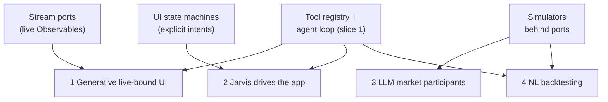
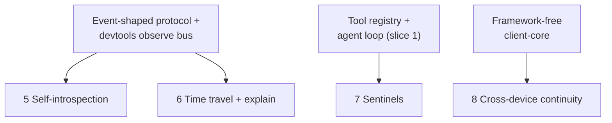
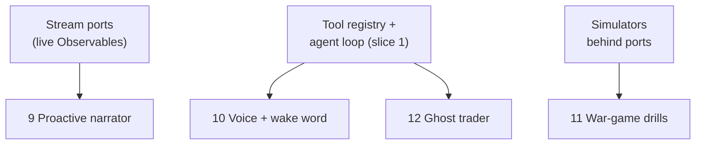
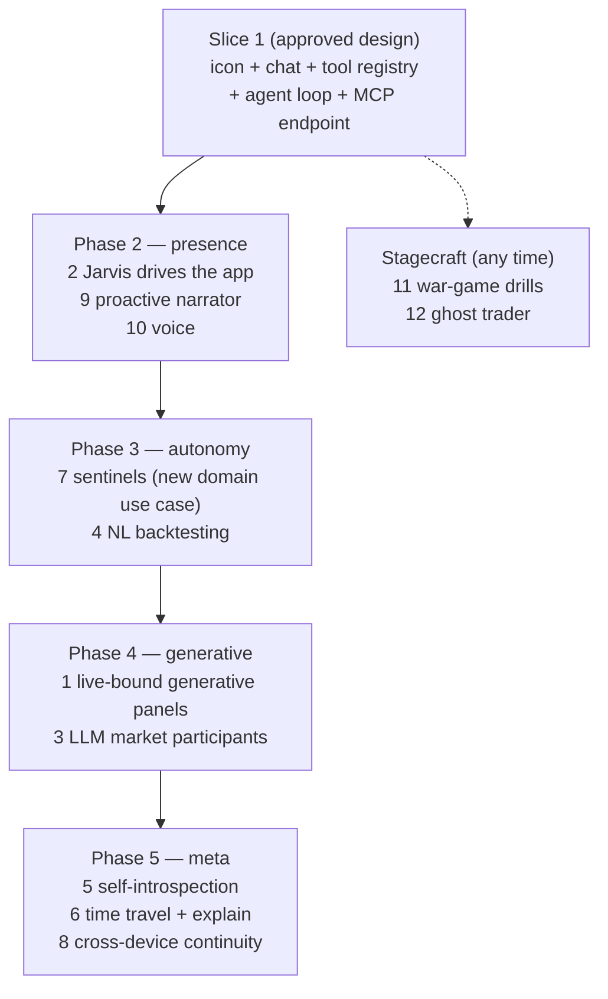

# 19. The AI Capability Roadmap

> **Status: forward-looking.** Nothing in this section is built; slice 1 of the Jarvis
> surface ([§18](18-jarvis-ai-agent-surface.md)) is itself pre-implementation. This
> section exists so the ideas are designed against the architecture — not remembered
> — and so each one names the **existing seam** it plugs into. That is the discipline
> dividend of §18.1 stated as a product backlog: none of these require changes to
> `@rtc/domain` except where explicitly stated.

Ordered by wow-per-believability within each tier. Items 1–8 all stand on the slice-1
tool registry as their load-bearing primitive.

## 19.1 Tier 1 — jaw-droppers

**1. Generative UI bound to live streams.** "Compare GBP crosses volatility over the
last hour" → Jarvis emits a *declarative panel spec* (chart type, symbols, transforms,
thresholds); the client materializes a transient HUD panel wired to the **live tick
streams** — it keeps updating after the LLM has left the conversation. Generated UI
over real-time push data is the trick almost nobody has seen.
*Seam:* a spec-interpreter machine + existing stream ports; the LLM only authors JSON.

**2. Jarvis drives the app.** "Set up my morning workspace" → tabs switch, panels
rearrange, the watchlist repopulates, tiles glow as it narrates. On a
permanently-animated HUD, an app visibly operating itself reads as *alive* in a way no
chatbox can.
*Seam:* all UI state is already machines; agent tools = dispatch machine intents —
the same registry pattern, pointed at the presentation layer.

**3. LLM market participants.** Claude-driven RFQ counterparties with personalities
that price, haggle, and hold grudges about the last trade you rejected — multi-agent
theater inside the market, not the assistant.
*Seam:* dealers/quotes are simulators behind ports; add a `ClaudeDealerAdapter`.

**4. Natural-language backtesting.** "Would buying every EUR dip below 1.085 have made
money today?" → Jarvis writes a small strategy, runs it against recorded session ticks
server-side, and answers with an equity curve in a generated panel (composes with #1).
*Seam:* price history + simulators; add a sandboxed strategy-runner tool.

## 19.2 Tier 2 — deep-cut engineering wow

**5. The app introspects itself.** Wire the RTC DevTools observe stream (PR #168 spec:
BroadcastChannel, machine states, WS traffic) into Jarvis as tools — "why is this tile
stale?", "did anything leak this session?" answered from the actual reactive graph. An
AI that debugs the running app it lives inside.
*Seam:* the devtools bus becomes a tool source; turns that workstream into a Jarvis
capability for free.

**6. Time travel + explain.** "What happened while I was away?" → replay the event
log, brief the user, scrub the UI back to the moment the PnL dipped ("here — this GBP
fill is where it turned").
*Seam:* event-shaped protocol + SoW replay + the devtools time-scrub roadmap.

**7. Sentinels as living HUD entities.** Standing watchers ("watch EUR/USD, buy at
1.09") with visible presence — orbiting glyphs that pulse while evaluating, flare on
trigger, and execute through the same confirm-gated path as §18.5.
*Seam:* **one new domain use case** (the only genuinely new domain concept on this
roadmap) + one HUD component.

**8. Cross-device séance.** Start a Jarvis conversation on the web HUD, continue it on
the RN app — same server-side session, both clients share `client-core`. A quiet but
devastating proof that the core is framework-free: the AI conversation itself becomes
the demo.
*Seam:* session keyed to user instead of socket; the RN panel reuses `JarvisMachine`.

## 19.3 Tier 3 — atmosphere and stagecraft

**9. Proactive narrator with deterministic triggers.** Cheap domain-side statistics
detect anomalies (spread 3σ, volatility spikes); the LLM is invoked only when a
trigger fires, to narrate and hypothesize. Alive-feeling proactivity without a
token-burning poll loop.
*Seam:* a small domain-side detector + one server effect.

**10. Voice + wake word.** "Jarvis—" (icon flares) "—flatten my GBP exposure."
WebSpeech recognition into the same chat pipeline; the confirm card doubles as the
safety net for mishears.
*Seam:* input adapter only; the pipeline is unchanged.

**11. War-game drills.** "Run a flash-crash drill" → Jarvis orchestrates the
simulators to inject a scenario, narrates the chaos, watches the user's response, and
debriefs. Agent-orchestrates-environment, not agent-answers-questions.
*Seam:* simulators behind ports accept scenario control.

**12. Ghost trader (computer use).** A Claude computer-use agent trading through the
rendered UI — screenshots and clicks while you watch the cursor move. Heavy and flaky
next to MCP, but memorable one-off theater: the AI uses the app the way a human does.
*Seam:* none needed — that is the point of the demo.

## 19.4 The capability-to-seam map

Every capability attaches to a seam that already exists (or, for sentinels, to the one
new use case). The seams are the investment; the capabilities are the interest. One
diagram per tier keeps each rank at four boxes (the house diagram rule) — and notice
the tool-registry seam appearing in every tier: that is why slice 1 is the
load-bearing primitive.

**Tier 1 — jaw-droppers**

**Tier 2 — deep-cut engineering wow**

**Tier 3 — atmosphere and stagecraft**

## 19.5 Suggested phase progression

Phases are scoped so each ships a self-contained demo; arrows are enablement, not a
strict schedule.

The sequencing logic: Phase 2 spends the slice-1 registry on the presentation layer
(maximum visible payoff per line of code); Phase 3 adds the single new domain concept;
Phase 4 builds the two features that need a spec-interpreter and an LLM adapter behind
existing ports; Phase 5 rides the devtools workstream once its observe bus exists.
