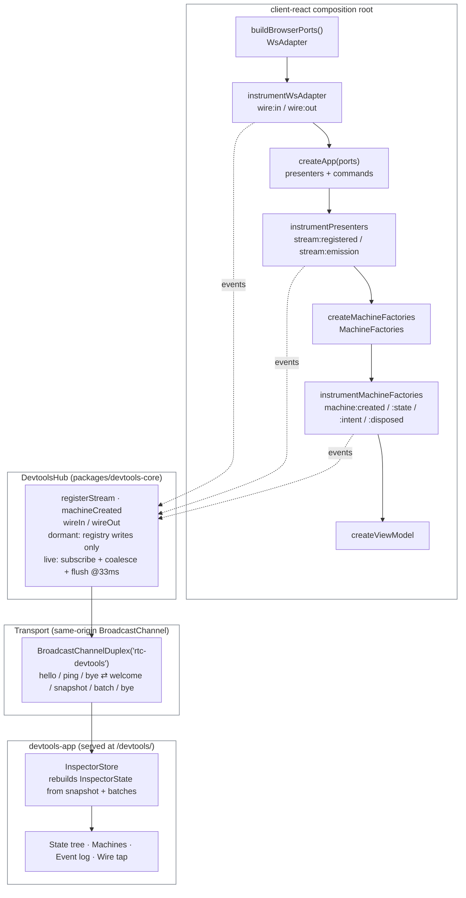

[◀ 19. The AI Capability Roadmap](19-ai-capability-roadmap.md) · [Architecture Document](../architecture.md)

## 20. RTC DevTools

Custom state-inspection developer tools for the app's non-Redux state layer.
Full design rationale: [`docs/superpowers/specs/2026-07-11-custom-devtools-design.md`](../superpowers/specs/2026-07-11-custom-devtools-design.md).

### 20.1 Why

The app's state layer is presenter streams and per-mount RxJS machines behind
the ViewModel seam ([§3.6](03-uml-class-diagrams.md#36-the-viewmodel-seam)) —
not Redux, MobX, or Zustand — so no off-the-shelf browser extension can
inspect it. For a developer evaluating this architecture, "there's no
devtools" reads as a real adoption cost.

The choke-point argument turns that objection into a pitch *for* the
architecture. Redux earns its devtools because it enforces exactly one choke
point: the store. This architecture has the same property by construction —
every piece of state crosses one of three seams:

- `createViewModel` (presenter streams → hooks)
- the `useMachine` bridge (`MachineFactories` → per-mount machine instances)
- the ports (WS-backed adapters at the composition root)

A devtools here therefore costs **a decorator at the composition root**, not
a bespoke framework integration. The devtools is also a live demonstration of
the port/adapter discipline it documents: the same instrumentation core
(`@rtc/devtools-core`) drives a standalone inspector today and, later, a
Chrome-extension shell and a React Native relay ([§20.8](#208-future-extensions))
by swapping only a transport adapter.

### 20.2 Architecture

Two new packages, following the existing naming and layering conventions
([§6](06-package-dependencies.md#6-package-dependencies)):

| Package | Contents | Runtime deps |
|---|---|---|
| `@rtc/devtools-core` | Protocol types, serializer, `DevtoolsHub`, three decorators, `DevtoolsTransport` port + `BroadcastChannelDuplex` adapter | **`rxjs` only** — the same constraint as `@rtc/domain`/`@rtc/ws-effects` |
| `@rtc/devtools-app` | The inspector UI: Vite + React 19 SPA, four panels | `@rtc/devtools-core`, `react`, `react-dom` |

`devtools-core` never imports `@rtc/client-core` — it decorates by
*structural* shape (`InstrumentableMachine`, `WsAdapterLike`, anything with a
`.subscribe`), so its types are generic. The presenter **manifest** — which
keys of `Presenters` are streams, parameterized-stream methods, or a shared
machine — lives at the call site in `client-react`
(`packages/client-react/src/app/devtools/presenterManifest.ts`), which
already knows the concrete types. `devtools-app` never imports `client-core`
or `domain` either — it understands only the wire protocol, which is what
makes a future extension shell a thin wrapper around the same bundle.

Composed tall, one column at a time: the app supplies decorated objects, the
hub collects and batches, a transport carries the batches, the panel renders
them.



The three decorators, all applied at the `client-react` composition root
(`packages/client-react/src/AppRoot.tsx` and
`packages/client-react/src/app/buildBrowserPorts.ts`):

- **`instrumentWsAdapter(adapter, hub)`** (`packages/devtools-core/src/instrument/wsAdapter.ts`) — wraps `send`/`on`/`rpc` to report `wire:out`/`wire:in`; every other member delegates untouched via an explicit-bind `Proxy`.
- **`instrumentPresenters(presenters, manifest, hub)`** (`packages/devtools-core/src/instrument/presenters.ts`) — walks the `Presenters` object per the `PresenterManifest`: `props` register a shared stream once, `methods` register a child stream per distinct arg tuple on first call, `machine` entries register a shared machine's `state$` and log its intents. Proxies, not spreads — presenters are class instances, so spreading would drop prototype methods.
- **`instrumentMachineFactories(factories, hub)`** (`packages/devtools-core/src/instrument/machines.ts`) — one generic wrapper covering all current and future per-mount machine kinds: assigns an instance id, reports `machine:created`, taps `state$`, wraps every intent function, wraps `dispose`.

Every decorator body is wrapped in `try/catch`: a devtools failure returns
the raw object/falls through to the real call rather than ever propagating
into a presenter stream or an intent path.

### 20.3 The dormancy contract

The hub is **registered-not-subscribed** while dormant: `registerStream` and
`machineCreated` only write to a `Map` — no RxJS subscription exists until an
inspector says hello. From `packages/devtools-core/src/DevtoolsHub.ts`:

```ts
registerStream(streamId: string, source$: Observable<unknown>): void {
  if (this.streams.has(streamId)) {
    return;
  }

  const entry: StreamEntry = { source$, sub: null };
  this.streams.set(streamId, entry);

  if (this.isLive) {
    try {
      this.pendingDiscrete.push(
        this.event({ kind: "stream:registered", streamId }),
      );
      this.subscribeStream(streamId, entry);
    } catch (error) {
      this.reportError("registerStream", error);
    }
  }
}
```

`goLive`/`goDormant` are the only two places that subscribe/unsubscribe:

```ts
private goLive(): void {
  if (this.isLive) {
    // re-hello from a reloaded panel: resend welcome + fresh snapshot
    this.sendWelcomeAndSnapshot();
    this.lastPingAt = Date.now();
    return;
  }

  this.isLive = true;
  this.lastPingAt = Date.now();

  // Subscribing state-backed sources emits synchronously → lands in pending,
  // which sendWelcomeAndSnapshot() drains into the snapshot message.
  for (const [id, entry] of this.streams) {
    this.subscribeStream(id, entry);
  }

  for (const [id, entry] of this.machines) {
    if (!entry.disposed) {
      this.subscribeMachine(id, entry);
    }
  }

  this.sendWelcomeAndSnapshot();
  this.flushTimer = setInterval(() => {
    this.flush();

    if (Date.now() - this.lastPingAt > this.heartbeatTimeoutMs) {
      this.goDormant();
    }
  }, this.flushIntervalMs);
}

private goDormant(): void {
  if (!this.isLive) {
    return;
  }

  this.isLive = false;

  if (this.flushTimer !== null) {
    clearInterval(this.flushTimer);
    this.flushTimer = null;
  }

  for (const entry of this.streams.values()) {
    entry.sub?.unsubscribe();
    entry.sub = null;
  }

  for (const entry of this.machines.values()) {
    entry.sub?.unsubscribe();
    entry.sub = null;
  }

  this.pendingStreams.clear();
  this.pendingMachineStates.clear();
  this.pendingDiscrete = [];
  this.ring.length = 0;

  try {
    this.transport?.send({ kind: "bye" });
  } catch {
    // panel already gone — nothing to tell
  }
}
```

While dormant, every emission on a registered source hits no subscriber at
all — RxJS has nothing to schedule, serialize, or buffer. This is proven, not
asserted: `packages/devtools-core/src/__tests__/DevtoolsHub.test.ts`'s
`"is dormant until hello: no subscription on registered sources"` test
registers a stream, asserts `source$.observed === false`, pushes an emission,
and asserts nothing was sent or buffered — then sends `hello` and asserts the
subscription (and the welcome/snapshot pair) appear only at that point.

### 20.4 Protocol

Versioned, JSON-serializable envelopes, mirroring the app's own
`CLIENT_MSG`/`SERVER_MSG` discipline
([§7](07-communication-patterns.md#websocket-message-format)). From
`packages/devtools-core/src/protocol.ts`:

```ts
export type DevtoolsEvent =
  | (EventBase & { kind: "stream:registered"; streamId: string })
  | (EventBase & {
      kind: "stream:emission";
      streamId: string;
      value: SerializedValue;
      /** Emissions coalesced into this event within the flush window (≥1). */
      coalesced: number;
    })
  | (EventBase & {
      kind: "machine:created";
      machineId: string;
      machineKind: string;
      args: SerializedValue;
    })
  | (EventBase & {
      kind: "machine:state";
      machineId: string;
      state: SerializedValue;
      coalesced: number;
    })
  | (EventBase & {
      kind: "machine:intent";
      machineId: string;
      name: string;
      args: SerializedValue;
    })
  | (EventBase & { kind: "machine:disposed"; machineId: string })
  | (EventBase & {
      kind: "wire:in" | "wire:out";
      msgType: string;
      payload: SerializedValue;
    })
  | (EventBase & { kind: "devtools:error"; context: string; message: string });

export type AppToInspector =
  | { kind: "welcome"; v: number; appId: string }
  | {
      kind: "snapshot";
      streams: readonly SnapshotStream[];
      machines: readonly SnapshotMachine[];
    }
  | { kind: "batch"; events: readonly DevtoolsEvent[] }
  | { kind: "bye" };

export type InspectorToApp =
  | { kind: "hello"; v: number }
  | { kind: "ping" }
  | { kind: "bye" };
```

`snapshot`-on-attach followed by `seq`-ordered `batch` deltas is the same
state-transfer discipline as the app's own WS protocol (and Chrome's CDP):
late joiners get a full picture, then ordered deltas. The hub batches at a
~30 Hz cadence (`flushIntervalMs: 33`) and coalesces per-stream — only the
latest value per flush window crosses the channel, plus a `coalesced` count
so the panel can still show true tick rates. A ring buffer retains the last
10k events, only while an inspector is live (`goDormant` clears it).

**Note vs the original design spec:** the spec's §5 sketched an inbound
`subscribe {filters}` message; that was dropped during implementation — the
hub always sends the full registry, and the panel filters client-side. The
inbound surface actually shipped is exactly `hello` / `ping` / `bye`
(`InspectorToApp` above), which is also the smaller, more honest security
surface referenced in [§20.6](#206-serving-topology).

**Order-independent handshake:** the panel's `InspectorClient` re-sends `hello`
every 2 s while disconnected (rather than a single one-shot `hello`), and
switches to `ping` only once the app answers with `welcome`. This makes
connecting order-independent — the panel can be opened before the app is
ready — and lets it auto-reconnect after an app reload (which sends `bye` via
`pagehide`, flipping the panel back into hello mode). While the panel tab is
backgrounded the browser throttles this timer, so reconnection completes once
the panel is foregrounded; an abrupt app crash with no `pagehide` remains the
documented v1 limitation.

### 20.5 Serialization & error isolation

One serializer in `devtools-core` (`packages/devtools-core/src/serialize.ts`)
with hard caps — depth ≤ 6, arrays truncated at 50 with a `…+N` marker,
strings at 500 chars — and tagged encodings for `ReadonlyMap`/`ReadonlySet`
(e.g. `allQuotes$`, `newTradeIds$`), so panels show summaries, never raw
unbounded payloads.

Every decorator and hub method that touches app data is wrapped so a
devtools failure — a serializer throwing on an exotic value, a full channel,
a panel gone mid-batch — is caught, counted, and reported as a
`devtools:error` event, never propagated into a presenter stream or an
intent call path. A wrapped intent function always delegates to the real
intent even if the logging call throws first.

### 20.6 Serving topology

The panel is served **from the app's own origin** — load-bearing, because the
v1 transport is a same-origin `BroadcastChannel`
(`packages/devtools-core/src/BroadcastChannelDuplex.ts`, channel name
`rtc-devtools`), and `BroadcastChannel` cannot cross origins. A panel served
from any other origin — e.g. the standalone `devtools-app` dev server on
port 5280, used only for disconnected panel-UI iteration — has no hub to
pair with and renders the "disconnected" state by design.

A dependency-free Vite plugin in `client-react`
(`packages/client-react/vite.config.ts`, `devtoolsPanel()`) makes `/devtools/`
work identically in dev and in the deployed app:

- **Dev**: Connect middleware (`server.middlewares.use("/devtools", ...)`)
  serves `devtools-app`'s built `dist/` directly from the workspace package,
  resolving `@rtc/devtools-app/package.json` (no source import — dep-cruiser
  forbids that) and streaming files with a small content-type map. Paths are
  resolved and verified to stay inside the served directory before any file
  is streamed, closing a path-traversal request like
  `/devtools/../../etc/passwd`.
- **Build**: `closeBundle()` copies the already-built `devtools-app/dist`
  into `dist/devtools`, so the deployed app serves the same bundle at
  `/devtools/` with no separate deploy step.

Disconnect behavior: the app registers a `pagehide` listener at module load
(`packages/client-react/src/app/devtools/devtoolsHub.ts`):

```ts
export const devtoolsHub = new DevtoolsHub({ appId: "rtc-web" });

if (typeof BroadcastChannel !== "undefined") {
  devtoolsHub.attachTransport(new BroadcastChannelDuplex("rtc-devtools"));

  if (typeof window !== "undefined") {
    window.addEventListener("pagehide", () => {
      devtoolsHub.dispose();
    });
  }
}
```

`pagehide` (not `beforeunload`) survives bfcache and mobile Safari;
`dispose()` calls `goDormant()`, which sends a `bye` — flipping the panel to
"disconnected" — and is idempotent, so it's safe to call even if the hub
never went live. **v1 limitation, documented, not silently accepted:** an
abrupt renderer crash fires no `pagehide`, so no `bye` is sent; the panel has
no independent liveness timeout and keeps showing "connected" until the
inspector itself reloads. A panel-side welcome-freshness timer that closes
this gap is listed as a future extension ([§20.8](#208-future-extensions)).

### 20.7 Perf

**Structural argument, not a claimed measurement.** Dormancy is
registered-not-subscribed ([§20.3](#203-the-dormancy-contract)): while no
inspector is attached, `DevtoolsHub` holds zero RxJS subscriptions on any
registered stream or machine `state$`. Every tap on a live emission — a
price tick, a trade, a wire message — costs exactly one boolean check
(`if (!this.isLive) return;`), with no serialization and no allocation
beyond the wrapper closures created once at composition time. There is
therefore no new per-frame subscriber and no new animation added to the app
by shipping this instrumentation, which means:

- Steady-state renderer-main work is structurally unchanged from the
  pre-devtools app — nothing new runs per frame while dormant.
- Zero new `compositeFailed` risk while dormant, because there is no new
  animation at all — the panel's own rendering (which does animate: change
  flashes, sparklines) runs in a separate tab and pays its own cost, never
  the app tab's.

This structural argument is backed by an executable test, not just prose:
`DevtoolsHub.test.ts`'s dormancy test (quoted in
[§20.3](#203-the-dormancy-contract)) asserts `source$.observed === false`
while dormant and that an emission produces zero sent/buffered output.

**What remains to confirm at live-acceptance** (not yet run, per
`docs/performance.md`'s recipe): a production-build trace of the FX tab,
20s steady state, **no inspector attached**, compared against the
pre-devtools FX baseline (FX ≈ 13.7% renderer-main as of PR #164). Acceptance
is renderer-main within noise of that baseline and zero `compositeFailed`
events — this is the honest framing: the structural argument above is why we
expect that result, but the trace itself is a manual/live verification step,
not a number recorded here. A second trace with an inspector attached in a
companion tab is the live-cost sanity check: the *app* tab should stay within
~2% renderer-main of the dormant trace (the inspector tab is allowed to work
harder — it owns none of the app's frame budget).

**Tracked perf item — inspector-side render saturation under CPU pressure.**
The "inspector tab is allowed to work harder" allowance above has a known
sharp edge. The `InspectorStore` folds each `DevtoolsHub` flush (~33 ms
cadence, so ~30 batches/s) synchronously and notifies `useSyncExternalStore`
on every apply, so the whole `InspectorApp` re-rendered ~30×/s. When a single
apply+render exceeded the 33 ms production interval (as it does under heavy CPU
throttling, e.g. a slow 2-core CI runner), the inspector fell behind the
incoming batch rate and its main thread never idled. Measured under a 4× CPU
throttle: a no-op `page.evaluate` round-trip on the inspector tab took ~7.8 s
(vs ~14 ms on the app tab), and a Playwright tab-switch click — whose
actionability polling needs that same main thread — took 12–31 s. Worse, a
naive "rebuild eagerly on `getSnapshot()`" fix makes it *hang*:
`useSyncExternalStore`'s post-commit consistency check sees a new snapshot on
every read while the stream flows and re-renders in a tight loop.

**Fix (`InspectorStore`).** The store now decouples React notification from the
apply rate. `apply()` only mutates the internal maps and marks the store dirty;
the public `InspectorState` rebuild **and** the subscriber notification are
coalesced into a single flush, throttled to ~15 Hz
(`FRAMES_PER_FLUSH`) and driven by `requestAnimationFrame` — so it self-limits
under CPU pressure and pauses entirely while the panel tab is hidden.
Critically, `this.state` is reassigned **only** at the flush, so `getSnapshot()`
is stable between flushes and the `useSyncExternalStore` render-storm cannot
occur. In a non-DOM environment (tests, SSR) there is no frame loop, so the
flush runs synchronously and reads stay immediately fresh. This eliminated the
renderer freeze and let `tests/browser/playwright/devtools.spec.ts` drop its
whole-test timeout from 120 s back to 45 s. Further per-render cost (memoizing
individual rows, reworking the change-flash so it doesn't remount a
`will-change` span per emission) is a smaller, optional follow-up on top of
this.

### 20.8 Future extensions

Summarized from spec [§9](../superpowers/specs/2026-07-11-custom-devtools-design.md#9-future-extensions-designed-for-explicitly-out-of-v1) — designed for, explicitly deferred from v1:

1. **Intent injection** — protocol gains `intent:invoke {machineId | presenter, name, args}`; the hub already holds live instance refs, so this is mostly wiring plus an opt-in gate (dev flag or token) since it would be the first inbound surface with a write.
2. **Record & replay** — persist `snapshot + event stream` (already event-sourced); a replay mode feeds a recording back into the panel with no app involvement ("flight recorder"). Full *app* replay (recorded port inputs into a fresh composition root) is a separately scoped, larger step needing seeded time/timers.
3. **Chrome extension shell** — an MV3 wrapper: content script bridges `BroadcastChannel` ↔ background ↔ a devtools-panel page hosting the *same* `devtools-app` bundle. Protocol and UI untouched; packaging work only.
4. **React Native support** — a WebSocket-relay `DevtoolsTransport` adapter (the port already exists for this) plus the same three decorators applied at the RN composition root; the panel runs on the developer's machine, inspecting the device over the relay.
5. **Time-scrubbing UI** — a panel-side slider over the ring buffer reconstructing past state-tree views. Honest framing: viewing recorded history, not rewinding the live app — RxJS streams over a socket cannot be replayed the way Redux replays pure reducers.
6. **Panel-side liveness timeout** — closes the abrupt-crash gap noted in [§20.6](#206-serving-topology): a welcome-freshness timer in the inspector that flips to "disconnected" if no traffic (including `ping`s) arrives within a bounded window, covering the case where the app disappears without firing `pagehide`.

---
