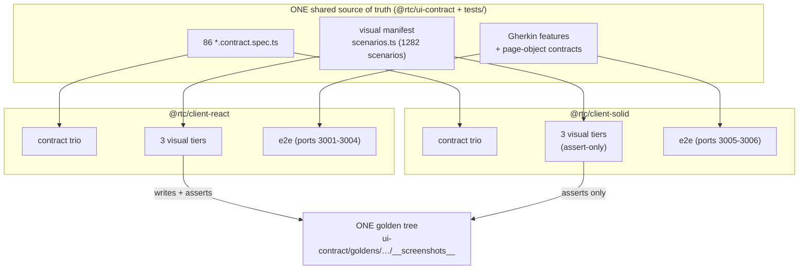
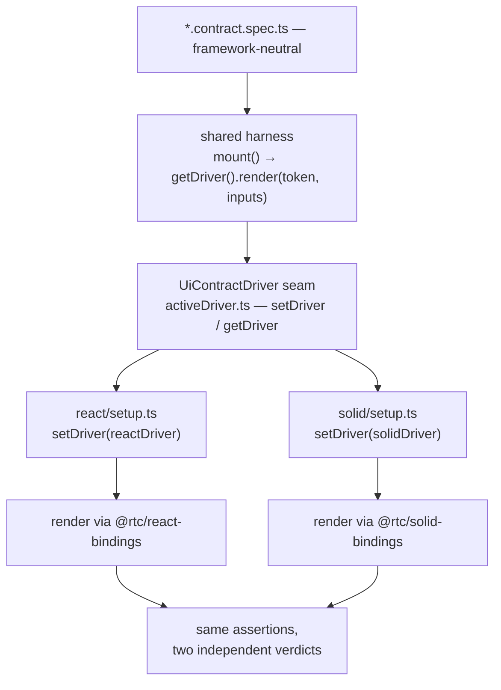
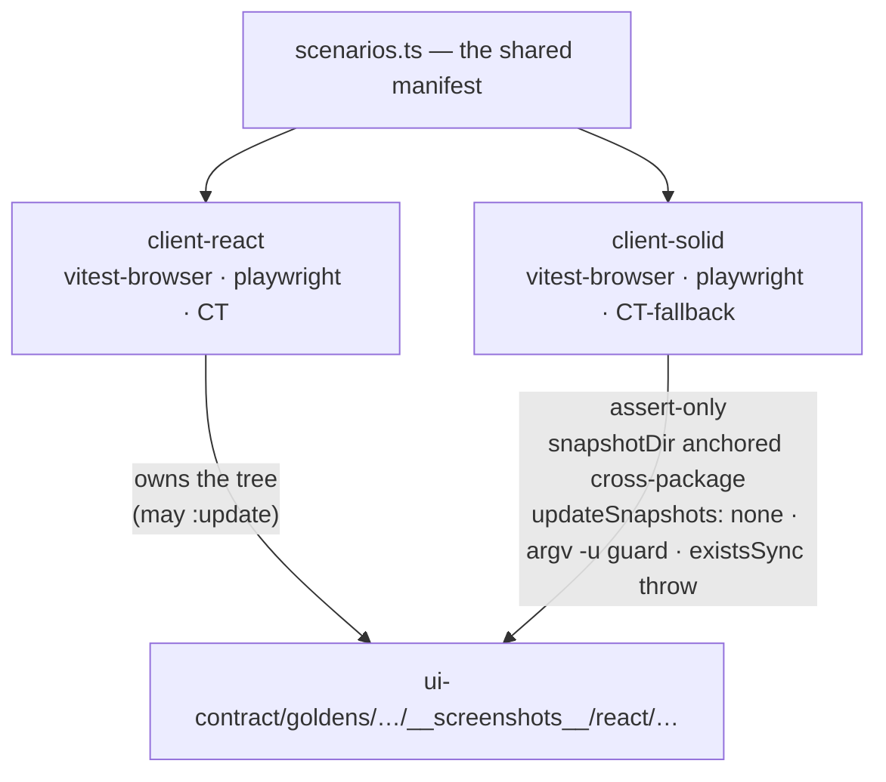
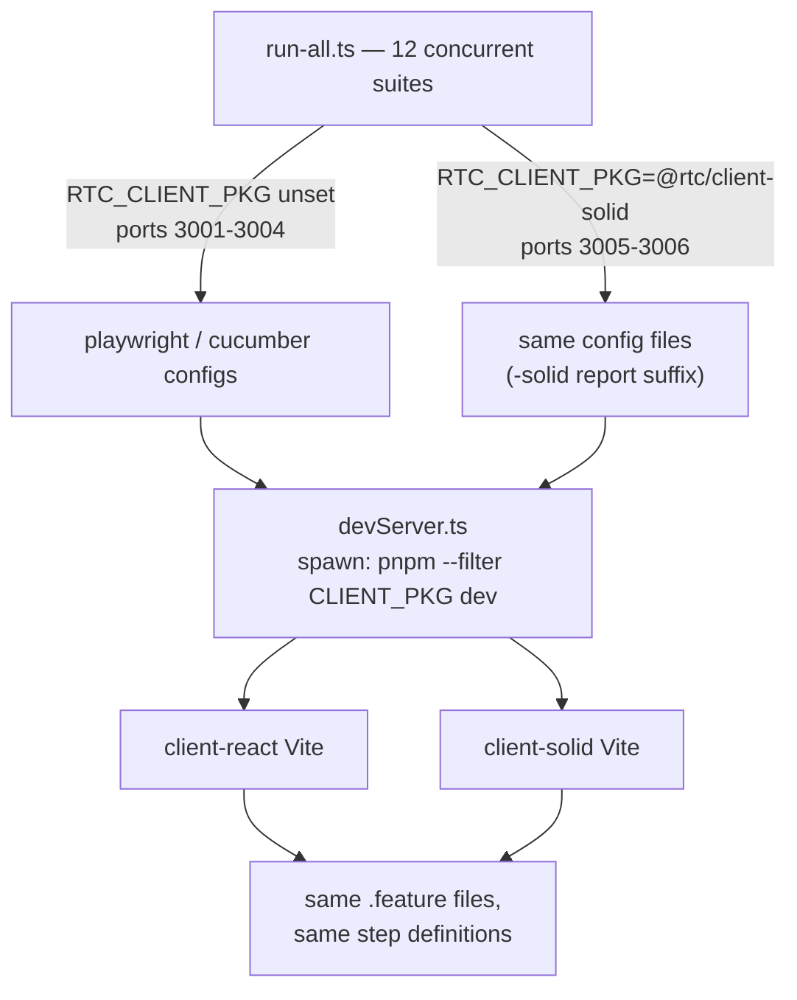

# §21 One Test Suite, Two Frameworks — Cross-Framework Testing

[◀ 20. RTC DevTools](20-devtools.md) · [Architecture Document](../architecture.md)

## The claim

[§8.1](08-replaceability-matrix.md#81-the-multi-client-proof--the-solidjs-port)
states the replaceability claim in one sentence: you can swap the UI framework
by changing only its package. `@rtc/client-solid` is where that claim gets
tested against reality rather than asserted in prose — and per
[ADR-001](../../packages/client-react/tests/ui/visual/ADR-001-visual-diff-tooling.md),
proving it was a design goal from before Solid existed: the visual tier's
goldens were built to "later gate a reimplementation of the UI layer in
another framework."

This chapter is the synthesis of *how*: one shared spec/scenario/feature
source, exercised three independent ways against both clients. Independence
is the point, not a redundancy — a bug in the shared contract-spec harness
would fool both clients' contract runs identically, but it can't also forge a
pixel-identical screenshot or fake a real-browser `fill()` event sequence, so
the three tiers fail on different axes when something is actually wrong.





## The scoreboard

Numbers below were verified live against this repo (2026-07-19), not copied
from any per-tier README — see the "How this was verified" note at the end of
this section.

| Tier | Shared source | React result | Solid result |
|---|---|---|---|
| UI contract (sociable RTL) | 86 `*.contract.spec.ts` files, one tree | 86 files, 622 tests passing | 86 files, 622 tests passing — **full parity**, `notYetPortedSpecs` is `[]` |
| Visual goldens (3 tiers) | 1282 scenarios (`scenarios.ts`, theme-matrix expanded) × 3 runners each | Owns the golden tree — the only client permitted to `:update` it | Same 1282 scenarios × 3 tiers, **assert-only** against the `ui-contract/goldens/` tree (generated only from client-react renders) — owns zero goldens of its own |
| e2e (Gherkin behavioural) | Same `.feature` files + step definitions + page objects | 4 browser suites, ports 3001–3004 | 2 browser suites, ports 3005–3006 (`playwright`, `playwright-cucumber`) — 1 spec excluded (`login.spec.ts`, see [The fine print](#the-fine-print)) |
| Devtools inspector panel | Same `@rtc/devtools-core` protocol + `InspectorApp` | App id `rtc-web` | App id `rtc-web-solid` — full panel parity shipped in PR #262 (one line: same four panels, same protocol, different app id) |

`tests/scripts/run-all.ts` runs **12 concurrent suites** total: 2 full-stack
smokes + 4 in-process presenter peers (react/solid-agnostic — they never touch
a UI framework) + the 6 browser suites in the table above (4 react + 2 solid;
see the fine print).

**How this was verified**: `find packages/ui-contract/src -name "*.contract.spec.ts" | wc -l` → `86`;
`pnpm --filter @rtc/client-react test:ui:contract` and the same for
`@rtc/client-solid` → both `Test Files 86 passed (86)` / `Tests 622 passed
(622)`; the scenario count came from evaluating the built
`packages/ui-contract/dist/visual/scenarios.js`'s exported `scenarios` map
(`Object.keys(scenarios).length` → `1282`) rather than trusting any README's
stated figure, since `packages/client-react/tests/ui/visual/README.md` does
not currently print a total and older planning notes cited a stale `1252`.

## How the sharing works — three mechanisms

### Mechanism 1 — the contract swap-trio

The seam every contract spec renders through, in full
(`packages/ui-contract/src/shared/harness/activeDriver.ts:32-55`, eliding the
`MountedRoot` doc comments):

```ts
/** A framework adapter that knows how to render a token into the DOM. */
export interface UiContractDriver {
  render<P, Page extends MountedComponent<P>>(
    token: ComponentToken<P, Page>,
    inputs: RenderInputs<P>,
  ): MountedRoot;
}

let active: UiContractDriver | null = null;

export function setDriver(driver: UiContractDriver): void {
  active = driver;
}

export function getDriver(): UiContractDriver {
  if (!active) {
    throw new Error(/* … */);
  }

  return active;
}
```

Each client supplies its own `UiContractDriver` from an identically-shaped
trio of eight files — same filenames, same responsibilities, different render
target underneath:

| `packages/client-react/tests/ui/contract/react/` | `packages/client-solid/tests/ui/contract/solid/` |
|---|---|
| `AnimationProbe.tsx` | `AnimationProbe.tsx` |
| `LayoutEngineHost.tsx` | `LayoutEngineHost.tsx` |
| `PropsHost.tsx` | `PropsHost.tsx` |
| `pinnedFixtureLayoutPort.ts` | `pinnedFixtureLayoutPort.ts` |
| `registry.tsx` | `registry.tsx` |
| `render.tsx` | `render.tsx` |
| `setup.ts` | `setup.ts` |
| `viewModelFromWorld.ts` | `viewModelFromWorld.ts` |

The *only* per-client difference lives in one line of each `vitest.config.ts`'s
`setupFiles` array:

```ts
// packages/client-react/tests/ui/contract/vitest.config.ts
setupFiles: [
  "./tests/setup/jsdom-storage.ts",
  "./tests/ui/contract/react/setup.ts",
],
```

```ts
// packages/client-solid/tests/ui/contract/vitest.config.ts
setupFiles: [
  "./tests/setup/jsdom-storage.ts",
  "./tests/ui/contract/solid/setup.ts",
],
```

Each `setup.ts` does exactly one job — register its trio's driver before any
spec runs:

```ts
// packages/client-react/tests/ui/contract/react/setup.ts
import { reactDriver } from "./render";
setDriver(reactDriver);
```

```ts
// packages/client-solid/tests/ui/contract/solid/setup.ts
import { solidDriver } from "./render";
setDriver(solidDriver);
```

And a shared spec never imports either trio — it depends only on the
framework-neutral harness (`packages/ui-contract/src/specs/fx/analytics/AnalyticsHead.contract.spec.ts:1-3`):

```ts
import { AnalyticsHead } from "@ui-contract/components";
import { cleanupMounted, mount } from "@ui-contract/mount";
import { afterEach, describe, expect, it } from "vitest";
```

No `react` or `solid-js` import anywhere in the spec file — `mount()` resolves
`getDriver()` internally, and `getDriver()` returns whichever driver that
package's `setup.ts` registered.



### Mechanism 2 — assert-only visual tiers

Both clients run the same three visual tiers (vitest-browser, Playwright,
CT/CT-fallback) over the same shared manifest
(`packages/ui-contract/src/visual/scenarios.ts` — a `Scenario` maps a name to
a `componentKey` + `fixtureKey`) and the same golden-path resolver
(`packages/ui-contract/src/visual/goldenPath.ts` — `goldenPath(name,
scenario)` turns a scenario into `<skin>-<mode>/<base-name>`). But
`client-solid` never writes a screenshot: every one of its visual configs is
wired to fail rather than create.

The cross-package anchor
(`packages/client-solid/tests/ui/visual/playwright/playwright.config.ts`):

```ts
// CROSS-PACKAGE: unlike react's own config (which owns its slice of the
// shared tree), this tier's snapshotDir is anchored INSIDE @rtc/ui-contract —
// this package writes and owns no goldens of its own (assert-only by
// construction, same design as ../vitest-browser/vitest-browser.config.ts).
// Goldens are generated exclusively from client-react's renders; solid only
// ever reads them. …
const REACT_SNAPSHOT_DIR = fileURLToPath(
  new URL(
    "../../../../../ui-contract/goldens/playwright/__screenshots__",
    import.meta.url,
  ),
);
```

paired with `updateSnapshots: "none"` (belt-and-suspenders alongside the argv
guard below — Playwright's own default, `"missing"`, would otherwise silently
create a reference screenshot the first time a scenario name drifts):

```ts
snapshotDir: REACT_SNAPSHOT_DIR,
updateSnapshots: "none",
```

The argv guard in the same file refuses to even start if anyone tries to flip
that back on:

```ts
if (
  process.argv.some((arg) => {
    return (
      arg === "--update-snapshots" ||
      arg.startsWith("--update-snapshots=") ||
      arg.startsWith("-u")
    );
  })
) {
  throw new Error(/* … */);
}
```

`startsWith("-u")` covers every Commander-CLI short-flag shape Playwright
accepts for this flag: the bare alias `-u`, the concatenated `-uall`/`-umissing`
forms, and `-u=X` — `-u` is the only short flag beginning with "u" in
Playwright's whole CLI, so there is no false-positive risk against an
unrelated flag.

The vitest-browser tier enforces the same invariant differently, because
vitest's `toMatchScreenshot` has no `updateSnapshots: "none"` equivalent — it
auto-creates a missing golden unconditionally. So
`packages/client-solid/tests/ui/visual/vitest-browser/vitest-browser.config.ts:158`
throws instead of ever returning a path that doesn't already exist:

```ts
if (!existsSync(screenshotPath)) {
  throw new Error(
    `assert-only tier: golden missing at ${screenshotPath} — ` +
      "goldens are owned by client-react; refusing to auto-create " +
      "one from the solid tier. Regenerate it via " +
      "`pnpm --filter @rtc/client-react test:ui:visual:vitest-browser:react:update`.",
  );
}
```

**Client-solid owns zero goldens — that is what makes a pixel match a proof
rather than a coincidence.** If the two clients' renders ever diverged by even
a few pixels of layout, font, or color, this tier would fail loudly instead of
quietly creating a second "correct" baseline next to the first.



### Mechanism 3 — e2e via RTC_CLIENT_PKG

This mechanism has never had a maintained doc of its own — it lives entirely
in source comments until this chapter. One environment variable
re-parameterizes which client's dev server the shared e2e suites drive.

`tests/scripts/devServer.ts:26-33`:

```ts
// Which client package's dev server to spawn. Defaults to the web React
// client; solid browser suites set this to "@rtc/client-solid" (see
// tests/scripts/run-all.ts) to prove the same Gherkin contracts against the
// SolidJS client. Both packages' vite.config.ts read PORT/host the same way,
// so no other server-lifecycle assumption here is client-specific.
export const CLIENT_PKG: string =
  process.env.RTC_CLIENT_PKG ?? "@rtc/client-react";
```

...consumed by the spawn call in the same file (`tests/scripts/devServer.ts:79`):

```ts
const child = spawn("pnpm", ["--filter", CLIENT_PKG, "dev"], {
```

`tests/browser/playwright/playwright.config.ts:10-22` keys ports and report
paths off the same variable:

```ts
const isSolid = process.env.RTC_CLIENT_PKG === "@rtc/client-solid";
const reportSuffix = isSolid ? "-solid" : "";
// ...
const notYetPortedSpecs = isSolid ? ["login.spec.ts"] : [];
```

The comment above that array in the live file currently claims Solid "has no
sign-in/gate UI yet" — that predates PR #241 and is no longer true:
`packages/client-solid/src/ui/shell/auth/LoginScreen.tsx` and its `AuthGate`
ship today, and the UI-contract tier's two `shell/auth` specs already pass on
Solid (see the scoreboard above). The real reason `login.spec.ts` stays
excluded, per `docs/STATUS.md`, is credential wiring, not missing UI: the spec
drives the `demo`/`demo` login, which only `client-react`'s
`VITE_DEV_AUTH`-reading dev-auth path accepts — `client-solid` hardcodes the
`mcdc2026` demo roster in `buildBrowserPorts.ts` instead, so `demo`/`demo`
fails there. Every other browser e2e spec, including `devtools.spec.ts`, runs
unmodified against both clients.

`tests/scripts/run-all.ts:55-56` is where the two Solid suites join the pool
as ordinary entries, no different in shape from React's:

```ts
"test:browser:playwright:solid",
"test:browser:playwright-cucumber:solid",
```



## The principles that made it possible

**Dependency inversion.** Contract specs depend on `UiContractDriver`, an
interface, never on React or Solid directly. Each client injects its own
implementation at `setup.ts` time. The specs are the stable abstraction; the
render target is the detail that varies.

**Humble object / dumb UI.** [ADR-005](../adr/ADR-005-ui-logic-placement.md)
and the rxjs-machines refactor pushed state and orchestration into
`client-core` machines and presenters, leaving `src/ui` thin enough that a
framework port is a `src/ui`-only rewrite — nothing in the swap touches
business logic, because none of it lives where the swap happens.

**Single source of truth.** One `*.contract.spec.ts` tree, one scenario
manifest (`scenarios.ts`), one golden set (react-owned), one `.feature` tree.
Every mechanism above resolves to "there is exactly one copy of the thing
being tested" — duplication is confined to the seams (the trios, the
per-client config lines), never to the content.

**Contract at the seam.** `@rtc/react-bindings` and `@rtc/solid-bindings`
expose the identical `ViewModel` `use*` accessor surface; the e2e page objects
bind through the same `data-testid` + STRINGS contract regardless of which
client rendered the DOM. Both are what let literally the same test bind to
either implementation without a single `if (isSolid)` inside a spec file.

**Parameterize, don't fork.** `setupFiles` (Mechanism 1), `snapshotDir`
(Mechanism 2), and `RTC_CLIENT_PKG` (Mechanism 3) are each a one-point swap —
a single config field or environment variable. Nothing about any of the three
mechanisms forks the test code itself between clients.

## What the net actually caught

Three independent tiers only earn their keep if they catch different things.
Two real incidents make the case:

**The TileNotional double-fire (e2e-only catch, PR #240).** React's
`SyntheticEvent` system deduplicates a native `input` immediately followed by
a native `change` carrying the same value — Solid has no equivalent
value-tracking dedup. In a real browser, Playwright's `locator.fill()`
dispatches *both* events for one fill; the `input` event applies the raw
value and (as a controlled input) synchronously reformats it to
`NotionalView`'s comma-formatted `displayValue` (e.g. `"10000000"` →
`"10,000,000"`), and by the time the trailing native `change` fires,
`e.currentTarget.value` already reads that comma-formatted string back.
Re-feeding it to `parseNotional` — which rejects commas — stomped the
just-applied valid state with a spurious "Invalid input" error, on Solid
only. Neither the contract tier (jsdom's `fireEvent` never fires both events
for one interaction) nor the visual tiers (screenshots, not event sequences)
could have seen this — only a real browser driving a real input satisfies the
precondition. The fix is a no-op guard in
`packages/client-solid/src/ui/fx/liveRates/tile/TileNotional.tsx`: skip
re-processing when the incoming value already matches what's currently
displayed.

**Classic-skin CI font non-determinism (visual-tier catch).** The `classic`
theme skin is the one skin whose font tokens resolve to OS-generic keywords
(`system-ui`/`ui-monospace`) instead of an embedded `@fontsource` face, so any
text-width-driven element crop of it varies with the runner's system fonts —
and GitHub-hosted runners were observed resolving them non-deterministically
across runs. The assert-only tiers surfaced this during the Solid port
(PR #230): 4 classic-skin CT assertions (`chrome/header` and
`admin/event-log`, × light/dark) are skipped on CI only in solid's
`ct-fallback` tier, still verified by the other two x86 tiers and all three
tiers on darwin. Neither tier's designers anticipated host-font
non-determinism when the goldens were first built — the cross-framework
assertion is what turned a latent CI flake into a tracked, understood
limitation instead of an intermittent unexplained red.

## The fine print

Every current asymmetry between the two clients' test coverage, in one place:

| Asymmetry | Why | Tracked |
|---|---|---|
| e2e `login.spec.ts` excluded on Solid | Credential wiring, not missing UI — the spec drives `demo`/`demo`, which only `client-react`'s `VITE_DEV_AUTH` dev-auth path accepts; `client-solid` hardcodes the `mcdc2026` roster instead | [`docs/STATUS.md`](../STATUS.md) ("Solid `login.spec` e2e") |
| 4 classic-skin CT assertions skipped CI-only | Host font-environment non-determinism for OS-generic font tokens, not a real UI difference | [`docs/STATUS.md`](../STATUS.md) ("Classic-skin fonts are host-environment-sensitive…") |
| Solid's "CT tier" is a full-page Playwright host, not a real CT mount | `@playwright/experimental-ct-solid` is pinned at 1.48.2 against this repo's `@playwright/test` `^1.60.0` — a ~12-minor-version gap rejected as a forced install | [`packages/client-solid/README.md`](../../packages/client-solid/README.md#the-tier-1-fallback-url-navigation-not-a-ct-mount) |
| `useMachine` eager-disposal divergence | Solid's `onCleanup` fires exactly once (no StrictMode double-invoke to guard against), so `solid-bindings`' `useMachine` disposes eagerly instead of react-bindings' microtask-deferred dispose — a deliberate difference, not a bug, but a place the two bridges are not byte-identical | [`packages/solid-bindings/README.md`](../../packages/solid-bindings/README.md#usemachines-eager-disposal--the-one-place-this-diverges-from-react-bindings) |

Two items from earlier in the port's life are **no longer true** and are
recorded here only so a stale doc elsewhere doesn't outlive this correction:
the UI-contract tier used to exclude the two `shell/auth` specs on Solid (84
of 86 shared) — as of this chapter's write time both clients pass all 86 spec
files, 622 tests each, with `notYetPortedSpecs = []`. And `devtools.spec.ts`
is not excluded on Solid — `client-solid`'s Vite config now serves
`/devtools/` same as `client-react`'s.

## Reading map

This chapter synthesizes; it does not replace the tier-owning docs, which
remain authoritative for their own tier:

| Doc | Owns |
|---|---|
| [`packages/client-react/tests/ui/visual/README.md`](../../packages/client-react/tests/ui/visual/README.md) | Visual tier layout & rationale — the three tiers, the scenario/fixture manifest, how they mount |
| [`packages/client-react/tests/ui/visual/UPDATING-GOLDENS.md`](../../packages/client-react/tests/ui/visual/UPDATING-GOLDENS.md) | The operational runbook — which command to run when a golden goes red vs. a deliberate UI change |
| [`packages/ui-contract/README.md`](../../packages/ui-contract/README.md) | The framework-neutral UI-contract package itself — harness, specs, scenario manifest |
| [`packages/client-react/tests/ui/contract/README.md`](../../packages/client-react/tests/ui/contract/README.md) | The contract tier's per-client mechanics (sociable RTL, coverage gate) |
| [`tests/STRATEGY.md`](../../tests/STRATEGY.md) | Why there are so many e2e suites, and the migration trade-offs between them |
| [ADR-001 — visual-diff tooling](../../packages/client-react/tests/ui/visual/ADR-001-visual-diff-tooling.md) | Why Playwright CT + goldens were chosen, with framework-migration as a stated design goal from the start |
| [§8.1 The Multi-Client Proof & the SolidJS Port](08-replaceability-matrix.md#81-the-multi-client-proof--the-solidjs-port) | The replaceability claim this chapter's three mechanisms verify |
| [§9 Test Strategy](09-test-strategy.md) | The full test pyramid this repo runs, of which the three mechanisms above are one cross-cutting slice |
