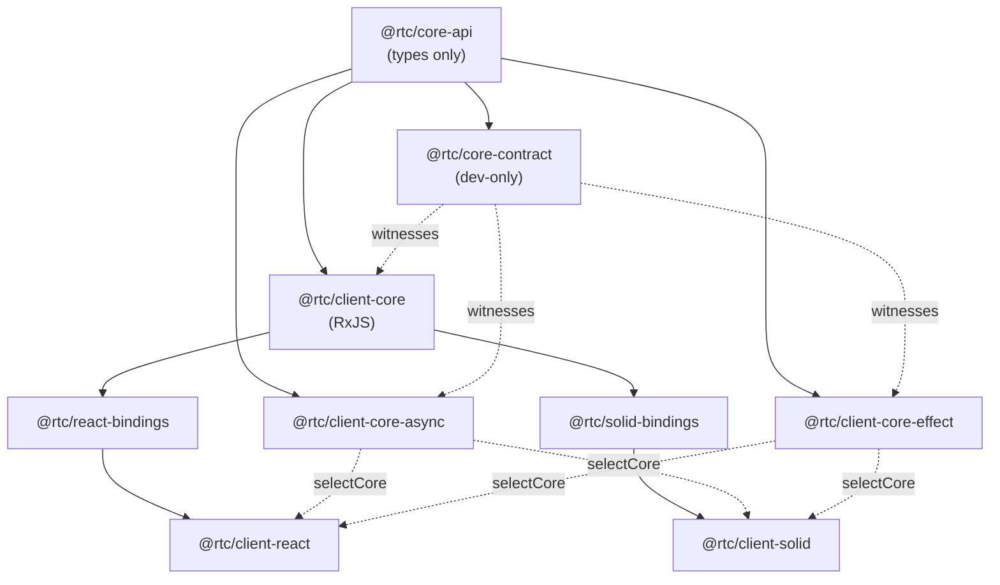

[◀ 21. One Test Suite, Two Frameworks — Cross-Framework Testing](21-cross-framework-testing.md) · [Architecture Document](../architecture.md)

## 22. Pluggable Application Core

[§21](21-cross-framework-testing.md) proved the *UI* layer replaceable: two
web clients share one framework-free `@rtc/client-core` and pass the same
behavioural specs. This chapter is the same experiment run one ring inward —
the **application layer** (presenters, machines, the composition root) is
now pluggable too, with two alternative implementations proven equivalent to
the original RxJS core by a dedicated contract tier.

[ADR-006](../adr/ADR-006-pluggable-application-core.md) records the decisions
behind this design; this chapter documents what shipped.

## Packages



`@rtc/core-api` is types-only (grep gate 42 enforces no runtime export) and
sits inside `domain`/`shared`, alongside the innermost packages. It holds the
`Stream<T>` / `StateStream<S>` aliases, one interface per presenter, every
machine's state/intents/view types, `Machine<S,I>` / `MachineFactories` /
`Presenters` / `AppCommands` / `AppPorts` / `App`, and `CoreFactory` — the
whole plug a client needs to name a core without naming an implementation.

`@rtc/client-core` is unchanged in name, adapters, and behaviour; it now
`implements` `@rtc/core-api`'s presenter interfaces and re-exports every type
it used to own outright, so no existing import in either binding or client
changed. `@rtc/client-core-async` and `@rtc/client-core-effect` are new
sibling packages implementing the same `CoreFactory` contract on
`async`/`await` + `AsyncIterable` and Effect-TS respectively. `@rtc/core-contract`
is dev-only — a devDependency of all three cores, never imported from any
`src` — and is the behavioural witness that all three agree.

The bindings (`react-bindings`, `solid-bindings`) are unaffected by which
core is active: they consume `Presenters` / `MachineFactories` /
`AppCommands` by shape, from `@rtc/core-api`, not by importing `@rtc/client-core`'s
concrete classes directly.

## Selection: build-time, not runtime

Each web client's `src/app/selectCore.ts` picks one `CoreFactory` at module
init, from an environment variable read exactly once:

```
VITE_CORE_IMPL (rxjs | async | effect, default rxjs)
        │
        ▼
resolveCoreImpl(raw)        — fail-closed: an unrecognised value throws at boot
        │
        ▼
activeCore: CoreFactory     — a static comparison against
                               import.meta.env.VITE_CORE_IMPL, literal
        │
        ▼
AppRoot                     — createApp(ports) / createMachineFactories(presenters)
```

The comparison in `activeCore` is written directly against
`import.meta.env.VITE_CORE_IMPL`, never against a local variable holding that
value first. Vite's own `import.meta.env` replacement leaves the value as
whatever string the process ran with, which rolldown cannot fold a branch on;
each client's `vite.config.ts` additionally re-inlines the same expression
via a `define` entry (`JSON.stringify(process.env.VITE_CORE_IMPL || "rxjs")`),
so rolldown sees a compile-time literal at the comparison site and drops the
two dead branches — along with the unselected core packages, which declare
`sideEffects: false`. A version that read the env var into a local first and
branched on that local did **not** fold when this was built; `pnpm
check:core-bundle` (below) is the guard that would have caught it.

`turbo.json` declares `VITE_CORE_IMPL` on the `dev` and `build` tasks' `env`
lists (turbo's strict env mode silently strips undeclared vars) and
`RTC_CORE_IMPL` on `globalPassThroughEnv` for the e2e harness. Production
never sets `VITE_CORE_IMPL`, so it always resolves to `rxjs`; `deploy.yml`'s
"Guard — production ships the RxJS core only" step greps the built static
output for `effect/Fiber` and fails the deploy if it is present.

## Three timing guarantees

A core satisfying `@rtc/core-api`'s types is not the same as a core
satisfying its behaviour. Three guarantees are producer behaviours — not
properties `Observable` gives away for free — and every alternative core has
to reproduce them explicitly:

1. **Synchronous first value.** `PreferencesPort` streams and every machine's
   `state$` emit on subscribe, synchronously — `toSignal` throws otherwise,
   and `readPreferenceNow` / `ThemePreferencePresenter.cycle()` both read
   synchronously. The async core's `Store` is replay-current by
   construction; the Effect core's `refToStateStream` re-reads the
   `SubscriptionRef` per subscription rather than caching a value from
   construction time (a value cached once would go stale across a
   cold → warm cycle).
2. **Multicast with teardown on last unsubscribe.**
   `shareReplay({ bufferSize: 1, refCount: true })`'s contract, written out
   explicitly rather than implied by an operator: the async core's `Topic<T>`
   starts its producer on the first subscriber and aborts it on the last;
   the Effect core would get the same shape natively from
   `Stream.share({ capacity: "unbounded", replay: 1 })` — no such call ships
   yet, since every member still delegates to the RxJS core.
3. **Memoised per-key identity.** `price$(EURUSD) === price$(EURUSD)` — a
   contract test asserts it directly, since a core that rebuilt a new stream
   per call would still type-check.

## The contract tier

`@rtc/core-contract` mirrors `@rtc/ui-contract`'s shape at a different
boundary. `CONTRACT_SUITES` is an exhaustive `Record<ContractMember, Suite |
null>` — one entry per `Presenters` member, per `MachineFactories` member,
and `commands.reconnect` (69 members at slice 0: 57 presenters, 11 machines,
1 command). Adding a member to `Presenters` or `MachineFactories` without
listing it here is a compile error, so the registry can never silently fall
behind the types it is supposed to cover.

A member's entry is either a `Suite` function (`describeXContract`) or
`null` while its suite is still pending — and every `null` entry must also
appear in the hand-maintained `PENDING_SUITES` array, which
`registry.test.ts` checks by drift: the two lists disagree and the test
fails. At slice 0, six members have real suites (`connection`,
`themePreference`, `themeSkinPreference`, `viewModePreference`, `powerSaver`,
`commands.reconnect` — slice 1a's scope) and 63 are pending. Each suite
subscribes to the member's `Stream`/`StateStream`, drives a scripted
`AppPorts` harness (`scriptPorts` — Subject-backed streams, an
intent-named `driver`), advances vitest's fake timers, and asserts only at
the envelope level described above.

One runner file per core imports every suite against that core's own
`makeHarness`: `packages/client-core/src/composition.coreContract.test.ts`
for RxJS, `src/coreContract.test.ts` in each alternative core. **Ordering
rule for the whole workstream:** a member's suite must exist and be green on
the RxJS core before either alternative core ports that member natively —
the contract is proven against the reference implementation first, so a
later native port is judged against a fixed target rather than a moving one.

## The parity manifest

Each alternative core ships a committed `parity.json` —
`{ presenters: { member: "native" | "delegated" }, machines: { … } }` — and a
`parity.test.ts` that asserts the manifest matches reality by **reference
inequality** against the RxJS core's own instances: a `"delegated"` member
must literally *be* the RxJS instance (same object), and a `"native"` member
must not be. At slice 0 both alternative cores list every member
`"delegated"` — nothing has been ported yet, and the manifest says so
explicitly rather than leaving it implied. `pnpm core:parity` prints both
manifests as one table, for a PR description or `docs/STATUS.md`.

The contract tier proves *behaviour*: a delegated member's suite passes
trivially, because the object it drives is the RxJS instance. The parity
manifest proves *provenance*: which members that trivial pass is actually
telling you something about. Neither substitutes for the other — a
contract-only report can't distinguish "still delegated" from "ported and
correct," and a manifest-only report has no behavioural teeth at all.

## Bundle isolation

`pnpm check:core-bundle` builds each web client once per core value and
asserts the `rxjs` build contains no marker of either alternative core
(`effect/Fiber`, `@rtc/client-core-async`'s brand), printing gzipped sizes
per core for visibility. It is the same class of guarantee as the deploy
workflow's grep guard, run locally and per-core rather than once against the
production build only.

## See also

- [ADR-006 — Pluggable application core](../adr/ADR-006-pluggable-application-core.md)
- [Pluggable application core design spec](../superpowers/specs/2026-09-11-pluggable-application-core-design.md)
- [§8 Replaceability Matrix](08-replaceability-matrix.md)
- [§10.1 RxJS `Observable<T>` as the boundary stream type](10-key-design-decisions.md#101-rxjs-observablet-as-the-boundary-stream-type)
- [§21 One Test Suite, Two Frameworks](21-cross-framework-testing.md)
