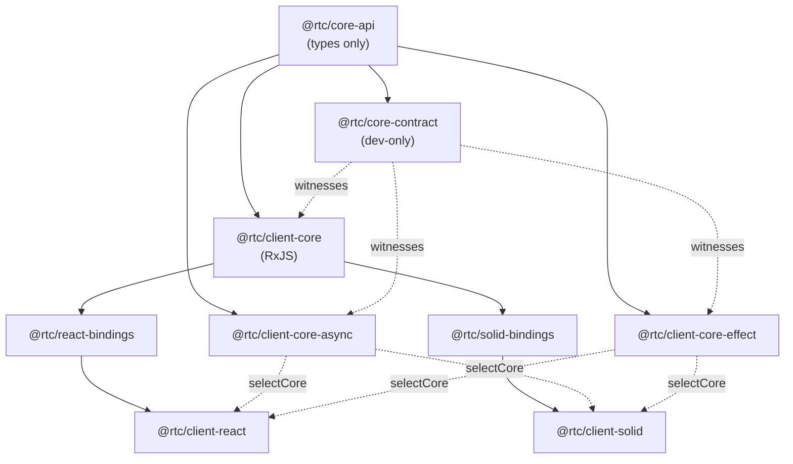

[◀ 21. One Test Suite, Two Frameworks — Cross-Framework Testing](21-cross-framework-testing.md) · [Architecture Document](../architecture.md)

## 22. Pluggable Application Core

[§21](21-cross-framework-testing.md) proved the *UI* layer replaceable: two
web clients share one framework-free `@rtc/client-core` and pass the same
behavioural specs. This chapter is the same experiment run one ring inward —
the **application layer** (presenters, machines, the composition root) is
now pluggable too, with two alternative implementations proven equivalent to
the original RxJS core by a dedicated contract tier.

[ADR-006](../adr/ADR-006-pluggable-application-core.md) records the decisions
behind this design; this chapter documents what shipped.

## Packages



`@rtc/core-api` is types-only (grep gate 42 enforces no runtime export) and
sits inside `domain`/`shared`, alongside the innermost packages. It holds the
`Stream<T>` / `StateStream<S>` aliases, one interface per presenter, every
machine's state/intents/view types, `Machine<S,I>` / `MachineFactories` /
`Presenters` / `AppCommands` / `AppPorts` / `App`, and `CoreFactory` — the
whole plug a client needs to name a core without naming an implementation.

`@rtc/client-core` is unchanged in name, adapters, and behaviour; it now
`implements` `@rtc/core-api`'s presenter interfaces and re-exports every type
it used to own outright, so no existing import in either binding or client
changed. `@rtc/client-core-async` and `@rtc/client-core-effect` are new
sibling packages implementing the same `CoreFactory` contract on
`async`/`await` + `AsyncIterable` and Effect-TS respectively. `@rtc/core-contract`
is dev-only — a devDependency of all three cores, never imported from any
`src` — and is the behavioural witness that all three agree.

The bindings (`react-bindings`, `solid-bindings`) are unaffected by which
core is active: they consume `Presenters` / `MachineFactories` /
`AppCommands` by shape, from `@rtc/core-api`, not by importing `@rtc/client-core`'s
concrete classes directly.

## Selection: build-time, not runtime

Each web client's `src/app/selectCore.ts` picks one `CoreFactory` at module
init, from an environment variable read exactly once:

```
VITE_CORE_IMPL (rxjs | async | effect, default rxjs)
        │
        ▼
resolveCoreImpl(raw)        — fail-closed: an unrecognised value throws at boot
        │
        ▼
activeCore: CoreFactory     — a static comparison against
                               import.meta.env.VITE_CORE_IMPL, literal
        │
        ▼
AppRoot                     — createApp(ports) / createMachineFactories(presenters)
```

The comparison in `activeCore` is written directly against
`import.meta.env.VITE_CORE_IMPL`, never against a local variable holding that
value first. Vite's own `import.meta.env` replacement leaves the value as
whatever string the process ran with, which rolldown cannot fold a branch on;
each client's `vite.config.ts` additionally re-inlines the same expression
via a `define` entry (`JSON.stringify(process.env.VITE_CORE_IMPL || "rxjs")`),
so rolldown sees a compile-time literal at the comparison site and drops the
two dead branches — along with the unselected core packages, which declare
`sideEffects: false`. A version that read the env var into a local first and
branched on that local did **not** fold when this was built; `pnpm
check:core-bundle` (below) is the guard that would have caught it.

`turbo.json` declares `VITE_CORE_IMPL` on the `dev` and `build` tasks' `env`
lists (turbo's strict env mode silently strips undeclared vars) and
`RTC_CORE_IMPL` on `globalPassThroughEnv` for the e2e harness. Production
never sets `VITE_CORE_IMPL`, so it always resolves to `rxjs`; `deploy.yml`'s
"Guard — production ships the RxJS core only" step greps the built static
output for `effect/Fiber` and fails the deploy if it is present.

## Three timing guarantees

A core satisfying `@rtc/core-api`'s types is not the same as a core
satisfying its behaviour. Three guarantees are producer behaviours — not
properties `Observable` gives away for free — and every alternative core has
to reproduce them explicitly:

1. **Synchronous first value.** `PreferencesPort` streams and every machine's
   `state$` emit on subscribe, synchronously — `toSignal` throws otherwise,
   and `readPreferenceNow` / `ThemePreferencePresenter.cycle()` both read
   synchronously. The async core's `Store` is replay-current by
   construction; the Effect core's `refToStateStream` re-reads the
   `SubscriptionRef` per subscription rather than caching a value from
   construction time (a value cached once would go stale across a
   cold → warm cycle); a `sharedFold` whose port has not emitted yet starts
   a SEEDLESS period and delivers nothing until the first value, as
   `shareReplay` does.
2. **Multicast with teardown on last unsubscribe.**
   `shareReplay({ bufferSize: 1, refCount: true })`'s contract, written out
   explicitly rather than implied by an operator: the async core's `Topic<T>`
   starts its producer on the first subscriber and aborts it on the last;
   the Effect core's `sharedFold` restates it over a `SubscriptionRef` and a
   per-warm-period `Scope` — `Stream.share({ replay: 1 })` could not be the
   envelope, because it replays to a new subscriber on a fiber, never in the
   caller's tick (slice 1a, measured on 3.22.2).
3. **Memoised per-key identity.** `price$(EURUSD) === price$(EURUSD)` — a
   contract test asserts it directly, since a core that rebuilt a new stream
   per call would still type-check.
4. **Only the first value is synchronous.** The contract asserts a
   subscription's first value in the caller's tick and every later value
   after `settle()` (two macrotask turns): an Effect fiber delivers past the
   seed on the scheduler, so a suite asserting later values synchronously
   would be pinning RxJS's delivery tick rather than the behaviour. One
   related, uncontracted difference: a `SubscriptionRef` fold conflates
   `Object.is`-equal consecutive states (the guard that keeps the seed from
   being delivered twice), where the RxJS core's `scan`/`map` re-emit them
   and the async core's `Topic` reproduces that re-emission. Measured on
   3.22.2: under `Stream.runForEach` + `runFork`, a port's first value
   reaches a `Stream.asyncPush` consumer one microtask after `runFork` — and
   so does the SUBSCRIPTION itself, unless the port is subscribed eagerly at
   call time, which is what `fromObservable`
   (`packages/client-core-effect/src/bridge/in.ts`) now does; a stream built
   over it must therefore be called inside a `sharedFold`'s `run`, never at
   presenter construction.

## Failure, teardown and port discipline

Four more producer behaviours the contract fixes or the cores agree on
explicitly (residual sweep, 2026-09-19):

1. **Error resets.** A source error reaches every subscriber and drops them;
   the next subscriber re-subscribes the source — `shareReplay({ refCount:
   true })`'s `resetOnError`, the async `Topic`'s reset, the Effect
   `sharedFold`'s fresh warm period. No core latches an error. (An external
   `publish()` while no producer run is live — cold, or just after a reset —
   is dropped, never latched.)
2. **A throwing subscriber is isolated.** The other subscribers still receive
   the value; the thrown error is rethrown on a macrotask (rxjs's
   `SafeSubscriber`, the async `reportAsync`, an Effect fiber's own defect
   path). That isolation covers a CONSUMER's `next`: an operator built on a
   primitive (`mapTopic`, an Effect `Stream` combinator) turns its own
   projection error into a stream failure instead, as rxjs operators do.
3. **After `dispose()`, a still-attached subscriber hears nothing.** The RxJS
   core's `dispose()` is a knowing no-op today (its follow-up is a
   `Subscription` bag), so an interrupt-only Effect cause is deliberately
   silent too; completion-on-dispose becomes the contract when that bag
   lands.
4. **Every port method is called once, at construction** — including
   `colorScheme.prefersDark$`, which the `portDiscipline` suite also counts.
   A stream re-subscribes the captured Observable on every warm period; a
   synchronous read (`cycle()`, `current()`) reads through a fresh
   subscription of it and throws the port's synchronous error at the read
   site. The `portDiscipline` contract suite counts the calls through a
   Proxy in every runner — the contract witnesses that the count after
   construction never changes (a strangler core constructs the base
   presenter too, so its absolute count is 2 until slice 8 removes
   delegation).

## Warm singletons, conflation and machines

Slice 2 added the three shapes the FX members need, each stated once per
core; slice 3 added the credit shapes to the same list:

- **Warm singletons** (`currencyPairs.pairs$`, `blotter.trades$`,
  `blotter.activity$`, `analytics.position$`): the RxJS `warmReplay()`
  (`shareReplay({ refCount: false })`) keeps the port subscribed for the
  session. The async core's `Topic` takes `retainUntil: AbortSignal` — the
  app mints it in `composeWithBase` and aborts it in `dispose()` before the
  base app is disposed; the Effect core's `SharedFold` takes `retain: true`
  — the last unsubscribe does not end the period, the host scope does.
  Subscribers attached when the app is disposed hear nothing more.
- **Conflation** (`priceStream`, `priceHistory` under `powerSaver.isCalm$`):
  a leading+trailing throttle gated by a flag with immediate effect. The
  async core writes it as one Topic producer with a window
  `AbortController` (`createConflatedTopic`); the Effect core as a
  `sharedFold` whose `run` holds a `Ref<ConflationState>` moved by atomic
  `Ref.modify` transitions and ONE window fiber per leading emission that
  loops in place (`conflatedFold`) — never a timer that forks its successor:
  a forked Effect child is interrupted when its parent fiber completes, so a
  window fiber that forked the next window and then ended would kill it at
  once. Neither runtime ships the operator. Uncontracted edge: a trailing value
  pending when the flag turns off is discarded, as the RxJS `switchMap`
  discards it.
- **Machines** (`staleFlag`, `analyticsStaleFlag`, `rowHighlight`, `notional`,
  `tileExecution`): `createMachineFactories(presenters)` has no app handle,
  so a machine owns its lifetime — a `Store` plus an `AbortController`
  (async), a `SubscriptionRef` under a detached host with its own `Scope`
  (Effect); `dispose()` aborts or closes it. The tile execution is the
  spec's sketch in both: one run per `execute()`, cancelled by the next
  `execute()`, by `dismiss()` and by `dispose()`; a `race` between the RPC
  and the timeout; a too-long marker that a terminal state ignores. A
  machine's source failure has no channel on a `Store`/`SubscriptionRef`
  and is rethrown out of band (`reportAsync` / `reportOutOfBand`); the
  RxJS `state()` would error `state$` — uncontracted, nothing observes it.
  When the execution timeout wins, the Effect machine releases the
  in-flight port call at once and the async machine holds it until
  dismiss/new execute/dispose, as the RxJS machine does — recorded in
  ADR-006.
- **The Effect Layer graph.** `priceStream` gating on `powerSaver.isCalm$`
  is the first native-on-native dependency, and the reason the Effect core
  now composes as services: `services.ts` (`AppPortsTag`, `HostTag`,
  `HostLive`, `presenterLayer`), `layers.ts` (one `GenericTag` + one `Live`
  layer per native presenter, `buildAppLayer(ports)`), and a
  `composeWithBase` that is `ManagedRuntime.make` + one `runSync`. The pure
  folds the FX members run are `@rtc/client-core` exports in all three cores
  (`blotterFolds`, `staleFlagFold`, `notionalView`, `tileExecutionState`);
  their timing constants live in `@rtc/domain`.
- **Commands, folds and countdowns** (slice 3, credit — `rfqs`, `dealers`,
  `instruments`, `rfqQuote`; machines `rfqTile`, `rfqSubmission`,
  `ticketSubmission`, `rfqCountdown`): no new kernel primitive in either
  sibling. Each calls `workflow.events()` ONCE and derives both `events$`
  and the reducer's state from that one Observable — the async core as
  `topicFromObservable` plus a retained state Topic folding
  `reduceRfqEvent` from `createEmptyRfqStreamState`, the Effect core as
  `mirrorPortAsIs` plus a retained `sharedFold` — where the RxJS core
  calls the port twice for one fact. The three credit singletons are
  retained (`retainUntil` / `retain: true`); `rfqs$`, `allQuotes$` and
  `quotesForRfq$(id)` are refCounted derivations over the warm state,
  suppressed by the shared `createShallowArrayMemo` so that an unchanged
  roster does not re-emit in ANY core. Every command — `createRfq`,
  `acceptQuote`, `cancelRfq`, `passQuote`, `quoteRfq`, `requestQuote` — is
  a one-shot per call, lazy and completing: `promiseToStream(signal =>
  once(port(...), signal))` (async), `Stream.fromEffect(Effect.suspend(()
  => rpc(port(...))))` (Effect, the `suspend` being what defers the port
  call to subscription). The two submission machines are built by the
  presenter from its own commands (`createSubmission()`,
  `createTicketSubmission()`), so `createMachineFactories(presenters)`
  still needs no app handle; a superseding `submit()`/`requestQuote()`
  cancels the run in flight — by `AbortController` (async), by
  `Fiber.interrupt` plus a run-token guard on every externally visible
  step (Effect), or by the RxJS `switchMap`. The
  countdown is derived from the tick index with the clock read once
  (`remaining = initial − tick × RFQ_COUNTDOWN_INTERVAL_MS`, clamped,
  inclusive 0, then the run ends), one looping fiber on the Effect side.
  `rfqCountdown` is the seam's first *new* member rather than a port: both
  bindings had imported `createRfqCountdownMachine` from
  `@rtc/client-core` directly, which no alternative core could intercept,
  so `MachineFactories` grew it and the member count went 72 → 73.
- **Keyed streams, lifecycle commands and singletons** (slice 4, equities —
  `watchlist`, `candleSeries`, `depth`, `ordersBlotter`, `positions`; the
  two composition singletons `eqWorkspace`/`eqDrawings`; machine
  `orderTicket`): the async core adds `createKeyedPortStreams<T>(open)`
  (memoised by key, `open(key)` called once per key at first request,
  refCounted release on last unsubscribe) under `watchlist.quote$` and
  `depth.depth$`, a new `portCallToStream` bridge export for
  `ordersBlotter.place()`'s per-call lifecycle stream, and holds
  `eqWorkspace`/`eqDrawings` warm through `storeToWarmStateStream`; all
  three re-express over the imported `reduceEqWorkspace` /
  `reduceEqDrawings` / `reduceOrderTicket` folds. `orderTicket` runs on the
  shared `createRunSlot` kernel; `orders$` instead supersedes its own
  query with a per-query `AbortController` inside the retained Topic's
  producer (`presenters/ordersBlotter.ts`). The Effect core adds
  `followPort(host, source)` — a seedless `sharedFold` over one
  `fromPort`, so `quote$`/`depth$` are NOT peeked at warm-period start the
  way `mirrorPort`'s other seeded uses are — plus a new `scopedPortStream`
  bridge export (`Stream.unwrapScoped`) for `place()`; `orders$` there
  supersedes its own query with `Stream.flatMap(…, { switch: true })`
  inside its retained fold (`presenters/ordersBlotter.ts`). It holds its
  two singletons warm through `refToWarmStateStream`, and grows the Layer
  graph by seven (`presenters/mirrorPort.ts`, `layers.ts`). Both siblings
  pass `createApp`'s `CoreSeams` argument so the base app's internal
  readers follow the native members instead of an unreachable RxJS-only
  instance of each (see "Core seams" below). A
  `Scope.addFinalizer` on each Effect singleton's child scope marks it
  disposed and releases its keep-warm, so `app.dispose()` and the
  machine's own `dispose()` converge — what the async twin's `lifetime`
  abort listener does.

**Strangler seam.** A base-side consumer of a member that goes native would
keep reading the base instance until its own slice — the RxJS
`AnimationDirector`, `NarratorMachine`, `JarvisDriverMachine` and the base
`eqWorkspace`'s seed all capture base streams at construction. `CoreSeams`
(next paragraph) redirects every one of those DATA reads; the base's own
preference presenters (the narrator's `preference$`, the driver's
`setThemeSkin`) still read the preferences port beside the native ones,
port-backed and idempotent, so nothing is stale and nothing ticks twice.
Slice 8 ends the seam.

**Core seams (slice 4, completed 2026-09-22).** `createApp(ports, seams = {})`
gives a sibling a way to redirect the base app's INTERNAL reads without
waiting for that consumer's own slice. `CoreSeams` is
`Partial<AnimationDirectorDeps>` — `pairs$`, `priceFor`,
`connectionStatus$`, `executions$`, `rfqEvents$`, `equityFills$` — plus
`eqWorkspace?` and `watchlist$?`; each internal reader takes
`seams.x ?? own`:

| reader (base app) | reads through the seam |
|---|---|
| `JarvisDriverMachine` | `eqWorkspace`, `knownSymbols$` ← `watchlist$` |
| base `eqWorkspace` seed | `watchlist$` (the composition-time peek and `seed$`) |
| `AnimationDirector` | all six of its sources |
| `NarratorMachine` | `pairs$`, `priceFor` |

Without it, under an alternative core: a Jarvis drive batch mutates a
workspace the UI no longer renders; a fill or FX execution made through a
NATIVE presenter never reaches the director (its `executions$` is a
Subject only the base `execute()` feeds); and every port those readers
share with a native member is held twice — for the simulator's pricing, a
doubled tick rate. (`workflow.events()` was the sharpest case: the base
`rfqs.events$` is `warmReplay()`, so one `intentsFor` consumer would have
held a second credit stream for the whole session.) What the seam deliberately does NOT do: the base app
still builds and exposes its own instance of every member (so the parity
drift test's reference-inequality assertion — a `"native"` member must not
literally be the RxJS instance — stays meaningful), and it never feeds a
base presenter's private Subject from a native call, which would make the
native member RxJS with extra steps. It redirects the READER. Witnesses:
`client-core/src/__tests__/composition.seams.test.ts` (each seam drives its
intent; with `pairs$`/`priceFor`/`watchlist$` supplied the base opens none
of those three ports) and each sibling's `composition.seams.test.ts` (an
FX execution through the native `execution` reaches the director; the
watchlist, the pairs and a pair's prices each carry ONE live subscription).
The instrument behind those counts is `@rtc/core-contract`'s
`countSubscriptions` / `countInto` / `createTally` (`harness/portTally.ts`):
a Proxy over a port that counts LIVE subscriptions to one method's streams
— live, not opened, because the Effect `mirrorPort` peeks a port before
following it; and only on a never-completing source, so a witness reshapes
`of(…)` to `concat(…, NEVER)`. Later slices' seam witnesses import it
rather than copying it.
Strangler-phase scaffolding, deleted along with delegation in slice 8.

**Teardown order.** An alternative core releases its own resources first —
the async lifetime signal, the Effect host scope — then disposes the base
app, then (Effect) the runtime. The Effect composition today runs base →
scope → runtime; both orders are safe while the RxJS `dispose()` is a
no-op, and slice 8 removes the base. A subscriber arriving after
`dispose()` is not a shipped path: the async retained topic would restart
its producer, the Effect fold stays silent, the RxJS core never tore down.

## The contract tier

`@rtc/core-contract` mirrors `@rtc/ui-contract`'s shape at a different
boundary. `CONTRACT_SUITES` is an exhaustive `Record<ContractMember, Suite |
null>` — one entry per `Presenters` member, per `MachineFactories` member,
and per `AppCommands` member (74 members: 60 presenters, 12 machines, 2
commands). Adding a member to `Presenters` or `MachineFactories` without
listing it here is a compile error, so the registry can never silently fall
behind the types it is supposed to cover.

A member's entry is either a `Suite` function (`describeXContract`) or
`null` while its suite is still pending — and every `null` entry must also
appear in the hand-maintained `PENDING_SUITES` array, which
`registry.test.ts` checks by drift: the two lists disagree and the test
fails. As of slice 6, fifty-eight members have real suites — slice 1a's
six, slice 1b's eleven, slice 2's eleven (`priceStream`, `priceHistory`,
`currencyPairs`, `blotter`, `analytics`, `execution`; `staleFlag`,
`analyticsStaleFlag`, `rowHighlight`, `notional`, `tileExecution`), slice
3's eight (`rfqs`, `dealers`, `instruments`, `rfqQuote`; `rfqTile`,
`rfqSubmission`, `ticketSubmission`, `rfqCountdown`) and slice 4's eight
(`watchlist`, `candleSeries`, `depth`, `ordersBlotter`, `positions`;
`eqWorkspace`, `eqDrawings`, `orderTicket`) and slice 5's nine (`throughput`,
`throughputMetric`, `latencyMetric`, `errorRateMetric`, `topology`,
`eventLog`, `sessions`, `sessionsKpi`; `incident`) and slice 6's five
(`auth`, `bootGate`, `workspaceNav`, `animationDirector`; `boot`) — and 16
are pending (37 at slice 3's merge, 38 once Dockview Phase 6b's
`layoutPresets` joined, 30 after slice 4, 21 after slice 5). Each
suite subscribes to the member's
`Stream`/`StateStream`, drives a scripted `AppPorts` harness (`scriptPorts`
— Subject-backed streams for the connection, the colour scheme, the FX,
credit and equities ports, an intent-named `driver` — `tickPrice`,
`resolveExecution`, `emitTrades`, `emitRfqEvent`, `resolveWorkflowCommand`,
`emitWatchlist`, `emitCandles`, `emitOrderUpdate`, …). `scriptPorts` also
takes an optional seed (`HarnessSeed { watchlist? }`, threaded through
`makeHarness({ watchlist })` in every runner) so a member that peeks a
port synchronously at composition — `eqWorkspace`'s
`peekFirstWatchlistSymbol` — finds a value pre-loaded into a
`ReplaySubject(1)` rather than only ever exercising its asynchronous
fallback. Every one-shot port method is backed by the same
`createPendingQueue<Req, Res>()` helper — a request is pending from
SUBSCRIBE until settled or unsubscribed, settled FIFO, a no-op when empty —
so a suite can witness laziness and cancellation as queue depth rather than
as an absence. A multi-value port call gets the streaming variant of the
same queue: `orders.place()`'s pending entry is settled by zero or more
`emitOrderUpdate` NEXTs before a terminal `completeOrder`/`failOrder`,
rather than the one-shot queue's single next-and-complete. A suite
advances vitest's fake timers where a member is timer-driven
(`withFakeClock`, built around one `it`; `settle()` otherwise), and
asserts only at the envelope level described above.

One runner file per core imports every suite against that core's own
`makeHarness`: `packages/client-core/src/composition.coreContract.test.ts`
for RxJS, `src/coreContract.test.ts` in each alternative core. **Ordering
rule for the whole workstream:** a member's suite must exist and be green on
the RxJS core before either alternative core ports that member natively —
the contract is proven against the reference implementation first, so a
later native port is judged against a fixed target rather than a moving one.

## The parity manifest

Each alternative core ships a committed `parity.json` —
`{ presenters: { member: "native" | "delegated" }, machines: { … } }` — and a
`parity.test.ts` that asserts the manifest matches reality by **reference
inequality** against the RxJS core's own instances: a `"delegated"` member
must literally *be* the RxJS instance (same object), and a `"native"` member
must not be. The manifest has three sections — `presenters`, `machines`,
`commands` — and the drift test walks all three. As of slice 5 both
alternative cores list fifty-eight members `"native"` (`connection`, all
fifteen preference presenters, `commands.reconnect`, the six FX
pricing/blotter presenters and the five FX machines, the four credit
presenters and the four RFQ machines — `rfqCountdown` having joined
`MachineFactories` in slice 3 — and slice 4's eight: the five equities
presenters (`watchlist`, `candleSeries`, `depth`, `ordersBlotter`,
`positions`), the two equities workspace singletons (`eqWorkspace`,
`eqDrawings`) and the machine `orderTicket`, slice 5's nine admin members,
and slice 6's five shell members) and everything else `"delegated"`. Slice 5 landed one core at a
time — async first, Effect the same day — so for a few hours the two
manifests disagreed, which the tooling reports and nothing forbids. The
manifest says so explicitly rather than leaving it
implied. `pnpm core:parity` prints both manifests as one table, for a PR
description or `docs/STATUS.md`.

The contract tier proves *behaviour*: a delegated member's suite passes
trivially, because the object it drives is the RxJS instance. The parity
manifest proves *provenance*: which members that trivial pass is actually
telling you something about. Neither substitutes for the other — a
contract-only report can't distinguish "still delegated" from "ported and
correct," and a manifest-only report has no behavioural teeth at all.

## Bundle isolation

`pnpm check:core-bundle` builds each web client once per core value and
asserts the `rxjs` build contains no marker of either alternative core
(`effect/Fiber`, `@rtc/client-core-async`'s brand), printing gzipped sizes
per core for visibility. It is the same class of guarantee as the deploy
workflow's grep guard, run locally and per-core rather than once against the
production build only.

## See also

- [ADR-006 — Pluggable application core](../adr/ADR-006-pluggable-application-core.md)
- [Pluggable application core design spec](../superpowers/specs/2026-09-11-pluggable-application-core-design.md)
- [§8 Replaceability Matrix](08-replaceability-matrix.md)
- [§10.1 RxJS `Observable<T>` as the boundary stream type](10-key-design-decisions.md#101-rxjs-observablet-as-the-boundary-stream-type)
- [§21 One Test Suite, Two Frameworks](21-cross-framework-testing.md)
