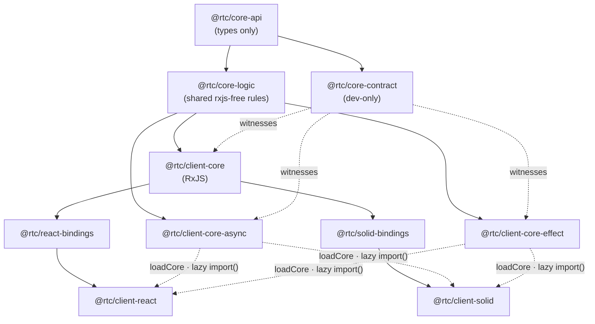

[◀ 21. One Test Suite, Two Frameworks — Cross-Framework Testing](21-cross-framework-testing.md) · [Architecture Document](../architecture.md)

## 22. Pluggable Application Core

[§21](21-cross-framework-testing.md) proved the *UI* layer replaceable: two
web clients share one framework-free `@rtc/client-core` and pass the same
behavioural specs. This chapter is the same experiment run one ring inward —
the **application layer** (presenters, machines, the composition root) is
now pluggable too, with two alternative implementations proven equivalent to
the original RxJS core by a dedicated contract tier.

[ADR-006](../adr/ADR-006-pluggable-application-core.md) records the decisions
behind this design; this chapter documents what shipped.

## Packages


```mermaid
flowchart TB
  CoreAPI["@rtc/core-api<br/>(types only)"]
  CoreLogic["@rtc/core-logic<br/>(shared rxjs-free rules)"]
  RxjsCore["@rtc/client-core<br/>(RxJS)"]
  AsyncCore["@rtc/client-core-async"]
  EffectCore["@rtc/client-core-effect"]
  CoreContract["@rtc/core-contract<br/>(dev-only)"]
  ReactBindings["@rtc/react-bindings"]
  SolidBindings["@rtc/solid-bindings"]
  ClientReact["@rtc/client-react"]
  ClientSolid["@rtc/client-solid"]

  CoreAPI --> CoreLogic
  CoreLogic --> RxjsCore
  CoreLogic --> AsyncCore
  CoreLogic --> EffectCore
  CoreAPI --> CoreContract
  CoreContract -. witnesses .-> RxjsCore
  CoreContract -. witnesses .-> AsyncCore
  CoreContract -. witnesses .-> EffectCore
  RxjsCore --> ReactBindings
  RxjsCore --> SolidBindings
  ReactBindings --> ClientReact
  SolidBindings --> ClientSolid
  AsyncCore -. "loadCore · lazy import()" .-> ClientReact
  EffectCore -. "loadCore · lazy import()" .-> ClientReact
  AsyncCore -. "loadCore · lazy import()" .-> ClientSolid
  EffectCore -. "loadCore · lazy import()" .-> ClientSolid
```

`@rtc/core-api` is types-only (grep gate 42 enforces no runtime export) and
sits inside `domain`/`shared`, alongside the innermost packages. It holds the
`Stream<T>` / `StateStream<S>` aliases, one interface per presenter, every
machine's state/intents/view types, `Machine<S,I>` / `MachineFactories` /
`Presenters` / `AppCommands` / `AppPorts` / `App`, and `CoreFactory` — the
whole plug a client needs to name a core without naming an implementation.

`@rtc/client-core` is unchanged in name, adapters, and behaviour; it now
`implements` `@rtc/core-api`'s presenter interfaces and re-exports every type
it used to own outright, so no existing import in either binding or client
changed. `@rtc/client-core-async` and `@rtc/client-core-effect` are new
sibling packages implementing the same `CoreFactory` contract on
`async`/`await` + `AsyncIterable` and Effect-TS respectively. `@rtc/core-contract`
is dev-only — a devDependency of all three cores, never imported from any
`src` — and is the behavioural witness that all three agree.

`@rtc/core-logic` (slice 8) holds the rules all three cores share and that
need no stream library: the pure folds (`blotterFolds`, `staleFlagFold`,
`incidentFold`, the admin and RFQ folds), the view derivations, the shared
workspace and Jarvis controllers (`createWorkspaceDock`,
`createJarvisController`, `applyDriveCommand`, …) and `createAuthDeps`. Its
runtime dependencies are `domain` and `shared` only, and it takes
`core-api` for types. Two dependency-cruiser rules keep it that way:
`core-logic-stays-pure` (no runtime `rxjs`/`@rx-state`) and
`core-logic-stays-inner` (an allowlist). `@rtc/client-core` re-exports it
whole, so no existing import changed. Each alternative core composes from
`core-logic`, `core-api`, `domain`, `shared` and its own members only;
`@rtc/client-core` is a devDependency there, for test adapters
(`createSimulatorPorts`), and `alt-cores-no-client-core-at-runtime` forbids
it from any non-test file.

The bindings (`react-bindings`, `solid-bindings`) are unaffected by which
core is active: they consume `Presenters` / `MachineFactories` /
`AppCommands` by shape, from `@rtc/core-api`, not by importing `@rtc/client-core`'s
concrete classes directly.

## Selection: at load time

**Since 2026-09-27** ([ADR-006 Decision 6](../adr/ADR-006-pluggable-application-core.md#decision-6-load-time-core-selection-supersedes-build-time-only-selection),
[design spec](../superpowers/specs/2026-09-27-runtime-core-switch-design.md)),
the core is chosen at load time, not baked into the build: one production
build ships all three cores — RxJS eager, async and Effect as lazy chunks —
and a visitor (or the deployed demo itself) can switch between them without a
rebuild. Each web client's `src/app/coreSelection.ts` (which replaced
`selectCore.ts`) resolves the choice through a pure precedence chain:

```
?core= URL parameter          — this LOAD only; never written to storage,
        │                        so a shared link doesn't change the
        │                        visitor's saved choice
        ▼ (absent, or unknown → ignored + console warning)
localStorage["rtc.coreImpl"]  — the stored choice, saved by the
        │                        Preferences row's select()
        ▼ (absent, or unknown → cleared + console warning)
VITE_CORE_IMPL                — the build DEFAULT (still the knob every
        │                        dev:*/e2e script sets), no longer what
        │                        gets bundled
        ▼ (unset → "rxjs"; an unknown value THROWS — a developer error,
        ▼          fail-closed, unchanged in substance from the old
        ▼          build-time selectCore)
resolveCoreChoice(...): CoreImpl
        │
        ▼
loadCore(impl): Promise<CoreFactory>   — rxjs resolves the already-imported
        │                                rxjsCore; async/effect resolve
        │                                through import("@rtc/client-core-async")
        │                                / import("@rtc/client-core-effect"),
        │                                which the bundler splits into their
        │                                own lazy chunks, fetched only once
        │                                chosen
        ▼
bootCore (src/app/bootApp.ts) → main.tsx renders <AppRoot core={core} …>
```

`bootCore` runs resolve-then-load before anything renders (the page shows
only the static `index.html` background until then — one small chunk
request on the async/Effect paths, zero on the default RxJS path). A
rejected chunk load — the only asynchronous failure in this sequence — never
falls back to RxJS silently: `renderBootError` shows a plain-DOM message plus
a "Load the default core" button that clears the stored choice and reloads
without `?core=`. `<html data-core-impl>` publishes whichever core actually
loaded, which is what the e2e booted-core assertions read.

The choice is not a core preference (a core's presenters don't exist yet
when it must be known), so it lives in this pre-boot `src/app` module, not
behind the ViewModel. `main.tsx` instead builds a `CoreSelection` value via
`createCoreSelection` (`{ current, options, select(impl) }`, `select` = save
+ reload with `?core=` stripped so a page opened as `?core=effect` doesn't
reload straight back onto Effect) and passes it to `AppRoot`, which forwards
it to the bindings' `createViewModel` as an app-shell value, exposed to the
UI as `useCoreSelection(): CoreSelection |
null` — `null` when the host offers no selection at all (React Native passes
none and stays RxJS-only). Both web clients render a Preferences →
"Application core" row from it, hidden entirely when the hook returns
`null`.

`turbo.json` declares `VITE_CORE_IMPL` on the `dev` and `build` tasks' `env`
lists (turbo's strict env mode silently strips undeclared vars) and
`RTC_CORE_IMPL` on `globalPassThroughEnv` for the e2e harness, which resolves
both once and forwards the answer as `RTC_CORE_IMPL` (`tests/scripts/lib/coreImpl.ts`)
so a run's build default and its own knob can't silently disagree. Production
sets neither, so the default visitor's choice still resolves to `rxjs` with
no extra fetch — but, unlike before 2026-09-27, the same deployed build lets
that visitor pick `async` or `effect` from `?core=` or Preferences.
`pnpm check:core-bundle` and `deploy.yml`'s "Guard — alternative cores ship
only as lazy chunks" step assert the eager/lazy split this depends on — see
[Bundle isolation](#bundle-isolation) below.

## Three timing guarantees

A core satisfying `@rtc/core-api`'s types is not the same as a core
satisfying its behaviour. Three guarantees are producer behaviours — not
properties `Observable` gives away for free — and every alternative core has
to reproduce them explicitly:

1. **Synchronous first value.** `PreferencesPort` streams and every machine's
   `state$` emit on subscribe, synchronously — `toSignal` throws otherwise,
   and `readPreferenceNow` / `ThemePreferencePresenter.cycle()` both read
   synchronously. The async core's `Store` is replay-current by
   construction; the Effect core's `refToStateStream` re-reads the
   `SubscriptionRef` per subscription rather than caching a value from
   construction time (a value cached once would go stale across a
   cold → warm cycle); a `sharedFold` whose port has not emitted yet starts
   a SEEDLESS period and delivers nothing until the first value, as
   `shareReplay` does.
2. **Multicast with teardown on last unsubscribe.**
   `shareReplay({ bufferSize: 1, refCount: true })`'s contract, written out
   explicitly rather than implied by an operator: the async core's `Topic<T>`
   starts its producer on the first subscriber and aborts it on the last;
   the Effect core's `sharedFold` restates it over a `SubscriptionRef` and a
   per-warm-period `Scope` — `Stream.share({ replay: 1 })` could not be the
   envelope, because it replays to a new subscriber on a fiber, never in the
   caller's tick (slice 1a, measured on 3.22.2).
3. **Memoised per-key identity.** `price$(EURUSD) === price$(EURUSD)` — a
   contract test asserts it directly, since a core that rebuilt a new stream
   per call would still type-check.
4. **Only the first value is synchronous.** The contract asserts a
   subscription's first value in the caller's tick and every later value
   after `settle()` (two macrotask turns): an Effect fiber delivers past the
   seed on the scheduler, so a suite asserting later values synchronously
   would be pinning RxJS's delivery tick rather than the behaviour. One
   related, uncontracted difference: a `SubscriptionRef` fold conflates
   `Object.is`-equal consecutive states (the guard that keeps the seed from
   being delivered twice), where the RxJS core's `scan`/`map` re-emit them
   and the async core's `Topic` reproduces that re-emission. Measured on
   3.22.2: under `Stream.runForEach` + `runFork`, a port's first value
   reaches a `Stream.asyncPush` consumer one microtask after `runFork` — and
   so does the SUBSCRIPTION itself, unless the port is subscribed eagerly at
   call time, which is what `fromObservable`
   (`packages/client-core-effect/src/bridge/in.ts`) now does; a stream built
   over it must therefore be called inside a `sharedFold`'s `run`, never at
   presenter construction.

## Failure, teardown and port discipline

Four more producer behaviours the contract fixes or the cores agree on
explicitly (residual sweep, 2026-09-19):

1. **Error resets.** A source error reaches every subscriber and drops them;
   the next subscriber re-subscribes the source — `shareReplay({ refCount:
   true })`'s `resetOnError`, the async `Topic`'s reset, the Effect
   `sharedFold`'s fresh warm period. No core latches an error. (An external
   `publish()` while no producer run is live — cold, or just after a reset —
   is dropped, never latched.)
2. **A throwing subscriber is isolated.** The other subscribers still receive
   the value; the thrown error is rethrown on a macrotask (rxjs's
   `SafeSubscriber`, the async `reportAsync`, an Effect fiber's own defect
   path). That isolation covers a CONSUMER's `next`: an operator built on a
   primitive (`mapTopic`, an Effect `Stream` combinator) turns its own
   projection error into a stream failure instead, as rxjs operators do.
3. **After `dispose()`, the app holds no port subscription once its
   consumers have let go.** That is the contract (the `dispose` suite, all
   three cores): after a session, including a Jarvis turn still in flight,
   and after the session's own consumers unsubscribe, `dispose()` leaves
   zero live port subscriptions. What a subscriber STILL attached at dispose
   hears is not contracted. In the RxJS core (ADR-006 Follow-up 6) only the
   `warmReplay` singletons and the machines `createApp` owns end — their
   subscribers complete; an interrupt-only Effect cause is deliberately
   silent. Every refcounted stream, per-key or singleton, keeps delivering
   to a subscriber still attached in the RxJS core — `price$`, `quote$`,
   `depth$`, but also `connection.status$`, the preference presenters,
   `execution.executions$`, `ordersBlotter.fills$`, `throughput.state$` and
   `auth.state$` (whose subject is never completed) — and that subscription
   stays the consumer's to release. Subscribing after `dispose()` to a
   refcounted presenter, or calling a machine factory, re-opens its ports:
   uncontracted, and no production code does it (no shell calls
   `app.dispose()`).
4. **Every port method is called once, at construction** — including
   `colorScheme.prefersDark$`, which the `portDiscipline` suite also counts.
   A stream re-subscribes the captured Observable on every warm period; a
   synchronous read (`cycle()`, `current()`) reads through a fresh
   subscription of it and throws the port's synchronous error at the read
   site. The `portDiscipline` contract suite counts the calls through a
   Proxy in every runner and pins the ABSOLUTE count — one call per member
   that reads the port (two for `sessions.sessions$`, which `sessions` and
   `sessionsKpi` each read) — then that it never changes. Slice 8 tightened
   it from constancy once no core built a second copy of any member; the
   absolute count caught the RxJS `RfqsPresenter` calling
   `workflow.events()` twice (now once, subscribed twice).

## Warm singletons, conflation and machines

Slice 2 added the three shapes the FX members need, each stated once per
core; slice 3 added the credit shapes to the same list:

- **Warm singletons** (`currencyPairs.pairs$`, `blotter.trades$`,
  `blotter.activity$`, `analytics.position$`): the RxJS `warmReplay()`
  (`shareReplay({ refCount: false })`) keeps the port subscribed for the
  session. The async core's `Topic` takes `retainUntil: AbortSignal` — the
  app mints it in `createApp` and aborts it in `dispose()`; the Effect
  core's `SharedFold` takes `retain: true`
  — the last unsubscribe does not end the period, the host scope does.
  Subscribers attached when the app is disposed hear nothing more.
- **Conflation** (`priceStream`, `priceHistory` under `powerSaver.isCalm$`):
  a leading+trailing throttle gated by a flag with immediate effect. The
  async core writes it as one Topic producer with a window
  `AbortController` (`createConflatedTopic`); the Effect core as a
  `sharedFold` whose `run` holds a `Ref<ConflationState>` moved by atomic
  `Ref.modify` transitions and ONE window fiber per leading emission that
  loops in place (`conflatedFold`) — never a timer that forks its successor:
  a forked Effect child is interrupted when its parent fiber completes, so a
  window fiber that forked the next window and then ended would kill it at
  once. Neither runtime ships the operator. Uncontracted edge: a trailing value
  pending when the flag turns off is discarded, as the RxJS `switchMap`
  discards it.
- **Machines** (`staleFlag`, `analyticsStaleFlag`, `rowHighlight`, `notional`,
  `tileExecution`): `createMachineFactories(presenters)` has no app handle,
  so a machine owns its lifetime — a `Store` plus an `AbortController`
  (async), a `SubscriptionRef` under a detached host with its own `Scope`
  (Effect); `dispose()` aborts or closes it. The tile execution is the
  spec's sketch in both: one run per `execute()`, cancelled by the next
  `execute()`, by `dismiss()` and by `dispose()`; a `race` between the RPC
  and the timeout; a too-long marker that a terminal state ignores. A
  machine's source failure has no channel on a `Store`/`SubscriptionRef`
  and is rethrown out of band (`reportAsync` / `reportOutOfBand`); the
  RxJS `state()` would error `state$` — uncontracted, nothing observes it.
  When the execution timeout wins, the Effect machine releases the
  in-flight port call at once and the async machine holds it until
  dismiss/new execute/dispose, as the RxJS machine does — recorded in
  ADR-006.
- **The Effect Layer graph.** `priceStream` gating on `powerSaver.isCalm$`
  is the first native-on-native dependency, and the reason the Effect core
  now composes as services: `services.ts` (`AppPortsTag`, `HostTag`,
  `HostLive`, `presenterLayer`), `layers.ts` (one `GenericTag` + one `Live`
  layer per native presenter, `buildAppLayer(ports)`), and a
  `composeApp` that is `ManagedRuntime.make` + one `runSync`. The pure
  folds the FX members run are `@rtc/core-logic` exports in all three cores
  (`blotterFolds`, `staleFlagFold`, `notionalView`, `tileExecutionState`);
  their timing constants live in `@rtc/domain`.
- **Commands, folds and countdowns** (slice 3, credit — `rfqs`, `dealers`,
  `instruments`, `rfqQuote`; machines `rfqTile`, `rfqSubmission`,
  `ticketSubmission`, `rfqCountdown`): no new kernel primitive in either
  sibling. Each calls `workflow.events()` ONCE and derives both `events$`
  and the reducer's state from that one Observable — the async core as
  `topicFromObservable` plus a retained state Topic folding
  `reduceRfqEvent` from `createEmptyRfqStreamState`, the Effect core as
  `mirrorPortAsIs` plus a retained `sharedFold` — where the RxJS core
  calls the port twice for one fact. The three credit singletons are
  retained (`retainUntil` / `retain: true`); `rfqs$`, `allQuotes$` and
  `quotesForRfq$(id)` are refCounted derivations over the warm state,
  suppressed by the shared `createShallowArrayMemo` so that an unchanged
  roster does not re-emit in ANY core. Every command — `createRfq`,
  `acceptQuote`, `cancelRfq`, `passQuote`, `quoteRfq`, `requestQuote` — is
  a one-shot per call, lazy and completing: `promiseToStream(signal =>
  once(port(...), signal))` (async), `Stream.fromEffect(Effect.suspend(()
  => rpc(port(...))))` (Effect, the `suspend` being what defers the port
  call to subscription). The two submission machines are built by the
  presenter from its own commands (`createSubmission()`,
  `createTicketSubmission()`), so `createMachineFactories(presenters)`
  still needs no app handle; a superseding `submit()`/`requestQuote()`
  cancels the run in flight — by `AbortController` (async), by
  `Fiber.interrupt` plus a run-token guard on every externally visible
  step (Effect), or by the RxJS `switchMap`. The
  countdown is derived from the tick index with the clock read once
  (`remaining = initial − tick × RFQ_COUNTDOWN_INTERVAL_MS`, clamped,
  inclusive 0, then the run ends), one looping fiber on the Effect side.
  `rfqCountdown` is the seam's first *new* member rather than a port: both
  bindings had imported `createRfqCountdownMachine` from
  `@rtc/client-core` directly, which no alternative core could intercept,
  so `MachineFactories` grew it and the member count went 72 → 73.
- **Keyed streams, lifecycle commands and singletons** (slice 4, equities —
  `watchlist`, `candleSeries`, `depth`, `ordersBlotter`, `positions`; the
  two composition singletons `eqWorkspace`/`eqDrawings`; machine
  `orderTicket`): the async core adds `createKeyedPortStreams<T>(open)`
  (memoised by key, `open(key)` called once per key at first request,
  refCounted release on last unsubscribe) under `watchlist.quote$` and
  `depth.depth$`, a new `portCallToStream` bridge export for
  `ordersBlotter.place()`'s per-call lifecycle stream, and holds
  `eqWorkspace`/`eqDrawings` warm through `storeToWarmStateStream`; all
  three re-express over the imported `reduceEqWorkspace` /
  `reduceEqDrawings` / `reduceOrderTicket` folds. `orderTicket` runs on the
  shared `createRunSlot` kernel; `orders$` instead supersedes its own
  query with a per-query `AbortController` inside the retained Topic's
  producer (`presenters/ordersBlotter.ts`). The Effect core adds
  `followPort(host, source)` — a seedless `sharedFold` over one
  `fromPort`, so `quote$`/`depth$` are NOT peeked at warm-period start the
  way `mirrorPort`'s other seeded uses are — plus a new `scopedPortStream`
  bridge export (`Stream.unwrapScoped`) for `place()`; `orders$` there
  supersedes its own query with `Stream.flatMap(…, { switch: true })`
  inside its retained fold (`presenters/ordersBlotter.ts`). It holds its
  two singletons warm through `refToWarmStateStream`, and grows the Layer
  graph by seven (`presenters/mirrorPort.ts`, `layers.ts`). A
  `Scope.addFinalizer` on each Effect singleton's child scope marks it
  disposed and releases its keep-warm, so `app.dispose()` and the
  machine's own `dispose()` converge — what the async twin's `lifetime`
  abort listener does.

**The strangler, and its end (slices 0–8).** Until slice 8 each
alternative core composed beside a stood-down RxJS base app: members were
ported one slice at a time, the rest delegated to the base, and a
`CoreSeams` argument to the RxJS `createApp` pointed the base's internal
readers (`AnimationDirector`, `NarratorMachine`, `JarvisDriverMachine`, the
workspace seed) at the native members so nothing was held twice. Slice 8
deleted all of it: `composeWithBase`, `CoreSeams`, the parity manifests and
their drift tests, and `pnpm core:parity`. What replaced it is structural:
each core's `App.presenters: Presenters` and `MachineFactories` are built
from its own members only (typecheck is the completeness witness — the
native presenter map is `Omit<Presenters, …family keys>`, not `Partial`),
and every core's `dispose()` is witnessed to release every port
subscription it holds — the cross-member `dispose` contract suite, which the
RxJS core joined when its `dispose()` stopped being a no-op (ADR-006
Follow-up 6). The instrument behind that witness, and behind the
seam witnesses before it, is `@rtc/core-contract`'s `countSubscriptions` /
`countInto` / `createTally` (`harness/portTally.ts`): a Proxy that counts
LIVE subscriptions to a port's streams.

**Two app-level ports (slice 8).** `AppPorts.connectionIntents`
(`reconnect()`, `injectIncident(event)`) carries the pushes into the
connection-event stream that originate inside the app — the Reconnect
button and the admin incident machine — so no core imports a module-level
Subject. `@rtc/core-api`'s `TransportPorts` omits `connectionEvents` AND
`connectionIntents` together (ADR-006 Follow-up 5), so a port factory can no
longer typecheck while supplying one without the other. `@rtc/client-core`'s
`pairConnectionPorts(events$)` is the only producer of the pair in that
package: it builds an instance-scoped reconnect/incident Subject pair per
call and hands the client back `connectionEvents` (the merge) alongside
`connectionIntents` (the port that feeds it) — two pairs from two calls
never leak into each other, unlike the module-level Subjects this replaced.
`ports.transport` is gated on each core's OWN `auth` (the `transportGate`
contract suite: open on the authenticated edge, close on the reverse, once
per edge, the first state included). Before slice 8 the alternative cores
never opened the socket on a native sign-in — the only gate was the base
app's, watching the base's `auth`.

**Teardown order.** The async core disposes its Jarvis presenter, then
aborts its lifetime signal; the Effect core closes its host scope, then
disposes the runtime (whose Layer scope is the host scope's parent, so
either step alone would end every fiber — both are kept). A subscriber arriving after
`dispose()` is not a shipped path: the async retained topic would restart
its producer, the Effect fold stays silent, and an RxJS `warmReplay`
singleton completes at once (its `disposed$` is a `ReplaySubject`, so a
late subscriber never re-opens the port). The RxJS core releases its own
`held` subscriptions first, then stops a Jarvis demo run, then disposes the
machines it owns (Jarvis's own `dispose` cuts a turn whose ask is still in
flight), then fires `disposed$`.

## The contract tier

`@rtc/core-contract` mirrors `@rtc/ui-contract`'s shape at a different
boundary. `CONTRACT_SUITES` is an exhaustive `Record<ContractMember, Suite |
null>` — one entry per `Presenters` member, per `MachineFactories` member,
and per `AppCommands` member (74 members: 60 presenters, 12 machines, 2
commands). Three cross-member suites sit beside the registry, witnessing
properties of the whole composition: `portDiscipline`, (slice 8)
`transportGate`, and `dispose` (ADR-006 Follow-up 6: after a signed-in
session, no port stream stays subscribed). Adding a member to `Presenters` or `MachineFactories` without
listing it here is a compile error, so the registry can never silently fall
behind the types it is supposed to cover.

A member's entry is either a `Suite` function (`describeXContract`) or
`null` while its suite is still pending — and every `null` entry must also
appear in the hand-maintained `PENDING_SUITES` array, which
`registry.test.ts` checks by drift: the two lists disagree and the test
fails. As of slice 7's wave 2, all seventy-four members have real suites — slice 1a's
six, slice 1b's eleven, slice 2's eleven (`priceStream`, `priceHistory`,
`currencyPairs`, `blotter`, `analytics`, `execution`; `staleFlag`,
`analyticsStaleFlag`, `rowHighlight`, `notional`, `tileExecution`), slice
3's eight (`rfqs`, `dealers`, `instruments`, `rfqQuote`; `rfqTile`,
`rfqSubmission`, `ticketSubmission`, `rfqCountdown`) and slice 4's eight
(`watchlist`, `candleSeries`, `depth`, `ordersBlotter`, `positions`;
`eqWorkspace`, `eqDrawings`, `orderTicket`) and slice 5's nine (`throughput`,
`throughputMetric`, `latencyMetric`, `errorRateMetric`, `topology`,
`eventLog`, `sessions`, `sessionsKpi`; `incident`) and slice 6's five
(`auth`, `bootGate`, `workspaceNav`, `animationDirector`; `boot`) and slice
7 wave 1's twelve (the workspace: `layoutFor`, `machines.layout`,
`dockLayoutStore`, `dockPanel`, `undockPanel`, `dismissPanel`,
`resetWorkspaceLayout`, `dockedPanelIdsFor`, `workspaceLayoutResets$`,
`layoutPresets`, `commands.reportDetachedPanels`, `jarvisPanels`) and wave
2's four (`jarvis`, `jarvisUsage`, `jarvisDriver`, `jarvisDemo`, the narrator
contracted through `jarvis`) — and none is pending (37 at slice 3's merge,
38 once Dockview Phase 6b's `layoutPresets` joined, 30 after slice 4, 21
after slice 5, 16 after slice 6, 4 after slice 7's wave 1). Each
suite subscribes to the member's
`Stream`/`StateStream`, drives a scripted `AppPorts` harness (`scriptPorts`
— Subject-backed streams for the connection, the colour scheme, the FX,
credit and equities ports, an intent-named `driver` — `tickPrice`,
`resolveExecution`, `emitTrades`, `emitRfqEvent`, `resolveWorkflowCommand`,
`emitWatchlist`, `emitCandles`, `emitOrderUpdate`, …). `scriptPorts` also
takes an optional seed (`HarnessSeed { watchlist? }`, threaded through
`makeHarness({ watchlist })` in every runner) so a member that peeks a
port synchronously at composition — `eqWorkspace`'s
`peekFirstWatchlistSymbol` — finds a value pre-loaded into a
`ReplaySubject(1)` rather than only ever exercising its asynchronous
fallback. Every one-shot port method is backed by the same
`createPendingQueue<Req, Res>()` helper — a request is pending from
SUBSCRIBE until settled or unsubscribed, settled FIFO, a no-op when empty —
so a suite can witness laziness and cancellation as queue depth rather than
as an absence. A multi-value port call gets the streaming variant of the
same queue: `orders.place()`'s pending entry is settled by zero or more
`emitOrderUpdate` NEXTs before a terminal `completeOrder`/`failOrder`,
rather than the one-shot queue's single next-and-complete. A suite
advances vitest's fake timers where a member is timer-driven
(`withFakeClock`, built around one `it`; `settle()` otherwise), and
asserts only at the envelope level described above.

One runner file per core imports every suite against that core's own
`makeHarness`: `packages/client-core/src/composition.coreContract.test.ts`
for RxJS, `src/coreContract.test.ts` in each alternative core. **Ordering
rule for the whole workstream:** a member's suite must exist and be green on
the RxJS core before either alternative core ports that member natively —
the contract is proven against the reference implementation first, so a
later native port is judged against a fixed target rather than a moving one.

## Bundle isolation

**Since the load-time switch (2026-09-27), `pnpm check:core-bundle` builds
each web client ONCE** (`VITE_CORE_IMPL` unset — the build default choice,
not what gets bundled) and asserts the one build is runtime-switchable
between all three cores (`tests/scripts/lib/coreBundle.ts`'s `classify`):

1. the **eager set** — both pages' (`index.html`, `popout.html`) entry
   `<script type="module">` plus every `<link rel="modulepreload">` hint,
   closed over each file's own static ES imports (a dynamic `import()` is
   deliberately excluded — deferring the fetch is what makes a chunk lazy) —
   carries `RXJS_CORE_BRAND` (stamped by the RxJS `createApp` on every
   `App`) and neither `@rtc/client-core-async`'s nor
   `@rtc/client-core-effect`'s brand;
2. exactly one non-eager (lazy) chunk carries the async brand, exactly one
   the Effect brand;
3. no single file carries two different cores' brands (a core reaching for
   another's composition root instead of its own);
4. no eager file carries `effect/Fiber` — the Effect *library's* own
   distinctive marker, checked independently of whichever chunk happens to
   carry its brand, so the composition root staying lazy can't hide the
   runtime itself leaking into a shared eager chunk.

Gzip sizes per core chunk are still printed for visibility. `--dir <dir>`
skips the build and checks an existing output directory directly —
`deploy.yml`'s "Guard — alternative cores ship only as lazy chunks" step
uses it over `.vercel/output/static`, which that job already scoped to the
one client it built. What the RxJS marker's presence in the eager set proves
is that the RxJS composition root is there; `@rtc/client-core` itself is not
`sideEffects: false` and still ships its port factories and adapters in
every build (the clients take `createSimulatorPorts` and `WsAdapter` from
it), so a stray UI import of one presenter class would not trip it.

## See also

- [ADR-006 — Pluggable application core](../adr/ADR-006-pluggable-application-core.md)
- [Pluggable application core design spec](../superpowers/specs/2026-09-11-pluggable-application-core-design.md)
- [Load-time core selection design spec](../superpowers/specs/2026-09-27-runtime-core-switch-design.md)
- [§8 Replaceability Matrix](08-replaceability-matrix.md)
- [§10.1 RxJS `Observable<T>` as the boundary stream type](10-key-design-decisions.md#101-rxjs-observablet-as-the-boundary-stream-type)
- [§21 One Test Suite, Two Frameworks](21-cross-framework-testing.md)
