[◀ 22. Pluggable Application Core](22-pluggable-application-core.md) · [Architecture Document](../architecture.md)

## 23. Application Cores, Explained

This chapter is the **guided tour** of the pluggable application core: what
the three cores are, where their boundaries sit, what gets translated at each
boundary, and where the design is heading. It is written to be read top to
bottom by someone who has never opened these packages.

Two sibling documents go deeper, and this chapter links to them instead of
repeating them:

| You want… | Read |
|---|---|
| The picture, the vocabulary, a worked example | **this chapter** |
| The exact behaviour every core must reproduce, edge cases included | [§22 Pluggable Application Core](22-pluggable-application-core.md) |
| Why each decision was taken, and what was rejected | [ADR-006](../adr/ADR-006-pluggable-application-core.md) |

## Why three cores? Read this first

> **A fair objection.** No production application needs three
> interchangeable application cores. Each extra core is a second
> implementation of 75 members to keep correct, and the machinery that keeps
> them honest — a types-only contract, a translation layer at each boundary,
> a behavioural contract tier with construction-time counts, a bundle-isolation
> gate — is indirection a product would never choose to carry. That objection
> is correct.

Two answers, and both matter.

**1. This is a conceptual, experimental project.** The repository exists to
find out what clean architecture makes possible when it is followed all the
way down — first the UI ring ([§21](21-cross-framework-testing.md): two web
frameworks over one core), then the application ring (this chapter: three
cores under one UI). The three cores are the *instrument*, not the product.
What was learned from building them is the deliverable, and the cost of
keeping three alive is accepted here because comparing them side by side is
the point of the experiment.

**2. The real-world shape of this is a migration.** Products do have to move
their reactive substrate — RxJS to Effect inside the core, a home-grown
event bus to either, or the boundary envelope itself moving from RxJS to the
web-standard `Observable` — and that move is slow,
risky and hard to reverse when nothing was prepared for it. The techniques in
this chapter are the ones a real migration needs, and each is proven here by
code rather than argued:

| A migration needs to… | What this repository shows |
|---|---|
| Change the substrate without touching the UI | `@rtc/core-api`: a types-only edge. The bindings import the contract as types only (straight from `@rtc/core-api`) and name no alternative core; the switch happens in each client's composition root (`src/app/coreSelection.ts`), which the bindings never see. |
| Know the new implementation behaves the same | `@rtc/core-contract`: one suite per member, absolute construction-time counts, the `transportGate` and `portDiscipline` cross-checks. |
| Migrate only the stream layer, not the business rules | `@rtc/core-logic`: the pure folds and controllers moved out once and every core reuses them; only the *plumbing* is rewritten per core. |
| Let old and new coexist during the cutover | `bridge/`: the one place the old library may be imported as a value; everywhere else it is types only, so the old library cannot spread beyond it at runtime (dependency-cruiser `bridge-owns-rxjs` and grep gate 43; see [What keeps it honest](#what-keeps-it-honest)). |
| Canary and roll back | Load-time selection (`?core=`, Preferences): one build ships every core, the choice is made per browser at load, and moving back is a reload. A production canary would feed the same switch from a feature flag. |
| Finish, and stop paying for the seam | See below. |

**How this ends in a real project.** The edge abstractions and the
implementation are allowed to differ *temporarily*, to ease the move. Once one
core has won, the losing cores are deleted — and then the indirection is
deleted too, because removing it is the whole point of finishing. (This
repository keeps all three cores on purpose — it is the instrument, see answer
1 — so what follows is the ending a product would reach, not a plan for this
repo.) The intended ending is the complete one: the winner's stream type is adopted at the edges as
well — the bindings, and the `@rtc/domain` ports and simulators, which are RxJS
today
([§10.1](10-key-design-decisions.md#101-rxjs-observablet-as-the-boundary-stream-type))
— so `bridge/` is deleted because nothing is left to translate, `Stream<T>` and
`StateStream<S>` are replaced by the winner's own types, and the rule that
`rxjs` is the domain's one runtime dependency becomes the same rule naming the
winner (or, if the winner is the platform's own `Observable`, no runtime
dependency at all). The edges are the larger half of the move — every port,
simulator and both bindings change together, which is why
[§8](08-replaceability-matrix.md#8-replaceability-matrix) rates the boundary
swap "very high" — so a migration may land the core first and the edges later; while it waits,
`bridge/` stays as the one gated adapter between an RxJS edge and a non-RxJS
core. That is a deliberate intermediate state, not a destination. Either way
the contract suite stays behind as the behavioural specification of the one
core that remains. The techniques transfer; the permanent three-way split, and
the seam, do not.

Read the rest of the chapter with that in mind: everything below describes
the instrument, and the table above says which parts of it a real migration
keeps.

## The idea in one picture

The **application core** is the layer between the screen and the outside
world. It turns raw data (price ticks, trade results, connection events) into
state the UI can paint, and turns user intent (click "Buy") into calls to the
outside world.

This repository has **three** application cores. They do the same job, and
they are written in three different programming styles. The UI cannot tell
which one is running.

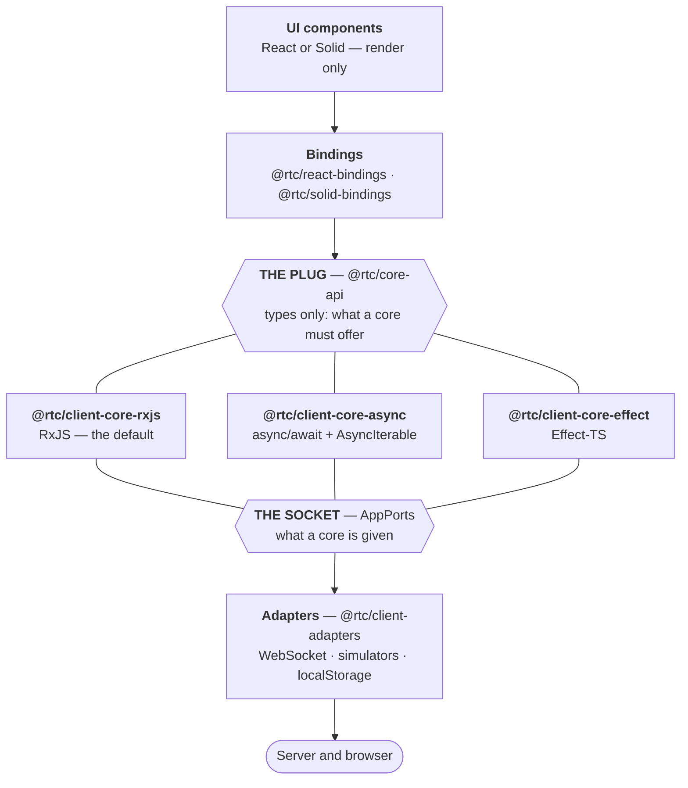
```mermaid
flowchart TD
  ui["<b>UI components</b><br/>React or Solid — render only"]
  bind["<b>Bindings</b><br/>@rtc/react-bindings · @rtc/solid-bindings"]
  plug{{"<b>THE PLUG</b> — @rtc/core-api<br/>types only: what a core must offer"}}
  rx["<b>@rtc/client-core-rxjs</b><br/>RxJS — the default"]
  as["<b>@rtc/client-core-async</b><br/>async/await + AsyncIterable"]
  ef["<b>@rtc/client-core-effect</b><br/>Effect-TS"]
  socket{{"<b>THE SOCKET</b> — AppPorts<br/>what a core is given"}}
  adapters["<b>Adapters</b> — @rtc/client-adapters<br/>WebSocket · simulators · localStorage"]
  world(["Server and browser"])

  ui --> bind
  bind --> plug
  plug --- rx
  plug --- as
  plug --- ef
  rx --- socket
  as --- socket
  ef --- socket
  socket --> adapters
  adapters --> world
```

Read it as a wall socket and three appliances. The socket (`AppPorts`) and
the plug (`@rtc/core-api`) are fixed shapes. Any appliance that fits both
works, whatever is inside it.

## Words used in this chapter

| Word | Plain meaning | Example |
|---|---|---|
| **Port** | An interface to the outside world, declared in `@rtc/domain`. The core calls it; an adapter implements it. | `PricingPort.getPriceUpdates(symbol)` |
| **Adapter** | The code behind a port. | `WsAdapter`, the price simulator |
| **Presenter** | A long-lived object that offers streams (and sometimes commands) to the UI. | `priceStream.price$(pair)` |
| **Machine** | A small state machine: current state, intent methods, `dispose()`. | `tileExecution`, `staleFlag` |
| **Command** | An app-level action with no state of its own. | `commands.reconnect()` |
| **Member** | One entry of the plug: a presenter, a machine factory or a command. There are 75. | — |
| **Stream** | Many values over time. | price ticks |
| **State stream** | A stream that always has a current value, readable at once. | a machine's `state$` |
| **Envelope** | The type a stream is wrapped in when it crosses a boundary. Today: RxJS `Observable`. | `Stream<Price>` |
| **Bridge** | The one folder in a core that translates between the envelope and the core's own style. | `src/bridge/in.ts`, `src/bridge/out.ts` |
| **Warm period** | The time during which a shared stream has at least one subscriber and is therefore running. | see [Warm periods](#warm-periods-when-a-stream-is-running) |

## Two boundaries, one envelope

Every core has exactly two doors. Data comes **in** through the ports and
goes **out** through the plug. At both doors the data is wrapped in the same
envelope: an RxJS `Observable`.

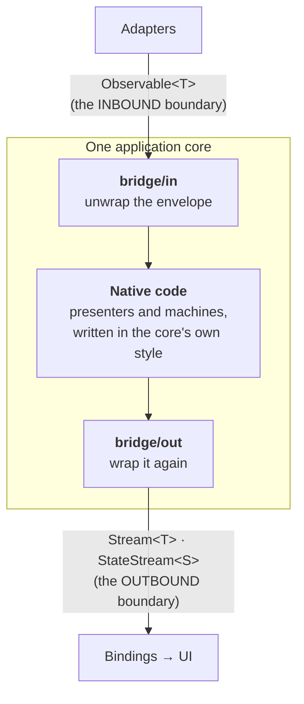
```mermaid
flowchart TD
  adapters["Adapters"]
  subgraph core["One application core"]
    inb["<b>bridge/in</b><br/>unwrap the envelope"]
    native["<b>Native code</b><br/>presenters and machines,<br/>written in the core's own style"]
    outb["<b>bridge/out</b><br/>wrap it again"]
    inb --> native
    native --> outb
  end
  bindings["Bindings → UI"]

  adapters -- "Observable#lt;T#gt;<br/>(the INBOUND boundary)" --> inb
  outb -- "Stream#lt;T#gt; · StateStream#lt;S#gt;<br/>(the OUTBOUND boundary)" --> bindings
```

| Boundary | Declared in | Envelope type | Who is on the other side |
|---|---|---|---|
| **Inbound** | `@rtc/domain` port interfaces, collected as `AppPorts` in `@rtc/core-api` | `Observable<T>` from `rxjs` | adapters |
| **Outbound** | `@rtc/core-api` presenter and machine interfaces | `Stream<T>` and `StateStream<S>` | bindings |

The two outbound types are **aliases**, defined once in
`packages/core-api/src/stream.ts`:

```ts
export type Stream<T> = Observable<T>;            // from "rxjs"
export type StateStream<S> = StateObservable<S>;  // from "@rx-state/core"
```

Nothing outside that file names the envelope directly. That single
indirection is what makes [the future plan](#the-future-the-web-standard-observable)
an edit instead of a rewrite.

**The rule inside the alternative cores:** RxJS may be imported *as a value*
only inside `src/bridge/`. Everywhere else it may appear only as a type.
A core that reached for `shareReplay` in a presenter would be RxJS with extra
steps, not a second implementation. Two gates enforce the rule (see
[What keeps it honest](#what-keeps-it-honest)).

The RxJS core has no bridge folder, because its own style *is* the envelope.
Nothing needs translating.

## The plug: what a core must offer

`@rtc/core-api` contains types and nothing else. It exports no function, no
constant, no class. A client can therefore name "a core" without importing
any particular one.

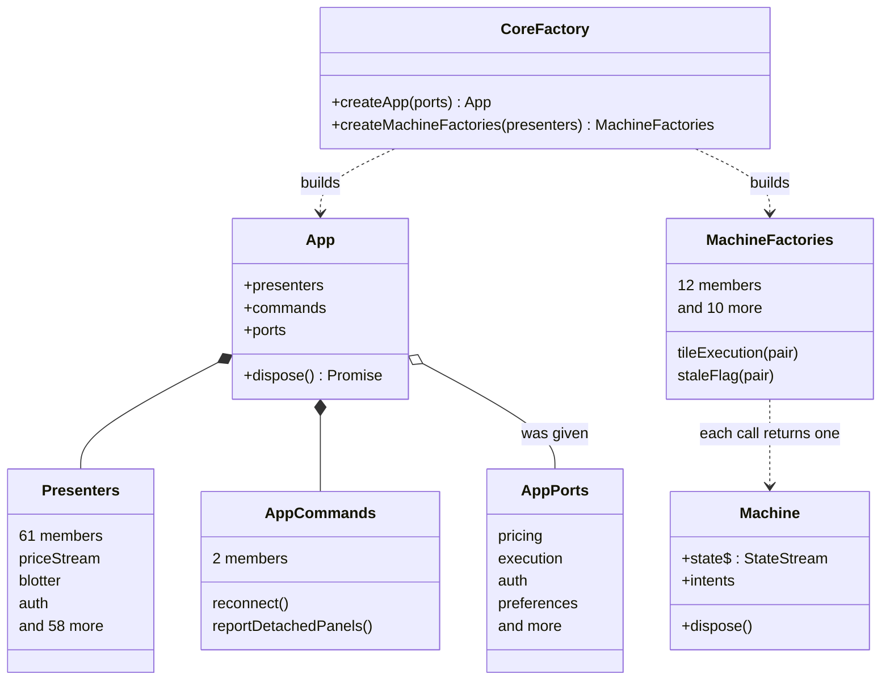
```mermaid
classDiagram
  direction TB
  class CoreFactory {
    +createApp(ports) App
    +createMachineFactories(presenters) MachineFactories
  }
  class App {
    +presenters
    +commands
    +ports
    +dispose() Promise
  }
  class Presenters {
    61 members
    priceStream
    blotter
    auth
    and 58 more
  }
  class AppCommands {
    2 members
    reconnect()
    reportDetachedPanels()
  }
  class MachineFactories {
    12 members
    tileExecution(pair)
    staleFlag(pair)
    and 10 more
  }
  class Machine {
    +state$ : StateStream
    +intents
    +dispose()
  }
  class AppPorts {
    pricing
    execution
    auth
    preferences
    and more
  }

  CoreFactory ..> App : builds
  CoreFactory ..> MachineFactories : builds
  App *-- Presenters
  App *-- AppCommands
  App o-- AppPorts : was given
  MachineFactories ..> Machine : each call returns one
```

A core is any value of type `CoreFactory`. The three that exist are
`rxjsCore`, `asyncCore` and `effectCore`. 61 + 12 + 2 = **75 members**, and
all 75 are implemented natively in all three cores.

## The three cores side by side

| Question | RxJS core | async core | Effect core |
|---|---|---|---|
| Package | `@rtc/client-core-rxjs` | `@rtc/client-core-async` | `@rtc/client-core-effect` |
| Style | operators over `Observable` | `async`/`await`, callbacks, `AsyncIterable` | `Effect`, `Stream`, fibers |
| A shared stream is a… | `shareReplay({ bufferSize: 1, refCount: true })` | `Topic<T>` | `sharedFold` over a `Scope` |
| A state cell is a… | `state()` from `@rx-state/core` | `Store<S>` | `SyncRef<S>` (`bridge/syncRef.ts`) |
| Cancelling work | `unsubscribe()`, `switchMap`, `takeUntil` | `AbortController` / `AbortSignal` | `Fiber.interrupt`, closing a `Scope` |
| Waiting | `timer()` | `sleep(ms, signal)` | `Effect.sleep` |
| One-shot call to a port | the port's `Observable`, as is | `once(port(...), signal)` → `Promise` | `rpc(port(...))` → `Effect` |
| Racing a call against a timeout | `merge` with `timer`s | `Promise.race` | `Effect.race` |
| "Only the latest run counts" | `switchMap` | `createRunSlot` (`kernel/`) | `createRunSlot` (`machines/`) |
| Wiring the app together | `new` in `createApp` | plain function calls in `createApp` | `Layer` graph run by a `ManagedRuntime` |
| Session lifetime | `held` subscriptions + `disposed$` | one `AbortController` (`lifetime`) | the host `Scope` |
| Own primitives live in | — | `src/kernel/` | `src/bridge/out.ts` (streams, state), `src/machines/runSlot.ts` |
| Bundle | loaded up front | separate file, loaded when chosen | separate file, loaded when chosen |

## The shared rulebook

Much of what a core does is a **pure decision**: given the previous state
and an event, what is the next state? Those decisions need no stream library
at all, so they are written once, in `@rtc/core-logic`, and all three cores
import them.

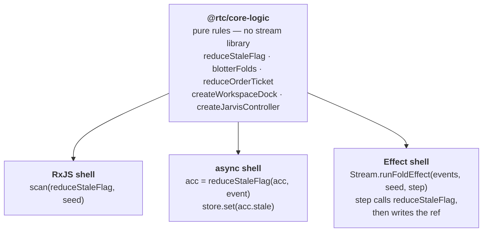
```mermaid
flowchart TD
  logic["<b>@rtc/core-logic</b><br/>pure rules — no stream library<br/>reduceStaleFlag · blotterFolds · reduceOrderTicket<br/>createWorkspaceDock · createJarvisController"]
  rx["<b>RxJS shell</b><br/>scan(reduceStaleFlag, seed)"]
  as["<b>async shell</b><br/>acc = reduceStaleFlag(acc, event)<br/>store.set(acc.stale)"]
  ef["<b>Effect shell</b><br/>Stream.runFoldEffect(events, seed, step)<br/>step calls reduceStaleFlag,<br/>then writes the ref"]

  logic --> rx
  logic --> as
  logic --> ef
```

Some rules sit one ring further in, in `@rtc/domain`, and are shared the same
way: `nextConnectionStatus` and `reduceRfqEvent` are two.

So each core contributes only the **shell**: how events arrive, how state is
held, how work is cancelled. The rule itself exists once. A bug in a rule is
fixed once, and a rule cannot drift between cores.

## What gets translated

This is the full list of translations at the two boundaries. The RxJS core
has none.

### The async core

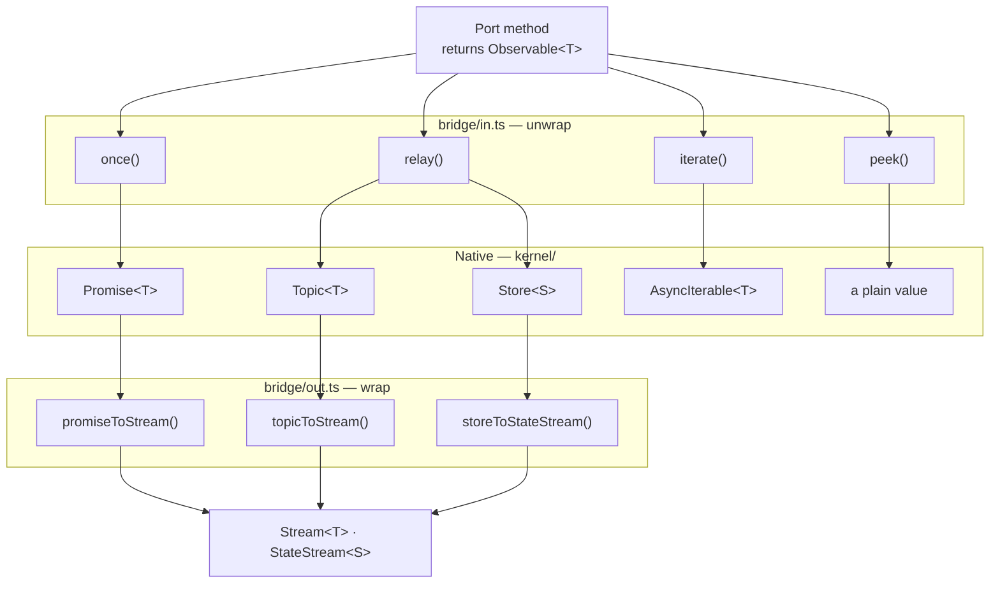
```mermaid
flowchart TD
  port["Port method<br/>returns Observable#lt;T#gt;"]

  subgraph inb["bridge/in.ts — unwrap"]
    once["once()"]
    relay["relay()"]
    iterate["iterate()"]
    peek["peek()"]
  end

  subgraph native["Native — kernel/"]
    promise["Promise#lt;T#gt;"]
    topic["Topic#lt;T#gt;"]
    store["Store#lt;S#gt;"]
    aiter["AsyncIterable#lt;T#gt;"]
    value["a plain value"]
  end

  subgraph outb["bridge/out.ts — wrap"]
    p2s["promiseToStream()"]
    t2s["topicToStream()"]
    s2s["storeToStateStream()"]
  end

  ui["Stream#lt;T#gt; · StateStream#lt;S#gt;"]

  port --> once --> promise
  port --> relay --> topic
  relay --> store
  port --> iterate --> aiter
  port --> peek --> value
  promise --> p2s
  topic --> t2s
  store --> s2s
  p2s --> ui
  t2s --> ui
  s2s --> ui
```

| Direction | Function | From | To | Used for |
|---|---|---|---|---|
| in | `once(source, signal)` | `Observable` | `Promise` of the first value | a one-shot call (execute a trade) |
| in | `relay(source, signal, next)` | `Observable` | a callback, called in the same tick | a hot port that a `Topic` mirrors |
| in | `iterate(source, signal)` | `Observable` | `AsyncIterable` | a source the consumer pulls with `for await` |
| in | `peek(source, fallback)` | `Observable` | the current value, read at once | a synchronous read (`cycle()`) |
| in | `topicFromObservable(source)` | `Observable` | `Topic` (shared, replays the latest) | the common "share this port" case |
| out | `topicToStream(topic)` | `Topic` | `Stream` | every shared stream |
| out | `storeToStateStream(store)` | `Store` | `StateStream` | every machine's `state$` |
| out | `promiseToStream(run)` | a function returning a `Promise` | `Stream` that emits once and completes | every command result |
| out | `portCallToStream(open)` | a per-call port stream | `Stream` | an order's lifecycle updates |

`relay` exists beside `iterate` for one reason: a `for await` loop resumes a
microtask later, so it can never hand over a value in the same tick as the
subscription. `relay` can.

### The Effect core

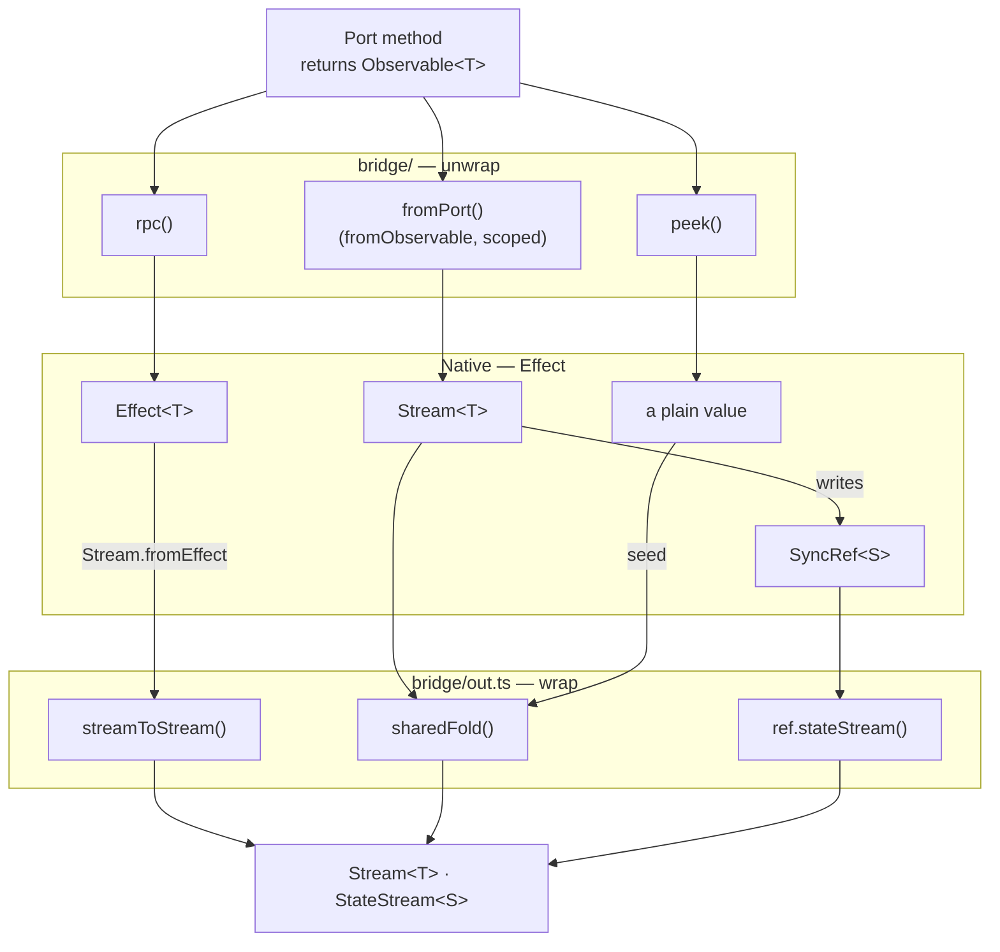
```mermaid
flowchart TD
  port["Port method<br/>returns Observable#lt;T#gt;"]

  subgraph inb["bridge/ — unwrap"]
    rpc["rpc()"]
    fromPort["fromPort()<br/>(fromObservable, scoped)"]
    peek["peek()"]
  end

  subgraph native["Native — Effect"]
    effect["Effect#lt;T#gt;"]
    stream["Stream#lt;T#gt;"]
    ref["SyncRef#lt;S#gt;"]
    value["a plain value"]
  end

  subgraph outb["bridge/out.ts — wrap"]
    s2s["streamToStream()"]
    fold["sharedFold()"]
    r2s["ref.stateStream()"]
  end

  ui["Stream#lt;T#gt; · StateStream#lt;S#gt;"]

  port --> rpc --> effect
  port --> fromPort --> stream
  port --> peek --> value
  effect -- "Stream.fromEffect" --> s2s
  stream --> fold
  value -- "seed" --> fold
  stream -- "writes" --> ref
  ref --> r2s
  s2s --> ui
  fold --> ui
  r2s --> ui
```

| Direction | Function | From | To | Used for |
|---|---|---|---|---|
| in | `rpc(source)` | `Observable` | `Effect` of the first value | a one-shot call |
| in | `fromPort(source)` | `Observable` | Effect `Stream` | following a port during one warm period |
| in | `fromPort.merged([...])` | several `Observable`s | one Effect `Stream` of events | folding two or more ports together, in the order they emitted |
| in | `peek(source, fallback)` | `Observable` | the current value, read at once | seeding, synchronous reads |
| out | `sharedFold(host, { seed, run })` | a seed and a producer | `Stream` (shared, replays the latest) | every shared stream |
| out | `ref.stateStream()` / `ref.warm()` | `SyncRef` | `StateStream` | every machine's `state$` |
| out | `streamToStream(host, stream)` | Effect `Stream` | `Stream` | one-shot results and plain streams |
| out | `scopedPortStream(...)` | a per-call port stream | `Stream` | an order's lifecycle updates |

Presenters never call `fromObservable` directly. They receive `fromPort` from
`sharedFold`, already tied to the warm period's `Scope`, so a port
subscription is always released when the period ends. A dependency-cruiser
rule (`effect-port-subscription-owned-by-the-bridge`) keeps it that way.

Two more things the bridge owns, both explained under
[promise 9](#promise-9-one-event-one-turn). Every fiber runs on the bridge's
own scheduler (`turnScheduler.ts`), so one event is finished within one turn.
And plain code never runs an effect with the global `Effect.runFork`: it
uses a host's runner, or `interruptFiber` and `closeScope`, which releases a
scope's ports before closing it (grep gate 49).

## Worked example: connection status

`connection.status$` answers "are we connected?". It listens to connection
events and folds them into a status. Here is the whole member in each core,
with comments removed and the formatting compacted.

**RxJS core** — operators do everything:

```ts
this.status$ = new ConnectionStatusUseCase(events, initial)
  .execute()
  .pipe(shareReplay({ bufferSize: 1, refCount: true }));
```

**async core** — a `Topic` whose producer is a callback loop:

```ts
const source = events.events();
const status = createTopic<ConnectionStatus>(
  (signal, publish) => {
    let current = initial;
    publish(current);
    return relay(source, signal, (event) => {
      current = nextConnectionStatus(current, event);
      publish(current);
    });
  },
  { replay: true },
);
return { status$: topicToStream(status) };
```

**Effect core** — a `sharedFold` whose producer is a fiber:

```ts
const source = events.events();
return {
  status$: sharedFold(host, {
    seed: () => Option.some(initial),
    run: (update, fromPort) =>
      fromPort(source).pipe(
        Stream.runForEach((event) =>
          update((current) =>
            nextConnectionStatus(Option.getOrElse(current, () => initial), event),
          ),
        ),
      ),
  }),
};
```

The three look different and share the one thing that matters: the rule.
`nextConnectionStatus` comes from `@rtc/domain` in all of them (the RxJS core
reaches it through `ConnectionStatusUseCase`).

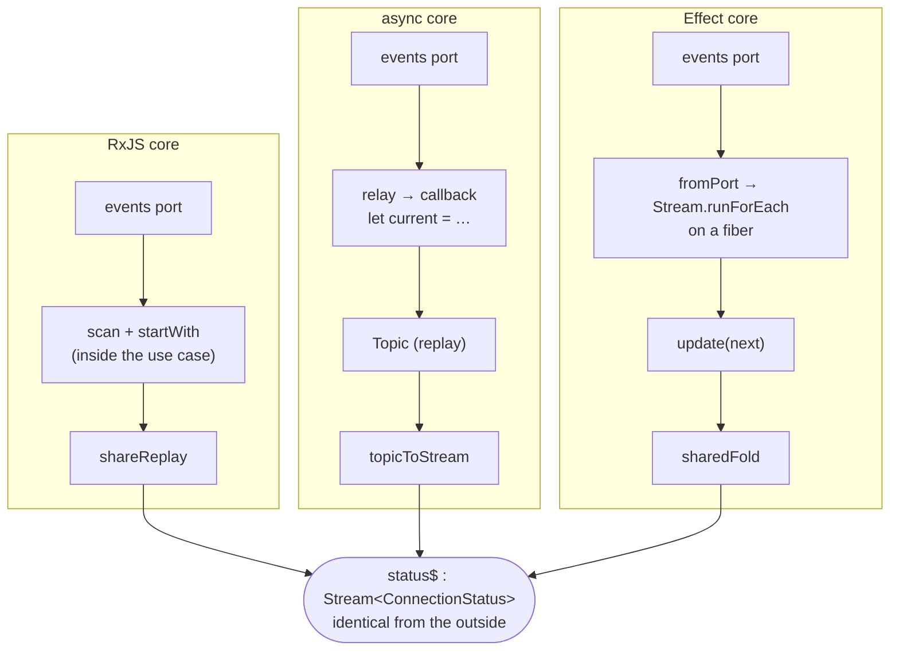
```mermaid
flowchart TD
  subgraph rxjs["RxJS core"]
    r1["events port"] --> r2["scan + startWith<br/>(inside the use case)"]
    r2 --> r3["shareReplay"]
  end

  subgraph async["async core"]
    a1["events port"] --> a2["relay → callback<br/>let current = …"]
    a2 --> a3["Topic (replay)"]
    a3 --> a4["topicToStream"]
  end

  subgraph effect["Effect core"]
    e1["events port"] --> e2["fromPort → Stream.runForEach<br/>on a fiber"]
    e2 --> e3["update(next)"]
    e3 --> e4["sharedFold"]
  end

  out(["status$ : Stream#lt;ConnectionStatus#gt;<br/>identical from the outside"])

  r3 --> out
  a4 --> out
  e4 --> out
```

## The journey of one price tick

Follow a single price from the server to the pixel. The steps in the middle
change per core; the two ends never do.

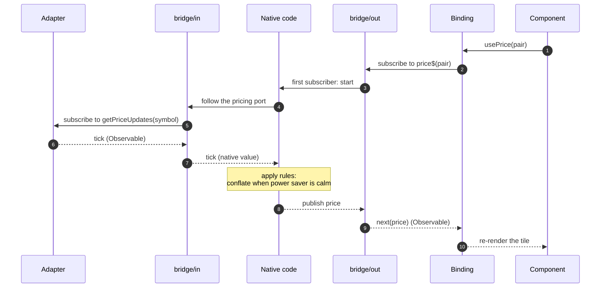
```mermaid
sequenceDiagram
  autonumber
  participant A as Adapter
  participant I as bridge/in
  participant N as Native code
  participant O as bridge/out
  participant B as Binding
  participant U as Component

  U->>B: usePrice(pair)
  B->>O: subscribe to price$(pair)
  O->>N: first subscriber: start
  N->>I: follow the pricing port
  I->>A: subscribe to getPriceUpdates(symbol)
  A-->>I: tick (Observable)
  I-->>N: tick (native value)
  Note over N: apply rules:<br/>conflate when power saver is calm
  N-->>O: publish price
  O-->>B: next(price) (Observable)
  B-->>U: re-render the tile
```

In the RxJS core the two translation steps (4 and 7) do not exist: the port's
`Observable` flows straight into an operator pipeline.

## Warm periods: when a stream is running

A shared stream does not run all the time. It starts when the first
subscriber arrives and stops when the last one leaves. That stretch is a
**warm period**. Every core must behave identically here, which is why each
one writes the behaviour out explicitly.

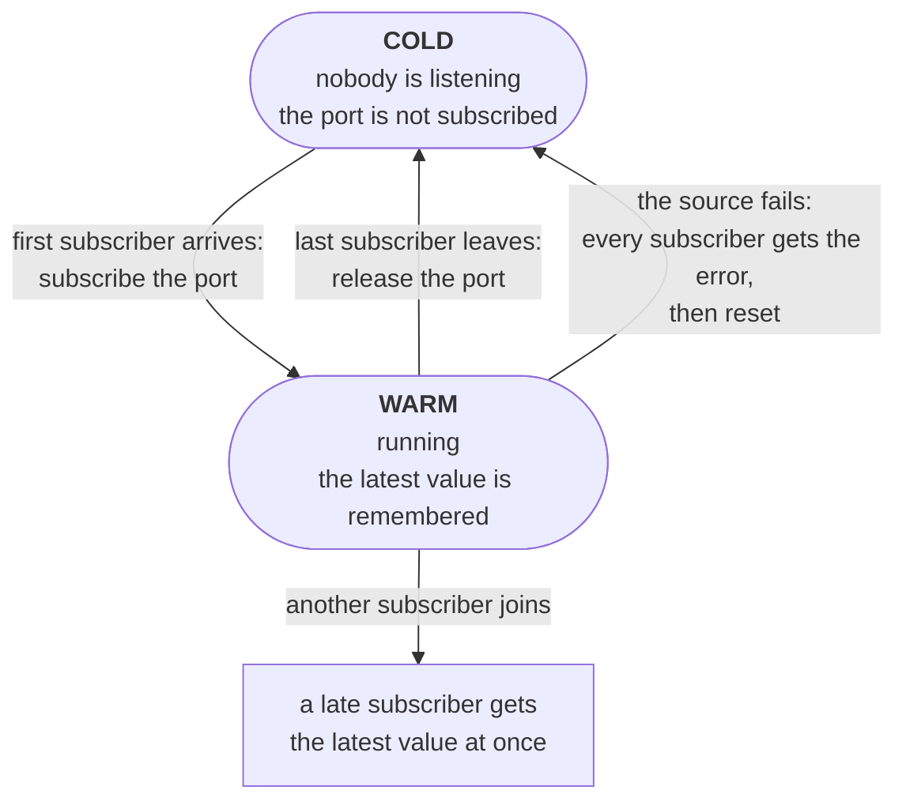
```mermaid
flowchart TD
  cold(["<b>COLD</b><br/>nobody is listening<br/>the port is not subscribed"])
  warm(["<b>WARM</b><br/>running<br/>the latest value is remembered"])
  joined["a late subscriber gets<br/>the latest value at once"]

  cold -- "first subscriber arrives:<br/>subscribe the port" --> warm
  warm -- "another subscriber joins" --> joined
  warm -- "last subscriber leaves:<br/>release the port" --> cold
  warm -- "the source fails:<br/>every subscriber gets the error,<br/>then reset" --> cold
```

A few streams are **retained**: they stay warm for the whole session even
with no subscriber, so that data is already there when a panel opens. The
trade blotter is one. Each core has its own switch for this:

| Core | Normal (stops on last unsubscribe) | Retained (stops on `dispose()`) |
|---|---|---|
| RxJS | `shareReplay({ refCount: true })` | `warmReplay()` |
| async | `createTopic(..., { replay: true })` | `{ retainUntil: lifetime }` |
| Effect | `sharedFold(host, { seed, run })` | `{ retain: true }` |

## The promises every core keeps

Matching the *types* of the plug is the easy part; the compiler checks it.
Matching the *behaviour* is the real work. These are the promises, in plain
words. [§22](22-pluggable-application-core.md#three-timing-guarantees) has
the precise versions.

| # | Promise | Why the UI needs it |
|---|---|---|
| 1 | **The first value arrives during `subscribe`**, not later. | The first render must have something to paint. Solid's `toSignal` throws without it. |
| 2 | **Subscribers share one run**, and the run ends with the last subscriber. | Ten tiles showing EUR/USD must open one subscription to the server, not ten. |
| 3 | **Asking twice for the same key returns the same stream.** `price$(EURUSD) === price$(EURUSD)` | Otherwise promise 2 cannot hold. |
| 4 | **An error resets the stream**; it is never remembered. | The next subscriber gets a fresh attempt. |
| 5 | **One subscriber throwing does not hurt the others.** | One broken panel must not freeze the desk. |
| 6 | **After `dispose()`, the core holds no port subscription** once its consumers have let go. | No leaks. |
| 7 | **Each port method is called once, at construction.** | A port call can open a subscription on the server; calling it twice doubles the load. |
| 8 | **Values that arrive together are delivered together.** | The screen redraws once per turn. Fifty prices in one turn is one redraw; fifty prices in fifty turns is fifty. |
| 9 | **Everything one event causes is delivered in the same turn.** | A price and the flash it causes must redraw the tile once, not once each. |
| 10 | **What a port replays on subscribe arrives in the subscribing turn.** | A tile that mounts must paint its price and its chart in one redraw, not two. |

Promise 1 is the one that shapes the bridges most:

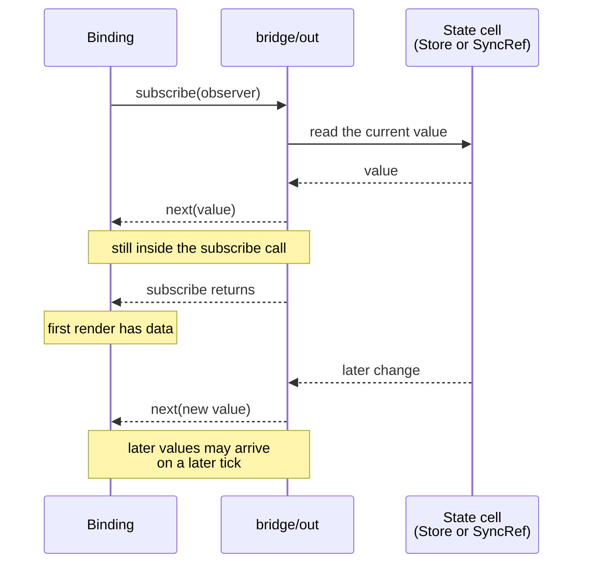
```mermaid
sequenceDiagram
  participant B as Binding
  participant O as bridge/out
  participant C as State cell<br/>(Store or SyncRef)

  B->>O: subscribe(observer)
  O->>C: read the current value
  C-->>O: value
  O-->>B: next(value)
  Note over B,O: still inside the subscribe call
  O-->>B: subscribe returns
  Note over B: first render has data
  C-->>O: later change
  O-->>B: next(new value)
  Note over B,O: later values may arrive<br/>on a later tick
```

Only the *first* value is promised to be synchronous. Later values may arrive
a tick later (in the Effect core they arrive on a fiber), and the contract
tests allow for that.

### Promise 8, and the mistake behind it

Promise 8 was added after it was broken for weeks without a single test
failing (found 2026-10-04).

When a price tile appears, the pricing simulator sends it the last 50 prices
at once, so the sparkline has a history. In the RxJS core those 50 values run
through the pipeline inside one function call, so the tile sees them in one
turn and React redraws it once. The Effect core delivered the same 50 values,
in the same order, but one per turn: its fibers pass work to each other
through the scheduler, and at every `Stream.merge` each piece of work crossed
over separately.

Nothing was wrong with the values, so every contract test passed. But the
nine FX tiles redrew 1,070 times in their first two seconds instead of about
95, and the page was four times busier at start-up. On a small CI runner that
made every test touching the FX screen about two seconds slower, which is how
it was finally noticed.

Two lessons, and where each one now lives:

- **"Same values" is not the whole contract; "same number of turns" matters
  too.** The contract harness has `collectTurns`, which counts the turns a
  stream's values arrive in, and three members (`priceStream`,
  `priceHistory`, `animationDirector`) carry a case named "…in one turn".
  Give the same case to any new member that folds a port which can burst.
- **In the Effect core, a burst enters as one chunk.** Effect moves
  *chunks* between fibers, not single values, so `bridge/in.ts` drains
  everything a port emitted in one turn and passes it on as one chunk. That
  was the whole fix at first. Since promise 9's scheduler it is no longer
  what protects the redraws, but it still saves the work of fifty
  hand-overs; the comment there has the measurements.

How it was found, in case it is needed again: slow the processor down in a
probe (`Emulation.setCPUThrottlingRate`), take a CPU profile from navigation
to two seconds after the app appears, and count renders per component. The
profile showed React doing four times the work inside `Tile`; a counter in
`Tile` showed `price` changing 472 times instead of 30.

### Promise 9: one event, one turn

Promise 8 is about many values in one stream. Promise 9 is about one value
that travels through several members.

A price tick goes to the price stream, then to the animation director, which
works out whether the tile should flash up or down, then to that tile's own
intent stream. The tile reads the price and the intent. In the RxJS core all
of this is one chain of function calls, so both arrive before React redraws.

In the Effect core each member is a fiber, and Effect's default scheduler
gives every fiber its own slot in the queue each time it wakes. So the price
arrived, React redrew the tile, and several slots later the flash arrived
and React redrew it again: three redraws per tick against two (measured
2026-10-04: 624 redraws in six seconds against 404).

The fix is one small file, `bridge/turnScheduler.ts`. It replaces Effect's
scheduler with one that keeps running fibers, including the fibers those
wake, until none is waiting, all in a single slot. React's redraw waits
behind that slot, so it sees the core only once it has settled. Nothing is
held up longer than before: a chain of slots never let the browser paint in
between anyway.

It had one side effect, which exposed a second mistake. Disposing a machine
closed its `Scope`, and closing a scope is itself a little program: it stops
the scope's fibers one after another and unsubscribes the ports last. For a
few steps after `dispose()` returned, the machine was still listening. It
never showed, because a merge was slower than the close. With the new
scheduler the event won, and a disposed machine processed two more events.
The bridge now unsubscribes a scope's ports *before* it closes the scope
(`closeScope`), which is what RxJS's `unsubscribe()` always did, and a gate
forbids closing a scope any other way.

The lesson for both: **when two things only work because one is slower than
the other, it is a race, even if it has never failed.** Look for the
ordering the code actually guarantees, not the one it happens to have.

### Promise 10: a replay arrives with the subscribe

A tile reads its price and its price history. When it mounts, it subscribes
both, one after the other. The price is usually running already, because
the animation director reads it too, so the tile gets the current price
inside its `subscribe` call. The history is not running yet: subscribing it
opens the port, and the port replays its recent ticks at once.

In RxJS those replayed ticks pass through the operators and reach the tile
inside the same `subscribe` call. In the Effect core they went into a queue
for a fiber, and the fiber ran one microtask later. By then the tile had
already redrawn with its price. Each tile drew twice when it appeared.

The Effect core now lets its fibers run before `subscribe` returns
(`turnScheduler.settle()`, called by `sharedFold`). The rule for any core:
**a subscriber that is handed one value synchronously will redraw at the
next microtask, so everything else its subscribes cause must be delivered
before that.**

### What a value costs in the Effect core

Getting the turns right fixed what the screen does. The same profiling also
showed how much work each value took, and three habits were responsible for
most of it.

- **A fiber per subscriber, only to pass values on.** A shared stream kept
  its state in a `SubscriptionRef`, and every subscriber followed it on a
  fiber of its own. Now the fiber that computes a state hands it to the
  subscribers itself. Nine tiles reading four streams each no longer means
  thirty-six extra fibers.
- **`Stream.merge` over two ports.** Merging runs each side on its own fiber
  and passes every value across: about eleven fiber steps per value. A fold
  that listens to two ports now asks for them as one stream,
  `fromPort.merged([...])`, which puts both ports into one queue. It is
  cheaper, and the events also keep the order they were emitted in, which
  `Stream.merge` never promised.
- **A fiber per subscriber of a machine's state, too.** A machine kept its
  state in Effect's `SubscriptionRef`. That type reaches a subscriber the
  same way a shared stream used to: through a fiber that reads
  `ref.changes`. State now lives in a `SyncRef`, a plain cell that calls its
  subscribers from inside the write, as an RxJS `BehaviorSubject` does. The
  workspace already used one, because its state must be readable right
  after it is written; now every machine and presenter does, and a gate
  keeps `SubscriptionRef` out of the package.
- **A stream per currency pair, merged.** The animation director and the
  narrator both follow the price of every pair in the roster. Each built one
  Effect stream per pair and merged them, behind a "switch" for when the
  roster changes: three or four fiber steps per tick, each. Now the bridge
  subscribes the roster's pairs itself and puts every price into one queue
  (`switchedPortEvents`): one step per tick.
- **A fold per reader, only to drop most values.** Each tile asked the
  director for "the intents for my tile", and got a fold of its own that
  read every intent and kept one in nine. Now it gets a filtered view of the
  director's one stream (`filterStream`): no fiber at all.

The first two took the first two seconds of the FX screen from about 2,900
fiber steps to about 1,000, and steady state from about 7,500 per six
seconds to about 2,000. The third took the first two seconds to about 700.
The last two took steady state to about 520 (measured on a production
build, where the first two seconds went from about 530 steps to about 160).

When you write a new Effect member:

- keep its state in a `SyncRef`;
- fold several ports with `fromPort.merged`, and a changing set of ports
  with `switchedPortEvents` inside it — never with an Effect combinator such
  as `Stream.merge`, `flatMap` or `zipLatest`, which a gate now rejects
  outside the bridge (use `latestOfEach` where you would have written
  `combineLatest`, and `firstPortEvent` for a one-shot query);
- let `sharedFold` do the sharing, and give a reader that wants only part
  of a shared stream a `filterStream`, not a fold of its own.

What is left is the price of the library itself. On a production build the
Effect core's chunk takes about 25 ms to load and evaluate against about
6 ms for the other two (it is 235 KB, most of it `effect`), and building
the Layer graph takes about 15 ms where the other cores' plain construction
takes 3. Both happen once, at start-up.

## A command that can be cancelled

Pressing "Buy" starts a run: call the server, wait for the answer, give up
after a timeout, show the result, then clear it. Pressing again, or closing
the tile, must cancel the run in flight. Each core cancels in its own way.

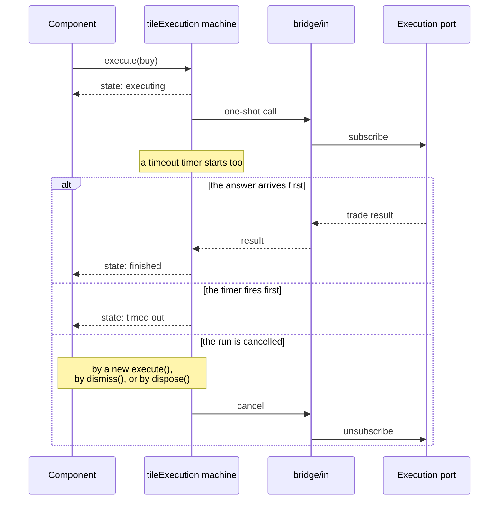
```mermaid
sequenceDiagram
  participant U as Component
  participant M as tileExecution machine
  participant I as bridge/in
  participant P as Execution port

  U->>M: execute(buy)
  M-->>U: state: executing
  M->>I: one-shot call
  I->>P: subscribe
  Note over M: a timeout timer starts too

  alt the answer arrives first
    P-->>I: trade result
    I-->>M: result
    M-->>U: state: finished
  else the timer fires first
    M-->>U: state: timed out
  else the run is cancelled
    Note over U,M: by a new execute(),<br/>by dismiss(), or by dispose()
    M->>I: cancel
    I->>P: unsubscribe
  end
```

| Step | RxJS core | async core | Effect core |
|---|---|---|---|
| one-shot call | the port `Observable` | `once(port, run.signal)` | `rpc(port)` |
| race with timeout | `merge` with `timer`s | `Promise.race([… , sleep(ms, signal)])` | `Effect.race(… , Effect.sleep)` |
| cancel | `switchMap` / `takeUntil` | `run.signal` aborts | the fiber is interrupted |

## How a core is chosen and loaded

One production build contains all three cores. The RxJS core is in the files
the page loads up front. The other two are separate files, fetched only when
chosen. The choice is made at page load, in this order: the `?core=` URL
parameter, then the saved Preferences choice, then the build default
(`VITE_CORE_IMPL`), then `rxjs`.

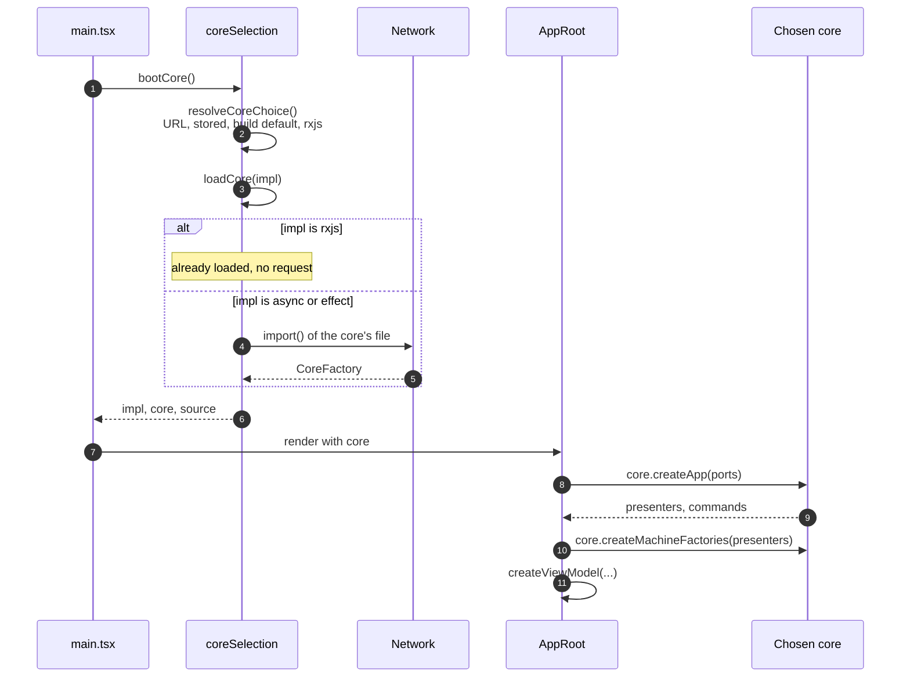
```mermaid
sequenceDiagram
  autonumber
  participant M as main.tsx
  participant S as coreSelection
  participant N as Network
  participant R as AppRoot
  participant C as Chosen core

  M->>S: bootCore()
  S->>S: resolveCoreChoice()<br/>URL, stored, build default, rxjs
  S->>S: loadCore(impl)
  alt impl is rxjs
    Note over S: already loaded, no request
  else impl is async or effect
    S->>N: import() of the core's file
    N-->>S: CoreFactory
  end
  S-->>M: impl, core, source
  M->>R: render with core
  R->>C: core.createApp(ports)
  C-->>R: presenters, commands
  R->>C: core.createMachineFactories(presenters)
  R->>R: createViewModel(...)
```

`AppRoot` receives a `CoreFactory` and never learns which one it is. The
full precedence chain, the failure screen and the bundle check are in
[§22 Selection](22-pluggable-application-core.md#selection-at-load-time).

React Native is not part of this: it always runs the RxJS core.

## What keeps it honest

Three cores that merely *claim* to be equivalent would drift apart within
weeks. Each claim below (left) is checked by a machine (right) on every pull
request.

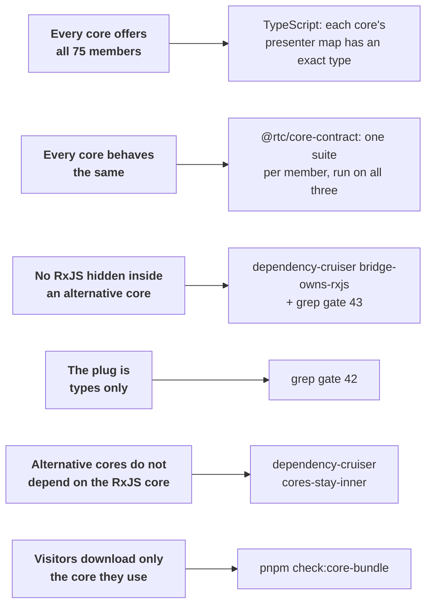
```mermaid
flowchart LR
  c1["<b>Every core offers<br/>all 75 members</b>"] --> g1["TypeScript: each core's<br/>presenter map has an exact type"]
  c2["<b>Every core behaves<br/>the same</b>"] --> g2["@rtc/core-contract: one suite<br/>per member, run on all three"]
  c3["<b>No RxJS hidden inside<br/>an alternative core</b>"] --> g3["dependency-cruiser bridge-owns-rxjs<br/>+ grep gate 43"]
  c4["<b>The plug is<br/>types only</b>"] --> g4["grep gate 42"]
  c5["<b>Alternative cores do not<br/>depend on the RxJS core</b>"] --> g5["dependency-cruiser<br/>cores-stay-inner"]
  c6["<b>Visitors download only<br/>the core they use</b>"] --> g6["pnpm check:core-bundle"]
```

The contract tier is the important one. One suite per member is written
against the plug, not against a core:

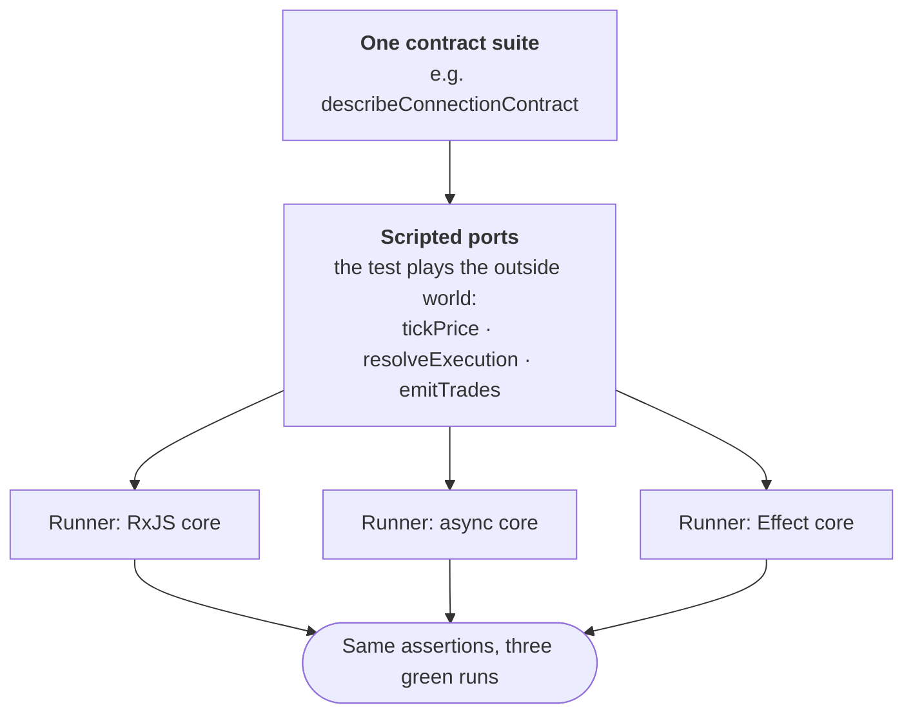
```mermaid
flowchart TD
  suite["<b>One contract suite</b><br/>e.g. describeConnectionContract"]
  harness["<b>Scripted ports</b><br/>the test plays the outside world:<br/>tickPrice · resolveExecution · emitTrades"]
  rx["Runner: RxJS core"]
  as["Runner: async core"]
  ef["Runner: Effect core"]
  verdict(["Same assertions, three green runs"])

  suite --> harness
  harness --> rx
  harness --> as
  harness --> ef
  rx --> verdict
  as --> verdict
  ef --> verdict
```

A suite must be green on the RxJS core **before** either alternative core
implements that member. The target is fixed first, then aimed at.

## The boundary today: RxJS

Today both boundaries speak RxJS. That is a deliberate, recorded choice, not
an accident.

| Place | What it uses from RxJS | At runtime? |
|---|---|---|
| `@rtc/domain` ports and simulators | `Observable`, operators | yes — RxJS is its only runtime dependency ([§10.1](10-key-design-decisions.md#101-rxjs-observablet-as-the-boundary-stream-type)) |
| `@rtc/core-api` | `Observable`, `StateObservable` | **no** — types only |
| `@rtc/core-logic` | nothing | no |
| `@rtc/client-core-rxjs` (RxJS core) | everything | yes |
| alternative cores, inside `bridge/` | `new Observable`, `state()`, `take`, `firstValueFrom` | yes |
| alternative cores, outside `bridge/` | type names only | **no** |
| bindings | `combineLatest`, `map`, `firstValueFrom`; `@react-rxjs/core` (React), `state()` (Solid) | yes |

Why `Observable` was kept as the envelope
([ADR-006 Decision 2](../adr/ADR-006-pluggable-application-core.md#decision-2--observable-stays-the-envelope-behind-the-aliases)):
the things it cannot express — pull-based backpressure, Effect's typed error
channel — do not matter at a UI edge. Inventing a neutral type would have
cost a great deal and bought nothing a screen needs.

The consequence to be honest about: the alternative cores are free of RxJS
in their *logic*, and still ship RxJS in their *bridges*. "Pluggable core"
today means a pluggable implementation behind an RxJS-shaped plug.

## The future: the web-standard Observable

Browsers are gaining a built-in `Observable`
([WICG draft](https://wicg.github.io/observable/)). The plan is to make it
the envelope once it is ready, so the outbound boundary depends on the web
platform instead of on a library. This is
[ADR-006 Follow-up 2](../adr/ADR-006-pluggable-application-core.md#follow-ups),
and it is **not started**.

### Why not now

Checked 2026-09-28:

| Browser engine | Built-in `Observable` |
|---|---|
| Chromium (Chrome, Edge) | shipped, since version 135 |
| Firefox | not shipped |
| Safari | not shipped |

Two of three engines would need a polyfill, and the specification is still a
draft. Adopting it now would swap one library for another.

### How the standard differs from RxJS

| Topic | RxJS today | Web standard | What it means here |
|---|---|---|---|
| Unsubscribing | `subscribe()` returns a `Subscription`; call `unsubscribe()` | `subscribe()` returns nothing; pass an `AbortSignal`, then abort it | bindings must own an `AbortController` per subscription |
| Sharing | cold by default; sharing is an operator | one producer run is shared by all current subscribers | promise 2 comes partly for free |
| Replay of the latest value | `shareReplay`, `BehaviorSubject` | **none** | the bridges must keep supplying it |
| Current value, read at once | `StateObservable.getValue()` | **none** | `StateStream` needs a shape of its own |
| Operators | more than a hundred | about ten (`map`, `filter`, `take`, `drop`, `flatMap`, `switchMap`, `takeUntil`, `inspect`, `catch`, `finally`) | bindings lose `combineLatest` |
| Interop with RxJS | — | no `Symbol.observable` | an explicit adapter at each edge |

ADR-006 summarises the standard as having "no multicast primitive". The
current draft is more precise than that: concurrent subscribers *do* share
one producer run, but nothing is replayed to a subscriber that arrives late.

### What would change, and what would not

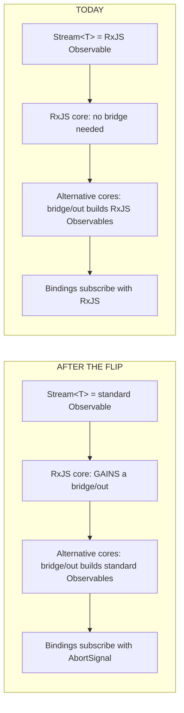
```mermaid
flowchart TD
  subgraph today["TODAY"]
    direction TB
    t1["Stream#lt;T#gt; = RxJS Observable"]
    t2["RxJS core: no bridge needed"]
    t3["Alternative cores: bridge/out builds RxJS Observables"]
    t4["Bindings subscribe with RxJS"]
    t1 --> t2 --> t3 --> t4
  end

  subgraph future["AFTER THE FLIP"]
    direction TB
    f1["Stream#lt;T#gt; = standard Observable"]
    f2["RxJS core: GAINS a bridge/out"]
    f3["Alternative cores: bridge/out builds standard Observables"]
    f4["Bindings subscribe with AbortSignal"]
    f1 --> f2 --> f3 --> f4
  end

  today ~~~ future
```

| Piece | Changes? | Note |
|---|---|---|
| `packages/core-api/src/stream.ts` | **yes** | the two aliases; this is the flip itself |
| Presenter and machine interfaces in `core-api` | no | they only name the aliases |
| Native code in the alternative cores | no | it never touched the envelope |
| `bridge/out` in the alternative cores | **yes** | the only place that constructs the envelope |
| The RxJS core | **yes** | it becomes "a core like the others", with its own outbound bridge |
| Bindings | **yes** | `AbortController` per subscription; replacements for `combineLatest` and friends |
| `@rtc/core-contract` suites | **yes** | they subscribe to streams |
| Devtools decorators | **yes** | they wrap each presenter's streams |
| UI components | no | they only see hooks |
| `@rtc/domain` ports (the inbound boundary) | **no, and not planned** | see below |

The last row matters. The plan covers the **outbound** boundary only. The
inbound boundary — ports returning RxJS `Observable` — stays, because
`@rtc/domain`'s simulators and use cases are written with RxJS operators.
Changing that would be a separate, much larger decision
([§8 Replaceability Matrix](08-replaceability-matrix.md) rates it "very
high" cost).

### The order of work

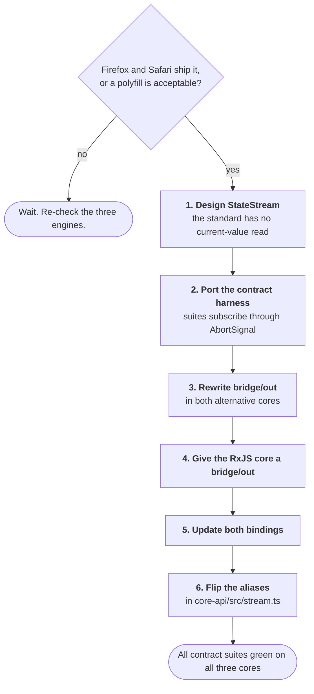
```mermaid
flowchart TD
  wait{"Firefox and Safari ship it,<br/>or a polyfill is acceptable?"}
  stop(["Wait. Re-check the three engines."])
  design["<b>1. Design StateStream</b><br/>the standard has no current-value read"]
  contract["<b>2. Port the contract harness</b><br/>suites subscribe through AbortSignal"]
  bridges["<b>3. Rewrite bridge/out</b><br/>in both alternative cores"]
  rxbridge["<b>4. Give the RxJS core a bridge/out</b>"]
  bindings["<b>5. Update both bindings</b>"]
  flip["<b>6. Flip the aliases</b><br/>in core-api/src/stream.ts"]
  green(["All contract suites green on all three cores"])

  wait -- "no" --> stop
  wait -- "yes" --> design
  design --> contract
  contract --> bridges
  bridges --> rxbridge
  rxbridge --> bindings
  bindings --> flip
  flip --> green
```

### Open questions

These are known constraints, not decisions. No design has been written.

1. **What is a `StateStream` without `getValue()`?** React's
   `useStateObservable` reads the current value on the first render. The
   standard has no such read, so `StateStream` would need its own small
   interface (a current-value read plus a stream of changes).
2. **How does a late subscriber get the first value?** Today `bridge/out`
   hands each new subscriber the current value inside its subscribe callback.
   In the standard, that callback runs only for the *first* concurrent
   subscriber; later ones join the run already in progress. The current
   technique therefore does not carry over unchanged.
3. **What replaces `combineLatest` in the bindings?** The standard has no
   equivalent operator.

## Adding a member

Every new presenter, machine or command follows the same path, in this
order.

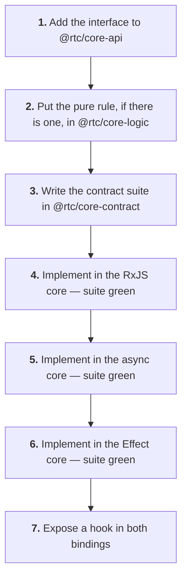
```mermaid
flowchart TD
  s1["<b>1.</b> Add the interface to @rtc/core-api"]
  s2["<b>2.</b> Put the pure rule, if there is one, in @rtc/core-logic"]
  s3["<b>3.</b> Write the contract suite in @rtc/core-contract"]
  s4["<b>4.</b> Implement in the RxJS core — suite green"]
  s5["<b>5.</b> Implement in the async core — suite green"]
  s6["<b>6.</b> Implement in the Effect core — suite green"]
  s7["<b>7.</b> Expose a hook in both bindings"]

  s1 --> s2 --> s3 --> s4 --> s5 --> s6 --> s7
```

Skipping a step does not go unnoticed. Step 1 without steps 4 to 6 fails the
typecheck. Step 1 without step 3 fails the contract registry, which must
list every member.

## Try it

```bash
pnpm dev:react            # RxJS core
pnpm dev:react:async      # async core
pnpm dev:react:effect     # Effect core
```

Or, against any running build including the deployed one, add `?core=async`
or `?core=effect` to the URL, or pick one under Preferences → Application
core. The browser console prints which core booted and why:

```
[core] booted effect from url
```

## Reading map

| Topic | Where |
|---|---|
| Exact timing guarantees, teardown order, per-slice details | [§22 Pluggable Application Core](22-pluggable-application-core.md) |
| Decisions, alternatives rejected, recorded divergences | [ADR-006](../adr/ADR-006-pluggable-application-core.md) |
| Why RxJS sits at the domain boundary | [§10.1](10-key-design-decisions.md#101-rxjs-observablet-as-the-boundary-stream-type) |
| What is replaceable, and at what cost | [§8 Replaceability Matrix](08-replaceability-matrix.md) |
| The same experiment one ring out: two UI frameworks | [§21 One Test Suite, Two Frameworks](21-cross-framework-testing.md) |
| Package dependency rules | [§6 Package Dependencies](06-package-dependencies.md) |
| The web-standard `Observable` draft | <https://wicg.github.io/observable/> |
