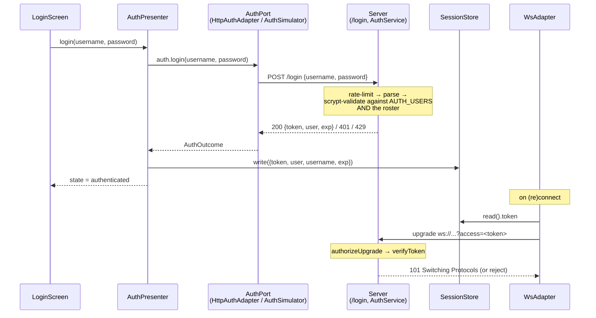

# Authentication

Genuine per-user, server-side login for both clients. There is no shared
secret anywhere in this system: each of the four roster operators signs in
with their own username and password, and the deployed web (`@rtc/client-react`)
and mobile (`@rtc/client-react-native`) clients both authenticate against the
same Fly server. This replaced the old model — a single shared `SITE_PASSWORD`
wall in front of the whole app plus a static `VITE_WS_TOKEN` gating the
WebSocket — which no longer exists anywhere in this repo.

## 1. Overview

- **No shared secret.** The server's `AUTH_USERS` roster (a Fly secret,
  `"user:pass,user2:pass2"`) is the only source of real credentials. Signing
  in exchanges a username/password for a short-lived, per-user session token;
  nothing is gated by a single app-wide password anymore.
- **Server-issued, stateless tokens.** `AuthService`
  (`packages/server/src/auth/AuthService.ts`) validates credentials with
  `scrypt` + `timingSafeEqual` and, on success, signs an HMAC token
  (`packages/server/src/auth/token.ts`) carrying the username and an
  expiry — no server-side session table to manage.
- **Same flow, two transports.** In "WS-real" mode (a real server configured)
  both clients call the identical `POST /login` HTTP endpoint via
  `HttpAuthAdapter` (`packages/client-core/src/adapters/HttpAuthAdapter.ts`).
  In simulator mode (no server configured) each client instead uses the
  in-process `AuthSimulator` (`packages/domain/src/simulators/AuthSimulator.ts`),
  which validates against the same public roster plus locally-supplied dev
  credentials — no network call, no real security boundary.
- **Public roster, private passwords.** The four operator identities
  (`packages/domain/src/auth/roster.ts`) are checked into the repo — they are
  just display data (name, initials, role, desk, clearance). Passwords are
  never checked in anywhere; see [§4](#4-configuring-passwords--per-platform).

## 2. How it works end to end



1. **`LoginScreen` → `useAuth().login(username, password)`.** Both clients'
   `LoginScreen` (`packages/client-react/src/ui/shell/auth/LoginScreen.tsx`,
   `packages/client-react-native/src/ui/shell/auth/LoginScreen.tsx`) are dumb
   forms: typed credentials live only in local component state, are never
   logged, and are handed straight to `useAuth().login` from the `useViewModel()`
   seam.
2. **`AuthGate` renders `LoginScreen` until authenticated.** `AuthGate`
   (`packages/client-react/src/ui/shell/auth/AuthGate.tsx`,
   `packages/client-react-native/src/ui/shell/auth/AuthGate.tsx`) reads
   `useAuth().state.status`; anything other than `"authenticated"` (i.e.
   `"unauthenticated"` or `"authenticating"`) renders `LoginScreen` instead of
   the app's `children`.
3. **`AuthPresenter.login`** (`packages/client-core/src/presenters/AuthPresenter.ts:73-84`)
   flips state to `"authenticating"` and calls the injected `AuthPort`.
4. **The `AuthPort`** is one of:
   - `HttpAuthAdapter` (`packages/client-core/src/adapters/HttpAuthAdapter.ts`) —
     `POST {httpBaseUrl}/login` with `{ username, password }`, used whenever a
     real server URL is configured. `wsUrlToHttpBase` derives the HTTP base
     from the WS URL by swapping only the scheme (`ws://`→`http://`,
     `wss://`→`https://`).
   - `AuthSimulator` (`packages/domain/src/simulators/AuthSimulator.ts`) —
     in-process, used in simulator mode. Validates the username against the
     public `ROSTER` and the password against an injected `DevCredentials` map;
     issues a cosmetic `sim.<username>.<id>` token (there is no real WS to gate
     in simulator mode).
5. **On the server, `handleLogin`** (`packages/server/src/http/loginHandler.ts:36-70`)
   runs, in order: **rate-limit** the caller's IP (`RateLimiter.hit`, 10
   requests/60s, `packages/server/src/auth/rateLimit.ts`) → **parse** the JSON
   body (`isLoginRequestDto`) → **`AuthService.login`**
   (`packages/server/src/auth/AuthService.ts:65-91`), which scrypt-hashes the
   supplied password against the salted digest built from `AUTH_USERS` at
   startup (`timingSafeEqual`, so no early-exit timing leak) **and** requires
   the username to resolve via `findRosterUser` — a valid password for a
   username missing from the roster still fails login. On success it signs a
   token via `signToken(username, secret, ttlMs, now)`
   (`packages/server/src/auth/token.ts:16-25`) — an HMAC-SHA256 over a
   base64url-encoded `{ u: username, exp: now + ttlMs }` payload, TTL default
   **8 hours** (`AUTH_TTL_MS`, `packages/server/src/index.ts:18`).
6. **Fail-fast on misconfiguration.** `AuthService`'s constructor throws
   `"AUTH_SECRET must be set when AUTH_USERS is configured"`
   (`AuthService.ts:45-47`) if `AUTH_USERS` has entries but `AUTH_SECRET` is
   empty — a deploy can never silently serve unsigned/unverifiable tokens.
7. **The client stores the session.** On a `{ ok: true, token, user }`
   outcome, `AuthPresenter.handleLoginOutcome` writes
   `{ token, user, username, exp: now() + SESSION_TTL_MS }` to the injected
   `SessionStore` (`packages/client-core/src/adapters/sessionStore.ts`) —
   `SESSION_TTL_MS` is a client-side 8-hour constant
   (`AuthPresenter.ts:19`, independent of the server's own `AUTH_TTL_MS`) — and
   flips state to `"authenticated"`.
8. **The WebSocket connects with the token.** `WsAdapter` reads
   `sessionStore.read()?.token` fresh on every (re)connect and appends it as
   `?access=<token>` to the WS URL (both `buildBrowserPorts.ts` and
   `buildNativePorts.ts` wire this identically). The server's `verifyClient`
   hook, `authorizeUpgrade` (`packages/server/src/http/loginHandler.ts:79-95`),
   rejects the upgrade outright on a missing URL, a missing `access` param, or
   a token that fails `AuthService.verifyToken` (bad signature, wrong secret,
   or expired) — there is no open-when-empty fallback.
9. **Resume on boot.** `AuthPresenter`'s constructor calls `resume()`
   (`AuthPresenter.ts:55-70`): if the `SessionStore` holds an entry whose `exp`
   is still in the future, the presenter starts already `"authenticated"` with
   that user; otherwise it clears the stale entry and starts
   `"unauthenticated"`. (The web `LocalStorageSessionStore` persists across
   reloads; the RN `InMemorySessionStore` does not survive an app relaunch, so
   mobile always shows `LoginScreen` on cold start — see
   [§4](#4-configuring-passwords--per-platform).)
10. **Lock and re-auth.** `AuthPresenter.lock()` sets `locked: true` on an
    authenticated session (a no-op otherwise); `unlock(password)` re-runs the
    exact same `AuthPort.login` flow for the *current* username and, on
    success, refreshes the stored session and clears the lock — this is a
    genuine password re-check against the server/simulator, not a cosmetic
    toggle. `LockScreen` (`packages/client-react/src/ui/shell/lock/LockScreen.tsx`)
    renders `null` unless `state.locked`, and its `AUTHENTICATE ▸` button
    submits a form that calls `unlock(password)`.
11. **Logout.** `AuthPresenter.logout()` clears the `SessionStore` and returns
    to `UNAUTHENTICATED_STATE`, dropping back to `LoginScreen` via `AuthGate`.
    The web `AccountMenu` (`packages/client-react/src/ui/shell/chrome/AccountMenu.tsx`)
    exposes both **⏻ LOCK SESSION** (`lock()`) and **⏻ SIGN OUT** (`logout()`)
    rows, alongside the account's identity (name, email, trader id, desk,
    clearance) read straight from `useAuth().state.user`.

## 3. The four roster users → the profile dropdown

The public roster (`packages/domain/src/auth/roster.ts`) drives the identity
shown once signed in — the account avatar/initials, the `LockScreen` operator
card, and the web `AccountMenu` panel all read this data verbatim from
`state.user`:

| Username | Name | Initials | Role | Trader ID | Email | Desk | Clearance |
|---|---|---|---|---|---|---|---|
| `astark` | Anthony Stark | AS | Senior FX Trader | TRD-0042 | a.stark@reactivetrader.io | G10 Spot · London | LEVEL 4 · FULL |
| `nromanoff` | Natasha Romanoff | NR | Credit Trader | TRD-0071 | n.romanoff@reactivetrader.io | Credit · London | LEVEL 3 · DESK |
| `tchalla` | T'Challa | TC | Head of Equities | TRD-0007 | t.challa@reactivetrader.io | Equities · New York | LEVEL 5 · FULL |
| `demo` | Demo Operator | DO | Read-Only Guest | TRD-0000 | demo@reactivetrader.io | Demo · Cloud | LEVEL 1 · VIEW |

Notes:

- **The username is the roster key** that drives the displayed identity —
  `findRosterUser(username)` (`roster.ts:61-65`) looks the entry up by exact
  match on `entry.username`.
- **The password is validation-only and never displayed.** It lives entirely
  in `AUTH_USERS` (server) or a dev-credentials map (simulator) — never in
  `ROSTER`, never rendered anywhere in the UI, never logged (`HttpAuthAdapter`,
  `AuthSimulator`, and `AuthPresenter` all say so in their own doc comments).
- **A username not in the roster always fails login**, even with a password
  that would otherwise match — both `AuthService.login`
  (`AuthService.ts:81-85`) and `AuthSimulator.login` (`AuthSimulator.ts:19-25`)
  require a `findRosterUser` hit in addition to the credential check.
- **`role` and `clearance` are display-only.** There is no per-role
  authorization anywhere in this Phase-1 implementation — every signed-in user
  sees and can do the same things regardless of their `role`/`clearance`
  string; those fields exist purely for the HUD's identity chrome.
- **Adding a user** requires two separate edits, in two separate places, by
  design: (1) add a `RosterEntry` to `ROSTER` in `roster.ts` — this is code,
  committed to the repo, since profiles are public — and (2) add a matching
  credential to `AUTH_USERS` (deployed / local full-stack) and/or a
  dev-credentials map (simulator). For this **demo app** the local credentials
  are committed (`.env.development` + the `dev:*` scripts, see §5); the deployed
  password is a Fly `AUTH_USERS` secret. A roster entry with no credential can
  never log in; a credential for a username with no roster entry also can never
  log in.

## 4. Configuring passwords — per platform

Credentials are configured independently per platform. **Nothing in this repo
holds a real deployed password** — every checked-in file uses a placeholder.

### Fly (`@rtc/server`) — the source of truth for deployed credentials

The Fly-hosted server is the only place real credentials exist, and they are
set **by hand** as Fly secrets (never through the deploy workflow, which only
has a code-deploy token):

```bash
fly secrets set AUTH_SECRET="$(openssl rand -hex 32)" -a rtc-clone-server
fly secrets set AUTH_USERS="astark:<pw>,demo:<pw>" -a rtc-clone-server
# optional — defaults to 8h:
fly secrets set AUTH_TTL_MS="28800000" -a rtc-clone-server
```

Only usernames present in `ROSTER` can ever log in, regardless of what's in
`AUTH_USERS` (§3). See [`docs/DEPLOY.md`](DEPLOY.md#1-flyio-server) for the
full one-time setup.

### Vercel (web client host) — holds no passwords

The old `SITE_PASSWORD` edge wall and `VITE_WS_TOKEN` are gone entirely.
Vercel needs exactly one auth-adjacent variable:

```
VITE_SERVER_URL = wss://rtc-clone-server.fly.dev
```

so the deployed client knows where to `POST /login` and open its WebSocket.
Every user of the deployed app authenticates live against the Fly server's own
`AUTH_USERS` — Vercel itself never sees or stores a credential.

### React Native (`@rtc/client-react-native`)

- **Live mode** (a real server URL configured) bakes **no credential** into
  the app at all: `buildNativePorts.ts` wires `HttpAuthAdapter` against the
  same deployed server, so signing in on-device means signing in with a real
  `AUTH_USERS` credential — ask the team for one.
- **Simulator mode** (the in-app `Sim` toggle, or no server configured) uses
  `EXPO_PUBLIC_DEV_AUTH` — a JSON `username -> password` object, parsed by
  `nativeAuthConfig.ts`'s `parseDevAuth` into `DEV_CREDENTIALS`. If that
  variable is unset, empty, or malformed, it falls back to a built-in map of
  all four roster usernames at a shared password `"demo"`
  (`FALLBACK_DEV_CREDENTIALS`, `nativeAuthConfig.ts:19-24`) — so the offline
  simulator always has a working login with zero env configured. This never
  reaches a deployed server; it is simulator/local-only.

`EXPO_PUBLIC_*` variables are inlined into the JS bundle at Metro start, not
hot-reloaded — after editing `.env` you must restart Metro
(`pnpm dev:ios`), not just reload in-app.

### Local web dev (`pnpm dev`, simulator mode)

`packages/client-react/.env.development` is **committed** with the demo roster,
so a fresh clone signs in out of the box — no setup. Vite loads it in dev only
(never in a production build). Sign in as any roster user — `astark`,
`nromanoff`, `tchalla`, or `demo` — with password `mcdc2026`.

Without `VITE_SERVER_URL` set, `buildBrowserPorts.ts` takes the simulator branch
and parses `VITE_DEV_AUTH` via its own `parseDevAuth`, tolerant of a
missing/malformed value (degrading to "no dev logins work" rather than a boot
crash) — unlike the RN client it has no built-in fallback roster in code, so
the committed `.env.development` is what makes web logins work locally. To use
your own credentials instead, override `VITE_DEV_AUTH` in an untracked
`.env.local` (Vite gives `.local` files precedence).

Full-stack local dev (`dev:react:fs` / `dev:ws`) is WS-real, so it ignores
`VITE_DEV_AUTH` and authenticates against the **server's** `AUTH_USERS` instead
— a different format, `"user:pass,..."`, plus `AUTH_SECRET`. The `dev:ws` /
`dev:*:fs` scripts bake in the same demo roster, so full-stack also works out of
the box.

`@rtc/client-solid` (`pnpm dev:solid`) follows the identical mechanism: its own
committed `packages/client-solid/.env.development` carries the same
`VITE_DEV_AUTH` value, and its `buildBrowserPorts.ts` reads it via the same
`parseDevAuth` helper as `client-react` — the two web clients are at full
parity here, not just visually and behaviourally.

## 5. What's committed vs. what stays secret

This is a **demo app**, so the demo *login* credentials are intentionally
committed — the roster password (`mcdc2026` for `astark` / `nromanoff` /
`tchalla` / `demo`) lives in `packages/client-react/.env.development` and
`packages/client-solid/.env.development` (simulator, both web clients) and in
the `dev:ws` / `dev:*:fs` scripts' `AUTH_USERS` (full-stack). They're
throwaway and rotatable: change the password in those places (and the Fly
`AUTH_USERS` secret) if it ever matters.

What still stays **out of version control** is the thing that actually protects
the deployed app: the server's **`AUTH_SECRET`** — the HMAC key that signs and
verifies session tokens. It's a Fly secret set by hand (dev uses a throwaway
`dev-local-secret` in the scripts). Public demo logins only let someone sign in
as the roster's `Read-Only Guest`; without `AUTH_SECRET` nobody can forge a
token. The `.env.example` templates still ship placeholder values, and an
untracked `.env.local` overrides the committed demo creds. See
[`docs/env-files.md`](env-files.md) for the full inventory of every `.env*`
file, and [`docs/DEPLOY.md`](DEPLOY.md) for the deploy-time setup walkthrough.
