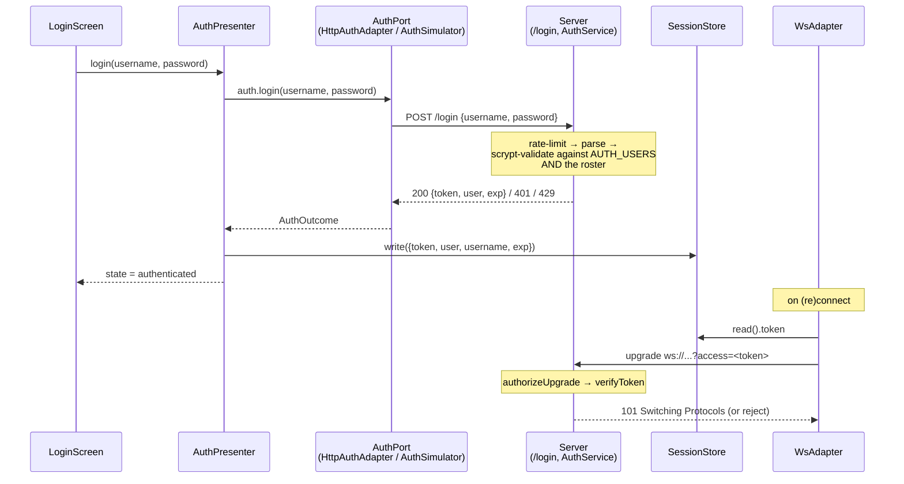

# Authentication

Genuine per-user, server-side login for both clients. There is no shared
secret anywhere in this system: each of the four roster operators signs in
with their own username and password, and the deployed web (`@rtc/client-react`)
and mobile (`@rtc/client-react-native`) clients both authenticate against the
same Fly server (with one deliberate exception since the hybrid, §6: a login
matching the committed demo roster is verified in the browser and runs the
in-browser simulators, so it never reaches the server). This replaced the old model — a single shared `SITE_PASSWORD`
wall in front of the whole app plus a static `VITE_WS_TOKEN` gating the
WebSocket — which no longer exists anywhere in this repo.

## 1. Overview

- **No shared secret.** The server's `AUTH_USERS` roster (a Fly secret,
  `"user:pass,user2:pass2"`) is the only source of real credentials. Signing
  in exchanges a username/password for a short-lived, per-user session token;
  nothing is gated by a single app-wide password anymore.
- **Server-issued, stateless tokens.** `AuthService`
  (`packages/server/src/auth/AuthService.ts`) validates credentials with
  `scrypt` + `timingSafeEqual` and, on success, signs an HMAC token
  (`packages/server/src/auth/token.ts`) carrying the username and an
  expiry — no server-side session table to manage.
- **Same flow, two transports.** In "WS-real" mode (a real server configured)
  both clients call the identical `POST /login` HTTP endpoint via
  `HttpAuthAdapter` (`packages/client-core/src/adapters/HttpAuthAdapter.ts`).
  In simulator mode (no server configured) each client instead uses the
  in-process `AuthSimulator` (`packages/domain/src/simulators/AuthSimulator.ts`),
  which validates against the same public roster plus locally-supplied dev
  credentials — no network call, no real security boundary.
- **Public roster, private passwords.** The four operator identities
  (`packages/domain/src/auth/roster.ts`) are checked into the repo — they are
  just display data (name, initials, role, desk, clearance). Passwords are
  never checked in anywhere; see [§4](#4-configuring-passwords--per-platform).

## 2. How it works end to end


```mermaid
sequenceDiagram
    participant UI as LoginScreen
    participant P as AuthPresenter
    participant Port as AuthPort<br/>(HttpAuthAdapter / AuthSimulator)
    participant Srv as Server<br/>(/login, AuthService)
    participant Store as SessionStore
    participant WS as WsAdapter

    UI->>P: login(username, password)
    P->>Port: auth.login(username, password)
    Port->>Srv: POST /login {username, password}
    Note over Srv: rate-limit → parse →<br/>scrypt-validate against AUTH_USERS<br/>AND the roster
    Srv-->>Port: 200 {token, user, exp} / 401 / 429
    Port-->>P: AuthOutcome
    P->>Store: write({token, user, username, exp})
    P-->>UI: state = authenticated

    Note over WS: on (re)connect
    WS->>Store: read().token
    WS->>Srv: upgrade ws://...?access=<token>
    Note over Srv: authorizeUpgrade → verifyToken
    Srv-->>WS: 101 Switching Protocols (or reject)
```

1. **`LoginScreen` → `useAuth().login(username, password)`.** Both clients'
   `LoginScreen` (`packages/client-react/src/ui/shell/auth/LoginScreen.tsx`,
   `packages/client-react-native/src/ui/shell/auth/LoginScreen.tsx`) are dumb
   forms: typed credentials live only in local component state, are never
   logged, and are handed straight to `useAuth().login` from the `useViewModel()`
   seam. The two web clients also render a **demo-accounts hint** under the
   form (`DemoAccountsHint`): one click-to-fill row per account the page
   verifies in the browser, plus the password when every account shares it.
   The list comes from `readDemoAccounts()` in each web client's
   `buildBrowserPorts.ts` through `useDemoAccounts()` — the simulator's
   roster with no server URL, the `VITE_DEMO_AUTH` roster on a hybrid build,
   and nothing on a plain live build, where every credential belongs to the
   server. Picking a row fills the fields and moves keyboard focus to AUTHENTICATE;
   it does not sign in.
2. **`AuthGate` renders `LoginScreen` until authenticated.** `AuthGate`
   (`packages/client-react/src/ui/shell/auth/AuthGate.tsx`,
   `packages/client-react-native/src/ui/shell/auth/AuthGate.tsx`) reads
   `useAuth().state.status`; anything other than `"authenticated"` (i.e.
   `"unauthenticated"` or `"authenticating"`) renders `LoginScreen` instead of
   the app's `children`.
3. **`AuthPresenter.login`** (`packages/client-core/src/presenters/AuthPresenter.ts:73-84`)
   flips state to `"authenticating"` and calls the injected `AuthPort`.
4. **The `AuthPort`** is one of:
   - `HttpAuthAdapter` (`packages/client-core/src/adapters/HttpAuthAdapter.ts`) —
     `POST {httpBaseUrl}/login` with `{ username, password }`, used whenever a
     real server URL is configured. `wsUrlToHttpBase` derives the HTTP base
     from the WS URL by swapping only the scheme (`ws://`→`http://`,
     `wss://`→`https://`).
   - `AuthSimulator` (`packages/domain/src/simulators/AuthSimulator.ts`) —
     in-process, used in simulator mode. Validates the username against the
     public `ROSTER` and the password against an injected `DevCredentials` map;
     issues a cosmetic `sim.<username>.<id>` token (there is no real WS to gate
     in simulator mode).
5. **On the server, `authenticateLoginRequest`** (`packages/server/src/http/loginHandler.ts`)
   runs, in order: **ban check** (`BanList.bannedUntil`,
   `packages/server/src/auth/banList.ts` — a banned IP gets `429
   {"error":"banned"}` with `Retry-After` before anything else is read) →
   **rate-limit** the caller's IP (`RateLimiter.hit`, 10 requests/60s, table
   evicts expired windows and is bounded, `packages/server/src/auth/rateLimit.ts`;
   a `429` here is a ban strike) → **parse** the JSON body (`isLoginRequestDto`;
   the body itself was capped at 4 KiB by bytes received before this ran —
   `413` past it) → **`AuthService.login`**
   (`packages/server/src/auth/AuthService.ts`), which **asynchronously**
   scrypt-hashes the supplied password (off the event loop; an unknown username
   hashes against a dummy salt so it costs the same time) against the salted
   digest built from `AUTH_USERS` at startup (`timingSafeEqual`, so no
   early-exit timing leak; a `401` is a ban strike) **and** requires
   the username to resolve via `findRosterUser` — a valid password for a
   username missing from the roster still fails login. On success it signs a
   token via `signToken(username, secret, ttlMs, now)`
   (`packages/server/src/auth/token.ts:16-25`) — an HMAC-SHA256 over a
   base64url-encoded `{ u: username, exp: now + ttlMs }` payload, TTL default
   **8 hours** (`AUTH_TTL_MS` in `packages/server/src/index.ts`).
6. **Fail-fast on misconfiguration.** `AuthService`'s constructor throws
   `"AUTH_SECRET must be set when AUTH_USERS is configured"`
   (`AuthService.ts:45-47`) if `AUTH_USERS` has entries but `AUTH_SECRET` is
   empty — a deploy can never silently serve unsigned/unverifiable tokens.
7. **The client stores the session.** On a `{ ok: true, token, user }`
   outcome, `AuthPresenter.commitLoginOutcome` writes
   `{ token, user, username, exp }` to the injected
   `SessionStore` (`packages/client-core/src/adapters/sessionStore.ts`) —
   `exp` is the expiry the `AuthPort` reported (the server's real token expiry,
   or the simulator's `now() + ttlMs`), persisted verbatim rather than
   recomputed from a client-side TTL — and flips state to `"authenticated"`.
8. **The WebSocket connects with the token.** `WsAdapter` reads
   `sessionStore.read()?.token` fresh on every (re)connect and appends it as
   `?access=<token>` to the WS URL (both `buildBrowserPorts.ts` and
   `buildNativePorts.ts` wire this identically). The server's `verifyClient`
   hook, `authorizeUpgrade` (`packages/server/src/http/loginHandler.ts`),
   rejects the upgrade outright on a missing URL, a missing `access` param, or
   a token that fails `AuthService.verifyToken` (bad signature, wrong secret,
   or expired) — there is no open-when-empty fallback.
9. **Resume on boot.** `AuthPresenter`'s constructor calls `resume()`
   (`AuthPresenter.ts:55-70`): if the `SessionStore` holds an entry whose `exp`
   is still in the future, the presenter starts already `"authenticated"` with
   that user; otherwise it clears the stale entry and starts
   `"unauthenticated"`. (The web `LocalStorageSessionStore` persists across
   reloads; the RN `InMemorySessionStore` does not survive an app relaunch, so
   mobile always shows `LoginScreen` on cold start — see
   [§4](#4-configuring-passwords--per-platform).)
10. **Lock and re-auth.** `AuthPresenter.lock()` sets `locked: true` on an
    authenticated session (a no-op otherwise); `unlock(password)` re-runs the
    exact same `AuthPort.login` flow for the *current* username and, on
    success, refreshes the stored session and clears the lock — this is a
    genuine password re-check against the server/simulator, not a cosmetic
    toggle. `LockScreen` (`packages/client-react/src/ui/shell/lock/LockScreen.tsx`)
    renders `null` unless `state.locked`, and its `AUTHENTICATE ▸` button
    submits a form that calls `unlock(password)`.
11. **Logout.** `AuthPresenter.logout()` clears the `SessionStore` and returns
    to `UNAUTHENTICATED_STATE`, dropping back to `LoginScreen` via `AuthGate`.
    The web `AccountMenu` (`packages/client-react/src/ui/shell/chrome/AccountMenu.tsx`)
    exposes both **⏻ LOCK SESSION** (`lock()`) and **⏻ SIGN OUT** (`logout()`)
    rows, alongside the account's identity (name, email, trader id, desk,
    clearance) read straight from `useAuth().state.user`.

## 3. The four roster users → the profile dropdown

The public roster (`packages/domain/src/auth/roster.ts`) drives the identity
shown once signed in — the account avatar/initials, the `LockScreen` operator
card, and the web `AccountMenu` panel all read this data verbatim from
`state.user`:

| Username | Name | Initials | Role | Trader ID | Email | Desk | Clearance |
|---|---|---|---|---|---|---|---|
| `astark` | Anthony Stark | AS | Senior FX Trader | TRD-0042 | a.stark@reactivetrader.io | G10 Spot · London | LEVEL 4 · FULL |
| `nromanoff` | Natasha Romanoff | NR | Credit Trader | TRD-0071 | n.romanoff@reactivetrader.io | Credit · London | LEVEL 3 · DESK |
| `tchalla` | T'Challa | TC | Head of Equities | TRD-0007 | t.challa@reactivetrader.io | Equities · New York | LEVEL 5 · FULL |
| `demo` | Demo Operator | DO | Read-Only Guest | TRD-0000 | demo@reactivetrader.io | Demo · Cloud | LEVEL 1 · VIEW |

Notes:

- **The username is the roster key** that drives the displayed identity —
  `findRosterUser(username)` (`roster.ts:61-65`) looks the entry up by exact
  match on `entry.username`.
- **The password is validation-only and never displayed.** It lives entirely
  in `AUTH_USERS` (server) or a dev-credentials map (simulator) — never in
  `ROSTER`, never rendered anywhere in the UI, never logged (`HttpAuthAdapter`,
  `AuthSimulator`, and `AuthPresenter` all say so in their own doc comments).
- **A username not in the roster always fails login**, even with a password
  that would otherwise match — both `AuthService.login`
  (`AuthService.ts:81-85`) and `AuthSimulator.login` (`AuthSimulator.ts:19-25`)
  require a `findRosterUser` hit in addition to the credential check.
- **`role` and `clearance` are display-only.** There is no per-role
  authorization anywhere in this Phase-1 implementation — every signed-in user
  sees and can do the same things regardless of their `role`/`clearance`
  string; those fields exist purely for the HUD's identity chrome.
- **Adding a user** requires two separate edits, in two separate places, by
  design: (1) add a `RosterEntry` to `ROSTER` in `roster.ts` — this is code,
  committed to the repo, since profiles are public — and (2) add a matching
  credential to `AUTH_USERS` (deployed / local full-stack) and/or a
  dev-credentials map (simulator). For this **demo app** the local credentials
  are committed (`.env.development` + the `dev:*` scripts, see §5); the deployed
  password is a Fly `AUTH_USERS` secret. A roster entry with no credential can
  never log in; a credential for a username with no roster entry also can never
  log in.

## 4. Configuring passwords — per platform

Credentials are configured independently per platform. **Nothing in this repo
holds a real deployed password** — every checked-in file uses a placeholder.

### Fly (`@rtc/server`) — the source of truth for deployed credentials

The Fly-hosted server is the only place real credentials exist, and they are
set **by hand** as Fly secrets (never through the deploy workflow, which only
has a code-deploy token):

```bash
fly secrets set AUTH_SECRET="$(openssl rand -hex 32)" -a rtc-clone-server
fly secrets set AUTH_USERS="astark:<pw>,demo:<pw>" -a rtc-clone-server
# optional — defaults to 8h:
fly secrets set AUTH_TTL_MS="28800000" -a rtc-clone-server
```

Only usernames present in `ROSTER` can ever log in, regardless of what's in
`AUTH_USERS` (§3). See [`docs/DEPLOY.md`](DEPLOY.md#1-flyio-server) for the
full one-time setup.

### Vercel (web client host) — holds no passwords

The old `SITE_PASSWORD` edge wall and `VITE_WS_TOKEN` are gone entirely.
Vercel needs exactly one auth-adjacent variable:

```
VITE_SERVER_URL = wss://rtc-clone-server.fly.dev
```

so the deployed client knows where to `POST /login` and open its WebSocket.
The second auth-adjacent value the deployed client carries, the demo roster
(`VITE_DEMO_AUTH`), is not a Vercel variable at all: it is baked from the
committed `.env.production`. Together they make the deployed build **hybrid**
(§6): credentials matching the demo roster are verified in the browser and
never reach any server; every other login authenticates live against the Fly
server's own `AUTH_USERS`. Vercel itself never sees or stores a credential.

### React Native (`@rtc/client-react-native`)

- **Live mode** (a real server URL configured) bakes **no credential** into
  the app at all: `buildNativePorts.ts` wires `HttpAuthAdapter` against the
  same deployed server, so signing in on-device means signing in with a real
  `AUTH_USERS` credential — ask the team for one.
- **Simulator mode** (the in-app `Sim` toggle, or no server configured) uses
  `EXPO_PUBLIC_DEV_AUTH` — a JSON `username -> password` object, parsed by
  `nativeAuthConfig.ts`'s `parseDevAuth` into `DEV_CREDENTIALS`. If that
  variable is unset, empty, or malformed, it falls back to a built-in map of
  all four roster usernames at the shared password `"mcdc2026"`
  (`FALLBACK_DEV_CREDENTIALS`, `nativeAuthConfig.ts:19-24`) — so the offline
  simulator always has a working login with zero env configured. This never
  reaches a deployed server; it is simulator/local-only.

`EXPO_PUBLIC_*` variables are inlined into the JS bundle at Metro start, not
hot-reloaded — after editing `.env` you must restart Metro
(`pnpm dev:ios`), not just reload in-app.

### Local web dev (`pnpm dev`, simulator mode)

`packages/client-react/.env.development` is **committed** with the demo roster,
so a fresh clone signs in out of the box — no setup. Vite loads it in dev only
(never in a production build). Sign in as any roster user — `astark`,
`nromanoff`, `tchalla`, or `demo` — with password `mcdc2026`.

Without `VITE_SERVER_URL` set, `buildBrowserPorts.ts` takes the simulator branch
and parses `VITE_DEV_AUTH` via its own `parseDevAuth`, tolerant of a
missing/malformed value (degrading to "no dev logins work" rather than a boot
crash) — unlike the RN client it has no built-in fallback roster in code, so
the committed `.env.development` is what makes web logins work locally. To use
your own credentials instead, override `VITE_DEV_AUTH` in an untracked
`.env.local` (Vite gives `.local` files precedence).

Full-stack local dev (`dev:react:fs` / `dev:ws`) is WS-real, so it ignores
`VITE_DEV_AUTH` and authenticates against the **server's** `AUTH_USERS` instead
— a different format, `"user:pass,..."`, plus `AUTH_SECRET`. The `dev:ws` /
`dev:*:fs` scripts bake in the same demo roster, so full-stack also works out of
the box.

`@rtc/client-solid` (`pnpm dev:solid`) follows the identical mechanism: its own
committed `packages/client-solid/.env.development` carries the same
`VITE_DEV_AUTH` value, and its `buildBrowserPorts.ts` reads it via the same
`parseDevAuth` helper as `client-react` — the two web clients are at full
parity here, not just visually and behaviourally.

## 5. What's committed vs. what stays secret

This is a **demo app**, so the demo *login* credentials are intentionally
committed — the roster password (`mcdc2026` for `astark` / `nromanoff` /
`tchalla` / `demo`) lives in `packages/client-react/.env.development` and
`packages/client-solid/.env.development` (simulator, both web clients), in
each web client's committed `.env.production` (`VITE_DEMO_AUTH`, the same JSON
format — the roster a **production** build inlines so the deployed hybrid
build can verify demo logins in the browser, §6), and in the `dev:ws` /
`dev:*:fs` scripts' `AUTH_USERS` (full-stack). They're throwaway and
rotatable: change the password in those places (and the Fly `AUTH_USERS`
secret) if it ever matters.

What still stays **out of version control** is the thing that actually protects
the deployed app: the server's **`AUTH_SECRET`** — the HMAC key that signs and
verifies session tokens. It's a Fly secret set by hand (dev uses a throwaway
`dev-local-secret` in the scripts). Public demo logins only let someone sign in
as the roster's `Read-Only Guest`; without `AUTH_SECRET` nobody can forge a
token. The `.env.example` templates still ship placeholder values, and an
untracked `.env.local` overrides the committed demo creds. See
[`docs/env-files.md`](env-files.md) for the full inventory of every `.env*`
file, and [`docs/DEPLOY.md`](DEPLOY.md) for the deploy-time setup walkthrough.

## 6. Hybrid data source (one deployment, two modes)

Since 2026-10-01 the deployed web build is **hybrid**: one deployment, and the
**login decides the data source** (hardening spec §8, linked below).

- Credentials that match the committed **demo roster** are verified in the
  browser, and the app runs on the in-browser simulators with the scripted
  Jarvis. Nothing is sent to any server.
- Any other credentials are posted to the server's `/login`. On success the app
  runs on the real WebSocket transport with real, metered AI.

The criterion is **credential match** (username *and* password equal a demo
entry), not username membership. A demo username with a non-demo password is a
server login. That keeps every existing full-stack dev and e2e flow working,
whose server roster is `demo:demo`, while the bundle's demo entry is
`demo:mcdc2026`.

### 6.1 Composition

The client composes its ports once per page load, before the login screen
(`AppRoot` → `buildBrowserPorts()`). The hybrid therefore chooses the port set
**at load**, from a stored choice, exactly as the load-time core switch does
(ADR-006 Decision 6):

| `VITE_SERVER_URL` | `VITE_DEMO_AUTH` | Composed | Behaviour |
|---|---|---|---|
| empty | any | **sim** | Today's simulator mode. The roster is `VITE_DEV_AUTH` ∪ `VITE_DEMO_AUTH`. This is also the Track A fallback build. |
| set | empty | **live** | Today's WS-real mode, byte for byte. Every `dev:*:fs`, `dev:*:ws:*` and e2e flow lands here, because `.env.development` carries no `VITE_DEMO_AUTH`. |
| set | set | **hybrid** | The stored choice (`localStorage["rtc.dataSource"]`, `"sim"` or `"live"`) decides. Absent choice: `live` when a stored session exists (a pre-hybrid live session), else `sim`. |

`VITE_DEMO_AUTH` is committed in each web client's `.env.production`, so only a
production build with a server URL is hybrid. The deploy workflow asserts the
roster was inlined, next to its existing server-URL guard.

In a hybrid page the `auth` port is a **routing port** (`createRoutingAuthPort`
in `@rtc/client-core`): it tries the demo roster first (synchronously, in the
browser), then the server. The demo roster never leaves the browser because the
server attempt only runs after the local match has failed.

### 6.2 Reload dynamics

A reload happens **only on a mode change**, triggered by a successful login,
never by boot.

1. **Boot.** No stored choice, so the client composes **sim** and shows the
   login screen.
2. **Demo login.** Local match succeeds; the composed mode already matches.
   The routing port writes the choice (`sim`) and emits the outcome. No
   reload. The app renders at once.
3. **Registered login.** Local match fails; `/login` succeeds. The target is
   `live`, the page is composed `sim`, so the routing port **writes the
   session and the choice, calls `relaunch()` (a `location.reload()`), and
   never emits** (a pending observable, not a completed one: the async and
   Effect cores treat "completed without a value" as an error). The login
   screen stays in its "authenticating" state for the few milliseconds until
   the page unloads.
4. **After the reload.** The client reads the stored choice, composes
   **live**, and `AuthPresenter.resume()` restores the session from storage,
   so no login screen is shown; the WebSocket opens with the stored token. The
   boot splash replays on this load (D8).
5. **Next visit on that device.** Stored choice is `live`, so boot composes
   live directly. No reload.
6. **Logout.** Clears the session; the choice stays. The next login decides
   afresh, so a demo login on a live-composed page relaunches back into sim
   (step 3 mirrored).
7. **Unlock (lock screen).** Re-authenticates with the same username. Same
   credentials → same target → no reload.

Two consequences to know about:

- **The cinematic login wait is cut short on a mode change.** The wait
  (`withLoginDelay`) wraps the routing port, so the relaunch fires when the
  outcome is known, before the delay would have delivered it. A mode change
  happens once per device, and the reload plays the splash, which takes the
  wait's place.
- **Why not swap ports without a reload.** Presenters subscribe to their ports
  at construction, and the core contract suites assert construction-time port
  counts (`portDiscipline`). Swapping implementations under running presenters
  would break the equivalence guarantee across all three cores. A reload keeps
  the one composition root honest.

The console line `[data] composed <sim|live> from <reason>` says which rule
won, mirroring `[core] booted …`.

### 6.3 Where the pieces live

- `resolveDataSource` and `createRoutingAuthPort` — `@rtc/client-core`
  (framework-free; `location.reload()` is injected by each client as
  `relaunch`).
- The composition, the `VITE_DEMO_AUTH` parsing and the `rtc.dataSource`
  store — each web client's `src/app/buildBrowserPorts.ts`
  (`client-react`, `client-solid`, identical).
- The committed roster for production builds — `packages/client-react/.env.production`
  and `packages/client-solid/.env.production` (inventory in
  [`docs/env-files.md`](env-files.md)); the deploy-time guard that the roster
  was inlined — [`docs/DEPLOY.md`](DEPLOY.md).
- The full design, invariants and what is deliberately not in this slice —
  [hardening spec §8](superpowers/specs/2026-09-27-public-launch-hardening-design.md#8-hybrid-data-source-revision-2026-09-29-built-2026-10-01).
