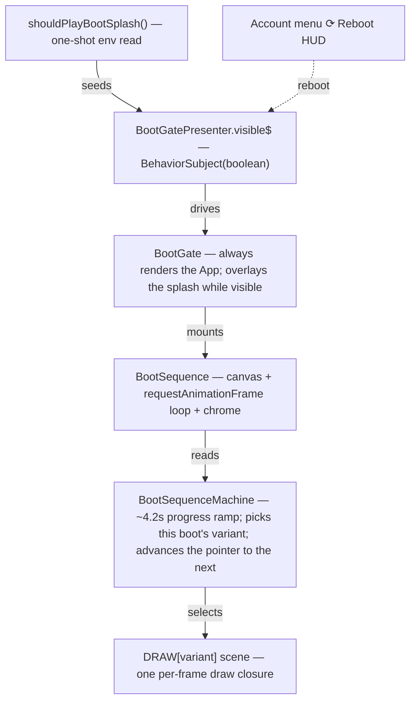
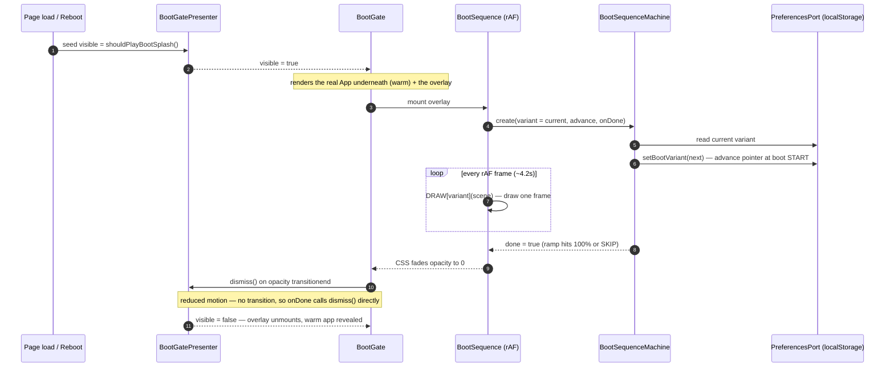
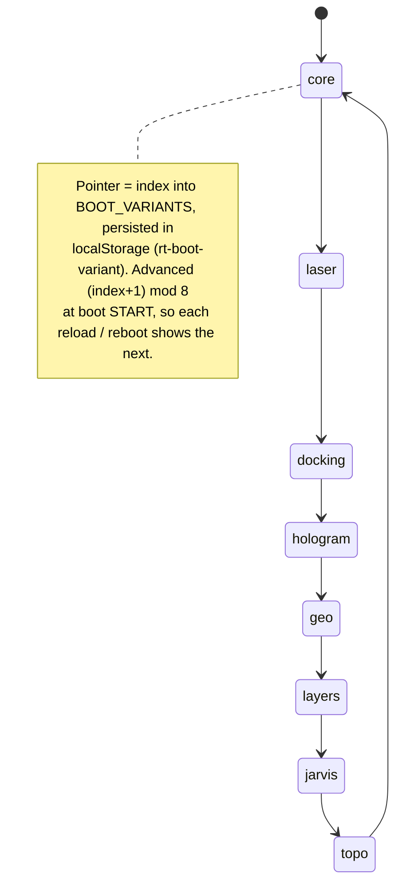
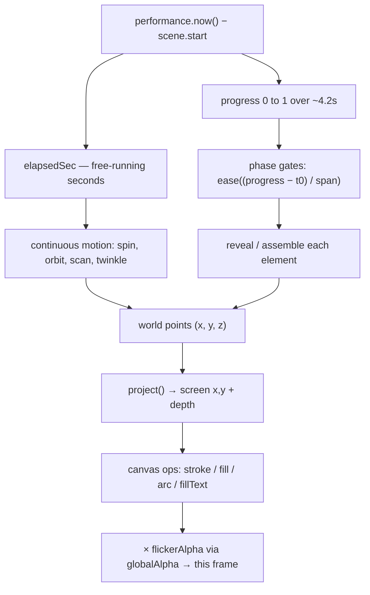
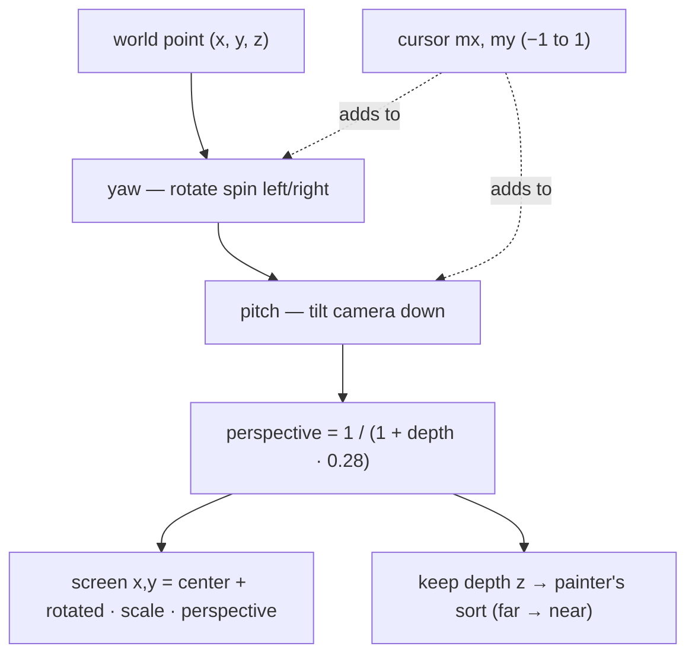

# The Boot-Splash Animations

A walkthrough of the full-screen "boot sequence" splash that plays over the
warm app on every load — how it is wired, how it **remembers which animation to
show next**, and, for each of the eight scenes, **how the graphical effect is
actually drawn** on a 2D `<canvas>`: the fake 3D, the cursor-tracked camera, the
self-tracing coastlines, the marching-squares topography, and the rest.

This is the reading companion to the code under `packages/boot-splash/src/` —
the shared `@rtc/boot-splash` package, consumed by both web clients
(`client-react`, `client-solid`), that owns the canvas draw engine, the
suppression gate, and the boot chrome's CSS. The canvas draw code was ported
"verbatim" from a design prototype and originally used one- and two-character
names (`d`, `t`, `k`, `P`, `ac2`, `ga`, …). Those have since been renamed to
intention-revealing names — this doc uses the **new** names throughout, so you
can read the doc and the source side by side.

> **Where the plumbing lives.** The orchestration (visibility, the state
> machine, dismissal) is documented in depth in
> [§17.4 The Boot Splash](architecture/17-web-client-up-close.md#174-the-boot-splash)
> and [§14.3 Boot Sequences](architecture/14-composition-and-wiring.md#143-boot-sequences).
> This doc recaps just enough of that to orient you, then spends its length on
> the rendering, which those sections intentionally don't cover.

---

## 1. The big picture

The splash is an **overlay**, not a loading screen. The real `<App/>` mounts
*underneath* it on the very first render — streams already flowing — and the
splash is a `<canvas>` plus some chrome sitting on top. Dismissing it just
reveals an app that was live the whole time; nothing waits for the animation.



The same lifecycle laid out over *time* — from page load to the overlay fading
out — as a sequence:



(The composition-wiring view of this same boot lives in
[§14.3](architecture/14-composition-and-wiring.md#143-boot-sequences); the one
above is the splash's own lifecycle — variant selection, the draw loop, and
dismissal.)

Key facts that surprise people:

- **One boot shows exactly one scene.** It is *not* a globe-then-laser-then-…
  reel. `DRAW[state.variant]` is read once per mount and the rAF loop calls that
  single closure every frame (`BootSequence.tsx`). Which scene you get is
  decided by the pointer described in §2.
- **The canvas is optional.** Under `prefers-reduced-motion: reduce`, or in
  jsdom / any environment with no 2D context, `BootSequence` skips the canvas
  entirely and only renders the chrome. The state machine still completes, so
  the splash still dismisses. (That's why there are no rendering tests — jsdom
  never runs a frame.)
- **The splash is suppressed for automation.** `shouldPlayBootSplash()` returns
  `false` under `navigator.webdriver` (every Playwright/Cypress load) or when
  the URL has `?nosplash`. So the visual goldens and e2e never see it.

---

## 2. How it remembers which animation is next

This is the part colleagues ask about most, and it's simpler than it looks.

**The cycle order is a fixed list in the domain layer.**
`BOOT_VARIANTS` (`packages/domain/src/preferences/preferences.ts`) is:

```
core → laser → docking → hologram → geo → layers → jarvis → topo → (wraps to core)
```

**The current position is a persisted preference.** The chosen variant is stored
like any other user preference — `PreferencesPort.bootVariant$()` /
`setBootVariant()`, backed by `LocalStoragePreferencesAdapter` (key
`rt-boot-variant` — the `BOOT_VARIANT_STORAGE_KEY` constant in
`packages/client-react/src/app/adapters/LocalStoragePreferencesAdapter.ts`,
mirrored verbatim by the RN client's `AsyncStoragePreferencesAdapter.ts`; not
the design prototype's original `localStorage['rt_bootSeq']`, which this key
deliberately does not reuse). Because it's in `localStorage`, the pointer
survives a real page reload, not just a React remount.
`BootPreferencePresenter.current()` reads it synchronously (safe: the port is
`BehaviorSubject`-backed and emits its current value on subscribe).

**The pointer advances at the *start* of each boot, not the end.** When
`createBootSequenceMachine` is constructed (once per splash mount), it does two
things immediately, before the progress ramp starts
(`packages/client-core/src/presenters/BootSequenceMachine.ts`):

```ts
const variant = deps.variant;                                   // this boot's scene
const nextIdx = (BOOT_VARIANTS.indexOf(variant) + 1) % BOOT_VARIANTS.length;
deps.advance(BOOT_VARIANTS[nextIdx]);                           // persist the NEXT scene
```

So the moment a boot begins, the stored pointer already names the *next* scene.
Reload (or hit the Account menu's **⟳ Reboot** row, which calls `reboot()` and
remounts `BootSequence`) and you get the next one; after `topo` it wraps back to
`core`. There is no timer, no randomness, and no server involvement — just
`indexOf + 1 mod length` over a list, persisted in `localStorage`.



**Progress is derived, not wall-clock-timed per scene.** The machine runs a
90 ms `timer` and computes `progress = round(tickIndex / totalTicks * 100)` over
`BOOT_DURATION_MS = 4200`. When `progress` hits 100 (or `SKIP ▸` fires, which
jumps straight to `done`), the machine's `onDone` runs once and the overlay
fades out. The draw functions read this same ~4.2 s clock to sequence their
phases (§3.2).

---

## 3. The shared rendering toolkit

All eight scenes are plain **Canvas 2D**. No WebGL, no Three.js — the "3D" is
hand-rolled projection math. Five of the scenes share a common toolkit; learn it
once and every scene becomes readable.

### 3.1 The factory / frame split

Each scene is a **factory** that runs once per boot and returns a **frame
closure** that runs every rAF tick:

```ts
export function createBootCore(scene: BootDrawCtx): BootFrameFn {
  // ── factory body: runs ONCE. Precompute expensive static geometry here:
  //    star field, hub nodes, coastline polylines, the heightfield + contours…
  return () => {
    // ── frame body: runs EVERY frame. Cheap per-frame work: project + draw.
  };
}
```

`BootSequence.tsx` owns the actual `requestAnimationFrame` loop and calls the
returned closure each frame. This split matters: the topo scene, for instance,
precomputes a 52×36 heightfield and eleven marching-squares contour levels in the
factory so the frame closure only has to *project and stroke* them.

`scene` (typed `BootDrawCtx`) is the per-boot context every scene receives:

| field | meaning |
|-------|---------|
| `scene.canvas`, `scene.ctx` | the `<canvas>` and its 2D context |
| `scene.start` | `performance.now()` captured at loop start — the scene's time origin |
| `scene.accent`, `scene.accentAlt` | theme colours (`--accent-primary`, `--accent-2`), read once from CSS |
| `scene.buy`, `scene.sell` | positive/negative colours (`--accent-positive/-negative`) |
| `scene.pointer` | `{ mx, my }` — live cursor position, normalized to −1..1 per axis |

The whole frame closure is one dataflow — two clocks fan out into continuous
motion and phase-gated reveals, which build world points, which get projected and
drawn. The subsections below detail each box:



### 3.2 Two clocks: `elapsedSec` and `progress`

Every frame derives two numbers from `scene.start`:

```ts
const elapsedSec = (performance.now() - scene.start) / 1000;         // free-running seconds
const progress   = Math.min(1, (performance.now() - scene.start) / BOOT_DURATION_MS); // 0..1 over ~4.2s
```

- **`elapsedSec`** drives *continuous* motion — spin, orbits, twinkle, jitter,
  scan sweeps. It keeps counting up forever.
- **`progress`** drives the *one-shot storyline* — the 0→1 arc of the boot. Every
  "reveal" is gated on `progress` so the scene assembles over the ~4.2 s and is
  fully formed by the end.

### 3.3 Easing and phase-gating

The reveal choreography is built almost entirely from one pattern: take a
sub-window of `progress`, normalize it to 0..1, and ease it:

```ts
ease(k) = 1 - (1 - clamp(k))**3;          // cubic ease-out (shared helper)

const ringsPhase = ease((progress - 0.18) / 0.25);   // 0 until 18%, eased 1 by 43%
```

`ringsPhase` is 0 before the window, ramps smoothly through it, and saturates at
1 after — so "the gyroscope rings fade in between 18 % and 43 % of the boot"
becomes a single expression. Scenes stack a dozen of these with staggered
windows to sequence meridians → parallels → rings → nodes → arcs, each named for
what it gates (`meridianPhase`, `nodesPhase`, `routePhase`, `assemblePhase`, …).

A staggered *cascade* is the same idea per-item: `clamp(reveal * COUNT - i)` lights
item `i` slightly after item `i-1`, so a row of panels or a ring of nodes draws
in one-by-one.

### 3.4 Colour and the hologram flicker

`hexToRgba(hex, alpha)` turns a theme colour + an opacity into an `rgba(...)`
string — the scenes lean on it constantly to fade elements by depth or phase.

Most scenes also multiply their whole frame's alpha by a **flicker**:

```ts
let flickerAlpha = 0.88 + 0.12 * Math.sin(elapsedSec * 36 + Math.sin(elapsedSec * 9) * 4);
if (hashRandom(Math.floor(elapsedSec * 6) + seed) > 0.94) flickerAlpha *= 0.55; // random dropout
ctx.globalAlpha = flickerAlpha;
```

That's the "unstable hologram" shimmer: a fast wobble plus occasional hard
dropouts, applied via `ctx.globalAlpha` to everything drawn that frame.

### 3.5 Deterministic randomness: `hashRandom`

Scenes never call `Math.random()`. They use a sine-hash:

```ts
function hashRandom(i) {          // deterministic pseudo-random in [0,1)
  const x = Math.sin(i * 127.1 + 311.7) * 43758.5453;
  return x - Math.floor(x);       // fractional part
}
```

Given the same integer seed you always get the same value, so the star field,
hub phases, particle scatter, and mote drifts are **stable across renders** —
the scene looks identical every time it plays, and (where used with a time-based
seed like `Math.floor(elapsedSec * 30)`) can still produce frame-to-frame
"noise" deterministically.

### 3.6 The fake-3D projection pipeline

This is the heart of the five 3D scenes (`core`, `hologram`, `geo`, `layers`,
`jarvis`, `topo`). Every one contains a `project(x, y, z)` helper that maps a 3D
world point to a 2D screen point. They're all variations on the same three
steps.

**Step 1 — rotate around the vertical axis (yaw).** Spin the world left/right:

```ts
const x1 =  x * cosYaw - z * sinYaw;
const z1 =  x * sinYaw + z * cosYaw;
```

**Step 2 — tilt the camera down (pitch).** Rotate the (now yawed) point around
the horizontal axis so we look down at the scene:

```ts
const y1 =  y * cosPitch - z1 * sinPitch;
const z2 =  y * sinPitch + z1 * cosPitch;   // z2 is the final view-space depth
```

**Step 3 — perspective divide.** Nearer things are bigger. Compute a single
`perspective` factor from depth and scale x/y by it:

```ts
const perspective = 1 / (1 + z2 * 0.28);    // >1 when near, <1 when far
return {
  x: centerX + x1 * projScale * perspective,
  y: centerY - y1 * projScale * perspective, // (± depends on the scene's up-axis)
  z: z2,                                       // kept for depth sorting
  perspective,                                 // kept for sizing dots/line widths
};
```

Two things every scene does with the returned point:

- **Painter's algorithm.** Before drawing a set of objects, sort them by `z`
  (far → near) and draw in that order, so near objects overlap far ones. You'll
  see `.sort((a, b) => b.point.z - a.point.z)` everywhere.
- **Depth cues.** `perspective` sizes dots and line widths; and alpha is faded
  by depth (`0.1 + 0.4 * clamp((0.55 - z) / 1.1)`) so the far side of a sphere
  is dimmer than the near side.

The whole pipeline for one point — and where the cursor plugs in (the dashed
edges, detailed in §3.7):



### 3.7 Cursor tracking (the "it follows my mouse" effect)

Three scenes (`layers`, `jarvis`, `topo`) are steered by the cursor.
`BootSequence.tsx` installs a single `mousemove` listener that normalizes the
pointer to −1..1 and writes it into the shared `scene.pointer`:

```ts
scene.pointer.mx = (event.clientX / window.innerWidth) * 2 - 1;  // −1 left … +1 right
scene.pointer.my = (event.clientY / window.innerHeight) * 2 - 1; // −1 top  … +1 bottom
```

Each cursor-tracked scene reads those and folds them into its yaw and pitch:

```ts
const pointerX = scene.pointer.mx, pointerY = scene.pointer.my;
const yaw   = 0.5 + Math.sin(elapsedSec * 0.5) * 0.2 + pointerX * 0.45; // idle drift + mouse
const pitch = 0.15 + pointerY * 0.22;
```

So the whole projected scene rotates toward wherever you move the mouse: the mouse
changes the rotation angles that step 1 and step 2 of `project()` use, and
because *every* point runs through `project()` each frame, the entire structure
re-orients as one rigid 3D object. There is no per-object mouse math — the
camera moved, so everything moved.

---

## 4. The eight scenes, one at a time

Each scene's banner text (`▸ SPINNING UP CORE ◂`, etc.) narrates its phases; the
telemetry in the corners is decorative HUD. Below is what each one *is* and the
one trick that makes it work.

### 4.1 `core` — the global market mesh (`variants/bootCore.ts`)

A rotating wireframe **globe** of the world's trading hubs.

- **The sphere** is parameterized by latitude/longitude: `projectLatLon(lat, lon)`
  turns spherical coordinates into a 3D point (`cos lat·cos lon`, `sin lat`,
  `cos lat·sin lon`) and runs it through `project()`. Twelve **meridians** and
  five **parallels** are polylines of such points.
- **The "draw-in".** `reveal = ease(progress / 0.32)` grows the meridians
  pole-to-pole; each meridian gets a bright glowing **draw-head** dot at its
  growing tip. A staggered cascade (`clamp(reveal * 12 - meridianIdx)`) makes
  them sweep in one after another.
- **Great-circle order-flow arcs.** Buy/sell trades fire hub-to-hub. An arc is a
  straight lerp between two hub vectors, **re-normalized to the sphere** and
  pushed outward by `1 + 0.28·sin(π·w)` so it bows off the surface into a proper
  arc; a bright leading segment + white head sweeps along it.
- **Gyroscope rings & hub pings.** Two counter-rotating segmented rings wrap the
  globe (a tilt+spin rotation applied before `project()`); hub nodes on the
  front face (`z < 0.12`) pulse expanding ping ripples; a spotlight labels one
  front-facing hub at a time.

### 4.2 `laser` — the UI draws itself in (`bootCanvas.ts`, `drawBootLaser`)

The app's own layout is **drawn in by a laser** tracing each panel's outline.

- **Panels** are normalized rectangles (`{ nx, ny, nw, nh }` as fractions of the
  canvas) with a start/end time window `[t0, t1]`.
- **Perimeter tracing.** For each panel, the four edges are treated as one path
  of known total length. `frac` (from the panel's time window) says how far
  along that perimeter to draw; the code walks the edges accumulating length
  until it has drawn `frac × perimeter`, interpolating the final partial edge —
  that's the moving laser point, capped with a glowing **draw-head** and a
  tether line to an off-screen emitter.
- **Content fills in.** Once a panel's outline completes, its mock content
  (header bars, chart squiggles, list rows, blotter grid) **scales up** from
  32 % via `ctx.translate/scale` around the panel centre, faded in by an eased
  factor.

### 4.3 `docking` — spacecraft docking HUD (`bootCanvas.ts`, `drawBootDocking`)

A camera-shaking **docking-target** reticle converging on lock, styled as an
EUR/USD "escort".

- **Camera shake.** Everything is drawn inside a `ctx.translate(jitterX, jitterY)`
  where the jitter is a sum of sines scaled by `(1 - easedProgress)` — violent at
  the start, settling to near-zero as the boot completes.
- **Approach.** The target reticle radius grows `12 → ~104 px` with progress; a
  wobble term (also `× (1 - easedProgress)`) makes it drift then steady.
- **Lock choreography.** Corner brackets tighten from a loose box onto the target
  (`box = radius·1.45 + (1 - lockPhase)·…`); a dashed rotating ring spins while
  "acquiring"; the status banner steps `ACQUIRING → TRACKING → TARGET LOCKED →
  DOCKING SEQUENCE → CLAMP ENGAGED` at fixed `progress` thresholds, blinking
  while acquiring. Range/closure/bearing readouts count down off the same clock.

### 4.4 `hologram` — volumetric market core (`variants/bootHologram.ts`)

A 3D **bar-column grid** that assembles from scattered particles inside a rising
light cone.

- **Particle assembly.** Each of the 9×9 columns has a random scatter origin
  (`startX/startY/startZ`) and a grid destination. Its per-column phase
  `assemblePhase` lerps its particle from scatter → destination
  (`start + (dest - start) * u`); once `assemblePhase` passes ~0.55 the column
  stops being a flying dot and **rises** as a vertical bar with a diamond cap.
- **Depth ordering.** Columns are painter-sorted by projected `z` so the grid
  reads as a solid volume; "hot" columns (tall ones) use `accentAlt`.
- **Set dressing.** A light cone (linear gradient) rises from an emitter pad of
  concentric rings; gyroscope rings and rising dust motes orbit; three callout
  panels (FX CORE / RISK GRID / ORDER FLOW) float on leader lines to specific
  columns.

### 4.5 `geo` — EMEA tactical map (`variants/bootGeo.ts`)

A hand-drawn **Western-Europe coastline** map with terrain and city order-flow.

- **Coastlines that trace themselves.** The coastline tables are `[lon, lat]`
  arrays converted to plane coordinates by `lonLatToPlane`. A global "how many
  vertices may I draw yet" budget (`ok = ease(progress / 0.3)` × total vertices)
  is spent polyline-by-polyline, so the outlines *grow* — each unfinished
  polyline gets a glowing head dot at its current tip. Each line is stroked
  twice: a fat translucent "glow" pass then a thin bright "core" pass.
- **Point-in-polygon clipping.** A ray-cast `inside(X, Z)` test clips
  the graticule chords, the radar sweep line, and the terrain dot-mesh to the
  actual land — so grid lines and mountains only appear *on* the continent.
- **Terrain & trades.** Mountain ranges are Gaussian bumps (`0.22·exp(-r²/…)`
  for the Alps, etc.) sampled on a dot grid that rises out of the plane. Trades
  arc **city-to-city** on a parabola (`y = groundY - 4·lift·v·(1-v)`), buy/sell
  coloured, with a comet head and a landing ripple.

### 4.6 `layers` — the UI exploded into z-layers (`variants/bootLayers.ts`)

The app's layout shown as **DevTools "3D layers"**: seven panels floating at
different depths, one pulling toward the camera at a time. Cursor-tracked.

- **Explode & recomposite.** `spread = explodePhase × (1 - recompositePhase)`
  drives each panel's z-offset from its flat `z` value: 0 at the start, spread
  out in the middle, back to flat at the end. Panels are painter-sorted each
  frame.
- **Ghost frames + tethers.** Each exploded panel leaves a dashed **ghost** of
  its flat position, with corner **tether** lines connecting the floating panel
  back to that ghost — the "this moved from here" DevTools look.
- **The pull-out cycle.** A rotating index (`pulledIdx` from `elapsedSec`) picks
  one panel every ~1.05 s and yanks it toward the camera (`pullAmount =
  sin(π·phase)`), adding a glow, a scan-sweep line, and a Z-depth callout.
- **Cursor camera.** `yaw`/`pitch` fold in `pointerX`/`pointerY` (§3.7), so the
  whole stack tilts toward the mouse.

### 4.7 `jarvis` — the schematic core (`variants/bootJarvis.ts`)

The densest scene: a wireframe **core sphere** inside six concentric **ring
machineries**, radial spokes, and 14 floating "blueprint fragments". Fully
cursor-tracked.

- **Ring machinery.** Six rings each have a *kind* (`ticks`, `segs`, `dash`,
  `pads`, `arcs`, `ruler`) drawn by a shared polar helper `projectPolar(angle,
  radius)` on a slightly wobbling z-plane. Each sweeps in on its own
  `ringPhase`.
- **Blueprint fragments.** 14 cards/dials/hex-clusters/meters/waveforms are
  scattered at varied depth. Each **glitches in** (a random horizontal jitter
  that decays as its phase completes), **breathes** along z
  (`sin(elapsedSec·speed) · amplitude`), is depth-faded, and one **lunges** at
  the camera every ~1.6 s (`lungeAmount = sin(π·…)` subtracted from its z). A
  per-fragment `projectFragmentUV(u, v)` maps the fragment's local unit square
  into world space so all its internal geometry rides along.
- **Wiring.** Each fragment has a leader line back to the outer ring, and after
  60 % of the boot faint cross-links connect fragment pairs.

### 4.8 `topo` — volatility terrain (`variants/bootTopo.ts`)

Six FX pairs rendered as a **contour-map mountain range**, summits ticking live
prices. Cursor-tracked orbital camera.

- **Heightfield.** `heightAt(x, z)` sums six Gaussian **peaks** (one per FX pair)
  plus ripple noise, evaluated over a 52×36 grid in the factory → a 2D height
  array.
- **Marching squares.** The eleven contour lines are computed *once* by the
  classic marching-squares algorithm: for each grid cell, a 4-bit mask of which
  corners are above the iso-level indexes an edge-pair table
  (`MARCHING_SQUARES`), and the crossing points are linearly interpolated along
  the cell edges (`edgePoint`). The result is a flat list of line segments per
  level, revealed bottom-up on a staggered `contourPhase`, the newest level
  glowing brightest.
- **Live summits & camera.** Each peak sprouts a beacon that ticks a
  buy/sell-coloured price (deterministic wander via `hashRandom`), with a flash
  on change; a route line links the summits; `hashRandom` motes drift. `yaw`/
  `pitch` fold in the cursor (§3.7), so the terrain orbits toward the mouse.

---

## 5. Reading or changing these safely

- **There are no rendering tests** (jsdom never runs a frame). The state machine
  and chrome are tested; the pixels are not. So treat the draw functions as
  load-bearing and verify visually (`pnpm dev`, then reboot repeatedly via the
  Account menu, or hard-reload, to cycle the eight scenes).
- **The numbers are the behaviour.** These files are almost entirely magic
  numbers — phase windows, radii, alphas, easing spans. A "cleanup" that nudges
  a constant changes the choreography. When the terse names were replaced with
  the readable ones this doc uses, the rename was verified to leave **every
  numeric literal and every canvas operation byte-identical** — only identifiers
  moved. Hold any future edit to the same bar: if you're renaming, change names
  only; if you're re-choreographing, change one constant at a time and watch it.
- **Performance.** This is a permanently-animated full-screen canvas, so it's
  subject to the same rules as the rest of the HUD — see
  [`docs/performance.md`](performance.md). The scenes stay on the compositor-
  friendly side by drawing to a single canvas rather than animating many DOM
  nodes.

---

*See also: [§17.4 The Boot Splash](architecture/17-web-client-up-close.md#174-the-boot-splash)
(visibility, machine, dismissal in depth) and
[§14.3 Boot Sequences](architecture/14-composition-and-wiring.md#143-boot-sequences)
(the composition wiring and render-level sequence).*
