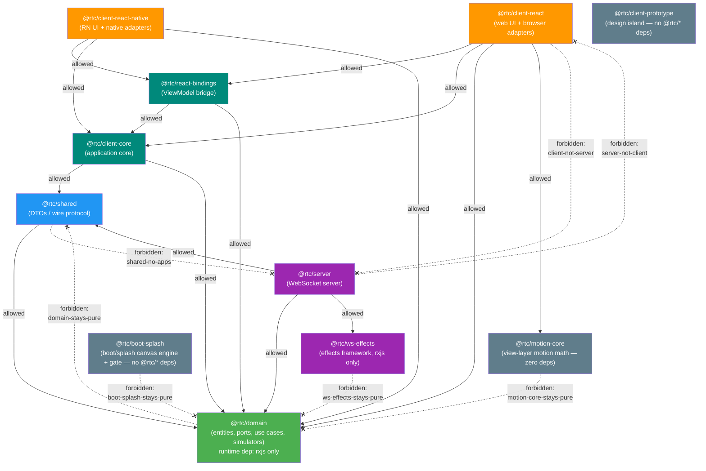

# dependency-cruiser configuration

`.dependency-cruiser.cjs` is the **executable form of the clean-architecture
layering** described in [architecture.md §6](./architecture/06-package-dependencies.md#6-package-dependencies):
"dependencies flow inward only." Where Biome's `noRestrictedImports` only sees a
single literal import string, dependency-cruiser resolves the **whole module
graph** — so it catches a forbidden layer crossing even when it happens
*transitively* through several intermediate modules.

It runs as a blocking gate:

```bash
pnpm check:deps   # depcruise --config .dependency-cruiser.cjs packages tests
```

and is wired into the CI `checks` job alongside the other static-analysis gates.

## The allowed dependency graph

Dependencies may only flow **inward** (toward `domain`). Every other internal
edge is forbidden.



Solid arrows are permitted imports; dashed crossed (`-.-x`) arrows are examples of
the edges the `forbidden` rules reject. `domain-stays-pure` forbids
`domain → shared` (and by extension `domain → client/server`);
`ws-effects-stays-pure` keeps the effects framework domain-blind;
`motion-core-stays-pure` keeps the view-layer motion-math package zero-dependency
-- stricter than the rxjs-only exception, since it forbids `rxjs` too;
`boot-splash-stays-pure` keeps the boot/splash canvas engine and gate a
zero-`@rtc/*`-dependency leaf the same way (unlike `motion-core`, it is allowed
to touch the DOM directly -- the canvas 2D context and `navigator`/`location`);
the apps may reach inward but never reach across to each other.

## The forbidden rules

All rules are `severity: "error"` — any match fails the gate. `.dependency-cruiser.cjs`
is the authoritative list; the table below is a readable summary of the
package-boundary rules.

**Closed-allowlist shape.** Every package-boundary rule is written as an
*allowlist*, not an enumerated blocklist:

```js
from: { path: "^packages/<pkg>/src" },
to:   { path: "^packages/", pathNot: "^packages/(<pkg>|<allowed>…)/" },
```

i.e. "from `<pkg>`, importing **any** package that is not `<pkg>` itself or one
of its explicitly-allowed dependencies is forbidden." This is deliberately
preferred over the older `to: { path: "^packages/(a|b|c|…)/" }` blocklist form,
which silently went stale whenever a package was added — the newcomer was in
nobody's list, so a leaf could import it undetected. With the allowlist form a
new package is forbidden by default until it is explicitly allowed. (The
`clients-never-import-each-other` rule has used this `pathNot` idiom all along.)

| Rule | `from` (source) | may import (everything else under `^packages/` is rejected) | Protects |
|------|-----------------|-------------------------------------------------------------|----------|
| `no-circular` | anything | — (rejects any module forming a cycle) | No import loops (type-only edges excluded) |
| `domain-stays-pure` | `^packages/domain/src` | nothing (`pathNot ^packages/domain/`) | Domain is the innermost layer — no internal deps |
| `domain-no-node-builtins` | `^packages/domain/src` (tests and `__testUtils__` excepted) | — (rejects Node built-ins, `dependencyTypes: ["core"]`) | Domain runs in any JS environment — browser, RN, Node |
| `shared-no-apps` | `^packages/shared/src` | `shared\|domain` | Shared may only reach inward to domain |
| `client-not-server` | `^packages/client-react/src` | — (rejects `^packages/server/`) | The two apps never couple |
| `server-not-client` | `^packages/server/src` | — (rejects `^packages/client-react/`) | (mirror of the above) |
| `ws-effects-stays-pure` | `^packages/ws-effects/src` | nothing (`pathNot ^packages/ws-effects/`) | The effects framework is domain-blind and app-agnostic (rxjs only) |
| `devtools-core-stays-pure` | `^packages/devtools-core/src` | nothing (`pathNot ^packages/devtools-core/`) | `@rtc/devtools-core` decorates by structural shape — no other `@rtc/*` package |
| `devtools-core-no-node-builtins` | `^packages/devtools-core/src` (tests and `__tests__/` excepted) | — (rejects Node built-ins) | `@rtc/devtools-core` must run in any JS environment |
| `devtools-app-protocol-only` | `^packages/devtools-app/src` | `devtools-app\|devtools-core` | `@rtc/devtools-app` understands only the wire protocol — `devtools-core` is its sole `@rtc/*` dependency |
| `devtools-relay-standalone` | `^packages/devtools-relay/src` | nothing (`pathNot ^packages/devtools-relay/`) | The ws-only relay holds no protocol knowledge — no `@rtc/*` package |
| `devtools-extension-is-a-leaf` | `^packages/devtools-extension/src` | `devtools-extension\|devtools-core\|devtools-app` | The MV3 extension is a leaf consumer of the devtools pair only |
| `client-core-stays-inner` | `^packages/client-core/src` | `client-core\|domain\|shared` | The shared application core reaches only inward — never bindings, a view leaf, a client, or the server |
| `client-core-framework-free` | `^packages/client-core/src` | — (rejects `react`/`react-dom`/`react-native`) | `client-core` stays framework-free by contract despite UI-facing consumers |
| `react-bindings-no-apps` | `^packages/react-bindings/src` | `react-bindings\|client-core\|domain` | The React↔RxJS bridge depends only inward, never on an app or the server |
| `solid-bindings-no-apps` | `^packages/solid-bindings/src` | `solid-bindings\|client-core\|domain` | The Solid↔RxJS bridge depends only inward, never on an app or the server |
| `ui-contract-stays-neutral` | `^packages/ui-contract/src` | `ui-contract\|client-core\|domain\|motion-core` | The framework-neutral UI-contract harness never depends on a concrete client, a binding, or the server |
| `clients-never-import-each-other` | `^packages/(client-react\|client-react-native\|client-prototype\|client-solid)/src` | — (rejects any *other* client, via `pathNot ^packages/$1/`) | Peer clients composed from the same core never import one another |
| `prototype-isolated` | `^packages/client-prototype/src` | nothing (`pathNot ^packages/client-prototype/`) | The design-comprehension island stays `react`/`react-dom` only — zero `@rtc/*` edges |
| `motion-core-stays-pure` | `^packages/motion-core/src` | nothing (`pathNot ^packages/motion-core/`) | The view-layer motion-math package stays a zero-dependency pure leaf |
| `boot-splash-stays-pure` | `^packages/boot-splash/src` | nothing (`pathNot ^packages/boot-splash/`) | The boot/splash canvas engine + gate stays a zero-`@rtc/*` leaf (DOM access to canvas/`navigator`/`location` is allowed) |

(Framework-only rules `solid-stays-react-free` and `react-clients-stay-solid-free`
guard the React/Solid split against `node_modules/(react\|solid-js)` and are
omitted from the package table.)

**Asymmetry to note:** each rule matches the *source* against `…/src` but the
allowlist is matched against the **bare package path** (e.g. `^packages/server/`),
so importing a server **test** file from the client is rejected too — not only
`server/src`.

**Full coverage:** every one of the eighteen workspace packages is either the
`from` of a package-boundary rule or reachable only inward. The pure leaves
(`domain`, `motion-core`, `boot-splash`, `ws-effects`, `devtools-core`,
`devtools-relay`, `client-prototype`) allow *nothing*; the bridges and harness
(`react-bindings`, `solid-bindings`, `ui-contract`, `client-core`) allow a small
inward set; the clients are guarded against each other and the server. Two
backstops complement these rules: `no-circular`, and pnpm strict mode (a package
cannot even resolve an **undeclared** `@rtc/*` import). The allowlist rules add
the layer pnpm-strict can't — a **declared but architecturally forbidden** edge
(e.g. adding `@rtc/client-react` to `motion-core`'s deps and importing it).

## The `options` block (how the graph is built)

```js
options: {
  tsPreCompilationDeps: false,
  tsConfig: { fileName: "tsconfig.depcruise.json" },
  doNotFollow: { path: "node_modules" },
  exclude: { path: "(\\.cache|/dist/|/__screenshots__/|\\.turbo)" },
  enhancedResolveOptions: {
    exportsFields: ["exports"],
    conditionNames: ["import", "types", "node", "default"],
  },
}
```

> **Resolution matters as much as the rules.** Seventeen of the eighteen
> packages publish `"." : "./dist/…"`. If the cruiser resolves an `@rtc/<pkg>`
> import to `packages/<pkg>/dist/index.js`, the `exclude: /dist/` below drops it
> from the graph — and in an unbuilt tree it resolves to a bare, unresolvable
> specifier instead. Either way the target never matches a rule's
> `^packages/…` pattern, so **every package-boundary rule silently matches
> nothing.** `tsconfig.depcruise.json` fixes this: it maps `@rtc/<pkg>` (and
> `@rtc/<pkg>/*` subpaths) to that package's **`src`**, so cross-package edges
> resolve to a real, non-excluded path and the rules actually fire, independent
> of whether `dist/` has been built. Before this mapping, only ~7 of ~603
> cross-`@rtc` edges were rule-checkable (the handful whose exports already
> point at `src`); after it, all 603 are.

- **`tsPreCompilationDeps: false`** — the most important line. It drops
  `import type` edges, which disappear after compilation. Counting them produces
  *phantom* cycles. Tools that count type edges (`madge`, `dpdm` without `-T`)
  report "4 circular dependencies" here; with type edges excluded the true count
  is **0**. (See the tool comparison in
  [tooling-roadmap.md §4](./tooling-roadmap.md#4-dependency-cruiser---circular-deps--architecture).)
- **`tsConfig: tsconfig.depcruise.json`** — a resolution-only tsconfig that
  extends `tsconfig.base.json` and adds `@rtc/<pkg>` → `packages/<pkg>/src`
  path mappings (see the callout above). It exists solely so the cruiser
  resolves cross-package imports to `src` rather than the excluded `dist`;
  it is not part of any `tsc` build. A new package needs a line pair here,
  the same way it needs a forbidden rule and a knip entry.
- **`doNotFollow: node_modules`** — map first-party code only; don't descend
  into third-party packages.
- **`exclude: (\.cache|/dist/|/__screenshots__/|\.turbo)`** — skip build
  artifacts: compiled `dist/`, Turborepo's `.turbo`, visual-test
  `__screenshots__`, and the Playwright-CT Vite host `.cache`. (The `.cache`
  entry exists because a Vite-bundled host cache produced a false `no-circular`
  during adoption — the cache is generated output, not source.)
- **`enhancedResolveOptions`** — `exportsFields` + `conditionNames` make the
  cruiser honor `package.json` `"exports"`/`"imports"`. This is how the repo's
  `#/` subpath-alias imports resolve to source files.

## Why this is stronger than the Biome ban

The Biome `noRestrictedImports` rule (`../../**`) bans deep relative imports by
inspecting the literal import string in a single file. It cannot see that
`client → shared → server` crosses a layer boundary, because each individual
import looks innocent. dependency-cruiser resolves the transitive graph, so the
layering holds even through indirection. The two are complementary: Biome keeps
import *strings* tidy; dependency-cruiser keeps the dependency *graph* legal.

## See also

- [architecture.md §1.3.1 — Clean Architecture, concretely](./architecture/01-overview.md#131-clean-architecture-concretely----which-package-is-which-ring) (the rings these rules compile, with a green/red enforcement view of this exact config)
- [architecture.md §6 — Package Dependencies](./architecture/06-package-dependencies.md#6-package-dependencies) (the prose rule this config enforces)
- [architecture.md §12 — Architectural Gates](./architecture/12-architectural-gates.md#12-architectural-gates) (the regex-based `grep-gates` that guard import boundaries inside the test suite)
- [tooling-roadmap.md §4 — dependency-cruiser](./tooling-roadmap.md#4-dependency-cruiser---circular-deps--architecture) (adoption rationale and the type-edge cycle finding)
