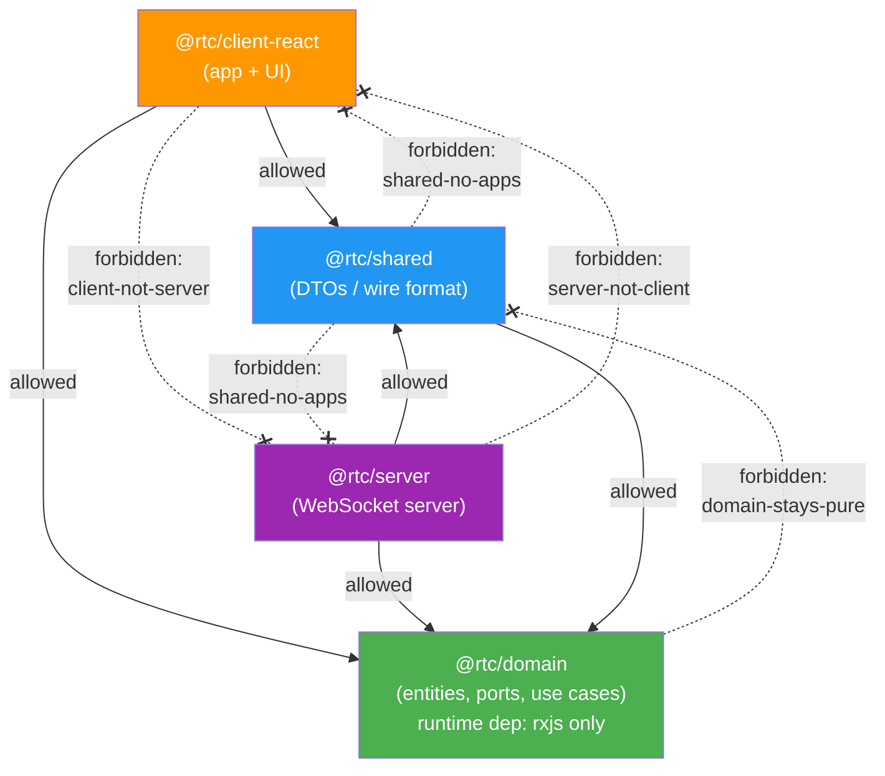

# dependency-cruiser configuration

`.dependency-cruiser.cjs` is the **executable form of the clean-architecture
layering** described in [architecture.md §6](./architecture.md#6-package-dependencies):
"dependencies flow inward only." Where Biome's `noRestrictedImports` only sees a
single literal import string, dependency-cruiser resolves the **whole module
graph** — so it catches a forbidden layer crossing even when it happens
*transitively* through several intermediate modules.

It runs as a blocking gate:

```bash
pnpm check:deps   # depcruise --config .dependency-cruiser.cjs packages tests
```

and is wired into the CI `checks` job alongside the other static-analysis gates.

## The allowed dependency graph

Dependencies may only flow **inward** (toward `domain`). Every other internal
edge is forbidden.



Solid arrows are permitted imports; dashed crossed (`-.-x`) arrows are the edges
the `forbidden` rules reject. `domain-stays-pure` forbids `domain → shared` (and
by extension `domain → client/server`); the apps may reach inward but never reach
across to each other.

## The 5 forbidden rules

All rules are `severity: "error"` — any match fails the gate.

| Rule | `from` (source) | `to` (rejected target) | Protects |
|------|-----------------|------------------------|----------|
| `no-circular` | anything | any module forming a cycle | No import loops (type-only edges excluded) |
| `domain-stays-pure` | `^packages/domain/src` | `^packages/(shared\|client-react\|server)/` | Domain is the innermost layer — no internal deps |
| `shared-no-apps` | `^packages/shared/src` | `^packages/(client-react\|server)/` | Shared may only reach inward to domain |
| `client-not-server` | `^packages/client-react/src` | `^packages/server/` | The two apps never couple |
| `server-not-client` | `^packages/server/src` | `^packages/client-react/` | (mirror of the above) |

**Asymmetry to note:** each rule matches the *source* against `…/src` but the
*target* against the **bare package path** (e.g. `^packages/server/`). So
importing a server **test** file from the client is rejected too — not only
`server/src`.

## The `options` block (how the graph is built)

```js
options: {
  tsPreCompilationDeps: false,
  tsConfig: { fileName: "tsconfig.base.json" },
  doNotFollow: { path: "node_modules" },
  exclude: { path: "(\\.cache|/dist/|/__screenshots__/|\\.turbo)" },
  enhancedResolveOptions: {
    exportsFields: ["exports"],
    conditionNames: ["import", "types", "node", "default"],
  },
}
```

- **`tsPreCompilationDeps: false`** — the most important line. It drops
  `import type` edges, which disappear after compilation. Counting them produces
  *phantom* cycles. Tools that count type edges (`madge`, `dpdm` without `-T`)
  report "4 circular dependencies" here; with type edges excluded the true count
  is **0**. (See the tool comparison in
  [tooling-roadmap.md §4](./tooling-roadmap.md#4-dependency-cruiser----circular-deps--architecture).)
- **`tsConfig: tsconfig.base.json`** — reads the repo's TS path mappings so
  aliased imports resolve to their real files.
- **`doNotFollow: node_modules`** — map first-party code only; don't descend
  into third-party packages.
- **`exclude: (\.cache|/dist/|/__screenshots__/|\.turbo)`** — skip build
  artifacts: compiled `dist/`, Turborepo's `.turbo`, visual-test
  `__screenshots__`, and the Playwright-CT Vite host `.cache`. (The `.cache`
  entry exists because a Vite-bundled host cache produced a false `no-circular`
  during adoption — the cache is generated output, not source.)
- **`enhancedResolveOptions`** — `exportsFields` + `conditionNames` make the
  cruiser honor `package.json` `"exports"`/`"imports"`. This is how the repo's
  `#/` subpath-alias imports resolve to source files.

## Why this is stronger than the Biome ban

The Biome `noRestrictedImports` rule (`../../**`) bans deep relative imports by
inspecting the literal import string in a single file. It cannot see that
`client → shared → server` crosses a layer boundary, because each individual
import looks innocent. dependency-cruiser resolves the transitive graph, so the
layering holds even through indirection. The two are complementary: Biome keeps
import *strings* tidy; dependency-cruiser keeps the dependency *graph* legal.

## See also

- [architecture.md §6 — Package Dependencies](./architecture.md#6-package-dependencies) (the prose rule this config enforces)
- [architecture.md §12 — Architectural Gates](./architecture.md#12-architectural-gates) (the regex-based `grep-gates` that guard import boundaries inside the test suite)
- [tooling-roadmap.md §4 — dependency-cruiser](./tooling-roadmap.md#4-dependency-cruiser----circular-deps--architecture) (adoption rationale and the type-edge cycle finding)
